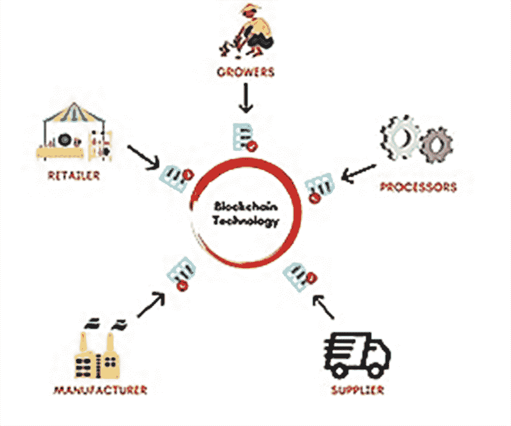
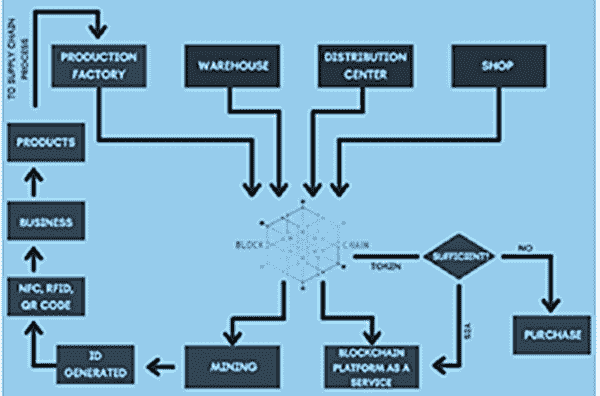

# 第六章

# 物流和供应链监控中的区块链

+   Krati Reja

    印度 VIT 博帕尔大学

+   Gaurav Choudhary

    丹麦技术大学，丹麦

+   Shishir Kumar Shandilya

    

    印度 VIT 博帕尔大学

+   Durgesh M. Sharma

    

    印度那格浦尔的 G.H.莱索尼工程学院

+   Ashish K. Sharma

    

    印度那格浦尔的 G.H.莱索尼工程学院

摘要

供应链管理（SCM）是管理货物和服务流动的系统，以及将原材料转化为成品的系统，它面临着一些需要解决的挑战，如向消费者提供优质服务，降低劳动成本等。工业界需要数字化实际资产，并进行分布式、不可变的交易，以追踪从制造到供应的资产。为了克服在供应链（SC）中企业资源规划系统中产品的透明度和可追溯性不足的问题，有必要采用一种能够有效追踪资产的方法，即分布式、不可变的记录所有交易的去中心化方法。区块链（BC）是一个遵循数字账本以数字方式交换实体的去中心化软件网络，并通过这种方式进行安全交易。因此，本章提议将 BC 集成到物流和 SC 监控中，通过提供 Python 和 Flask 如何与 SCM 系统一起使用 BC 的模板，以改进追溯性而不涉及任何中介。

引言

数字技术的使用在全球范围内迅速增长。互联网的快速增长和使用使商业发展和流程比以往任何时候都更加高效。数字化已经帮助解决了许多商业挑战（Tsiulin 等，2020 年）。供应链管理（SCM）是一个将公司的主要根源与客户连接起来管理货物和服务流动的系统，它包括将原材料转化为成品的全部操作。它是通过监督供应链（SC）操作来受益竞争对手并增强其消费者价值的方法。

供应链管理（SCM）是管理货物和服务流动的系统，以及将原材料转化为成品，但它面临着一些需要解决的挑战，如向消费者提供优质服务，降低劳动成本等。工业界需要数字化实际资产，并进行分布式、不可变的交易，以追踪从制造到供应的资产。为了克服

由于企业资源规划系统中供应链（SC）和物流问题中产品的透明度和可追溯性不足，有必要采用一种方法，可以有效地追踪资产从生产到供应的去中心化、不可变的记录所有交易。

供应链和物流监控包括需要实现的挑战，如缺乏信任，向消费者提供优质服务，可见性，市场快速发展导致的不可避免性，日益增加的欺诈活动量，降低劳动成本，原材料和能源，交货出现意外延迟，通过及时交付产品改善交易者之间的关系，缺乏可追溯性，通过在市场持续变化中通过产品交付时间满足消费者需求减少风险，为消费者及时提供培训的员工。

供应链中的这些挑战妨碍了供应链的每个阶段。这些挑战发生在计划、采购、生产、交付和退货等阶段。供应链管理（SCM）过程已经面临了这样的情况，与此同时，一种新的挑战以疫情的名义出现了，即 COVID-19。为了保护人们免受这一疫情的危害，整个国家都被完全封锁了，由此导致供应链流程受到严重影响，消费者的基本需求无法及时得到满足，在许多国家，人们死于饥饿。COVID-19 仍然在各国蔓延，并且扰乱着世界各国的经济。此外，尽管努力重振经济并使其运行，但持续的不确定性、缺乏客户信任和供应链挑战仍然带来压力。组织需要将物理资产数字化，并制作一个分布式、不可变的记录，使得能够追溯资产的制造、供应或消费者使用情况。

然而，在供应链和物流中的企业资源计划（ERP）系统中，产品的透明度和可追溯性不足。为了克服这个问题，需要采用一些技术或模型，可以有效地追溯资产从制造到供应或消费者使用的情况，以分散的、不可变的所有交易记录。区块链与物流和供应链监控的整合可以提供一个解决方案，将有助于解决供应链面临的所有这些挑战。

区块链是一个遵循数字分类帐的去中心化软件网络，以及一种无需仲裁者进行安全交易的方式。区块链通过存储数据的方式与中央数据库不同（Tijan 等人，2019）。区块链是由计算机网络节点分散控制的固定时间框架下的数据链记录。这是一种数字交换实体的方法。

实体，例如销售契约、货币和选票，可以通过在区块链网络上进行标记、存储和交换来进行编码。区块链技术在医疗保健、教育领域、投票机制、汽车工业、个人身份安全以及供应链监控等方面有许多应用（Sharma 等人，2021）。不同类型的数据可以存储在区块链中。最常见的类型是用于供应链监控的交易记录。区块链将存储有助于追溯产品的产品数据。由于数据是不可变的和去中心化的，它建立了不同各方之间的信任。区块链将数据收集在称为区块的组中，并且区块链有特定的空间来存储数据或信息；当它填满时，它会与上一个区块链接在一起（链是哈希到上一个区块），当需要添加任何新数据时，然后将其添加到新区块中，区块链中的每个区块都包括时间戳，说明区块何时连接到链上。一旦存储在区块链中的任何内容，尤其是已经通过普遍一致同意的内容（共识），就很难返回并修改。由于区块包含其哈希、上一个区块的哈希和时间戳（数学函数计算哈希），如果区块链中的任何参与者更改其数据副本，则哈希将更改，它将与其他副本不匹配，因此所有其他参与者都将知道数据已被修改。区块链可以应用于许多需要透明性、安全性、可追溯性等方面的领域。

区块链可以通过实现更快速、更具成本效益的产品交付、增强产品的可追溯性、改善合作伙伴间的协调，以及帮助获得融资，从而极大地改善供应链。如今，区块链是一种领先的技术，正在普遍实施。它以安全和分布式的方式强制应用，因此可以在一定程度上保证可靠性。由于这些原因，区块链技术已经在一个不信任的社会中被采纳。供应链连接着公司的主要根源与其客户。它涉及将原材料转化为最终产品，这将为客户提供服务。然而，这个过程遇到了一些必须用技术来解决的困难，因为技术和互联网的使用在全球范围内得到了很大的扩展；用技术解决这些困难将有利于客户，因为全球范围内的客户可以简单地管理。对数据的任何更改都将对区块链中的每个参与者可见，因此它将提高可见性。此外，区块链增强了快速准确地定位潜在污染源的能力，以便有效地预防、控制或纠正爆发。区块链可以在供应链中实现更透明、更准确的端到端跟踪：组织可以数字化实物资产，并创建所有交易的去中心化不可变记录，从而可以追踪资产从生产到交付或最终用户使用的过程。通过这种方式，区块链可以提高供应链中的可追溯性。

将区块链技术与供应链监控集成将有助于克服供应链行业所面临的挑战。它为区块链内的所有参与者提供了相同的可见性。使用集中授权数据库会降低各方之间的信任；供应链中的参与者总是需要依赖第三方来管理存储在数据库中的信息。使用区块链，一些研究人员提出了一种改善商业流程中信任、可见性和可追溯性的模型。然而，文献调查中的一些模型仅提供了理论解释，并且在解释其实际实施方面存在缺失（Jabbar 等人，2021），而一些模型则不具成本效益（Mao 等人，2018）。将区块链与供应链集成可以是一种解决方案（Issaoui 等人，2019）。但由于人们对知识的缺乏以及许多其他因素，许多供应链组织在该领域没有采用区块链。集中控制数据库的帮助降低了各方之间的依赖；供应链中的成员总是需要信任第三方来处理存储在数据库中的信息。一些研究工作者提出了通过区块链提高商业实践中信任、透明度和可追溯性的原型。许多跨国组织，如 IBM、Oracle 和 Microsoft，已经提供了采用区块链并通过供应链跟踪其产品的良好示例，称为 BaaS（区块链即服务），很快这种技术将在每个领域普及。将区块链与物联网等不同技术集成将使区块链技术达到新的高度。各种组织已经启动了许多新的倡议，例如试点项目 Everledger，以将供应链与区块链集成。

因此，本研究提出利用 Python 中的逻辑模型将区块链集成到 SCM 和物流中。目标是定义区块链如何通过建议实现一种方法来实现更好的供应链和物流的可追溯性和透明度，以执行像添加新区块到链中，执行交易，实施和验证工作证明等基本功能的区块链的方法，使用 Flask 框架进行新交易的方法，挖掘新区块等，并建议了一个模板代码来进行上述讨论过的过程的实施。因此，该研究将提高组织在供应链管理方面的信心，并通过为区块链开发人员提供一个关于如何在不涉及任何中间人的情况下使用 Python 和 Flask 进行区块链的模板，以提高可追溯性。最后，本研究讨论了以下挑战：与集中式控制相比，当区块链与供应链集成时，交易处理速度因分散控制而降低，由于不同的区块链平台具有不同的协议，会出现不兼容问题，具有较少节点的区块链在网络中更容易受到攻击的风险较高，这一差距激励研究人员将这个提出的原型模型变得更加安全可靠。预计会建立一个适当的解决方案来解决本章指出的技术缺陷，并引入适当的实践实施，作为未来的方向，这为区块链与物流和供应链监控模型的集成留下了更广泛的范围。

本章分为以下几节。第一节涵盖了区块链和供应链管理模型。接下来的一节讨论了供应链的问题陈述。第三节分析了各种研究工作者对与供应链流程管理的区块链进行的调查。第四节讨论了区块链和供应链管理的背景。接下来的一节提出了区块链与供应链管理整合的解决方案和结果，最后讨论了挑战以及其未来方向，然后以总结形式结束了整个调查。

相关工作

区块链是一种新兴技术，极大地提高了企业、供应链、银行和其他交易网络的透明度、可追溯性、可扩展性和安全性，为增长和创新创造了新机遇，降低了相关业务操作和成本的风险。克林斯等人在其研究中阐明了区块链技术为供应链装备提供的前景（克林斯，K.，& 施瓦布，2021）。已经发表了大量研究来概述供应链管理中的挑战、设计问题和各种未来研究，也在表 1 中进行了讨论。宋等人的研究主要关注区块链对供应链可追溯性的影响，通过当前的业务应用，即物流、质量保证、库存控制和预测。该论文详细阐述了区块链的特性如何有助于供应链，并且区块链对供应链管理的益处。它还阐明了区块链相比传统的中心化系统在供应链追溯性方面的更多机会。然而，它在阐述如何将区块链用于改善供应链管理的追溯性方面有所不足（宋等人，2019）。

Hellani 等人聚焦于供应链透明度的必要性和困难。之后，他们检查了一系列解决数据透明性问题的供应链项目，通过在其核心平台上以多种方式应用区块链来处理。此外，他们研究了项目的方法和用于修改透明度的工具。作为对项目的研究结果，他们认识到需要进一步改进以在数据透明性和几个合作伙伴所需的过程不透明性之间建立稳定性，以确保其程序的隐私并控制对敏感数据的访问（Hellani 等人，2021）。Paliwal 等人发现了区块链技术在可持续供应链管理中的作用。为了回应研究问题，该研究创建了一个使用 5W+1H 模式的模型：who、where、what、when 和 how。该论文提出了一个基于接地理论和技术意愿水平的可重复使用的分类框架（ETLCL）的模型，用于在几个发展技术的重点领域进行文献调查。研究结果证明了可追溯性和可见性是采用区块链技术的主要关注点。这项研究的局限性在于，这一领域已经引起了学术界和组织界的更多关注，并且预计未来文献数量会增加，因为越来越多的公司采用区块链（Paliwal 等人，2020）。

Perboli 等人为准备一个计划以发展和验证完整的区块链解决方案并将其纳入企业计划定义了一种典型的方法论。该论文讨论了区块链如何帮助减少物流支出、优化流程以及研究挑战。GUEST 方法分为五个阶段（GO、UNIFORM、EVALUATE、SOLVE 和 TEST）。在这种方法中，需要充分定义供应链流程中涉及的重要参与者、他们的工作和努力；否则，该方法将不会高效且具有成本效益（Perboli et al., 2018）。

Weber 等人提出了一种区块链模型，用于解决协同业务中的信任问题，其中两个或更多公司需要运行业务流程。该研究侧重于展示业务流程模型（BPM）。通过采用以太坊作为区块链和 Solidity 作为智能合约，实现了如何增加 2 方之间信任的案例或原型，并通过将其应用于文献部分中的业务模型进行了验证（Weber 等人，2016）。

Guerreiro 等人提出了一个基于 BPM 的模型，为使用区块链和公司操作系统（企业）进行安全和保护交易提供了一个完美的模型。该研究旨在解决执行业务交易所涉及的潜在风险，建立信任、可见性和可追溯性，以抵御任何欺诈行为，并增加真实性（Guerreiro 等人，2013）。

Leng 等人提出了一个基于双链设计的农业供应链系统的公共区块链，以提高区块链在农业供应链中的生产力。他们的研究表明，他们提出的方法为公共服务平台提供了灵活的寻租和匹配机制。此外，该解决方案确保了交易信息的可见性、安全性和安全性，并为组织信息提供了隐私。因此，该模型使公共服务平台和整个系统的效率更高。主要限制是区块链网络的规模和由于网络的广泛而导致的性能较慢（Leng 等人，2018）。

毛等人提出了一种使用区块链技术来规范和管理食品行业供应链的信用评估系统。该模型通过区块链技术的智能合约从买家那里收集信用评估文本，然后这些收集到的文本通过深度学习技术长短期记忆（LSTM）进行评估。该研究旨在展示他们模型的效率，但没有清楚地研究完整系统的成本和利润（Mao 等人，2018）。

Sripathi 进行了调查和研究，以回答-早期采用存在哪些风险，组织的规模如何，公司的 IT 投资如何，以及供应链中的股东数量如何影响食品公司实施区块链技术？” 本文旨在了解上述特征如何影响食品公司供应链中区块链技术的使用。研究还阐述了区块链如何在供应链中被用于追踪全球食品，并确保由沃尔玛、雀巢、斐济等公司供应的食品是安全和卫生的。研究提出了三个假设，可以分析和回答研究问题。本文没有详细说明如何使用 RFID、NFC 标签来追踪产品。假设需要经过统计测试，并且需要一项调查来支持假设（Sripathi，2019）。

Aliyu 等人讨论了供应链管理如何使用其中一种区块链技术应用程序来改进和整合他们的交易和活动的过程，方法是通过连接一个广泛的智能手机应用程序，该应用程序将连接 SC 过程中的所有参与者或行为者或与网络中的区块链技术相关的人员，以插入、检索、存储、管理或区分信息。文章还概述了沃尔玛计划如何使用区块链超级账本来追踪商品的来源。最后，本文还提供了 SC 面临的某些挑战，以及如何使用区块链技术，特别是超级账本，来消除这些挑战（Aliyu 等人，2018）。

表 1. 区块链技术分析表中的作者贡献

| 相关工作 | 主要贡献 | 成本效益 | 方法论 | 使用案例 | 可追溯性和透明度 |
| --- | --- | --- | --- | --- | --- |
| Song 等人，2019 | 重点关注区块链在供应链可追溯性方面的影响，以及当前行业应用 | -- | 否 | 否 | 是 |
| Sripathi，2019 | 本文的研究可能性在于理解和建议一些变量如何影响食品供应链中对区块链的采用。 | -- | 否 | 是 | 是 |
| Paliwal 等人，2020 | 它调查了区块链技术在可持续供应链管理中的作用 | -- | 是 | 否 | 是 |
| Mao 等人，2018 | 它提出了一种基于区块链的信用评估系统，以提高食品供应链中的监管和管理效率。 | 否 | 是 | 否 | 是 |
| Leng 等人，2018 | 它提出了一种基于双链设计的农业供应链系统的公共区块链，以提高区块链在农业供应链中的有效性。 | 是 | 是 | 否 | 是 |

| Guerreiro 等人，2013

. | 它提出了一种企业操作系统，集成了区块链，用于执行安全的商业交易 | 是 | 是 | 否 | 是 |

| Weber 等人，2016 | 它提出了一种解决方案

缺乏

在联合方法中的信任问题 | 是 | 是 | 否 | 否 |

| Aliyu 等人，2018 | 它讨论了供应链管理如何使用其中之一

区块链技术

应用 | -- | 否 | 是 | -- |

| Perboli 等人，2018 | 它定义了一种典型方法，用于准备计划，以发展和验证完整的区块链解决方案，并将其纳入企业计划 | 是 | 是 | 是 | -- |
| --- | --- | --- | --- | --- | --- |

背景

区块链和供应链

区块链可以定义为一个分布式和去中心化的数据库，可以存储交易记录，并确保透明度、可追溯性、安全性和不可变性。它也被称为一系列存储交易数据的区块链，不受任何单一机构控制。存储在区块链中的交易记录被时间戳记，这意味着任何交易被添加到一个区块的时间也将成为该区块的一部分(Chang & Chen, 2020)。区块链是一个由多台计算机或节点连接在一起的系统，它作为一个分布式网络在互联网上运行(Abeyratne & Monfared, 2016)。区块链网络中的每个节点都有权创建一个交易、验证一个交易、接受一个交易，并生成一个区块。区块链是一系列通过密码学链接在一起的区块(记录集)。由于区块链的不可变性，当我们在区块链中插入一组交易时，插入的区块成为区块链网络的一部分，然后没有人可以反对或修改它。区块链网络中的每个节点都有一个存储交易的数据库的个人复制品。区块链网络中的任何人，授权的参与者都可以随时检查或使用数据库中的交易历史，并在每次节点将任何新的交易(块)附加到链中时接收修订后的数据。私有、联盟或混合区块链可以被一个不想与他人分享每一个细节的组织使用。在这些类型的区块链中，一个组织可以控制和限制谁可以成为该区块链的一部分。然而，私有区块链比公共区块链不太安全，建立信任有点复杂。然而，这完全取决于组织想要使用的区块链网络的类型(公共、私有)。将区块链与传统的集中式解决方案进行比较，可以提供不可变性、透明度、可追溯性、信任和更高的安全性。图 1 展示了区块链技术在 SC 和物流、制造商、零售商、种植者、医疗保健、安全投票、金融、教育等许多领域的应用。

供应链是公司与其供应商之间的连接或网络，用于制造和交付成品或商品给客户。 供应链管理代表了最终产品如何安全地到达买家并发挥其作用。 物流是供应链的子部分，因为物流将货物从一个地方移动到另一个地方（Dobrovnik 等，2018 年），因此跟踪产品是否到达客户是必要的。 质量功能展开（QFD）方法是确定基于客户的策略的最可靠和证明过的方法。 QFD 可以帮助确定关键客户需求并对其进行优先排序，以确定改进供应链性能的关键供应链因素。 许多人在不同领域报告了 QFD 的使用。 尤其是在预测和网站设计方面讨论了 QFD 的实用性（Sharma 和 Khandait，2016 年），（Purohit 和 Sharma，2015 年），（Sharma 和 Khandait，2017 年），（Sharma 等，2009 年）。 然而，供应链和物流在安全性，可见性，各种操作的透明性，交易问题，手动错误，处理，更新或共享数据和信息的延迟，交付货物和服务的速度，以及跟踪和追溯货物和服务来源方面面临困难和挑战。 可以克服这些缺点之一的技术是在 SCM 中应用区块链。

| 图 1. 区块链在供应链中的应用。 |
| --- |
|  |

区块链在供应链监控（SCM）中的作用

区块链在 SCM 中起着重要作用。区块链在合作伙伴之间建立了沟通。这建立了一个流程更加流畅的流程，缩短了交货时间，减少了冗余，减少了延迟，最终实现了更精简的供应链。它还确保了质量标准得到满足，使卖方对产品的生产从头到尾都更加控制。区块链可以通过对企业供应链进行映射和可视化来利用追溯性，以提高操作效率。对产品信息的不断增加的需求也是强调区块链追溯性需求的一个显着因素。区块链可以实现更透明、更准确的端到端跟踪供应链：组织可以数字化实物资产，并创建所有交易的分散不可变记录，从而可以追踪资产从生产到交付或最终用户使用。

SC 和物流领域面临的挑战，如安全性、可见性、各种操作的透明度、交易问题、手工错误、处理、更新或共享数据和信息的延迟，以及交付货物和服务的速度，都可以通过区块链来解决，因为它提供了透明度、可追溯性、不可变性、信任和安全性。 SCM 有三种不同类别的流程：物料流、数据流和资金流。物料流涉及将产品和货物从一个点移动到另一个点，数据流是从生产点到利用这些货物的点发生的传输过程，而资金流则包括在过程中生产的每个产品或货物的费用。区块链技术将处理供应链流程的所有这些基本流程。此外，区块链技术还有几个应用，将有助于改变供应链流程如何进行管理和其他业务活动（Aliyu，2018 年）。

区块链与物联网的整合

第一个区块链平台是以加密货币形式提出的比特币。它提供了一种快速、廉价和简单的交易存储技术，可在物联网领域中作为安全支付系统的应用；自主设备可以使用比特币进行微支付，主要作为钱包运行（Villegas-Ch，2020）。然而，一旦将区块链的使用限制在微支付范围内，与货币相关的应用程序就会产生缺点，因为在与物联网集成时，使用智能合约表达是一个标准答案。

提出了许多平台来将区块链与物联网集成，也在表 2 中讨论了这一点。

以智能合约为主的以太坊是其中一个成熟的区块链之一。以太坊被描述为一个具有内置编程语言（Solidity）和基于共识的（普遍协议）全球运行的虚拟机（以太坊虚拟机 EVM）的区块链。在智能合约的存在下，将区块链从货币中移开，并允许将此技术结合到新领域中。

Hyperledger 是一个公开可访问的平台，已经引入了与区块链相关的几个项目（Kamath, 2018）。Fabric 是一个许可的区块链网络，并且没有加密货币，许多基于区块链平台的商业应用程序都是 IBM 推出的。利用 IBM Watson 物联网平台，将物联网单元与 Fabric 集成，为区块链提供数据，以调节设备并允许数据清理和分析。

多链平台创建了私有区块链，部署为物联网区块链应用程序的概念证明之一，其中之一是 Arduino 板。

莱特币类似于比特币，但具有快速交易验证时间、更高的存储效率、减少生成区块时间（从 10 分钟到 2.5 分钟）以及基于 scrypt 的工作量证明（PoW），这是一种以内存为中心的基于密码的基本派生函数。此外，节点的计算需求较少，因此在物联网中更为合适。

Lisk 是一个分散式应用程序，提供了一个由子区块链组成的区块链平台和一种使用加密货币的方式，它是由 javascript 开发人员使用的。它与 Chain of Things 合作，以发现区块链技术是否有助于在物联网中获得安全性（Reyna, 2018）。

表 2. 区块链与物联网的整合

| 平台 | 区块链 | 加密货币 | 智能合约 |
| --- | --- | --- | --- |
| 以太坊 | 公共和基于许可 | 以太 | 是 |
| 超级账本面料 | 基于许可 | 无 | 是 |
| Multichain | 基于许可 | 多货币 | 是 |
| Litecoin | 公共 | Litecoins | 否 |
| Lisk | 公共和基于许可 | LSK | 是 |

Everledger

Everledger 是一个独立的平台，旨在为任何物体的起源、特征和权利提供安全稳定的数字数据。钻石、葡萄酒、奢侈品、艺术品等提供了产品的可追溯性和真实性。Everledger 使用区块链技术，可以增加人们对购买商品的信任。使用 Everledger 平台，生产者、买家、制造商和卖家可以追溯其产品的来源、权利和特征。该平台得到了腾讯、澳大利亚区块链、逆向物流、Moyo gems 等许多机构的信任。

试点项目

区块链技术将作为试点与 KPMG、沃尔玛、IBM 等合作，用于跟踪和识别处方药（Aliyu，2018；Kamath，2018）。企业将组建一个联合的许可区块链网络，用于即时观察产品。区块链网络需要减少详细清单追踪的时间，并提供可信分布式信息的轻松检索。通过区块链技术，该项目还将提高不同网络关联方之间协作数据的效率，并有助于监管分销链中产品的可靠性。每个企业都将在项目中发挥专业知识。

提议的解决方案

系统模型

区块链具有多种应用领域，如医疗保健、教育系统、投票系统、供应链和管理。为了支持区块链在 SCM 中的整合，我们提出了一个模型，借助图 2 的帮助，可以将其视为支持供应链管理的区块链逻辑模型：

+   • 每个从事供应链管理的组织都需要对其产品进行适当的可追溯性。因此，决定采用区块链来追踪其生产产品的组织，会为其供应链请求跟踪服务。

+   • 将根据输入系统的项目数量生成一个 ID（唯一身份号）。该 ID 将通过挖掘过程生成，比如 PoW（工作证明）。

+   • 成功生成 ID 的矿工将获得一个代币作为奖励。

+   • 将引入两种不同类型的代币 - 一种用于任何金融和商业活动的智能支付货币（我们将这个代币称为 X），另一种用于智能合约的运行和区块链上应用程序的运行（我们将这个代币称为 Y）。Y 代币将用于奖励矿工。

+   • 生成的 ID 将被编码到组织内部嵌入的物联网设备（RFID 跟踪器、NFS 芯片、QR 码等）中，以跟踪物品的整个生命周期。

+   • 组织将使用这些带有 ID 编码的物联网设备在其制造的产品上。

+   • 随着产品移动到不同的地方或部门，如生产工厂、仓库、配送中心、物流、批发或零售店等，所有与产品追踪相关的记录都将更新到区块链服务中。

+   • 所有与利益相关者之间的交易相关的编程逻辑将被编码在智能合约中，这将需要代币进行处理。

+   • 如果代币不足以处理任何交易，可以购买。

+   • X 是这个区块链的智能货币。例如，法定货币（不受任何贵金属支持的货币）可以通过 Gemini 或 GDAX（这些是加密货币交易所，允许人们购买、出售和交易数字货币）兑换成比特币，然后进一步兑换成 X。

+   • 要使用这个区块链运行任何业务活动，将使用智能加密货币 X，并且可以通过购买和将法定货币兑换成比特币，然后再兑换成 X 来解决任何代币不足的问题。

| 图 2\. 系统模型的工作方式。 |
| --- |
|  |

实施

对于创建区块链，我们可以始终使用市场上已经构建和测试过的开源平台，例如 Hyperlegder Fabric、BigchainDB、Multichain、open-chain 等。但是，假设任何组织都旨在创建一个专门为该组织服务的区块链。在这种情况下，我们可以使用 Python 来创建区块链，它执行区块链的基本功能，如将新区块添加到链中、执行交易并将其添加到交易列表中、计算哈希值的功能、返回链的最后一个区块的功能、实现工作量证明以及验证工作量证明（PoW）的功能，然后我们将使用 Flask 来将我们的区块链表示为 API。通过本章，以下是使用 Python 如何创建区块链并执行基本功能的蓝图，带有算法的帮助：

+   • 区块链类将维护链，因为它将存储交易，其他方法将用于在链中附加新区块。

+   • 链中的任何区块都将包含索引（表示该区块的特定编号）、时间戳（UNIX 时间）、交易列表、PoW 和上一个区块的哈希值。

+   • 现在，要将任何交易添加到区块中，将使用 NewTransaction() 方法，此方法将接受 sender（字符串：发件人地址）、receiver（字符串：收件人地址）、amount（int）并最终返回具有此新交易的特定区块的索引，然后它将在 CurrentTransaction[] 列表中附加发送者、接收者、金额的详细信息。

+   • 首先，我们将通过调用 NewBlock 方法（PreviousHash=1，proof=100）来创建创世块（链的第一个块），在这里，我们将定义块的参数/参数，因此根据给定的参数，它将创建链的创世块。

+   • 对于 NewBlock()方法，该方法将在链中创建新块；该方法将以证明、PreviousHash 作为参数，该证明将由代码中使用的 PoW 算法给出。最终将返回一个新的块作为字典，其中块变量将被定义为一个字典，其中包含索引（由 len(chain)+1 计算得出）、时间戳、交易（获取代码中声明的 CurrentTransaction 列表）、证明、PreviousHash（使用 hash(chain[-1]计算，这将对列表中的最后一个元素进行散列，变量名为 chain）。

+   • 创建新块后，通过将其定义为空列表来重置 CurrentTransaction 列表。

+   • 将块附加到程序中定义的链列表中，变量名为 chain。

+   • rear block 方法将返回列表 chain 中的实际块。

+   • hash 方法将使用 SHA-256 散列算法创建上一个块的哈希。该方法将包含以字典形式的块作为参数。使用 Hashlib 中的 hexdigest()，我们将得到块的哈希。

+   • 将创建一个工作证明（PoW）方法，用于在此处挖掘块；我们将定义算法，使矿工需要搜索一个数字 n，当与前一个块的哈希散列时，将生成具有四个前导 0 的哈希。

+   • 还将创建一个 ValidProof()方法来验证工作证明是否有效，即根据定义的算法，证明是否具有四个前导 0。如果我们想要增加矿工找到 n 的值的难度，我们可以增加算法中的前导零。增加一个前导零将使其更加困难，找到解决方案所需的时间也将增加。

+   • 为了使我们的区块链成为 API，我们将使用 Flask 框架。

+   • 在 Flask 中，我们将创建 3 个方法：NewTransaction（向区块添加新交易）、mining（挖掘新区块）、FullChain（它将返回完整的区块链）

+   • 现在我们将在代码中导入 Flask、request 库。首先我们将实例化我们的区块链类。

+   • 对于 NewTransaction 方法，我们将从用户处获取输入，因此它将是一个 POST 方法。当用户发送交易的所有数据，如发送者、接收者和金额时，交易将附加到区块上。

+   • 对于挖矿方法，它将是一个 GET 请求，它将执行三个任务：计算 PoW、奖励矿工和将新区块附加到链上。

+   • 要创建去中心化的区块链，一个节点需要知道其相邻节点。网络中的每个节点都应包含一个额外节点的列表。因此，将创建两个方法 /NodeRegistry（它将接受新节点的列表）和 NodeSettle（它将确保节点具有正确的链）。

+   • Set() 将用于携带新节点列表，因为我们知道集合允许唯一值，所以无论节点被添加多少次，只有一个条目会被考虑。

+   • 每当一个单独的节点没有与另一个相同的链时，我们的最长链将是真实的，以解决这个问题。

+   • 函数 ValidChain() 将循环遍历每个区块并验证哈希和证明。

+   • 对于解决冲突，我们将检查是否存在比我们更长的良好链，然后将其替换为最长链。

提议算法。代码模板如下：

类 BC(object):

defi ___initialize___(self):

defi ___initialize___(self):

self.chain = []

self.CurrentTransactions = []

defi NewBlock(self) :

#创建一个新的区块并将其附加到链上

: parameter proof: <int> 使用 POW 算法计算的证明

: parameter PreviousHash:<str> 前一区块的哈希值

: return <dict> 新区块 // 键值对

” ” ”

defi TransactionNew(self):

# 将一个新的交易附加到交易列表中

” ” ”

创建一个新的交易以进入稍后被挖掘的区块

: 参数 source: <stri> 发件人地址

: 参数 receiver: <stri> 收件人地址

: 参数 amount: <int> 数量

: 返回 <int> 将保留交易的区块的目录

” ” ”

@静态方法

defi hash(block):

# 对区块进行哈希处理

” ” ”

对一个区块进行 SHA-256 哈希

: 参数 block: <dict> 区块

: 返回: <str>

” ” ”

@属性

defi LastBlock (self):

# 返回链中的前一个区块

返回 self.chain[-1]

结果

结果呈现了改善可追溯性和透明度的区块链模型。目的是评估一个能够帮助组织克服供应链监测问题的模型。该模型定义了组织制造的产品将如何使用诸如 RFID、QR 码等传感器与区块链相链接。该模型建议创建一个带有其智能货币进行交易和用于奖励矿工的数字货币的区块链。任何法定货币都可以兑换成比特币，然后按照模型建议的方式转换成区块链使用的货币。模型生成的 id 将用于追踪产品。展示了如何使用 Python 和 Flask 构建区块链的实现。

给出了一个适当的算法，显示了如何使用 Python 和 Flask 以及代码模板来正确理解概念。将来，它可以帮助使用其他技术方面产生更好的区块链解决方案。与集中式数据库相比，它具有创建、更新和删除选项，而模型中提供的解决方案是一旦产品被添加到区块中，就不能被删除或更改。与任何集中式数据库软件相比，该模型将在供应链中提供更多透明度。为了提高供应链管理中的可追溯性和透明度，区块链技术将是一个重要的帮助。许多处理供应链的公司正在采用区块链，而不是像 Oracle SCM、E2open、SAP SCM、logility 等集中式 ERP 软件。本章中提出的模型将帮助组织跟踪账单和付款。

组织正在从集中式软件转向区块链，因为攻击者很难接管整个区块链。如果区块链中的任何一个节点受到攻击，并且该特定区块的数据丢失，也不会造成太大影响，因为区块链是一个去中心化的分类帐，所有记录或交易都被共享到网络的每个节点/对等方，因此数据不会丢失；但如果使用集中式软件，如果受到攻击，所有数据都将丢失，如果没有备份该特定数据。预计区块链市场将从 2017 年的 8200 万美元增长到 2023 年的 3486 亿美元。研究论文中提出的模型将为供应链监测增加更多的效率和透明度（可见性），并在利益相关者之间建立信心。该模型的主要目标是消除中间方，并旨在开发一个具有更高可用性的去中心化系统。

讨论

将区块链与供应链监测相结合将提高整个系统的追溯性和透明性（Abeyratne & Monfared，2016）。它将建立信任并为客户提供高价值。区块链与物联网的整合已经帮助组织使用 RFID 卡、传感器等将其产品加载到区块链上，以跟踪产品的位置等。

追溯性：所讨论的区块链系统模型是一种分布式共享账本技术。它将通过其一般协议（即所谓的共识）机制和分布式账本来改善追溯性和透明性。在区块链平台上的每个参与节点都在分布式账本中保存和验证交易记录。供应链中的主要角色包括制造商、供应商、运输商、供应商和消费者，他们在网络中的每个节点上都有交易记录，并且有权限监视产品的生命周期。

信任：该模型将提供一个可信赖的环境，而不依赖或信任任何单一实体（Weber 等，2016）。在任何传统模型中，不相信彼此的利益相关者需要依赖所有人都信任的第三方。区块链消除了对任何第三方的信任需求。论文中讨论的模型将允许区块链中的利益相关者或任何参与者建立可信的合作关系，因为任何单一实体都不会处理它。通过使用 RFID 卡、QR 码传感器等加载到区块链中的有关产品的每个细节都将在所有参与者之间共享，因此将有完整的可见性。

隐私：在公共区块链中无法获得数据隐私。在公共区块链中，任何人都可以加入网络，因为不需要事先获得许可来添加到区块链网络，并且网络中共享的所有信息都是公开的。因此，组织可以选择权限区块链，其中将包括组织信任的各方以及参与该组织产品供应链流程的各方。此外，即使组织可以加密数据有效负载，也可以对任何公开可用的流程状态进行加密。

结论

区块链技术的采用已经被证明是一个有益的供应链可追溯系统。将区块链与其他新技术整合将提高其透明度，可追溯性，以跟踪供应链中的物料流动。该论文旨在审查区块链如何在供应链中提高追溯性而不涉及任何中介。本文提供了一个区块链模型，将有助于解码如何利用区块链来跟踪产品。该论文还提供了一个关于如何使用 Python 和 Flask 创建一个区块链的模板，该区块链在未来可以改进并提供更多的区块链技术功能。区块链的应用在论文中提到了一些技术限制，包括存储能力，可扩展性，互操作性和安全性（51％攻击），预计在应用于供应链管理领域时将得到改善。由于存在技术问题和一些组织问题（缺乏意识和理解，合作较少等），在供应链和物流中实施区块链的平均水平。尽管如此，它将很快赢得大多数供应链管理组织的信心。至于未来的结果机会，预计将建立适当的解决方案来解决本章指出的技术缺陷，并将引入适当的实际实施。许多跨国组织已经开始采取措施利用区块链监控供应链，并取得了令人鼓舞的成果。

挑战与未来工作

越来越多的公司表现出了接受区块链技术的兴趣，因为它的优势包括去中心化，分布式账本，可见性，可追溯性等，但现在许多公司正在解决区块链的技术挑战，例如存储能力，可扩展性，互操作性，51％攻击（Reyna 等，2018 年; Aliyu 等，2018 年）。

+   • 存储容量和可伸缩性：与集中式软件相比，区块链网络中处理交易的速度较慢（Reyna 等，2018 年）。例如，Visa 每秒可以处理 2000 笔交易，而与比特币区块链相比，它发现比特币区块链只能处理 3 到 7 笔交易，以太坊大约可以处理 20 笔交易。当将区块链与实时产生大量数据的物联网设备集成时，区块链并不被建议用来存储大量数据，因为物联网设备是实时产生数据的。一些研究人员提出了不同的技术来清理数据并压缩物联网数据。

+   • 互操作性：不同的区块链平台具有不同的协议、共识机制、编程语言、安全性和隐私措施。由于缺乏通用标准化，不同网络之间的通信变得困难。这种跨区块链平台的统一性使得该技术难以被大规模采用。现在有一些平台，如 Ark，采用智能桥梁架构来解决这一挑战。需要进行更多的研究和未来工作，以解决这一挑战。

+   • 安全性（51%攻击）：当前的区块链技术存在 51%攻击的可能性。在这种攻击中，一组矿工试图控制超过网络挖矿算力、计算能力或哈希率的 50%，并有能力控制区块链。节点数量较少的区块链容易受到 51%攻击的威胁（Aliyu 等，2018 年）。为了解决这些挑战，需要进行更多的研究和未来工作。

REFERENCES

Abeyratne，S.A.，& Monfared，R.P.（2016）。使用分布式账本的区块链准备制造供应链。《国际工程技术研究期刊》，5（9），1–10。doi:10.15623/ijret.2016.0509001

Aliyu, S., Tom, A. M., Haruna, I., Taiye, M. A., & Barakat, M. M. (2018). 区块链技术在供应链管理中的应用作用。《计算机数学国际期刊》，1。

Chang, S. E., & Chen, Y. (2020). 当区块链遇见供应链：对当前发展和潜在应用的系统性文献综述。IEEE Access：实际创新、开放解决方案，8，62478–62494。doi:10.1109/ACCESS.2020.2983601

Dobrovnik, M., Herold, D. M., Fürst, E., & Kummer, S. (2018). 物流中的区块链：何处采用，从何处开始。《物流学》，2(3)，18。doi:10.3390/logistics2030018

Guerreiro, S., van Kervel, S. J., & Babkin, E. (2013 年 7 月). 朝着企业操作系统架构框架的设想。在 ICSOFT（pp. 578-585）。学术出版社。

Hellani, H., Sliman, L., Samhat, A. E., & Exposito, E. (2021). 区块链与供应链的整合：数据透明性概述。《物流学》，5(3)，46。doi:10.3390/logistics5030046

Issaoui, Y., Khiat, A., Bahnasse, A., & Ouajji, H. (2019). 智能物流：区块链技术应用研究。《计算机科学学报》，160，266–271。doi:10.1016/j.procs.2019.09.467

Jabbar, S., Lloyd, H., Hammoudeh, M., Adebisi, B., & Raza, U. (2021). 区块链启用的供应链：分析、挑战和未来方向。《多媒体系统》，27(4)，787–806。doi:10.1007/s00530-020-00687-0

Kamath, R. (2018). 区块链上的食品追溯：沃尔玛与 IBM 的猪肉和芒果试点。《英国区块链协会杂志》，1(1)，3712。doi:10.31585/jbba-1-1-(10)2018

Krings, K., & Schwab, J. (2021). 供应链中的区块链技术：可持续发展的机遇是什么？（No. 2/2021）. 简报。

Leng, K., Bi, Y., Jing, L., Fu, H. C., & Van Nieuwenhuyse, I. (2018). 基于区块链技术的双链架构农业供应链系统研究。《未来一代计算机系统》，86，641–649。doi:10.1016/j.future.2018.04.061

Mao, D., Wang, F., Hao, Z., & Li, H. (2018). 基于区块链的食品供应链多利益相关者信用评估系统。《国际环境研究与公共卫生期刊》，15(8)，1627。doi:10.3390/ijerph15081627

Paliwal, V., Chandra, S., & Sharma, S. (2020). 可持续供应链管理的区块链技术：系统文献综述和分类框架。《可持续性》，12(18)，7638。doi:10.3390/su12187638

Perboli, G., Musso, S., & Rosano, M. (2018). 物流和供应链中的区块链：设计真实用例的精益方法。《IEEE Access：实用创新，开放解决方案》，6，62018–62028。doi:10.1109/ACCESS.2018.2875782

Purohit, S. K., & Sharma, A. K. (2015). 数据挖掘驱动的质量功能部署预测软件工具的数据库设计。《国际信息与电子商务期刊》，7(4)，39–50。

Reyna, A., Martín, C., Chen, J., Soler, E., & Díaz, M. (2018). 区块链及其与物联网的集成。挑战与机遇。《未来一代计算机系统》，88，173–190。doi:10.1016/j.future.2018.05.046

Sharma, A., Tiwari, S., Arora, N., & Sharma, S. C. (2021). 区块链简介。在《物联网生态系统中的区块链应用》（第 1-14 页）中。Springer。doi:10.1007/978-3-030-65691-1_1

Sharma, A. K., & Khandait, S. P. (2016). 一种新型软件工具，用于生成在线购物网站的客户需求。《国际信息技术与计算机科学期刊》，83(3)，85–92。doi:10.5815/ijitcs.2016.03.10

Sharma, A. K., & Khandait, S. P. (2017 年)。用于有效设计在线购物网站的新颖模糊集成客户需求优先级软件工具。国际运营研究与信息系统期刊 (IJORIS), 8(4), 23–38。

Sharma, A. K., Mehta, I. C., & Sharma, J. R. (2009 年)。模糊集成质量功能部署软件的开发-概念分析。I-Manager 的软件工程杂志, 3(3), 16–24。doi:10.26634/jse.3.3.190

Song, J. M., Sung, J., & Park, T. (2019 年)。应用区块链提高供应链可追溯性。计算机科学会议论文集, 162, 119–122。doi:10.1016/j.procs.2019.11.266

Sripathi, L. (2019 年)。食品供应链管理中区块链技术的采用。学术出版社。

Tijan, E., Aksentijević, S., Ivanić, K., & Jardas, M. (2019 年)。物流中的区块链技术实施。可持续性, 11(4), 1185。doi:10.3390/su11041185

Tsiulin, S., Reinau, K. H., Hilmola, O. P., Goryaev, N., & Karam, A. (2020 年)。基于区块链的航运和港口管理应用：对定义关键概念框架的文献综述。国际商业与战略评论。

Villegas-Ch, W., Palacios-Pacheco, X., & Román-Cañizares, M. (2020 年)。将物联网与区块链集成到大学校园流程中。可持续性, 12(12), 4970。doi:10.3390/su12124970

WeberI.XuX.RiveretR.GovernatoriG.PonomarevA.MendlingJ. (2016 年 9 月)。区块链技术的不受信任的业务流程监控和执行。在国际商业流程管理会议上 (第 329-347 页)。Springer。10.1007/978-3-319-45348-4_19
