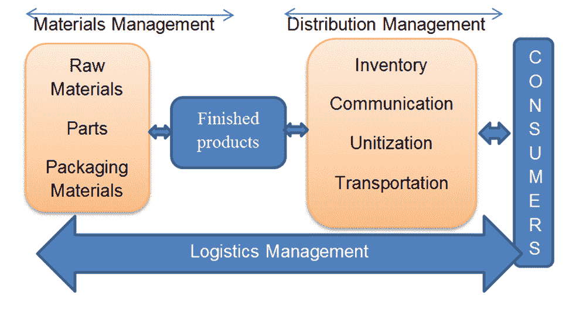
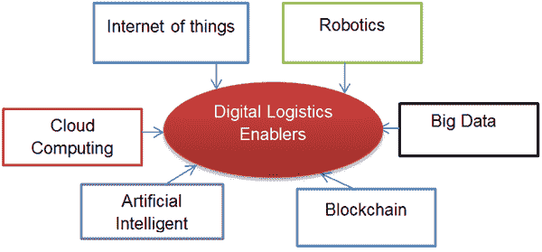
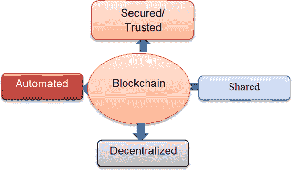
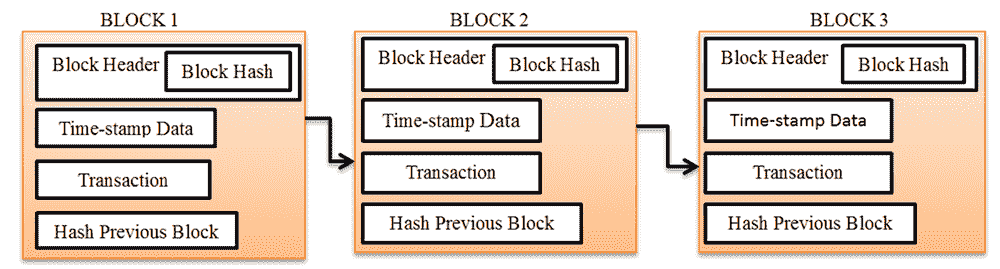
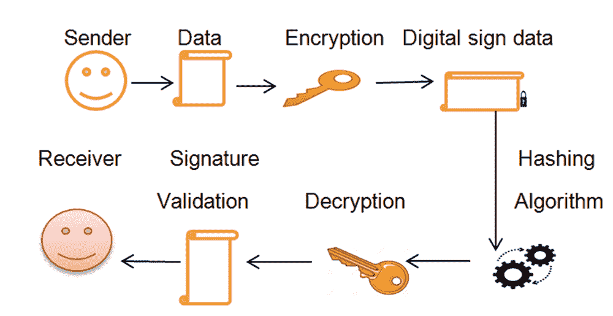
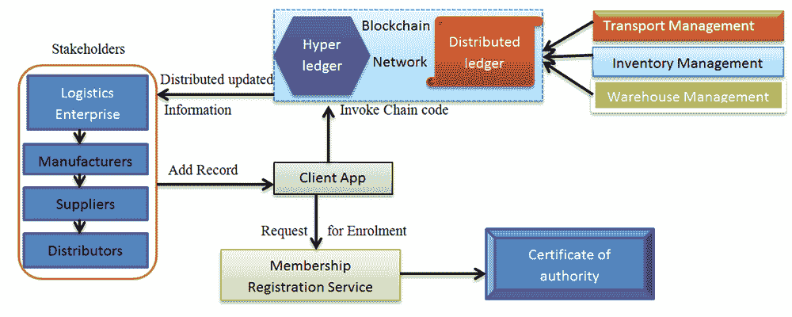

# 第七章

# 使用区块链进行物流管理：

文献综述和研究议程

+   Nwosu Anthony Ugochukwu

    城市大学，马来西亚

+   S. B. 戈亚尔

    

    城市大学，马来西亚

摘要

随着物流公司因物流 4.0 革命而不断扩张，多个相互连接的组织的复杂性使得对物流操作的清晰视图成为不可能。由于客户信息在公司之间共享，未经授权访问个人信息是不可避免的，并给客户带来了几个威胁。为了解决这一挑战，将部署具有增强安全性和透明度等一些引人注目特性的区块链。区块链是一种可以用于改善物流管理中的效率、可见性和安全性的技术。本章将基于对多位学者研究结果的分析，探讨区块链在物流管理中的当前应用。从传统物流到数字物流的转变、数字物流问题以及区块链原理，本研究还提供了有关区块链如何颠覆传统物流管理运营的有用见解。它还为未来研究区块链在数字车队管理中的适用性奠定了基础。

引言

由于工业 4.0 革命（Kshetri, N, 2017）的影响，现代物流运营不断扩张，但是其运营面临诸多挑战，比如由于物流管理框架内涉及众多代理商，导致从开始到结束的操作缺乏可见性，供应链复杂度的增加使得物流公司难以识别问题的根本原因，从而阻碍组织快速而可靠地做出决策。传统的物流管理信息系统存在诸如缺乏开放性、安全问题和不可靠性等缺陷（（Wang, Y., Hugh Han, 2019），个人信息未经授权的披露成为日常，因为信息在物流企业之间共享和传输，从而导致在运营过程中欺诈和其他社会问题的增加。区块链的参与将为这些问题提供解决方案。

区块链是一个设计为运行去中心化账本的点对点（peer-to-peer）网络（S. Nakamoto, 2008），并且不受中央机构的指导。区块链网络的参与者拥有完全透明性，可以随时查看和检查账本。区块链正在迅速成为最受欢迎的学术话题之一。最近的研究重点关注区块链的各个方面，包括系统设计、理论研究以及决策框架。

比特币，一种加密（数字）货币，于 2008 年首次提出。为了在两个参与方之间的互联网交易完成交易，比特币使用了加密证据。它被视为区块链的点火器，使得交易能够在没有第三方的情况下完成（Casino, F, Dasaklis, T., 2019）。

从（金融科技）FINTECH、金融科技到供应链和物流管理，区块链创新正在涵盖各种领域。区块链可以改变现有系统，简化流程，并提高运营效率。根据普华永道的一项调查，来自各行各业的 600 名高管中有 84 人表示，他们的公司自 2018 年以来一直在使用区块链技术。根据该调查（Davies，S.，& Likens，S，2018），金融行业、供应链和能源行业是采用这一创新的前三个行业。采用区块链管理供应链和物流将有助于建立可追溯的供应链系统，同时保持账本中记录的任何数据的不可变性（Rao，J. J.，& Kumara，V，2017）。通过建立供应链利益相关者之间的信任模型、保护资产交易、实现实时通信、改善质量管理以及改进预测和库存管理等方式，改善供应链管理，区块链有可能增加经济价值以解决关键的供应链问题（Mohanta，B. K.，Jena，2019）。

区块链使用共识过程来保护和存储数据在共享数据库中。通过用信息网格表示数据所有者和数据源来构建区块网络。

最近，基于区块链采用在物流和供应链管理中的几个试点项目试图利用该技术的有用性。像 IBM（国际商业机器公司）这样的大型行业领袖有一些著名的成功案例。

IBM 是最早开发区块链创新的公司之一。最近，IBM 推出了第一个基于区块链的系统，用于跟踪和追踪疫苗在分销链上的流动，从生产到接种。该解决方案帮助制造商监控供应链，改善召回管理，并建立政府与私营部门之间的信任。该系统提供了对供应链问题、欺诈和存储条件的预防性检测和通知（IBM，2020）。

在区块链试点试验之后，下一阶段是行业评估根据性能、技术属性和部署成本来评估最佳的区块链。在研究和实践中，为了帮助决策者，只有少数技术评估模型可用（Bai，C & Sarkis，J，2020）。许多学者认为区块链具有相当大的前景，但需要一个概念分析和决策框架来衡量部署此技术的成本优势。

本研究的目标是全面了解区块链原理及其增强安全性的前景；通过使用区块链改善物流管理框架的效率，并推荐未来可能对物流管理有益的研究。

物流管理概述

物流管理

物流通常被定义为受需求影响的活动。它定义了对象、人员、实物产品以及服务、信息和能源的要求。 （Wannenwetsch，H.（编），2014）对象必须在正确的时间、正确的数量、正确的成本和正确的地点交付。或者，物流管理可以被定义为在公司和其供应商之间建立有组织和系统的网络，以生产和销售特定产品给最终用户（CSCMP，2018），以降低成本并保持竞争力。流程、数据和信息流之间存在相互作用，以及人员、实体和其他资源。简而言之，物流管理流程涉及将产品从其初始状态带到最终目的地的所有阶段，从原材料转化为制成品开始，仓储存储，市场运动，以及分销给最终客户，如图 1 所示。

| 图 1\. 物流管理简化结构 |
| --- |
|  |

物流管理流程包括诸如采购、采购、转换等相关活动。与渠道合作伙伴（例如供应商、中间商、第三方服务提供商和客户）协调和合作的需求也至关重要。实质上，物流管理结合了企业内部和企业之间的供应链管理和需求管理（CSCMP，2018）。

物流管理生态系统由五个主要组成部分组成：计划、包装、库存控制、运输和信息控制。

规划（仓储、物料处理）：在物流中进行规划对于强大的供应链连接至关重要，因为通过不断同步整个供应链，接口和链接整个供应链。市场通常是动态的，需求供应不匹配并不少见。物流管理确保制造商持续稳定地供应商品。需要出色的规划来实现这一点，这也是该过程现在已成为物流管理重要方面的原因。尽管制造商需要高效运作，但产品的需求并不等于供应，这是由于先前讨论过的同样的不平衡。在这种情况下，存储额外生产的物品需要额外的存储单元和仓库。物料处理设备需要将物料在仓库内移动以及将物品装载到和卸载出送货车辆，以及像货架或置物架这样的复杂存储设备。物料处理是一个过程，包括利用手动、半自动和计算机化的设备和框架来协助物流，并使供应链运营顺利进行。通过这样做，提高了预测、资源分配、生产计划、库存减少、客户服务和支持等方面。规划是物流管理的关键组成部分，因为它有助于同步各种操作和流程。物流管理涉及在每个层面及时交付货物和服务，没有全面的物流规划就无法进行高效的管理。

在需求供应变化或不平衡期间可能会存在商品供应不足，或者可能需要存储设施来存放多余的物品。没有细致的规划是不可能完成所有这些的。

包装或单元化：产品或物品的包装和单元化对于长期产品维护至关重要。产品的包装不仅在从生产商到零售商的运输过程中保护产品，而且在存储和展示过程中也是如此。物品的包装可能会吸引买家考虑购买。因此，许多企业对他们潜在客户最吸引人的颜色方案、图案和包装类型进行了大量的研究。为了便于处理，单元化过程将多个不同的物品组成一个大宗交货单位。这也很重要，因为它有助于存储和运输。

通常，包装结合单元化有助于将产品以立方体形式包装，因为这样可以使它们易于处理、运输和存储。

基本上，包装有两个目的：在运输过程中保护物品或商品，并在其存储在仓库中时保持产品的良好状态。立方体包装也可以称为单元化，因为它涉及将许多物品合并为一个单一实体。总的来说，立方体对于存储和移动是有用的，因为它们可以轻松地进行运输。

库存管理：库存控制的目标是确保企业保持足够的库存水平，以尽快满足客户需求，同时保持低存储成本。保持有关库存情况、仓库可用性和市场需求与供应研究的信息，以及根据需求预测和相应地管理库存，都是库存管理的重要组成部分。由于需求是可变的，库存控制对于管理供应链中的商品流动是一种特别有帮助的技术。库存管理的好处包括。

+   • 正确的订单执行

+   • 有效的库存规划和组织

+   • 它提供了一个良好组织的仓库

+   • 它节省时间和金钱

+   • 它提高生产效率

+   • 它促进顾客满意度

关于什么库存应该存储、库存应该存储在哪里以及应该存储多少库存的决策是库存控制中最关键的职责之一。

运输：物流公司利用运输来连接它们的各种活动。运输在整个产品制造过程中起着至关重要的作用，从生产到交付（反之亦然）。它包括成功和高效地设计、实施和控制供应链中商品的正向和逆向运动。运输方式包括汽车、货运列车、货运航运和航空旅行。一个有效的运输管理系统应该能够自动化货物、跟踪货物、提高绩效和效率，并协助库存控制。

一个好的运输管理系统（TMS）对于正确的运输是必需的，因为它可以自动招标货物、跟踪货物，并保留和分析过去的信息。由于运输涉及与客户直接联系，及时的交付管理至关重要。TMS 可以帮助保持库存小，从而使供应链流程顺畅进行。持续地交付物品会给客户留下负面印象。随着业绩的提高，客户满意度也会提高。

信息控制：该系统有助于业务管理流程。顺畅运行各种操作过程和程序需要信息和控制。该系统包括实时交付跟踪，告诉卡车司机在哪里停车和交付下一批货物。该过程将销售、分销、营销、制造和供应等管理操作与价值链结合起来，将客户和市场需求与公司潜力结合起来，以实现财务目标。

此外，它通过确定仓库中应存放多少库存，影响其他库存控制流程。可持续物流旨在减少和消除浪费，同时提高业务效率。因此，物流管理与信息和控制密不可分。由于整合了数字化物流管理操作的新技术，物流行业在过去几年里有了显著发展。

数字化物流管理概念

数字化物流是指将传统物流管理中常常是手动且容易出错的数据收集数字化。数字化物流帮助优化和加速物流操作、策略和系统。换句话说，它自动化了可以自动化的物流链的例行组成部分。这一数字化策略不仅使您的公司节省了运营支出、失去的生产力和正确的订单履行成本，而且为所有参与物流管理和操作的供应商和合作伙伴改善了数据透明度。所有利益相关者都可以获取他们需要的知识，通过精心整合的商业物流工具，在单一信息系统中协作和沟通，做出灵活、明智的决策，即使面对意外情况也能如此。

数字化物流管理（DLM）显著影响了物流管理操作，可以明显看出这一改进是企业未来多年可以利用的竞争优势。物流管理由于驱动数据洞察的力量正在经历数字化转型（Chung, G, 2018）。

数字化物流管理的关键技术驱动者

物流行业的数字化转型可以归因于物联网（IoT）、大数据、机器人技术、自动化、云计算、人工智能和区块链创新（Kersten, W., M. Schroder, 2015），如图 2 所示。

| 图 2. 数字物流管理技术助推器。 |
| --- |
|  |

物联网数字物流管理助推器：在物联网技术中，传感器允许将物理对象连接起来接收、存储和传输数据，这些数据可用于做出决策。物联网可以应用于物流管理中，以改善交通运输系统的车辆、基础设施和服务，同时使运营商和客户受益（Lyons，G，2017）。

根据同盟市场研究公司的估计，到 2023 年，全球联合物流市场预计将达到 270 亿美元（同盟市场研究公司，2018）。物联网可以通过实现实时连接来提高物流运营中的服务质量和控制。然而，整体实施成本仍然相当可观，并且诸如隔离等挑战仍然存在。

云数字物流管理助推器：云物流作为一个术语，指的是一种被称为物流即服务（LaaS）的创新业务模式。智能存储已经被部署在云物流中，用于存储物流数据。物流企业可以利用 LaaS 将创新的 IT 解决方案与物流业务相连。由于 LaaS 的出现，物流管理信息通信变得更加简单和可行（Ilin，V，Simić，2013）。物流即服务还使得建立高效和有效的物流程序变得更加容易，从而节省时间和金钱。为了在市场上竞争有利，物流企业或公司可以受益于按使用量付费和可伸缩性。现在超过一半的物流公司使用基于云的服务，另有 20%的公司预计很快也会这样做（Brandl，N，2016）。

机器人和自动化数字物流管理促进者：机器人学是与人工智能、云计算、物联网和大数据紧密相关的科学分支。机器人正在自动化生产和仓储等物流管理实践。根据 DHL 的一项研究，今天仍有 80%的仓库是手动处理的（Bonkenburg，T.，2016），这表明自动化的空间还有很多。自动驾驶车辆被部署在高度自动化的仓库中运输货物。就速度、精度、安全性和追踪而言，自动驾驶车辆优于传统的叉车、手动搬运车和高架托盘（GU，J，2007）。自动驾驶汽车还可以重新配置，无需人类参与就可以持续运行，并且可以轻松与其他机器人和设备集成。与传统仓库相比，完全数字化的仓库提供更大的灵活性，并且消除了对固定基础设施安装的需求（Vis，I.F.A，2006）。然而，实施将需要大量资源投入。尽管如此，技术进步可能会很快减少所需资源的数量。

大数据数字物流管理促进者：大数据被定义为具有 Volume、velocity、variety 和 veracity 的数据。大数据正在通过将大量非结构化数据转化为有用信息，为物流经理快速有效的决策过程数字化物流业务（Simi ć，2017）。

将未充分利用的数据转化为市场竞争优势具有巨大潜力。物流中大数据的实施已经导致了更好的市场需求（Tan, K.H, 2015）预测，并为客户需求量身定制了新的业务模式，这只是其中一些好处。大数据分析结合人工智能将实现实时路线优化，全面预测车队容量和货物需求，并降低物流合作伙伴网络中的风险。

人工智能数字物流管理助推器：人工智能（AI）可以被定义为一组技术，它们共同解决复杂问题，并逐渐成为每个 IT 系统的一部分。它与物联网技术相连，后者允许传感器收集数据，云计算技术和大数据范式。AI 技术由三部分组成：感知、处理和学习。感知组件是从物理世界收集数据的设备（传感器）。处理组件是许多软件解决方案中的一组数据处理算法。学习组件是在结构化和非结构化数据中捕获的模式。AI 正在通过提供最优的卡车路由解决方案，实现成本节约、准确的需求预测、快速决策，并通过个性化物流服务提高客户满意度，数字化物流管理。

区块链数字物流管理的启用者：区块链是一种分散化、分布式和开放的数字账本。它记录交易跨越许多计算机，以使得任何被事后更改的记录都会影响所有后续区块。（经济学家，2015）。中心化数据库可以利用区块链技术转变为分布式、去中心化系统。在物流环境中，分布式存储系统可以存储和管理由物联网应用程序产生的大量数据。区块链在物流中的应用使得物流行业数字化，具有在全球贸易中最大的潜力；其解决方案可以减少供应链贸易壁垒，全球 GDP 和全球贸易增长可达 15%（莫阿文扎德，J，2013）。增加透明度、可追溯性和产品交付速度只是区块链数字化物流操作的几种方式（皮尔金顿，M，2016）。

数字物流管理的挑战

随着物流企业由于物流 4.0 革命的扩张（霍夫曼，E，& 鲁施，M，2017），物流管理操作的转型和数字化，数字物流管理面临着诸多问题，如数据安全和隐私问题，物流系统效率低下，端到端操作缺乏可见性、透明度等等。

数据安全与隐私问题：在数字物流环境中，数字化和技术的发展增加了数据完整性、隐私和数据安全方面的挑战和风险。然而，物联网和云计算是将物流生态系统管理数字化的技术，但它们是集中化的，并在数据安全、隐私和网络维护成本方面存在缺陷。一个高度分散和复杂的物流流程的组织必须不断共享数据以保持物流流程的优化。其中一项优势是库存水平保持在最低水平，并处于竞争优势地位。数字化物流行业目前还远未能保证参与者之间交换的信息安全（PTI 博客，2019 年）。近年来，马士基集团和道姆（Holland, M，2017 年）遭受的网络攻击已经表明，有必要加强网络安全或承担风险的操作，这可能会对物流产生严重的影响。另一方面，安全问题是决策者关注的重要问题。在利用传感器收集物联网数字化物流的数据的情况下，存储的数据和信息容易受到攻击；未经授权的实体访问敏感企业数据可能会从多个角度产生严重后果。例如，生产计划可能需要更新，交易伙伴对投资的信心可能会减少（Williams, Z, Lueg, 2008 年）。由于安全漏洞是物流公司丢失敏感数据的事件，因此也需要制定安全标准和规范以满足大量的网络合作伙伴。数据泄漏不仅危害最终用户，也危害供应商，阻碍数字革命的发展。

低效的物流管理系统：效率对于每个组织的长期生存至关重要。仓储容量、运输长度、订单准确性、及时交付、运输成本、损坏产品数量和库存周转率是物流管理中的一些主要效率指标。使用过时的共享文件系统（如 Boison & Antwi-Boampong, 2019 年的提单、信用证、报关单和危险货物通知（Dubovec, 2005）Yang（2019a））也会带来问题，例如完成时间增加、文件操纵风险显著增加和数据不准确的风险（Liu, 2020）。

在数字化物流中，文件处理占据了成本的 50%（Hackius, N, 2019）。大量数据被捕获并用于大数据数字化物流，其中大部分是手工处理的。多个参与方通过电子邮件或电话进行沟通，而不是使用电子数据交换（EDI）等电子格式。每个物流提供商都有自己的管理平台和数据，它们之间的连接仅是最小的，从而使物流管理效率低下。

可见性和透明度问题：在物流管理中，可见性一词指的是在途货物移动和工厂内活动以及由仓库和枢纽到客户门口的卡车交付等活动，这些活动对供应链内的所有利益相关者都是透明、可追溯且易于追溯的。通过数字化物流管理，在途中，从仓库到中心枢纽最终分配给客户的订单几乎没有可见性。这是因为仓库管理系统和第三方物流系统不兼容。同样，运输管理系统（TMS）和库存管理系统（IMS）不能链接。运输管理系统也不能与订单管理系统集成。利益相关者之间缺乏端到端的可见性和透明度是物流管理运营有效管理的主要问题。区块链的使用将为解决这些问题提供方案。下一节将讨论区块链及其特征和基本原理。

区块链介绍

[分布式账本技术（DLT）](https://zh.wikipedia.org/wiki/%E5%88%86%E5%B8%83%E5%BC%8F%E8%B3%AC%E6%9C%AC)（S. Nakamoto，2008），通常被称为区块链，是一种分散式、不断增长的数据集合，被称为“区块”，通过加密在点对点网络上链接和保护。要构建一个网络或链，每个区块通常包含来自所有先前区块和交易的信息，以及先前区块的加密哈希、时间戳和交易数据。在区块链处理完数据后，网络中的每台计算机都同时锁定，创建一个永久、难以更改的数字记录。每个区块链系统确定谁可以向链中添加新区块，以及如何执行该技术。

区块链处理数据后，网络中的每台计算机同时锁定，创建了一个永久的、难以更改的数字记录。每个区块链系统都概述了谁有权限以及如何向链中添加新块。正如图所示，区块链（李国全 D，2015 年）具有一项使其优于传统数据库的独特属性。区块链最重要的一个方面之一是它对数据操纵是无法被影响的。它是一种分散的、分布式的账本系统，用于以高效和可验证的方式记录两个交易方之间的交易。区块链通常通过对等网络进行管理，并且通过共识机制保持账本的正确性。交易的性质在整个区块链上立即可访问。

在交易中使用密码协议（皮尔金顿，M，2016 年）来确保在记录在任何给定块中的数据后，不能修改它而不影响所有后续块，这需要网络多数的合作。因此，区块链最独特的属性是它不能被改变（张 J，2017 年）。在区块链上，无法修改任何单位的数据。（郑 Z，谢 S，2017 年）。

| 图 3. 区块链的独特属性 |
| --- |
|  |

区块链运作的基础

基于区块链的系统由这三个概念性组件组成，即分布式账本、数字签名和共识程序。

分布式账本

个人或组织可以加入网络并共享分布式账本的副本。所有交易都按时间顺序在此副本上。一个对等网络节点用于执行交易。每个区块的数字数据或交易集合由“哈希”标识符表示。链中的初始区块称为创世区块。矿工是在比特币网络中创建和验证区块的人。在被矿工验证后，数字交易将被添加到分布式账本中。随着新区块被添加到链的末端，数字账本将继续增长（Fang, W, Chen, 2020）。

区块链的类型确定了记录在区块中的数据。例如，比特币利用区块链创新来跟踪交易详情，如发送方、接收方和交易金额。图 4 显示了区块链中的数据格式和存储信息。

| 图 4\. 区块链结构 |
| --- |
|  |

数字签名

控制节点使用加密机制验证数据。创建数字签名涉及三个步骤：密钥生成、签名和确认。

+   1\. 密钥生成算法：在此阶段，生成两个密钥：私钥和公钥。私钥用于签署消息，而公钥则公开以确保消息是用正确的私钥签署的。

+   2\. 验证算法：接收节点通过使用公钥和从传入数据生成的哈希值压缩解密签名来验证交易数据，节点在此阶段对数据进行身份验证和验证。然后，更改后的账本将在提供签名并将数据记录在一个块中后，作为最后确认的版本广播到网络。图 5 是一个显示数字签名创建方式的图表。

| 图 5\. 数字签名的创建 |
| --- |
|  |

共识过程

通过使用共识过程，可以将新交易添加到账本中。在链的每个链接中，指定了执行数据交易的条款和条件。这个协议以工作量证明（PoW）（Janssen, M, 2020）为例。工作量证明安全性为区块链提供了高水平的安全性，并使得使用欺诈数据重新挖掘当前区块成为不可能。

通过增加添加新区块到链上的时间，该过程抑制了操纵和网络攻击。共识的属性消除了单个中心化实体操纵信息交易的风险。

区块链原理

在最近发表在《哈佛商业评论》上的一篇论文中（Iansiti M, Lakhani K, 2017），提出了支撑区块链原则的五个关键概念：分布式数据库、点对点传输、具有伪匿名的透明度、记录的不可逆转性和概念逻辑。

分布式数据库：账本被复制到大量完全相同的数据库中。区块链中的每个参与者都完全可以访问数据库，没有单个参与者对数据或信息的控制权。合作伙伴的交易记录可以直接验证，无需第三方中间人的参与。

点对点传输：无需中央协调的要求，通信直接在对等方之间进行。同时，对等节点既是其他网络节点的客户端，也是服务器。

具有伪匿名的透明度：交易是在区块链地址之间进行的，这些地址对任何有系统访问权限的人都是可见的。当对一个副本进行更改时，所有其他副本同时更新。区块链上的每个用户都通过唯一的字母数字地址识别。用户可以选择保持匿名或向他人展示他们的真实身份。

记录的不可逆性：一旦输入了事务，数据库中的记录就无法更改。为了确保数据库记录是永久的，并且对网络上的每个人都是可访问的，应用了各种计算方法。

概念逻辑：由于账本是数字化的，用户可以创建自动激活节点之间交易的算法和规则。

区块链类型

根据网络的不同，存在不同类型的区块链（J. d. Kruijff and H., 2017），而网络设计则根据交易的执行方式和用户访问数据的速度而有所不同。区块链网络一般根据采用的模型和共识进行分类。存在的不同类型的区块链包括公共、私有和混合区块链。

公共区块链：旨在消除中间商，这种区块链对任何拥有计算机和互联网连接的人都是可访问的。在需要完全去中心化的交易时，公共区块链是最佳选择。比特币区块链以及其他一些如以太坊、IOTA 等区块链都是一些例子，其中一些公共区块链只允许读写。例如，比特币采用了开源方法论，允许任何人贡献。进行此类任务所需的计算能力和容量以及复制交易使这种公共区块链变得缓慢且资源密集，但它们非常安全（Pinto R, 2019）。

私有区块链：一家公司建立了一个许可网络，其中所有参与者都被认可并信任。在私有区块链中，网络系统受到密码保护。参与者必须收到邀请或授权才能参与。管理员可以选择性地允许节点进行验证。当区块链在同一法律实体的组织之间使用时，这是有利的。采用私有区块链有许多好处，例如更快的交易速度、数据/内容隐私以及对谁可以访问区块链进行集中控制。本地企业和治理框架更适合私有区块链。政府可以使用私有区块链进行投票调查，从而节省数十亿美元的成本，因为这些机制使投票完全安全且抗拒腐败（Thompson C，2016）。金融服务行业拥有大量基于私有区块链的应用，例如美国银行、摩根大通、纽约证券交易所和富达投资正在测试私有区块链技术，作为纸质和手工交易处理的替代方案（Iansiti M，Lakhani K，2017）。

混合型区块链：该区块链将公共区块链和私有区块链的优势结合起来。混合型区块链结合了公共区块链（所有参与者都包括在内）和限制参与的私有网络（基于许可或仅限邀请）的特点。混合型区块链可以帮助高度管制的企业和政府。这种创新使用户对保留哪些数据私密以及哪些数据公开发布有更多的自由和控制权。在现实世界中，有许多混合型区块链的例子。例如，Xin-Fin 是一个将以太坊（公共区块链）和 Quorum（私有区块链）结合起来的混合型区块链。XinFin 已经完成了超过十几个试点项目，涵盖了供应链物流、航空、国际贸易和金融结算等领域。一家价值数十亿美元的软件公司 Ramco Systems 向其客户提供 Xin-Fin 混合型区块链解决方案，用于部署基于区块链的供应链物流解决方案（Freuden, D, 2018）。

区块链平台

目前有各种各样的区块链平台可供选择，其中一些是开源的，允许公司和开发者加快开发速度同时降低初始成本。表 1 概述了最受欢迎的区块链平台以及它们的应用（Sharma TK，2019）。由于比特币的成功，组织现在正在考虑其他开源的区块链平台。

表 1\. 不同类型的区块链平台

|           区块链平台 |           区块链           网络 |           背景 |
| --- | --- | --- |
|           以太坊 |           公开 |           这是一个用于开发和使用去中心化应用程序的开放平台。没有人拥有或控制该平台。适应性强、灵活性高，被用于智能合约 |
|           Hyperledger |           混合 |           开源协作努力的形成，旨在推进各行各业的区块链技术。提供各种商业区块链技术产品，如账本框架、智能合约引擎和实用程序库。 |
|           MutliChain |           私有 |           用于在组织内部和组织之间开发和部署私有链的平台。作为比特币核心软件的更先进版本，旨在支持私人金融交易。 |
|           HydraChain |           私有链 |           这是以太坊平台的扩展，有助于创建许可的分布式账本。 |
|           IBM 区块链 |           通过比特币的 P2P 借贷 |           基于 Hyperledger 开发，为组织提供额外的安全性和基础设施功能。 |
|           IOTA |           私有/公共 |           使用 Tangle 概念创建分布式账本。作为机器经济的重要组成部分，允许进行小额、免费的纳米支付。 |
|           Factom |           私有/公共 |           一个面向区块链即服务（BaaS）的平台，旨在允许将区块链功能整合到应用程序中，而无需使用比特币或基础设施；提供完整的设置，用于研究、开发和生产使用。 |

区块链应用

一般来说，区块链技术以多种方式被利用，从公共账本到私有账本，具体取决于特定的需求。许多甚至使用智能合约。以下是一些探讨引入区块链所带来的好处的领域。

区块链教育：敏感文件，如教育成绩单和证书，将以与公证相同的方式验证和记录。

保险区块链：智能合约必须以某种方式遵守某些规则，是一种理想的风险管理工具。通过这种方式，如果满足某些条件，保险索赔可以更快地处理，并且错误更少。

医疗保健区块链：医疗记录可以从任何地方轻松访问。这可能与其他应用程序结合使用，例如智能合约和传感器，以自动监视患者状态。区块链还正在改变医疗保健行业的网络攻击（Nwosu A.U＆Goyal S.B，2020）。

云区块链：未来，分布式云存储可能会取代传统的集中式云。

区块链电子投票：使用区块链，数字投票可能成为现实。它提供了一种安全和匿名的电子投票方式，安全性问题一直是电子投票的最大障碍。

物联网区块链：区块链允许连接到互联网的任何物体上传数据，然后可以存储或处理这些数据。例如，具有传感器的设备可以被编程为将其值发送到区块链，然后其他人可以查询以验证其价值。智能合约甚至可以根据设备发送的数据和发生的事件来触发事件。

物流区块链：以下是一些具有区块链的物流管理应用程序列表。 （a）更简单的文档处理：通过集装箱运输涉及大量文书工作，这需要时间和金钱。提单或其他基于纸张的货物文件容易伪造，被盗和欺诈。（b）识别和防止假冒产品。

物流管理系统现有问题和技术（LMS）

物流管理系统存在一些问题和挑战，总结如下表 2 所示。

表 2。物流管理系统中的现有问题

|           作者 |           现有物流管理系统存在的问题 |
| --- | --- |
|           （Hasan 等，2019） |           很难进行透明的信息交流。 |
|           （Korpela，Hallikas 和 Dahlberg，2017） |           有几个股东，但缺乏对信息的实时访问。 |
|           （吴等，2017） |           无法验证物流管理系统。 |
|           （Seo 等，2014） |           效率低下 |
|           （Czachorowski 等，2019） |           由于水平和垂直价值链中物流服务提供商之间数据传输的高度同质性，自动化水平较低。 |
|           （Kum Fai 和 Vinh，2016） |           缺乏隐私、信任和承诺 |

已经部署了诸如（ICT），（IoT），RFID 和无人机等现有技术来解决表 3 所示的物流管理系统中的问题。

表 3。解决物流管理系统问题所利用的现有技术摘要。

|           作者/年份 |           技术 |           在物流中的用途 |
| --- | --- | --- |
|           （Anwar 等，2019） |           信息通信技术（ICT） |           通过监视器改善追踪物流过程。 |

|           （阿齐兹，M，2019）           （Tadejko，2015）

（李等，2017）

（本-达亚，2017） |           物联网（IoT）           物联网和物流管理 |      • 使用传感器收集物流数据和信息      • 增强了可见性、仓储管理和车队管理 |

|           （冯田，2016）           （Semunab 等，2016） |           射频识别（RFID） |      • 增强物流管理系统中的可追溯性      • 库存和仓储管理活动正在改善。

• 改善逆向物流。 |

|           （iThink 物流博客，2019） |           物流无人机 |           使用无人机从一地运输货物到另一地 |
| --- | --- | --- |

|           (Li et al, 2013)           ((Yang et al, 2017) |           云物流 |      • 云物流中物流资源的虚拟化      • 用于智能物流管理

• 智能存储 |

|           ((Zheng,Wu, 2017))           (Zhong et al, 2016b)

(AddoTenkorang, 2016)

(Lamba and, 2017)

(Wang et a, 2016) |           大数据，           大数据与物流管理，

大数据/运营与物流管理,

大数据物流和供应链管理 | 智能库存管理系统用于订单拣选 |

用区块链处理物流管理系统问题的方法论/算法

这涉及基于区块链创新的物流管理系统将解决的步骤，例如缺乏安全性、低效率、缺乏端到端可见性等系统面临的问题。图 6 展示了通过区块链处理 LMS 问题的机制。

| 图 6\. 处理 LMS 问题的机制 |
| --- |
|  |

利益相关者（物流企业、制造商、供应商、分销商）可以通过客户应用界面注册并添加他们的详细信息，并且他们可以通过成员注册服务请求授权证书。这个授权证书将验证和授权所有利益相关者和客户连接到区块链网络。

超级账本区块链将通过调用链代码为客户或客户信息提供隐私和安全性，并且存储在分散的区块链中的信息不会被更改或操纵，使用加密。为了便于自动化，运输、库存和仓储系统将连接到分布式区块链网络，物流企业可以轻松访问仓库，跟踪包裹并管理库存。为了增强效率和可见性，物流企业可以与制造商、供应商和经销商进行沟通，他们可以通过分布式区块链网络查看更新的信息。

讨论

本研究部分讨论了区块链在物流管理中的优势，区块链对解决挑战物流管理系统的问题的贡献，以及在物流行业实施区块链的困难。

区块链在物流管理中的好处

通过在物流业中使用区块链技术，提供透明度，建立信心，并促进合作和团队合作。

改进透明度：基于区块链的平台可以为相关利益相关者提供可靠、一致和不变的数据。与传统的数据交换方法不同，区块链网络的数据可以实时访问。因此，最终用户可以获取有关物流流程的数据。

建立信任：在两个方当间建立信任是困难的，但是采用区块链与分布式分类账系统相结合将确保利益相关者的信任。利用区块链，物流公司的成功可以根据其过去的表现进行评估，例如准时交付和提货。此外，物流公司可以监控客户的表现，包括合同履行情况。使用智能合约也可以简化支付和定价过程。如果所有先决条件都得到满足，支付流程可以自动化。

增强协作与合作：建立信任后，利益相关者将更愿意共同合作。通过实时数据共享，物流行业的参与者可以寻求全球性解决方案，降低总体成本并提高盈利能力。利益相关者的计划和时间表可以根据变化的情况进行调整。即使利益相关者是竞争对手，他们也可以通过合作获益。例如，竞争对手可能通过使用协同物流降低成本并增加利用率。

提高物流文件的安全性：通过使用智能合约和不可变数据溯源，区块链可以有效处理物流文件的隐私，例如信用证、报关单、危险品通知和提单。

区块链对解决物流管理系统问题的贡献总结在表格 4 中。

表格 4. 区块链对物流管理系统问题的贡献

|           作者 |           区块链部署           领域 |           描述 |
| --- | --- | --- |
|           (Chen, S, 2017) | 保持数据完整性（防篡改交易） | 区块链使用了公钥和私钥的密码学。这使得产品来源的身份验证和实时追溯成为可能，同时也增强了物流参与者之间的信心和信任。 |
|           （Fu, Y，2019） |           同步和增强信息共享 |           区块链部署了分布式系统，以增强物流管理者之间的信息共享 |
|           （Hao, Y，2019） |           物流管理智能合同 |           基于区块链的物流合同管理数字资产，并自动完成协议、资产和数字数据的交换。合同谈判、支付条件、参与者义务和合同履行验证都变得更加简单。该策略降低了第三方支出，同时简化了运输操作。 |
|           （Cleland-Huang, J，2012） |           物流跟踪和追踪 |           分布式账本使数据始终可供授权用户访问，因为它是共享和分布式的资源。数据的可用性使物流供应链中的利益相关者能够在集装箱运输过程中做出更明智的决策。 |
|           （Kshetri, N，2017） |           物流管理系统安全与隐私 |           .为超级账本 Fabric 和 Besu 网络的参与组织之间的交易提供了安全性，其中私有通道和 Orion 节点分别用于物流供应链中的参与组织。 |

区块链在物流中的采用挑战

物流行业采用区块链的各种障碍包括数据存储和传输、激励制度以及实施成本。

数据存储和传输：物流行业每天都会收集和存储大量数据。由于数据在区块链网络中的每个节点中重复保存，随着收集到更多数据，区块链应用受到威胁；网络中的每个节点都需要大量的存储容量，因此最终这将导致存储资源的浪费。其次，大量部署的物联网设备可能会导致网络拥堵，降低服务质量。因此，无法保证区块链的稳定性。因此，物流行业在数据传输方面面临巨大困难。

激励机制：在加密系统中，矿工参与区块链网络后会获得奖励。当物流公司记录物流过程中的数据时，物流行业几乎没有获得任何好处。这阻止了他们的积极性。物流公司对区块链的发展至关重要，而区块链应用和服务无论如何都不能用于帮助物流操作。在这种情况下，激励机制至关重要。

实施成本：物流行业面临基于区块链的物流管理系统的成本和风险困境。物流公司面临高昂的成本。设备成本、培训成本、运营成本和维护成本是四种成本类型。尽管已经发现了潜在的好处，但大部分尚未实现。对于公司来说，采用区块链可能并不是一个明智的投资。此外，过高的风险也是一种负担。目前正在研究区块链的潜在应用。因此，当技术问题发生时，物流组织的活动可能会受到干扰。

结论和未来方向

物流服务正在全球范围内扩张，物流操作的复杂性日益增加，面对这些挑战，组织在需要时无法做出快速有效的决策，从而导致交货时间延长并产生更多费用。作为一项颠覆性技术，区块链可以改变当前的物流行业。本研究讨论了数字物流管理的技术启用者以及数字物流管理的障碍，还强调了区块链的特征和区块链概念。强调了多种类型的区块链网络和不同区块链平台的描述，以及物流管理中当前存在的困难以及对物流管理有所贡献的现有技术。本研究得出结论，区块链可以创新物流职能的管理。

未来的研究将探讨以下问题，如何使用区块链正确跟踪和追踪物流司机的 GPS 位置。其次，如何建立基于区块链的车队管理框架。第三，我们需要确定在实施区块链技术时如何处理存储问题。

参考资料

Addo-Tenkorang, R., & Helo, P. T. (2016). 大数据在运营/供应链管理中的应用：文献综述。《计算机与工业工程》，101，528–543。doi:10.1016/j.cie.2016.09.023

Allied Market Research. (2018). 全球互联物流市场预计将在 2023 年达到 2,772.2 亿美元。https://www.alliedmarketresearch.com

Anwar. (2019). Connect2Smallports 项目：南波罗的海小港口-通往综合和可持续的欧洲运输系统的门户。访问日期：2021 年 11 月 10 日。可用：http://bth.diva-portal.org/smash/record.jsf?pid=diva2%3A1361852&dswid=7361.M

Aziz, M. F., Khan, A. N., Shuja, J., Khan, I. A., Khan, F. G., & Khan, A. R. (2019). 一种轻量级和抗妥协认证方案，适用于物联网。新兴电信技术交易 , 3813\. doi:10.1002/ett.3813

Bai, C., & Sarkis, J. (2020). 供应链透明度和可持续性技术评估模型——区块链技术。国际生产研究杂志 , 58(7), 2–7\. doi:10.1080/00207543.2019.1708989

Ben-Daya, M., Hassini, E., & Bahroun, Z. (2017). 物联网与供应链管理：文献综述。国际生产研究杂志 . 提前在线发布。doi:10.1080/00207543.2017.1402140

Boison, D. K., & Antwi-Boampong, A. (2019). 使用分布式账本的区块链就绪港口供应链。在 NB！ICT 创新、监管、多业务模式创新和技术方面 (pp. 1–32). 多代理。

Bonkenburg, T. (2016). 物流中的机器人技术 . DHL 客户解决方案与创新，特罗伊斯多夫。

Brandl, N. (2016). 云计算的胜利。 https://logistik-heute.de

Casino, F., Dasaklis, T. K., & Patsakis, C. (2019). 区块链应用的系统文献综述：当前状态、分类和开放问题. 信息与电信 , 36, 55–81\. doi:10.1016/j.tele.2018.11.006

Chang, J. (2017). 区块链：医疗技术透明的不可变账本。访问于 2021 年 11 月 4 日，可用：https://medium.com/@sidebench/blockchainthe-immutable-ledger-of-transparency-in-healthcare-technology-a4a64b1d5594

Chen, S., Shi, R., Ren, Z., Yan, J., Shi, Y., & Zhang, J. (2017). 基于区块链的供应链质量管理框架。在 2017 年 IEEE 第 14 届电子商务工程国际会议上 (pp. 172–176). 10.1109/ICEBE.2017.34

Chung, G., Gesing, B., Chaturvedi, K., & Bodenbenner, P. (2018). 物流趋势雷达 . DHL 客户解决方案与创新。

Cleland-Huang，J.，Hayes，J.H.，Zisman，A.，Egyed，A.，Grünbacher，P.，& M¨ader，P.（2012）。可追溯性基础知识。在《软件和系统可追溯性》中（第 3-22 页）。施普林格。doi:10.1007/978-1-4471-2239-5

供应链管理专业人员协会（CSCMP）。 （2018）。 CSCMP 对供应链管理的定义。 作者。

Davies，S.，& Likens，S.（2018 年）。普华永道全球区块链调查。访问日期：2021 年 10 月 8 日。[链接](https://www.pwc.com/jg/en/publications/blockchain-is-here-next-move.pdf)

Dubovec，M。（2005）。作为抵押品使用电子提单的问题和可能性。《亚利桑那国际与比较法律杂志》，23，437。

经济学家。（2015）。区块链：对事物确定的伟大链条。访问日期：2021 年 05 月 11 日。[链接](https://www.economist.com)

Fang，W.，Chen，W.，Zhang，W.，Pei，J.，Gao，W.，& Wang，G.（2020）。区块链中用于信息不可否认的数字签名方案：现状回顾。《欧亚无线通信和网络期刊》。

FengT.（2016）。基于 RFID 的中国农产品供应链可追溯系统。第 13 届国际服务系统和服务管理会议（ICSSSM），1-6。

Freuden，D.（2018 年）。混合区块链：公共与私人兼顾。《勇敢的新硬币》。[链接](https://bravenewcoin.com/insights/hybrid-blockchains-the-best-of-both-public-and-private)

Fu，Y.，& Zhu，J.（2019）。基于区块链的大型生产企业供应链内生风险管理。《IEEE Access: 实用创新，开放解决方案》，7，15310-15319。doi:10.1109/ACCESS.2019.2895327

Goudos，S.K.，Dallas，P.I.，Chatziefthymiou，S.，& Kyriazakos，S。（2017）。物联网关键启用和未来技术概述：5G，移动物联网，语义网和应用。《无线个人通信》，97（2），1645-1675。doi:10.1007/s11277-017-4647-8

Gu, J., Goetschalckx, M., & McGinnis, L. F. (2007). 仓储操作研究：全面审查. 《欧洲运筹学杂志》，177(1)，1–21. doi:10.1016/j.ejor.2006.02.025

Hackius, N., Reimers, S., & Kersten, W. (2019). 区块链在物流中的隐私障碍：汉堡港的第一批教训. 《物流管理》，Springer.

Hao, Y. (2019). 运营和供应链中的区块链：模型和参考实施. 《计算与工业工程》，136，242–251. doi:10.1016/j.cie.2019.07.023

Hasan, H., AlHadhrami, E., AlDhaheri, A., Salah, K., & Jayaraman, R. (2019). 基于智能合约的高效货物运输管理方法. 《计算与工业工程》，136，149–159. doi:10.1016/j.cie.2019.07.022

Hofmann, E., & Rüsch, M. (2017). 工业 4.0 及物流的当前状况和前景. 《工业计算机》，89，23–34. doi:10.1016/j.compind.2017.04.002

Holland, M. (2017). Petya 的回归 – 加密木马瘫痪了全球公司和政府机构. 学术出版社.

Iansiti, M., & Lakhani, K. (2017). 区块链的真相. 哈佛商业评论. [链接](https://hbr.org/2017/01/the-truthaboutblockchain?utm_source=datafloq&utm_medium=ref&utm_campaign=datafloq)

IBM. (2020). 区块链疫苗分发. 访问日期：2021 年 10 月 27 日. [链接](https://www.ibm.com/blockchain/solutions/vaccine-distribution)

IlinV.SimićD. (2013). 从传统 ICT 解决方案向物流云计算的转变. 第 1 届物流国际会议论文集，78-83.

iThink 物流博客. (2019). 物流行业的 11 个主要创新. 访问日期：2012 年 11 月 11 日. [链接](https://ithinklogistics.com/blog/11-major-innovations-done-to-transform-the-logistics-industry/)

Janssen, M.，Weerakkody, V.，Ismagilova, E.，Sivarajah, U.，& Irani, Z.（2020 年）。分析区块链技术采用的框架：整合制度、市场和技术因素。《信息管理国际期刊》，50，302–309。doi:10.1016/j.ijinfomgt.2019.08.012

Kersten, W.，& Schroder, M.（2015 年）。工业 4.0 供应链风险管理。《工业 4.0 管理》，31（3），36–40。

Korpela，K.H.，Hallikas，J.，Dahlberg，T.（2017 年）。数字供应链转型迈向区块链集成。第 50 届夏威夷国际系统科学会议论文集。10.24251/HICSS.2017.506

Kruijff, J.，& Weygand, H.（2017 年 6 月）。使用企业本体论更好地理解区块链进展。《信息技术工程进展》，计算机科学讲座笔记，29–43。doi:10.1007/978-3-319-59536-8_3

Kshetri，N.（2017 年）。区块链在加强网络安全和保护隐私方面的作用。《电信政策》，41（10），1027-1038。

Lamba, K.，& 辛格，S.P.（2017 年）。运营和供应链管理中的大数据：当前趋势和未来展望。《生产计划与控制》，28（11–12），877–890。doi:10.1080/09537287.2017.1336787

拉尔森，P.D.，& 哈尔多松，A.（2004 年）。物流与供应链管理：国际调查。《物流国际期刊：研究与应用》，7（1）。

李，C.K.M.，& 吕雅琼，K.K.H.（2018 年，4 月 18 日）。基于物联网的智能物流仓储管理系统的设计与应用。《生产研究国际期刊》，56（8），2753–2768。提前在线发表。doi:10.1080/00207543.2017.1394592

李国全（2015 年）。数字货币手册（第一版）。爱思唯尔。可用链接 http://EconPapers.repec.org/RePEc:eee:monogr:9780128021170

Li, W., Zhong, Y., Wang, X., & Cao, Y. (2013). 云物流中的资源虚拟化与服务选择. 网络与计算应用杂志, 36(6), 1696–1704. doi:10.1016/j.jnca.2013.02.019

Liu, H. (2020). 区块链和提单：法律问题透视. 在运动中的海事法 (第 413–435 页). Springer. doi:10.1007/978-3-030-31749-2_19

Lyons, G. (2017). 智能城市交通的智能与可持续范式的对齐. 交通研究 A 部分，政策与实践, 115, 4–14. doi:10.1016/j.tra.2016.12.001

Moavenzadeh, J. (2013). 供应链如何推动增长？ 访问日期为 2021 年 11 月 2 日。来源: https://www.weforum.org

Mohanta, B. K., Jena, D., Panda, S. S., & Sobhanayak, S. (2019). 区块链技术：应用和安全隐私挑战概述. 物联网, 8.

Nakamoto. (2008). 区块链，“一种点对点的分布式分类账系统”（电子现金系统）. 学术出版社.

Nwosu, A. U., & Goyal, S. B. (2020). 区块链改变了医疗保健行业的网络攻击. 世界信息与通信技术大会.

Pilkington, M. (2016). 区块链技术：原理与应用. 数字转型研究手册. Edward Elgar Publishing.

Pinto, R. (2019). 区块链在网络安全中将扮演什么角色？ 福布斯技术委员会. 访问日期为 2021 年 11 月 9 日。来源: https://www.forbes.com/sites/forbestechcouncil/2019/04/03/what-role-will-blockchains-play-in-cybersecurity/#4c84e231295c

Popper & Lohr. (2017). 区块链：追踪猪排、债券、劣质花生酱的更好方式？ 学术出版社.

PTI Blog. (2019). 数字物流的 5 个重大挑战. PIT 集装箱码头自动化会议 (CTAC). 访问日期为 2021 年 11 月 9 日，来源: https://www.porttechnology.org/news/pti_blog_5_big_challenges_for_digital_logistics/

Rao, J. J., & Kumara, V. (2017). 制造系统供应链管理综述。在班加罗尔举办的国际工业应用创新机制会议(ICIMIA)上 (pp. 759–762)。10.1109/ICIMIA.2017.7975567

Semunab, S. N., & Noor, N. M. (2016). 在实际工业环境中实现无线移动 RFID 读写器。《技术杂志》, 78(5–10), 74–82。

Seo, Y.-J., Dinwoodie, J., & Roe, M. (2014). 集装箱物流中的供应链协作度量。《海洋经济与物流》。提前在线发表。doi:10.1057/mel.2014.26

Sharma, T. K. (2017). 最佳开源区块链平台列表。区块链委员会。可获取：https://www.blockchain-council.org/blockchain/list-of-best-open-source-blockchain-platforms/

Simi, Ć., & Ilin, V. (2017). 利用大数据实现安全与可持续移动性。第六届国际“走向人性化城市”会议论文集, 317-323。

Tadejko, P. (2015). 物联网在物流中的应用-当前挑战。《经济与管理》, 7(4), 54–64。

Tan, K. H., Zhan, Y. Z., Ji, G., Ye, F., & Chang, C. (2015). 利用大数据提升供应链创新能力：基于演绎图的分析基础设施。《生产经济国际期刊》, 165, 223–233。doi:10.1016/j.ijpe.2014.12.034

Thompson, C. (2016). 区块链是如何工作的？不畏艰难的区块链评论。2021 年 11 月 9 日访问，可获取：https://medium.com/blockchain-review/the-difference-between-a-privatepublic-consortium-blockchain-799ae7f022bc

Vis, I. F. A. (2006). 自动引导车系统设计与控制研究调查。《欧洲运营研究杂志》, 170(3), 677–709。doi:10.1016/j.ejor.2004.09.020

王刚，古纳塞卡兰，艾宜维，帕帕多普洛斯（2016）。物流与供应链管理中的大数据分析：研究和应用的某些调查。《生产经济国际期刊》，176，98–110。doi:10.1016/j.ijpe.2016.03.014

王阳，韩晋辉，戴晖，贝儒-戴维斯（2019）。理解未来供应链的区块链技术：系统文献综述和研究议程。《供应链管理》，24(1)，62–84。doi:10.1108/SCM-03-2018-0148

Wannenwetsch，H。（编辑）（2014）。综合物资管理，物流和采购（第 5 版）。斯普林格。doi:10.1007/978-3-642-45023-5

威廉姆斯，卢格，莱梅（2008）。供应链安全：概述和研究议程。《国际物流管理杂志》，19(2)，254–281。doi:10.1108/09574090810895988

吴华，李哲，金贝，Miled Z. B.，Wassick J.，Tazelaar J.（2017）。供应链物流可见性的分布式账本。《信息（巴塞尔）》，8(4)，137。doi:10.3390/info8040137

杨晨生（2019a）。海运数字化：基于区块链的技术应用，未来改进和使用意向。《运输研究 E 部分，物流与运输评论》，131，108–117。doi:10.1016/j.tre.2019.09.020

郑忠，谢松，戴晖，陈翔，王晗（2017）。区块链技术概述：架构，共识和未来趋势。IEEE 第六届国际大数据大会。2021 年 11 月 5 日访问。可用于：https://www.researchgate.net/publication/318131748_An_Overview_of_Blockchain_Technology_Architecture_Consensus_and_Future_Trends

钟仁宇，纽曼，黄国强，兰素（2016b）。服务和制造业供应链管理中的大数据：挑战，机遇和未来展望。《计算机与工业工程》，101，572–591。doi:10.1016/j.cie.2016.07.013
