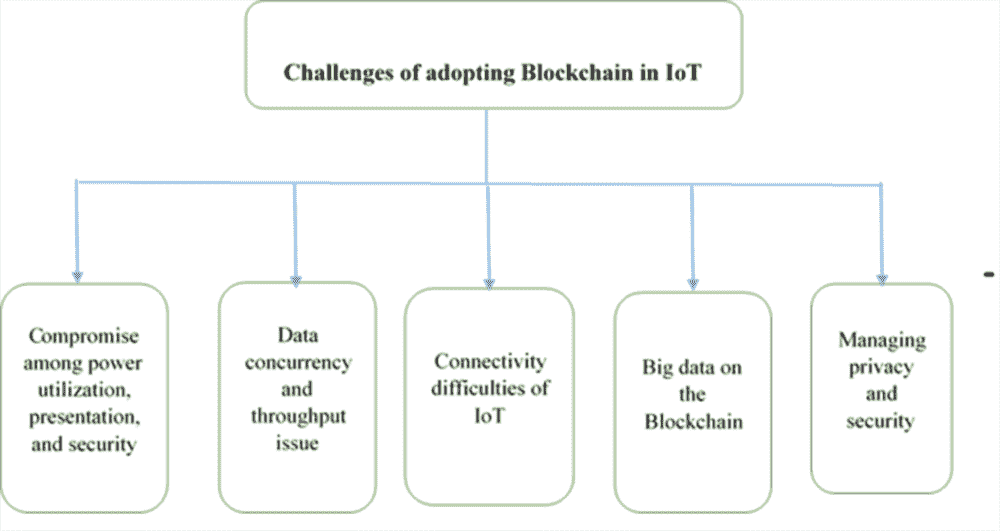

# 第八章

# 用于安全供应链管理的物联网和区块链

+   杰雅希里 K.

    印度的拉贾拉克什米工程学院

+   斯里尼瓦桑 S. P.

    印度的拉贾拉克什米工程学院

+   巴布 R.

    

    印度的拉贾拉克什米工程学院

**摘要**

随着供应链变得更加动态，涵盖了更多的合作伙伴，并且极度依赖于各种外部交易对手，区块链已经成为解决生产链组织内部存在的所有数据、文件、通讯交易混乱的可行选择。每个供应链都会在供应链网络中的不同阶段之间交换大量数据。为了处理海量数据并确保其安全性，供应链可以结合物联网和区块链。这将有助于进一步提高供应链的安全性、功能性、效率和利润。本章讨论了区块链、物联网的背景以及现代供应链面临的一些问题。分析了利用物联网和区块链的供应链的主要优势，并讨论了未来整合物联网和区块链用于供应链管理的研究方向。

**简介**

近来，供应链管理（SCM）和物流方面发生了巨大的变化。对供应链管理和物流的增加关注是由于竞争压力的增加，这导致了其可能被提升为公司运营和策略的一个重要组成部分。这些组织功能的作用相当明显，并且公司希望有效地管理其供应链和物流活动，以维持其在日益动态的商业环境中的竞争地位。

供应链网络仍然是一个协会，以便联系商业及其供应商，制造并传递特定元素给顾客。不同的工作、人员、组织、信息和资源共同构成这个网络。SCM 是一个关键的互动，企业制定先进和创新的供应链以降低成本，并促进更快的制造周期以在市场上有效竞争。在一个有效的供应链中，供应链的使用可以限制在以下关键领域，即采购、资源来源、资产跟踪、需求处理、库存控制、物流和客户关系。尽管它们看起来是独立的结构，但它们高度依赖于彼此（Reet Tuteja & Prabu Shankar, 2021）。

SCM 包括规划和执行涉及获取最终商品的所有过程。它是由人员、公司、组织、技术和工具组成的产品创造网。设计和实施采购，因为它消耗了优势，如良好的效率和效能、商品的降低、满足销售需求等等。尖端技术，如人工智能正在用于 SCM，以帮助企业解决某些问题。然而，在管理包含招募和监控的供应链时，区块链技术有潜力改变处理供应链的方式。在其系统中，一个产品由许多不同厂商提供的部件组成（Dwivedi et al., 2021）。在整个过程中，如果任何制造商或其他实体提供劣质部件，那么检测到劣质部件是非常昂贵的。

本章的其余部分组织如下：第二部分提供了对物联网和区块链的广泛概述；相关工作在第三部分讨论。第四部分讨论了供应链管理中物联网在生物技术中的各种挑战。第五部分讨论了未来的研究方向，第六部分提供了本章的结论。

背景

信息技术的进步在提升、实施和控制商品、组织和信息从起始地点到运营地点的流动和能力方面发挥了关键作用，以扩大消费者满意度。新技术带来的变化速度改变了企业为客户创造和提供价值的方式。

最近，供应链因组织规模扩大、产品组合多样化、客户偏好升级、需求环境不确定、希望与多家供应商合作、需要服务的地理位置众多以及中介的数量增加而变得更加复杂（Kamble 等人，2018 年）。

物联网在供应链管理中的作用

物联网为消费者带来了丰富的好处，并且有可能以根本性的方式改变消费者与技术互动的方式。物联网的普及和相关通信可以为适应组织和个人提供多种便利，但也会产生处理安全性的各种机会。（Jayashree 和 Babu，2018 年）

在供应链和物流中主要使用了五项重要的物联网技术。它们包括射频识别（RFID）、无线传感器网络（WSN）、中间件、云计算和物联网应用软件。

物联网系统的特点

如（Hany F.Atlam，2020 年）所述的特点如下

+   **感知能力**：推动物联网各个领域创新的主要技术是无线传感器网络。WSN 通常是一组传感器，它们收集环境要素的信息，并通过通信载体传输这些信息进行处理。传感器是物联网的构建模块，它们能够收集关于环境的所有实时和上下文信息，从而使决策者能够及时做出准确的决策。

+   **连接性**：连接性是物联网框架的关键特性之一。连接性使得数十亿设备能够保持远程连接。

+   **大规模网络**：大量的设备和物体构成了一个庞大的网络，传统或老式方法无法管理。

+   **动态系统**：物联网具有动态的特性。它可以连接不同位置的各种物体。同时，借助收集各种实时和科学信息的传感器，物联网设备可以动态适应不断变化的情况和条件。

+   **智能能力**：借助先进的硬件、软件和感知能力，使物联网设备能够收集大量上下文信息，并能在多种情况下做出智能决策，并与其他协作对象进行智能集成。

+   **唯一身份**：与互联网连接的能力可以得到保障，前提是每个设备都可以拥有独特的身份或标识符。在物联网系统中，制造商为每个设备提供一个标识，使其能够在发生安全漏洞时向适当的平台通报设备情况。

+   • 自主决策：物联网框架中有许多传感器，因此能够收集有关整体环境的大量相关和实时数据。这些独特的数据使物联网设备能够生成具有透视性和自主性的决策。

+   • 多样性：物联网框架允许各种设备和物品相互寻址和交流。

区块链在供应链管理中的作用

区块链是一种确定的数字记录，存储在公共或私人组织的不同计算机上。每次交易发生时，都会被放入一个块中。每个块都与前一个块和后一个块相关联。依次将块添加到下一个块中，形成不可撤销的序列，并组织交易。当这些块被收集成一个序列时，它们不能被某个特定的人更改。相反，它是通过行政约定进行检查和维护的（程等，2017 年）。

区块链已被其他金融或非金融行业认可，例如银行业、供应链和物流业、制药业、智能合同和网络安全。在不同领域和行业如金融、医疗保健、公用事业、农业、房地产和供应链管理（Neha Jain，2019）中都有许多应用。在供应链中，区块链将有助于跟踪产品从原材料供应商到消费者的旅程。

区块链的关键特征（郑子斌等，2018 年）

+   -   分散化：在传统的交易框架中，每个合同都必须经过相互信任的主要合作伙伴组织的批准，不可避免地导致了服务器的开销和性能阻塞。然而，在区块链网络中，交易可以在两个对等方之间进行，无需通过重要合作伙伴的确认。因此，区块链可以显著降低服务器成本，并减轻主要服务器的性能延迟。

+   -   持久性：由于通过网络传播的每一笔交易都必须保持确认并记录在整个系统中的区块中，几乎不可能进行修改。此外，每个传输的区块都必须得到其他节点的批准，并且交易将被验证。因此，可能很容易发现任何扭曲。

+   -   匿名性：每个客户都可以通过生成的地址与区块链系统进行交互。此外，客户可以生成多个地址以避免身份暴露。当前没有中央方保存客户的隐藏数据。该机制在区块链中保护了一定程度的交易隐私。区块链无法保证绝对的隐私保护，因为存在固有的重要性。

+   -   可审计性：由于区块链上的每一笔交易都经过了时间信息的验证，用户可以在不经过验证和接收任何分布式网络中的节点的情况下追踪过去的记录。

区块链分为三种不同的类型。它们如下所示（Pawade 等，2021 年）：

+   1\. 公共区块链：

公开区块链意味着数据和系统的使用权对于所有有兴趣参与的人都是可用的，例如比特币、以太坊等。

+   2\. 私有区块链：

明确的客户和私人组织使用私有类型的区块链。登录详细信息仅提供给具有真实信息的授权用户。

+   3\. 联邦区块链：

在联邦区块链网络中，不同的实体利用该网络。联邦区块链允许不同的组织使用该网络。联邦区块链类型通常在金融领域和金融应用中使用。

区块链和供应链网络之间存在一些基本特性（Wang 等，2021 年）。首先，在合作方面，区块链和供应链仍然是一种组织安排，两者都包括各种客户、节点、内部或者外部合作伙伴。其次，区块链是一个去中心化的网络，大多数同事/组织通常在传统供应链中做出去中心化的决策。第三，区块链和供应链网络之间的合作密切依赖于节点之间的联系。第四，区块链和供应链的合作程度以及物流有一定的关联度。

区块链在供应链中有三个重要领域，即可追溯性、智能合约和安全交易（Shivam Bajaj, 2018）。可追溯性可以通过有效利用区块链技术和相应的电子追踪技术来实现自动化和简化。智能合约是基于自动化操作的电子合同，这些操作是通过预定义的事件触发的，例如，在质量和按时交付的情况下自动执行付款。安全交易是区块链技术中数据验证的能力，它确保了机密商业文件、交货单或订单和订单确认的安全传输。区块链技术可以提供一个作为整合平台的公共云服务，该平台可以与物联网集成。

区块链与物联网的整合

SCM 是一种旨在协助解决食品不确定性并对普遍医疗问题产生影响的关键运输手段。在一个复合食品供应链中，有效的可追溯性框架能够在食品审查和整体健康方面做出巨大贡献。它可以帮助快速将特定产品和成分与问题的根源分离开来，以防止进一步损失。总的来说，追溯系统在很大程度上依赖于纸质系统或内部计算机系统（Aung & Chang, 2014）。

区块链创新通过物联网的调解将持续促进远程机器诊断、相互数据分析，以及导致更先进的零部件替换和整体维护流程的机器对供应商的连接（Dogo 等，2019 年）。通过结合区块链技术和物联网，贸易伙伴可以实时获取关于关键流程、事件和产品属性（如质量、性能和可用性）的更准确和可靠的数据，从而获得创新和理想的洞察力。这种结合技术可以帮助改善端到端的可追溯性，并实现危险货物的快速检查能力（Fosso Wamba 等，2018 年）。

物联网在供应链中通过四个基本部分（Gohil＆Thakker，2021 年）发挥作用，例如传感器和执行器、互联网通道、边缘 IT 分析和数据中心维护。区块链和物联网的结合扩大了每个与整个供应链相关的利益相关者和个人之间的期望，因为他们可以访问实时数据。链条中的每个人都可以跟踪产品的阶段并接受供应期。这种结合有助于库存管理、订单预测、财务和操作管理以及参与链条中所有个体组织的运营。资产追踪是供应链中 BIoT 最重要的组成部分。通过物联网的帮助，完全可以全面跟踪所有物流供应商的活动，并通过分布式区块链服务器的帮助向链条中的所有成员开放（Pureswaran，2015 年）。

区块链在物联网网络中的相关性取决于几个因素（Kamran 等人，2020 年）。

+   • 如果 IoT 应用需要一个分布式对等生态系统，区块链可以解决隐私和安全问题。

+   • 如果 IoT 应用需要在不受外部方干涉的情况下维持其提供的服务的定价水平，那么区块链可能会成为一种可靠的安全解决方案。

+   • 如果 IoT 应用需要保护记录并追踪业务的顺序，那么区块链可能是最佳解决方案之一。

在物联网框架中执行区块链绝不是一项简单的任务。最重要且首要的步骤是选择要与物联网结合使用的区块链平台（Panarello 等，2018 年）。

以太坊、超级账本和 IOTA 是最常见的可用于将区块链与物联网结合使用的平台。

| 图 1：处理物联网数据上的区块链困难 |
| --- |
|  |

处理物联网数据上的区块链时遇到的困难如图 1 所示，并且如下所述：

+   • 在功耗、性能和安全性之间寻求折衷：追踪区块链算法所需的巨大计算力使得这些技术在资源受限策略上的应用进展缓慢。

+   • 数据并发性和吞吐量问题（Alfonso Panarello 等，2018 年）：在物联网框架中，物联网设备持续不断地传输数据，这导致高并发性（Pradip Kumar Sharma 等，2020 年）。区块链的吞吐量受到其复杂的加密安全协议和共识机制的限制。在区块链节点之间快速汇集不同区块的过程需要更大的数据传输量，这可以改善区块链的输出。

+   • 物联网的连接困难（参见 Hany F Atlam 和 Gary B Wills，2019）：物联网设备需要连接高处理存储和网络资源，与潜在合作伙伴共享物联网数据。物联网在将其与区块链技术相连接方面能力有限，从而为不同领域新应用和服务的实施提供了新的商机。

+   • 区块链上的大数据：在区块链组织中，每个成员都保存着完整的分布式账本的副本。在确认了新的区块后，该区块被传播到分布式的节点网络中，并且每个节点都将确认的区块附加到本地账本中。虽然分散式存储解决方案提高了效率，解决了瓶颈问题，并消除了对第三方信任的需求（参见 Elena Karafiloski 和 Anastas Mishev，2017），但利用区块链管理物联网数据的服务在成员的存储空间方面一直存在压力。

+   • 处理隐私和安全性方面的挑战：区块链可以确保交易的透明度，在某些应用场景中如金融领域至关重要。然而，当存储和分析来自特定物联网系统（如 eHealth）的物联网数据时，用户的隐私可能会受到不利影响（参见 Tianqi Yu 等人，2019）。为了保持透明度和隐私的合理水平，针对物联网利用区块链的可持续访问机制的发展仍然至关重要。

+   • IoT 中可变区块链的困难：尽管一些区块链创新元素以及转移、保密、不变性和自动化等安全解决方案适用于不同的物联网应用，但上述元素的组合导致了各种新的监管挑战（Joshua Ellul 等人，2020 年）。持久性特征意味着数据永久发布在点对点网络的分布式账本上，不能被删除或修改。同样，由于缺乏管理，记录不能在发布到区块链之前进行隐私保护。

相关工作

关于全球商业运营，各种合作伙伴为中心的供应链，基于物联网的应用不断改进，以处理与生产、功能机制、分发和物流相关的更准确和及时的数据（Ing-Ray Chen 等人，2014 年）。Abderahman Rejeb 等人（2019 年）讨论了物联网和区块链技术交汇点的主要审查领域，包括适应性、安全性、不变性和检查、数据流的效率和效能、可检测性和互操作性以及质量。Rahul Raman 等人（2021 年）提出了一个框架，用于追踪从农民到消费者的奶制品。Hyperledger Fabric 结构采用了特定的架构和具有协议的功能，用于构建该系统。Hyperledger Fabric 拥有八个主要考虑因素，用于构建 Hyperledger Fabric 区块链开发者、区块链监管者、区块链运营商、区块链架构师、区块链用户、遗留数据协调员、传统处理平台和参与服务。

Algan Tezel 等人（2020 年）介绍了一个旨在供应链中发生的商业依赖性场景中引入必要和可选信息的区块链组织，然后需要对相关的功能周期进行彻底思考和改进。所提出的结构提供了更高的数据收集和恢复的可靠性，以及数据监测。然而，私有区块链仍然存在着易受黑客攻击和关键性广泛数据验证机制的弱点。此外，私有区块链之间无法相互连接。为了解决这些明显的挑战和技术限制，需要进行更多的审查，以进一步认识参与者的能力和贡献。Antonios Litke 等人（2019 年）讨论了区块链在供应链行业中的全面分析。因此，他们描述了影响供应链的区块链的精确要素，如可扩展性、性能、共识机制、隐私考虑、位置证明和成本。

Nakasumi 着眼于基于区块链的密钥，以解决供应链问题的一部分，例如双重边际化和数据不对称等等。这项研究解决了构建高效供应链的重要性。为了创建它，该研究建议知识是供应链中制造商的主要工具之一。由于生产活动所产生和交换的大量数据，该研究指出了认识最重要的数据并仅专注于导致未来供应链层面变化的“战略交易”的重要性。区块链能够被设计用于加密目的，并存储在链上的信息以及记录时间戳交易。此外，它们能够通过使用智能协议自动化契约，以跟踪基于一系列情况、关系和参与者协议的技术。Tandon 等人（2019）对区块链技术及其提供的解决安全和隐私任务的方式进行了调查。作者讨论了将区块链与物联网整合的优点和挑战。Sohail Jabbar 等人（2021）提出了 MOHBSChain，一种用于区块链驱动的库存链的新型结构。根据来自德语和英语专家的精确数据，利用扎根理论方法制定了供应链管理中区块链潜力的计算模型（Härtinga 等人，2020）。这些数据提出了效率、信任、控制、灵活性、安全性和成本作为重要的影响因素，这些因素已经被多次提及并被几位专家强调，因此被视为该模型的基础。此外，数据的分析表明，区块链技术的潜力通过使用案例、合作、数据以及管理体系来指导不同的影响因素。

Hedge 等人（2020 年）提出了在农业供应链中标准执行区块链的方法。现代农业供应链存在各种问题，例如中间商和代理商倾向于促销渠道向价值方向推进，给生产者带来损失。生产者需要及时、准确的市场趋势、季节性波动、定价、质量和数量需求等信息。如果可以利用区块链传递关于供应链的可靠信息，那么可以避免信息缺失、误解以及不同层级之间的信任缺失。生产者可以做出明智的决策，从而获得更多的利润和减少损失。Fotiou 等人（2018 年）提出了基于区块链技术的权利转让机制、验证和支付解决方案。Zhang（2016 年）实施了一种基于普适社交网络的医疗保健系统。通过利用区块链，数据在普适社交网络节点之间进行分散，从而确保安全性。

Qu 等人（2019 年）在处理零售商订单时建议使用消费者订购共识协议，以安全而有效地替代面向商业的消费者贸易组织。该协议使用智能合约和区块链技术来实施。在这个框架中，买家通过智能合约提出订单请求，然后将智能合约发送到以太坊区块链网络。请求将通过交易信息保存在区块中。请求将发送到所有组织成员，包括码头和运输商，然后确认每个中心接收到的请求数据。如果有异常情况或无效的请求，将根据协议机制向客户发出拒绝警告。然后客户可以选择是否重新下单。该策略将持续进行，直到下一个阶段处理订单请求。在所有节点都批准订单请求后，商品将从经纪人提供给客户。

PetriHelo 和 Shamsuzzoha（2020 年）提出了一种通过 RFID、物联网和区块链技术结合的入口，以及一个及时的解释。短期数据通过 RFID 和物联网提供，而可靠的结构化注册表由区块链技术提供。该系统通过提高交易的可见度和防止虚假披露，提供了本地持久数据的权威管理，以及透明度和信心的增加。尽管区块链和智能合约技术具有巨大的潜力，但对于与内容相关的查询的实际解决频率仍然较低，并且迫切需要本地存储。未来的研究应该专注于在将 ERP 和运输监控软件与多群集区块链网络相结合的情况下提高完整性和效率。

Seyed Mojtaba Hosseini Bamakan（2021 年）提出了一种面向服务供应链（SSC）的展览评估框架。首先，为了分析问题的基础，介绍了一种逐渐推进的 SSC 执行评估模型系统。该系统包括三个层次：测量、模型和关键绩效领域。在随后的阶段，研究人员提出了一种基于自适应网络模糊推理系统（ANFIS）的原型模型，用于执行评估。研究人员还通过整合区块链技术、物联网和智能合约提出了 Di-ANFIS 结构，以实现安全、可信且智能的执行评估框架。Di-ANFIS 设计包括六个层次，例如信息、组织、区块链、智能、ANFIS 和应用。上述结构能够在供应链中跟踪和传输数据以及收集的信息，确保其在一个稳固且精心设计的环境中进行。

Sun 等人（2018 年）提出了基于以太坊区块链的富-贫客户端 IoT 关键技术，用于解决资源受限的 IoT 环境下的问题，同时在 IoT 中的区块链挖掘方面取得了进展。设计针对 IoT 的特定协议将有助于在基于 IoT 的供应链中集成区块链，并提供开发内容导向的协议的机会。总的来说，这些进步将通过与其他 IoT 节点的实际数据和历史数据的交叉验证来增强敏感数据的可信度。

Pongnumkul 等人（2017 年）对以太坊和超级账本的展示和限制进行了一项实施检验。以上结果显示，超级账本的传播时间、性能和吞吐量在很大程度上优于以太坊。区块链在椭圆曲线数字对数问题方面容易受到重大攻击的影响。这个问题被用于验证区块链中的交易。反量子交换验证方法被引入到了区块链中（Yin 等人，2015 年）。

研究人员提供了关于区块链技术对不同智能应用的重要性的经验，其中安全性至关重要（Umesh Bodkhe 等，2020 年）。该工作分为四个部分进行讨论。第一部分探讨了传统安全框架、区块链的基础和历史。第二部分描述了区块链技术的基本架构，包括在分布式网络中验证每个交易，从而为数据或信息创建了持久、验证和不可更改的记录。此外，区块链参考架构包括三个不同的网络，如公共网络、云网络和企业网络。第三部分着重介绍了区块链在智能医疗、智能农业、供应链和物流、商业、旅游和酒店业、能源、农业、数字内容分发、智能城市、物联网和制造业等不同应用中的最新部署情况。第四部分集中讨论了基于工业 4.0 的智能应用中存在的公开问题和挑战，并针对这些应用提出了一些基于区块链的解决方案。

冯天（2016 年）展示了一个基于 RFID 和区块链技术的食品供应全球定位系统。该系统包括收集、传输和分发真实数据，并在所有当前环节保留数据，用于监测、跟踪和追踪农产品的生产。该系统消除了对可靠的中型组织的需求，并提供了一个平台，以实现公开、透明、公正、诚信和安全。尽管存在一些障碍，随着技术的进步，区块链仍处于起步阶段，并且在实践和高昂的 RFID 价格方面存在一些缺陷。未来，该技术将致力于提高和确保农产品的质量和安全性。

IOTA 可以被定义为一个分布式平台，用于处理和处理互联设备之间的多个交易。简而言之，IOTA 执行的是一个交易的有向非循环图而不是多个交易的链式块。这提供了一些好处，例如它提供了一种轻量级解决方案，因为共识不需要大多数传输节点来支持不同的增加的交易，实际上，两个交易可以由单个节点验证，向其自己提交一个交易。这减少了交易时间和开销（Raschendorfer 等，2019）。

Al-Rakhami 和 Al-Mashari（2021）提出了一种信任模型，使用轻量级方式来推进一个开放和可检测的框架，利用区块链技术。所提出的模型可以减少存储、延迟和计算要求。当人工智能平台和技术与区块链整合在一起，可以识别数据模式和预测分析，包括预测未来需求，从零售点系统中获取数据，购买信息历史，预测销售模式，提前发现潜在问题，优化到达目标的路线，并管理整个供应链中的网络流量（Salah 等，2019）。

物联网和区块链在供应链管理中的挑战

传统供应链流程，特别是全球贸易，存在大量的通信和文件，因此需要大量的时间和精力来完成。上述内容包括行政文件和合同，因此组织将需要花费资金来提供这些内容。区块链可以通过将每个文档或文件单独传输并与不同部门或企业结合，从而大大减少通信或传输文件的工作量，并改善供应链中的数据共享（Benton 等人，2018；Wollschlaeger 等人，2017）。

利用区块链在工业物联网中的优势包括可扩展性、安全性、分布式和可疑性、弹性和可审计性特征（Bahga 等人，2016）。在区块链上处理物联网数据时面临的困难包括功耗、执行和安全数据同步与吞吐量问题之间的折衷、在区块链上处理大数据、保持透明度和隐私的挑战、监管物联网中的区块链的挑战（Ashraf Uddin 等人，2021）。目前，该行业在将区块链纳入当前供应链管理时面临的挑战包括性能、可扩展性和隐私（Mark H. Meng & Yaou Qian，2018）。

影响区块链物联网（BIoT）应用发展的主要因素是（Aggarwal 等人，2021）。

+   -   能源效率

区块链由于挖掘和点对点通信而消耗大量电力。由于共识过程，像比特币这样的区块链在挖矿系统中消耗了大量电力。由于点对点通信，仍然会消耗大量持续电力，造成了能源的大量浪费。

+   -   隐私

隐私仍然是物联网环境中的主要关注点，然后物联网应用程序面临证书问题。为了克服隐私问题，零知识证明开始行动，因此在任何交易期间不涉及用户的身份，并且存储首选的验证程度。

+   • 吞吐量和延迟

设计，类似于区块链的设计，应该被要求在部署物联网时控制单位时间内的大量交易。此外，这将成为诸如比特币之类的网络的挑战因素，比特币每秒最多支持七笔交易。

未来的研究方向

Kamalendu pal & Ansar-UL-Haque Yasar，(2020)讨论了基于区块链和物联网的融合，商业数据交易伙伴通过进一步精确和可靠的数据，连续获得关于重要周期、事件和产品属性（如质量、性能和可用性）的新的便利经验，这种物联网和区块链的结合可以帮助提升端到端的可追溯性，以及实现对危险货物的快速检查能力。因此，交易伙伴将被告知有关产品、潜在风险以及支持安全产品流向消费者所需的障碍和纠正措施。

Clement Nartey 等人，(2021)讨论了为了升级 BIoT 应用程序和解决方案，需要在某些领域进行进一步的研究和分析，以使企业安全、安全和灵活。这些领域包括以下内容：

+   基于机器学习的 BIoT 应用程序隐私和安全解决方案：关于针对 BIoT 保护和安全的人工智能实施已经在讨论中，但是评估其他 AI 算法如 K-NN 以及更深层次的学习和分类方法以实现更好的干扰检测和安全保护是明智的。

+   去中心化的技术挑战：由于对可扩展性、安全性和隐私的担忧，提出的大多数 BIoT 应用程序都需要改进某种类型的对区块链的控制。需要进行调查和研究，以帮助减少对控制的偏好，并朝着真正去中心化的设计方向，这对于 BIoT 应用程序是灵活的。

+   区块链基础设施：信任仍然是利用区块链上的物联网的基本组成部分；因此，上述内容对于拥有真正解决信任问题的区块链框架至关重要，因此物联网设备产生的数据非常重要。对于这一问题，已经提出了各种方法，但它们大多依赖于跨域方法和控制系统。

+   治理、法规和法律方面：由于区块链世界具有高度的去中心化特性，因此被许多人认为是“无主之地”。尚无重要的规定或法律方面的约束来限制区块链及其实施的使用。缺乏这种形式管理的物联网事实上可能非常危险。

结论

物联网节省时间并极大丰富了生活的价值（Babu & Jayashree，2016）。在供应链中集成区块链和物联网有助于供应链个体减少他们在传统供应链管理中负责的代表，并保护他们的巨额收入。工业界可以通过传感器有效地减少特征验证和维护团队的人员，并通过物联网将持续数据传输到区块链服务器。分配的管理者可以通过传感器监视整个生产过程，并根据区块链服务器上的信息和数据更改必要的位置。对于某些组织而言，这是至关重要的，因为它可以建立起有效率的关键性能指标以提高流程的效率；区块链-物联网可以帮助组织在持续的基础上提升其关键绩效框架，这对所有利益相关者都是明显的。已经提出了物联网、区块链以及在供应链管理中集成区块链和物联网的概述。

参考文献

Aggarwal, V., Sharma, K., Kaushik, N., Bhushan, B., & Himanshu. (2021). 区块链和物联网（B-IoT）的集成：架构、解决方案和未来研究方向。IOP Conf. Series: Materials Science and Engineering, 1022. 10.1088/1757-899X/1022/1/012103

Al-Rakhami, M. S., & Al-Mashari, M. A. (2021). 基于区块链的物联网供应链管理信任模型。《传感器》（巴塞尔），21（5），1759。doi:10.3390/s21051759

Atlam, H. F., Azad, M. A., Alzahrani, A. G., & Wills, G. (2020). 区块链在物联网和人工智能大数据中的回顾。《认知计算》，4，28。

Atlam & Wills. (2019). 区块链和物联网的技术方面。在《计算机进展》（第 115 卷，第 1–39 页）。爱思唯尔。

Aung, M. M., & Chang, Y. S. (2014). 在食品供应链中的可追溯性: 安全和质量的视角。 Food Control , 39, 172–184\. doi:10.1016/j.foodcont.2013.11.007

Babu, R., & Jayashree, K. (2016). IoT 和云在医疗保健中的突出作用。 International Journal of Advanced Research in Computer Engineering & Technology , 5(2), 420–424.

Bahga, A., & Madisetti, V. K. (2016). 工业物联网的区块链平台。 Journal of Software Engineering and Applications , 9(10), 533–546\. doi:10.4236/jsea.2016.910036

Bajaj. (2018). 基于区块链和物联网的全球供应链可追溯性智能容器管理。 IJARIIE, 4(4).

Bamakan, S. M. H., Faregh, N., & ZareRavasan, A. (2021). Di-ANFIS: 一种集成的区块链-IoT-大数据启用框架，用于评估服务供应链绩效。 Journal of Computational Design and Engineering , 8(2), 676–690\. doi:10.1093/jcde/qwab007

Bodkhe, U., Tanwar, S., Parekhi, K., Khanpara, P., Tyagi, S., Kumar, N., & Alazab, M. (2020). 工业 4.0 的区块链: 一篇综述。 IEEE Access: Practical Innovations, Open Solutions , 8, 79764–79800\. doi:10.1109/ACCESS.2020.2988579

ChenI.-R.GuoJ.BaoF. (2014). SOA-based IoT 系统中服务组合的信任管理。 Proceedings of the IEEE Wireless Communications and Networking Conference (WCNC), 3444-3449\. 10.1109/WCNC.2014.6953138

ChengS.ZengB.HuangY. Z. (2017). 区块链技术在分布式电力市场中的应用模型研究。 IOP Conference Series: Earth and Environmental Science, 93.

Dogo, E. M., Salami, A. F., Aigbavboa, C. O., & Nkonyana, T. (2019). 将云计算推向极端边缘: 非洲智能城市和工业 4.0 中 Mist 计算的评述。 Edge Computing, 107–132.

Dwivedi, Roy, Karda, Agrawal, & Amin. (2021). 基于区块链的物联网和工业物联网：一项全面调查。Hindawi 安全与通信网络。

Ellul, Galea, Ganado, Mccarthy, & Pace. (2020). 监管区块链、分布式账本技术和智能合同：技术监管者的视角。ERA 论坛，21，209–220。

Fosso Wamba, S., Kamdjoug, K., Robert, J., Bawack, R. G., & Keogh, J. (2018). 比特币、区块链和金融科技：供应链的系统性审查和案例研究。生产。计划。控制。

Fotiou, N., Siris, V. A., & Polyzos, G. C. (2018). 使用智能合同和区块链技术与物联网交互。在计算机科学讲座笔记中（第 11342 卷，第 443–452 页）。斯普林格。

Gohil & Thakker. (2021). 整合区块链技术解决供应链挑战。现代供应链研究与应用，3(2)，78-97。10.1108/MSCRA-10-2020-002

Härtinga, R., Sprengela, A., Wottlea, K., & Rettenmaiera, J. (2020). 区块链技术在供应链管理中的潜力——概念模型。第 24 届知识和智能信息工程国际会议。Procedia 计算机科学，176，1950–1959。doi:10.1016/j.procs.2020.09.334

HegdeB.RavishankarB.AppaiahM. (2020). 使用区块链技术的农业供应链管理。主流区块链实施国际会议，1-4。10.23919/ICOMBI48604.2020.9203259

Helo, P., & Shamsuzzoha, A. H. M. (2020 年 6 月)。实时供应链——项目交付的区块链架构。机器人与计算机集成制造，63，101909。提前在线发表。doi:10.1016/j.rcim.2019.101909

Jabbar, S., Lloyd, H., Hammoudeh, M., Adebisi, B., & Raza, U. (2021). 区块链启用的供应链：分析、挑战和未来方向。多媒体系统，27(4)，787–806。doi:10.1007/s00530-020-00687-0

Jain. (2019). 基于区块链的应用的安全问题。《国际工程与先进技术杂志》，8(6S)。

Jayashree, K., & Babu, R. (2018). 物联网中的隐私。《现代商业环境中的物联网》。10.4018/978-1-5225-2104-4.ch005

Kamble, S., Gunasekaran, A., & Arha, H. (2018). 了解供应链中的区块链技术应用-印度情境。《国际生产研究杂志》，25。

Kamran, M., Khan, H. U., Nisar, W., Farooq, M., & Rehman, S.-U. (2020). 区块链和物联网：一项文献计量研究。《计算机与电气工程》，81，106525。doi:10.1016/j.compeleceng.2019.106525

Karafiloski & Mishev. (2017). 区块链解决大数据挑战：文献综述。在 IEEE EUROCON 2017-第 17 届智能技术国际会议上（第 763–768 页）。IEEE。

Litke, A., Anagnostopoulos, D., & Varvarigou, T. (2019). 供应链管理的区块链：面向全球规模部署的架构要素和挑战。《物流》，3(1)，5。doi:10.3390/logistics3010005

Meng & Qian. (2018). 供应链管理中的区块链应用：机遇、挑战和展望。第三届分布式账本技术研讨会。

Nakasumi, M. (2017). 基于区块链技术的供应链管理信息共享。IEEE 第 19 届商业信息学会议。

Nartey, C., Tchao, E. T., Gadze, J. D., Keelson, E., Klogo, G. S., Kommey, B., & Diawuo, K. (2021). 区块链和物联网集成平台：当前实施挑战和未来展望。Hindawi 《无线通信与移动计算》，2021，6672482。doi:10.1155/2021/6672482

Pal & Yasar. (2020). 服装制造供应链数据管理中的物联网和区块链技术。《计算机科学会议论文集》，170，450–457。

Panarello, A., Tapas, N., Merlino, G., Longo, F., & Puliafito, A. (2018). 区块链与物联网融合：一项系统调查。传感器（巴塞尔）, 18(8), 2575\. doi:10.3390/s18082575

Panarello, A., Tapas, N., Merlino, G., Longo, F., & Puliafito, A. (2018). 区块链与物联网融合：一项系统调查。传感器（巴塞尔）, 18(8), 2575\. doi:10.3390/s18082575

Pawade, R., Biradar, S., Rakshita, S., Ramegowda, S., & Rumma, S. S. (2021). 医疗交互系统的区块链技术全面审查。国际工程研究与技术期刊。

Pongnumkul, S., Siripanpornchana, C., & Thajchayapong, S. (2017). 不同工作负载下私有区块链平台的性能分析。2017 年第 26 届国际计算机通信与网络会议论文集, 1–6\. 10.1109/ICCCN.2017.8038517

Pureswaran, V. (2015). 授权边缘-关于分散式物联网的实用见解。IBM 商业价值研究所。

QuF.HaddadH.ShahriarH. (2019). 基于智能合约的安全企业对消费者供应链系统。IEEE 区块链国际会议, 580-585\. 10.1109/Blockchain.2019.00084

Rahul Raman, Sushmitha, & Nalini. (2021). 区块链技术在供应链管理中的调查论文。国际工程科学研究杂志, 9(6), 79-86.

Raschendorfer, A., Mörzinger, B., Steinberger, E., Pelzmann, P., Oswald, R., Stadler, M., & Bleicher, F. (2019). IOTA 作为制造业 M2M 经济的潜在推动者。CIRP 会议论文集, 79, 379–384\. doi:10.1016/j.procir.2019.02.096

Rejeb, A., Keogh, J. G., & Treiblmaier, H. (2019). 利用物联网和区块链技术进行供应链管理的未来。未来互联网。学术出版社。

Salah, K., Rehman, M. H. U., Nizamuddin, N., & Al-Fuqaha, A. (2019). 区块链与人工智能：回顾与开放性研究挑战. IEEE Access: 实用创新，开放解决方案，7，10127–10149。doi:10.1109/ACCESS.2018.2890507

Sharma, P. K., Kumar, N., & Park, J. H. (2020). 区块链技术助力绿色物联网：机遇与挑战. IEEE 网络，34(4)，263–269。doi:10.1109/MNET.001.1900526

Sun, H., Hua, S., Zhou, E., Pi, B., Sun, J., & Yamashita, K. (2018). 在物联网中使用以太坊区块链：电动汽车电池加油的解决方案. 计算机科学讲义(第 10974 卷，第 3–17 页)。 Springer。

Tandon, A. (2019). 区块链技术与物联网的经验分析及其应用. 创新技术和探索工程国际期刊，8，1470–1475。

TianF. (2016). 基于 RFID 和区块链技术的中国农产品供应链可追溯系统. 服务系统与服务管理国际会议(ICSSSM)，1-6。10.1109/ICSSSM.2016.7538424

Tuteja, & Shankar. (2021). 一种利用区块链保护供应链管理的新技术. 物理治疗与康复土耳其杂志，32(2)，3467–3487。

Uddin, M. A., Stranieri, A., Gondal, L., & Balasubramanian, V. (2021). 区块链在物联网中的应用调查：挑战与解决方案. 区块链，研究与应用。doi:10.1016/j.bcra.2021.100006

Wang, M., Wu, Y., Chen, B., & Evans, M. (2021). 区块链与供应链管理：供应链整合与协作的新范式. 运营与供应链管理，14(1)，111–122。

Wollschlaeger, M., Sauter, T., & Jasperneite, J. (2017). 工业通信的未来：物联网和工业 4.0 时代的自动化网络. IEEE 工业电子杂志，11(1)，17–27。doi:10.1109/MIE.2017.2649104

Yin, W., Wen, Q., Lin, W., Zhang, H., & Jin, Z. (2015). 区块链中的抗量子交易认证方法。IEEE Access：实用创新，开放解决方案，14。

Yu, Wang, & Zhu. (2019). 5G 启用物联网系统的区块链技术：原理，应用和挑战。5G 启用物联网。

Zhang. (2016). 一种用于普及社交网络医疗的安全系统。普及社交网络信任管理专栏（TruPSN）。

Zheng, Z., & Shaoan, X. (2018). 区块链的挑战与机遇：一项调查。国际网页与网格服务杂志，14(4)，352。doi:10.1504/IJWGS.2018.095647
