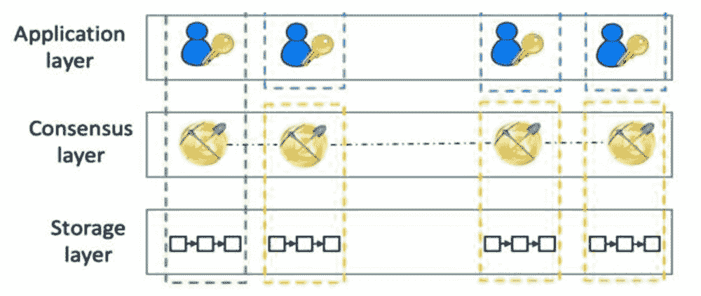
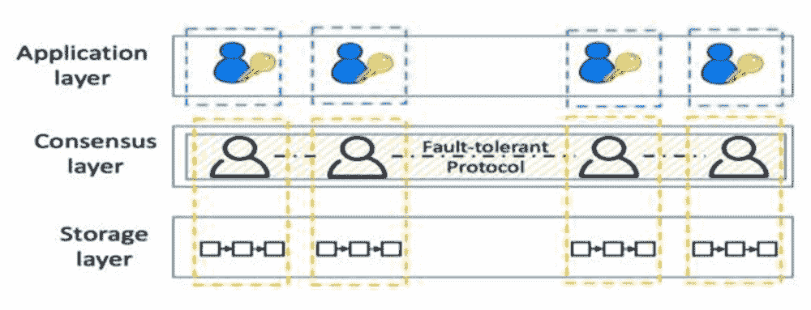
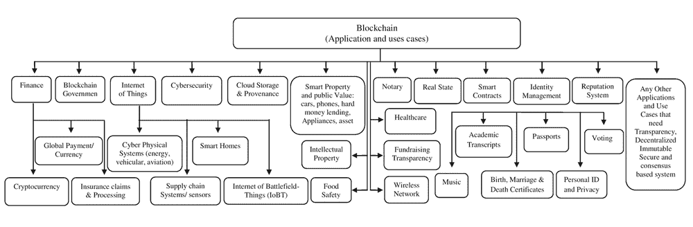

# 第九章

# 通过区块链改造资产管理系统

+   Ankur Agrawal

    [印度夏尔达大学](https://www.sharda.ac.in/)

+   Swati Bansal

    

    [印度夏尔达大学](https://www.sharda.ac.in/)

+   Monica Agarwal

    [印度夏尔达大学](https://www.sharda.ac.in/) 

+   Reema Agarwal

    印度劳埃德管理与技术学院

+   Mohammad Rumzi Tausif

    沙特阿拉伯的沙特阿卜杜拉齐兹王子大学

摘要

当今全球普遍存在区块链的概念。它展现了显著的增长，并通过执行点对点加密货币系统取得了许多成就。加密货币于 2009 年推出，但在 2017 年在全球掀起了关于数字货币的热潮。区块链基于“分布式分类账/数据库”的概念运作。交易按时间顺序记录并复制到所有参与方。区块链已被证明是不可变的，并通过一对私钥和公钥提供了责任、完整性和相当多的保密性。由于其显著特点，各个行业已经开始使用区块链。资产管理也是区块链可以减少交易成本、批准等待时间并增加透明度的领域之一。资产管理的复杂流程可以通过统一许可和无许可区块链来自动化。本章讨论了资产管理公司如何利用区块链机会以发挥其效益。

引言

区块链可以被定义为一个“分布式分类账/数据库”，以记录交易的发生顺序，而无需任何中央机构的干预。区块链概念最早于 2008 年引入，并在 2009 年的一种名为比特币的加密货币中使用。这种比特币在 2017 年激起了加密货币市场的狂热。比特币和区块链在加密货币文献中被用作同义词，但前者是一种应用，而后者是一种概念或框架。在概念上，区块链是一个连续的区块链，这些区块类似于手动分类账中的页面。随着交易的发生，它以称为密码学的编码语言的形式传输到整个区块链网络中。

在传统的交易管理系统中，需要信任的第三方来认证交易。与此同时，区块链工作在一个点对点网络系统上，不需要集中式或信任的第三方来认证交易。网络中的任何特定方/节点都充当矿工。矿工在区块链网络中充当交易验证代理。唯一的要求是矿工必须解决附加在交易中的高度编码的谜题，以确保没有双重花费和其他真实交易的参数。一旦矿工验证了交易，它就会更新到所有网络节点。

尽管区块链常与比特币和加密货币等同义，但该概念的应用正在不断扩展到其他领域，如全球支付、保险理赔处理、战场物联网（IoBT）和物联网（IoT）。区块链技术的显著特点，如其结构、不可篡改性、去中心化和完整性，正在使其成为金融服务应用的可行选择。借助这项技术，金融交易可以在没有任何银行或其他中介机构的情况下进行。

从应用的角度来看，区块链系统可以分为：

+   1\. 无许可区块链系统主要用于加密资产，如比特币。这种区块链是公开的，因此任何节点都可以在没有任何指定机构许可的情况下参与维护区块链（Nakamoto,2008）。无许可区块链用于私人身份之间的加密货币交易。通过挖矿过程，会创建新的货币单位。

+   2\. 而对于已知先验方的网络，则维护了一个许可的区块链网络以管理区块链。共识协议用于在受信任的方之间达成对交易的共识。

区块链上的资产（如汽车和房屋）存在几个挑战。首先，我们必须检查资产的实际存在、注册和实际所有者。其次，还需确保资产未被两次或两次以上出售，或者同时被两个或两个以上人员出售。最后，还必须知道资产的转移是否符合当地法律的规定。

本章的主要目标是讨论如何通过应用区块链机制改进资产管理。为此，需要结合许可和无许可区块链的组合。我们还将讨论统一许可和无许可区块链的完整概念和模型，以及适当的理论和可行的技术框架。

在深入讨论该主题之前，我们需要了解区块链的以下基本组成部分：

+   1\. 业务网络：业务网络是一群有共同或商业利益的人，通过交换商品和服务来创造财富。

+   2\. 参与者：参与者有共同的利益，如供应商、客户、供应商、合作伙伴和第三方供应商。对于无许可区块链，参与者可能是匿名的，而对于有许可的区块链业务网络，参与者应该是已知的。

+   3\. 资产：资产可以定义为“能够拥有或控制以产生价值的任何东西”。资产通常被分类为有形资产和无形资产。这两种类型的资产交易都是通过业务网络进行的，为参与实体创造经济价值。

+   4\. 交易：交易可以定义为交换具有经济价值的任何东西，称为资产。参与者在无许可（比特币）交易中是未知的，而在有许可的区块链业务交易中是已知的。

+   5\. 合约：区块链合约是自动执行特定任务的功能，它们是为此目的而创建的。一旦条件匹配，智能合约将自动触发。

+   6\. 分类账：分类账是业务交易的按时间顺序记录。在区块链中，分类账被共享和复制到区块链节点之间；一旦验证

资产管理

资产管理可以定义为“管理资产从一个实体到另一个实体的过程”。资产管理框架管理着有价值的事物，无论是有形的还是无形的，来自一个实体或一组实体。资产的例子有很多，比如商品、债券、债务、股票、房地产和私募股权，传统资产管理框架中涉及许多中介，如经纪人、审计师、资产管理者、审批人和保管人。这些中介增加了时间和成本，同时也存在资产管理系统中的某些漏洞。

资产管理的手动交易流程耗时且容易出错，因为它涉及许多中介。此外，每一方都必须保留自己的记录。因此，要解决任何交易需要时间。让我们举一个资产的传统交易流程的例子。为了找到值得信赖的投资者，卖车人会寻找一个实体或电子平台来销售车辆——所有者将合同委托给经纪人寻找适当的买家并为所有者提供优惠。第二个选项可能是所有者选择同样的电子平台。由于电子经纪人（电子平台）的经纪人充当买方和卖方之间的纽带，经纪人必须对卖方-买方和资产（即汽车）进行尽职调查。经纪人或预订机构还有责任处理销售契约，并将车辆适当注册到买方名下，并在从一方/双方收取佣金后将款项转入卖方帐户。

区块链及其架构

+   1\. 无需许可的区块链

这些区块链被用于比特币和无需许可的网络，因为它对所有人开放。无需许可的区块链资产表示为资产类型。它代表所有权和以货币单位计量的货币价值。交易用于将资产和货币单位的所有权从一方转移到另一方。"Party"代表交易中的身份，用数字签名表示。共识协议用于验证所有权，它是存储层，其中存储了资产所有权信息。身份用于确定资产所有者，然后使用公钥进行进一步实施（Nakamoto，2008）。

一个无需许可的区块链系统（Alladi 等，2020）主要包括三个层次，即：（i）应用层，（ii）共识层和（iii）存储层。这些在图 1 中显示。

| 图 1\. 权限区块链架构（Zakhary 等，2019） |
| --- |
|  |

+   a. 应用层

    +   交易是终端用户发起交易的第一层。终端用户的身份由公钥定义，而他们的私钥生成签名。因此，交易是通过数字签名生成的。一旦交易生成，它就会在网络的所有节点上复制。

+   b. 共识层

在权限区块链中，挖矿是建立共识的手段。挖矿只是一个交易验证过程。验证交易的节点被称为挖矿节点。每个交易都附有一个加密难题。矿工通过解决附加的难题将有效交易放入一个区块中。验证后，节点被区块更新。交易区块由矿工接收以推动区块链的进展。只有在解决了难题之后，交易才会得到认证并作为一个区块添加到区块链上。

+   c. 存储层

它包含一个不可篡改的账本副本。账本每个区块都会更新。然后挖矿节点会维护这个账本。存储层包含一个通常是去中心化的分布式账本。一组开放节点会管理这个账本。每个账本包含终端用户之间的资产转移的有效交易。

+   2\. 权限区块链

在权限区块链中，节点是已知并且可识别的。然而，尽管所有节点都是已知的，它们彼此之间缺乏信任。区块链起源于比特币-加密货币。然而，最近，它已经关注到其突出特征，如安全性，来源，真实性和透明性。此外，由于它满足了大多数交易所需的功能，它也可以应用于其他领域，如医疗保健，保险，SCM 和物联网（Nakamoto，2008）。

有许可的区块链几乎与无许可的区块链相似，只是共识程序有所不同。它由（i）应用层，（ii）共识层和（iii）存储层组成。

+   a. 应用层

有许可的区块链的应用层，最终用户使用他们的公钥在网络上提交他们的交易。应用层的过程和功能对于无许可的区块链和有许可的区块链来说是相同的。

+   b. 共识层

有许可的区块链中的共识层与无许可的区块链不同。这里挖矿被共识协议（Cachin，2016 年）所取代。订单和验证交易由共识层以与无许可区块链相同的方式处理。

+   c. 存储层

有许可的区块链中的存储层类似于无许可区块链。这一层维护和管理着每一次有效交易后更新的分类帐。

| 图 2\. 有许可的区块链架构（Zakhary 等，2019 年） |
| --- |
|  |

资产管理区块链的应用框架

这个资产管理系统可以通过统一的无许可和有许可的区块链网络来开发。所有机构的办事处和办事处都需要建立自己的有许可的区块链网络。为了注册他们的资产，最终用户可以请求

政府办公室通过一些无许可区块链的智能合约注册他们的资产。对于这种注册，最终用户必须支付特定费用。现在，政府办公室将有责任检查资产的注册，只有在确保它在唯一的无许可区块链中注册后才能进行。

这是必须检查的，以确保资产不会通过多个智能合约进行销售或尝试销售给最终用户。这在技术上称为双重开支。如果政府办公室对没有双重开支感到满意，就应该发布经过认证的智能合约。然后，政府办公室检查双重开支，并将当地法律编码到智能合约中。经过所有这些检查和验证，政府办公室可以部署智能合约，包括在无需许可的区块链上对最终用户的注册请求中。

资产只能通过智能合约注册，而且在无需许可的区块链上允许政府办公室的身份进行交易。最终用户可以使用最终用户的私人身份进行交易。整个过程还确保了遵守当地的法律。

例如，我们为资产管理（汽车）创建了一个场景；RTO-德里为汽车注册建立了一个许可的区块链网络。Anurag 想要在网络上注册他的车，他通过智能合约提出了请求。 RTO 办公室还向制造公司发布智能合约，说明了这辆车所有权的转让和政府税款的支付。在确保了双重开支并验证之后，Anurag 的注册信息存在于许可的区块链的所有节点上。

现在，如果一个有效的当事人，比如 Manoj，愿意购买 Anurag 的车。Manoj 首先确保 RTO 办公室的身份证明了这辆车；为此，他启动了一个智能合约来检查车辆在 Anurag 名下的注册是否有效。如果检查结果正确，Manoj 只能在调用“购买函数”应用/请求后购买车辆。这个函数附加在网络的挖矿节点上。这个应用/请求与货币单位的提供一起执行。货币应以 Manoj 希望为车辆报销的面额为单位。如果购买函数调用成功，Anurag 就会收到金额，税款会记入政府账户，并且车辆所有权会转移到 Manoj 名下（Notheisen 等人，2017 年）。

| 图 3.演示了统一许可和无许可区块链的架构（Zakhary 等人，2019 年） |
| --- |
|  |

政府机构将通过他们信任的资产登记和数据库管理系统进行资产登记。将在相关政府官员之间创建一个许可的区块链网络，他们将作为验证者。政府官员（验证者）运行“拜占庭容错”，例如 PBFT（Castro & Liskov，1999 年）或“崩溃容错”，例如 Paxos（Lamport，2019 年）共识协议来批准已登记的资产。

资产登记需要最终用户向权限区块链发送请求。验证者必须路由共识协议以确认该资产之前未注册过。一旦确认，验证者执行预先确定的智能合约，生成另一个智能合约，通过该合约将资产注册。在权限区块链上注册资产后，它们在无权限区块链上验证生成的智能合约部署。该智能合约包含验证者和最终用户身份的多重签名。

不同的政府办公室可以利用相似或不同的无权限区块链来组织他们的智能合约。这些合约用于资产登记。例如，注册（房屋）和 RTO（汽车）办公室都可以选择相同的区块链（以太坊）来登记房屋和汽车。

在无权限区块链上注册资产后，最终用户可以为这些资产进行交易。交易分为四个步骤。货币单位交易：允许最终用户使用个人身份交换货币单位的所有权和权利。这些是支持交易的基本内置功能。复杂资产转换为货币单位：这些交易发生在注册复杂区块链的相同区块链上。最终用户通过使用智能合约（即调用函数）将复杂资产交换为货币单位。例如，Manoj 想要购买一辆汽车。他必须调用汽车的“购买函数”智能合约。购买函数的调用与 Manoj 提供的货币单位相结合。这个购买函数将把货币单位转移到汽车的卖方（Anurag）。通过这种方式，汽车的所有权将转移到 Manoj（调用“购买函数”的人）。

复杂资产对货币单位的交易：当卖方和买方在不同的区块链上注册时，复杂资产对货币单位的交易就出现了。例如，卖方（阿努拉格）在比特币区块链上注册，而买方（马诺杰）在以太坊区块链上注册。它们之间将进行原子跨链交易。原子跨链的承诺协议确保阿努拉格的汽车被转移到马诺杰名下，而马诺杰的货币单位则转移到了阿努拉格在另一区块链上的账户。

复杂资产对复杂资产的交易：通过复杂资产对复杂资产的交易过程，可以在相同或不同的区块链上交换注册的复杂资产。这可以通过使用相同区块链的调用功能来实现。对于不同的区块链网络，则使用原子跨链承诺协议来执行交易。

区块链在资产管理中的优势

包括的好处 快速流程：通过使用自动执行的智能合约，可以消除买卖双方之间的中间商和中央机构。这导致交易能够有效和高效地完成。此外，借助区块链进行的资产管理有助于减少整个流程的周转时间。

控制所有权：通常，人们需要访问不同的组织来验证其数据的真实性。然而，借助区块链技术，数据可以被复制到网络中的各个节点上。参与基于区块链的资产管理的用户可以通过管理访问来控制数据。这也确保了数据的操纵不会发生。

追溯性：区块链通过按时间顺序记录交易来随时追溯数据。有了这个功能，诸如洗钱和处理缺失数据等欺诈行为的可能性可以大大降低。此外，网络的每个成员都可以在需要时追溯旧交易。区块链交易的审计也可以实时进行。

法规合规：借助区块链技术，可以创造一个市场参与者和监管机构都可以访问可信、可审计和不可变数据的环境。公司可以依靠区块链来履行合规和职责。

消除中间人：通过使用智能合约，交易中的中间人可以被消除。如前所述，当所有预先指定条件满足时，特定的软件程序会自动执行。因此，使用智能合约可以降低资产管理成本，节省人类的时间和精力。

区块链实施的挑战

尽管区块链技术具有无限潜力，但也存在一定的风险。例如，“去中心化”一词在某些情况下是误导性的。智能合约可能存在可扩展性和安全性问题。它可能允许无意的用户，同样由于可扩展性问题，用户数量可能会受到限制。对于资产管理系统，使用大量外部应用数据源和不同协议。有时，紧急关闭也用于升级智能合约（Schär，2021）。这些挑战需要解决，以充分利用区块链为解决方案提供全面潜力。

一些挑战对所有区块链网络几乎是标准的，对资产管理应用程序也有一些特定挑战，包括以下内容。

+   1\. 通用挑战

    +   a. 吞吐量和带宽挑战：当前的网络带宽足以处理区块链的交易。每笔经过身份验证的交易都必须实时更新到网络的每个节点上。因此，为特定目的的区块链网络计算适当的吞吐量和带宽是一项挑战。

    +   b. 区块链网络中的延迟/延迟：就网络更新频率而言，存在两个相互矛盾的目标。理想情况下，在区块链中的账本应该在被颠覆后立即重组。然而，由于网络流量，这需要一些时间，并且挑战者可以延长矿工的一个区块以阻止其完成所有其他矿工的工作。因此，解决这些类型的攻击是一个真正的挑战。

    +   c. 区块链的能源消耗：在区块链中测量多方面计算的理想能源消耗对于进行操作设置是必要的。由于网络的深度未知且是动态的，这是一个繁琐的过程。

+   2. 资产管理应用程序的特定挑战

要创建一个资产管理系统，我们必须统一许可和无许可区块链。统一许可和无许可不是一件容易的事情。我们必须面对各种挑战。

首先，资产管理系统及其可扩展性取决于网络所具有的可扩展性。就无需许可的区块链而言，它并不具备可扩展性。另一个挑战是，如果验证者的身份被滥用或盗用会怎样。许可的区块中验证者的身份被盗用可用于破坏现有的智能合约。它也可以被用于为不存在的资产认证智能合约。最后，应该允许在多个无需许可的区块链中注册资产。目前，资产的注册仅在一个无需许可的区块链中进行，每次只能进行一次。我们将在后续讨论中讨论上述所有问题。

代币化

无需许可的区块链允许网络参与者共享不可变的账本形式的数据库。通常，它用于跟踪各自区块链的内在协议资产。然而，随着无需许可的区块链的日益普及和实用性，额外的资产正在被添加到这些账本中。将新资产添加到区块链的账本中称为代币化，所添加的资产称为代币。

代币化使交易更加有效，资产更易管理。代币化资产可以在全球范围内从一方转移到另一方，**不费时**。代币可以嵌入智能合约，用于众多公共应用。代币是区块链生态系统中资产管理的重要组成部分。

就技术方面而言，有许多方法可以创建代币（Roth、Schär 和 Schöpfer，2019）。然而，借助称为“ERC-20 代币标准”的智能合约原型，在金融应用方面，以太坊区块链发行了大部分未经许可的区块链的代币，因此其他选项可能会被放弃（Vogelsteller 和 Buterin，2015）。

区块链的其他应用

| 图 4. 区块链的其他应用 |
| --- |
|  |

金融

传统上，银行是验证两个当事方之间财务交易的中介。在中央化系统中，中介被大量工作所超载。此外，由于事物是中央化的，存在错误和欺诈的可能性。此外，该过程耗时耗费精力。区块链通过引入分布式公共账本系统的概念为这种复杂的过程提供了可行的解决方案，其中矿工作为“工作证明”的验证器（摩里斯，2017）。区块链中的每个节点都复制了一份与重新组织的交易重复的副本。通过这种方式，可以维护过程的透明度和不可变性。

加密货币

加密学是一种技术，它允许两个当事方在没有任何可信任第三方（如金融机构或 Fin-Tech 平台 Paytm）的情况下安全地进行货币交易，并确保交易的真实性。加密货币是加密学技术的主要应用。比特币是由程序员**中本聪**提供的最著名的加密货币。

除了寄件人和收件人以外的所有比特币用户和那些在线可用的人都要做以下几件事情：(a) 通过利用其私钥和公钥之间的数学关系来检查发送的资金；(2) 为了确保比特币在发送方可用，为每个可用的比特币存储一个公开的交易日志。这种存储是在计算机上进行的。根据（Nakamoto, 2008）在这种情况下，几乎不可能发生恶意交易，即一个人可以花费另一个人的比特币。

保险理赔和处理

保险理赔涉及多方。传统的处理方式是一个冗长、耗时且不透明的过程。然而，通过许可的区块链技术，该程序可以变得更快速、透明和顺畅，因为分布式分类账以一种安全的方式有效地更新到所有网络节点。此外，任何虚假索赔都可以通过共识协议由可信的多个参与者/矿工轻松识别和删除。

区块链政府

许可的区块链网络对政府运作有利。通过使用它，不同政府组织及其分支机构之间可以建立一个值得信赖、有效、合作和透明的网络。这项技术的显著特点将有助于提供透明度、问责制和信任，使利益相关者之间建立信任（Rawat & Ghafoor,2018）。通过确保政府各机构的问责制，可以唤起良好的治理。这也将减少非法行为。公众可以通过一个公平的系统获得透明的食品供应和医疗质量（Manyika et al., 2013）。

物联网（IoT）

通过利用各种通过互联网连接的设备，如智能家居，物联网正在改变人类的生活方式。在物联网中，通过互联网连接的众多异构设备会产生数据隐私和网络安全问题。区块链可以成为解决物联网网络安全和隐私问题的重要技术和解决方案。

能源网络物理系统

权限和非权限区块链网络的组合可以是智能能源网络系统的可行和可核算的解决方案。在网络物理系统（CPS）中，发电站、输电公司、分电站实用办公室和终端之间存在复杂的交互作用（Rawat et al.，2015）。因此，区块链技术的突出特征可以成为解决能源网络物理系统利益相关者之间进行安全、可验证和友好的双边通信的环境的解决方案（Dong et al.，2018）。

车辆网络物理系统

自动驾驶（Rawat & Bajracharya，2017）、无人机（UAV）（Alladi et al.，2020）网络和智能交通系统可以提高交通效率和道路安全性。车辆网络物理系统是这些系统中使用的重要技术。由于涉及驾驶员或车主的许多个人信息，车辆网络物理系统的安全性始终是主要问题。在这里，区块链的作用变得非常关键。不可变性、去中心化和匿名性的核心特征有助于构建自主智能交通系统（Sharma et al.，2017）。借助私钥和公钥，该系统可以变得安全和智能。

航空系统中的区块链

在航空业中，区块链可以帮助与各种产品和服务建立稳固的合作关系。这种合作将有助于以安全和分布式的方式提供产品和旅行服务。

智能合约可以使企业与行业内各种子单位之间的关系更加理性化（Akmeemana，2017 年）。

供应链系统/传感器

当产品在各国之间移动和运输时，公司使用智能传感器收集有关供应链的信息。这些传感器有助于跟踪供应品。这些传感器的使用以及需求正在增加。这些传感器被大规模分布，并且内部有大量数据需要进行研究、收集和分析。区块链在这里的渗透可能是有益的。它可以进一步用于颠覆性转型。这种转型是为了供应链安全和高效的网络（Korpela 等人，2017 年）。

智能家居

区块链和物联网设备可以在建立安全、可靠和可持续的智能家居解决方案和运营方面发挥重要作用。然而，这需要高资源需求，存储容量有限，可扩展性低。因此，实施并不简单（Dorri 等人，2017 年）。

互联网战场物联网（IoBT）

互联网战场物联网（IoBT）被认为是智能战争和国防应用的主要支撑。如今，战场装备，如无人机、战斗装备、地面车辆和带传感器的战斗机被用于获取智能和合适的信息，以便以不可变和安全的方式进行实时知情决策。然而，IoBT 是多样化的，因为它包括各种设备（如无人机、战斗装备、地面车辆和战斗机）、网络、平台和连接。这种多样性经常会引发隐私、安全和可靠的战场操作，如计算和通信。因此，区块链技术在这里的作用变得至关重要。它支持 IoBT 的可靠和安全运作（Tosh 等人，2018 年）。

网络安全

区块链可以用于网络安全领域，以抵御未来的攻击。参与者/组织可以借助区块链共享关于未来网络攻击的信息（Adebayo 等人，2019 年）。例如，不同国家或组织通常不愿意分享自己的优势以谋求自身利益。然而，借助区块链和私钥/公钥对，可以在不透露任何信息而仅仅公开公钥的情况下进行信息共享。这样一来，既保护了组织和国家的利益，又不必担心竞争对手滥用已分享的信息。然而，区块链并不能解决所有问题，但其特性和功能可以帮助利用系统抵御多种网络威胁。

智能财产与公共价值

区块链可以有效地用于管理实体/财产，如土地、房屋、股票和汽车等。它可以追踪以账本技术形式呈现的财产记录和操作。然后，所有参与方或相关方都可以查看和共享这些记录。这些方可以创建合同并验证文件。因此，分散式账本可以从网络中恢复任何丢失的记录（Crosby 等人，2016 年）。

硬资产借贷

硬钱贷款是一种在短期内缓解人们财务负担的贷款。在这种情况下，借款人需要提供任何形式的抵押品，例如房地产。这种抵押品应该是可信和合法的。如果发现抵押品无法兑现，借款人的资金可能会丢失。同样，在协议期间，如果出借人使用欺诈手段，借款人的财产可能会丢失。区块链可以帮助在用户之间对财产和政策进行编码。这是在分布式账本之间进行的。这创造了一个透明和安全的环境，使得可以与陌生人进行交易。智能合约也可以在这些条件下利用区块链部署。

汽车和手机

个人设备下的手机和汽车通过使用认证密钥得到保护和照顾。这些汽车配备了只有其所有者才能访问的智能钥匙。这里使用的技术是密码学。然而，如果认证密钥被复制、转移或盗窃，这个过程可能会失败。区块链账本可以解决这种问题，用户/矿工可以复制和替换先前丢失的凭据。

智能家电

智能家电是那些能够通过网络系统与设备及其环境通信的电子设备。这是一个像“会说话的烤面包机”这样的想法，它向用户提供与其使用相关的信息。类似地，智能家庭的概念涉及到有智能家电的房屋，其中智能设备的功能通过网络系统进行了优化。由于涉及到许多设备，这些设备可以编码到区块链中。然后整个过程变得安全和简单。

云存储和溯源

如果将许多操作的记录（包括文件/数据访问活动）保存在区块链中，那么元数据变得简单且安全。然后，这些可以与所有相关利益相关者共享。此外，区块链还提供取证和问责制（Liang 等，2017）。例如，如果不同和多样的用户访问谷歌驱动器并编辑协作文档，则这些更改将保存在区块链中。同样，如果云中的多个用户进行更改，也可以借助区块链保存。因此，云中存储的数据的问责制和完整性得以实现。

知识产权

管理知识产权可以利用区块链技术提供和实施可验证的知识产权（Zeilinger，2018），其中不可变、可验证和安全的区块链操作可以解决许多争议。

食品安全

每年全球超过 6 亿人因摄入不健康食物而生病。区块链技术可以是解决方案。它可以在食品供应链上提供信息，并在几秒钟内支持提供与食品成分、来源和过期日期相关的信息。相关利益相关者随后可以更好地控制食品安全。他们将获得准确和透明的信息（Galvin，2017）。

区块链公证

像公证人这样的可信第三方可以被区块链、分布式账本技术和密码学所取代。此外，区块链甚至可以通过使其透明、安全和具有成本效益地自动化来帮助执行完整的公证流程（Nofer 等，2017）。

区块链医疗保健

个人健康护理记录包含的信息非常敏感，需要保存在安全的环境中。区块链可以在这方面提供帮助。记录需要被编码然后存储。在这种情况下，拥有私钥的个人将只能访问记录。可以使用类似健康保险可移植性和责任法案（HIPAA）的法律来保护数据的保密性和安全性。然后，患者的记录可以通过区块链发送给医生或保险提供商，患者的健康记录将被安全地保管（Mettler，2016）。

筹款和透明度

在筹款过程中，透明度成为需要处理的问题。当区块链被用作分布式分类账技术时，它可以帮助提供一个安全、透明且可靠的环境。其可验证性、安全性和不可变性的特点有助于创建这种环境。区块链可以在筹款过程中发挥长远作用（Zhu＆Zhou，2016）。

无线网络和虚拟化

CPS 和物联网应用的增长和发展给无线技术带来了很大的压力。借助“网络服务提供商”和移动虚拟网络运营商（MVNOs）的帮助，区块链可以提供解决方案。这将有助于提高向用户提供的服务质量。这也将有助于以分布式方式防止同一无线信号被多次消耗/转租给多个方（Rawat 等，2017）。

房地产

区块链技术作为一种分布式账本数据库系统也可以在房地产行业中使用。例如，可以使用区块来记录物业所有权随着交易而变化，而不是通过当前/传统的记录保存系统（Spielman，2016）。

智能合约

以太坊虚拟机（EVM）字节码，一种图灵完备的字节语言，用于编写智能合约数字实体（Buterin，2014）。其中的函数是一系列步骤指令。合同被植入有条件的声明，这使它们能够自行执行。因此，智能合约可以替代中介。这些中介通常使所有方达成共识，并在所有条款上达成一致。因此，区块链使这些中介或监管机构变得多余。

区块链确保参与者通过智能合约获得合同详情，然后一旦所有条件得到满足，协议就会自动执行。

学术记录

许可区块链可以通过去中心化账本为教职员工和机构提供安全、可验证、防篡改和不可变的解决方案（Sharples & Domingue，2016）。

区块链音乐

音乐行业面临的一个重大挑战是拥有拥有权。另一个挑战是获得适当和公平的版税分配。这些挑战可以通过区块链和智能合约技术来缓解，并创建一个准确、全面和去中心化的音乐版权和版税分配数据库。此外，分布式账本系统可以向艺术家提供关于产品使用和实时收到的版税的透明信息。

出生、结婚和死亡证明

公共账本，如区块链，可以成为发布出生证明、结婚证明和死亡证明的良好解决方案。由于这些是公民的基本文件，用作公民身份证明和获取工作许可和投票权等权利的证据，这些文件容易被伪造。通过加密，区块链可以使这些记录更可靠（Sullivan & Burger, 2017）。

护照

数字护照自 2014 年以来就已存在（Rawat 等人，2021 年）。通过使用区块链技术，可以在线和离线识别所有者。此外，可以通过加密通信共享图片以验证用户的数字签名。当使用区块链护照系统时，护照通常存储在分布式账本中。

投票

当前的投票系统存在昂贵、繁琐、缺乏透明度和难以验证真实和纯真选民的缺陷。然而，区块链很快就可以提供一个可验证和安全的投票系统。区块链可以帮助提供一个不可变和可验证的投票系统。在这个系统中，选民可以在世界上任何地理位置进行最高机密性的投票（Ernest 等人，2017 年）。

结论

权限链和非权限链区块链网络各有优劣。非权限链区块链网络非常适合加密货币，而权限链区块链只能用于受信任和知名交易。我们提出了一种资产管理系统，汲取了权限链和非权限链的特点。政府机构有能力维护受信任的权限链以确保安全性。权限链用于注册最终用户资产并通过智能合约对资产交易进行认证。权限链通过确保每个资产仅注册一次来阻止用户重复消费资产。这一注册仅在一个受认证的智能合约中进行，而且仅在一个单一的非权限链中进行。最后，权限链确保资产交易的合法性。在此过程中，使用智能合约对土地法进行编码。非权限链用于市场，其中注册资产用于交易。可以使用相同或其他非权限链来交易注册资产以换取货币单位。通过单一和跨链交易模型的扩展，这一交易模型的扩展成为可能。

参考文献

Adebayo, A., Rawat, D. B., Njilla, L., & Kamhoua, C. A. (2019). 区块链启用的信息共享框架用于网络安全. 区块链分布式系统安全, 143-158.

Akmeemana, C. (2017). 区块链起飞: 分布式账本技术将如何改变航空业. 学术出版社.

Alladi, T., Chamola, V., Sahu, N., & Guizani, M. (2020). 区块链在无人机中的应用: 一项综述. 车联网通信, 23, 100249\. doi:10.1016/j.vehcom.2020.100249

Buterin, V. (2014). 下一代智能合约和分布式应用平台. 白皮书, 3(37)。

Cachin, C.（2016 年 7 月）。Hyperledger 区块链结构。在分布式加密货币和共识分类研讨会（第 310 卷，第 4 号）。学术出版社。

Castro, M., & Liskov, B.（1999 年 2 月）。实用拜占庭容错。在 OSDI（第 99 卷，第 1999 号，第 173-186 页）。学术出版社。

Crosby, M., & Nachiappan, P.（2016 年）。区块链技术：超越比特币。《应用创新评论》，2（6-10），71。

Dong, Z., Luo, F., & Liang, G.（2018 年）。区块链：未来能源系统的安全、去中心化、可信赖的网络基础设施解决方案。《现代电力系统与清洁能源》杂志，6（5），958–967。doi:10.1007/s40565-018-0418-0

Dorri, A., Kanhere, S. S., Jurdak, R., & Gauravaram, P.（2017 年 3 月）。物联网安全和隐私的区块链：智能家居的案例研究。在 2017 IEEE 国际计算与通信大会研讨会（PerCom workshops）（第 618-623 页）。IEEE。

Ernest, A., Hourt, N., & Larimer, D.（2017 年）。美国专利申请编号 15/298,177。美国专利局。

Galvin, D.（2017 年）。IBM 和沃尔玛：食品安全的区块链。PowerPoint 演示文稿。

KorpelaK.HallikasJ.DahlbergT.（2017 年 1 月）。数字供应链向区块链集成的转型。第 50 届夏威夷国际系统科学会议论文集。10.24251/HICSS.2017.506

Lamport, L.（2019 年）。Dijkstra 并发编程问题的新解决方案。在并发性：莱斯利·兰波特的作品（第 171-178 页）。doi:10.1145/3335772.3335782

Liang, X., Shetty, S., Tosh, D., Kamhoua, C., Kwiat, K., & Njilla, L.（2017 年 5 月）。Provchain：基于区块链的云环境中具有增强隐私和可用性的数据溯源架构。在 2017 年第 17 届 IEEE/ACM 国际并行计算、云计算和网格计算研讨会（CCGRID）（第 468-477 页）。IEEE。10.1109/CCGRID.2017.8

Manyika, J., Chui, M., Groves, P., Farrell, D., Van Kuiken, S., & Doshi, E. A. (2013). 开放数据：用液态信息释放创新与性能。麦肯锡全球研究所，21，116。

Mettler, M. (2016 年，九月). 医疗保健中的区块链技术：革命从这里开始。在 2016 年 IEEE 第 18 届国际电子健康网络、应用与服务会议（Healthcom）中 (pp. 1-3)。IEEE。

Morris, D. Z. (2017). 比特币创下新的历史高点，但未能达到 2 万美元。Fortune.com。

Nakamoto, S. (2008). 比特币：一种点对点的电子现金系统。去中心化商业评论，21260。

Nofer, M., Gomber, P., Hinz, O., & Schiereck, D. (2017). 区块链。商业与信息系统工程，59(3)，183–187。 .10.1007/s12599-017-0467-3

Notheisen, B., Cholewa, J. B., & Shanmugam, A. P. (2017). 在区块链上交易现实世界资产。商业与信息系统工程，59(6)，425–440。doi:10.1007/s12599-017-0499-8

Rawat, , D., Chaudhary, V., & Doku, R. (2021). 区块链技术：用于安全可信智能系统的新兴应用和用例。网络安全与隐私杂志，1(1)，4–18。doi:10.3390/jcp1010002

Rawat, D. B., & Bajracharya, C. (2017). 车辆物联网系统。斯普林格。doi:10.1007/978-3-319-44494-9

Rawat, D. B., & Ghafoor, K. Z. (Eds.). (2018). 智能城市的网络安全与隐私。Elsevier。

Rawat, D. B., Parwez, M. S., & Alshammari, A. (2017, 十月). 边缘计算启用的弹性无线网络虚拟化用于物联网。在 2017 年 IEEE 第 3 届国际合作与互联网计算会议（CIC）中 (pp. 155-162)。IEEE。10.1109/CIC.2017.00030

Rawat, D. B., Rodrigues, J. J., & Stojmenovic, I. (Eds.). (2015). 物联网系统：从理论到实践。CRC Press。doi:10.1201/b19290

RothJ.SchärF.SchöpferA. (2019). 资产的代币化：使用区块链进行股权众筹。可在 SSRN 3443382。上获得。10.2139/ssrn.3443382

Schär, F. (2021). 去中心化金融：基于区块链和智能合约的金融市场。圣路易斯联邦储备银行评论。

Sharma, P. K., Moon, S. Y., & Park, J. H. (2017). Block-VN：智慧城市中基于区块链的分布式车辆网络架构。信息处理系统杂志，13(1)，184-195。

SharplesM.DomingueJ. (2016, September). 区块链和 Kudos：教育记录、声誉和奖励的分布式系统。在欧洲技术增强学习大会上（第 490-496 页）。斯普林格。10.1007/978-3-319-45153-4_48

萨利文, C., & 汉堡, E. (2017). 电子居留权和区块链。计算机法律与安全评论，33(4)，470-481。

托什, D. K., 谢蒂, S., 福伊提克, P., 尼吉拉, L., & 卡姆胡阿, C. A. (2018, 十月). 区块链赋能安全战场物联网（IOBT）架构。在 MILCOM 2018-2018 年 IEEE 军事通信会议（MILCOM）中（第 593-598 页）。IEEE。

Vogelsteller, F., & Buterin, V. (2015). ERC-20 代币标准。以太坊基金会。Stiftung Ethereum.

Zakhary, V., Amiri, M. J., Maiyya, S., Agrawal, D., & Abbadi, A. E. (2019). 区块链系统中全球资产管理的方向。arXiv 预印本 arXiv:1905.09359。

Zeilinger, M. (2018). 数字艺术作品作为‘货币化图形’：在区块链上执行知识产权。哲学与技术，31(1)，15–41。doi:10.1007/s13347-016-0243-1

朱, 洪, & 周, 紫洲. (2016). 区块链技术在中国股权众筹中的应用分析与展望。金融创新，2(1)，1-11。
