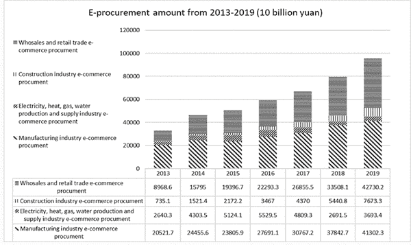
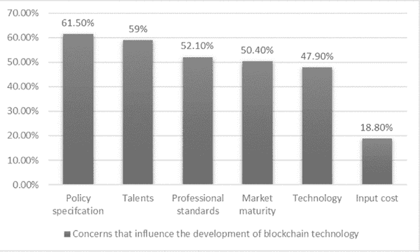
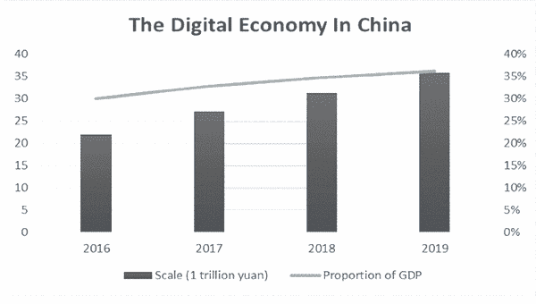
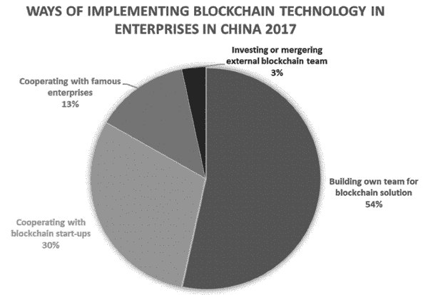
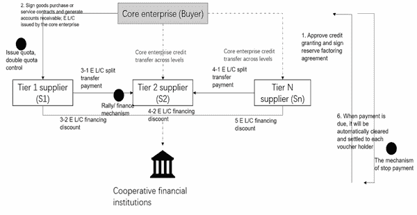
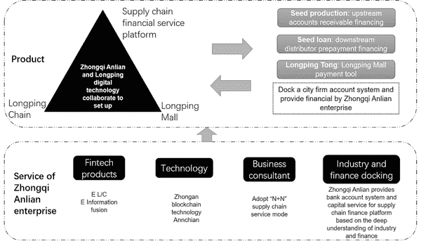
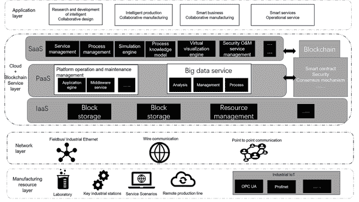
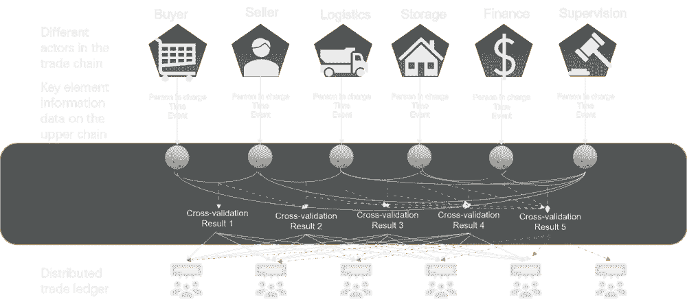

# 第十章

# 物联网与区块链的智能安全供应链管理整合：

中国案例研究

+   余坡山

    

    中国苏州大学 & 泰国克里克大学

+   刘智若

    中国独立研究者

+   埃曼努埃拉·哈内斯

    奥地利独立研究者

+   贾比尔·穆罕默德

    巴基斯坦首都科学与技术大学

摘要

本章将重点讨论供应链管理与数字技术的结合。从当前市场流行的数字术语开始，作者们审视了发展的当前环境，包括中国政府的政策和行业情况，然后结合两种数字技术（即区块链和物联网）比较数字化前后工业 4.0 的不同特征。此外，将重点介绍物联网与区块链在供应链管理中的整合优势。同时，根据数字化带来的变化，将从不同利益相关者的角度分析物联网和区块链整合的增值。此外，将介绍一些中国案例研究，展示企业的创新表现和效益，为企业提供参考，并实施物联网以实现智能经济增长。

引言

自 2008 年金融危机以来，许多国家开始研究数字技术，以应对复杂的金融环境。这导致了金融技术创新和技术进步的变革；从而，创造了一个快节奏、技术主导的金融环境。作为一个贸易大国，电子商务已经成为中国不可忽视的重要因素。世界上最早的电子商务历史始于上世纪 70 年代，当时通过邮寄金融机构进行电子交易。因此，电子数据交换（EDI）扩展了交易形式。在上世纪 90 年代，万维网（“Web”）允许公司发送和接收文本和照片，引入了电子商务这一术语。之后，电子商务从 B2C 改革为 B2B，如中国的阿里巴巴案例，然后发展到 B2E，并将在未来继续发展（Turban 等人，2018 年）。随着经济发展和人民生活水平的提高，技术将中国的商业从传统的线下扩展到线上，扩展了国内和国际市场。2015 年，支付服务、在线贷款、数据分析和自动化投资已经发展成为金融大数据中增长最快的领域（Monaco，2019 年）。

中国国家统计局于 2013 年至 2019 年公布的中国工业电子采购数据显示出明显的趋势。2013 年，全国电子采购仅为 34662.9 亿元人民币。然而，6 年后这个数字增至 101275.1 亿元人民币以上，（国家统计局，2020 年）。在图 1 中，横轴代表年份，纵轴代表不同年份的电子采购量，每个柱子上的不同颜色代表不同行业的企业。所有数字都以千亿元为单位记录，以展示行业份额的年度变化。作为供应链管理的重要组成部分（采购与供应管理特许学会（CIPS），无日期），近年来不同行业的电子采购量逐渐增加。

| 图 1. 2013 年至 2019 年的电子采购金额 |
| --- |
|  |
| *数据来源：国家统计局* |

随着工业 4.0 的出现和发展，改善的沟通为客户提供了更多选择，并增加了风险和不确定性，这是现代企业需要考虑的问题（Scholten & Fynes, 2017）。当企业面临众多供应商和不同项目时，供应链管理的战略和技术选择尤为重要，这与企业能否实现项目的潜在利益并从中获利息息相关（Wei et al., 2021）。为了解决类似问题，数字技术在供应链管理中的应用已成为许多企业关注的焦点。魏连和普华永道发布的关于中国区块链的调查显示，受访者认为物流是这一应用中最有价值的领域，占据了应用统计中的 63.3%，位居首位。同时，20%的企业正在使用区块链进行供应链管理，大多数受访者对这项技术的应用持乐观态度（Weilian & Puhuayongdao, 2018）。这表明，在中国，数字技术如区块链在供应链管理中的应用具有良好的群众基础和企业支持。事实上，得益于中国领导人的政策支持和各行各业领军人物的推动，许多企业已将物联网（IoT）和区块链等数字技术应用于供应链管理，并通过结合这些技术受益。

关于数字技术在供应链管理中应用的理论和模型已有许多章节，但中国的实际实施案例很少（Zorzini M.等，2012 年）。本章将从中国的角度更详细地分析物联网和区块链整合在供应链管理中的好处，并通过举例说明中国的一些最新案例，为讨论做出贡献。本章旨在通过分析中国政府制定的政策变化，研究制度变革如何推动与供应链业务环境整合的基于区块链的技术的发展与推广。几个案例研究已被用来展示业务部门如何应对这种制度变革。通过理解制度变革的逻辑，本章将使读者能够解释物联网和区块链整合在中国智能安全供应链管理中的未来路线图。

该章节将从六个方面逐步展开。接下来的部分将具体分析与该主题相关的当前流行术语的现有文献，如物联网、区块链、供应链管理、创新、智能设备和工业 4.0 等。第三部分将重点介绍中国政府推动智能经济的政策和影响。第四部分将根据数据连接物联网和区块链，比较数字化前后工业 4.0 的未来，以突出物联网和区块链整合带来的好处。第五部分将在第四部分的基础上，从不同的角度分析物联网和区块链的增值整合。第六部分将提供一些以上概念在中国的实际案例并对其进行分析。最后一节将作出简要结论并提出一些建议，并解释进一步研究的必要性。

文献综述

在本节中，作者参考了关于物联网、区块链、供应链管理以及当前数字环境中使用的一些术语的文献。

相关数字技术

近年来，许多行业，如农业、交通和能源，已经将其运营和服务转变为数字化，并取得了诸如提高效率、企业绩效和敏捷性等结果（Balci, 2021）。数字化中使用的最重要的数字技术包括云计算、人工智能（AI）、物联网和区块链。本章主要关注物联网和区块链。

物联网（IoT）可以连接数十亿的物品，使得人和物品随时随地都能连接在一起（Wang et al., 2015）。它通过传感器和设备从环境中收集数据（Karale, 2021）。与传统的网络系统相比，物联网可以在长时间内安全稳定地运行，无需人为干预（Gulati et al., 2021）。物联网的特性可以应用于全球供应链管理，促进信息的实时流动和跨不同平台的业务流程跟踪（Wang et al., 2015）。目前，物联网仍然是一项新兴且尚未发展完善的技术，其隐私和安全问题仍在研究中，但许多行业可以应用它来创新，带来更好的企业形式，同时消除一些手动操作和处理（Babun et al., 2021）。

区块链技术是一种在分布式点对点网络基础上处理和验证数据交易的技术（Dietrich 等，2021 年）。 它是一种以透明度、自动化和信任为特征的新兴技术，为金融系统提供必要的基础设施，并目前正处于大规模部署阶段（Wang 等，2021b 年）。 通过数字化交易，将提高可读性和可访问性，从而改善信息交换的协调性和安全性（Černý等，2021 年）。 这种分布式技术避免了中介交易，潜在地增加了产品和服务的利益，并降低了资本成本。 与此同时，这极大地帮助了中小企业通过为公司提供明确的专利访问权来创新。 由于供应链是一个长期动态结构，它们需要不断满足客户不断变化的需求，因此这是区块链应用的一个普遍方向（Javaid 等，2021 年）。

当前的数字环境

尽管许多人将供应链管理与物流混淆，但它实际上远远不止物流（Cooper 等，1997 年）。 根据供应链管理专业人员委员会的说法，供应链管理是“涉及采购和采购、转换以及所有物流管理活动的所有活动的计划和管理。 但是，由于环境的复杂变化，此定义不断更新（供应链管理专业人员委员会（CSCMP），2013 年）。 如今，它是以代理商网络的形式实现共同目标的一系列部分的概念，其中包括物料供应商、供应商、制造商、分销商、零售商和客户（Terrada 等，2020 年）。 如果供应链具有可持续性的概念，则需要考虑资源效率、社会责任和财务绩效，以保持竞争力（Dai 等，2021 年）。

因此，供应链的持续创新对提高竞争力至关重要。创新现在也意味着在市场上推广新理念（Shaikh 等人，2020 年）。为了提高大数据时代一个国家或产业的竞争力，有必要在不同的市场和领域积累知识和资源来推动创新（Xie 等人，2021 年）。在过去的二十年里，金融行业不断创新，提高了资源配置率，并为许多其他行业带来了新的创新机会。然而，社会对创新的要求越来越明显，要求企业不仅在资源和效率方面创新，还要在环保方面创新（Yuan 等人，2021 年）。这是数字技术蓬勃发展的一个重要原因。

实际上，随着科学技术的发展，中国的智能设备用户越来越多。智能设备是具有麦克风和虚拟助手的物理设备，例如智能手机和智能音箱（Frick 等，2021 年）。它们正在大规模地融入日常生活的基础上，基于物联网（Nespoli 等，2021 年）。拥有多个智能设备（例如平板电脑、智能手机、笔记本电脑，甚至智能电视）用于工作或交流已经非常普遍和受欢迎（Zhang 等，2013 年）。这些设备不仅为用户带来了便利，而且促进了工业 4.0 的数字化转型，这是一个信息和通信技术（ICT）的新时代，其中关于实际产品的信息被链接到基于 Web 的应用程序中，并集成到生产过程中（Ali 等，2021 年）。这一概念最初是由德国政府于 2011 年提出的，作为工业生产的关键战略（Bonilla 等，2018 年）。由于信息和通信技术的整合以及贯穿整个产品生命周期的端到端工程作为其基本概念和重要创新，预计通过数字互连来应对新的挑战并增强德国工业的竞争力（Birkel＆Müller，2021 年），并推动向工业 5.0 所要求的完全数字化迈进。

人工智能、大数据和云计算等数字技术不断影响着金融行业。面对数字时代缩短时间和不断变化的客户群的压力，一些企业开始创新并推动其组织的数字化（周等，2021 年）。数字化对于发展中国家尤为重要；如果一个国家跟不上数字化的步伐，就会产生数字不平等（贾米尔，2021 年）。已经有许多非技术行业，如农业、交通等。这些非技术行业和我们的社会将来会以不同形式享受数字化带来的好处，包括企业效率和灵活性。

（巴尔奇，2021 年）。因此，中国政府承担了法律领导和监管的角色，一些公司正在利用数字技术开辟新的道路。

在当今快速变化的社会和经济环境中，企业面临着意想不到的、快速的颠覆性竞争和新挑战，迫使企业调整其业务设计模式以提高业绩（郭等，2021 年）。由于客户需求的快速变化和企业效率要求的提高，未来业务活动的趋势是团结、共享，并强调合作伙伴的协调。

然而，在当前集成供应链管理中实现这种必要性是困难的，因为企业之间缺乏沟通和复杂的协调，业务整合在走向可持续供应链的道路上至关重要（倪和孙，2019 年）。财务和业务信息的整合需要增加的沟通和信任（黄等，2020 年），这就是为什么物联网和区块链的整合引起了很多关注。

中国塑造智能经济的政府角色（制度与规定）

本章通过检查制度设置的变化，解释了在中国智能和安全供应链管理中集成物联网和区块链的逻辑。 制度设置影响经济发展的方向。 正如 Yu 等人（2018）所指出的，“制度可以定义为通常用于构造具有制裁机制的重复互动情境的公认规则。 制度理论关注具有高度韧性的社会结构的更深层次（Scott，2008 年）。 北（1990 年）将制度定义为‘人为设计的制约因素，形成互动’，并将政府和公共服务等实体创建的正式制度与社会惯例或习俗以及隐性约束等非正式制度区分开来。 经济活动在一定的制度设置下进行，这些制度设置定义了市场上每个成员的利益以及如何实现和保护这些利益。” 通过比较和分析基于区块链的物联网在供应链系统中应用和影响的相互关系，本节帮助读者更好地把握该领域区块链物联网快速发展的变化动态（Yu 等人，2021 年）。

对于一个国家来说，政府政策和管理的影响是根本的。 以区块链为例，pwccn 的一项调查（见图 2.）关于智能经济的部分显示政策规范具有最大的影响。 换句话说，一旦国家政策发布，将有大量公司抓住机会做出响应（Weilian 和 Puhuayongdao，2018 年）。

| 图 2. 影响中国区块链技术发展的关注点（Weilian & Puhuayongdao，2018 年） |
| --- |
|  |
| *来源: www.pwccn.com* |

中国政府在早在 2015 年就迅速带头。在看到数字化发展趋势后，第十三个五年计划建议经济应引导到智能变革的方向（新华社，2015）。政府提出加快各方面智能经济建设，简政放权，鼓励传统企业转型为智能经济，并专注于与智能经济相关的技术品牌和渠道资源的整合（雅，2016）。2017 年，沈阳的八个城市签署了关于沈阳经济城市群建设的战略合作协议，预计到 2020 年，每个城市的云计算、大数据等基础平台将得到建设和共享（英，2017）。2018 年，中国政府从《经济日报》发布消息，希望引导人民发展数字经济和智能生活（韩，2018）。然后在 2019 年，第十三届全国人民代表大会第二次会议提出扩大“智能”并建设产业互联网平台（胡，2019）。2020 年是推动智能经济的巅峰。2021 年 9 月，浙江省举办了 2020 世界数字经济大会，展示了智能经济的便利和无限潜力（英，2020）。中国发展研究基金会和百度还于 2020 年 12 月 15 日共同发布了《新基建、新机遇：中国智能经济发展白皮书》。这份白皮书分析了中国当前的模式和趋势，并对下一步提出了建议（基金会 & 百度，2020）。浙江省启动了数字平台经济监测系统，以防止智能经济中的非法活动并监测风险（新华社，2021b）。这些举措为中国数字经济市场创造了良好氛围，并为产业发展提供了进一步指导。

与此同时，政府根据发展趋势和现有条件发布了一些相关规定。在中国，指导方针往往先在一个地方进行试验，然后才会推广，国家及时调整和制定政策以促进国民经济的发展。在政府的领导下，中国的数字经济从 2016 年的 22 万亿元（新华社，2017 年）增长到 2019 年的 35.8 万亿元（新华社，2021a 年），年增长率超过 16.6%（《人民日报》，2021 年）。

表 1. 与智慧经济相关的一些规定

| 管制领域 | 规章 | 权威机构 | 发布日期 | 主要内容 |
| --- | --- | --- | --- | --- |

|智慧经济|政府工作报告|国务院|2017 年 3 月 5 日|·加快发展新兴产业·加快新材料、人工智能、集成电路、生物制药和第五代移动通信技术研发和转化商业化。

·加强产业集群。

·采取行动发展大数据，加强新一代人工智能的研发和应用。在各个领域推动“互联网+”

·发展智能产业，拓展智能生活，构建智慧社会

·利用新技术升级传统产业

·促进智能制造，发展工业互联网平台|

|关于发展稳定数字经济和扩大就业的指导意见|国家发展改革委员会；教育部；

科技部;

工信部|2018 年 9 月 27 日|·大力发展稳定数字经济·工作扩大化

·促进经济转型升级

·提高就业质量|

| 政府工作报告 | 国务院 | 2019 年 3 月 5 日 | ·建立产业互联网平台，扩大“智能+”，赋能制造业转型升级 |
| --- | --- | --- | --- |
| 支持新业态、新模式健康发展，激活消费市场，创造更多就业机会 | 国家发展改革委员会；工业和信息化部 | 2020 年 7 月 16 日 | ·激活新消费市场，培育数字治理等新形式的线上服务 ·加强实体经济新动能，增强数字化转型公共服务能力，加快企业数字化私有车辆的速度 |

数据来源：www.gov.cn

| 图 3\. 中国的数字经济 |
| --- |
|  |
| *数据来源：www.gov.cn* |

数字化前后以及具有或不具有 IOT 和区块链的工业 4.0 特征

工业 4.0 的关键主题是网络化物理生产系统（CPPS）。随着互联网和连接系统的快速演变，CPPS 将机器、生产工厂和工人连接在一起，以满足大规模生产的需要。

在复杂而动态的供应链中，多个企业通过从原材料到最终产品增加价值来共同满足客户需求（Javaid et al.，2021）。在正确的时间获取正确的部分需要透明和高效的数据传输。通过共享信息，供应商和客户之间的合作可以提高供应链的竞争力。合作使企业能够降低成本、分担风险、满足客户需求并利用各种资源（Müller et al.，2020）。因此，一些数字技术也在此期间的中后期不断发展，物联网在业务和区块链方面产生了显着影响（Mehta & Senn-Kalb，2021）。物联网关乎将物品连接起来进行实时数据传输，提高供应链的效率（Rejeb et al.，2020）。与此同时，区块链用于保护数据传输，防止数据被篡改，并最终提高不同行业之间的信任感。此外，还有人工智能、云计算、大数据等数字技术推动着工业 4.0 的数字化（Aheleroff et al.，2020）。

工业 4.0 数字化后，其特征发生了许多变化（Laksch & Borsato，2019）。在数字化之前，工业生态系统可以从数据中心获得实时数据，以满足所有参与方对工业 4.0 的需求，例如：

+   1\. 在数字化之前，企业总是不得不探索新产品的发展。产品的失败伴随着各种资源和成本的缺乏（Zweber et al.，2017）。因此，他们很难计算出利用现有资源和成本开发产品的最佳解决方案。由于先进的数字生产技术，企业在企业计算配置后可以降低运营成本，同时提高能源效率（Prümmer et al.，2019）。

+   2\. 在数字化之前，企业害怕浪费成本，只能生产适合绝大多数人的大量产品，无法满足人们的个性化需求（O'Sullivan & Sheahan, 2019）；但现在，借助大量信息的支持，生产可以从大规模生产转向大规模产品定制，以满足顾客不断变化的个性化需求，并提高企业的竞争力（Aheleroff 等，2020）。

+   3\. 在过去，顾客与行业相距甚远（Mehta & Senn-Kalb, 2021），他们只能购买企业生产的东西，但在许多情况下，这些东西早已无法满足他们的需求。现在，顾客可以通过电子商务资源更加接近行业，并获得个性化的心理满足，他们不断的反馈和建议推动了公司产品的升级（Zhou 等，2021）。因此，顾客的消费结构实质上正在发生变化。

+   4\. 对整个社会来说，企业之间以前的封闭，信息流通的缺乏，以及企业与顾客需求之间的磨合，导致了经济和环境的巨大浪费（Kumar & Bhatia, 2021）。通过利用物联网、区块链等数字技术，工业 4.0 对可持续性、经济和环境都做出了巨大贡献（Li 等，2020）。

物联网和区块链的增值集成：来自利益相关者（包括监管机构、管理层和投资者）的视角

物联网以大量数据、开放性和瘦弱性为特征，但在安全方面存在许多挑战，包括隐私保护、资源约束和抗攻击性。为弥补物联网的这些不足，许多企业将其与区块链结合，后者以透明度和去中心化为特征（Saxena 等，2021 年）。区块链和物联网的整合不仅可以降低开发和维护集中数据中心的成本，还可以帮助消除诸如单点故障之类的安全问题（Daim 等，2020 年）。在本节中，作者将从监管机构、管理层和投资者三个角度整理整合物联网和区块链的增值。

金融科技在数字化货币的基础上转向数据变现的数字时代，监管机构需要重建监管框架。当前监管机构认为公司应该根据其风险水平和规模进行分类，这也需要密切合作以了解市场，平衡风险和潜在价值，同时防止监管套利。据假定，区块链将取代 19 世纪的结算方法（Arner 等，2016 年）。那么，问题是；如何理解市场？对监管机构来说，由物联网设备执行的所有操作都将被记录（Šarac 等，2021 年）。当出现问题时，他们可以清楚地检查这些行动。物联网用于处理大量数据记录，而区块链用于确保数据的安全性和真实性。这两者的整合可以帮助监管机构监测情况。

管理层需要对公司运营的结构和目标制定长期计划，这也需要大量的数据分析支持。物联网可以帮助收集数据，但其集中化的特性可能导致单点故障和有针对性的网络攻击。同时，物联网连接的普及性使攻击范围更广泛。因此，分散化和互操作的区块链和物联网的结合是一个不错的解决方案。区块链的不可变性加强了企业间合作的信任，其高弹性可以有效防止信息攻击（Bandara 等，2021 年）。管理层可以利用区块链进行安全政策追诉，并维护物联网交互的公开可检查账本，排除了第三方安全依赖（Saxena 等，2021 年）。安全性得到保障，同时提高了效率。

中国市场的特点是严重的信息不平等，只有具有较高学习能力的投资者才能坚持下去。面对快速发展的数字技术市场，投资者需要理性学习，但更重要的是，他们需要透明的市场信息、风险和回报信息，而不是资本集中和风险引导（Li 等，2021 年）。具有区块链的物联网设备建立了信任，并允许设备保留当前数据流，同时提高了安全性和隐私性（Šarac 等，2021 年）。它们可以安全快速地跟踪交易并验证条件，以便交易各方无缝连接，确保流程的可见性（Nicoletti，2018 年）。这有助于投资者通过理性学习提高他们的投资能力，然后进行更好的比较和选择，以减少财务损失。

案例

尽管许多报告显示智能手机和电视等智能设备的平均使用率很高，但传统工业部门的智能环境却有所不同。智能设备给用户带来的是方便和流畅的体验，而不是生产效率和安全性。同时，智能环境与传统工业相比，时间和空间上的联系不那么紧密，也不完全独立（Zhang 等，2013）。随着智能设备的使用，特别是那些涉及供应链管理的行业将需要创新来解决这些问题。工业 4.0 的数字化可以促进解决这个问题。

企业可以将其他智能设备整合到其供应链中，以改善运营、降低成本，并帮助公司更好地理解曾经是分散的格局。实际上，物联网技术现已成熟，许多公司已经安装了所需的传感器和设备（Cong 等，2021）。在中国率先实施政策的杭州市，浙江省，2019 年数字经济价值达到 11295 亿元，增长了 3795 亿元，物联网产业达到 2014 亿元，增长率为 14.1%（杭州市统计局，2020 年）。这显示了以物联网为主导的数字经济产业的活力。

实际上，物联网在数据收集方面存在许多缺点，这些缺点需要区块链（Kumar & Sharma，2021）来补救。由于物联网设备受限，公共区块链网络是合同的直接参与者和可信数据来源。因此，在物联网数据的基础上，本节将主要关注数字技术中的区块链，通过一些数据和企业案例展示其趋势和影响。

数据

2017 年，中国企业最常使用区块链技术的是防伪追溯，占 50%，其次是分布式存储和认证。此外，数据共享与应用以及供应链管理也超过了 20%（图 4）。数据显示，企业根据区块链的特点，关注数据存储和安全问题的应用，以及供应链管理。由于供应链管理具有复杂的流程和对信息安全的需求，这是该技术的主要应用方向。图 5 显示了这些企业应用区块链的方式。超过一半的受访企业建立了自己的区块链团队，其中三分之一与专业的区块链公司合作，但很少有企业愿意与其他企业的区块链部门合作。这两项数据均由普华永道、唯链基金会通过与相关企业的面对面访谈和在线调查收集而来。由于区块链本身就是用来解决安全和信任问题的，因此他们自己的研发和专业的区块链公司都是为了保护自己的信息安全。

| 图 4\. 2017 年中国企业中频繁应用的区块链技术 |
| --- |
|  |
| *来源：普华永道；唯链基金会* |
| 图 5\. 2017 年中国企业中区块链技术应用的方式 |
|  |
| *来源：普华永道；唯链基金会* |

案例

本部分收集了一些数字技术与供应链相关项目的整合与创新案例，以及在社会和经济效益方面取得的成果。三个案例分别是中企安联企业、苏州黑云智能科技有限公司和天津 TBC 区块链跨境贸易快车。其中，中企安联企业提供了一个数字技术平台，可以从宏观框架中轻松调整，并促使一些资金不足、创新能力不足的小微企业进行数字化转型。他们在农业种子行业和能源企业也取得了一些成就。

中企安联企业案例

中企安联链企业在供应链金融流程底层建立了基于区块链的平台。通过先进的基础设施协议，如互联网技术，他们将区块链整合到供应链和链块中，以改善物流。此外，该平台还包括企业核心的其他行业，从而使上下游企业能够提供技术服务。这有助于核心企业优化供应链管理并进行精准的风险识别-这是一个例子，展示了小微企业如何解决供应链的融资问题（Jua，2021）。

| 图 6. 中企安联企业案例 |
| --- |
|  |
| *来源: www.djyanbao.com* |

解决方案将为参与供应链的每个主要参与者部署区块链节点，形成联盟链，以便核心企业日常运营中的业务数据能够快速上传至区块链平台，确保业务数据的可追溯性（中国金融信息行业协会（CFIIA），2021 年）。资金方对核心企业进行人工风险控制，可以根据应付账款向相应供应商发行相应数量的代币，并通过保留代币或向资金方申请融资。此外，通过引入企业身份认证，并使用在线电子签名功能，签署记录存储在区块链网络中，以确保用户数据安全、防篡改和永久可追溯。

| 图 7\. 中企安联企业的业务流程 |
| --- |
|  |
| *来源：www.zqalink.com* |

项目创新点：

+   2\. 通过供应链交易数据的不可变性，可以利用物联网技术动态监控货物流动，记录交易、运输等节点信息，并降低成本（Anitha 等，2021 年）。

    +   1\. 通过生成区块链智能合约，安联企业可以巩固资金结算路径，并与支付系统合作，显著降低资金消耗和违约行为的发生率（Kshetri，2021 年）。

    +   3\. 在可靠数据的情况下，安联可以打破数据孤岛，保护隐私和数据安全，有效推动供应链系统四条流的整合，并降低风险控制的难度（Al-Talib 等，2020 年）。

    +   3\. 区块链技术生成的电子凭证可以实现灵活的多级拆分、流通和融资，将核心企业信用转移到最终供应链，解决小微供应商的融资难题（中国智慧城市，2021 年）。

这导致了以下影响（表 2）：

表 2\. 实施的影响

| 项目 | 简介 | 影响 |
| --- | --- | --- |
| 农业种子产业-隆平数据部供应链金融服务平台 | 基于隆平自身的种子产业链和农业供应链，采用“N+1+N”供应链金融服务模式，创建自己的行业和金融平台“隆平链”，实现了隆平上游供应商应收账款融资和预付款融资。 | 1\. “隆平链”加强了供应链管理，提高了供应链成员的协同效率，降低了供应链的整体成本，提高了供应链的综合竞争力。 2\. 在隆平链金融服务平台生成的“隆平通”是基于区块链技术的电子债券。持有人可以直接在“隆平商城”购买和支付，并由隆平金融及其合作伙伴承诺确认和折扣。 |
| 基于区块链建立的供应链金融服务平台的海南国际能源交易中心 | 基于中企安联区块链技术的供应链金融服务平台满足了海南国际能源交易中心不同企业在各种场景下的融资产品设计需求。 | 1. 平台上生成的“代币”是基于区块链技术的电子债权凭证，支持多层级拆分和流通，支持 1~N 级供应商持有“代币”融资，并确认和贴现海南国际能源交易中心的合作伙伴的承诺。 2. 该平台支持多核心企业进入，并将供应商和交易数据相互隔离。应收账款资产等级完成后，支持核心企业在线确认债权的权利；该平台连接了 10+个外部接口和数据服务，协助业务风险控制审计，通过在线手动流程审计连接了银行资金账户开户和供应商的在线资金整理。 |

来源: (中国智慧城市, 2021)

| 图 8. 农业种子产业-隆平数据部门供应链金融服务平台 |
| --- |
|  |
| *来源: www.zqalink.com* |

苏州黑云智能科技有限公司案例

苏州黑云智能科技有限公司以人工智能、区块链、隐私计算等前沿技术研究作为公司的核心研发方向。他们形成了一体化的智能技术研究与探索系统，涵盖智能政务、工业智能制造、金融科技等智能方面。他们凭借世界领先的成果在国际技术评估中名列前茅，许多研究成果得到了国际关注（黑云，2021）。

中国的年度造船完成量一直稳居世界首位，但由于劳动力和材料成本上升以及缺乏独立的研发能力等因素，竞争优势已经不存在。与此同时，造船厂的盲目扩张和之前业绩的夸大利润导致了对供应链管理的忽视。传统的供应链模式无法满足现代航运企业的需求（Steuer 等人，2021）。目前造船企业的利润率正在下降，它们的生存非常困难。

该项目从造船工业中供应链管理的传播和协同设计与制造的需求出发，利用智能合约和区块链机制的加密算法等技术。这开拓了造船工业供应链的流程节点，并实现了联盟建设、分布式成员管理、供应链管理和质量管理等功能（赛瑞评估，2021）。

| 图 9\. 苏州黑云智能科技有限公司案例 |
| --- |
|  |
| *来源: www.heiyunworld.com* |

为了与时俱进，这些企业必须创新，本案例提供了与区块链相关的四个改进领域，包括合同、数据、设备和可追溯性。

+   1\. 合同

在航运行业中，任何与交易相关的链接都需要签订合同，但目前的线下合同签署会造成纸张的浪费，经济和时间成本（Fiorentino & Bartolucci, 2021）。为了解决这个问题，企业使用区块链系统的智能合约。信息将上传到区块链以应用合同中的业务技术，通过智能处理确保所有签署合同的相关方的身份认证。信息是公开的、透明的，不可篡改的。它确保链上的数据信息覆盖了合同的所有内容，并且可以对合同签署方进行认证。此外，直接生成的电子合同减少了线下面试和邮寄，节省了线下合同的时间和运营成本（Zhang et al., 2021c）。

+   2\. 数据

目前，涉及船舶制造供应链的每个单位都保存着自己的数据并将其集中保存。集中保存的缺点在于难以甚至不可能检索到丢失的文件，并且无法避免人为因素的干扰。为了弥补这一缺陷，公司使用了区块链管理的分布式存储和共识机制来确保信息安全（Zhang et al., 2021a）。当一个节点的数据损坏或不准确时，数据可以及时恢复，并与其他节点进行比较。

+   3\. 设备

随着船厂设备数量的增加，人与设备之间以及设备之间的统一识别、真实性和管理变得更加重要。当前的工作流程存在许多中间环节，导致设备资源利用率和效率低下（张等，2021b 年）。加入合作制造联盟，将智能设备作为节点，将数据在每个环节的不同设备之间传输，使用加密协议实现设备之间的安全高效的点对点通信，并确保数据信息的安全性（赛瑞评估，2021 年）。

| 图 10\. 设备作为节点连接到联盟链 |
| --- |
|  |
| *来源：赛瑞评估* |

+   4\. 追溯

目前，供应链管理面临着追溯能力不足的问题。松散的程序使得一开始就无法确定问题所在。没有开放透明的流程管理和证据管理，追溯过程中的问题无法立即发现。区块链可以在技术层面保证数据的真实性和唯一性，并为流程追溯提供支持（Centobelli 等，2021 年）。在供应链物流方面，船厂拥有的数据涵盖了材料设备生产、运输、通关、检验，以及装卸港口、运输方式等生产制造全过程的其他信息，为追溯提供了物理路径（赛瑞评估，2021 年）。

| 图 11\. 中船重工船舶制造链管理平台 |
| --- |
|  |
| *来源：www.heiyunworld.com* |

天津 TBC 区块链跨境贸易“直通车”（即直接市场准入）

“TBC 区块链跨境贸易通”平台专为平行进口设计，定制了四种价值服务，如贸易企业、物流企业、金融机构和通管机构。 该平台建立了链上交易数据标准，允许链上交易信息进行交叉比对和验证，并确认链上货物的权利（微观科技，2019 年）。 企业数字资产系统得到建立，并创造了跨竞争贸易整个允许过程的可信溯源系统。

由于参与者众多，跨境贸易过程复杂，很难确定互信关系。 区块链的特性与跨境贸易的痛点高度一致。 通过参与角色数据信息的交叉比对，形成可靠的数据存储链，打破了跨境贸易中的信息孤岛，从而解决了传统流程中的困境（陈，2019 年）。

| 图 12\. TBC 区块链跨境贸易通 |
| --- |
|  |
| *来源: www.zhiding.cn* |

该案例的整体技术模块分为四个部分：联盟区块链基础平台，贸易通应用技术生态系统，物联网基础系统和人工智能系统。 “TBC 区块链跨境贸易通”平台采用联盟链形式，并引入实名认证系统，以满足跨境贸易中的可追溯性需求。

该项目采用了四种先进技术：超级账本底层、国家机密商业机密双层保护、区块链身份和访问控制、智能合约，然后完成了以下创新：

+   1\. 跨境贸易的十种商业模式

基于联合国的“一购一付”模式，并结合实际跨境贸易业务，该项目细化了十种跨境贸易业务模式。这是其联盟链和数据采集架构的技术标准，包括存储、治理和共享，也是项目设计中最大的创新（Zutshi 等，2021）。

+   2\. 单一窗口对接海关总署

此功能实现了区块链与单一窗口对接的连接，为海关人员提供了区块链平台的预设标记和不一致数据（Dabbagh 等，2021）。它形成了内部海关部门所需的分类、价格审查、反走私、关税和监管等警告和结果，并将其发送给相关部门进行进一步的业务处理。

+   3\. 基于区块链数据建立海关辅助文件审查系统

它是基于数据区块链海关辅助系统设置的，为不同业务角色的文件审查提供各种业务数据，通过探索符合行业和业务分类的实际应用场景和申请表，为数据检查提供科学贡献价值评估系统。这有助于海关内部定位和支持。

该项目创造的环境也带来了商业价值。它实现了产业链中所有角色的成本降低和效率提高，极大地提高了产业链的协同能力，并提高了中国产业链在全球的竞争力（Wang 等，2021a）。

通过平台企业，贸易企业可以积累可信的数据资产，从而享受快速通关、降低合规成本、低门槛、低利率融资产品，并促进诚信贸易企业的发展。物流企业可以获取准确高质量的客户和在物流过程中由多方证明的真实数据，解决原来货物损失和损坏以及无法明确责任范围的困境（江等，2021 年）。金融机构可以实现资金全流程的风险控制，提高金融产品的安全性，并为金融机构开发新的收入来源。

| 图 13. TBC 区块链跨境贸易快线的业务流程 |
| --- |
|  |
| *来源：www.jinse.com* |

在案例应用场景被多方认可的情况下，可以使跨境贸易的整体生态发展健康，并促进传统跨境贸易的数字化转型升级。

天津“TBC 区块链跨境贸易快线”已被中国海关总署和世界海关组织写入与跨境贸易区块链应用相关的白皮书和案例中。这是一个清晰有效的实施经验和路径，为国内政府机构、企业和各个子行业在跨境贸易领域应用区块链模型和技术树立了一个基准（中国智慧城市，2021 年）。

物联网（IoT）和区块链整合的挑战

尽管物联网（IoT）和区块链的集成可以带来许多好处，但在当前阶段将它们整合起来也存在一些挑战。

表 3. 物联网（IoT）和区块链整合的挑战

| 物联网（IoT）和区块链整合的挑战 | 挑战 | 介绍 |
| --- | --- | --- |
| TPS 性能 | 物联网具有大量数据和强大的实时性能，直接影响网络吞吐量 |
| 可信的上链数据 | 当超过一半的节点被入侵时，数据可能已被篡改，因此上链数据需要是可信的和安全的 |
| 面向未来的数字经济社会 | 物联网设备已成为大规模，区块链需要考虑如何与其通信 |
| 物联网的复杂硬件适配能力 | 区块链必须考虑如何与具有不同能力的物联网硬件相匹配 |

来源：www.chainnews.com

在面对这些挑战的基础上，万向区块链提出了应对措施，即 RISC-V 区块链，并正在生物资产监管、新能源车辆电池寿命周期管理以及石化行业的可信仓单（万向区块链，2021），但具体实施能力仍待测试。

结论和建议

供应链的经济环境复杂多变，智能经济需要链上各方的效率和安全性得到提高，这需要实时、准确和真实的信息。物联网与区块链的集成附加值可以很好地满足这一条件。物联网可以收集数据，但系统的可访问性、透明度和可追溯性引发了对数据隐私和安全性的担忧（Kayikci 等，2021），这些缺陷可以通过区块链的特性来解决。企业的管理和决策层可以通过计算快速收集大量数据并做出合理决策。投资者可以进行更好的比较以减少损失和危机。监管机构也可以全面实时地监测产业链中的异常现象以进行控制。技术是实现智能经济的必要条件，如果在能力和资源方面存在技术限制，则以上供应链实践无法成功实施。同时，上下游企业之间的联系加强符合未来智能经济的协作共享，为可持续发展创造了良好条件。

实际上，智能经济的可持续性主要体现在生态和工业环境上。由于信息的及时流通，企业的有效设计和决策可以大大减少资源的浪费，提高废物回收利用。监管机构也将能够监测生产污染物的排放，这对目前的绿色经济是有利的。此外，企业加强沟通联系，打破壁垒，从而促进企业间的健康竞争，并不断推动产业创新。

根据数据显示，政府政策和法规对公共智能和安全的供应链管理产生了最大影响。政府首先需要树立榜样，监管部门需要妥善安排。其次，一些大型企业需要在供应链管理中发挥领导作用。社会关系在供应链中至关重要，影响上下游企业的可持续性关注，从而推动中小企业的参与。最重要的是，一些暂时落后的中小企业需要改变供应链管理的观念，以跟上智能经济的步伐，并且需要愿意进行创新和转型。这三方面的能力对整个社会供应链的稳定起着重要作用。

在本章中，作者们回顾了中国数字经济的发展环境，整理了工业 4.0 下供应链管理的创新和发展，并展示了中国政府塑造智能经济的规章制度。该章节重点关注了工业 4.0 后物联网和区块链融合带来的数字变革，并从多个角度总结了融合的增值。此外，作者们还收集了中国供应链的案例，涉及平台连接各种企业和跨境贸易，供参考和讨论。

然而，本章节存在一些局限性。由于数字经济政策的晚期发展，一些特定数据收集起来较为困难。同时，在总结 IoT 和区块链在供应链管理中集成的益处后，与区块链相比，IoT 的实际业务案例描述不够详细。未来的研究可以继续收集数据来填补这些空白。

致谢

我们感谢苏州大学、上海大学澳大利亚研究中心和克里克大学的同事，以及提供洞见和专业知识的独立研究同事，他们极大地协助了本研究，尽管他们可能不同意本文的所有解释/结论。此外，我们感谢中国知识支持我们的研究。

参考文献

Aheleroff, S., Zhong, R. Y., & Xu, X. (2020). 工业 4.0 中个性化大规模生产的数字孪生参考。Procedia CIRP，93，228–233。doi:10.1016/j.procir.2020.04.023

Al-Talib, M., Melhem, W. Y., Anosike, A. I., Garza Reyes, J. A., Nadeem, S. P., & kumar, A. (2020). 应用 IoT 技术实现供应链的弹性。Procedia CIRP，91，752–757。doi:10.1016/j.procir.2020.02.231

Ali, M. H., Chung, L., Kumar, A., Zailani, S., & Tan, K. H. (2021). 马来西亚清真食品供应链的可持续区块链框架：来自的经验教训。Technological Forecasting and Social Change，170，120870。提前在线发表。doi:10.1016/j.techfore.2021.120870

Anitha, K., Palaksha Reddy, K., Krishnamoorthy, N., & Jaiswal, S. (2021). IoT 在促进供应链可见性、连接性和性能优化中的应用。Materials Today: Proceedings，提前在线发表。doi:10.1016/j.matpr.2020.12.343

Arner, D. W. (2016). 金融科技、监管科技和金融监管的重新概念化。Academic Press.

Babun, L., Denney, K., Celik, Z. B., McDaniel, P., & Uluagac, A. S. (2021). 物联网平台调查：通信、安全和隐私视角。《计算机网络》，192，108040。提前在线发表。doi:10.1016/j.comnet.2021.108040

Balci, G. (2021). 集装箱航运中的数字化：非技术行业中对数字产品的感知和满意度是否影响整体客户忠诚度？《技术预测与社会变革》，172，121016。提前在线发表。doi:10.1016/j.techfore.2021.121016

Bandara, E., Tosh, D., Foytik, P., Shetty, S., Ranasinghe, N., & De Zoysa, K. (2021). Tikiri—面向物联网的轻量级区块链。《未来一代计算机系统》，119，154–165。doi:10.1016/j.future.2021.02.006

Birkel, H., & Müller, J. M. (2021). 工业 4.0 在可持续发展三重底线内对供应链管理的潜力——系统性文献综述。《清洁生产杂志》，289，125612。提前在线发表。doi:10.1016/j.jclepro.2020.125612

Bonilla, S., Silva, H., Terra da Silva, M., Franco Gonçalves, R., & Sacomano, J. (2018). 工业 4.0 及其对可持续性的影响：基于情景的影响和挑战分析。《可持续性》，10(10)，3740。提前在线发表。doi:10.3390/su10103740

Centobelli, P., Cerchione, R., Vecchio, P. D., Oropallo, E., & Secundo, G. (2021). 区块链技术在循环供应链中构建信任、可追溯性和透明度。《信息与管理》，103508。提前在线发表。doi:10.1016/j.im.2021.103508

Černý, M., Gogola, M., Kubaľák, S., & Ondruš, J. (2021). 区块链技术作为供应链的新驱动因素。《交通研究会议录》，55，299–306。doi:10.1016/j.trpro.2021.06.034

采购与供应管理特许学会（CIPS）。(无日期)。什么是采购与供应？CIPS。

Chen, X. (2019). 跨境贸易区块链白皮书。学术出版社。

中国金融信息行业协会 (CFIIA). (2021). 2021 全球区块链创新应用示范案例集。作者。

CloudB. (2021). [黑云世界](http://www.heiyunworld.com/)

Cong, L. W. (2021). 物联网：商业经济学与应用。在 Pompella, M. (Ed.)，Review of Review of BusinessBusiness (Vol. 41, pp. 15–30) 中。Siena 大学。

Cooper, M. C., Lambert, D. M., & Pagh, J. D. (1997). 供应链管理：不仅仅是物流的新名字。国际物流管理杂志 , 8(1), 1–14\. doi:10.1108/09574099710805556

供应链管理专业人员委员会 (CSCMP). (2013). 供应链管理定义及术语表。[`cscmp.org/CSCMP/Academia/SCM_Definitions_and_Glossary_of_Terms/CSCMP/Educate/SCM_Definitions_and_Glossary_of_Terms.aspx?hkey=60879588-f65f-4ab5-8c4b-6878815ef921`](https://cscmp.org/CSCMP/Academia/SCM_Definitions_and_Glossary_of_Terms/CSCMP/Educate/SCM_Definitions_and_Glossary_of_Terms.aspx?hkey=60879588-f65f-4ab5-8c4b-6878815ef921)

Dabbagh, M., Choo, K.-K. R., Beheshti, A., Tahir, M., & Safa, N. S. (2021). 允许的区块链平台的实证性性能评估综述：挑战与机遇。Computers & Security , 100, 102078\. 提前在线发表。doi:10.1016/j.cose.2020.102078

Dai, J., Xie, L., & Chu, Z. (2021). 发展可持续供应链管理：制度压力与可持续能力的相互作用。可持续生产与消费 , 28, 254–268\. doi:10.1016/j.spc.2021.04.017

Daim, T., Lai, K. K., Yalcin, H., Alsoubie, F., & Kumar, V. (2020). 通过技术知识冗余预测技术定位：物联网、网络安全和区块链的专利引用分析。Technological Forecasting and Social Change , 161, 120329\. 提前在线发表。doi:10.1016/j.techfore.2020.120329

Dietrich, F., Ge, Y., Turgut, A., Louw, L., & Palm, D. (2021). 区块链项目在供应链管理中的评审与分析。Procedia Computer Science , 180, 724–733\. doi:10.1016/j.procs.2021.01.295

菲奥伦蒂诺，S.，巴托鲁奇，S.（2021）。基于区块链的智能合约作为共享经济的新治理工具。《城市（伦敦，英格兰）》，117，103325。提前在线发表。doi:10.1016/j.cities.2021.103325

基础设施，机遇（2020）。中国智能经济发展白皮书。https://www.cdrf.org.cn/jjhdt/5455.htm

弗里克，N. R. J.，威尔姆斯，K. L.，布拉赫滕，F.，赫德延斯，T.，施蒂格利茨，S.，罗斯，B.（2021）。通过智能设备的对话感知监控。《电子商务研究与应用》，47，101046。提前在线发表。doi:10.1016/j.elerap.2021.101046

古拉蒂，K.，库马尔·博杜，R. S.，卡皮拉，D.，班加雷，S. L.，钱德纳尼，N.，萨拉瓦南，G.（2021）。物联网中的无线传感器网络技术综述。《今日材料：论文集》。提前在线发表。doi:10.1016/j.matpr.2021.05.067

郭健，周烁，陈健，陈强（2021）。信息技术能力和知识整合能力如何相互作用影响业务模式设计：多项式回归与响应面分析。《技术预测与社会变革》，170，120935。提前在线发表。doi:10.1016/j.techfore.2021.120935

韩翰（2018）。升级信息消费，扩大数字经济。电子信息消费为智慧生活增添光彩。《经济日报》。http://www.gov.cn/xinwen/2018-04/17/content_5283099.htm

杭州市统计局 . (2020). 杭州市统计年鉴。

胡强（2019）。两会观察：智慧行动。http://www.eeo.com.cn/2019/0306/349511.shtml

黄静，梅子群，李智慧（2020）。商务和金融信息整合与自愿管理盈利预测。《中国会计研究》，13(3)，291–307。doi:10.1016/j.cjar.2020.07.002

Jamil, S. (2021). 从数字鸿沟到数字包容：巴基斯坦广泛数字化的挑战。电信政策，45(8)，102206。提前在线发表。doi:10.1016/j.telpol.2021.102206

Javaid, M. (2021). 基于文献的区块链技术应用于工业 4.0：一项综述。区块链：研究与应用。doi:10.1016/j.bcra.2021.100027

Jiang, S. (2021). 区块链竞争：平台稳定性与效率之间的权衡。欧洲运营研究。提前在线发表。doi:10.1016/j.ejor.2021.05.031

Jua. (2021). 中企安联- 最佳供应链金融解决方案提供商。[`mp.weixin.qq.com/s?__biz=MzI0NTExMjc1Nw==&mid=2247484946&idx=1&sn=4094f4e4b0c4610be3517005a5c2bb13&chksm=e952ccc8de2545de4d0cc309eb0ad5db70784a645f6f006ec7c1a453b0ea664923127d6dba8e&token=510349077&lang=zh_CN#rd`](https://mp.weixin.qq.com/s?__biz=MzI0NTExMjc1Nw==&mid=2247484946&idx=1&sn=4094f4e4b0c4610be3517005a5c2bb13&chksm=e952ccc8de2545de4d0cc309eb0ad5db70784a645f6f006ec7c1a453b0ea664923127d6dba8e&token=510349077&lang=zh_CN#rd)

Karale, A. (2021). 物联网挑战：安全性，伦理，隐私和法律。物联网，15，100420。提前在线发表。doi:10.1016/j.iot.2021.100420

Kayikci, Y., Kazancoglu, Y., Lafci, C., & Gozacan, N. (2021). 探索智能和可持续循环经济的障碍：汽车生态集群案例。清洁生产杂志，314，127920。提前在线发表。doi:10.1016/j.jclepro.2021.127920

Kshetri, N. (2021). 区块链与发展中国家可持续供应链管理。国际信息管理期刊，60，102376。提前在线发表。doi:10.1016/j.ijinfomgt.2021.102376

Kumar, R., & Sharma, R. (2021). 利用区块链确保物联网信任：一项调查。沙特国王大学-计算机与信息科学杂志。doi:10.1016/j.jksuci.2021.09.004

Kumar, S., & Bhatia, M. S. (2021). 环境动态性，工业 4.0 和绩效：组织和技术因素的中介作用。工业营销管理，95，54–64。doi:10.1016/j.indmarman.2021.03.010

Laksch，J. S.，& Borsato，M. (2019). 用于数字评估现有生产系统在汽车工业背景下产品工程变化中的适应性的方法。《高级工程信息学》，42，100942。提前在线出版。doi:10.1016/j.aei.2019.100942

李，Y.，戴，J.，&崔，L. (2020). 数字技术对工业 4.0 背景下经济和环境绩效的影响：一个调节的中介模型。《国际生产经济学杂志》，229，107777。提前在线出版。doi:10.1016/j.ijpe.2020.107777

李，Z.，葛，R. Y.，郭，X. S.，&蔡，L. (2021). 个人投资者能否从中国在线 P2P 借贷中获得经验教训？《北美经济与金融杂志》，58，101524。提前在线出版。doi:10.1016/j.najef.2021.101524

Mehta，D.，& Senn-Kalb，L. (2021). 深入：2021 工业 4.0。学术出版社。

Monaco，E. (2019). 金融科技能从高频交易中学到什么：经济后果、开放问题和企业披露的未来。在 Lynn，T.，Mooney，J. G.，Rosati，P.，&Cummins，M.（主编），颠覆金融（第 51-70 页）。斯普林格自然瑞士 AG。doi:10.1007/978-3-030-02330-0_4

Müller, J. M., Veile, J. W., & Voigt, K.-I. (2020). 工业 4.0 中数字信息共享的先决条件和激励因素——跨数据类型的国际比较。《计算机与工业工程》，148，106733。提前在线出版。doi:10.1016/j.cie.2020.106733

国家统计局。(2020). 电子采购金额（100 亿元）。作者。

Nespoli，P.，Díaz-López，D.，&Gómez Mármol，F. (2021). 物联网环境中的网络安全保护：防御智能设备的动态基于规则的解决方案。《信息安全与应用杂志》，60，102878。提前在线出版。doi:10.1016/j.jisa.2021.102878

Ni, W., & Sun, H. (2019). 可持续供应链管理对商业绩效的影响：对中国制造业整个供应链整合的启示。 Journal of Cleaner Production，232，1176–1186。 doi:10.1016/j.jclepro.2019.05.384

Nicoletti, B. (2018). 金融科技和采购融资 4.0。在采购融资中（第 155-248 页）。 doi:10.1007/978-3-030-02140-5_6

North, D. (1990). 机构、机构变迁和经济绩效。剑桥大学。 doi:10.1017/CBO9780511808678

O'Sullivan, M., & Sheahan, C. (2019). 使用严肃游戏来通知从新产品开发的模糊前端到大规模定制生产方法。 Procedia Manufacturing，38，478–487。 doi:10.1016/j.promfg.2020.01.061

《人民日报》。（2021）。中国数字经济变得更加活跃。 http://www.gov.cn/xinwen/2021-03/22/content_5594357.htm

Prümmer, M., Bergs, T., Arntz, K., & Lürken, C. (2019). 工业模具中互联制造系统的外围评估。 Procedia CIRP，81，470–475。 doi:10.1016/j.procir.2019.03.120

Rejeb, A., Simske, S., Rejeb, K., Treiblmaier, H., & Zailani, S. (2020). 物联网研究在供应链管理和物流中的应用：一项文献计量分析。 Internet of Things，12，100318。提前在线发表。 doi:10.1016/j.iot.2020.100318

Assesment, S. (2021). 工业应用区块链实践案例。[链接](https://mp.weixin.qq.com/s?__biz=MzUxMzc4MjA4NQ==&mid=2247484874&idx=1&sn=8e0af725d36cdd2c5969b39dc91733ed&chksm=f94ebde0ce3934f669ccbbd3d1063897bbbee93e5196ad5d2b3c55d7d60a394936635c9c99b1&mpshare=1&srcid=0814HgTw2ah9yUHfINldH7VL&sharer_sharetime=1628948606761&sharer_shareid=3f439b70854717410bbd97cd511f119b&from=singlemessage&scene=1&subscene=10000&clicktime=1630039298&enterid=1630039298&ascene=1&devicetype=android-29&version=28000a3d&nettype=WIFI&abtest_cookie=AAACAA%3D%3D&lang=zh_CN&exportkey=AxbisCB%2Fo%2FxIBv6SsogS%2FAk%3D&pass_ticket=rr0HBDyFaypryLmw2%2Bgr5c%2Fa%2F4txJeBnfQLqo6oCAIRej4aOGCXxfFxyv8BAPUJI&wx_header=1)。

Šarac, M., Pavlović, N., Bacanin, N., Al-Turjman, F., & Adamović, S. (2021). 通过将区块链安全接口集成到物联网设备安全网关架构中来增强隐私和安全性。《能源报告》，7，8075–8082。提前在线发表。doi:10.1016/j.egyr.2021.07.078

Saxena, S., Bhushan, B., & Ahad, M. A. (2021). 基于区块链的解决方案以保护物联网：背景、整合趋势和前进道路。《网络与计算机应用杂志》，181，103050。提前在线发表。doi:10.1016/j.jnca.2021.103050

Scholten, K., & Fynes, B. (2017). 可持续供应链的风险与不确定性管理。在《可持续供应链》中（第 413-436 页）。doi:10.1007/978-3-319-29791-0_19

Scott, W. R. (2008). 《制度与组织：理念与利益》（第三版）。SAGE 出版社。

Scott, W. R. (2008). 《制度与组织：理念与利益》。学术出版社。

Shaikh, A. A., Sharma, R., & Karjaluoto, H. (2020). 共享经济中的数字创新与企业：一项行动研究议程。《数字商业》，1（1），100002。提前在线发表。doi:10.1016/j.digbus.2021.100002

中国智慧城市. (2021). [`mp.weixin.qq.com/s?__biz=MzA3ODA1MzMwNw==&mid=2650542117&idx=1&sn=94ec06a764d893d8bd6c0e60d10e0545&chksm=87401af1b03793e758d565e3c7a3f0d5b21029e62caff6e8d3d64002301d69427c10d5f80f3e&mpshare=1&srcid=0814Ry69kbJB4NxF8GIsJu4a&sharer_sharetime=1628948491962&sharer_shareid=3f439b70854717410bbd97cd511f119b&from=singlemessage&scene=1&subscene=10000&clicktime=1630219119&enterid=1630219119&ascene=1&devicetype=android-29&version=28000a3d&nettype=WIFI&abtest_cookie=AAACAA%3D%3D&lang=zh_CN&exportkey=A3%2Ftehxk17AJjE2UCFxIVHk%3D&pass_ticket=Ug8WmXDfzeZqV%2BuFb4h9aKcdozrVzzMS8T2Rn5UWSFwbBqI3chjjcsw25hOdTLnA&wx_header=1`](https://mp.weixin.qq.com/s?__biz=MzA3ODA1MzMwNw==&mid=2650542117&idx=1&sn=94ec06a764d893d8bd6c0e60d10e0545&chksm=87401af1b03793e758d565e3c7a3f0d5b21029e62caff6e8d3d64002301d69427c10d5f80f3e&mpshare=1&srcid=0814Ry69kbJB4NxF8GIsJu4a&sharer_sharetime=1628948491962&sharer_shareid=3f439b70854717410bbd97cd511f119b&from=singlemessage&scene=1&subscene=10000&clicktime=1630219119&enterid=1630219119&ascene=1&devicetype=android-29&version=28000a3d&nettype=WIFI&abtest_cookie=AAACAA%3D%3D&lang=zh_CN&exportkey=A3%2Ftehxk17AJjE2UCFxIVHk%3D&pass_ticket=Ug8WmXDfzeZqV%2BuFb4h9aKcdozrVzzMS8T2Rn5UWSFwbBqI3chjjcsw25hOdTLnA&wx_header=1)

Steuer, B., Staudner, M., & Ramusch, R. (2021). 循环经济在中国管理报废船舶中的作用和潜力。《资源、保护和回收》，164，105039。doi:10.1016/j.resconrec.2020.105039

Terrada, L., Khaïli, M. E., & Ouajji, H. (2020). 供应链管理决策的多代理系统实施。《计算机科学学报》，177，624–630。doi:10.1016/j.procs.2020.10.089

Turban, E., Outland, J., King, D., Lee, J. K., Liang, T.-P., & Turban, D. C. (2018). 《电子商务 2018》.《电子商务》，2018。提前在线发表。doi:10.1007/978-3-319-58715-8

Wang, J., Liu, J., Wang, F., & Yue, X. (2021a). 港口物流能力的区块链技术：独占还是共享。《交通研究部分 B：方法论》，149，347–392。doi:10.1016/j.trb.2021.05.010

Wang, L., Luo, X. R., Lee, F., & Benitez, J. (2021b). 区块链驱动的供应链金融中的价值创造。《信息与管理》，103510。提前在线发表。doi:10.1016/j.im.2021.103510

Wang, L., Ma, Y., Zhu, L., Wang, X., Cong, H., & Shi, T. (2021c). 基于区块链智能合约的集成能源市场云服务平台设计。《国际电力与能源系统杂志》，135，107515。提前在线发表。doi:10.1016/j.ijepes.2021.107515

王鹏，瓦勒迪，R.，周舒，& 李玲。（2015）。引言：物联网研究与应用的进展。《信息系统前沿》，17（2），239–241。doi:10.1007/s10796-015-9549-2

区块链，W.（2021）。中国信息芯片再迈一步。[链接](https://mp.weixin.qq.com/s/uyhguvWakwK8j-vGbXo0uA)

魏晓，普里布托克，V.，& 萨瑟，B.（2021）。项目管理中的供应链管理综述。《项目领导力与社会》，2，100013。提前在线发表。doi:10.1016/j.plas.2021.100013

维冠科技。（2019）。天津 TBC 区块链跨境贸易直通车-全球首个示范项目。作者。

维链 & 普华永道。（2018）。2018 年中国区块链（非金融）应用市场调查报告。链接

谢忠，王娟，& 苗丽。（2021）。大数据与新兴市场企业创新在开放经济中的视角：多元化战略视角。《技术预测与社会变革》，173，121091。提前在线发表。doi:10.1016/j.techfore.2021.121091

新华社。（2015）。智慧、绿色、健康、安全——聚焦“十三五”消费发展。[链接](http://www.gov.cn/xinwen/2015-11/10/content_5006890.htm)

新华社。（2017）。中国数字经济发展促进全球开放共享。[链接](http://www.gov.cn/xinwen/2017-12/04/content_5244456.htm)

新华社。（2021a）。中国数字经济已达 35.8 万亿元。[链接](http://www.gov.cn/xinwen/2020-11/23/content_5563612.htm)

新华社。（2021b）。“浙江网展”系统上线全天候多方位智能监管平台经济。[链接](http://www.gov.cn/xinwen/2021-02/26/content_5589087.htm)

亚，W.（2016）。委员郭广昌：我们将着力打造“智慧经济”以提高全要素生产率。新华社。[链接](http://www.gov.cn/xinwen/2016-03/11/content_5052414.htm)

Ying, Z. (2017). 沈阳经济区八城联手打造智慧城市集群。《辽宁日报》。http://www.gov.cn/xinwen/2017-09/25/content_5227290.htm

Ying, Z. (2020). 为更好的未来智慧——2020 世界数字经济大会旁记。新华。http://www.gov.cn/xinwen/2020-09/14/content_5543181.htm

Yuan, G., Ye, Q., & Sun, Y. (2021). 金融创新、信息筛选与行业绿色创新——来自经济合作与发展组织的行业级证据。《技术预测与社会变革》，171，120998。提前在线发表。doi:10.1016/j.techfore.2021.120998

Zhang, C., Ni, Z., Xu, Y., Luo, E., Chen, L., & Zhang, Y. (2021a). 基于可编辑区块链的可信工业数据管理方案。《并行与分布式计算杂志》，152，167-176。doi:10.1016/j.jpdc.2021.02.026

Zhang, R., Song, M., Li, T., Yu, Z., Dai, Y., Liu, X., & Wang, G. (2021b). 民主学习：轻量级区块链安全的硬件/软件协同设计用于设备上的机器学习。《系统架构杂志》，118，102205。提前在线发表。doi:10.1016/j.sysarc.2021.102205

Zhang, T., Li, J. J., & Jiang, X. (2021c). 基于智能合约的供应链金融。《计算机科学论文集》，187，12-17。doi:10.1016/j.procs.2021.04.027

Zhang, Y., Mao, M., Rau, P.-L. P., Choe, P., Bela, L., & Wang, F. (2013). 探索影响多任务交互的因素与多个智能设备。《人机交互计算机》，29（6），2579-2588。doi:10.1016/j.chb.2013.06.042

Zhou, D., Kautonen, M., Dai, W., & Zhang, H. (2021). 探索数字化如何影响金融服务中的现有企业：创业方向、公司资产和组织合法性的作用。《技术预测与社会变革》，173，121120。提前在线发表。doi:10.1016/j.techfore.2021.121120

Zorzini, M., Stevenson, M., & Hendry, L. C. (2012). 全球供应链中的客户询问管理：一项比较多案例研究分析。欧洲管理杂志，30(2)，121–140。提前在线发表。doi:10.1016/j.emj.2011.10.006

Zutshi, A., Grilo, A., & Nodehi, T. (2021). 区块链技术的价值主张及其对数字平台的影响。计算机与工业工程，155，107187。提前在线发表。doi:10.1016/j.cie.2021.107187

ZweberJ. (2017). 系统工程的数字线程和双胞胎：从需求到设计。第 55 届 AIAA 航空航天科学会议。doi:10.2514/6.2017-0875
