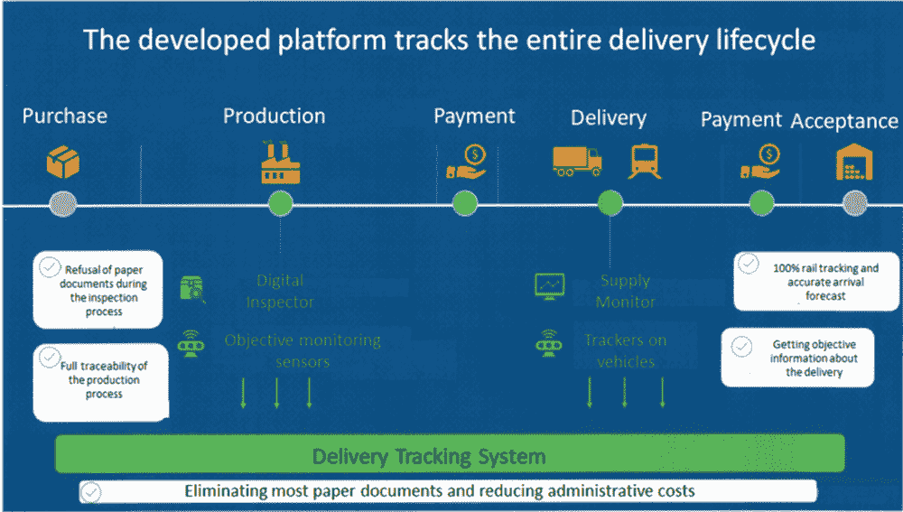
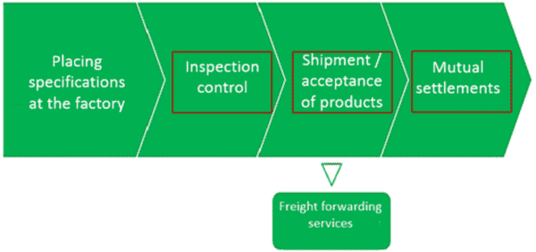

# 第十一章

# 将传统的燃气行业转变为区块链启用的燃气行业：

用于跟踪气体的安全供应链策略

+   弗拉基米尔·尼古拉耶维奇·库斯托夫

    亚历山大一世铁路运输圣彼得堡国立大学，俄罗斯

摘要

作者认为本章的主要目的是展示数字化转型传统业务流程的现代方法，以适应气体行业。作者通过一个在气体行业成功实施的试点项目的例子，展示了基于区块链的高科技供应链基础设施的合成过程。演示从描述供应链的主要业务流程开始。详细描述和可视化了系统所有参与者的功能。考虑了系统的主要组成部分：数字调度员、供应监控器、交互界面和生产环境。提供了对现代区块链平台安全性的比较分析。作者仔细分析了创建和确保智能合约安全性的技术，并提供了一个逐步实施安全智能合约的方法。在本章末尾，提供了选择最安全的区块链平台的结果。

引言

近来，只有懒惰的人才不会写或谈论区块链技术。区块链 - 它是未来的技术还是自欺欺人，在当前对其知识和适用性的了解尚浅的情况下？对于这个问题，可以进行长时间而坚决的争论。本章讨论了确保这种新技术安全性的技术特性，这些特性经常被“藏在幕后”，或者是一些肤浅的、简短的、不具有启发性的描述（Kustov＆Stankevich，2019）。

在信息安全和信息技术领域的专家对区块链技术的观点在印刷品和口头演讲中表达，可以定义为相反的，并在两个标准水平上考虑（Kustov＆Stankevich，2018 年）：

+   1. 实施前景；

+   2. 表现的后果。

第二个标准直接来源于第一个标准，两者都允许我们将专家分为怀疑论者和热心论者。在第一级别“前景”中，意见分为那些真诚地相信区块链及其存在于各种系统和服务中的人，以及那些否定它的人，他们提到解决特定任务的可能替代方法更简单，因此更可靠。第二个标准-“后果”-将专家分为那些在即将到来的“革命”（Swan，2018 年）光明前景下表达无限喜悦的人，该革命可与互联网的创立相媲美，以及将区块链与现有信息和支付系统的消亡联系起来的人（Chris，2017 年）。确切地说，区块链的创造者中本聪根本没有预料到会有如此悲哀的结局（中本聪，2008 年）。

然而，在实践中，使用新技术的大量积极例子占据主导地位（Eman 等人，2020 年），（Nin 等人，2021 年），（Ahmed 等人，2021 年）。天然气行业也不例外，对分布式账本技术给予了很多关注。

因此，作者认为本章的主要目的是展示一种现代化的方法，用于对天然气行业传统业务流程进行数字化转型。近年来，天然气行业实施了几个区块链试点项目。作者以成功在天然气行业实施的试点项目为例，展示了基于区块链的高科技供应链基础设施的合成过程。三个已完成的试点项目特别值得关注：

+   1\. 利用区块链技术创建供应效率管理系统的试点项目。

+   2\. 开发基于区块链技术的自动化合约订立、监控和执行的技术平台原型。

+   3\. 使用区块链技术开发新的数字智能燃料平台。

作为第一个项目的一部分，燃气行业专家在物资和技术资源物流方面测试了区块链技术和物联网概念。

技术专家在天然气生产公司购买的切断阀和管道产品上安装了射频标签（RFID）和卫星定位传感器（GPS）。在制造商装运管道产品的装运阶段，读取 RFID 标签后形成了一份包含交付信息的文件。GPS 传感器使得能够监控货物的移动到储存基地，其移动速度，途中的停留次数和持续时间。所有从设备接收到的数据都由智能合约记录并反映在区块链上。将来，关于仓储和运输操作的信息——将产品输入仓库，移动到码头装载，交付到北冰洋的平台——将根据类似的方案传输。区块链为物理交付、所有并发流程和文件流程之间提供了不可分割的联系，并允许所有参与者以加密形式访问可靠的信息。

成功实施试点项目证实了在供应链管理中使用区块链技术的可能性。燃气行业正在考虑进一步利用区块链的潜力并复制所获得的经验。

“在交付中使用区块链使我们能够创建一个生态系统，用于制造商、检查员、物流运营商、仓储和消费者等所有参与者的互动。我们看到了技术发展和进一步应用的潜力”（Karaev，2018）。

根据第二个项目，在区块链技术基础上开发了一个技术平台的原型，该平台提供了合同的自动化订立、监控和执行过程。该系统还设想了自动仲裁和天然气支付的自动计算。该系统向合同流程的所有参与者开放，并且完全受到未经授权的干预和未经授权更改的保护。目前，天然气行业正在积极努力实施自动化支持天然气供应的合同流程。在初期阶段，这项工作仅针对大型工业气体消费者进行。“数字经济是已经到来的未来。该项目是产业、技术和金融专业知识相结合的生动例证，其中所有参与者都受益”（Vanurina，2019）。

作为第三个项目的一部分，基于区块链开发了一个新的智能燃料平台，旨在加快燃料运营商和航空公司之间的互相结算。

使用该系统后，结算时间从四天缩短到十五秒。“智能燃料数字系统尽可能简化了我们合作伙伴的工作，并增加了互相结算的财务安全性。我们的解决方案使我们能够考虑到航空公司的所有需求，减少对外国服务的进口依赖，并具有高度的航空工业规模化潜力”（Egorov，2021）。

由于上述试点项目的实施，他们的经济效益估计如下：

+   1\. 通过减少 5-10%的行政和商业成本（通过试点项目）使大型石油和天然气公司节省了 4-7 亿美元。

+   2\. 其中一家最大的石油和天然气公司估计，在石油和天然气业务中使用区块链将提高公司的效率 10-15%。

+   3\. 这家石油和天然气公司认为，实施试点项目将使公司节省高达 10%的税收成本。

为了在天然气工业企业创建和实施现代技术，对“使用区块链技术管理物资和技术资源质量和供应效率”的主题进行了试点项目，该项目包括以下主要阶段：

+   1\. 使用区块链技术研究和图形化展示供应效率管理系统的主要业务流程，适用于天然气工业企业。

+   2\. 区块链平台的比较分析、测试和选择平台进行实施。

    +   让我们更详细地看看上述步骤的试点设计过程。

研究和图形化展示供应效率管理系统的主要业务流程

由于供应参与者之间存在着各自的信息系统（IS）的复杂且耗时的交互，因此迫切需要在天然气工业企业开发一套跟踪 MTR 供应的系统。现有供应系统中的数据处理完全集中在数据处理中心（DPC）中进行。需要比较使用数据中心和分布式注册技术（区块链）分别集中和分散进行数据处理的结果。比较结果见表 1。

+   如表 1 所示，区块链技术在数据处理中的应用具有显著优势：

    +   • 提高信任水平，

    +   • 由过程的所有参与者控制业务流程，

    +   • 通过共识决策控制用户访问，

    +   • 通过智能合约确保自动保证履行合同义务，

    +   • 使用内置的认证加密保护工具（СCPT），

    +   • 保证数据不可变性，

    +   • 没有昂贵且安全敏感的 DPC，

    +   • 使用标准通信渠道，

    +   • 由于深层次的地方分权而提高的可靠性，

    +   • 基于开发产品的盒装版本使用的解决方案的广泛扩展。

所列举的一系列非常重要的优点是支持使用区块链技术的有力论据。

至于现有供应系统的现状，如图 1 所示，现有供应系统已完全过时，冗余且不符合现代概念。古老供应链典型信息系统（IS）的主要组成部分如图 1 所示：

+   • IS 运营商；

+   • 运营商 IS；

+   • 客户（煤气公司）的 IS；

+   • 运输公司的 IS；

+   • 制造商 IS；

+   • 检查员 IS。

所有信息系统都是异构的。每个煤气公司都创建了自己的企业 IS。通信渠道未标准化。如图 1 所示，在运输公司的 IS 与客户的 IS 之间的互动以及运营商 IS 与检查员 IS 之间的互动中，观察到了最古老的通信方法，甚至包括“信鸽邮件”，当然，这是比喻性地说。

三种类型的通信被积极使用：电话（检查员的信息系统 ↔ 运营商的信息系统）、普通邮件（制造商的信息系统 ↔ 客户的信息系统）、纸质文件管理：制造商的信息系统 ↔ 运营商的信息系统、运输公司的信息系统 ↔ 检查员的信息系统。有时也会使用非传统类型的通信（例如，快递投递）客户的信息系统 ↔ 运输公司的信息系统。客户是最大的天然气和天然气运输公司。大型电信公司充当运营商，物流运营商充当运输公司，冶金和管道企业充当生产商，因为主要供应是管材产品。专门为此目的创建的监管气体公司充当检查员。

在这种情况下，决定重新组织供应链。重新组织的主要目标是创建一个由程序代码（特殊软件平台）控制的供应过程。试点项目的总体方案如图 2 所示。

表 1. 集中式数据处理与区块链应用在试点项目中的比较

| 序号 | 项目实施要求 | 集中式数据处理（CDP） | 分布式注册技术 |
| --- | --- | --- | --- |
| 1 | 能够将参与者的信息系统直接集成到参与者基础设施中的数据存储和处理点。 | 集中式数据处理。缺点：所有参与者都需要信任运营商。 | 所有参与者数据的存储和处理过程。优势：无需信任运营商。 |
| 2 | 必须能够审计所有参与者对业务流程的实施。 | 提供业务流程的闭源代码。 缺点：所有参与者无法检查业务流程的逻辑。 | 提供业务流程的开源代码。 优势：所有参与者可以检查业务流程的逻辑。 |
| 3 | 需要控制参与者侧用户的权限。 | 有中央化用户访问控制。 缺点：中央化解决方案可以断开参与者的能力。 | 分布式用户访问控制。 优势：通过共识决定限制参与者。 |
| 4 | 确保义务的保证性能。 | 系统内无法保证履行义务。 缺点：需要信任开发人员。 | 确保系统内履行义务的保证。 优势：由智能合约的属性提供。 |
| 5 | 确保历史数据随时间的不可变性，需要区分由数据所有者管理的数据访问。 | 哈希和加密。 缺点：使用第三方加密工具。 需要购买认证资金。 | 哈希和加密。 缺点：使用第三方加密工具。 需要购买认证资金。 |
| 6 | 确保历史数据随时间的不可变性。 | 支持“创建”、“读取”、“更改”、“删除”数据操作。 | 支持“创建”和“读取”数据操作。优势：数据的不可变性。 |
| 7-9 | 降低解决方案的实施、复制和支持成本。 | 需要将流程参与者连接到操作员的能力。 缺点：失去控制。 | 优势：不需要将参与者连接到操作员的能力。 |
| 需要可靠的高速通信渠道。缺点：高成本。 | 优点：标准通信渠道。 |
| 需要提供容错基础设施。缺点：高成本。 | 可靠性由地域去中心化来确保。优点：成本分摊给参与者。 |
| 10 | 需要将解决方案扩展到大量参与者。 | 缺点：依赖于运营商的资源。 | 优点：扩展取决于参与者的资源。 |
| 11 | 需要传输和存储信息的法律意义。 | 缺点：EDI 运营商的非认证加密手段。 | 优点：俄罗斯联邦的两个平台上有认证的加密资金，另外三个平台正在进行认证。 |
| 12 | 需要确保项目生命周期的整体透明性，包括后续阶段。 | 在项目生命周期的后续阶段复制数据。缺点：需要与开发的解决方案集成。 | 优点：能够复制数据供基于区块链平台的解决方案使用。 |
| 图 1. 供应链的概览 |
|  |

试点项目的主要元素是产品环境；主要组件是区块链平台，它在交易中存储系统中的所有事件的日志。此外，试点项目的这张图中还可以区分出其他主要组件，例如：

+   • 交付合同;

+   • 生产;

+   • 付款;

+   • 输入控制。

这些流程通过 SAP ERP 系统的接口与区块链平台进行交互。

此外，以下流程还成为试点项目的组成部分：

+   • 检验控制;

+   • 交付。

作为与区块链平台交互的接口，这些过程分别使用在试点项目实施期间开发的产品：

+   • 数字检验员;

+   • 供应监控器。

| 图 2\. 试点项目的一般方案 |
| --- |
|  |

总的来说，提供已实施平台的整个供应生命周期的图表如图 3 所示。

| 图 3\. 提供已实施平台的整个供应生命周期的图表 |
| --- |
|  |

以下阶段作为广泛使用的“买-运-付”技术的生命周期阶段。在生产阶段，使用数字检验员进行检验监督，其使用确保在检验过程中完全放弃纸质文件管理。数字检验员获取初始数据的方式是通过完全覆盖整个生产过程的客观控制传感器进行观测。

在交付阶段，提供了交付监视器的使用。它提供了 100%的列车跟踪和准确的货物到达预测。车辆上的 GPS 跟踪器也用于监控，提供有关交付的客观信息。

自动数据处理是在使用基于区块链平台运行的交付跟踪系统的所有标记为绿色的阶段提供的。

该系统消除了大部分纸质文件，并降低了行政成本。

图 4 显示了重新组织之前交付过程的图表（“如此前”）。该图表包含以下阶段：在工厂放置规格、检验控制、产品装运和验收以及相互结算。

| 图 4\. 重新组织之前的交付过程的图表（“如此前”） |
| --- |
|  |

图 5 显示了重新组织后的交付流程图。

| 图 5\. 改组后交付过程的图示（“变得如此”） |
| --- |
|  |

该方案总体上几乎与图 4\. 中显示的方案相同。但是，下面将注意到图 5 中以红色框标记的阶段中存在重大变化。两个方案均在装运和产品验收阶段提供货运服务。

对于交付过程的每个阶段，已开发详细的交易链，由实施的平台实施。图 4 中第一阶段的此类交易链示例如图 6 所示。

| 图 6\. 检查控制 “曾经如此” |
| --- |
|  |

此图显示了每个执行者的交易链。

以下交易为气公司（客户）提供参与：

+   1\. 与检查协调生产任务（PT）。

+   2\. 协调互动规则（RI）。

+   3\. 控制计划（PCI）的协调。

+   4\. 检查和批准 PT 执行报告。

以下交易为工厂公司提供参与：

+   1\. 协调 RI。

+   2\. 制定生产计划并分配销售订单。

+   3\. 与检查协调控制计划（PCI）。

+   4\. 在工厂、气公司和检查处发送检查员请求。

+   5\. 制造、测试和验收。

+   6\. 解决不一致。

提供以下交易的检查：

+   1\. 协调 PT。

+   2\. RI 开发和企业、制造商的批准。

+   3\. PCI 的协调。

+   4\. 质量控制和作品验收。气公司报告警告。

+   5\. 将证书发送给制造商进行装运。

+   6\. 不一致登记通知。

+   7\. 质量证书已批准。

+   8\. 形成并将 TP 导向气公司。

文档类型用独特的图标表示（PDF 文件、MS Excel 表格、纸质文档、邮件）。交易通过实现相应业务流程逻辑的链接相互关联。

| 图 7\. 检查控制“按照实际情况。” |
| --- |
|  |

图 7 显示了重新组织后的业务流程检查控制交易图。业务流程逻辑并未改变。然而，以红色标记的交易处理涉及到业务流程的新组件的参与：区块链平台和数字检查员。由这些组件处理的文档用相应的红色图标标记。

| 图 8\. 参与合同关系的数字文档流和数据交换模型 |
| --- |
|  |

在执行这一阶段期间，还开发了参与合同关系的数字文档管理和数据交换模型，如图 8 所示。在显示文档的块头中给出了每个文档链中元素的标题。块的底部包含与此文档交互的主体的名称，执行以下角色：文档的起草者（以蓝色表示）、文档的接收者（以绿色表示）和批准人（以橙色表示）。链中的初始文档以蓝色表示，最终文档以绿色表示。此外，发送的文档以黑色表示，需要批准的文档以橙色表示。在智能合约开发阶段，此阶段开发的数字文档管理模型显著简化了代码编写，并有助于避免错误。

随后，管道产品交付过程的两个主要阶段的文档交易链被开发出来：

+   1\. 产品生产 - 检查控制 / 检查控制付款；

+   2\. 物流 / 生产付款。

图 9 显示了一个关于产品生产 - 检查控制 / 检查控制付款阶段的文档交易链示例。对于每个交易，都标明了转发文档的名称和交互参与者。此外，通过图例指定了操作的类型：文档转发（白色）、控制事件（红色）、请求（黄色）、执行（绿色）。

| 图 9. 产品生产 - 检查控制 / 检查控制付款阶段的文档交易链 |
| --- |
|  |

文档交易链的开发完成了试点项目的第一阶段。在试点项目的第二阶段，进行了区块链平台的比较分析，对其进行了测试，并选择了一个实施平台。

区块链平台的比较分析和实施平台的选择

开发智能合约时的信息安全要求

根据统计数据，超过 70%的智能合约存在漏洞（报告，2019 年）。尚未有一个经过验证的软件包，能够通过静态和动态分析以完全自动化的方式对智能合约的代码进行全面调查，并找出其中可能导致数百万美元损失的漏洞（沙皮耶夫，2019 年）。

区块链技术具有巨大的流行度，并且正在到处实施。在静态代码分析中，程序在没有实际执行的情况下进行分析，而在动态分析中，则在执行过程中进行分析。在大多数情况下，静态分析意味着使用自动化源代码或可执行代码工具进行的分析，无需运行程序即可执行。

此术语通常适用于由自动化工具执行的分析，人工分析称为程序概念、程序理解或代码映射。在大多数情况下，分析是在不同版本的源代码上进行的。由于 Solidity 编程语言和智能合约这一术语相当新，并直接应用于加密经济的现代领域，许多潜在的漏洞可能导致重大的财务损失。因此，智能合约的开发者或整个项目都有义务注意检查他的代码是否存在漏洞。

目前，智能合约的动态分析被简化为在实际条件下检查代码，无论是在区块链平台上还是在其测试版本中。一般来说，动态代码分析是一种在程序执行过程中直接分析程序代码的方法。动态分析的过程可以分为几个阶段：

+   • 准备源代码；

+   • 执行代码的试运行并收集必要信息；

+   • 提取数据的分析。

在试运行期间，我们可以在真实和虚拟模拟器上执行程序。在这种情况下，我们必须从源代码获取可执行文件。通过动态分析，可以获得以下数据：

+   • 资源使用情况 - 代码作为整体或其模块的执行时间；

+   • Web 请求次数；

+   • 圈复杂度；

+   • 代码错误；

+   • 内存泄漏；

+   • 代码中的漏洞。

动态分析可以确保项目运行良好或识别错误，表明有必要修复它们。从提高质量的角度来看，动态分析更具优势，因为它不会让您忽视程序的缺陷，例如静态分析。然而，即使在分析过程中没有检测到缺陷，这也不能保证没有“100%”的缺陷，因为测试对程序的全面覆盖并不意味着代码中没有错误，因为动态分析无法检测到逻辑错误。

智能合约漏洞查找的简化方法

要编写安全运行的智能合约，您需要经历几个安全开发阶段：

+   • 设计，

+   • 开发，

+   • 测试。

设计（编写规范）

这个过程也被称为系统需求的开发。在编写智能合约之前，您需要描述其概念、操作、流程和交互。值得与客户讨论这些操作并批准所有要求。接下来，定义计划和智能合约中流程的依赖关系。分析所有当前的漏洞并考虑操作的安全性。

开发

本阶段包括实施智能合约的过程。要成功编写安全代码，您需要分析代码开发中的当前漏洞以及开发语言的特性。在编写代码之前进行这项工作至关重要，因为以后修复代码中的错误和漏洞将会很困难。之后，您可以开始编写安全代码。

测试

此阶段是测试和调查智能合约编写的代码是否存在漏洞。对于这个阶段，开发者可以自行编写测试，但使用现成的测试集会更容易，通过它们您可以发现智能合约中的漏洞。

需要记住的是，进行全面的安全检查会花费很多钱。因此，这也需要时间。因此，撰写并最初确保合同总比以后修复漏洞要容易得多。在这个阶段也可以使用外部审计。在 IDEF0 方法论中实施安全且功能正常的智能合约的操作的视觉表示形式如图 10 所示。

| 图 10\. 开发安全智能合约的阶段 |
| --- |
|  |

下一个阶段是开发安全代码。为此，您将需要一种确保智能合约安全的方法。此外，安全专家参与开发，创建了一个安全任务，在完成此阶段后，应该出现一个安全的代码。

IDEFO 方法论中的最后一个阶段（用于形式化和描述业务流程的功能建模方法和图形符号）是测试，其中测试过程是控制工具，开发人员和测试程序、分析器是机制。最终，通过所有阶段后，会得到一个安全的智能合约。

方法论结构

正如上文所述，这种安全技术是为了开发安全的智能合约代码而需要的。智能合约（以以太坊为例）是用一种特别创建的 Solidity 语言（官方，2018 年），（Dannen，2018 年）开发的。这是一种统计类型的类似 JavaScript 的编程语言。

为了方便起见，该方法被分为三部分。该方法的使用者只需简单地编写一个运行良好且安全的智能合约代码。

该方法包括三个阶段：

+   1\. 研究和理解与 solidity 编程语言和区块链环境无关但在这些领域同样相关的已知代码编写漏洞；

+   2\. Solidity 语言的特性，没有这些特性智能合约将无法正常工作；

+   3\. 关于 EVM 以太坊本身智能合约正确安全运行的建议。

方法论计划的可视化表示如图 11 所示。

| 图 11\. 智能合约安全保障方法论计划 |
| --- |
|  |

撰写智能合约时出现的漏洞和问题

智能合约的安全性必须得到可靠的保证。许多智能合约漏洞导致了非常重大的经济损失，这里只是两个例子。

仅仅跟随直觉而不是最佳实践可能只会导致意想不到的漏洞。众所周知的 DAO（去中心化自治组织）黑客事件可以被视为智能合约中被忽视的副作用的典型例子。基于以太坊的 DAO 最初是世界上最大的众筹项目之一，但很快就成为了最值得记忆的失败之一，当利用递归调用模式导致 DAO 资金被突然移除时。随后以太坊区块链的硬分叉（查看 https://www.zeit.de/digital/internet/2016-06/the-dao-blockchain-ether-hack）仅加剧了争议。

与此同样严重的是，2017 年 7 月与以太坊相关的 Parity 钱包遭受的损失总额为 3000 万美元（查看 https://www.coindesk.com/30-million-ether-reported-stolen-parity-wallet-breach）。在一个关键库中不小心使用代理调用命令使攻击者能够获得多签名钱包的所有权并重定向其所有资金

要使智能合约安全，使攻击者无法破坏它或将代币发送给自己，需要记住编写应用程序代码时的典型和众所周知的错误。这对智能合约尤为重要，因为开发人员在将错误发送到区块链后将不会纠正它们。

下面是一个最新的错误列表，我们可以利用它来避免程序正确运行，即智能合约，附带解释：

+   • 缓冲区溢出是智能合约中可用的最知名的计算机系统和应用程序黑客方法之一。当应用程序或程序在内存中分配的缓冲区之外写入数据时发生的现象。溢出是由于与输入数据和为它们分配的内存的不正确工作以及应用程序对输入值的严格保护不足而发生的。由于智能合约可以读取用户的数据，因此需要记住对输入数据的限制。如果在创建数组时限制了缓冲区而不检查用户输入的内容，那么攻击者就有可能重写部分智能合约，从而获取数据或访问它。

+   • 使用格式字符串的漏洞。这些是在没有对输入输出字段进行控制和使用格式字符串的情况下出现的错误，由此输入输出参数。因此，可能会损害处理器的内存：获取密码值、地址。用户可以访问它并将值写入内存单元，从而可能发生缓冲区溢出。还可以从处理器可以处理的任何内存区域获取数据。

+   • 检查参数。开发人员应该明白用户可以在智能合约输入字段中输入任何内容。用户可以输入可解释为程序并更改某些有意义的内容的数据，这可能会破坏智能合约的运行或执行任意代码。您应该限制输入的数据或提供带有解释的错误输出。数据可能不在可接受的范围内，尤其是在智能合约中，因为该过程可能会影响金融交易。

+   • 损坏输入的漏洞。当用户输入的数据被传递给解释器而没有足够的控制时，也会发生这种情况。用户可以设置输入数据，以便正在运行的解释器执行完全不同于受影响程序作者意图的命令。

影响 Solidity 语言编写的智能合约安全性的特定漏洞和错误

可见性和委托调用：在 Solidity 中，与其他编程语言一样，提供了公共（public）和私有（private）函数。任何人都可以调用公共函数，而私有函数只能在合约内部访问。有一个方便的 Delegatecall 函数。这是实现库和模块化代码的基础。它还允许您在运行时动态加载来自另一个地址的代码。存储、当前地址和余额仍然与调用合约相关联，只有代码取自被调用地址。然而，它存在漏洞，因为攻击者在委托过程中可以通过 owner 函数获取合约所有权。因此，在使用 Delegate 函数时，您需要小心并检查它与函数交互的内容。

前置交易攻击：在区块链中，所有交易都由矿工进行处理并记录在区块中。有一个交易池，通常矿工会按照手续费的顺序排列它们，然后处理它们。因此，攻击者可以查看所有交易，找到合适的交易并发送相同的交易。但是，他的交易由于有更高的手续费，会被优先处理，有很高的可能性会比第一个交易更快地被处理并写入区块。这种漏洞在彩票和抽奖中特别相关。

向合约发送以太币：Solidity 有一个自毁函数：它会删除智能合约并将所有代币发送到特定地址。细微之处在于，该地址可能是一个合约，其备用功能可能不会被执行。这意味着如果一个合约函数有一个条件运算符，该运算符依赖于该合约的余额是否低于某个金额，那么用户可能会绕过这个运算符。如果你发送一个返回函数，合约就不能接收以太币，但是如果你将自毁合约选择为目标，备用函数就不会被调用。因此，最好永远不要将合约余额用作保护手段。

调用未知函数：在这种情况下，攻击者的合约可以通过向一个不安全的合约发送足够数量的以太币首先宣称领导权。然后另一个试图声明领导权的玩家的交易将因为 revert 函数而被拒绝。尽管是一个简单的攻击，但这导致了合约的永久拒绝服务，使其变得无用。

小地址攻击：由于用户可以与交易所合作，因此他可以输入一个位数较少的不正确地址。由于固定长度的字符串被馈送到 EVM 中，如果字符串比它小，EVM 就会用无关紧要的零来补充它。因此，由于编码中的这种情况，代币数量可能会发生变化。并且区块链中的条目将不会是用户想要的那个。在智能合约中检查地址的正确字符数是非常重要的，如果此检查未通过，则不执行交易。

这里是一些存在漏洞的智能合约源文本示例：

竞争条件类型：漏洞在于在执行合同代码期间再次调用外部代码的可能性。这可能导致不同的函数调用以破坏性的方式相互作用。具有此漏洞的智能合约代码示例：

1     映射（地址} =˃ uint）私有 userBalances;

2

3 ▼     function wthdrawBalance() public {

4          uint amountToWithdraw = userBalances[msg.sender];

5          require(msg.sender.call.value(amountToWithdraw)(); // 1

6 ▼     /* 在第一行调用了外部代码，该代码可以再次被调用

7      直到第一次调用结束为止 */

8          userBalances[msg.sender] = Ø;

9     }

依赖于时间戳。编写智能合约时，需要牢记下一个区块的节点可以根据其利益将时间戳写入其中。因此，它可以影响依赖于其代码中时间戳值的合约的执行。具有此漏洞的智能合约代码示例：

1     uint someVariable = now + 1;

2 ▼     if (now % 2 == Ø) { // 由矿工安装的 now

3          // 重要代码

4     }

5 ▼     if ((someVariable - 1ØØ) % 2 == Ø) { // someVariable 依赖于 now

6          // 重要代码

7     }

数据类型溢出。 数据类型溢出是危险的，因为值的变化可能根据开发人员未提供的逻辑而发生。 这种漏洞既可能发生在数据类型的上限上，也可能发生在下限上。 具有此漏洞的智能合约代码示例：

1     映射（addres =˃ uint256）public balanceOf

2     // 不安全选项

3 ▼     function transfer(addres _to, uint256 _value) {

4 ▼          /* 检查发送金额的可用性 */

5          require(balanceOf[msg.sender] =˃ _value);

6 ▼          /* 添加和减少新余额 */

7          balanceOf[msg.sender] -= _value;

8          balanceOf[_to] += _value;

9     }

10     // 安全选项

11 ▼     function transfer(addres _to, uint256 _value) {

12 ▼     /* 检查发送金额的可用性并检查溢出 */

13          require(

14          balanceOf[msg.sender] -=value &&

15          balanseOf[_to} + _value >= balanceOf[_to]

16          );

17 ▼     /* 更改余额 */

18          balanceOf[msg.sender] -= _value;

19          balanceOf[_to] += _value;

20     }

选择测试平台的理由

综合收集的所有数据，可以得出以下测试以下平台数量是可取的：

+   1) Hyperledger;

+   2) Corda;

+   3) Apla;

+   4) Exonum;

+   5) Universa;

+   6) Quorum.

目前，上述所有平台的开发人员可能会更改概念或发布。 主要标准是分发套件的可用性（根据软件版本的平台编号的重要版本）。 事实证明，并非所有平台都已达到主要公共发布阶段。 此外，上述每个平台都有一个测试网络，该测试网络将允许您以最低成本购买内部加密货币或平台代币进行负载测试。 由于这一情况，对每个平台进行基本配置并确定测试的潜在方面至关重要。

因此，我们可以得出结论，现在我们已经选择了从技术角度来看关闭任务列表的平台 - 一个具有集中式数据库的平台，其主要功能标准是防止停机、处理相同事务的结果相同、防伪保护机制可用、事务回滚和违法性违规的可用性。

安全需求（身份验证和访问控制方法、日志记录、企业证书）

表 2 展示了所考虑平台的比较特性。

表 2. 区块链平台比较结果。

| 需求 | Hyperledger Fabric | Corda | Waves Vostok | Apla | 以太坊 |
| --- | --- | --- | --- | --- | --- |
| 具有与 LDAP 目录服务集成可能性的身份验证机制的可用性 | 通过开发集成模块进行 | 相同 | 相同 | 通过开发集成模块进行（可以使用内置工具） | 没有可用信息 |
| 访问控制机制的可用性（DAC RB AC） | 无需开发集成模块 | 相同 | 相同 | 具有访问控制机制 | 没有可用信息 |
| 系统中发生事件的日志记录系统的可用性 | 区块链包含了各种现有系统可以分析的交易日志 | 相同 | 相同 | 相同 | 没有可用信息 |
| 系统中发生事件的通知系统（警报系统）的可用性 | 通过开发集成模块进行 | 相同 | 相同 | 相同 | 没有可用信息 |
| 使用 SHA-3 作为加密哈希函数的可能性 | 开源，需要修改 | 使用 SHA-256；仅在开放版本（非企业版）中更改算法可能性 | 使用 SHA-256，是封闭平台，不可能更改哈希函数 | 使用 SHA-256，不定义更改哈希函数的可能性 | 没有可用信息 |
| 导入企业证书以进行交易签名的能力 | 存在实现可能性 | 不存在可能性 | 相同 | 相同 | 没有可用信息 |
| 要求 | Masterchain | Bifury Exonum | SAP Leonardo | Universa | Quorum |
| 具有与 LDAP 目录服务集成可能性的身份验证机制的可用性 | 没有可用信息 | 通过开发集成模块执行 | 没有可用信息 | 通过开发集成模块执行。该功能正在开发中。 | 通过开发集成模块执行 |
| 访问控制机制的可用性（DAC RB AC） | 不存在机制 | 无需开发集成模块 | 没有可用信息 | 在开发中不存在机制、功能 | 无需开发集成模块 |
| 记录系统中发生事件的系统的可用性 | 区块链包含可以由各种现有系统分析的交易日志 | 相同 | 没有可用信息 | 相同 | 相同 |
| 有关系统中发生事件的通知系统（报警系统）的可用性 | 通过开发集成模块执行 | 相同 | 没有可用信息 | 相同 | 相同 |
| 使用 SHA-3 作为加密哈希函数的可能性 | 没有可用信息 | 需要修改；平台默认未实现 SHA-3 | 没有可用信息 | 文档中未定义哈希方法 | 存在使用 SHA-3 的可能性 |
| 导入公司证书进行交易签名的能力 | 没有可用信息 | 没有可能性 | 没有可用信息 | 没有可能性 | 相同 |

智能合约程序代码的形式验证方法和手段

对程序代码的验证是验证其工作结果是否符合规范（从外部制定的要求）。

在本工作问题的表述中，验证的概念并没有严格按照数学意义使用。验证，在严格意义上，确实是与从外部接收到的现成要求一起使用的。除了验证符合性之外，它还意味着对主题领域进行初步分析，并确定有助于合同最安全运行的要求。

除了要求之外，每个智能合约还有特定的业务逻辑，对其要求只能单独收集。对于每个智能合约，只能分别验证其适当性、明确性、完整性、一致性和其他重要属性的具体要求，并验证智能合约代码是否符合这些具体要求。

收集和分析业务需求的过程是一项单独的任务，与本工作的任务不同。程序代码的形式验证是一个更严格的概念，意味着对代码结果与形式规范的符合或不符合进行形式证明。

目前，形式验证程序的三种方法最广泛使用 •

+   • 符号执行，

+   • 检查模型，

+   • 使用自动定理证明进行验证。

每种方法都应该详细讨论。

符号执行

符号执行的主要思想是，如果变量的值是未知的，则在分析代码时，它由某些符号表示，并且对该变量的进一步操作将被视为对该符号的操作。

结果表明，在这种情况下，推理的整个过程可以表示为一个算法，这意味着它可以被自动完成，这在许多现代验证器中被成功使用。通过自动验证，变量值的条件形成的方式略有不同。程序执行的所有可能分支逐一排序。在分析每个分支时，编制了一组条件，用于使程序遵循此分支的变量值。当出现每个新条件时，会检查整个条件集以确定可满足性。

如果在某个时间点发现许多条件都不可能成立，这意味着程序无法遵循此分支。条件通过 SMT（满足模理论）求解器检查可行性。

符号执行提供了非常不错的结果，适用于实践中的真实工业程序。例如，微软的 SAGE 系统采用了符号执行方法，用于验证各种微软产品：包括典型的应用程序，如 PowerPoint，以及 Windows 操作系统本身。当然，在实践中使用的验证器中，分析过程是复杂且非平凡的，真实的验证器使用各种优化来简化此过程。

适用于 C、C++、C# 和 Java 的 PVS-静态代码分析器主要设计用于帮助这些语言的开发人员。其工作中使用的一个概念是符号执行。符号执行是许多用于分析各种程序的验证器的基础。有一些工具用于分析以太坊网络的智能合约，这些工具使用符号执行：Mythril、Oyente、Manticore（它还允许分析 ELF 文件）。我们还应该提到 SMT 求解器，没有使用这些求解器，符号执行工具无法完成。

软件代码验证系统将这些求解器称为 Z3、Spacer、Cvc3、Yices、Alt-Ergo、Gappa、veriT。SMT 求解器被用于符号执行以及其他方法，这些方法将在后文讨论。

模型检查

这种方法是基于系统行为在特定模型中的表示这一事实的。通常，模型以简化形式描述系统。描述模型的行为必须符合必须与模型本身一起设置的特定规定。当涉及到时态模型（意大利语 - 考虑时间条件中因果关系的模型的节奏）的验证时，用于检查模型行为的规则要考虑时间方面。这意味着在规则的表述中，有诸如“从不”、“始终”、“曾经”、“最终”等概念。此类规则的示例是以下陈述：“某个帐户的余额永远不会为零”，“如果发送消息，则最终会处理该消息”。

实现模型验证的验证器基于一种严肃的科学理论，该理论由(Velder 等人，2011)逐步描述。基于模型验证的不同验证器使用不同的工作方案。在概述部分详细讨论数学逻辑理论并考虑不同工具使用的所有算法将是多余的，因此我们将介绍一种验证方案，特别是由 SPIN 验证器使用的一种。

用户用内置的编程语言描述系统的行为（在 SPIN 的情况下，使用 Promela 语言）。验证器将被检查的系统视为有限自动机，每个状态都由所有全局变量的一组值来描述。用户还设置规则（考虑时间方面的声明）。为了符合，需要检查系统的行为。通过否定这些陈述，另一个专门构造的有限自动机被构造。然后构造这两个自动机生成的语言的交集。如果交集为空，那么验证是成功的，因为我们设置的规则的否定不能成立。如果交集不为空，则它作为一个案例，说明了系统的行为违反了我们设置的规则。许多验证器都基于检查时间模型：SPIN（最著名的）、Eldarica、Uppaal、NuSMV。

定理的自动证明

用自动定理证明进行验证，最一般的形式如下。

系统规范及其实现都是以某种逻辑形式的公式书写的。让我们用符号 φ 表示规范公式，用符号 ψ 表示实现公式。我们需要检查表达式 ψ→φ 是否为真。当且仅当此表达式为真时，系统才满足规范。对于证明 ψ→φ，通常使用自动证明定理的程序。这些程序是基于数理逻辑发展的一种理论的。用于自动验证定理的许多算法都属于同一理论。这里我们将简要介绍数理逻辑。自动定理证明程序通常使用一阶谓词逻辑。在这种逻辑中有一个完整的变量集，以及给定 arity 的一组函数和谓词符号。Arity 指的是函数或谓词符号的参数个数。

项是一个变量或形式为 f(t[1], t[2],..., t[n]) 的字符串，其中 f 是 arity 为 n 的函数符号，而 t[i] 是项。常数可以被视为 arity 为 0 的函数。谓词的形式是 P(t[1], t[2],..., t[n])，其中 P 是 arity 为 n 的谓词符号，而 t[i] 是项。

命题是谓词、命题的逻辑组合或陈述了存在或普遍性的量化。还有许多类型的类型逻辑，每个变量都有一个类型。每个函数符号都有许多参数类型和一个结果类型，而每个谓词符号都有许多参数类型但没有结果类型。在这种逻辑中的量化也是有类型的。

在谓词逻辑中，有推理和获取推论的规则，根据这些规则，一个或多个句子的有效性遵循另一个句子的有效性。自动证明定理的算法被简化为应用这些推理规则。自动证明需要推理规则和搜索证明的策略。例如，一种策略可能建议从末尾使用推理规则，从需要证明的句子开始。

自动证明定理的程序所使用的策略基于宽度优先和深度优先的算法。证明问题的复杂度是所证明句子长度的两倍指数复杂度。这就是为什么自动证明程序通常是交互式的，因为在这种情况下，用户可以帮助程序构建证明，从而显著降低了任务的复杂度。

与自动证明系统的交互需要高度资质的用户。

我们注意到 Coq、Simplify、Isabelle/HOL、HOL 4、HOL Light、Mizar 等自动证明工具，用于验证程序代码。

保护 Hyperledger 和 Exonum 服务免受错误

在编写 Hyperledger 和 Exonum 智能合约的函数时，描述存储在区块链中的对象的某些业务逻辑，程序员可能会犯错误。这些错误中的一些可以由编译器本身发现，并将及时消除。其他错误可能会导致以下后果：

+   1\. 区块链节点的紧急停止。实现节点逻辑并执行服务代码的程序可以终止并输出错误。在 Hyperledger 中将服务代码实现在 Rust、Exonum 或 Golang 平台上可能是因为未正确处理调用 panic 函数的情况，或者未考虑明确导致 panic 的函数。对于 Java、Node.js 中的服务，这种情况可能是由于未拦截的异常引起的。

+   2\. 外部 API 调用紧急终止，改变网络状态或不改变。与前一情况类似，可能会出现 REST API 请求处理程序无法正确终止的情况。这不会导致节点停止，但执行请求的程序将不会收到错误消息或结果。

+   3\. 节点挂起。如果事务处理函数具有很高的计算复杂性，或者进入错误状态并进入永恒循环，网络节点将无法执行事务。

+   4\. 外部 API 处理程序冻结。在程序员错误的情况下，外部 REST API 处理程序线程可能永远不会完成，或者它将运行的时间太长，消耗网络节点的资源。Hyperledger 和 Exonum 区块链是私有的，只有一组有限的节点可以在其中创建交易。因此，它们没有内置的防止 DOS 的机制，所有防止此类情况发生的责任都落在程序员身上。

+   5\. 网络的垃圾。由于智能合约可以在计算下一个块时进行交易，网络可能会不断增加区块链的大小，而大小可以无限制地增加。

+   6\. 在事务计算函数中调用无效。计算事务的函数不应直接或间接地依赖于外部数据源，因为事务应在任何节点上产生结果。

+   7\. 智能合约函数之间的递归调用可能会违反其操作逻辑或在处理程序线程中进入永久循环。

+   8\. 交易调用的不一致性。服务可以在每个节点上存储数据，也可以在全局范围内存储数据。在 Exonum 区块链中，state_hash 函数返回服务当前状态的哈希；在 Hyperleger 中，PutState 函数将数据写入块中存储。同时，你需要仔细确保加载到块中的数据不依赖于节点上存储的本地数据。否则，网络的每个节点将以不同的方式计算它，当块启用时，交易将不一致。

上述错误中的一些在为以太坊区块链编制的 DASP-10 列表中列出。由于 Hyperleger 和 Exonum 区块链中智能合约（服务）的更丰富的执行模型，与以太坊相比，编写函数中可能会出现其他错误。

为了避免发生这些错误，有必要对服务进行彻底的测试。然而，对于规模不够大的项目来说，使用测试来找到错误变得更加困难。原因在于测试只能检查有限的程序执行路径集。当向代码添加新功能和分支时，需要包含在测试中的输入数据变体数量呈非线性增长。会发生组合爆炸。

开发智能合约形式验证方法的建议

通过对 Hyperleger 和 Exonum 平台服务开发语言的分析，得出以下结论：

+   1\. 你需要单独验证交易函数和事件处理函数。交易函数在不同节点上应该以相同的方式计算，在其他时间，返回给它的值不应该依赖于节点的本地存储或外部数据。验证方法应该检查这一点，并允许你处理这样的错误。处理函数可以使用本地变量，并自由访问外部数据。

+   2\. 拒绝服务检查。必须考虑到服务可能被阻塞的所有情况。对于每个循环，估计递归的迭代次数以评估其深度是必要的。在 Golang 和 Rust 语言中，需要避免所有明确或隐含地引发 panic 的构造。在 Java 语言中，捕获所有异常是必要的。验证器必须检测所有可能导致任何调用的合约函数或其组合挂起的情况。

+   3\. 访问控制。尽管区块链是私有的，并且只有一组有限的节点可以在其中进行交易，但必须考虑对这些节点进行攻击的风险。区块链中没有用于交易请求的内置身份验证工具；只有通过公钥机制确认此类权限的方法：

    +   a. 在 Exonum 中有三种类型的 REST API 请求。第一种类型是公共读取请求；任何客户端都可以发起它们，它们不会改变区块链的状态，但可能会改变本地节点变量的状态。第二种类型是交易请求，它们必须使用私钥签名。第三种是用于配置合约的管理请求。存储私钥的保密性确保了安全性。同时，节点本身的访问不需要额外的身份验证机制。

    +   b. Hyperledger Fabric 区块链支持在并行的 Hyperleger composer（OAuth）和 fabric-rest（JWT）项目中进行身份验证。

根据服务的业务逻辑，验证方法应检测违反合约函数访问权限的潜在机会。

在为 Hyperleger 和 Exonum 平台构建智能合约时，需要进行自动化验证。您需要使用现成的验证工具（Java）或开发专门的验证工具进行验证。必须根据业务逻辑的要求制定要检查的条件，并验证区块链本身的操作正确性。验证算法应该看起来像是一组强制性要求，应用于负责支持交易执行和处理网络事件的功能。

结论

本章介绍了一个试点项目的材料，该项目旨在利用区块链技术创建供应效率管理系统。项目描述从研究供应链的主要业务流程开始。对所有系统参与者的功能进行了详细描述和可视化展示：客户、制造商、检验员、运输公司。考虑了系统的主要组成部分：数字调度员、供应监控器、交互界面和生产环境。还对大多数现代区块链平台的安全性进行了详细的比较分析。一个显著特点是对创建和确保安全实施分布式应用程序和智能合约技术的技术进行了彻底审查。作者提供了一种逐步实施安全智能合约的方法。在章节的最后，呈现了最安全的区块链平台的选择结果。试点项目的成功实施证实了在供应链管理中使用区块链技术的可能性。它展示了进一步利用区块链潜力和复制所获经验的前景。供应链中的区块链已经允许创建一个生态系统，用于所有参与者之间的互动，例如制造商、检验员、物流运营商、仓库和消费者。本章讨论的方法无疑具有发展和进一步应用区块链技术的潜力。

参考文献

Ahmed, A. A., Bassem, A. A., Irfan, M., Khan, M., Salvador, E. V., & Jialiang, P. (2021). Quantum-inspired blockchain-based cybersecurity: Securing smart edge utilities in IoT-based smart cities. 信息处理与管理, 58(4), 102549. doi:10.1016/j.ipm.2021.102549

克里斯，J. S. (2017)。谁会被区块链杀死：4 个即将消失的小型企业领域。https://incrussia.ru/understand/kogo-ubet-blokchejn-4-sfery-malogo-biznesa-kotorye-skoro-ischeznut/

Dannen, K. (2018)。《以太坊和 Solidity 简介》。Samizdat.

Egorov, V. (2021)。Gazprom Neft 以 NFT 令牌的形式出售其区块链平台。(https://beincrypto.ru/gazprom-neft-prodaet-reliz-sobstvennoj-blokchejn-platformy-v-vide-nft-tokena/)

Eman, M. A., Abdullah, M. I., Passent, M. E., Oh-Young, S., & Ali, K. B. (2020)。DITrust chain：面向可持续医疗保健物联网系统的基于区块链的信任模型。IEEE Access：实用创新，开放解决方案，8，111223–111238。doi:10.1109/ACCESS.2020.2999468

Karaev, A. (2018)。“Gazprom Neft”在物流领域测试了区块链和物联网。(https://www.gazprom-neft.ru/press-center/news/v-gazprom-nefti-ispytali-blokcheyn-i-internet-veshchey-v-logistike/)

Kustov, V. N., & Stankevich, T. L. (2018)。再谈区块链技术。交通智能技术，(3)，38–46。

Kustov, V. N., & Stankevich, T. L. (2018)。区块链前景：怀疑论者和乐观主义者之间的对话。科学会议通报，1(37)，77-84。

Kustov, V. N., & Stankevich, T. L. (2019)。区块链技术：聪明的简单或开明的思考的故事。如何保护自己免受区块链的影响？信息保护。INSIDE，2(86)，11-18。

Nin, H. L., Mohamed, E., Shanka, K., Gupta, B. B., & Ahmed, A. A. (2021). 利用深度置信网络和 ResNet 模型在医疗保健中实现安全的区块链启用的物联网系统。《并行与分布式计算杂志》，153，150–160。doi:10.1016/j.jpdc.2021.03.011

以太坊基金会关于 Solidity 语言的官方文档。(2018)。https://solidity.readthedocs.io/en

Positive Technologies 公司报告. (2019). 初始代币发行。信息安全威胁。 https://www.ptsecurity.com/upload/corporate/ru-ru/analytics/ICO-Threats-rus.pdf

发展路线图. (2019). “分布式记账系统”端到端数字技术的路线图 . 罗斯特克。

Satoshi, N. (未知日期). 比特币。一种点对点电子现金系统。 https://bitcoin.org/bitcoin.pdf

Shapiev, M. M. (2019). 智能合约漏洞及其利用方式。科学电子期刊“经纬”，10(28)，1-5。

Swan, M. (2018). 区块链：新经济的方案。奥林匹克商业出版社。

Vanurina, V. (2019). 俄罗斯天然气工业公司正在转向区块链。https://news.rambler.ru/other/41980326-gazprom-perehodit-na-blokcheyn/

Velder, S. E., Lukin, M. A., Shalyto, A. A., & Yaminov, B. R. (2011). 自动机程序验证[Verifikatsiya avtomatnykh program] . 科学出版社。
