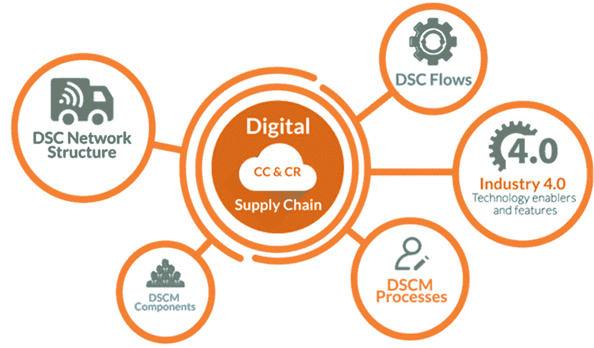

# 第十二章

# 物流管理的最新趋势：

过去、现在和未来

+   Kannadhasan S.

    

    印度 Cheran 工程学院

+   Nagarajan R.

    印度 Gnanamani 技术学院

+   Srividhya G.

    印度 Gnanamani 技术学院

+   Xiaolei Wang

    芬兰阿尔托大学

摘要

本章的目的是扩大对工业公司使用的各种物流解决方案的讨论，以提高客户满意度并评估其影响。本研究旨在通过半结构化访谈发现并提出物流管理解决方案理论与客户满意度之间的新联系。来自不同行业的十二家阿尔及利亚中小型工业公司参加了半结构化访谈。他们的 22 位供应链和物流经理被问及他们对供应商的重要性以及物流管理对他们成为满意客户的重要性的看法。在当今竞争激烈的全球经济环境中，企业面临着越来越大的压力，要发现创新方法来创造价值并将其传递给他们的消费者。

引言

将近 25 年前，消费者对客户服务的满意度成为商业研究的焦点。商业顾问、公司和运营管理人员共同努力，以确定持续让客户满意的公司的特征，制定衡量客户满意度的技术，并实施响应客户反馈的持续质量改进机制。对于每家希望评估其业绩并确保其生存的公司来说，客户服务和满意度都至关重要，无论该研究是否由商业部门进行。20 世纪 50 年代和 60 年代，产品价格逐渐上涨，导致许多危机和购买力受限。商业顾问正在寻找平衡客户满意度、成本和质量的解决方案。此外，当时的激烈竞争推动企业寻求竞争优势。根据研究，物流管理可能帮助公司实现客户满意度、成本和价值优势。

运输车队管理、订单执行、物流设计、库存、供应以及第三方物流服务提供商管理都是物流管理的例子。客户服务、采购、采购、生产计划、排程、包装和装配都是物流管理的例子。物流管理是战略、运营、战术和各级规划和执行的重要组成部分（Achumba 等人，2013 年）。在今天竞争激烈的市场上，企业必须运行在最高效率，并提供优质的服务才能盈利。在快速消费品行业，发现了影响仓库效率和效益的三个变量：仓库管理系统的简单性/复杂性、产品存放方法以及仓库布局设计。企业能够有效地管理仓库、降低成本并履行订单的能力对其成功至关重要。值得注意的是，仓库管理对企业而言存在着重大困难。由于原材料、中间产品和最终产品处理方式的变化，仓库在美国经济中的功能和重要性发生了显著变化（Albernaz 等人，2014 年）。仓库管理在当今市场上越来越被普遍认识为是一项必要性，其中客户满意度和服务已成为企业脱颖而出的关键因素。为了确保企业各个环节的最佳性能，仓库操作系统必须建立在接收库存、快速订单执行、仓库操作的自动验证和准确的库存管理的基础上。

物理产品配送的成功在很大程度上依赖于仓储网络。领先的公司被看到使用和执行各种仓储技术，包括容量切换、枢纽网络、拼凑和外包。为了增强仓库设计技术，建议同时使用分析模型和仿真模型。分析模型通常是设计导向的，这意味着它们能够迅速查看许多不同的选项以找到解决方案。另一方面，仿真模型通常是分析导向的。它们可以对设计提出意见，但通常受限于探索设计领域的能力。为了在评估仓库问题时获得更多的灵活性，必须将这两种方法整合起来。除了新的供应链趋势外，技术进步对储存也有重大影响。许多以前手工进行的活动现在已经机械化甚至自动化。机器人可以被用来在自动化仓库中整理到货物品到货架上（Dobler Burt 等人，2006 年）。每个货架的内容都被传输到中央计算机，该计算机将货架分配到空闲的存储空间。到货的货架通过输送带或引导车辆被运送到存储缓冲区，并且货架由自动化存储/检索设备存储在存储区的正确位置。

供应链流程的一部分是根据物流管理委员会的说法，组织、执行和管理有效、高效、向前和向后的流动，商品、服务、相关信息的起源和消费点，以满足客户的要求。通俗地说，正确的产品在正确的位置、正确的时间、正确的状态意味着在正确的时间、正确的地点、正确的状态拥有正确的东西。另一方面，供应链包括满足客户请求的所有流程。它始于供应商，延伸至生产、分销、零售，最终到客户（Kandampully.J.等人，2003）。供应链管理是从供应商到制造商、批发商、零售商再到客户的过程中，管理商品、信息和资金的移动。通过开发新技术，企业可以在各种管理活动中获得战略竞争优势，如物流和供应链管理。另一方面，应用程度的成功取决于它所使用的技术，以及适当的组织基础设施、文化和管理实践的存在。在物流行业中，信息、通信和自动化技术大大提高了数据识别、收集、处理、分析和发送的速度，同时保持了高度的准确性和可靠性。技术可以帮助企业提高竞争力和业绩。它通过增强物流系统的整体性能和效率，对供应链绩效做出了重大贡献。许多现代技术在工业化国家的物流中得到应用，但在印度的接受程度较低。随着印度经济的自由化，竞争加剧，保持领先地位的唯一途径就是投资于技术化的流程（C.R. Kothari 等，2008）。

制造业的需求和销售是不稳定的，导致了激烈的国际竞争。由于全球市场快速变化的结果，许多制造公司被迫更加灵活地满足客户对增值产品和服务的期望和需求（Chepkoeh.A,et.al,2019）。而制造公司在今天竞争激烈的市场中获得成功的最重要方法是提供增值、高质量和创新的产品。为保持竞争力，许多马来西亚工业公司已经实施了各种改进计划，并建立了新的运营理念（Cooper.D.R, et.al,2015）。自 20 世纪 80 年代以来，供应链管理在制造企业中逐渐流行起来，并成为公司战略的一个重要组成部分。

供应链管理

由于消费者需求上升，供应链和物流网络的数字化变得更加动态。这种数字化通过高效共享产品/服务交付跟踪信息，简化了对消费者需求的访问。跟踪信息是由参与供应链过程的企业集成所保证的，他们的工作是在不同系统之间创建映射。在不同公司之间整合数据或信息通常导致高昂的费用和信息传播缓慢。本研究探讨了区块链技术如何用于整合供应链。这项技术通过与云集成，为数字供应链提供了一种成本效益的业务策略。此外，通过增加可见性，这项技术可能有助于破坏数字供应链网络。有了这种可见性，可以进行持续监控，从而实现更好的供应链绩效。由于固有的危险，物流和供应链领域对这项技术的采用缓慢，一些企业对其部署持谨慎态度。然而，预计区块链将获得所需的信任，并在所有行业中扩展其接受程度。

本研究的主要目标是确定建筑行业是否准备好使用区块链技术。芬兰的一家建筑企业被选为测试案例，以确定区块链技术在那里的可用性。根据研究结果，建筑行业在本地和国际物流以及销售方面利用区块链的潜力/机会巨大。这项技术还以透明度和可见性的方式使建筑项目从头到尾的价值链更加开放。区块链技术由三个组成部分组成：私钥密码学、点对点网络和软件。它在不暴露涉及人员身份的情况下跟踪在开放分布式账本上的交易。与传统方法相比，这项技术可以快速执行交易和记录交换，并为任何交易提供安全性和灵活性，成本更低。

区块链数据库可以是写控制和读控制的，这意味着区块链的任何成员都可以写入和读取它。像比特币这样的读写控制数据库就是一个例子。传统数据库系统比区块链数据库提供更少的机密性和信任。区块链需要大量的加密来保护信息的保密性。架构，或者说相关技术如何相互集成，是区块链和传统数据库之间的主要区别。传统数据库系统使用客户端-服务器网络架构来运作。如果客户端有适当的权限，他们可以在保存在集中服务器上的数据库中更新记录。管理员负责这样的集中式数据库系统，并且需要授权才能访问数据库。另一方面，区块链数据库是一种分散式数据库，其中每个成员都维护、计算和更新新条目。它使成员能够共享信息而无需中央管理员。

区块链数据库使得一组用户能够通过同时交易建立共享记录系统。由于其分散管理，区块链数据库消除了中心化系统的危险，其中任何拥有适当访问权限的人都可以删除或更改数据。在区块链中，当前信息可以与历史数据并存，而在中心化数据库系统中，所有数据都是实时更新的。区块链数据库的速度与中心化数据库系统相当。

比特币（Bitcoin）、以太坊（Ethereum）和 ICOs（首次代币发行）是金融领域中区块链应用的例子，它们越来越被认可为具有目的、价值和稀缺性的真实商品。这些硬币的底层技术是区块链技术。视野、文化、方法和策略的结合，以安排高质量、低成本货物的最佳流动，被称为供应链管理（SCM），来自可靠和创新的供应商的成本有效的组件，导致接收高质量、具有竞争力的产品，这些产品是他们设计和制造的（SCM）。 SCM 是一个涵盖所有供应链活动的术语，其中包括准时向适当的消费者交付正确的产品。 SCM 是一个当今全球制造公司生产和战略规划中越来越受关注的竞争问题。客户对提高产品质量、增加产品种类和提供更好的客户服务的期望，以及全球竞争的加剧和自然资源价格的上涨，给制造公司带来了新的困难。

每天，今天的企业与来自世界各地的供应商和客户进行互动。由于不断变化的全球商业环境，许多马来西亚制造企业已经实施了供应链管理以减少浪费和错误，提高企业绩效，并保持或提高整体企业绩效。供应链管理因被视为对于在市场上取得成功的公司而言是一个强有力的动力和战略工具而受到欢迎。因此，学者们开始认识到供应链管理有助于提高绩效的潜力。合适质量和数量的原材料的可用性将对最终产品的可用性、质量和数量产生重大影响。原材料管理对制造公司的整体成功至关重要，如图 1 所示。除了需求和其他因素（如竞争对手活动和一般价格指数）外，原材料的状况（在有效管理和良好规划方面）对企业的活动水平、周转率和最终利润都有影响。在每个生产过程中，确定经济、订货水平以及最低和最高库存水平至关重要。

材料预测、规划、库存控制、废料控制和处理都是材料职能的责任，同时还要按照财务法律法规提供管理层采购和库存信息。对这些职位进行更深入的审查，会发现遵循平衡原材料管理原则的困难。因此，材料管理被定义为协调制造组织活动以增强采购、运输、储存和使用输入的效率，对于生产运营和管理至关重要。材料管理的效率和效益直接影响组织的整体成功。为了实现持续生产周期和提高运营效率，制造公司的原材料管理需要特别关注和审视。保持充足的库存水平也可以释放出运营资本，从而更好地用于其他地方。

| 图 1\. 供应链管理 |
| --- |
|  |

仓库设计时考虑了额外的空间，以及板材和其他材料的处理。解释关键任务主要分配中心时使用的术语是“仓库和重点分布”，它们是相互的，受控的，而且有效的。在中间链结构中，仓储和设置是两个完全不同的部分，但具有相同的能力。仓储是指在指定区域或结构中存储产品、库存、信息和其他物品。产品在仓库里重新设计和重新包装。在较大规模上，这个项目主要看起来是打包的，但在较小规模上，它将看起来是未打包的。换句话说，这个分配中心可以实现的最重要的事情之一就是防止底部的巨型制造商品扩散得太远。下游分配中心的运作通常更专注于这些领域。当这个物体被视为一个风景时，它变得更加独特。毕竟，你花在处理单元上的时间越少，你就要支付更多的处理成本。虽然分配中心将为各种封闭提供广泛的服务，但其中大部分将具有相同的流程纹理。换句话说，他们接收大宗货物，快速治愈，恢复和分类 SKU，将其分发给消费者，并维护供应链。买方的管理，店铺系统，交易商和运输都是链条的一部分，组织的构造，收集，创新和产品组合和运输方面的技术也是如此。

这些练习确定了原材料到客户的流程，以及与资产相关的数据的变更和更新。根据练习网络库存资产修订特性，原始牙齿和组件与最终客户提供的物品变得越来越完整。简单来说，这是公司、供应商和客户之间的网络库存或商业关系。该集合包括供应商、行业重点、配送中心、配给重点和零售网点、库存和成品，还提及了在管理之间流动的原材料、在制品库存和成品，以及事件生产的仓库。根据研究，印度企业长期以来忽视了协调部门的重要性，该部门仍然是该国利用率最低的领域之一。虽然配送中心市场在监管方面效率低下，但可能会在制造网络中造成重大中断。与印度地区的联系能力不再特别令人放心，因为这已经导致了商品的运输、分散和容量方面的重大损失。鉴于印度在有组织的零售和生产活动方面取得的显著发展，市场见证逐渐在中间阶段获得动力，因为每个阶段都引起了对储存的兴趣，从而推动了该行业的发展。根据巨大的市场，基本市场问题分为几类。首先，仓库审查了一个遇到问题的大型企业的组织。其次，公司的重新定位运营和辅助结构表明这项任务将需要大量思考。第三，对仓库职责的当前和协调框架，以及专业和运营单位的行动进行了通知，这表明区域组织的定位会经常发生急剧变化。

本文的主要目标是展示，在研究工作中，通过倾听，以改善订单拣选和客户挑选的效率，以及分级货架仓储中心通过应用来实现的三个吸引库存供应和分销中心的最佳优势。确定仓库中大量产品的最佳积累位置是确定仓库效率的最重要因素。容量责任受诸如容量系统大小和结构、物料处理系统、产品质量、订单模式、周转率和住房需求等因素的影响。已经表明，使用随机、专用或基于类别的方法以及横向更高因素和横向更高因素的一系列容量项目可能是增加公司应如何管理容量仓库系统的规划和控制活动潜力报告的最有效方法。

报告调查被用来解释当前的传统排列仓库框架，提出一种新的方法，使得安排更加高效，并减少响应时间，以便满足快速变化的客户需求。研究最终提出了相关组织活动的建议，包括更多地努力于创建新模型而不是维护现有模型。在做决策时，容量单位应该评估整个零售网络，从供应商到最终客户。这需要全面了解不同组件和活动之间的互动关系。文章描述了一种信息系统，使用户能够以自动和手动模式操作物流终端，并根据工作量修改产品接收和发运操作的参数。根据时间要求、数量和产品范围，所创建的软件提供实时分析，并显示接收、发送和分发操作。

在企业物流、供应链管理、物流配送、物料管理，甚至货币管理等方面都有所应用。无论其名称如何，企业物流在大多数公司中都是管理的重要组成部分，无论它们是制造业还是服务业导向的。按照物流管理委员会的定义，企业物流的过程是规划、执行、控制、高效、成本效益的过程，从原点到满足客户需求的过程，涉及原材料、库存、产品和相关信息。全球经济比以往任何时候都更加紧密地联系在一起。公司正在追求或已经实施了全球战略，其中他们的货物面向全球市场，而原材料、组件和劳动力的低成本来源于全球各地，或者他们在本地生产并在全球销售。与希望本地生产和销售的公司相比，供应和分销线在这两种情况下都被拉伸。这种趋势不仅是作为企业寻求节省成本或扩大市场的结果而自然出现的，而且还受到了有利于贸易的政府框架的帮助。随着企业更加全球化地看待其业务，物流绩效和成本将在全球化/国际化中发挥更大作用。因此，物流在公司内部变得更加重要，因为物流费用，特别是运输费用，占据了整体成本的相当大比例。例如，如果一家企业希望为其资源找到国外供应商或在其他国家生产其产品，目标是赚取更多的钱。虽然材料和劳动力成本可能更便宜，但如果运输和库存成本增加，物流成本也可能增加。显示了一种妥协，可能会通过削减材料、劳动力和行政成本来实现更大的利润，但是牺牲物流和关税。外包提高了供应链的价值，但它需要更严格的物流成本控制来进行产品管理。

随着 Web 服务的出现，现在理论上可以为解决方案开发人员创建一致的接口，这打开了新的商业可能性。ELPIF 架构提供了一个通用接口，在这个接口上，任何航运服务提供商都可以开发他们的 Web 服务，然后在 UDDI 注册表中注册它们，以便其他企业可以发现并利用它们。ELPIF 中包含的思想可以扩展到各种领域，尽管我们专注于航运部门。航运服务将能够遵循一种通用航运服务的范例，通过将 Web 服务与通用接口方法结合起来。这是重要的，因为它使航运服务客户端能够创建使用通用航运模型的代码，然后使用动态数据绑定方法在运行时访问特定的航运服务实现。开发人员无需更改其开发环境即可创建或利用 Web 服务，因为它们可以用任何编程语言实现。因此，我们框架的架构灵活性可能会使任何客户端应用受益。XML 通过提供跨平台的数据编码和数据格式化解决方案，在大多数集成系统中跨企业传输业务数据成为可能。例如，SOAP 是基于 XML 的，并提供了一种直接的方法来打包数据，以便在系统之间进行传输。UDDI 使可编程组件能够放置在远程可访问的 Web 站点上。我们不仅可以为客户提供互操作性，而且还可以利用我们的多平台方法创建出色的产品和解决方案，通过使用上述技术使任何行业能够快速有效地进行交易。

RL 的采用还将协助企业实现其对保护环境的企业社会责任，并鼓励它们更多地了解更好的产品回收方法。这项研究可能通过提供影响其运作的障碍信息，帮助决策者正确实施 RL。借助各利益相关者的意见和潜在的蓄意努力，可以减少对 RL 采用的不确定性。企业也将从 RL 的采用中受益。利益相关者必须对重要的 RL 元素有共享的知识，因为它们对于制定全面的组织战略和成功实施 RL 至关重要。一旦他们意识到困难，公司可以制定 RL 采用行动计划的优先列表。这项研究结果对许多 RL 利益相关者、行业从业者、学术界和政府决策者都有重大的商业影响。该研究包含一些可以通过进一步调查解决的缺陷。首先，它只集中于巴基斯坦工业部门 RL 实施的障碍。然而，考虑到法律法规的变化、RL 的成熟度和公司结构的差异，这些发现可能可以在其他国家利用和修改。其次，这项研究依赖于 SEM，这需要一个很大的样本量；未来的研究可能利用 AHP、ANP、DEMATEL 等 MCDM 技术来揭示其他国家重要的 RL 障碍。第三，建立促进贫困国家 RL 的长期计划可能是有益的。还可以调查 RL 采用和采用障碍之间是否存在关联。

通过提高产品质量和服务水平，同时降低成本，一个运作良好的供应链管理（SCM）系统可能为公司提供长期的竞争优势。尽管文献集中讨论了供应链整合对生产力的重要性，但缺乏评估其对绩效影响的实证证据。因此，本研究的目的是了解 SCM 如何影响酒店服务的质量和绩效。这项研究的目标是了解供应链管理如何影响酒店服务的质量。因此，快餐店，尤其是麦当劳，被选为样本单位。在研究过程中获得的回答数量超出了预期，导致了更多的实证数据可供检验和分析。从研究结果可以看出，麦当劳必须改进其包装测试、交付部门和菜单品种的提供。出库物流绩效，像其他种类的供应链绩效一样，需要评估和评估方法，显示了提高组织绩效的可能性。本研究探讨了第三方物流公司如何成功和有效地协助制造公司的出口物流。我们研究了第三方物流公司如何协助制造公司降低产品销售成本，以及是否有证据表明雇用第三方物流公司是具有成本效益的。最后，我们提出建议，以协助制造业选择和雇佣第三方物流服务提供商。自行填写的问卷被用来收集信息。供应链运营参考（SCOR）被用来评估这一点。在降低订单管理成本方面，服务效率反应不太敏感，大多数受访者表示，GGBL 与 DHL 的关系比以前更糟。

另外，使用订单交付成本作为衡量标准，研究了 GGBL 出站物流与 DHL 的响应服务效率，以查看是否可以改进。根据研究，这要比之前的手术糟糕得多。同样地，发现了现金周转周期时间的改进与之前的 DHL 协议相似。这意味着 GGBL 与 DHL 的出站物流现金周转周期时间并没有太大改变，他们可能仍然可以提升业绩。根据大多数受访者的说法，第三方物流公司是否能够满足期望的程度与之前的合作相匹配，而且满意度也相当。这表明 GGBL 需要大量工作来提升其第三方物流合作伙伴的效能，以增加所有相关方的满意度。

结果显示，模型中物流管理与制造业绩之间的联系有着不同的结果，进货物流与业绩之间存在显著关联，而出站物流与业绩之间关系不显著。因此，目前尚不清楚物流管理是否能帮助企业提升其业绩。根据研究结果，制造业领导者应寻找提升出站操作的方法；考虑利用信息技术等提升业绩的驱动因素，以及外包出站活动。

物流管理

全球化进程使得同一产品可以由不同制造商以不同价格销售。市场供应增加导致激烈竞争，一些公司正在艰难地维持生存。信息技术的进步导致世界范围内知识流动增加，进而促进生产者和消费者教育水平的提高。公司只有不断降低产品成本并定期添加新功能，才能维持业务。因此，公司持续的强劲发展对其在本地和全球市场的生存至关重要。全球化对制造业在本地和全球范围内都产生了重大影响。全球化扩大了市场并增加了竞争，导致消费者对生产者提高质量、服务性和灵活性的期望更高，同时保持价格低廉。改善物流性能是提高制造公司效率的一种方法。因此，如果制造公司希望提高效率和灵活性，他们需要新的方法来管理产品从制造地点到最终客户的流动。

物流管理是当今公司可能使用的一种重要管理技术。物流管理可降低总体运营成本，并提高公司商业活动的效率。从供应链上游到下游端无缝物流所带来的缩短交货时间可能会增强组织竞争力，尤其是与响应性战略相结合时。该战略将确保最终消费者物有所值，同时降低行业不确定性。导致物流管理以我们今天所知的形式发展的许多原因包括：解除管制、竞争力、信息技术、全球化和利润杠杆。物流管理的目标是增加工厂和仓库的数量、规模和位置，并控制分销成本，如图.2 所示。因此，物流管理在库存控制、运输以及物流运营方面取得了卓越成就。

为了提升业务绩效，企业采用了各种业务改进方法。长期以来，供应链管理和物流一直被视为企业竞争能力的关键组成部分。自 20 世纪 80 年代初以来，物流和供应链管理就受到了广泛关注。另一方面，供应链管理是一个难以掌握的话题，许多作者强调了在这一领域需要精确的定义结构和概念框架。本文提供了关于物流和供应链运营管理的当前研究课程。本页首先解释了物流和供应链管理这两个术语，这将帮助您理解后续研究文章的广度。本网站的主要目的是展示这些研究如何从各种研究角度贡献，并解决该领域一系列当前问题。最后，我们讨论了我们的研究结果以及这一领域的未来研究可能性。

| 图 2\. 物流管理 |
| --- |
|  |

物流是指产品从起点到消费地点的管理，以满足消费者或公司等特定需求。食品、液体以及抽象概念如时间、信息、粒子和能量都属于物流的范畴。信息传输、物料处理、制造、包装、库存管理、运输、仓储，以及在某些情况下安全措施都是物流的一部分。专门的模拟工具可以用来模拟、分析、可视化和优化物流的复杂性。进出口物流的驱动力是利用尽可能少的资源。尽管物流的前述定义并非普遍适用，但在这种情况下可能会被接受。现在被称为供应链管理专业人员委员会的物流管理委员会将库存管理定义为规划、实施、控制和确保货物、服务和信息有效高效地流动，以满足客户需求的过程。

由于这个术语是用中文表达的，物流的概念是以产品流为中心的。也强调了产品的存储、运输、分配、包装和加工的重要性。尽管企业物流涵盖了各种各样的操作，但传统的物流研究主要集中在物流基础设施、运输和库存规划上。供应链管理这个术语似乎比物流还要不明确。根据作者的说法，供应链管理的定义不够清晰，“人们的观点存在相当大的差异”。尽管如此，我们提供了一个被广泛接受的定义，这个定义非常广泛，不限于任何一个学科领域，并且恰当地反映了人们经常用这个术语来解决的广泛问题的范围。供应链管理被定义为在一个公司内部和供应链中跨公司的传统业务操作和战略的系统、战略协调，旨在提高单个公司和供应链的长期绩效。

“物流”和“供应链”这两个词在学术界和商业界经常被互换使用，因为它们与产品在整个生命周期内的流通密切相关，并且两者都被认为是模型管理科学中竞争分析的基本单位。短语“供应链”指的是一个更广泛的概念，包括网络采购、供应管道管理、价值链管理和价值流管理等。此外，由于供应链由一系列组织构成，其中大多数是企业，因此物流概念与组织概念毫无关系，这与供应链是完全相反的。供应链管理最重要的一个方面是企业希望增强整个供应链，而不是以牺牲供应链合作伙伴为代价削减成本或增加利润。因此，供应链管理最基本的思想之一是供应商网络而不是单个公司在竞争。博弈论，如激励理论一样，在信息不足的情况下，是供应链管理的一种重要研究技术。

制造企业需要最佳的生产计划和排程。 它确保了高效的制造、稳定的交付和节约成本。 需求变化大，一方面，另一方面，对平衡产出的强烈需求是企业面临的常见挑战。 由于制造计划的僵化，灵活的反应往往很困难。 没有多少随机技术可以优化排序。 由于这个原因，交货时间很长，程序效率低下，过程中的库存量很大。 一些制造商可能考虑制定一个最大化运营卓越、提供深入洞察的分析、实施和衡量战略举措、识别和管理风险以帮助他们的企业过渡到“无情竞争对手”的企业愿景。 为了实现这一目标，企业应该专注于一致的业务流程，并创建明确定义和链接的业务、技术和运营战略，以增强灵活性和速度，同时也使它们能够有利可图地对市场变化做出反应。

供应管理策略，如采购、商品和供应商开发，以及整体成本管理和绩效评估，都应纳入这些努力之中。为了使公司的整体战略愿景取得成功，企业领导、业务部门经理、项目经理和运营员工都必须给予支持。主生产计划（MPS）是调度在时间上产生重大影响的下层组件或具有容量需求的过程。最终产品、中间组件或为了规划而汇总的伪项目都是主计划项目的例子。制定生产计划需要各种输入，从供应链到运营再到装配线容量规划都有。由于这种复杂性，销售订单输入团队与生产线订单之间存在重大分歧，后者通常在未评估可接受的交货时间或依赖关系的情况下被接受，这使得制造任务变得困难。

确保生产力最大化并控制费用并非易事。SCM 在企业内部和跨企业之间同步和整合这些流程。供应链主管或经理的主要职责是通过管理供应链来缩短周期时间。供应链应该以协调供应系统的方式进行规划和实施。因此，供应链管理对于收集消费者需求，预测，建立时间表，采购和管理库存，调整制造订单以及优化客户满意度至关重要。传统上，MPS 的设计和 SCM 的管理被独立看待，并且每个问题都在没有关联结果的情况下得到解决。这导致了同步问题，产品损失和盗窃，交付延迟，库存管理不善，过度的运输费用，以及其他问题。

因此，将生产计划活动与工厂容量、存储容量、运输能力以及零售层面的分解需求同步是至关重要的。在 MPS-SCM 系统中另一个必须遵循的重要指导原则是客户服务水平。这个理念是基于一系列不同的性能指标的。订单填充率指的是从库存中满足的客户请求的百分比。对于这小部分客户订单，无需考虑供应商和生产等待时间。在系统的每个级别，可以根据中央仓库、现场仓库或库存来评估订单填充率。缺货率是填充率的倒数，它显示因缺货而丢失的订单数量。未完成订单的数量是尚未完成的订单总数。为了提供尽可能好的客户服务，必须优化订单填充率、缺货率和未完成订单水平。另一个衡量标准是准时交付概率，它定义为按时完成的客户订单的比例，即在约定日期之前完成的订单比例。制造物流关注于某个行业所面临的机遇和困难。这些选择允许部署一系列关键资源来协助工业流程，或者它们涉及一系列关键的物流任务。识别客户最终需求并满足这些需求的过程始于制造物流。规划、调度和管理所有导致库存采购、加工、运输和存储的操作被称为制造物流。订单接受、生产规划和调度、库存管理、库存分发以及相关决策程序和决策支持系统的创建是其中的任务之一。

从更广泛的制造物流角度研究跨越商业、产业和国家边界的物质、信息和服务流动。需要协调这些复杂活动的可能涉及多个设施和企业，以及制造和服务功能（如销售、市场营销和信息技术）的集成，以及传统物流功能（如运输、仓储和配送）的集成。工业物流研究中的许多问题已得到彻底调查，但从更广泛的视角来看，许多挑战仍未解决。业务环境的重要元素必须得到解决，或者至少与对制造物流的重大贡献保持一致。

各种应用领域中的歧义和不准确信息的来源，遗留系统和组织结构的限制，已识别的问题，产品和技术生命周期效应，外包机会，战略联盟以及公司的长期可持续性都是制造物流的主要业务环境，这是一个随时间变化的动态因素。技术进步、企业合作伙伴关系和全球竞争定位都可能对工业物流环境产生重大影响。在当今竞争激烈的氛围中，物流和供应链管理技术变得越来越受欢迎，因为成功不仅通过行动和决策来评估，还通过投资回报率和盈利能力的改善来评估。在酒店和服务行业，物流和供应链管理被认为是运营管理技术，尽管它们可能被用来帮助增加其设施的价值。

酒店、餐厅、活动组织、主题公园、交通运输、邮轮以及其他与旅游相关的行业都属于酒店业。酒店业是一个亿万美元的产业，它依靠人们的休闲时间和金钱。设施维护、直接运营（包括服务员、客房服务员、搬运工、厨师等）以及行政、市场营销和人力资源都是酒店、餐厅或游乐园等酒店单位的一部分。供应链在酒店和餐饮行业中至关重要。为了提高客户服务质量，该行业的工作者必须与供应商建立良好的关系，并与可靠的订购系统合作。除了库存管理系统外，尖端酒店连锁企业还使用支出智能工具来收集、整理和分析历史和实时采购数据。

在线供应链物流服务提供商是一种新型的物流公司。这些公司帮助互联网公司与其他物流公司整合他们的运营，以便他们能够有效地满足客户的需求。这些服务提供商与在线卖家和第三方物流提供商合作，将销售和流程操作整合到供应链中，突显了物流运输提供商的重要性，他们链接着供应商、制造商、卖家和消费者。

作为一个结果，物流管理在市场上变得更加重要，许多国家的贸易量也显著增长。因此，物流管理越来越被视为一个国家竞争力的重要组成部分。只有及时、公平地交付货物和服务，才能满足客户对产品的需求和期望。可能影响公司绩效的六种物流能力是物流信息管理、紧密环环相扣的能力、供应链整合、供应链协调、符合能力和制度激励。在今天的经济环境中，物流管理策略对于组织整体的公司治理至关重要，特别是在资产管理和现金流方面。一个有效的运输系统应该提高效率，同时提高服务质量，降低运营成本。公共和商业部门都必须合作改善运输业务。

这项研究还将有助于学者和研究人员。这项研究的发现将增加已有信息库的内容，除了已经进行的许多类似研究之外。在整个研究过程中必须解决许多挑战。在问卷调查中，受访者对研究变量的看法受到了封闭式问题的限制；然而，通过确保问卷的问题能够完全客观地收集所有研究因素的数据，这一问题得以解决。由于在整个研究过程中，受访者以各种方式抑制了关键信息，研究人员必须确保参与者的匿名性，以便他们可以自由地提供信息，如图.3 所示。此外，大学对该概念的官方支持降低了由于研究而受到攻击的风险。

回答受访者关于为什么研究对他们重要的问题是另一个问题。 研究人员必须向他们保证，她愿意与公司分享她的研究结果，以帮助制定能够提高组织绩效的政策，并因此提供长期就业。 它专注于选择可能的最佳选择，其中所有的替代方案都被认为是合理的，并且每个都预期到其对手的可能行动和反应。 这个想法已经被用于各种政治和竞争性的战略交流中。 博弈论由三部分组成。 三个部分中的第一个是玩家。 这些是在公司世界工作的人。 公司高管、公司和个别公司所有者都是常见的情况。 第二个元素是玩家在游戏不同阶段可能使用的策略。 此部分还包括游戏的规则，用于指定所有可能的移动和动作的顺序。 每种可能方法的结果以及根据这些结果预期的回报在最后一部分中提出。

| 图 3\. 数字物流管理 |
| --- |
|  |

这是对决策过程的正式调查，其中需要大量参与者做出对其他玩家利益有重大影响的决策。这个术语指的是一种情况，其中大量参与者的活动是相互依赖的，无论他们是人、组织、公司，还是以上所有的组合。据这些专家说，有两种方法来解决这个问题，即非合作理论和合作理论两种类型的理论。当玩家们联合起来而不是独自行动时可能会获得更大的利益时，前者适用。因为在这项研究中，运输和顾客满意度是变量，需要所有供应链参与者之间进行高度的全球合作，所以这个理论在这种情况下适用。合作变得越来越重要，以提高全球物流业绩。他们接着说，一种新的合作模式已经被证明能够有效地降低全球成本，并提高物流服务水平。这个概念，特别是合作方法，至关重要，因为一个良好管理的运输系统几乎肯定会通过确保医疗物资的及时交付来提高客户满意度。因为他们处理着生产、营销和消费中物资供应和需求之间的数量和质量不匹配，所以存储系统是物流系统的重要组成部分。据他们说，物流存储系统的主要目标是以最低成本组织一个合理的存储活动系统，有效利用所有组件，识别和调动多余的不需要的财产，并及时全面地了解库存信息。监控物资使用是至关重要的，因为它有助于发现成本的减少和超支。

对于组织的效率而言，仓库布局同样重要。减少在选择物品时从一个地方到另一个地方移动所花费的时间可能有助于组织变得更具生产力。世界一流的仓库操作使用了手持式无线电频率读取器，以及拣选指示灯和语音识别系统，显示了技术在仓库操作中的重要性。由于容易产生低效和人为错误，仓库被迫淘汰了硬拷贝拣货单。

储存系统可以在货运流程或工业过程的开始、中间和末尾构建，以满足内部市场需求，为工业和商业设施提供临时产品储存和及时物资交付。他们继续说，在生产和运输之间，以及产品离开制造单位到达消费者之间应该有储存设施，以平衡不同形式运输的不稳定生产、消费和运营周期。因此，从生产者到消费者的整个物流链中促进物资流动时，必须考虑到存在不同储存系统的网络。根据他们的说法，仓库是一个复杂的技术结构，由许多相互关联的组件组成，具有指定的结构，并执行一系列活动，以转换物质流动，以及消费品的制造和加工。因此，仓库不应被视为一个独立实体，而应被视为供应链的一个组成部分。

结论

扩展供应链将更全面地了解整个链条，使得实施共同标准变得更简单。供应链发展将成为未来超级竞争时代许多行业竞争力的基础，无论是明示还是暗示。作为供应链分析的结果，废物或重复活动，供应商和物流网络被督促同步并最小化非核心运营。尽管存在困难，但建立可靠高效的供应链可能成为任何企业的核心技能，如果不是差异化的话。供应商关系和合作在酒店物流和供应链管理中至关重要。长期合作使企业及其供应商都能从直接长期的关系中获益，同时也促进了合作解决问题和规划。这些战略联盟使酒店能够与一组重要供应商成功合作，后者渴望分享产品成功并合作节省时间和精力。关系的建立提高了客户满意度，并且他们更不太可能转向下一个酒店。随着客户定制和个性化服务变得越来越重要，建立关系对公司的可持续发展变得越来越重要。酒店可以利用这些关系与竞争对手区别开来，保持客户的忠诚，并传递价值。

参考文献

Achumba, I. C., Ighomereho, O. S., & Akpor-Robaro, M. O. (2013). 尼日利亚的安全挑战及其对商业活动和可持续发展的影响。《经济与可持续发展杂志》，4(2)，79–99。

Adetunji, O. M., & Owolabi, A. A. (2016). 公司绩效及其驱动因素：行业和公司层面因素有多重要。《国际经济与金融杂志》，8(11)，60–77。doi:10.5539/ijef.v8n11p60

Agu, A. O., Obi-Anike, H. O., & Eke, C. N. (2016). 库存管理对选定制造企业组织绩效的影响。《新加坡商业、经济和管理研究杂志》，5（4），56–69。

Ahmad, A. A. (2017). 影响制造企业组织绩效的因素。《国际工程业务管理杂志》，9，1–9。doi:10.1177/1847979017712628

Albernaz, H., Maruyama, U. G., Maciel, M. S., & Correa, F. R. (2014). 实施分销中心作为物流竞争优势：对巴西东南部石油公司分销商的研究。《独立管理与生产杂志》，5（4），1089–1106。doi:10.14807/ijmp.v5i4.243

Chambers, D., & Lacey, N. (2011). 现代企业财务：理论与实践（第 6 版）。海登-麦克尼尔。

Chepkoech, A.（2019 年 5 月 28 日）。取自 2019 年 10 月 24 日的 www.nation.co.ke：https://www.nation.co.ke/health/Why-Kenya-imports-drugs/3476990-5135300-h7o9f9/index.html

Cohen, S., & Rousell, J. (2005). 战略供应链管理：顶级绩效的五个学科。麦克劳·希尔。

Cooper, D., & Schindler, P. (2006). 商业研究方法。麦克劳·希尔。

Cooper, D. R., & Gutowski, T. G. (2015). 重复使用的环境影响。《工业生态学杂志》，1–14。

Dick, A., & Basu, K. (1994). 顾客忠诚度：走向一个整合的概念框架。《市场科学学院杂志》，22（2），99–113。doi:10.1177/0092070394222001

Dobler & Burt. (2006). 采购管理（第 6 版）。麦格劳·希尔国际版。

Goldsby, T., & Martichenko, R. (2005). 精益六西格玛物流：战略发展至运营成功。J.罗斯出版社。

Jessop, D., & Morrison, A. (1994). 材料储存与供应（第 6 版）。伦敦：《金融时报》。

Kandampully, J.（2003 年）。互联网时代的 B2B 关系与网络。《管理决策杂志》。

Kothari, C. R. (2008). 运筹学导论。Vikas 出版社。

Koumanakos, D. P. (2008). 库存管理对企业绩效的影响。生产率与绩效管理国际期刊，57，355–369。

Lambert. (2006). 供应链管理：流程、合作伙伴关系、绩效。供应链管理研究所。
