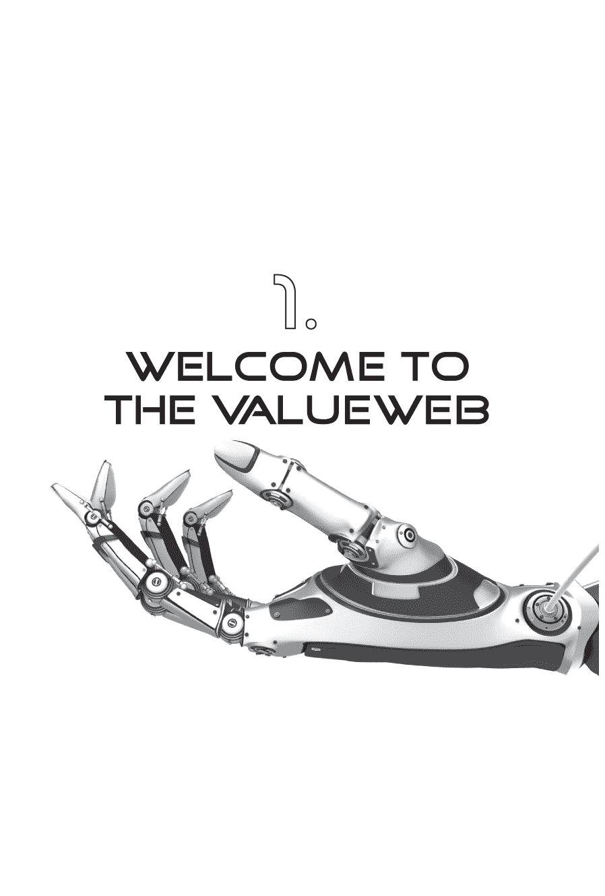
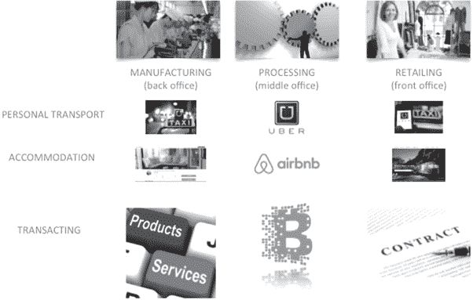

第一台蒸汽发动机于 1606 年由西班牙发明家 Jerónimo de Ayanz y Beaumont 获得专利，但直到两个世纪后的 1829 年，George Stephenson 将*火箭*发射出去，创造了第一个可行的铁路服务。铁路创造了美国的轨道，并推动了快速将货物从 A 运送到 B 的过程——但需要两个世纪才能到达那里。

铁路只是 19 世纪工业革命中几项创新之一，改变了生活。另一个重要的发明是电力。电力通常被归功于迈克尔·法拉第在 1820 年代的发明，尽管它的根源再次可以追溯到两个世纪前，当时*电*和*电力*这两个词首次出现在托马斯·布朗的《错谬流行理论》中，即 1646 年的作品中。

换句话说，上次的贸易革命用了 200 年才确立。这次新的革命——为我们的星球提供每个人的通信、点对点技术——迄今已经进行了大约 70 年。网络革命的根源始于计算机的发明。不同的人对于哪个发展得最早有不同的观点，但我相信是 ENIAC，这是二战时期的天气预报系统，创建于 1943 年，1946 年开始运行。

70 年后，我们已经把这样的机械放在口袋和钱包里，平均智能手机在计算机处理能力上比上世纪 NASA 火星宇宙飞船更为强大。但是数字化整个星球需要很长时间；我们从网络、访问和基础设施的基本构件开始，逐渐从信息和商业发展到关心和分享，最终是我今天看到的最激进的网络转型，专注于价值。

有趣的是，互联网迄今为止引入的最激进的变革之一是消除旅行和娱乐行业的中间环节，音乐和电影在分发和定价方面得到了革命性的改变。然而，在银行和支付方面，直到最近，唯一真正的创新是 PayPal。而 PayPal 实际上并不是银行和支付方面的创新，而只是现有银行和支付基础设施的一个额外层面。

但我们交换价值的网络转型，我称之为价值网络（ValueWeb），在银行和支付的各个方面都是变革性的。这就是为什么我们看到在金融科技领域有这么多投资，仅在过去几年里就有一千多家新创企业获得了超过 120 亿美元的投资。根据最新统计数据，金融科技投资每年翻一番，而 2015 年看起来将成为一个新的纪录年，因为我们看到来自风险投资基金、私募股权和其他来源的 200 亿美元被注入到这个市场中。

这就是为什么我们看到这么多新名字成为主流的原因，而三分之一的投资都流向了支付初创公司，因为现在是通过技术重新发明银行和支付的时机。Currency Cloud、Transferwise、TraxPay、Square、iZettle、Stripe、Dwolla、Klarna 等公司都在改变支付游戏规则。

我之前的书籍*《数字银行》*的主题是，我们在上个世纪为本地化网络中的纸质分发建立了我们的金融系统，现在必须重新思考这个系统，以适应全球化网络中的数据分发。这不仅仅是业务模式的演进，而是一个根本上不同的业务模式。

旧结构已经被旧系统巩固在原地，并且寻求通过一种手到手而不是点对点的价值交换系统转移商品和服务。如果你考虑我们旧的价值交换机制，我们需要银行和对手方银行以及像 Visa 和 SWIFT 这样的基础设施来实现货币交易。

然后，我们添加了 PayPal 来克服这给我们带来的挑战，因为网络朝着全球化方向发展。因此，我们不仅建立了一个四柱模型——发卡银行、收单银行、卡处理器和商家，而且在某些情况下，还建立了一个八柱模型。

这涉及到成本，因为每个交易对手都会收取费用。这在互联网时代行不通，并且不支持全球化的价值交换系统，这就是为什么开源网络创建了比特币。

加密货币，其中比特币是其中之一，是支持 ValueWeb 所需的表现形式。如果没有某种形式的数字货币，即加密货币，以及与此相配套的数字身份，我们就无法进行全球价值交换。这就是为什么加密货币对我们今天所看到的转型如此重要的原因。

现在大多数人一提到比特币就认为我们在进行一些不靠谱的离题讨论。那是因为比特币一直与网络犯罪活动联系在一起，并且它的名声被 Mt. Gox 和 Bitstamp 等可疑交易所弄得不好。然而，这只是早期实验中的早期问题，并且认为比特币作为一种货币是可疑的，因为 Mt. Gox 和 Bitstamp 的问题，有点像说英镑是不可靠的，因为 Northern Rock 和 Bradford＆Bingley 的崩溃。

然而，我与许多批评者的共识在于，比特币需要一些形式上的改变，因为不受治理的货币理念并不被认可。没有治理的货币就像没有警察的社会。这导致了恐怖分子资助、洗钱和毒品走私，正如暗网市场 Silk Road 的活动所揭示的那样。然而，就像互联网上商业的变革导致了通过 Napster 和 Pirate Bay 进行免费下载和侵犯版权，最终你会从混乱中看到秩序的出现。

在音乐和娱乐革命的混乱中，我们看到了 iTunes、Netflix 等公司创造了一个更有价值的世界，人们普遍感觉这是值得支付的。类似地，我们将看到加密货币世界的初生运动随着时间向主流采用发展。事实上，我们已经看到了这一点。USAA、纽约证券交易所和 BBVA 投资于像 Coinbase 这样的公司；J.P. 摩根、高盛、巴克莱等公司正在看看他们如何利用区块链进行证券结算（只需使用有色硬币）；与此同时，一些银行正在积极与 Ripple 合作，以替代他们的对手方交易引擎。

换句话说，通过区块链使用加密货币和智能合约已经在发生。但是，价值网络不仅仅是买卖实物和数字商品和服务。它还涉及创造和分享思想、观点、娱乐等。

价值网络由*点赞、分享、收藏*和*页面浏览量*来代表。我的博客每天大约有 2,000 次页面浏览量，而我的 Twitter 帐号有超过 11,000 个粉丝。这意味着我有一定的价值和影响力。这也是为什么公司想要在我的博客上投放广告，付费让我提及它们并请求转发。但我都选择忽略它们，因为这不是我的商业模式。

价值网络使像 PewDiePie、Slow Mo Guys 和转行的色情明星这样的人能够从他们的可爱、奇怪和有趣的 YouTube 网站中赚取数百万。这是因为今天任何人都可以成为声音。任何人都可以成为一个频道。任何人都可以成为社交媒体明星。

看看中国的 YY，卡拉 OK 歌手每月可以从他们歌曲的*喜欢*中赚取 1.5 万美元，你就会明白我的意思。在价值网络中，任何人都可以通过数字商品和服务创造价值，但也可以通过数字思想和观念创造价值。这就是区别，而货币不仅仅是货币，还有影响力和娱乐性。

但价值网络不仅仅是这样，因为它不仅仅是关于购买和销售商品或分享思想的货币；它关乎包容。看看 2015 年比尔和梅琳达·盖茨基金会的通讯。在通讯中，一个特定的部分谈到通过移动网络消除贫困：

“在未来的 15 年里，数字银行将让穷人更多地掌控他们的资产，并帮助他们改变生活。关键在于手机。已经有在具有适当监管框架的发展中国家，人们在手机上数字化存储资金，并使用手机进行购买，就像他们使用借记卡一样。到 2030 年，今天没有银行账户的 20 亿人将会使用手机存储资金并进行支付。到那时，移动支付服务提供商将提供完整的金融服务范围，从计息储蓄账户到信贷再到保险。”

手机对于贫困人群和财务排斥者来说确实具有改革性意义。它使无法远程通信的分散群体突然能够获取数字联系。非洲的牧羊人、渔民、羊毛农和牛羊养殖户现在通过手机的覆盖成为商人和企业家。一条手机短信可以支付羊毛、牛奶、肉类等商品，他们能够通过 Instagram、Facebook 和 Twitter 宣传他们的商品。这真的是一场革命，因为这意味着我们现在有 70 亿人彼此相连，能够通过价值网络(ValueWeb)交换数字和实物商品与服务、思想和观念。这也是为什么比尔·盖茨说像比特币这样的加密货币将对这种思维转变起到根本性作用的原因：

“比特币是一种令人兴奋的新技术。对于我们基金会的工作来说，我们正在使用数字货币来帮助贫困人口获得银行服务。我们没有专门使用比特币的两个原因。第一个原因是贫困人口不应该拥有其价值与他们本地货币相比波动很大的货币。第二个原因是如果支付时出现错误，则需要能够撤销支付，因此匿名性将不起作用。总体而言，通过我们的工作和比特币相关方法，金融交易将变得更加便宜。确保它不会帮助恐怖分子是所有新技术面临的挑战。”

总的来说，ValueWeb 是一种正在进行中的新一代互联网，由金融科技投资所证明，并旨在重新设计互联网时代的价值交换。它正在重新思考我们通过网络进行买卖的结构，同时数字化货币等。通过 ValueWeb 和廉价、移动技术的部署，地球上每个人现在都可以成为价值生态系统的一部分。这对我们的地球来说是一个根本性的转变，因为这意味着任何人、任何地方都可以成为商人；任何人、任何地方、任何时候都可以买卖任何东西；任何人、任何地方都可以成为一个声音、一个媒体明星、一个渠道；任何人、任何地方都可以通过分享和关心来货币化他们创造甚至思考的东西。

### 在 ValueWeb 上共享价值的方式

以前，我们有一个实物价值交换的世界，实物价值代币是卡片和现金；实物价值交换是商店、车库和商铺。价值的存储是银行。最后一个元素与其他元素不同，因为实物价值代币只能在实物价值交换中使用。当它们没有被使用时，有些人将它们放在床底下，但这不是一个安全的价值存储。因此，我们让政府创建了一个系统来监管价值存储，以确保它们安全、可靠，并能够保证不会失去价值代币。

然后互联网出现并改变了游戏规则，因为现在我们的价值代币是数字化的。价值代币是用于识别价值的价值单位。价值单位可以是神秘的事物，例如 Facebook 的*点赞*，Twitter 的*收藏*或 LinkedIn 的*分享*；也可以是虚拟和数字货币，例如魔兽世界的金币或糖果传奇的积分；还可以是从飞行里程到零售店卡的忠诚度代币；也可以是在移动网络上的空中时间等预付存储；也可以是比特币等加密货币；还可以是实体或数字形式的现实世界货币，从现金和支票到卡片和手机钱包。

如所示，存在着大量的价值代币，其中一些是封闭循环的，例如飞行里程和忠诚度卡，很难兑现；而一些是透明的、易于交易的，例如加密货币。价值的代币化就是货币的数字化。实际上，当行业谈论代币化时，我们应该将空中时间和加密货币视为现存价值代币万花筒的一部分。毕竟，这些只是数字价值代币，代表着可以交易的具有价值的东西。

[它们](https://example.org)可以随时随地在全球范围内的数字价值交换中使用。这些价值交换每天 24 小时全年无休，而且对于我选择投资或花费价值代币没有地理界限。同样，我们拥有各种各样的价值代币，不仅仅是货币。当然，现在的货币已经数字化，我们有数字美元、欧元和日元，但我们也有加密货币。加密货币改变了游戏规则，因为它们通过互联网的分散式结构在中心化控制之外运行。这是一个改变游戏规则的因素，也是我们看到银行和银行家投资比特币的原因。但互联网在数字化价值方面已经走得更远、更深入，因为我们使用的价值代币不再必然具有货币形式。

例如，正如前面提到的，我们通过零售商、航空公司等的忠诚计划生成价值代币，试图通过奖励积分锁定客户。事实上，最伟大的价值代币之一是移动网络上的通话时间。这在津巴布韦得到了很好的体现，因为该国的国家货币由于超级通胀而崩溃，因此只有南非兰特和美元被接受作为支付手段。这里的问题是，当你购买东西时，当地的零售商通常没有零钱。给他们 10 美元买 2 美元的物品，你会幸运地得到任何零钱。这个问题已经通过提供移动网络通话时间作为零钱来解决。

同样，我们在游戏中创造了自己的价值代币，魔兽世界金币就是最好的例子之一。当你花费几个月甚至几年玩游戏然后厌倦了，你会怎么做？如何将你宝贵的点数变现？当然是与其他玩家交易，然后开始另一个游戏。

更根本的是，我们的价值是通过被人们喜欢你的想法而产生的。PewDiePie 在 YouTube 上制作视频，甚至像我这样写博客和发推文的人，都创造了一个产生收入的价值链。PewDiePie 通过他的视频广告获得收入。事实上，中国最引人注目的社交网络是[YY.com](http://YY.com)，它将虚拟货币和流媒体视频推向了西方社交网络尚未达到的高度。在 YY 上，用户可以玩游戏，和朋友聊天，或者使用虚拟硬币进行社交交易，就像 Groupon 那样。但真正让 YY 脱颖而出的是它内置的系统，使网站用户能够获得真正的利润。顶级卡拉 OK 歌手每月从虚拟礼物中获得 2 万美元。YY 允许用户使用虚拟玫瑰作为门票，以获取他们最喜爱的艺术家和老师的直播内容。

它的运作方式如下。假设你有某种才能；也许你是一个精通技术的音乐家或过得去的卡拉 OK 歌手。要在 YY 上赚钱，你需要创建一个艺术家账户，上传一些你的歌曲，并希望发展一批粉丝。在建立了一个受人尊敬的粉丝群后，你甚至可以在网站上安排一场现场音乐会，而一朵“虚拟玫瑰”的价格，你的粉丝就可以观看表演并通过视频和聊天与其他观众互动。音乐会结束后，你就可以用辛苦赚来的虚拟玫瑰兑换成真钱。

所以我们有许多新形式的价值代币被用于许多新形式的价值交换，问题是：价值存储在哪里，你如何相信这些新形式的价值交换？

第一个部分，价值存储，是银行——但银行并未达到预期。大多数银行只会存放货币、货币和相关投资。你可能可以在银行存放黄金和白银，但不太可能能够存放《魔兽世界》的金币（除非你是 Fidor 银行，当然）。至于存放 YY *Roses*、QQ *股票*、Facebook *点赞*或*喜爱*的推文，目前还没有任何解决方案。这相当令人担忧，因为十年后，我们大部分现有的记忆可能已经变得无法阅读和丢失。当 Facebook 变成 Sharedome，然后变成 Gameground 时，你的所有历史记忆都将与后续的系统不兼容。

而且，今天出生的普通人有望活到一个世纪以上，今天的千禧一代在 2115 年会看到什么来记忆他们的生活？我们会生活在数字黑暗时代吗？互联网之父文特·瑟夫认为是的。正如瑟夫先生所说：“关键在于当你将这些比特从一个地方移到另一个地方时，你仍然知道如何解压缩它们以正确地解释不同的部分。”

这就是为什么你需要一个价值存储——一个银行——来保证可读性，而不是兼容性，从一代到下一代的生成。同样，它需要能够保证在一个世纪以上存在的公司，而这样的公司很少，除了银行之外。毕竟，大多数银行已经存在了三个多世纪，因为它们是有许可的，因此这是为数字化的记忆和价值代币提供保证的少数行业之一。

总之，我们把实体价值代币、交易和存储数字化了。

• 实物现金和卡变成了数字化的加密货币和价值代币

• 实体商店和零售商变成了数字化的领域和网站

• 实体银行网点结构变成了数字化的价值存储

下一个问题是：在这个数字化的世界中如何建立信任？这需要数字身份与数字价值代币、交易和存储相结合。

### 价值网络和生物识别区块链认证

现在我们需要专注于数字身份，因为没有安全的数字身份就无法有数字价值代币、交易和存储。而且身份有两种形式：你和你的设备。

你的身份体现在一个安全的身份认证中，这个认证越来越多地转移到生物识别认证上。事实上，我们现在有你的多重认证能力：你的声音、你的指纹、你的眼球、你的心跳等等。这些都是通过你的设备进行认证的能力。你的手机可以提供你的生物识别认证。很快，其他设备也会认证你。例如，加拿大皇家银行正在试用 Nymi，一种用于认证心跳的手环，英国的 Halifax 银行也是如此。

Nymi 手环记录客户的心跳，然后与智能手机或其他设备同步。 之后，只需要通过蓝牙连接到手环就可以登录银行应用程序，因为传感器会检测到已经认证的人仍在佩戴手环。

其他方法也在改进生物识别技术的身份验证。 Facebook 一直在开发 DeepFace，一项面部识别系统，可以查看两张照片，不受光线或角度影响，识别出照片中的人物。 2014 年，他们的准确率达到 97.25％，超过了人脑的 97.53％的准确率。 到现在，他们甚至可能已经超过这个水平。

因此，我们正在添加越来越多设备，搭载着越来越多的生物识别技术，以确保人类可以轻松地与设备互动，而无需使用 PIN 码，密码或令牌。 根据 Acuity Market Intelligence 的数据，到 2020 年，每部智能手机，平板电脑和可穿戴设备都将搭载嵌入式生物识别传感器；市场研究公司 Goode Intelligence 表示，一半的移动商务和十分之一的实体店支付将通过生物识别进行身份验证。

但这就引发了一个问题：谁会验证正在使用您的设备进行身份验证？ 更重要的是：当您的设备开始相互交易时，谁会验证您的设备？ 当您的冰箱订购杂货时； 您的电视订购娱乐节目时； 您的汽车订购燃料时； 谁能验证这是您的冰箱，电视和汽车在进行订购，而您在这个过程中扮演了什么角色？

所有这些都是关键问题，答案是：区块链。

我们已经谈论过区块链作为交易技术，但更重要的是，它正在成为一种身份验证技术，这要归功于其智能合约的功能。

对于那些不确定区块链全部潜力的人，一个简单的解释是，区块链是比特币协议创建的分类帐系统。这是一个分类帐，每个人都可以在公共论坛上看到交易的交换，因为比特币的每一笔交易都记录在区块链上的公共领域。并非该交易的详细信息，而是发生了一笔交易。你永远无法撤销或抹除该交易的发生，以及其时间和地点。换句话说，你有一笔不可撤销的交易记录。

那不可撤销的交易记录可能是购买或出售某物，也可能是所有权转移或合同记录。在认证的背景下，这个领域最为重要，因为将来设备购买将记录在区块链上，任何其他商品或服务的购买也将如此。

这意味着区块链可能成为全球所有权转移的全球记录机制；如果你愿意的话，它也可以成为全球发票系统。对我来说，关键在于随着时间的推移，区块链可能成为我们记录所有交换价值的全球系统。

现在，假设这种情况发生了，在机器对机器商务互联网的视角下，区块链成为我们认证机器对机器交易的基本方法。当我的冰箱、电视或汽车订购东西时，没有生物识别，因此我的这些设备的区块链注册成为认证方式。

换句话说，银行看到了由*克里斯·斯金纳的冰箱*发起的一笔购买£35.12 的杂货的付款请求。他们怎么知道这是*克里斯·斯金纳的冰箱*？只是在区块链上自动检查了序列号 XY12-FFDC-90LT-DPP1（我的冰箱序列号）的最后一次转移。是的，根据那条记录，XY12-FFDC-90LT-DPP1 的最后一次转移是由克里斯·斯金纳在 2014 年 12 月 1 日购买的，自那以后就没有转移了，所以银行批准了付款。

所以我在这个过程中已经没有任何角色了，除了授权交易。然后，当我这样做时，银行会检查我是否在呼吸，使用我的心跳进行身份验证。

这与我们今天的世界有着天壤之别，但这将在几年内与我们同在——所以我们最好做好准备。

### 金钱的起源是我们 DNA 的一部分。

在大多数科幻电影中，都没有钱。好莱坞对未来的展望消除了对现金的需求，我之前曾在博客中谈到过吉恩·罗登伯里关于“星际迷航：金钱是一件可怕的东西”的观点。他的想法是随着我们探索太空，随着我们向冥王星发射火箭，金钱将消失，他的愿景越来越近了。然而，金钱还没有从社会消失。它只是从物理形式变成了数字结构。然而，新的数字货币结构并不仅仅是加密货币。

加密货币可能是机器之间的价值交换机制，但是我们新的钱包是机器内部的芯片。随着我们进入 Web 3.0，我们进入了机器对机器的商业领域——这只能在一个整洁有序的价值体系中进行交易。

我对这种新价值体系的愿景是，每台机器，或者你更愿意称之为商业启用的设备，都将内置智能。一枚芯片。这枚芯片内部将被指定一个所有者。在大多数情况下，所有者将是你和我，而我们拥有的这些东西是我们公认的数字身份结构的一部分。

所以，我有很多东西在共享的互联网账本上被指定为我的。我的车，冰箱，电视，前门，加热系统，几块手表，鞋子和夹克都被注册为我的。所有这些东西内部都有芯片，并且这些芯片赋予它们智能。我的加热系统可以从我的手表上控制；我的电视订购我的娱乐；我的冰箱订购定期的杂货；我的车会自动驶向加油站，并根据需要加油。

为了实现这一点，所有这些设备都已被记录为我的。它们通过我的数字身份与我联系在一起，并且我的数字身份被记录在物联网的一个可信共享账本上。如果我的车加油太频繁或者我的冰箱异常地订购了价值超过 1000 美元的食品，我会收到需要我的生物特征批准的警报。

所有这些东西都通过空气传输，通过一个可信的交换共享账本。在我这里，它们被记录在某种英镑链上；美国人在美元链上操作；而中国人在人民币链上操作。

这些数字货币链不仅进行价值交换，还管理身份和所有权。这样，你就能通过以太网立即和隐形地实现价值交换的科幻愿景。

之所以这是价值互联网和 Web 3.0，物联网的可能结果，是因为我们正在朝着贸易的革命以及金融价值交换的革命迈进。

这可以从早期智人形式以及我们如何通过每一代贸易而适应看出来。在他出色的著作《智人》中，尤瓦尔·诺亚·哈拉瑞教授提供了人类简史。他解释了我们是如何创造了一个虚构的世界，以使人类能够登上食物链的顶端。

公司、货币、政府、宗教、法律以及构建我们世界的所有事物都是人类的虚构创造物，它们使我们征服了世界。在这里解释这个复杂的概念有点困难，但要点是，没有动物有公司、货币、政府或法律体系。大多数动物都是作为由阿尔法雄性或女王母系领导的等级制度的一部分而运作的。人类创造了社会结构和贸易与交流的关系，使数百、数千甚至数百万人能够共同生活。相比之下，大多数动物只有几十个生物组成的部落。我们有数十万人的部落，组织成城市，所有人都在一起工作，这要归功于我们形式化的贸易结构。

在书中，哈拉瑞追溯了智人的历史超过 20 万年，并指出 7 万年前，我们开始从非洲迁徙穿越亚洲，然后在 45000 年前，来到澳大利亚，更近一步（16000 年前）来到美洲。我们扩张的关键是语言和共享的神话，这使我们相信了神、恶魔和祭司，并使我们能够从游牧民转变为渔民、农民，在此过程中进行贸易和价值交换。

“虽然我们无法了解尼安德特人的思维方式，但我们有间接证据表明，他们的认知能力与他们的智人竞争对手相比存在局限性。考古学家在欧洲核心地带发掘的 3 万年前的智人遗址偶尔会发现来自地中海和大西洋沿岸的海贝壳。很可能，这些贝壳是通过不同智人部落之间的远距离贸易传到了大陆内地。尼安德特人遗址没有任何这种贸易的证据。每个群体都使用当地材料制造自己的工具...

“事实上，除了智人以外，没有任何其他动物进行贸易，而我们有详细证据的所有智人贸易网络都是基于虚构的。贸易在没有信任的情况下是无法存在的，而且很难相信陌生人。今天的全球贸易网络建立在我们对虚构实体如美元、联邦储备银行以及公司的标志性商标的信任之上。当一个部落社会中的两个陌生人想要进行交易时，他们经常通过诉诸于共同的神、神话祖先或图腾动物来建立信任。如果信奉这些虚构概念的古代智人进行贸易用贝壳，那么他们也可能交换信息，从而创建比供应尼安德特人和其他古代人类的知识网络更加密集和广泛的网络。”

哈拉瑞的书非常吸引人，而这段摘录部分解释了为什么智人是地球上唯一的人种。20 万年前，还有许多其他人种，包括直立人、尼安德特人、罗得西亚人、蔡长人、智人和弗洛勒斯人。根据哈拉瑞和其他人的分析，正是因为我们可以基于共享的虚构进行贸易系统，通过语言、信息和有用或美丽的东西交换价值——贝壳、黑曜石、石头、燧石——我们才成为最聪明的物种，并因此统治了地球。

相比之下，大多数人类变得有感知能力，或者像哈拉瑞所称的那样，经历了认知革命，我们开始搜索、探索，然后，几年后，开始农耕和定居。仅仅在不到一万年前，大多数人类都是狩猎采集的游牧民族。我们会在季节更迭时从一个地区移动到另一个地区，探索和收集食物。有时我们会挨饿，因为我们没有种植农作物的手段。最后一次冰河时期之后情况发生了变化，一些科学家认为那次冰河时期创造了植物的年度生长。因此，我们可以在田地里播种谷物并储存食物。

农耕工作得很好，使人类能够生产全年所需的食物，因此我们可以建立定居点。然后我们有了太多的食物和产品。因此，我们不得不创造另一种形式的价值交换，作为智人，我们创造了这种新的共享虚构——货币。

各种关于货币的故事层出不穷，但最早的提及可以追溯到 12,000 多年前，在安东尼亚，古代部落用黑曜石交换存储价值。这代表着从基本商品生产到商品和服务交易的转变，随着文明和社会的发展，我们看到了货币和价值储存使用的进展。然而，我们对这些价值储存的进展正在变得越来越快，随着我们的技术发展。

例如，安东尼亚人不仅交易石头，还交易其他形式的价值，从牛到羊。换句话说，这更像是一种以物易物而不是货币本身的形式。然而，七千年的发展导致了贸易和商业的革命。事实上，每当我们在技术、贸易和商业方面取得进步时，我们就会在金融领域出现革命。

在公元前 3,000 年，古代苏美尔的祭司们发明了货币，彻底改变了贸易和交换。这种最初形式的货币是一种叫作“shekel”的硬币，祭司们用它与农民交换他们多余的农产品。这发生的原因是古苏美尔人是最早开始耕种和创造有序食品生产体系的文明之一。随着农业在文明社区中变得普遍，人类经历了贸易和商业的革命。

农业创造了货币——用贵金属如黄金制成的硬币。这在一个时代内都很有效，但是在需要跨越距离时却证明是困难的。携带一袋沉重的金币在可能会遇到强盗或小偷的情况下是不理想的，或者是当你的马只能承受那么多重量时。因此，中国人在 740 年前后发明了纸币。这种货币的价值是可预测的——不像黄金硬币，需要称重和测量。纸币由政府——唐朝发行和支持，并且被证明是一种更可靠的贸易机制。

因此，我们从以物易物，然后到农耕，再到用硬币作为可信价值储存，再到现金用于跨越距离的贸易。

这个系统运行良好，直到贸易和商业的下一个重大变化出现：工业革命。随着从海外采购商品并跨越国界和长距离贸易的企业的出现，需要一种新的货币形式。因此，传统的货币太重，无法跨越这样的距离，考虑到它们是由黄金制成的，政府开始许可机构，银行，代表他们进行贸易。新的政府许可机构因此可以发行纸币——支票或银行票据——这些纸币可以与金币一样受信任。这是一个关键的转变——从硬币到纸币——并且在 18 世纪和 19 世纪，随着经济的工业化迅速发展，这使得全球贸易和商业迅速扩张。

然而，当工人们从工厂转移到办公室时，情况就没那么顺利了。在 1950 年代，美国引领了办公室工作的革命，专业娱乐成为*时尚*。问题在于，当你正在招待客户时，如果你必须写支票，那就会变得非常麻烦。写支票会干扰客户的参与——你必须把目光从对话的焦点上移开——因此 Frank McNamara 发明了信用卡。

Frank 曾是汉密尔顿信贷公司的高管，他面临一个问题。他的金融公司在与未收债务作斗争，而 Frank 需要一种赚更多钱的方式。麦克纳马拉想出了一个主意，就是把信用卡的概念带到餐饮业中。那时候，信用卡主要只在百货商店使用。他的创新之处在于在餐厅使用信用卡，然后在月度付款中加入利息。这样，金融公司就能从每张发行的卡中获利。

他成功说服了曼哈顿下城的许多餐馆注册这张卡，向顾客提供每次购买 10％的折扣。许多餐馆和商店注册了，因为没有费用或收费，这样就更容易购买餐点而不用担心现金问题。这导致了 1950 年发行了 Diner's Club，从而诞生了信用卡的新行业。

这使我们几乎跟上了时代。正如我们所见，12000 年来，我们经历了以下进程：

• 游牧社会使用货物交换

• 农业社会使用现金

• 工业社会使用支票

• 办公室社会使用卡片

但现在我们生活在一个网络化的社会，一个全球连接的世界。这需要一种新形式的货币，有些人立刻会指向比特币或区块链。这是相关的，但只是答案的一部分。就像信用卡需要 Visa 和 MasterCard 才能在全球范围内成功一样，就像支票和现金需要受到信任的政府许可和银行的支持一样，我们需要一种互联网时代的价值交换机制，它是值得信任的，即时的，并且可以在时间和空间上运作，以支持芯片化经济。

在芯片化经济中，任何东西都可以在任何地方、任何时间交换价值。所有物体很快都将内置智能，内置芯片，并且需要一种传输价值和交换和交易的方法。因此，这个互联网时代的系统将基于芯片。芯片化经济意味着物联网可以发挥作用。

物联网构想了一个不太遥远的未来的宏伟愿景，其中一切都与其他一切进行通信。我们会有像纳米点那么小的芯片，嵌入到每一块砖头、路面板、轮胎、墙壁、天花板……你想得到的东西都有。我们在汽车发动机、视觉娱乐系统、可穿戴设备上有更智能的芯片，从戒指到项链再到包包再到鞋子。一切都在与一切进行通信，我们的设备都通过区块链与我们连接。

结果是，我对没有人为任何东西付费的未来愿景成为现实。我开车去了大城市并停车。我的车告诉计量系统它是我的车，它停在这里直到我回来。当我回来时，它问系统欠多少钱，并支付。我什么也没做。

我的车然后把我送到加油站——我不再开车了，因为它是自动驾驶的——然后它向加油站的机器人要求 30 美元的液化石油气。机器人加油系统提供服务，我只是坐在那里，工作着，享受着周围的娱乐和世界。车开走了，所有的交易都在背景中无缝进行。

我让我的特斯拉带我去市区的一家体面的酒吧——我以前没来过这个城镇——它把我带到了乔 99 号。乔——或者吧台后面的那个人——给了我一大杯威士忌和百威啤酒。这是我平时喜欢的饮品，我的鞋子刚好告诉他的库存管理系统我会想要这个。我感到我的鞋子有些震动，确认了这将被订购，于是就放任它了。为了要一杯金汤力水，摇一下我的左脚实在太麻烦了。

喝了三杯百威啤酒和威士忌之后，我又跳进了车里，准备去赌场。车三次问我是否真的想这么做——它知道上次发生了什么——我只是说，“是”。我很冷静，有些醉了，这是我非常清醒的一部分，因为我应该清醒地驾驶自动驾驶汽车。（为什么还存在这样的法律，我不知道。）

所以车把我送到了凯撒的小屋，离宫殿有五步之遥，我开始打一些二十一点。我的鞋再次震动，因为我在前五分钟就输掉了$2,000，我的这个月的赌博预算已经用完了。但是现在才 6 月 2 号，天啊。我跺了跺脚，预算被解除了，同时我的储蓄账户实时转入了$10,000 的额外存款。

到了晚上结束时，我的储蓄已经用完了，银行给了我$15,000 的贷款。当我点击鞋跟说：“没有比家更舒适的地方”时，我讨厌这种感觉。毕竟，这就是触发我生物识别检查的信号，以确保真的是我说我想要额外的信用额度。没有人注意到心跳检查和我手指触摸眼镜侧面的动作。

啊，夜晚过得很愉快，没有看到任何付款或身份验证。只是通过轻触眉毛来进行的无线信用和借记。

过去十年里，世界发生了很大变化。我记得 2010 年，我曾经在车里放很多零钱来支付停车费，还因为不断停在收费站刷信用卡而感到沮丧。到了 2015 年，情况已经极大改善。现在我只需要使用 NFC 支付、预付费应用程序和一次性密码。我再也不需要为找零烦恼了。

你买了一个冰箱，一辆汽车，一座房子，一部智能手机，一个可穿戴设备，一个什么的。你买的所有东西都有清晰的序列号识别，同时内部装有芯片，使它们能够在网络上无线交易。购买时，你的设备会记录为使用你的数字身份令牌（可能是生物识别或类似的东西）。这笔交易的记录发生在区块链上。

现在，你有多个设备代表你进行交易。你的冰箱正在从超市订购食品；你的车在自驾公路时自动加油；你的房子重新订购了机器人吸尘器和其他清洁设备所需的一切；等等。每笔交易都是围绕你的钱包的微型购买，但不涉及你的认证。认证是你的设备的认证。如果发生大额交易，或者可能只是像无接触支付一样每二十笔交易就要进行一次验证，那么你需要同意这是你的设备代表你下单，通过提供触摸 ID 或类似的方式。所有这些都是通过你银行的开放区块链账本廉价、轻松地、实时地交易和记录。

这提供的情景正是我一直在提到的，几年前由基因·罗登贝里发明的，当他想出《星际迷航》的创意时。现在，《星际迷航》有很多关于未来的预言成真了，从当时的通讯器就是摩托罗拉翻盖手机的前身，到手持式身体扫描仪。其中一个预测是我们将不需要货币。

#### 你有没有见过《星际迷航》里有人付钱买东西吗？

未来你不需要货币的原因是，你所进行的所有交易都是通过你的物联网无线进行的。你走进商店或购物中心，你所有的设备和身份都在传达你的位置和意图。因此，你从不支付任何费用。你只需眨眼或挥动手表就能授权。

所以，我们现在已经经历了以下进展：

• 游牧社会以货物交换

• 农业社会以现金

• 工业社会以支票

• 办公社会以卡片

• 网络社会以芯片

由区块链支持的芯片经济可以为任何人在任何地方、任何时间交易金融、商品和服务。这就是为什么我把区块链称为金融界的优步，因为它正在创建一个全球连接的值交易市场。

优步是一个将买家（需要搭车的人）与卖家（司机）连接起来的市场。区块链通过连接需要进行交易的人（买家）与拥有他们想要的东西的人（卖家）通过一个受信任的第三方（区块链）来进行相同的操作，这个第三方是分散的并且网络化的。

由于货币是社区用来跨越时空交易债务的技术，区块链可以用来为共享经济创建共享账本。我们之所以有一个金融体系，是因为大多数价值交换是基于缺乏信任的，所以你需要一个中央机构来提供这种信任。中央机构提供了三个关键要素，使现金、支票或卡的价值交换得以发生：

• 它**验证**价值代币是真实的，而不是伪造的。

• 它**保护**了一旦您接受代币交换货物和服务，就不可撤销。

• 它**保存**了交易的细节，以防有遗漏或谎言。

区块链的关键之处在于它可以提供必要的验证和保障，因为事物不可能花费两次，通过交易的公共历史来保护交换。现在金融行业的许多人都认为，我们正在开发一种真正的基于某种形式的区块链开发的芯片经济系统，它允许我们几乎免费地实时交换价值。区块链创造了一个全球化的值交换市场，这个市场是值得信赖的、安全的和不可撤销的。
