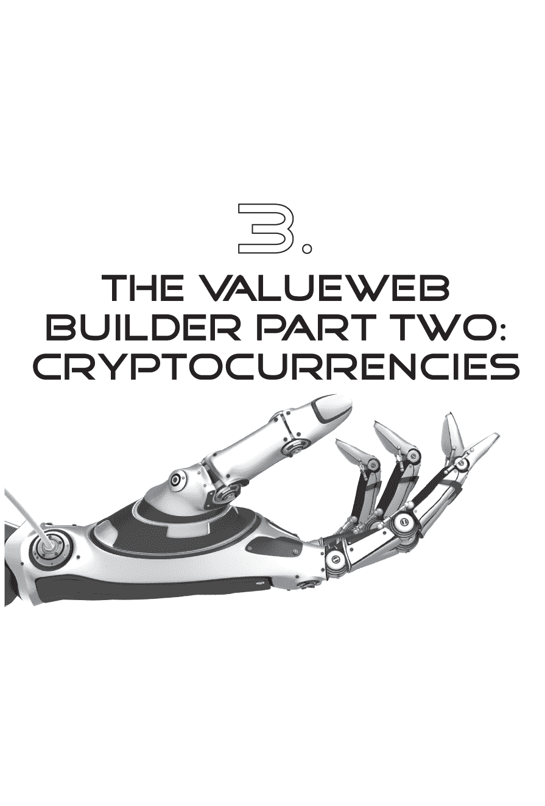
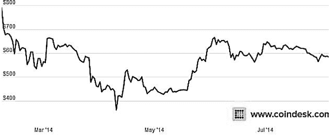
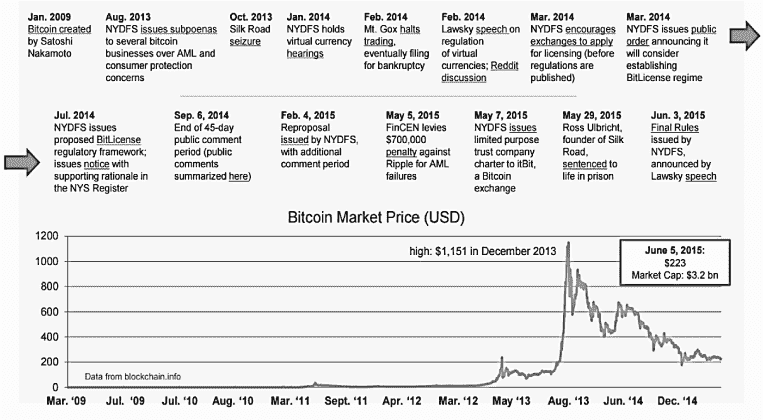
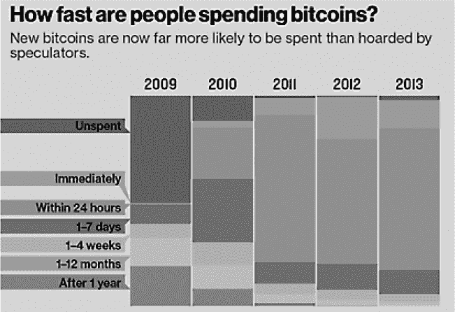
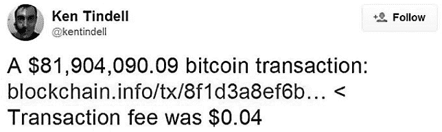

一旦我们建立起一个系统，我们可以通过电子方式连接来进行价值的人对人、对等（P2P）转移时，事情就变得有趣起来了。正如在上一章中讨论的那样，我们不仅能够全球范围内实时传递价值，而且我们能够把每个人都纳入到这个网络中，从非洲平原上的农民到华尔街办公室的交易员。每部移动电话都可以成为一个购买点和销售点。这意味着非洲的农民现在可以实时地向华尔街的交易员出售牛奶、肉类和皮革，并立即交换信息。

这就是为什么价值网络是如此根本性的改变，因为我们现在没有了由于成本而造成的距离或排斥的障碍。一切都是全球的、实时的，几乎是免费的。然后问题出现了，旧的货币系统不是全球的、实时的，几乎是免费的。它是缓慢而笨拙的。那是因为旧系统是建立在基于建筑和人员的本地网络上，用于纸张的物理分发。新系统正在建立在基于软件和服务器的全球化网络上，用于数据的数字分发。这是一个非常不同的系统。

在这个新系统中，移动资金不可能需要数天时间，并涉及通过 20 世纪系统联网的交易对手方。它需要立即转移价值，并且需要一个为实时资金流动而建立的交易对手系统。

这使我们陷入了对货币的关键讨论。什么是货币？

一些人将货币定义为债务的追踪。一种交换的记录。一种合同的证明。一种价值存储。

金钱实际上是所有这些东西，并且已被确定为社会的核心部分，正如前文所讨论的那样。今天有趣的是，实时价值交换不仅仅是货币交换。它是我们社交网络中的*赞*、*分享*和*收藏*；它是我们零售网络中的空中里程、忠诚积分和虚拟优惠券；它是我们商业网络中的交换、交易和协商。所有这些网络都在转变成一种新的价值交换形式，因为它们移向互联网。因此，这种新形式的交换需要一种新形式的货币。价值网络需要它自己的货币。一种数字货币。一种几乎可以立即从基里马尼亚罗移动到帝国大厦的货币，而且几乎没有任何费用。

### 数字货币——一个热门的辩论话题

价值网络基于两种关键技术：移动技术，使每个人都能够实时交换价值，以及数字货币，为交换提供价值存储。数字货币目前是一个很大的争议领域，因为有数百种货币正在开发中。你可能听说过其中一些：Ripple、Litecoin、Ethereum、Dash、Dogecoin、BanxShares、Bytecoin、Stellar、BitShares、MaidSafeCoin、Nxt、Peercoin、Namecoin、Monero……名单很长，我们无法在这里讨论所有的货币。简单地说，大多数是比特币的变种。

由于其广泛的媒体报道（无论好坏），比特币是最著名的数字货币。在本章中，我们将讨论比特币，因为比特币及其变体为在线实时交换价值提供了一种方式，几乎免费。这是我们首次实现在线实时交换价值的最接近方式。换句话说，这是价值网络的另一半。移动提供了第一半，因此我们可以实时点对点连接整个星球，而数字货币提供了第二半，以便我们可以实时交换星球认为具有价值的东西。这是价值网络的基础，因为价值网络不能没有廉价或几乎免费的实时全球交换系统而存在。因此，为了本书的目的，我们将把比特币称为数字货币。

但比特币本身是什么呢？实际上，它是很多东西。它是一种货币、一种协议、一种技术、一个生态系统、一个交易系统、一个合同系统等等。它也非常令人困惑，所以让我们从头开始，并从那里开始。

对比特币的快速概述

**比特币生产的解释**

新比特币是由网络节点生成的，每当解决了特定的数学问题，就会创建这些网络节点。试图解决这些数学问题的人被称为矿工，每次成功解决问题时，他们就会创建一个新比特币。这个数学挑战难以解决，以至于有些公司专门从事这项工作，他们的数据中心运行着成千上万台专注于比特币挖矿的计算机。他们这样做的原因是，每次创建一个比特币时，解决数学问题的公司或个人会收到 25 个比特币，截至 2015 年 8 月，每个比特币价值 250 美元。因此，比特币矿工这样做是为了赚取虚拟货币奖励。

比特币是世界上第一个真正去中心化的在线货币。比起中央银行发行货币，比特币是由任何拥有计算机或智能手机的人使用加密算法发行的。换句话说，每个硬币都嵌入了极为复杂的数学问题，并且交易经过了密码学验证。这使得比特币成为商品和法定货币的组合。比特币的创造可以追溯到 2008 年，当时中本聪发表了一篇关于互联网时代点对点价值交换的白皮书。

这种货币的倡导者是自由主义者，他们认为价值互联网应该允许在没有政府干预的情况下运作。他们声称，货币并不源自政府或以物易物系统，而纯粹是债务的记录。我完全不同意这种观点。他们对货币的定义涵盖了从珠子和贝壳到数字代币的所有价值交换形式。这不是我的货币定义，在银行业来说，这是一个重要的区别。

我对货币的定义是现金，或者更确切地说，中央银行对货币的定义，即 M0。M0 是 “衡量货币供应量的一种指标，它结合了央行持有的任何流动或现金资产以及在经济中流通的实物货币数量（也称为狭义货币）”。

比特币的快速概述

**有多少比特币？**

比特币的产量被限制在 2100 万个，尽管比特币的交易量远远超过这个数字。比特币网络的前四年创造了 1050 万个比特币，而且每四年减半。因此，从 2014 年到 2018 年创造了 525 万个比特币，然后从 2018 年到 2022 年创造了 262.5 万个。这是为了确保稀缺性，因为比特币的总产量将永远限制在 2100 万个。

到那时，您将能够购买比特币的一小部分，使得通过该货币可以获得数以万亿计的价值。例如，每个比特币可以分成多达一百万个部分，其中价值最小的单位是 0.00000001 比特币。同样，创建的最后 1%的比特币节点将需要 128 年才能完成，大约在 2032 年产生第 2079 万号比特币，而第 2100 万号比特币将在 2140 年产生！

这是纸币和硬币。它是法定货币，因为有政府支持而受到信任。其他任何东西都是有价值的商品。黄金、石油、天然气、里程、珠子、贝壳和比特币都是价值储存物，但它们不是货币。货币是流通于世界各个经济体中的政府支持货币。如果没有这个结构，世界就不会像过去 5000 年那样运作。

货币的第一次出现，以国家认可的交换形式而言，可以追溯到古苏美尔时代，当时祭司们发现以物易物系统已经崩溃。农民们生产出大量的商品，有些农民现在有剩余物品，无法交换或出售他们的产品。结果，农民之间经常发生争斗，争夺他们的商品和产品。

祭司们理解了问题并发明了货币。他们实际上创建了一种名为舍克尔的国家货币（与今天的舍克尔无关），农民可以用它来兑现他们多余或不需要的农作物，然后这些舍克尔可以与代表伊南娜女神的寺庙中的女人进行交易。

换句话说，货币的发明与会计（第二古老的职业）和卖淫（最古老的职业）同时发生。所以那就是货币—硬币、纸币和现金。在此之前的所有其他价值交换形式—农作物、珠子和贝壳—都是被认可具有价值的商品，并且是价值储存物，但这些东西并不是货币。

这是事实记录的问题，也是我断言货币是由政府发明来控制社会的原因。

*货币由政府控制，以确保社会和经济顺利运行。古典自由主义者认为比特币代表了没有政府的货币。*

这里有一个根本性的区别，也是我将比特币称为可交易商品而不是货币的原因。

现在，还有许多其他形式的价值交换和债务记录，比如一张借据，但一张借据不是货币。它不是一个可以自由交易的货币，可以用来交换国家认可的商品和服务。它纯粹是一种价值记录，是涉及交易对手之间的信任合同。

比特币和其他数字和加密货币听起来像是货币，但一旦这些货币进出交易，它们就会受到政府的审查和干预，正如罗斯·乌尔布赖特和丝绸之路网站的案例所证明的那样（请参阅本节末尾的案例研究）。这些货币在暗网上运作，超出了政府控制的范围，但最终被美国政府追踪并关闭了这种非法在线活动。

这就是为什么你不能拥有一个非政府组织的价值社区——无论古典自由主义者是否喜欢——正如我们在本章中将讨论的那样。

银行处理货币作为交换机制，然后提供安全机制来存储这些货币的价值，以及相关商品和其他可交易工具。后者是建立在货币之上的，可以通过世界货币体系进行兑换。这就是银行提供兑换机制的地方。这里的重点是，逐渐地，新的数字货币可能会通过取代银行作为可信第三方的角色来规避这种兑换机制。

所以关键问题是，数字货币，比如比特币，能否成为一种数字交换机制以及数字价值存储。

### 什么是比特币？

如果你在 2011 年夏天投资了 1000 美元的比特币，到 2013 年 12 月，你将拥有大约 50 万美元。到 2015 年 8 月，你的比特币持有价值将下跌到 125,000 美元。那么，比特币是什么？

首先，有几个与货币相关的方面。 当神秘的中本聪 —— 一个从未被见过或被确认身份的人 —— 在 2008 年 11 月在密码学邮件列表上发布了一篇名为《比特币：一种点对点的电子现金系统》的论文时，它第一次被曝光。

这篇论文的第一行开始写道：“一种纯粹的点对点的电子现金系统将允许在线支付直接从一方发送到另一方，而无需通过金融机构。” 换句话说，中本聪发明了一种适用于互联网时代的点对点支付系统，并且，事实证明，他解决了其他人都未能解决的一个难题：双重计数。 这是通过一个称为区块链的互联网控制的共享账本系统来实现的。我们将在下一章深入讨论区块链，但需要在这里提到它，因为它是我们讨论比特币的一部分。

自 2008 年比特币出现以来，它已经发展成为一种数字货币和一种技术。（对于比特币这个货币，我们使用小写字母“b”，而当我们谈论比特币这项技术时，我们使用大写字母“B”。）

那么，让我们聚焦于比特币，这种数字货币。比特币声称自己是将主导全球贸易的下一代货币。一些人声称它将取代国家货币。还有人声称它将取代 Visa、MasterCard、PayPal 甚至银行系统。我相信它是维基泄密一代的维基币。一个 Occupy 运动的一代，占据了 99%，并对美国政治当局在 2010 年 12 月试图通过挤压资金来源来关闭维基解密时的 Visa、MasterCard 和 PayPal 的政治操纵感到恶心。

在朱利安·阿桑奇的网站泄露了美国政府来源的 compromising 视频和文件后，美国政府要求美国公司停止向该服务提供资金。结果，Visa、MasterCard 和 PayPal 都停止了向维基解密服务的资金流动。这导致了对其服务的分布式拒绝服务（DDoS）攻击，使 Visa 和 MasterCard 的网站瘫痪，巧合的是，这也是比特币活动首次激增的时候。

比特币简介

**使用比特币**

在你购买任何硬币之前，你必须创建一个存储它们的钱包。你可以通过安装比特币客户端，即支持该货币的软件，或使用在线钱包来做到这一点，这些数据存储在云中。后者更容易设置，但你将把你的钱托付给第三方。一旦你有了一个钱包，你也会有一个类似于这样的地址：

**1GVA4cyUc7wXCu1nsN6TahVkMXE4vC1nGe.**

这是安全的分发方式，人们会用它来向你发送资金。你可以把它想象成是分享你的账号和排序代码。然后，你可以从交易所购买比特币。大多数交易所都允许你只需输入你想购买多少比特币和你想将它们发送到的地址，然后通过从你的银行账户转账来支付它们。

比特币是这种运动的一部分，是改变我们在互联网时代看待价值交换方式的重要力量。长期来看，可能不会是比特币成为首选的数字货币，因为我们今天看到了许多更多的数字货币。这些包括另类币、莱特币、狗狗币、XRP，甚至像厄瓜多尔数字货币这样的政府支持的数字货币。

换句话说，比特币，或类似的东西，是对我们思考货币和交易价值方式的根本性改变。挑战在于，当局——监管机构和政府部门——意识到这种变革正在发生。有趣的是，正如我们将在下一节关于比特币技术中看到的，这种变革已经发生。

挑战在于，政府现在需要找到其他方式征税，而不是依靠收入，银行需要找到其他可以存储的东西，而不仅仅是货币。银行应该在存储比特币和其他数字货币，以使它们合法化。比特币的问题在于它非常技术化。

这里有一些统计数据。比特币于 2009 年推出。2013 年，由于中国采用了该货币，并且美国表示它可能具有某些合法性，它的价值大幅上涨。到 2013 年底，据称大约有 20 万个电子邮件地址与比特币账户相关联，但超过一半的比特币与仅仅一千个电子邮件账户相关联。然后，该货币陷入了麻烦，因为最大的交易所 Mt. Gox 倒闭了。

关于比特币的快速概述

**什么是比特币区块链？**

比特币交易记录在一个名为区块链的公共分类账系统上。区块链是一个共享的分类账系统，这意味着我们所有的比特币钱包都可以公开查看。没有人知道是谁进行了交易，但有一个电子共享分类账的事实确保了交易不能重复进行。这就是为什么区块链至关重要的原因，因为整个比特币网络都依赖于此来建立信任。所有确认的交易都包含在区块链中。这样，比特币钱包可以计算其可支出余额，并可以进行验证，以确保他们花费的比特币实际上是由花费者拥有的。区块链的完整性和时间顺序是通过密码学强制执行的，这就是为什么这项技术正在传播。

### **MT. GOX 熔断**

比特币已经从货币未来的主导光明变成了一个漏洞百出、不稳定的基础设施。这是 Mt. Gox 熔断的结果，以及其他交易所的情况。换句话说，比特币的本质——区块链和算法——都是完全正常的，并且是合理的。问题在于为比特币交易建立的基础设施是一个完全的荒野，正如 Mt. Gox 的崩溃和随之而来的问题所充分证明的那样。

Mt. Gox 是一家位于日本东京的比特币交易所。它于 2010 年 7 月推出，在三年内成为交易比特币货币的最大交易所，处理了十次中的七次比特币交易。2014 年 2 月，Mt. Gox 公司暂停交易并关闭了其网站。不久之后，该公司申请了一种称为*民事再生*或“民事重整”的债权人破产保护形式。就像美国的第十一章那样，这意味着公司被给予时间来解决其问题，本案中是让法院寻找买家的时间。

2014 年 4 月，该公司开始清算程序，宣布大约 85 万个比特币属于客户丢失并且可能被盗，当时价值超过 4.5 亿美元。迄今为止，仅有 20 万比特币被找回，其余的消失，并且有各种理论认为它们是被盗或由于欺诈和管理不善而丢失的。

特别是，讨论了 Willy Bot。它之所以被称为 Willy Bot，是因为在 2013 年 11 月，随着价格从 200 美元上升到 1200 美元，交易机器人在 Mt. Gox 系统中肆虐，使用了包括“Willy”在内的各种名称。这个交易机器人只进行买单重复下单，始终操纵价格上涨。另一个名为“Markus”的机器人则在卖出，这两个机器人与其他机器人一起，导致比特币价格的过山车式波动。

比特币的快速概述

**比特币只是给极客们的**

今天这可能是真的，因为它非常难用。然而，像 Circle 这样的公司正在简化这一过程，考虑到我们目前的状态，很多人会说比特币有点像 Tim Berners-Lee 发明互联网之前的状态。这是一项伟大的技术，但需要简化后消费者才能真正理解。而这正在发生，正如您在结账时与 PayPal、Visa 和 MasterCard 并列看到比特币支付时，也与 Expedia、戴尔和 Air Baltic 一样。

**比特币交易是匿名的**

任何比特币交易都可以在名为区块链的公共分类账上看到，这将每笔交易都链接到您的 IP 地址，因此可以追踪。实际上，在比特币中实现完全匿名几乎是不可能的。

*The Willy Report* 博客清楚地指出，Mt. Gox 的崩溃很可能是由内部人员操控造成的，并提供了大量证据支持这一观点。

随后又出现了另一个问题：代表比特币的组织比特币基金会（请参阅第二部分的布洛克·皮尔斯和乔恩·马托尼斯的采访）破产了。再次出现了许多声称这是由于糟糕的管理。例如，2014 年 3 月，一位关于比特币的多产博主宣布与比特币基金会以及特别是其领导层宣战，因为他们允许比特币社区因 Mt. Gox 而损失了数百万美元。他说，和许多其他人一样，他们是交易所失败的同谋，是 Mt. Gox 领导层的朋友，应该下台。

这种愤怒大部分是针对比特币基金会的，因为该基金会已经站出来代表初生的市场。这是一个希望在没有政府和治理的情况下存在的市场。这就是为什么他们反对任何形式的集中领导，而比特币基金会被视为集中领导。

### 使用比特币的犯罪服务

犯罪服务现已推出。欧洲警察局是第一个注意到这一趋势的机构，在去年底发布的一份报告中指出了这一趋势。根据该组织 2014 年的《互联网有组织犯罪威胁评估》（iOCTA）报告，该模式允许网络犯罪分子开发复杂的恶意产品和服务，然后通过“数字地下”世界将其出售给不太有经验的人使用。因此，对于不太懂技术的犯罪分子来说，参与网络犯罪变得更容易了，这使公司面临着更大的风险。

“在一个简化的业务模型中，网络犯罪分子的工具包可能包括恶意软件、支持基础设施、窃取的个人和财务数据以及将其犯罪收益变现的手段，”报告称。“由于这个工具包的每个方面都可以作为服务购买或租赁，因此对于缺乏经验和技术技能的网络犯罪新手来说，发动规模远远超出其能力的网络攻击不仅相对容易，而且价格也与潜在损害相比是不成比例的。”

他们随后进行了一项评估，认为加密货币正成为犯罪服务的价值交换选择。根据最新的欧洲警察局报告，显然，数字货币越来越多地被用作“以犯罪服务业务模式运作的自由职业犯罪企业家”的洗钱平台。欧盟的执法机构表示，传统的等级犯罪网络的衰落将伴随着个人犯罪企业家的出现，他们会基于项目合作。报告还指出，具有计算机专业知识的个人对犯罪组织非常有价值，并且预计具有此类技能的人将以加密货币作为报酬来宣传自己的服务。

“虚拟货币是洗钱的理想工具。除了传统的分层方法外，加密货币还使用专门的洗钱服务来混淆交易，使得追踪它们变得非常消耗资源。”

同样地，我参加了 2015 年第一季度的一次政策论坛，在那里英国国家犯罪单位表示他们花费了“大量时间调查加密货币”。我问他们是什么意思，他们澄清说是花在了理解它们上的时间。当我问他们是否在加密货币中看到了很多犯罪活动时，他们说，还没有。国家犯罪单位发现大多数洗钱都是使用现金进行的。只有当收款方要求使用加密货币时，洗钱者才会使用加密货币。

然而，这是因为与现金市场相比，加密货币仍然是小儿科，并且它们正在被研究，因为加密货币交易中的一些行为是在暗网上进行非法活动。

比特币的快速概述

**你可以在没有货币的情况下使用区块链**

不行。为了使区块链运作，你必须有一个支持它的本地货币，使用公钥和私钥记录价值交换。因此，你可以使用另一种加密货币来使用区块链，但是比特币目前拥有大部分加密货币市场的流动性。因此，发明另一种加密货币是没有意义的。

例如，在欧洲刑警组织于二月份发布的进一步研究中，他们发现比特币是恋童癖者首选的货币。比特币越来越被用于支付通过非法互联网网站直播的儿童性虐待。欧洲刑警组织的 EC3 网络犯罪中心发现，对儿童有性兴趣的个人变得更加创业。随着滥用直播成为已知事实，他们发现从传统信用卡支付转向提供最高匿名性的支付方式，包括虚拟货币。

符合国际失踪和被剥削儿童中心（ICMEC）的调查结果，很明显商业儿童性剥削及其他犯罪活动已从传统支付系统转移到了一个新的、主要是由托管服务、匿名化互联网工具和匿名支付系统组成的大部分受监管的数字经济中。

再加上比特币用于恐怖主义的情况。美国中央司令部一直在研究恐怖组织用于筹集和转移资金以支持其活动的替代支付方式。由于数字货币的分散本质促进了匿名捐赠，而不是使用法定货币的传统银行交易，数字货币被证明是转移资金最有效的机制。一名以色列分析师已经提出了确凿的证据，证明恐怖组织 ISIS 正在筹集比特币资金，而且很可能是在美国，用于资助他们的行动。

在所有这一切中最引人注目的是，自由主义加密货币社区相信他们是不可战胜的。比特币使货币去中心化，所以他们认为它是免疫于政府和监管控制的。任何不同意见的人都是国家主义者。

相反，出于上述原因——恐怖主义、毒品走私、勒索和性贩运——排除了政府控制的去中心化市场的理念可能是错误的。然而，要明确的是，比特币和加密货币并不是问题所在。您有大量现金用于恐怖主义、洗钱、毒品走私和恋童癖。这也是为什么美元在美国之外的实体店比在美国内更多的原因。同样，需要记住的是，加密货币并不是匿名的，是可以追踪的，并且以可识别的形式可用，因此政府确实有管理它们的方法。

最可能的起点将是在加密货币使用的兑现和兑现时刻。你可能能够在双边的循环信贷和借记方案中使用加密货币，但是，一旦你尝试兑现或投入现金到该方案中，国家司法管辖区将使交易受到国家法律的约束。

### 加密货币的监管

比特币面临的最大问题是它是否真的重要，还是只是即将破灭的泡沫。倡导者显然会声称前者，批评者则持后者的观点，而这两种观点都有一定的道理。

在倡导者方面，经济处于早期阶段，像任何新形式的商业一样，都会面临挑战。其中最大的挑战是政府的抵制。政府与媒体一起，将比特币标记为支持毒品交易、恐怖主义、洗钱和非法犯罪的经济。这其中很多源自于 Silk Road 网站，该网站现已关闭，但在暗网的任何基于 torrent 的网络服务都可以看到比特币的价值，因为它是最接近现金的东西。作为一种几乎匿名的货币，它助长了非法活动。

尽管如此，由于许多倡导者的努力，政府的抵制逐渐改变，正如纽约同意发行比特币许可证所示。2014 年 7 月 17 日，当纽约金融服务部（NYDFS）主管本·劳斯基宣布发行比特币许可证的想法时，纽约成为美国第一个对比特币和其他形式的加密货币进行监管的州。虽然比特币社区中的一些人欢迎这一监管措施，认为这是对比特币存在权利的验证，但自由主义者却反对这一措施，认为这是中央集权的最初根源。经过两年与金融和比特币社区的磋商，比特币许可证于 2015 年 6 月最终确定。

宣布于 2015 年 6 月 3 日的最终裁决中，本·劳斯基指出：“我们有责任监管新的金融产品，以帮助保护消费者并铲除非法活动。这是金融监管机构的基本任务。然而，同样，我们不应该反应过度，以至于在这些新技术刚刚萌芽之时就注定它们的失败。找到平衡很难，但却至关重要。”

对于希望申请 BitLicense 的企业而言，相关规定详细而全面，涵盖了从资本要求到反洗钱等一切内容。公司必须保存客户数据多年，对员工进行安全检查，持有能够保障客户存款的资产，进行 KYC 和 AML 检查等等。BitLicense 的要求包括：

• BitLicense 申请本身的费用为$5,000

• 公司必须至少保存七年客户姓名、地址、日期和交易金额的详细记录

• 每两年将由纽约金融服务部门进行审计

• 公司必须在更改产品或服务，或创建新产品或服务之前获得书面批准

• 必须实施强制性的内部反洗钱计划，包括加强对外国客户和交易金额超过$10,000 的客户的监督

• 公司必须有一个内部网络安全计划，以保护个人和财务信息免受黑客攻击

• 公司必须展示一份清晰的灾难恢复计划，以防止尝试或成功的盗窃发生

实际上，你越是仔细阅读 BitLicense 的细节，它就越像是一种银行许可证。它把虚拟货币的交易和价值交换几乎与法定货币的交易和价值交换视为相同。这是关键的一点。当 Mt. Gox 和其他比特币交易所破产时，大多数损失了资金的消费者没有任何保护、保证或追索权。通过拥有许可证，政府就可以保证，当你在虚拟世界中处理虚拟货币时，你拥有与在现实世界中处理真实货币相同的保护。

这是监管机构试图在全球范围内取得平衡的努力，纽约许可证创造了一个先例。该许可证适用于任何虚拟货币业务，比如那些交易比特币的业务，它们必须获得许可才能与纽约的零售或机构客户开展业务。使用比特币的消费者或接受比特币的商家不必注册。

#### BitLicense 解决了一切吗？

这些 BitLicense 规定使得加密货币交易公司实质上成为了银行。同样，这意味着无论加密货币市场在曲线前进的每一步，立法者都会审查、分析并试图跟上。他们是否能跟上是另一个问题。

支持者们首先会辩护他们的立场，说比特币交易并非真正匿名。它们可以被追踪和追溯，因为每一次比特币的转移都会被记录在一个公开共享的账本系统上，其中有一个 IP 地址交换来显示谁把什么卖给了谁。

支持者还会说比特币类似于现金，那么你会将现金定为非法吗？不会。而且在贸易和技术世界中，总会有一些人利用创新进行犯罪活动。正如网络犯罪分子、洗钱者和恋童癖者使用暗网一样，他们将使用在那个网络中适合他们的交换方法。这可能是比特币，但是，当比特币不存在时，使用物物交换、黄金、虚拟账户和其他形式的价值交换同样容易。你不会因为在互联网上发生非法活动而关闭互联网，那么为什么因为一些人将其用于非法目的而关闭比特币呢？

辩论不断——正如我们在本书后半部分的采访中所见——政府指责比特币被用于许多非法活动，其中政府认为最严重的是逃税。这可能是真的，但逃税是合法的。逃税是不合法的。政府面临的真正问题是比特币可以在没有政府控制的情况下转移价值。这就是他们担心的原因。也许他们应该担心，或者，也许，他们应该考虑用其他形式征税。与其直接对收入征税，不如对消费征税。对日常服务的日常使用征税。以不同的方式征税。

换句话说，根据支持者的观点，尽管受到政府的限制，比特币仍将取得成功，所以要接受它。这就是为什么我们看到世界各国政府在与比特币抗争。一些人认为它是可以用作交易工具的私人货币（德国），另一些人质疑其合法性并试图对其进行监管（美国），还有一个国家开始将其视为公民储值的选择，因此禁止使用（中国）。有趣的是，尽管中国竭力限制比特币的使用，但却未能成功。据高盛集团称，中国引入限制比特币使用的规定一年后，比特币仍然如此强劲，截至 2015 年 2 月，80%的比特币活动记录在中国。无论发生什么，底线是数字货币已经到来，显而易见的问题是：它会留下来吗？

如今，比特币是一个虚拟经济体，在 2015 年 8 月的市值超过了 300 亿美元。需要记住的是，全球金融市场的货币交易每天价值超过 5 万亿美元，这只是小巫见大巫。但比特币仍处于起步阶段，如果它的市值在五年内增加到比如说一万亿美元，那么这将是一个严肃的市场。

但核心问题是比特币是否会成为主要的虚拟货币？还有很多其他的，从莱特币到点点币再到瑞波币以及以太坊等等。所以最终会有一种货币主导，比特币是否是这种货币？

这一点我不太确定。我知道比特币是一次了不起的旋风之旅，人们正在从中赚快钱，但这是否是下一代真正的加密货币？它是新的 Visa 吗？我不知道。我认为比特币的机构化版本，一个合法化的版本更有可能成功。我们正处于构建价值网络的早期阶段，需要一种数字货币来支撑价值网络。一定会有的。现在很难确定是哪一种，但比特币确实代表了几乎 80%的数字货币市场。比特币引领着新一代金融的崛起，这一代金融基于适合网络时代的数字价值交换。

### 为什么比特币需要一个基金会

自从 Mt. Gox 破产以来，比特币的信心有所减弱，这一点可以从其持平的价值（见下图）得到证明。

你可能会认为，当戴尔（Dell）、波罗的海航空公司（Baltic Air）、维基百科（Wikipedia）、德国报纸*Taz*以及皇家国家救生艇协会（RNLI）都宣布他们将接受比特币支付时——他们在 2014 年 7 月都这样做了——价格会上涨。但实际上没有。

过去六个月比特币的价格一直在 600 美元左右，在四月份（当时中国企业因为涉及比特币交易而收到银行正式停止存款通知）下跌至 400 美元以下，此前在 12 月份达到每个比特币超过 1100 美元的峰值，之后 Mt. Gox 破产。到 2014 年底，价格持平在仅 200 美元。

比特币价格为什么持平？因为最激动人心的创新者，那些投入比特币概念的人，被 Mt. Gox 的损失所伤。Mt. Gox 被一个漏洞摧毁了，但由此造成的损失约占当时总比特币市场的 5％；在当时的 100 亿美元经济体中损失了 5 亿美元。市场需要那些受到伤害的推动者回归，然后比特币才会开始繁荣，尽管戴尔和 RNLI 等公司和慈善机构的动向确实有所影响。比特币基金会也是如此。

比特币基金会成立于 2012 年 7 月，其愿景是“确保所有人都有机会实现比特币的潜力”。比特币基金会是一个旨在实现三个关键目标的慈善基金：规范化、推广和保护比特币基础设施。

首先，为了*规范化*比特币基础设施的核心开发，比特币基金会资助了一个核心开发团队，以使比特币更受尊重、信任和有用。该团队有三名全职开发人员，他们领导着比特币核心开发至最新版本。

基金会活动的第二部分专注于密码学。密码学是比特币成功的关键。这是没有人能够双重花费、伪造或窃取比特币的原因。如果比特币要成为当前用户和未来采用者的可行货币，就需要维护、改进和合法*保护*协议的完整性。

为了实现这一目标，比特币基金会提供全球政策领导力，发布各种文件，并担任美国政策制定者和监管机构的主要顾问。换句话说，比特币基金会为政府游说提供资金支持，到国会办公室和监管机构做周旋，以及与国际政府进行咨询和合作，如马恩岛、卢森堡、布鲁塞尔和直布罗陀。

第三，比特币基金会致力于通过举办年度会议促进比特币的发展，并支持和资助像[Bitcoin.org](http://Bitcoin.org)这样的社区资源。换句话说，他们作为比特币社区的中心声音非常活跃。

这里的一个关键点，基金会强调的是，他们不是一个集中式或控制性服务。比特币并不是为集中或控制而建立的。这就是为什么比特币基金会试图组织而不是集中比特币社区的原因。这也是为什么比特币基金会与现有的网络服务、新闻媒体、个人领袖和资源合作，试图创造一个更加健全和稳定的生态系统。

那么，为什么比特币基金会总是被争议所围绕呢？

对比特币基金会及其领导层的批评广泛存在，比如他们参与了 Mt. Gox 的失败。比特币基金会前副主席查理·施雷姆（Charlie Shrem）涉及到诸多问题，比如洗钱指控，以及协助臭名昭著的在线毒品市场丝绸之路的代理人。执行主席彼得·维森斯（Peter Vessenes）与前董事会成员马克·卡尔佩勒斯（Mark Karpeles）的关系备受瞩目，后者是比特币交易所 Mt. Gox 的董事长，也是一个声名狼藉的人物。

比特币基金会提供了一个公开的声音。事实上，我们看到的是系统从草根无政府状态（2010 年）到有组织的混乱（2014 年）再到一个受监管且运作良好的经济体（2018 年？）的出现。这就是比特币的发展方向，而比特币基金会是组织混乱的一部分。

#### 随着比特币基金会的失败，银行们开始警醒。

话虽如此，比特币需要有一个声音，比特币基金会在 2014 年底遇到了重大问题。部分原因是因为他们计算到比特币货币价格会保持增长，但实际情况并非如此。关于基金会的真相在 2015 年 4 月浮出水面，当时新任比特币基金会董事奥利维尔·詹森斯在 Reddit 上发布了一篇更新标题为：《关于比特币基金会的真相》的帖子。

这是相当揭示性的。“首先，比特币基金会实际上破产了，对我们所有人在比特币上的教训就是再也不要对想要代表比特币的中央机构抱有任何信任。”

我不同意这个说法，因为我认为这个教训是，不要把你的钱给予没有监管、没有保证和没有透明度的事物。

自由主义者们相当不满，尤其是因为他们资助了比特币基金会来代表他们的利益。结果是基金会几乎破产了，不得不重新建立，新任主席布洛克·皮尔斯（请参见他在本书下半部分的采访）。事实上，自由主义者们认为分散控制能解决一切问题，因为社区会自我调节。这是一个有趣的想法。如今，百分之一的人控制着一切，而百分之九十九的人在反抗。明天，如果百分之九十九的人控制一切，那么百分之一的人会发生什么？最有可能的是他们会想办法创造一种新的控制机制，并保留他们的百分之一的特权。这是一场有趣的战斗。

但比特币基金会真正的问题是关注重点的集中化和对重点的应用。毫无疑问，比特币基金会与 Mt. Gox 关系密切，当一个旨在促进和支持比特币发展的组织被指控腐败时，这并不会有所帮助。事实上，在比特币交易所的多次失败和旨在支持他们事业的组织的失败之间，我们不禁要问：比特币现在会发生什么？

答案是：其实并不多，因为你必须记住比特币基金会和 Mt. Gox 并不等同于比特币，而是比特币市场的运营商。与此同时，一些人指出，基金会的失败可能更多地与运气不佳或愚蠢有关，而非其他原因。毕竟，比特币基金会在 2013 年底拥有 470 万美元的净资产，但其中大部分是价值每个 900 美元的比特币。一年后，比特币的价值跌至每个 250 美元，使其资产基础的价值减少了近 75%。与此同时，支出约为 147 万美元，而收入不到一百万美元。换句话说，比特币基金会是在比特币价值迅速增长的时期创建的，并不知道如何应对比特币价值的迅速下降，同时努力维持他们的运营。这就带来了一个问题，如何继续运营，这也是为什么许多人辞职或被解雇的原因（包括 Jon Matonis，在此期间担任比特币基金会执行董事的前任，后来在本书中接受了采访）。

总的来说，我们正在看到加密货币社区中秩序自然发展的过程，在这个过程中，交易所（Mt. Gox）的未受监管的交易市场经历了一段幻灭期，甚至他们的领导者（比特币基金会）都无法有效运作，而传统当局（政府）则醒悟过来，看到他们如何有效地让这个系统运行（通过银行系统）。

#### 比特币有强大的支持。

比特币被广泛讨论为“法定货币”，“一种货币”和“对银行的替代品”，但实际上它并不是这些东西中的任何一种。 正如前面提到的，比特币是一个多方面的事物。 它不仅是一种货币和技术，还是一种价值存储、交易和投资工具。

同样，比特币和比特币技术也有一些非常有力的支持者。 这里只是一些一些著名人士说过的话：

• “我投资比特币是因为我相信它的潜力，它具有改变全球支付方式的能力非常令人兴奋。 很长一段时间以来，大家都明显意识到人们对主要支付网络采取的业务惯例不满意。 人们真正希望对我们的资金发生的事情拥有更大的控制、自由和监督。 比特币解决了这些问题，这就是为什么有这么多人相信它代表未来的原因。” – 理查德·布兰森爵士，维珍创始人

• “比特币令人兴奋，因为它展示了成本可以有多么低廉。” – 比尔·盖茨，微软创始人

• “比特币远非仅仅是自由主义者的童话或简单的硅谷炒作，它提供了一个广阔的机遇视角，重新构想金融体系在互联网时代应该如何运作，并成为重塑该体系以更强大地为个人和企业服务的催化剂。” – 马克·安德森，网景创始人

• “比特币首次提供了一种从任何地方到任何地方实时转移价值和进行支付的方法，而无需任何中介。” – Larry Summers，比尔·克林顿总统任期下的美国财政部长

• “比特币不仅代表着支付的未来，也代表着治理的未来。” – Dee Hock，Visa 创始人

所有这些声明都支持比特币，无论是货币还是技术，这也是为什么如此多的风险投资正在涌入比特币系统和结构的原因。2014 年，风险投资公司在比特币初创公司上投资了将近 3.5 亿美元，而 2015 年的估计接近 10 亿美元。有趣的是，这种投资动向与互联网创建期间在硅谷初创公司的投资相似。换句话说，实时价值交换是第三代互联网——价值网络的核心，而投资动向几乎完全反映了这种行为。

#### 比特币发展时间表

### 为什么价值存储需要规定

尽管如此，如果政客和经济学家能够想出调节这个市场的办法，那么也许这两个世界可以和谐共处。关于比特币的法规制定和需求的发展，我经常讲到的一个故事很好地说明了这一点，那就是关于*第二人生*的故事，这是 2000 年代流行的虚拟世界，拥有自己的虚拟货币——林登币。林登币（L$）兑换为 1 美元 275 林登币，并创造了一个虚拟商业世界。人们在交易虚拟房屋、虚拟服装和虚拟版的设计师标签。甚至有一些第二人生的双流实例，一些公司在虚拟世界展示他们的真实世界商品和服务，如果你喜欢，你可以订购那些商品和服务的真实世界版本。

但是，Second Life 的流行度在 2007 年夏天他们的银行系统崩溃时消失了。银行崩溃是对 Second Life 被迫关闭虚拟世界中赌博设施的反应，这发生在 2007 年 7 月。直到那时，该网站已成为一种现象，从几乎没有用户到一年内超过 1000 万用户。这是令人难以置信的，每个人都觉得这证明了新兴的商业模式的出现。

虚拟世界确实有一些真实的银行，但也有许多虚拟银行。例如，几家银行投资了 Second Life 中的主要项目，包括 ING、富国银行、SAXO 银行和德意志银行，以测试这个世界的运作方式，但用于将真实美元转换为虚拟林登币的最大银行是 Ginko Bank。

麻烦开始于互联网赌博根据美国法律被迫关闭的时候。Second Life 的管理层决定，为了遵守这一政策，他们也必须关闭虚拟世界中的赌博通道，这导致了对虚拟银行的大规模挤兑。

这是因为 Second Life 的管理层，Linden Labs，未意识到，虚拟世界中的大部分虚拟交易与赌博有关。因此，虚拟世界中赌博的关闭意味着人们立即开始从虚拟银行中提取资金——有点像同一年英国北岩银行遭遇的挤兑，但更糟糕。

现在想象一下，你是安德烈·桑切斯，Second Life 最大的虚拟银行 Ginko Bank 背后的独立人士。你在账户中有超过一百万美元，折合约 275 百万林登币，你正在为 Second Life 社区管理这笔资金。突然间，你的客户要求将他们的资金转换回真实美元，并且你被他们的要求淹没了。作为一个住在巴西圣保罗的 32 岁学生，安德烈·桑切斯做了什么，他关闭了虚拟银行，使客户面临着约 100 万美元的真实损失。

这导致人们要求 Linden Labs 进行赔偿，但他们表示，调控银行不是他们的工作。然而，他们虚拟世界的虚拟用户不喜欢这个答案，所以在他们的虚拟总部外示威了三个月。

这就是为什么比特币和虚拟货币需要受到监管，并且需要一个能够在三个层面运作的市场结构的原因：

• 让比特币合法化

• 交易比特币

• 储存比特币

我们已经有一个基于挖矿、区块链和协议的比特币生成结构。

然后我们需要一个比 Mt. Gox 版本更可靠的比特币交易结构。

最终，储存比特币将取决于个人的选择，但是，为了最安全的储存方式，他们可能会把它们存放在银行，因为银行有安全保障（这就是他们拥有许可证的原因）。因此，从互联网的坏小子到比特币进入了主流的价值交换模式，就像股票、股份、货币和其他价值存储一样。

### 用一比特币能买到什么？

最对比特币的兴趣大多是在 2013 年产生的，当时价格从一月的 20 美元涨到四月的 266 美元，五月回落到 100 美元，12 月达到 1300 美元。这是一个由 Mt. Gox 操纵的市场，比特币自 Mt. Gox 破产以来一直保持在 200 美元和 250 美元之间的价格表明，这是一个小但稳定的市场。

不要认为比特币是一种投资工具——比特币是用来购买东西的。麻省理工学院在 2014 年发布的一项研究表明，比特币正在被花费，而不是囤积。囤积的想法始于 2009 年，当时比特币首次出现。当然，那时候用比特币买东西的选择并不多，所以大多数比特币在购买后一年多都没有被使用。但今天情况不同，因为大多数比特币在购买后 24 小时内就被使用了，正如麻省理工学院的这张图表所示（见对面）。

MIT 报告的发现分析了各种来源，包括比特币钱包提供商 Blockchain、比特币图表和 Coinmarketcap，提供了证据表明比特币正在演变成为一种货币，尽管远未达到大规模采用，但系统中的流动性正在增加。尽管没有给出“消费”的正式定义以充分澄清数据。

这一点很重要，因为囤积比特币意味着虚拟货币永远不会成为主流。囤积意味着货币永远不会实现其支持者制定的承诺，他们认为比特币将简化货币交易并解放世界脱离大政府的控制和大银行的金融操纵。因此，如果根据 MIT 报告，比特币被迅速花费，那么它们被用来做什么呢？

这里有一些例子。理查德·布兰森声称你可以用比特币支付维珍银河公司的太空飞行，但只有一个人利用了这个机会。空中波罗尼亚航空公司、Expedia、戴尔和其他一些商家接受比特币支付，但仍然有限。但是如果亚马逊开始接受比特币支付商品和服务，那么 eBay 和苹果会跟进吗？如果他们跟进了，这可能会成为一个万亿美元的经济体吗？如果是这样的话，那会意味着什么？

### 什么将使比特币成功？

信任和对比特币系统的信心至关重要。媒体炒作和头条新闻很容易提高或打破人们对比特币系统的信任和信心。去年 2013 年，全中国开始使用比特币，其价值迅速上涨。仅仅在短短的六个月内，价值从大约$130 增加到$1300，因为中国消费者开始购买比特币。但请记住，这仅仅意味着一个 130 亿美元的经济体增长到 1300 亿美元的经济体，然后，随着用户收回他们的收益，经济体再次停滞。

许多中国人因中国政府撤销对比特币的默许支持而获利，政府表示如果你想购买比特币是可以的，但中华人民共和国不支持比特币的使用。

随后，像 Mt. Gox 这样的交易所破产了，并且加上一些挑战，比如分布式拒绝服务（DDoS）攻击以及比特币本身的技术性质，这使得这种新兴货币被局限在大多数人不敢或无法涉足的技术极客世界。这些是决定比特币成败的关键因素，对于那些关注其生态系统发展的人来说，显然这些都是一个叛逆的孩子的成长痛苦。

那么比特币对银行业、贸易、金融和商业意味着什么？老实说，我一直回到这样一个事实，即在其核心，如果其货币成功，它提供了对银行业和支付的根本性干扰，如果其技术成功，对银行业提供了根本性解决方案。它的货币规避了银行体系；它的技术允许银行系统创建一个几乎免费的实时价值交换系统。例如，2014 年 11 月，一笔 8100 万美元的交易在几分钟内完成，几乎没有费用。我们将再次回到这一点。

比特币的真正价值在于，它通过分散、加密、可以无费用或收费地在任何地方进行交换，以及可以像现金一样 100%使用（虽然并非完全匿名）提供了与以前的加密货币有很多重大区别。

比特币是否能在互联网时代成为加密货币仍然存在疑问，但毫无疑问会有一种加密货币出现。批评者会质疑这对于洗钱和恐怖主义意味着什么，答案是：没什么。互联网时代的加密货币的存在并不是洗钱和恐怖主义的驱动力。驱动洗钱和恐怖主义的是洗钱者和恐怖分子。这些地下倾向无论加密货币是否存在都将存在。

这就是为什么银行会问：*银行是否应该银行比特币？*更基本的是一个不同的问题：*比特币用户是否想要用银行来银行化他们的比特币？*答案很可能是*不*。毕竟，为什么会有匿名用户、百分之九十九和维基解密粉丝想要用他们的数字资产#占领银行呢？

也许更可能的结果是比特币将与一个新的数字资产存储银行化，比如……谷歌？亚马逊？或者一个没有政府控制的新店，叫做别的什么……不管是什么出现，都将是非常有趣和令人兴奋的，这就是为什么银行应该关注比特币空间。

### 一笔 8100 万美元的交易，处理成本仅为 4 分钱

正如已经多次提到的那样，ValueWeb 的关键在于能够实时、几乎免费地进行交易。当你拥有全球移动互联网时，实时交易并不成问题。每个人都可以与每个人连接。挑战在于，在当前系统中交换价值很难，因为当前系统是为上个世纪建立的。SWIFT、Visa、MasterCard、Western Union 和其他跨境价值交换系统需要数天时间并收取高额费用。它们不是实时的，也不是几乎免费的。然而，共享账本的比特币技术确实创建了一个几乎实时且几乎免费的系统，就像在 2014 年 12 月 6 日区块链上发生的一笔交易所证明的那样。那是一笔立即发生、实时进行的 8100 万美元交易，仅需 4 分钱的费用。

它甚至可能发生在一个星期天的早上，因为比特币在 24/7/365 几乎零成本运行。

当你可以几乎免费地实时处理任何价值交换时，我们的后端基础设施会发生什么变化？这对于像英国的 CHAPS 和 VocaLink、欧洲的 TARGET2 和 SEPA、美国的 CHIPS 和 Fedwire、全球的 Visa、MasterCard 和中国银联这样的清算系统意味着什么？这些处理器有多么关注这些影响？

这在现实中意味着将会有一个去中心化的服务，可以在银行和政府系统之外使用，供那些想要利用该功能的人使用。还将有一个更大的社区继续处理金融和银行业务，就像他们过去一样，但现在通过一种廉价的协议技术来记录他们的交易。

换句话说，金融市场正在关注比特币的智能合约能力，以查看如何利用这一技术，正如我们将在下一章中看到的那样。市场的运作方式与以往一样，政府对使用比特币交易所的市民进行货币转换征税。银行提供比特币和其他服务的安全存储，但也在区块链上记录它们的消息、结算、清算和处理。

很快，我们将看到银行可以在区块链上安全地处理数百万美元的交易，几乎是免费的。那么我们支付什么呢？我们支付的是信任、保证、确定性和对我们的银行将安全可靠地处理这些交易并在不安全时补偿我们的信心。这就是这项新技术协议的美妙之处，它将彻底改变银行业、支付和金融市场。问题是“何时”，而不是“是否”。

**案例研究：丝绸之路的故事**

丝绸之路是一个臭名昭著的网站，利用暗网出售非法商品和服务。主要是一个订购毒品的网站，首选支付方式是比特币，首选作业模式是名为*种子*的互联网技术。

这是一个引人入胜的故事，展示了自由主义者与国家主义者的对峙。自由主义者与国家主义者的冲突非常激烈，并且对于那些尚未遇到的人来说，由许多比特币活动人士领导。比特币活动人士声称他们发明了*无需政府的货币*，并且认为社会应该自由运作。如果人们想要交换毒品、恋童癖或者组织恐怖活动，那就是一种生活方式选择，他们应该被允许这样做。他们认为，如果这些活动受到大多数人的反对，那么集体意愿会关闭它，而不是政府。

很明显，我们中的一些人会将这视为一个极端的立场，因为允许恐怖分子资助、儿童色情或毒品通过网络自由交易的事实对大多数人来说都是不可取的。尽管如此，自由主义者有自己的观点。

罗斯·乌尔布里希特是一个自由主义者。因此，丝绸之路被创建为一个不受国家干预限制、完全不受干扰的服务，因为它是完全匿名的。或者他这样认为。那么他是如何被逮捕、监禁并被判五个刑期——其中包括两个无可挽回的终身监禁，而且无假释机会呢？导致乌尔布里希特被捕的有两个关键因素：毅力和傲慢。

毅力最好由缉毒局（DEA）的特工卡尔·马克·福斯特四世来说明，他花了一年多的时间通过种子聊天室开发对乌尔布里希特的接触。

第二个方面是乌尔布里希特的傲慢。例如，在他被捕的一年前，有人警告他丝绸之路的 IP 地址泄露了，可以被其他计算机看到——这给了缉毒局一个重大突破。从那个 IP 地址，他们找到了服务器，从那个服务器，找到了丝绸之路社区的所有通讯。

这就是问题所在：如果乌尔布里希特是一个更专业的程序员，更少一些傲慢，丝绸之路今天可能仍然在运行。种子技术，或者简称为 Tor 技术，是完全匿名的，而且比特币支付在 Tor 上很难被追踪。

只是澄清一下这两点。

Tor——洋葱路由器——是 20 世纪 90 年代美国海军开发的软件基础设施，旨在保护美国情报通信在线。自 2002 年发布以来，并通过后续的增强，Tor 已成为首选的网络用于毒品、欺诈和其他非法活动，因为它允许用户几乎完全匿名地浏览网页。Tor 通过将互联网流量通过一个由超过 6000 个中继组成的全球自愿网络来隐藏用户的位置和使用情况，以避免任何进行网络监视或流量分析的人员发现。这是丝绸之路的基础，也是为什么乌尔布里希特认为他的匿名性是万无一失的原因。

同样地，Tor 可能接近匿名，但比特币并不是。所有比特币交易都是公开的、可追踪的，并永久存储在比特币网络中。比特币地址是唯一用来定义比特币分配和发送位置的信息。这些地址是由每个用户的钱包私下创建的。然而，一旦地址被使用，它们便与其参与的所有交易的历史相关联。任何人都可以看到任何地址的余额和所有交易，因为用户通常必须透露他们的身份以便接收商品和服务，比特币地址不能完全匿名。因此，比特币地址应该只使用一次，用户必须小心不要通过例如为不同目的使用多个钱包来泄露他们的地址。这样做可以使用户以一种不可能链接的方式隔离他们的每笔交易。给你钱的人看不到你拥有的其他比特币地址以及你对它们的处理。

尽管如此，当局应该关注的是，如果有人复制了丝绸之路的例子，并雇佣了专业程序员，那么暗网自由主义者对无政府干预的货币和无控制的交换的梦想可能会实现。
