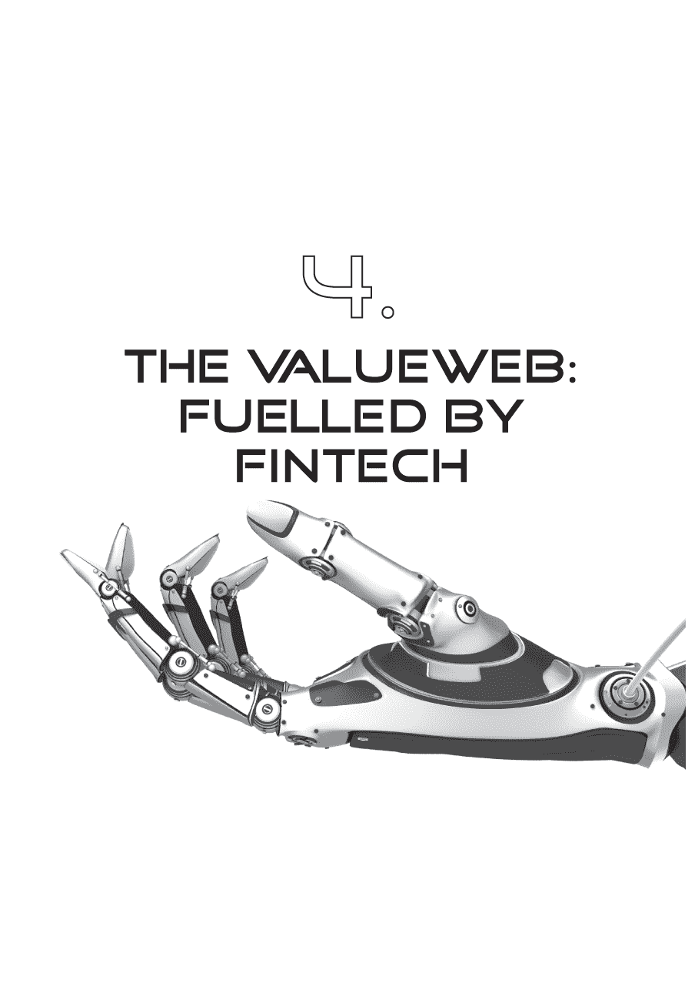
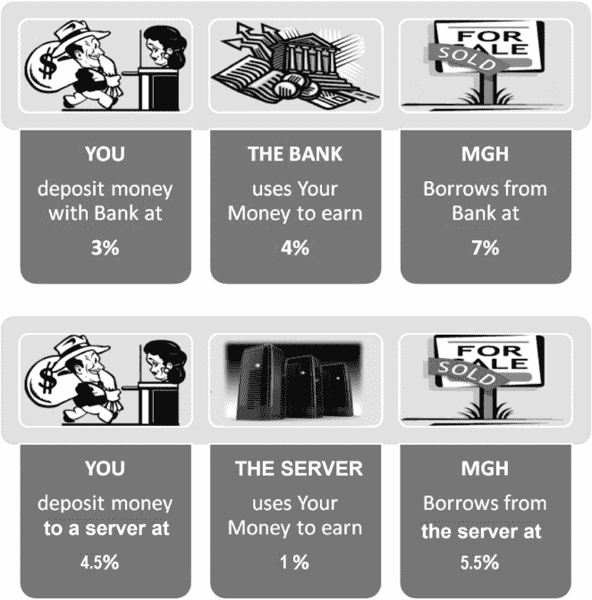
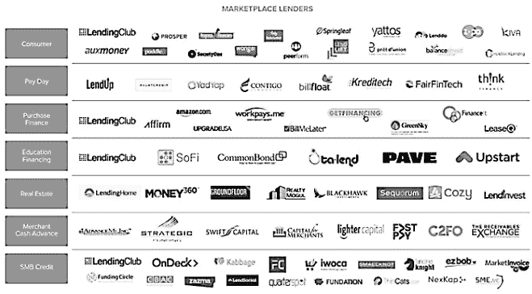
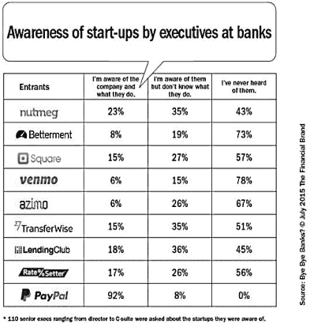
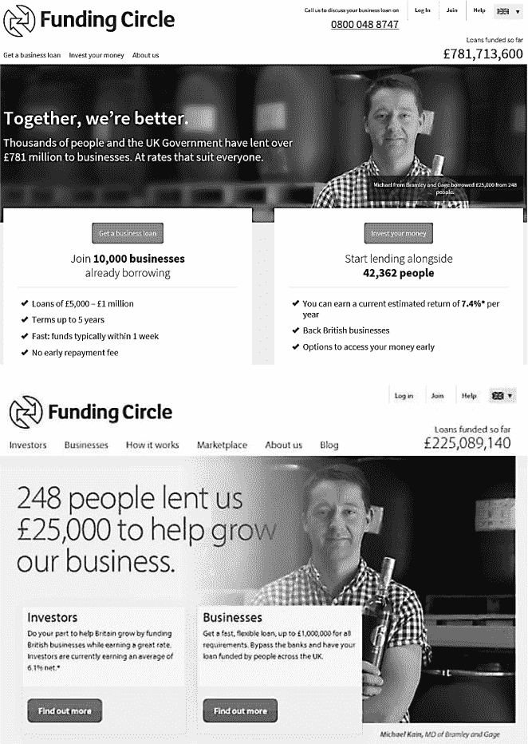
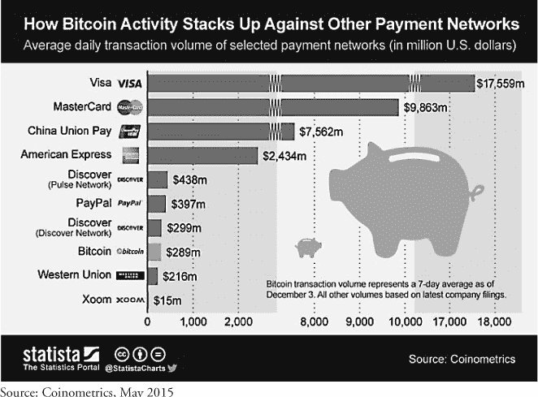
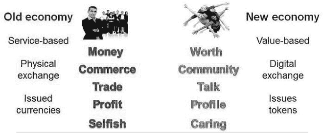

在过去几年中，FinTech 一词变得常见，但为什么？我认为这与价值网络（ValueWeb）是关键发展有关。正如前文提到的，价值网络基于两种技术：移动技术，使每个人都能实时交换价值；数字货币，提供价值交换的价值储存。随着这些技术的发展，银行业和现在的金融科技也越来越注重数字化。

金融科技（FinTech）是将金融和技术相结合的新市场。这个新市场是传统金融流程的混合体——包括营运资金、供应链、支付处理、存款账户、人寿保险等——但用新的技术为其传统结构带来了替代性的处理方式。

换句话说，FinTech 一词描述了一个全新的行业。这有点像谈论零售商，说亚马逊是一家零售商。他们是零售商还是电子商务公司或两者兼而有之？我会说他们是数字服务提供商，因为他们不仅履行消费者订单，还通过 AWS 提供基于云的服务交付。换句话说，他们根本不是零售商，而是一个全新市场中的公司。

同样，金融科技不是金融业的研发职能，而是数字金融的新兴市场，随着时间的推移，将取代传统金融市场。这是因为价值网络正在构建价值互联网，价值互联网将取代以物理银行处理实物货币的旧世界。正如我在之前的书《数字银行》中所提到的，银行历来通过分布于当地的网点网络处理纸张的物理分发，而价值网络则通过全球化的互联网网络处理数据的数字分发。数字网络取代了物理网络，金融科技社区正在构建新系统。最终，新系统成为我所说的价值网络。

价值网络和金融科技一样，是一个新鲜有活力的市场。这是一个充满活力和新鲜血液的市场。一个拒绝打领带，拒绝银行家套装传统的市场。一个希望用技术颠覆金融世界的市场。这就是我认为的价值网络市场，建立在金融科技之上。

举例来说，如果你审视风险投资公司在金融科技领域的投资，其中三分之一的投资针对处理支付的公司，另外三分之一投资于点对点（P2P）金融平台和 P2P 借贷机构。过去几年，这种投资周期呈现出了巨大增长。估计数字各不相同，但数据如下：2012 年金融科技领域的投资不足 10 亿美元；2013 年为 40 亿美元；2014 年为 120 亿美元；2015 年为 250 亿美元。这是对一个新行业的巨额投资涌入，因为这个新行业正在构建互联网 3.0，价值互联网，价值网络。

这个新世界正在以技术支持、取代和削弱旧世界金融。它正在创造一个基于技术的 21 世纪金融世界。对我来说，这就是金融科技。

金融科技以金融世界。 它与数字银行紧密相连，成为金融和银行的新定义。

ValueWeb 是一个新兴市场，金融科技是 21 世纪的金融代表。它是银行业的新形态。一些传统形式的参与者将会转变成这些新兴的数字金融科技参与者，而一些新兴的参与者将会接管传统参与者的市场。

结   混合型的新型市场是一种以 IP 为基础的金融公司，包括数字银行和数字保险公司，在它们的业务核心都采用了技术。这就是我想要与之合作的金融科技世界。

### 为什么风险投资公司会投资这么多资金到金融科技呢？

风险投资家（VCs）正在向金融科技领域投入数十亿美元，因为它正在打造 ValueWeb。它正在创造互联网 3.0。因此，金融科技与互联网的第一代和第二代一样重要，而下一个 Facebook、Twitter、Google 和 Amazon 也将在其中崭露头角。这就是风险投资家正在寻找的东西，在他们的行业术语中，它们被称为“独角兽”。

独角兽是指估值超过 10 亿美元的新型科技初创企业。目前已经有相当多的独角兽，包括 Uber、Airbnb、Twitter、WhatsApp、Snapchat、Pinterest 等。举个例子，微软在首次公开募股时的市值为 5 亿美元，而思科则为 3 亿美元。另一方面，巴克莱银行的市值今天略高于 600 亿美元……与十家 Lending Club 的市值大致相当。不同之处在于，巴克莱银行已有 300 多年的历史，而后者不到 10 年的历史。

这就是为什么每个人都对金融科技和价值网络感兴趣的原因，因为有很多金融科技独角兽并且在迅速增长。到 2015 年 7 月底，已有 83 家金融科技公司争夺成为独角兽，比 5 月份的 70 家和前一年的 17 家都要多。其中最大的包括陆金所、Lending Club、Prosper、SoFi 和 Zopa 等 P2P 借贷公司，以及许多新的支付公司，如 Square、Stripe、Klarna 和 TransferWise（详见本书后的 2015 年独角兽公司前 25 名名单）。

市场估值并不一定反映真实价值，因为一些私募公司的退出价值可能与其名义价值大相径庭，但这显示了金融科技周围的炒作，这也是为什么银行首席执行官们感到担忧的原因。这一点在 2015 年 2 月摩根大通银行的年度股东信中得到了明确体现。该信由首席执行官杰米·戴蒙撰写，包括以下关键词：

“*硅谷正在兴起*。有数以百计的初创公司集聚了大量智慧和资金，致力于各种替代传统银行业务的方案。你们最常听到的是放贷业务，这些公司可以通过大数据来增强信用核实，从而向个人和小企业快速放款，而且这些公司认为这是高效的。它们非常擅长减少‘痛点’，它们可以在几分钟内完成贷款，而银行可能需要数周时间。我们将努力使我们的服务与他们的一样流畅和竞争力十足。我们也完全愿意在合适的地方进行合作。

“*支付领域的竞争对手不断涌现。* 你们都听说过比特币、商家正在建立自己的网络、PayPal 以及类似 PayPal 的公司。支付对我们来说是一个至关重要的业务—而且我们做得相当好。但在实时系统、更好的加密技术以及减少客户成本和‘痛点’方面，我们还有很多需要学习的地方。一些支付系统，特别是由 NACHA 控制的 ACH 系统，无法实现实时处理，更糟糕的是，这些系统不断被系统上的搭便车者滥用。让人们转移资金的确会带来真实成本。例如，对于零售商来说，使用现金的成本是 50-70 个基点（因为需要防范欺诈和提供安全保障等）。而零售商通常会支付 1%给中介机构，以确保支票有效。担保支票实际上与借记卡交易相同，他们希望支付 0%。对于一些竞争对手来说，搭便车是他们竞争的唯一可能性。话虽如此，我们需要承认我们自己的缺点。我们需要建立一个能够适当收取参与者使用费用、提供良好客户服务并最大程度减少欺诈和不良行为的实时系统。”

杰米·戴蒙的 2015 年股东信充分说明了现有企业在应对价值网络挑战时面临的困境。摩根大通正在遭受 P2P 借贷者对其信贷市场的攻击以及廉价的实时替代品对其支付市场的攻击。要记住，价值网络是由移动技术驱动的，实现实时、点对点连接，并利用数字货币进行廉价价值交换。这两种技术是驱动传统的、现有银行如摩根大通遭受攻击的原因。

这些新的参与者令银行首席执行官们忧心忡忡，因为它们让旧银行处理旧流程的痛苦消失了。银行需要几周时间来处理贷款决定，而 P2P 贷款者只需要几秒钟。为什么银行需要几周时间呢？杰米·戴蒙没有说，但我猜想答案是因为银行被上个世纪构建的沉闷流程所困扰，用于在本地网络中分发文件。分支网络中充斥着人类自动机，他们能够管理交易，但无法评估风险。风险是由专家来管理的总部职能，他们被信任不会向信用不佳的人提供贷款（这也正是我们避免信贷危机的原因！）。确定申请人是否合适的流程需要几周时间。现在，自助表格在线取代了人工自动机，自动化系统取代了专家。这就是为什么新的 P2P 提供商可以以更低成本提供即时决策服务来取代银行。毕竟，一个价值$1,000 的服务器远比成本数万的专家总部信贷风险经理要便宜得多。

这才是 ValueWeb 的真正核心挑战，因为它是由金融科技打造的，用软件和服务器取代了建筑和人类。

#### 包装者、替代者和改革者都在瞄准银行。

金融科技初创公司通常分为三类：*wrappers*、*replacers* 和 *reformers*。

*wrappers* 是那些现有金融公司不需要太担心的人，因为它们正在将自己包裹在旧金融市场周围。这些是 Movens、Simples 和 Apple Pays 等公司。或者 PayPal、Google 和 Facebook。它们并不试图取代或改革银行体系。它们只是想通过把自己包裹在其中来消除旧系统中的摩擦，使金钱更容易存储、花费和使用。

还有*置换者*。他们的焦点是 100%用软件和服务器替换核心银行服务。这些公司更令人担忧，因为他们掌握了一个基本的观念：你不需要第三方机构来转移资金；你只需要一个服务器。

这正是全球第一家 P2P 借贷平台 Zopa 早期意识到的（请参见本书下半部分对 Zopa 首席执行官吉尔斯·安德鲁斯的采访）。Zopa 意识到的是，你可以轻松地从有钱的人手中取得资金，并将其转移给需要资金的人，利用处理器作为可信的中介。服务器处理交易并评估风险。不需要人为干预。

这就是为什么置换者需要更加密切关注，因为他们试图替代银行而不是消除摩擦。而且置换者很多。例如，Zopa 的 P2P 借贷模式已经在全球范围内得到了广泛的复制，几乎每个国家都有一家类似 Zopa 风格的初创公司：美国的 Prosper 和 Lending Club；欧洲的 Bondora、Lendico、Trustbuddy、Ratesetter、Smava 等等；亚洲的 Harmony、PPDai、Lufax、Society One、Dianrong、蚂蚁金服等等。事实上，仅在中国，到 2015 年已经有 2000 多家 P2P 借贷平台。

当一个东西在世界各地被复制时，你就知道它很热门。再加上一点众筹，你就会有一个预计到 2025 年市值超过 1 万亿美元的市场，根据 Foundation Capital 的数据。这个市场涉及所有信贷产品，从个人贷款到小企业贷款、抵押贷款和房地产。

这是对核心银行产品，即信贷的严重替代。事实上，高盛在 2015 年 2 月发布了一份关于新贷款市场的报告，并得出结论说新的 P2P 玩家将在六个关键领域使传统金融公司失去中介地位：消费者贷款；小企业贷款；杠杆贷款（即对非投资级企业的贷款）；抵押银行业（包括原始和服务）；商业地产；和学生贷款。从实际意义上讲，这意味着 2014 年美国银行在信贷市场赚取了大约 1500 亿美元，而高盛“估计未来 5 年以上非银行中介化可能会对每年利润超过 110 亿美元（占 7%）”。

幻灯片由*Foundation Capital*提供

信贷市场不是唯一受到影响的领域，因为汇款、外汇、交易等领域也受到了来自 Currency Cloud（全球汇款）到 eToro（社交交易）等新兴玩家的攻击。

然后还有*改革者*。他们正在利用移动和数字货币的关键技术来改变金融服务。

移动是变革性的，因为全球所有人都能够获得金融服务，这意味着没有人需要被排除在外。数字货币是变革性的，因为在没有银行的情况下创建价值交换是一个全新的概念和市场。

所以我们有：包装者、替代者和改革者。如果我是一家银行，我会密切关注他们，并且有点担心。这就是为什么杰米·戴蒙害怕这些初创公司的原因。他不仅强调银行“将努力使我们的服务像他们的一样无缝和具有竞争力”，而且在更进一步向银行作为价值系统集成商的步骤中，他表示 J.P.摩根“完全愿意在有意义的地方进行合作。”

摩根大通是否会将 Lending Club 和 Prosper 整合到他们的信用风险运营和结构中，这将对他们的利润率、流程和运营产生什么影响？这些是银行正在尝试评估的问题，因为他们不得不面对：独立、垂直整合的银行时代已经结束了。

### 随着智能顾问的崛起

杰米·戴蒙在股东通讯中提到的一大部分关注点是 P2P 和支付公司的挑战，但传统公司面临的威胁远不止借贷和支付。这涉及到金融和价值交换的各个方面，因为金融科技正在构建 ValueWeb。

ValueWeb 影响着从零售和商业银行业，到投资银行和资产管理业，再到交易银行和保险业，再到私人银行和财富管理业的一切。

根据 2015 年 7 月 State Street 银行对 400 名高级管理人员进行的一项调查显示，四分之四的高级资产管理人员预计基金市场将会被外部参与者颠覆，就像苹果引入 iTunes 颠覆了音乐行业一样。余额宝只需一键点击。

与此同时，去年谷歌委托了一项研究，探讨其如何进入资产管理行业，Facebook 也做了同样的事情，因此在欧美模仿这些货币市场基金的兴趣很大。这就是为什么一些关键高管公开表达对这个新的 ValueWeb 市场的担忧，以及这一事实，即它使得强大的科技公司很容易成为强大的金融科技公司。

“谷歌和亚马逊进入市场是真实的可能性。问题是，我们作为一个行业似乎总是落后于这些事情，但人们担心是好事，因为这会促使我们改进。”

—海伦娜·莫里西，

牛顿投资管理公司首席执行官

“我是 CEO，我的工资是为了感到恐慌，我对此感到恐慌。像我们这样的公司的最大危险是我们变得自满，并相信我们的业务永远安全。不是的。话虽如此，我们每年运营业务的成本是 5 亿英镑，这是一个巨大的承诺，即使对于谷歌来说也是如此。我不认为他们会制造基金，但我可以看到他们进入并分配基金。”

——马丁·吉尔伯特，

阿伯丁资产管理公司首席执行官兼联合创始人

“下一代投资者将与我们现在所拥有的完全不同。我们需要担心的不是谷歌的行为，而是我们客户的行为。”

——亚历山大·辛德勒，

联合资产管理董事会成员兼欧洲基金和资产管理协会主席

投资管理行业已经破碎，我们可以看到越来越多的证据表明，与零售和商业银行市场相比，这个行业面临的挑战更大，因为机器人顾问开始接管。 机器人顾问是一种互联网机器人，可以自动化我们的财富管理。现在有许多这样的公司的例子：Betterment、Wealthfront、Motif Investing、FutureAdvisor、Personal Capital、Hedgeable（美国）；Nutmeg、Wealth Horizon、Rockfox、Swanest（英国）；MoneyFarm（意大利）；Vaamo、OwlHub（德国）；[Moneyvane.com](http://Moneyvane.com)（瑞士）；以及 InvestYourWay（欧洲）。然而，我们不应假设这些机器人顾问会迅速淘汰传统行业。例如，到 2014 年底，美国资产管理初创公司仅筹集了超过 4.2 亿美元的资金（Wealthfront 筹集了 1.3 亿美元，Motif Investing 筹集了 1.26 亿美元，Personal Capital 筹集了 1.04 亿美元，Betterment 筹集了 4500 万美元，FutureAdvisor 筹集了 2200 万美元）。

两个行业巨头是贝莱德（BlackRock）和查尔斯·施瓦布。贝莱德每年花费 4 亿美元或者其净收入的 4%用于营销。查尔斯·施瓦布每年花费 3 亿美元，或者其净收入的 5%。两家公司都表现得不错，并且在不断增长，但颠覆性创新者们绝对已经涌现并正在加快步伐。例如，Wealthfront 在 2014 年年末时的资产管理达到了超过 150 亿美元。他们仅用了两年半时间就达到了 100 亿美元的资产管理规模，而查尔斯·施瓦布花了六年时间。150 亿美元与查尔斯·施瓦布管理的 2 万亿美元相比可能微不足道，但威胁已经被注意到。

因此，现有企业将会做出怎样的回应呢？可能最好的例子是查尔斯·施瓦布（Charles Schwab）和其他公司正在做的事情：免费提供资产管理。你不用为机器人顾问支付任何费用，但通过将投资组合进行跨部门调配，产生广告收入等方式赚钱。这是一个不同的游戏，但如果你没有参与，你就不在游戏之中。

### 金融科技挺进投资银行

在投资领域更难以看到金融科技明星和独角兽，因为这个领域更加不透明，它在过去二十年一直受到技术的根本性扰乱。第一个是程序交易，然后是算法交易，现在是高频交易，这引发了对低延迟、服务器农场和与证交所同处一地的需求。证交所本身受到诸如 BATS、Chi-X、纳斯达克等新金融科技公司的攻击，这些公司现在主导着大部分的股票交易领域。美国 BATS 证交所现在的交易量占所有股票的 20%，仅仅通过收购 Direct Edge 两年时间就将其市场份额翻倍，这对于一家位于堪萨斯的十年历史的车库初创企业来说非常不错。同样，在欧洲，BATS Chi-X 的交易量现在超过伦敦证券交易所和欧洲泛欧交易所（对一个八年历史的初创企业来说也非常不错）。

诚然，这些公司是由机构拥有的——BATS 列出 GETCO 为其最大股东。其他股东包括摩根士丹利、瑞士信贷集团、野村控股和花旗集团。换句话说，低延迟高频市场几乎完全被市场制造商所主导。

但是，你确实有大量的日间交易者、差价合约交易、交易所交易基金（ETFs）和直接市场接入（DMA），这在以前是不存在的。这也是金融科技的变革。然而，我不会称之为金融科技本身，因为这些都是交易结构的衍生物，而不是像 Betterment 和 Wealthfront 那样创建新业务模式的公司。

在这个领域，有三个真正的金融科技变革新兴市场：社交交易策略、市场融资平台和市场数据服务。在交易策略领域，我们看到早期的创新者如 ZuluTrade、eToro 和 StockTwits 很快被接受为社交交易的新形式。

ZuluTrade 目前可能是全球规模最大的社交交易网络，无论是交易者还是投资者人数上都是如此。提供完整的交易复制功能（支持多个经纪商）和社交互动功能，配备免费的完整功能演示。

eToro 非常注重新手投资者，eToro 既是经纪商又是社交交易网络。对新手投资者的教育非常重视，并配有易于使用的界面。

StockTwits 是一个面向金融和投资社区的社交通讯平台，通过推文进行交易。

还有许多其他社交交易系统可用，涵盖了从大宗商品到股票等各种领域，尽管最受欢迎的领域似乎是外汇（FX）市场，像 BelforFx、CopyFX、FxPro、FxStat 等公司。

市场数据领域也涌现了许多公司，像 Contix、Finalta、Kensho、Quovo 和 SumZero 这样的名字是我列出的高质量见解提供者。这些公司都是为交易提供见解的主要提供商，从而增加了社交交易网络。

最后，有市场融资平台，众筹者们坐稳了头把交椅。其中包括 Kabbage 和 Funding Circle，在美国和英国分别是顶级的小企业资助者，但还有许多其他有趣的金融平台，包括：AngelList、BankToTheFuture、CircleUp、CrowdCube、EquityNet、Fundable、FunderHut、Fundly、Healthfundr、IndieGogo、Innovestment、Invesdor、Microryza、MicroVentures、Seedrs 和 Seedups。

这是一个有趣的领域，因为它正在创造以金融为中心的、种子基金投资和创新、创意和新业务启动的融资。正如前文所述，这个市场也得到了大型机构投资者的资金支持，因此这更多是一种减轻早期融资风险的方式，而不一定是创建一个替代核心股权市场的方式。

总的来说，交易策略、交易分析和替代金融是投资和资本市场领域的三个重要金融科技类别，这是在过去十年中我们已经看到的低延迟、高频率变化之上。这也意味着，投资市场的变革和零售银行、商业银行空间以及资产和财富管理空间一样被金融科技所彻底改变。我们之所以不经常看到它，是因为在这个领域还没有一个尚未被现有参与者收购、资助或整合的大型新型实体。

**银行科技公司的担忧很明显……解决方案并不那么清晰**

当我和银行谈论价值网络和金融科技的兴起时，我通常会被问到一系列问题：

• 我们如何转变我们的传统结构？

• 成为数字银行的最大障碍是什么？

• 你提到了合作伙伴关系，但过去所有的合作结构都失败了，我们如何在未来成功？

• 你能给我们展示一些做得对、取得成功的人吗？

• 当我们有数百万信任我们的客户时，银行应该做什么？

这表明现有的金融机构担心未来，而不是自满。问题在于，他们都知道他们需要做些什么，他们只是不知道该做什么，或者说，他们的银行首席执行官不知道该做什么。

沮丧的是，银行担心 FinTech，已经意识到数字化的重要性，并在思考该怎么做。他们已经投资于应用程序和 API，重组服务，试图摆脱传统，做了应该做的事情。但问题是首席执行官不明白。首席执行官在银行中长大，了解银行，热爱银行，但对数字化一窍不通。如果你在一个需要对数字化和 FinTech 有所觉醒的银行工作，请确保首席执行官首先醒过来。

### 我银行死亡的报道大大夸张了。

杰米·戴蒙在他 2015 年的股东通讯中将 FinTech 的到来称为“硅谷来袭”。有趣的是，作为回应，摩根大通一直在招聘大量的硅谷人才。他们必须这样做才能与新的包装者、替代者和改革者竞争。正如杰米·戴蒙所说：“我们每天转移 10 万亿美元。我们是世界上最大的支付系统之一。当我去硅谷的时候……他们都想要分食我们的午餐。”

但是，尽管价值网络的崛起和 FinTech 的威胁，银行有一个自然的优势来保护它们。那就是银行牌照，历史规定银行的消亡不会很快发生。大多数银行已经存在了一个世纪以上——你能想到其他哪个行业由存在了一个世纪以上的主要参与者主导吗？

航空公司？也许。大多数航空公司的根源可以追溯到 20 世纪中期，并通过收购和合并实现了增长，就像银行一样。现在有一些新玩家——西南航空、易捷航空、瑞安航空——但大多数航空公司已经存在很长时间了。

杂货店？可能。大多数杂货店具有高的准入壁垒——门店网络和通过规模带来的利润挤压——并且存在已经存在很长时间的参与者——沃尔玛于 1962 年创立，乐购于 1919 年创立——但这并不意味着阿尔迪和利德尔等新参与者不能产生影响。

制药业？啊，现在这是一个基于产品创新和专利的业务，然后通过版权控制供应链。听起来有点像音乐，但药物更难复制。葛兰素史克的历史可以追溯到 1715 年，辉瑞的历史可以追溯到 1849 年。

新参与者的论点在我看来站不住脚，因为他们不断将银行业与音乐、娱乐、电影、摄影等类似数字化颠覆的行业进行比较。但这些并非同类产业，因为它们没有严格的监管、高的准入壁垒和强大的资本要求。唯一的相似之处在于银行业可以是纯数字化的活动，就像音乐、娱乐和摄影一样。

因此，银行业与这些公司类似，但与这些行业不同的是，它也与制药、杂货和航空公司有许多共同点。这些市场具有强大的门店分布网络、严格的控制和高昂的资本成本，就像传统银行一样。因此，真正的对话是新参与者认为银行业是纯数字化的游戏，而现有参与者则认为银行的分销、控制和成本使其更像制药业。

#### 银行业受到过多的监管以至于不会受到颠覆。

同样，更进一步地说，银行不仅受到其许可证的保护，而且由于法规决定了许可证，因此受到了过多的监管以至于很难受到干扰。事实上，我要说银行并没有被颠覆，而是在进化。正在发生的是，金融科技正在与银行业融合，以创建新的平台和架构，用于构建价值网络。

当我们构建价值网络时，银行业的演变是将银行业的架构替换为核心的数字活动，而不是物理活动。像图书、音乐、娱乐、旅行代理商等等一样，银行业是一种可以通过设备完成的活动，无需实际服务。你不能做到像航空公司那样（你需要实际旅行）或者加油站那样（你需要给车加油），但是你可以通过纯数字方式进行一些服务，比如银行业、音乐和旅行订单。

然而，与音乐、图书和旅行代理商不同，银行业不会被一个新玩家创造新的做事方式所淘汰。不会有像 iTunes、Uber、亚马逊或 Expedia 那样颠覆银行的革命。其原因在于，与所有其他业务不同，银行业是受监管的。银行业与政府政策密切相关；它是政府社会秩序的控制机制；它对一个国家的经济成功或失败至关重要。因此，政府有兴趣授予价值存储和价值交换的许可证。这控制了货币供应和经济稳定。因此，银行得到了适应的时间豁免，而书店、旅行代理商和音乐店却没有。

同样，我们经常听到有人说，新的金融科技巨头将从金融科技社区崛起，取代银行。会出现一个新的摩根大通或汇丰银行。我不这么认为。首先，P2P 社区正在从银行业获得资金证券化，因此无论是银行贷款还是众筹者代为贷款，银行都是赢家。实际上，这样做能够削减成本，并将风险转移到 P2P 平台，因此在许多方面更加高效。换句话说，这对银行来说是双赢的。

加密货币已经证明它们是不可信的 —— 比特币交易所 Mt. Gox、Bitstamp、比特币基金会 —— 因此，这项技术正在从网络的狂野西部转移到银行业的波纹中。再次，从混乱中产生了控制，银行保持着作为交易者和价值存储者的地位。移动支付将银行业普及至成百上千万的未开户人群中。有趣的是，这些未开户人群之所以能够开户，是因为他们建立了可以信赖的移动支付信用记录。正如之前提到的，在 2007 年肯尼亚推出 M-PESA 时，只有 250 万成年人拥有银行账户；八年后，由于移动支付信用记录，肯尼亚有超过 1500 万人拥有银行账户。银行再次胜利。

与此同时，当所有这些所谓的破坏正在发生时，银行可以接受其中的威胁和机遇，因为它们知道它们有时间发展，这是由于它们的监管要求。当 Transferwise 和 Holvi 沉浸在错误的信念中，认为监管机构不关心它们的时候，迟早会有一天监管机构会介入。当那一天到来时，Transferwise 和 Holvi 要么被收购，要么合并，要么被纳入银行业的控制生态系统，要么被关闭。

与此同时，我并不是说银行不需要改变。它们必须适应才能生存。它们的生存将取决于它们能够多快地迎接成为数字化而不是实体化的挑战。首先解决数字核心架构、基础设施和组织演变战略的银行（以及分行关闭和员工再部署战略），将成为领导从实体到数字的快速变革的银行。等待的银行要么会被竞争力量打败，要么会衰退。与此同时，通过金融科技创造新模型的银行，将成为传统体系早期数字化领导者资助和收购的银行。无论哪种方式，它们都将进化为价值网络，并且在十年后，今天最大的银行仍将是世界上最大的银行。然而，十年后的银行将是最佳应用程序、API 和分析的价值系统集成商，使他们能够为客户提供价值聚合的终极交付。

#### 什么会导致颠覆性变革？

最后，为了总结我的观点，即银行并没有被颠覆，而是进化或适应了，值得考虑的是什么会导致颠覆性变革。

首先，我不是按照传统的、词典上的定义来理解颠覆，而是按照克莱顿·克里斯坦森在《创新者的窘境》一书中所指的含义来理解的：

“颠覆性创新，是克莱顿·克里斯坦森创造的一个术语，描述了一种产品或服务最初在市场底部的简单应用中扎根，然后不断向上市场发展，最终取代了已经建立起来的竞争对手的过程。”

而今天的问题是克拉纳（Klarna）、Holvi、Zopa、Lending Club 和同类公司是否在做上述工作？在某种程度上，看起来他们是这样做的。据 Foundation Capital 称，到 2025 年，P2P 借贷和众筹将价值超过 1 万亿美元，而像苹果这样的公司正在接管客户钱包。反对观点是，有一些银行支撑了所有这些运动，批发市场也大力支持 Lending Club 等公司。同样，其他人认为市场正在扩大。例如，许多银行不愿向高风险项目和公司提供贷款。新创业的小企业总是很难从银行获得无抵押贷款，除非他们有一个稳健的商业计划。但是像 Kabbage 和 Funding Circle 这样的公司已经进入了这个领域，并帮助扩大了市场。2010 年至 2015 年间，小企业通过另类借贷者获得了超过 20 亿英镑的新资金。但是，Funding Circle 确实与桑坦德等银行合作进行这项业务，所以他们基本上是接手了银行不想要的业务。这算是颠覆吗？

可能是。今天，银行不想做这种业务。明天，这将成为他们的核心业务。同样，银行也没有帮助自己。例如，据报道，2014 年英国银行向企业收取了 4.25 亿英镑的隐藏费用。

### 金融科技真的那么特别吗？

尽管每个人都对金融科技（FinTech）感到兴奋，但金融科技并不是什么新鲜事物。金融科技实际上很古老。我可以声称，如果金融科技是指提供技术平台以交换金融服务，那么自从银行在 1960 年代首次实施技术平台以来，这种情况就一直存在。事实上，我确实认为银行就是金融科技公司。

我们对金融科技如此兴奋的原因是，有许多新的初创公司正在攻击现有公司的有缺陷的商业模式。这些初创公司不使用基于上个世纪的产品和分支网络的技术。这些新公司是围绕客户使用其移动和可穿戴设备上的互联网服务构建的。

这就是我们对金融科技感到兴奋的原因，因为它用软件和服务器取代了建筑物和人类。这就是金融科技的新世界。

这一步进得更深更远，因为它意味着金融科技公司可以针对狭窄的金融领域——银行业的拆分——并只提供作为对等连接的组成部分，例如贷款、信用和支付；或作为新的连接方式，例如现在购买后支付（Klarna），或匹配支付数据（TransferWise），或在共享分类账上创建新的数字交易所（Ripple）。

这就是我们对新金融技术感到兴奋的原因，因为它消除了旧金融技术的庞大开销。这并不意味着旧金融技术没有意识到变化。大多数现有银行正在投资于、与之合作开发、收购或与新金融技术做某种合作。真正的问题是，旧金融技术银行如何成为新金融技术银行？银行如何从基于产品的以物理分销为基础的结构转变为针对数字分销进行优化的新的以客户为中心的结构？

这是银行的根本问题，我认为，为了适应新金融技术结构，银行必须彻底改变他们的运营方式。新金融技术的核心是数字分销，因此旧金融技术必须摆脱基于物理分销的基础。一旦决定这样做，银行就可以开始改变架构和组织，成为一个以客户为中心的数字平台，而不是以产品为中心的物理结构。

对于许多银行领导人来说，这太激进了。这太难了。对于这样感觉的银行领导者来说，他们在现有结构中增加了一个数字主管，并让他们负责变革。更好的方法是推出一家新银行，因为将数字化委托给一个独立的部门是通往毁灭的道路。数字应该是核心。

推出新银行，让它成长。让新银行摧毁旧银行。让新金融科技吞噬旧金融科技的恐龙。

### 特殊关系

同样，一些人谈论金融科技和银行业有点像美国革命战争（1775-83 年）一样，是在美国人和英国人之间进行的。尽管美国殖民者最终击败了英国人，但最终一切都变成了一种“特殊关系” — 这就是许多人认为会发生在银行和金融科技之间的事情。

我把英国人比作银行，叛军比作初创企业。初创企业可能会赢得战斗，但不会打一场战争。只是一种共生的特殊关系。就像随着时间的推移，美国和英国成为强大的盟友一样，银行生态系统将与金融科技发展出一种特殊关系。

实际上，已经存在一种特殊关系。许多银行正在投资并指导初创企业，帮助它们茁壮成长。许多银行参与区块链和加密货币。许多银行提供与众筹者的合资企业或投资 P2P 借贷者。桑坦德银行在 2015 年 7 月宣布了二十多个区块链在银行业的应用案例，巴克莱银行正在培育区块链初创企业，而瑞士银行在伦敦开设了一个区块链研究实验室。

在 P2P 借贷领域，自 2008 年以来，美国的 P2P 借贷平台就被机构资金主导，当时，在监管机构的压力下，点对点借贷者重新启动为银行对点借贷者。大约 80% 的美国借贷者的贷款都是由机构投资者提供资金的，因此在美国，他们已经放弃了“点对点”的标签。

在英国，桑坦德银行和苏格兰皇家银行与 Funding Circle 合作提供了一项服务，如果你作为一家小企业的信用历史不足以获得他们的贷款，你可以去找 Funding Circle。同样，高盛和法国兴业银行支持 Aztec Money，这是一个新兴的点对点融资平台，人们可以竞标公司发票。

越来越多的这些合作关系正在发展，这意味着这些新市场正在得到银行的支持而不断增长。一些人认为这些市场最终会反噬它们的赞助方并接管控制权——但是它们真的需要这样做吗？未必。金融科技大部分是为未被服务的市场提供服务，比如小型企业贷款、向高风险消费者放贷以及通过老旧的银行铁路网络以更简单的方式进行支付。这就是为什么许多银行将金融科技社区称为*替代金融*——尽管有趣的是，许多金融科技公司称自己为*窄金融*。

*窄金融*专注于金融系统的一部分，并对其进行民主化，或者换句话说，通过用受信任的第三方处理器替换受信任的第三方机构来连接该系统。金融科技专注于用服务器替换建筑物，在此过程中消除了大量的开销。这并不是*替代*——这是核心。

然而，即使金融科技发展成为一个更大的怪物，银行也有足够的时间通过收购或推出竞争性服务来做出回应，比如高盛的 P2P 借贷平台。仅仅是为了有个清晰的认识，众筹网站在 2014 年为欧洲中小企业筹集了 15 亿欧元（20 亿美元）的股权和债务资金，而相比之下，2013 年欧洲银行向中小企业投资了 9260 亿欧元。同样地，P2P 借贷行业增长迅速，五大平台（总部位于旧金山的 Lending Club、Prosper 和 SoFi，以及伦敦的 Zopa 和 RateSetter）到 2015 年间的借贷总额已经超过了 1 百万笔，年增长率远超过 100 亿美元；但是与仅美国本土的 3 万亿美元的消费者债务相比，这些贷款仍然微不足道。

换句话说，在金融科技成为主流之前还有很长的路要走，世界真正关注它还需要很长时间。到那个时候，大多数银行将拥有这个行业，或者说拥有其中很大一部分，所以不要过早地对银行体系失望。

### 金融科技对银行意味着什么

许多评论家批评银行行动缓慢、愚蠢无知。许多人谈论银行不做这个不做那个，这个失败那个失败，毫无头绪不能改变，停滞不前或者骗过眼睛。实际上，我所遇到的每个银行高管都关心着他们企业的未来。他们意识到银行传统结构正在改变，他们的利润正在消失，需要从实体向数字化转变。他们理解金融科技正在改变市场格局，点对点、移动端和区块链的重要性。

他们的问题是他们不知道该怎么做，而咨询师也不能告诉他们。这让我想起了 2006 年听说 YouTube 被 Google 以 16.5 亿美元收购的时刻。一年后的一次演讲中，讲述了麦肯锡的首席执行官召集全球团队并问他们的故事：YouTube 是什么？他们没有人知道，甚至都没有听说过，因为他们被防火墙隔离了。

换句话说，我们生活在快速循环变化的时代，许多银行家（和咨询师）发现很难跟上。举个例子，现在我们看到 Stripe 和 Klarna 之间的一场巨大战役正在上演，但大多数银行高管甚至没有听说过这两家公司，尽管它们对他们的业务至关重要。例如，Adaptive Labs 于 2015 年 7 月发布了一项针对 110 位英国银行高管的调查报告，显示这些 C 级决策者中的大多数都不知道金融科技变革领域发生了什么，或者至少不知道他们的新竞争对手是谁。这种缺乏关注是因为独角兽的本质。独角兽可以在几个月内出现，并突然在关键市场空间中占据重要地位。

Uber 是一个很好的例子。Uber 是估值最高的独角兽。成立于 2010 年的这家新兴公司到 2015 年 7 月已经价值超过 500 亿美元。当你看到他们的业务量时，这一点并不令人意外。Uber 在 2013 年的订单价值为 6.878 亿美元，到 2014 年上升至 29.1 亿美元。对于 2015 年，他们的订单预计价值为 108.4 亿美元，预计 2016 年将超过 260 亿美元。

在金融领域的一个很好的例子是 Venmo。正如前面讨论的，这个想法是在一个周末休息时产生的，两个 20 多岁的年轻人在周末结束时需要结算账单，然后写了一个应用程序来做到这一点。这个应用程序建立在 PayPal 之上，四年后的处理的付款已经超过了 10 亿美元。

Venmo 很好地说明了这是一个实时、几乎免费、即时改变的时代，由移动互联网驱动，提供全球点对点连接。这个时代对于一夜之间成长起来的模拟时代的人来说很难理解。这就是为什么银行家不需要雇佣顾问或千禧一代。他们只需要融入生机勃勃的数字创新文化中。

这一点最好由一位银行首席执行官来阐明，他问我，他应该做的前三件事是什么？我回答说，他首先需要建立一个愿景，基于这样的前提：他们永远不会与客户面对面交流——只通过屏幕交易——而且在贷款上没有利润。我说，这个愿景需要假设消费者现在可以在其他地方免费获得他银行现在提供的一切。基于这个假设，他要如何赚钱呢？

你通过以新形式提供价值来赚钱，比如巴西银行 Banco Original（参见 Guga Stucco 的采访），他们正在通过众筹大宗购买新车来为客户获得重大折扣，并在过程中提供具有竞争力的贷款。或者像乌克兰的 Privatbank，他们正在通过创建自己的 Amazon/Alibaba 版本来克服在线购物的担忧，在银行网点或家里在线购买商品，商品会被送到银行网点的安全储物柜里。只有在你对产品满意时才付款，而且，由于这发生在你在银行网点时，你也可以获得贷款。

这些是银行业的新模式，价值是通过对金融产品的附加服务而不是金融产品本身创造的。在一个一切都免费的世界里，银行必须更加聪明地创造价值，而不是依赖于在 10 年后就不复存在的利润丰厚的旧世界产品。

一旦你有了在一切都是免费的情况下赚钱的愿景，请去实现那个愿景。传达那个愿景。让每个人都对你所信仰的事情充满激情和热情。最后，实现愿景。

### 窄银行对宽银行意味着什么？

在这个新技术与传统金融模式相融合的选择世界中，我们看到出现了将最佳元素结合在一起的混合系统。一个很好的例子是英国的 Metro Bank 和 Zopa 携手合作。这项交易允许 Metro Bank 的零售客户将 P2P 借贷作为其存款的资产类别，预期这将为他们的储蓄带来更高的回报。这项交易创新之处在于，P2P 借贷必然会损害其他资产类别：信用。但这一切都关乎选择，如果客户知道他们可以将资金存入 Zopa，那么为什么不允许他们通过银行的中介来做到这一点以确保其可行性呢？

这就是事情变得有趣的地方，因为像这样的创新交易以前已经出现过。Fidor 银行（德国）一直通过其业务提供 Smava 的 P2P 借贷，而 Caja Navarro（西班牙）是一个非盈利基金会，几年前提供了自己的 P2P 版本。他们称之为“市民银行”，并让每个客户都有权知道他们从每笔交易和账户中获得的利润。通过市民银行，您还可以投资于朋友和家人的企业以及贷款请求，银行确保贷款得到偿还。

这是关于聚合客户体验的关键点。如果客户有这么多选择，他们真的想要在 eToro、Circle、PayPal、Zopa、Friendsurance 等平台上开设众多账户吗？还是他们想要一个顶层的聚合器？我认为新兴的零售银行形式将是那种聚合器。就像旅行的 TripAdvisor 一样，我们将看到集成了许多金融后端提供商的前端服务。有人可能会说这就是比较网站所做的事情，但比较网站并没有集成和聚合。它们只是提供一个利率选择——之后，您必须转到提供商自己的网站来完成交易。

新的基于组件的银行将找到最佳的另类金融提供商，并通过自己的接入组合提供这些服务。一次登录，即可访问所有选择，一窗口式服务。这就是 Fidor 正在提供的服务，而且通过 Metro 和 Zopa 之间的交易，这是朝着正确方向迈出的又一步。

与此同时，我惊讶地发现中小企业（Small to Medium Enterprises，简称 SMEs）经常被银行拒绝信贷，因为它们不符合其风险标准。它们太小、太新、太未经测试、太风险，无法放贷。因此，银行建议它们去 Funding Circle 和类似的另类金融机构。这些另类金融机构在过去一年为英国企业开辟了一条生命线。例如，参见 2015 年 8 月的 Funding Circle 主页，见下一页。

距此前的 16 个月（是的，这是 2014 年 4 月 20 日）。

注意统计数据：一年前由 Funding Circle 提供的贷款额从 2.25 亿英镑上升到一年多一点后的 7.81 亿英镑，一年多一点时间里融资额增长了三倍以上。与此同时，通过 Funding Circle 借款的企业数量在此期间几乎翻了一番，这种替代融资市场的认知度也翻了一番。Lending Club 的大部分资金来自英国政府，有趣的是，美国近 98%的 P2P 借贷资金来自机构投资者。

所以你有两件重要的事情发生。首先，大型银行将小型企业转向替代融资，同时通过资助 AFHs 降低自己的投资组合风险。因此，替代融资公司成为风险管理者。这一切都很好，但接下来看另一个头条新闻：*中小企业受到 4.25 亿英镑的隐藏费用侵害*。这就是克里斯滕森颠覆性创新开始产生影响的地方，因为替代融资市场看起来如今与传统银行市场完全不同。

在这里，贷款是对中小企业和消费者信贷的狭窄银行关注。Funding Circle 或 Zopa 将向需要资金的人提供资金的过程最大程度地压缩。他们的客户喜欢这种方式：77%的 Funding Circle 用户表示，在第一笔贷款后，他们下次首选回到 Funding Circle，而不是银行。

所以，一方面，银行通过资助狭窄银行和鼓励高风险客户使用它们来降低信贷投资组合的风险。另一方面，他们对高风险客户——小型企业客户——收取更高的隐藏费用。此外，他们的客户现在喜欢他们的狭窄银行，并且将来不会回到他们的旧银行。

在我看来，这是一个破碎的模式。对银行来说是破碎的，除非它真的不想在未来进行任何中小企业或消费者信贷市场操作。Metro、Fidor 和 Caja Navarra 将狭义银行的提供融入到他们的客户聚合体验中。而 RBS 和 Santander 似乎正在做的是说，我们宁愿把你转移到狭义银行，也不愿让你留在我们的银行。

### 当支付是免费的时候，接下来会发生什么？

*当支付成本达到零、支付速度瞬间，全球每个人都可以进行付款和接收付款时，会发生什么？* 我一直在思考这个问题，因为这是必须改变的基础设施。例如，最近我和 Klarna 进行了交流（请阅读本书下半部分与尼克拉斯·阿德尔伯思的访谈），他们说他们不担心 PayPal、Stripe、Square 或其他公司，因为它们都建立在 Visa 和 MasterCard 的基础上，而这是一个过时的系统。那是一个有趣的对话，关键是看事情如何需要今天运作。

今天的事情需要能够在几乎免费的情况下，无论何时何地进行交换。博客、电子邮件、娱乐、创作、分享、交易，所有这些都是免费的。一切都是免费的时候，你如何赚钱？通过在基本交换上增加附加值来赚钱。通过写出好的博客为博客增值。通过更具创造性地娱乐和更好地娱乐来为娱乐增值。通过在支付周围提供信息丰富化来为支付增值。支付本身将是免费的。

几年前，我记得有个日本银行家对我说，他最担心的是当一家银行开业，提供免费支付服务，由 Google 广告资助。嗯，现在就出现了。一切都是免费的。在服务免费的情况下，你如何赚钱？广告、信息、增值服务等等。这些都是关键。

但如果银行、支付处理器或机构的系统是建立在旧的做事方式上的，那么他们就无法无偿提供货币和免费支付。旧的做事方式是通过需要几天时间进行处理的对手方系统，涉及大量人工操作，并且在过夜更新的系统上运行。

比特币白皮书中由中本聪提出的共享分布式账本技术之所以如此重要，就是因为这不仅关乎比特币，甚至不仅关乎区块链，而是因为他通过互联网创建了一个可信赖的、共享的账本系统，可以实时几乎免费地记录任何人之间的价值交换。这是为什么银行正在如此积极地进行讨论的关键原因。因此，当我们迅速将过时的批处理、后端系统转变为实时分布式账本系统时，我们将看到从高费用的日支付到几乎免费的实时价值交换的转变。这解决了第一个问题。

另一个问题是金融科技所引起的干扰。有人认为金融科技将摧毁现有的过时金融体系。有人认为银行将最终获胜，并在金融科技改革中处于核心地位。我认为我们正在看到另一种情况。我们正在看到一个混合系统的出现，银行正在培育和投资于金融科技，而金融科技正试图摧毁银行中那些没有意义的事物。

通过一个摇摇欲坠的网络在几天内进行价值交换是没有意义的。我们可以将其改变为一个几乎免费的实时工作系统，这就是共享账本。然而，这还不止于此。Klarna、Stripe、Square、Holvi 等都没有建立在共享账本之上。相反，它们都是试图摆脱受到旧世界技术限制的传统银行结构的金融科技公司，并使它们能够在这个新世界中运作得更好。

同样地，P2P 贷款机构和众筹者正试图摆脱过时的银行业务，用新的世界结构来取代它们。这正在发生，但进展缓慢。在最近的*经济学人*文章中，他们指出：“2014 年，个人和基金向欧洲中小企业提供了超过 15 亿欧元的股权和债务...与银行提供的 9260 亿欧元的资金相比微不足道，但这个金额每年都在翻倍。”

类似的情况也出现在 SWIFT、Visa 和 MasterCard 身上。如果你看看数据，它们就会说明问题：

换句话说，现有系统可能在必须改变之前就给了自己几年的时间。但这并不表示银行变得自满。他们正在在必须改变之前改变自己，通过投资和拥抱创新文化。

最终你得到的是一个被移动互联网彻底改变成为一个新的价值交换系统的旧银行系统，它将技术与金融结合起来。一个新的世界秩序，但根植于旧世界的智慧。其中一条智慧是，你不会相信将钱存放在一个泄露的系统中；你也不会相信与你不认识的人交易，除非有一个确保你得到所承诺的东西的系统。

这就是为什么银行和区块链正在走到一起，以及为什么旧系统正在接受新系统的原因。

### 如果服务是免费的，我们如何赚钱呢？

在我的支付演示中，我有一个口头禅。支付正在受到 FinTech 初创公司的攻击，如 Klarna、Square、Stripe、Alipay、PayPal（Venmo、Braintree）等。它是仅次于贷款（P2P 和众筹）的最活跃领域，也是新竞争对传统银行处理器最成熟的领域。

我的口头禅并不是关于支付作为一个行业，而是关于我们在 21 世纪支付方式的失败结构。如果我今天从伦敦汇款到圣保罗，需要七到十个工作日才能处理。这有多荒谬？如果我给圣保罗的朋友打电话，是即时的、实时的，并且通过 Skype 是免费的。那么为什么从英国到巴西的支付需要这么多天才能处理？

这个问题是如何改变那些老旧的银行间通过 SWIFT 网络和低高价值清算系统进行的对手方转账系统。现在，像 Ripple 这样的公司正在慢慢解决这个问题。其想法是创建一个银行共享分类账，使对手方能够在互联网上实时共享信任的交换系统，几乎是免费的。

这就是我的口头禅：银行业中的一切都应该是实时的并且几乎是免费的。当我们周围的一切都变得快速和免费时，使用旧技术是缓慢和昂贵的，你无法运行一个 21 世纪的金融系统。

现在这是一个核心问题：如果一切几乎是免费的，我们如何赚钱？

大多数服务提供商还没有回答这个问题。这就是为什么 Square、Stripe、PayPal 等公司会在卡方案费用之上增加一点额外的使用费用。那是赚钱的一种方式。不过，我更倾向于另一种方式。我们通过提供信息、增强、支持和管理资金来赚钱。

我们如何提供信息、增强、支持和管理？目前还没有太多例子，但有两个例子脱颖而出。

其中一个是一家银行创建了一个餐厅应用程序——韩国的新韩银行。这个餐厅应用程序提供了全国所有餐厅的评论和评分。就像 TripAdvisor 一样，你可以找到你附近的餐厅，预订一个桌子，写一篇评论，最重要的是，通过应用程序支付。支付的方式是使用账单上的 QR 码，或者更简单的是，在应用程序中创建你的钱包，账单会自动支付并提供电子化的账单。

我喜欢这家银行的应用程序之处在于，它正在成功地成为这个国家主要的美食爱好者应用程序，并排挤了其他银行。其他银行不参与该应用程序，所以只有这家银行的客户才能通过钱包或 QR 码支付餐费。因此，他们的竞争对手现在要求成为该应用程序的一部分，而银行则向其他银行收取费用以包含它们在钱包中。

另一个很好的例子是一家银行利用社交媒体来提高客户忠诚度。你可能听说过众筹的想法，即聚集足够多想购买特定产品的人群，以获取该产品的折扣。如果你能找到一百个朋友都想购买新款 BMW 5 系，那么如果你本周订购一百辆 BMW 5 系，BMW 将给你折扣。嗯，另一家银行正在利用这个想法来为他们的客户创造价值。

这个银行的想法是监视他们客户的 Facebook *likes*。如果他们发现一大群顾客都 *liked* 新款 BMW 5 系的发布公告，那么他们就会与 BMW 联系，谈判一笔交易。银行可能会承诺在新款车型发布的第一周购买一百辆车，并通过这种方式联系所有 *like* 新款 BMW 5 系的顾客，告诉他们，如果他们想要一辆，不仅会享受巨额折扣，而且还可以获得银行提供的有竞争力的贷款。

换句话说，这家银行通过为客户提供价值来寻求增加客户的忠诚度。银行以折扣利率向客户推销贷款，最重要的是，一周内获取了一百笔贷款，期限为三至五年。客户被锁定了，银行也很高兴。客户也很开心，因为他们已经以八折的价格预订了新款 BMW 5 系，并获得了贷款折扣。

这对双方都是双赢，这就是未来银行必须采取的行动方式，以在价值互联网中区分。未来银行将通过创建和解锁通过数据传递价值的新方式来赚钱。

因此，当问到问题，“如果一切都是免费的，我们如何赚钱？” 真正的答案是，“通过不同的思维方式和通过设计创造附加价值”。 对于一家老银行来说是一个艰巨的任务，但并非不可能，正如上面的两个例子所说明的那样。

### 未来银行将如何区分？

这是一个常见的问题，基于金融领域正在发生的巨大变化，其中一切都因价值网络而变得实时和免费。我们可以预期银行将朝着成为生活方式选择而不是支付处理器的方向发展。

从历史上看，客户选择一家银行是因为它在他们家附近。银行收取多少费用并不重要，因为所有银行大致都一样。随着多年的退缩和客户转移到在线，银行变得更加缺乏差异化。现在，大多数人之所以选择他们的银行，原因是相同的，因为它在物理上是本地的（超过 60％的新账户仍然基于分行附近的决定）；但一旦账户开设完成，他们就再也不想去那里了。

很快，随着分行角色动态变化并变得不那么重要，客户将不再因为分行的接近而开设账户，而会转向基于生活方式的选择。银行如何反映我的个性、需求和目标？他们是否与我共享共同的道德和价值观？他们是否符合我的生活方式和观点？

这些问题很少对今天产生影响。毕竟，当有关巴克莱操纵 LIBOR 的头条消息出现时，每个人都说他们会关闭自己的账户，但实际上这样做的客户比例微不足道；但随着客户变得数字能力更强，它们将在未来变得更加重要。

这是银行将看到一种新的关系。这种关系是屏幕对屏幕而不是面对面的。屏幕对屏幕的关系非常不同，将会看到客户对关系的语境要求。一个关系的语境通过您的设备、芯片和生活方式而不仅仅是通过数据分析和推送营销与您相关联。一个关系的语境将利用物联网来感知何时向您提供信用卡或贷款优惠，但其范围和深度不仅限于此。一个关系的语境将通过使用深度数据分析来追踪我们的数字足迹与客户密切相关，但只会在权限基础上与我们建立联系，并将重点放在关系的语境上，而不仅仅是权限上。

每天向我推送十次信用卡优惠可能很容易，但是关系的语境会知道何时推送这样的优惠才是合适的。一个关系的语境会意识到何时是一个好时机进行交流。一个关系的语境会深入了解我购买的类型，并与我购买相似的人建立联系，并支持我购买更多我购买的东西。但真正的生活方式选择银行比这一切都更进一步，通过与我的生活方式相连接。

这些银行将会意识到，新银行，即生活方式选择银行，与现有的银行有着共同的观点，并在关系的背景下具有相关性。

*什么是相关的银行？*

一个相关的银行是通过在我所处的地方，即我的社交空间中，通过沟通向我提供信息，教育和同理心。明天真正不同的银行将坐落在这里：在客户看到关系的背景下提供相关性，而关系在社交空间中，而不是在分行中。

我们已经看到银行正在发展社交环境以保持相关性作为一种生活方式选择，这个领域的领先者是 Fidor。我经常谈论 Fidor 在 Facebook 上进行实验以获取*赞*，例如，我之所以这样做是因为他们是第一家将社交空间作为主要建立客户关系的地方的银行。

正是这种思维将成为顾客选择银行的差异化生活方式选择。这不会是品牌、规模或分支机构，而是它们是否符合我的思维方式。这就是 Fidor 所做的——它以成年人的方式与客户谈论金钱；这就是 ICICI 银行在印度通过他们的社交外展计划所做的；这也是许多银行将来会做的事情。

银行将成为社交野兽，在社交空间提供社交外展以获得社交关系。顾客将根据银行的社交外展、相关性和与他们的生活方式的同步性来选择他们的银行。这只是时间问题。

**这是一个全新的勇敢世界**

在我的演示中，我使用三张幻灯片来说明这个巨大的变化。这是银行从专注于贸易到专注于社区的变化。第一张幻灯片说明了银行必须进入社交网络，因为那里有他们的客户。

如果客户是通过数字社交网络建立他们的关系，那么银行必须进入这些网络并保持相关性。

我关注的第二件事是共享经济，以及在这些在线社交社区中有大量的价值共享。这种价值不一定以货币形式存在，而是以社交形式存在。*赠送、分享*、*喜欢*、*收藏* 都是这些社区中的关爱和支持的形式，可以导致真正的价值交换，从而转化为货币价值。例如，在你可能从未听说过的最大社交网络中，中国的 YY 中，顶级卡拉 OK 歌手经常从虚拟礼物中获得每月 20000 美元的收入，据报道，一名大学生每月通过该网站提供 Photoshop 课程赚取了惊人的 188000 美元。

这为通过 *喜欢* 和 *分享* 从想法中产生收入提供了一种简单的方式。事实上，通过社交网络，除了纯产品交易或传统服务之外，还有许多其他建立价值的替代方式。我们在 Kickstarter 和 Indiegogo 等网站上看到了这一点，但它更进一步。例如，任何个人都可以成为一个媒体站点。一个很好的例子是 PewDiePie，由于他近 4000 万的订阅者，他每年通过 YouTube 视频对流行游戏发布的反应赚取约 700 万美元。该订阅者基数比大多数电视频道还要大。

所   银行需要在传统的贸易金融世界与新型包容共享世界之间实现融合。这是关键所在：数字银行正在从纯粹的冷利润机器转变为温暖而亲密的关系提供者。

最后，当我们达到了那种理解水平时，我们就能明白为什么加密货币如此重要，因为我们已经从基于卡和现金的实体价值交换转变为基于芯片的数字价值交换。在这个新世界中，令牌和礼物、点赞和分享一样重要，就像金钱一样。因此，在新的基于社区的模式中，银行侧重于通过令牌化而不是货币的实体交换来提供产品和服务的数字价值交换。

### 数字世界中的客户参与

那么我们所说的社区关注、社交银行是什么意思呢？显然，一个社区关注的社交银行以不同的方式运作，通过数字媒体建立关系。以下是它的运作方式。

在新世界中，客户将首先通过数字方式与银行互动。这将来自于社交媒体上的某个接触点。一个朋友在 Facebook 上给银行点了个“赞”或者在 Twitter 上发了推文。这是一些互相称赞的话，比如“刚刚在数字银行贷了款”，于是你决定去看看数字银行。你发现数字银行有很好的利率，一个漂亮的移动端界面，所以你对它产生了兴趣。数字银行要求你下载应用程序或者在 Facebook 上给他们点个“赞”以获取相关的交易和优惠，所以你两者都做了。应用程序问你是否愿意接受推送通知，你答应了。

在这一点上，如果银行做得好，你就会上瘾。你成为了一个获得的客户，因为当你看到接下来发生的事情时，你不可能让银行滚蛋。

首先，银行开始根据你的数字足迹向你发送有趣的东西。它知道你喜欢 Coldplay，来自你的 Facebook *likes*，所以你会收到一条推送，询问你是否要在本周五晚上 9 点购买 Coldplay 的门票……还是要让数字银行替你买？当你今天走进城市时，你会收到一条推送，问你是否想在星巴克喝杯卡布奇诺？如果你说*yes*的话，半价优惠（顺便说一句，你刚刚加入了星巴克的忠诚计划，当然你不用付咖啡的钱，这一切都通过你的账户自动完成）。嘿，你知道昨晚在 Google 上你正在向往的宝马吗？是的，你正在搜索和浏览——嗯，根据这个融资计划，你负担得起。

KYC（了解您的客户）流程是立即的——银行只是要求我发送我的水电账单和护照或驾驶执照的照片——他们问我是否要转账还是试试我们？我说试试你们，他们要求支付 100 美元的存款，只是为了展示他们能做什么。好的。哇！数字银行立即向我的账户存入 125 美元——其中 25 美元是我的试用欢迎礼物（如果我转账，他们会再给我 250 美元）——然后我们开始了。

我开始收到越来越多相关的推送通知：

• 现在使用优步，你的出租车打折 25%（他们知道我要去开会，不想迟到）

• 今晚美联航的机票便宜（他们知道我喜欢他们，来自我的 Facebook *likes*）

• 申请一笔最高为 2500 美元的数字贷款，我们将在五分钟内向您的账户存入现金（他们知道我主要的银行账户即将透支）

过了一个星期，我觉得他们非常酷，惊人地敏锐，有点可怕，所以我决定好好了解一下。我想看看他们在现实生活中的表现。他们有分行吗？他们没有很多，但在我工作的地方附近有两家。我去了两家。

在第一个场景中，门房说：“你好，这是你第一次来数字银行吧，我相信。欢迎。我们能为您做些什么？” 我问他怎么知道这是我的第一次访问，他告诉我这个秘密：“你的应用告诉了我。” 我告诉他这有点可怕，他说：“克里斯，我可以称呼你克里斯吗？让我向你展示一下你的应用的隐私设置，并根据你的喜好进行更改。”

然后我被展示了应用程序的工作原理。太棒了。我将隐私设置更改为*仅个性化推送通知*并关闭了通用的*在任何地方始终个性化问候*选项。

我去了另一个分支机构看看它是否有效，果然，这里的门房说：“欢迎来到数字银行。今天我们能为您做些什么？” 我喜欢这些家伙。

这种情景将不断增加，直到我的抵押贷款，养老金，贷款，投资以及其他一切都与数字银行联系在一起……但这里的主要问题，也是写作的原因，是我刚刚颠覆了银行关系。

我的起点是通过我的社交群体，通过社交媒体，所以数字银行必须通过社交群体与我联系。然后，数字银行在所有接触点持续利用大数据与我相关。他们正在访问并使用我的完整数字足迹与我建立关系。这就是他们如何了解 Coldplay，United，我的会议和基于位置的习惯。最后，数字银行的人际互动完全由我的数字足迹信息支持，这就是为什么这些互动是异常的原因。

现在，提供这种能力的唯一途径是通过在互联网时代设计的数字基础设施上构建一切。因此，当一家银行表示将数字作为一个渠道添加到其现有基础设施时，他们完全错了一千倍。毕竟，数字银行始于数字社区关系，终于基于分支的关系。大多数现有银行从分支开始，以数字结束。数字银行旨在全球网络中数字化数据的分发；大多数银行是为本地网络中纸质的分发而建立的。数字银行专注于利用网络的每一点来最大程度地促进关系 24-7。

大多数银行只关注于建立关系。这就是为什么真正的数字银行，而不仅仅是具有数字渠道的银行，会获胜的原因。
