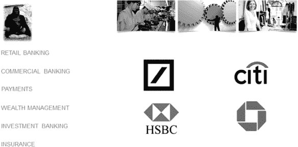

与一群银行的头脑风暴会议提出了这个问题：我们是否正在经历银行业的柯达时刻？我们是否正在看到类似于诺基亚的变革？银行会错过转折点并因互联网改革而灭亡，还是我们会及时做出回应和改变？

柯达和诺基亚曾是各自领域的市场领导者，但他们否认了变革。柯达不相信数码相机会取代他们的业务；诺基亚没有意识到智能手机会摧毁他们的移动领袖地位。银行是否正在经历同样的盲点时刻？由于不能及时适应价值网络，许多银行会消失吗？

有几件事情我们知道：

我们已经看到其他行业被数字化摧毁——书籍、音乐、摄影——并且知道同样的事情正在银行业发生。

我们知道，银行最大的资产是数据，但银行并没有利用他们的数据资产：据弗雷斯特（Forrester）称，只有 3%的数据被标记，不到 0.5%被分析。

我们知道银行的产品分割结构效率低下，缺乏客户关注。

我们知道我们有低效的传统系统需要更新。

我们知道加密货币正在重新定义货币和价值的数字化。

我们知道成千上万家公司正在推出新的管理资金和价值的创新模式。

我们知道，数十亿美元被投入这些新公司以强制改变银行系统。

我们知道银行必须改变，但他们和柯达、诺基亚一样吗。监管、合规、审计和治理要求，再加上资本储备过于沉重，意味着几乎没有外部公司能进入银行业。

这已经被证明是正确的。在过去的 25 年里，每个人都预测银行会死掉并被淘汰。这并没有发生。这就是为什么大多数国家只有几家大银行，几乎没有竞争。

但是，考虑到银行面临的挑战清单，这能成为坐视不管、自满的好理由吗？那么所有这些新兴的金融科技初创公司又会如何改变业务呢？

今天我和大多数银行家交谈时，他们都会说*是*。或者至少是那些了解我们世界中金融科技变革的银行家。这些银行家相信，加密货币的设计目的是消灭银行的中间办公室处理结构；P2P 将淘汰他们的信用产品提供以及更多内容；前端关系正被诸如 Apple Pay 之类的公司接管。这些银行家相信 Apple Pay 将在未来十年内淘汰 Visa 和 MasterCard；比特币将取代 SWIFT；而他们必须实现点对点的价值交换连接，而不是像银行过去四分之一世纪那样担任控制狂。

### 银行业的主要部分仍停留在上个世纪。

在我一生中，有两件事彻底改变了世界：旅行和技术。

作为一个男孩，我的生活在当地联系紧密。我们有一个当地的报刊亭、酒吧、商店和汽车修理厂，我的朋友都住在 15 英里的半径范围内。我父亲在我们住的地方 12 英里外的一个城市工作，他所有的朋友也都相当本地化。我们网络的最远点是我祖父母，他们住在德文郡 200 英里之外。我们每年会去拜访他们，而这段旅程几乎需要八个小时，因为公路网络仅限于次要道路。最快的路—高速公路（州际公路）—刚刚开始建设。

令人惊讶的是，这些记忆听起来像是来自 19 世纪，而我谈论的生活不过是不到半个世纪前。那时，我父亲曾访问过美国的波士顿。我以为他去了月球，因为没有人会去那么远。我的第一次海外假期是在西班牙，而我的第一次飞行是在 1973 年。我以为自己是宇航员。

现在我不停地旅行。一个世纪前由伟大的探险家发现的世界各地，现在和我祖父母 50 年前一样容易到达。

然后你把这个技术融入其中，一切都会进一步改变，因为现在每个人都在全球范围内一对一地连接着。我的朋友是全球的，不是当地的，70 亿人（我出生时只有 30 亿）可以通过社交移动网络直接与彼此相关联。

所以在这个被旅行和技术改变的全球化连接世界中，银行没有跟上这些变化，这让我很惊讶。举个例子，我前几天收到了一张支票。一开始我很恼火，因为纸张已经过时了。这张支票是以加拿大元支付的。我把它存入了我的账户，一周后我收到了银行的一封信。信上写着：“我们收到了您的一张加元支票存款，我们已经将其发送给发行银行进行处理。我们无法确定处理时间多长，建议可能需要长达六周。同样，任何在此过程中发生的费用都将从存款金额中扣除。”

没有争议，是一种*既成事实*。六周后，我收到一张通知，称付款已经处理，但收款银行向我收取了 CAD$127 的费用，我的银行还收取了£50 的处理费。换句话说，我们生活在一个通过旅行全球化的技术改变的世界，但银行网络甚至不能处理一张支票，而必须通过将纸张在陆地邮寄网络中移动并涉及大量手工处理来完成。现在这真的听起来像是 19 世纪的事情。

想想加拿大的支票需要六周处理并且有重要的处理费用，让我想起了海蒂·米勒在 2004 年的演讲。它是在由 SWIFT 主办的最大银行会议 SIBOS 上发表的，他们的全球处理器，直到今天还在谈论。

Heidi 说了什么那么引人注目？

她提出了各种问题，包括：

• 为什么银行让客户的一切都变得如此复杂呢？

• 当银行自己的后勤部门如此昂贵、零散、过时和“不可互操作”时，银行如何帮助客户变得更有效率和更有生产力？

• 如果银行真的渴望成为支付和证券行业的领导者，为什么他们业务中的许多创新都是由非银行机构首创的呢？

• 如果银行可以通过互联网向任何公司发送安全消息，为什么他们要付钱给 SWIFT 来代劳呢？

最后一个问题是最具争议的，尤其考虑到这是 SWIFT 的会议，这也是银行仍在谈论她的演讲的原因。她还提出了这个具体的挑战：

“让我给你讲一个关于一个住在欧洲，在英国买了一艘船的朋友的故事。这位先生是一家全球大型金融服务公司的前高管，非常值得信赖。他的美国银行账户里有足够的钱买很多艘船。当船准备好时，他打电话给他的银行安排付款。他的银行告诉他，需要大约六个星期才能完成资金转账。我的朋友本可以航行到纽约，从他的银行账户取出现金，悠闲地吃顿晚餐，然后航行回英国，付款购买船只，然后还有时间去地中海巡航，而那笔资金转账仍然没有完成。”

十年来情况没有改变，事实上，随着 FATCA、AML 和 KYC 的出现，情况变得更加困难了。问题在于：因为它太难了，人们正在想方设法绕过它。PayPal 今天可能只是银行系统背后的一个小问题，但它的支付处理量正在激增，这要归功于它便利的跨境贸易支付方式。而比特币正是为了克服银行系统的不足而被发明出来的。

比特币之所以存在，就像 PayPal 一样，是因为通过新网络进行货币交换得不到银行体系的支持。如果银行系统仍然运作在全球旅行和技术之前的旧世界，那么新世界就必须创造出填补这一空白的东西。这个创造物就是比特币。

比特币填补了全球连接的空白，与我的加拿大支票不同，它通过网络在全球范围内免费交换。没有费用，没有等待，没有问题。这就是比特币交易的力量，也是我们需要银行关注变革的原因，要快。

#### 我们不是博格，我们是人类，跳着不同的旋律。

基于金融旧世界与新世界之间的分歧以及（某些）银行为何不适合 21 世纪的主题，会让人想到更多的点，特别是关于控制和中央集权。银行建立在控制狂的基础上。他们需要拥有一切的完整端到端周期。这就是为什么他们不愿意外包，而是建立自己的数据中心而不是使用亚马逊或其他公司的原因。他们必须开发自己的软件、系统和服务，这就是为什么他们拥有比微软更多的开发人员。他们不信任共享服务或其他企业，因此一切都变成了点对点，对方对对方。

这在实体世界可能还算顺利，但在这个基于云的分布式服务时代，它行不通。事实上，金融的整个垂直端到端处理方式在根本上是有缺陷的。

同样，银行的结构对于今天的世界来说也是根本性的有缺陷的，因为它是建立在实体结构的基础上的。当地的银行通过当地分行为当地人服务，向通常是该国央行的中央机构进行中央报告。

正是这种旧的安排导致了所有与支付结构变化有关的问题，比如欧元区的 15 年变革计划 SEPA。支付结构使用的中央清算机构由各国银行联盟运营，并受中央银行监管。现在没有国家或中央银行，只有一个世界和一个全球网络。因此，上个世纪建立的点对点交易对手模式，专为国内运作而设计，在去中心化的世界中是致命缺陷，并使得对比特币的需求更加迫切。

让我们从另一个角度来看待它：广播。在控制和中央集权的过去时代，娱乐仅由几个国家频道提供，并为大众编排。节目全是本地语言，重点是本地和国家内容。这些频道有一个中央基地，通常位于该国的首都，可以从广告中获得高额收益。

现在，我们可以从卧室向世界广播。人们在咖啡馆里分享，他们是自己的媒体。他们既创造也消费，而他们消费的媒体是全球的。语言和边界不再是障碍。

银行一直试图维持这种结构，但作为可行的替代方案一直很难找到。然而，一个替代的商业模式正在出现：加密货币和虚拟价值存储。随着它们的出现，银行将发现客户正在创建适合其生活方式的自己的金融生态系统，而所有那些集中控制将在一夜之间崩溃。

特别有趣的是看到这如何摧毁了通过点对点、交易对手结构服务于本地需求的地方银行的结构。

在 2010 年代，网络终于对银行系统造成了严重影响。网络的力量和财富完全体现在互动性上。互动性会造成混乱和去中心化，因为每个人都有发声的权利。这就是我们在社交媒体上看到的情况，也是我们在娱乐和价值方面看到的情况：控制权的去中心化。

#### 银行可能停留在过去，但过去不能被忽视。

银行业是不同的，但新价值网络系统与传统金融服务市场之间存在着明显的摩擦。这种摩擦是由于旧系统需要与新系统配合工作所致。你必须以尽量小的风险将旧系统迁移到新系统上，而新系统必须以允许旧系统追赶的方式构建。

我越想到这种摩擦，越能在银行的各个方面看到它。现有银行需要向数字化迁移，但当你拥有 42 个存款系统、57 个交易系统以及数十个其他系统，它们都是在不同时期建立的，现在因为并购和过去过度膨胀的首席信息官而存在。虽然已经尝试过合并系统，但替换成本与维护成本之间的比较总是一个主要因素。

现在新客户、移动互联网、数字化转型、云和区块链技术等要求迁移，然而风险和成本太高。这是银行内部已知的因素和已知的风险，但所有银行都在应对这一挑战。

与此同时，创新者和开发者对于旧银行仍然坐在那里没有整合、增强、更新和领导最新技术感到沮丧。他们想知道为什么没有清晰的数据结构、简单的数据分析能力以及对客户银行知识的利用。他们想知道为什么新世界不能被接受，而仅仅是抛弃旧世界。

但是，你不能有一个新世界而不带有旧世界，反之亦然。现在，旧世界运行着一切。Visa、MasterCard、SWIFT、EBA、ECB、CHIPS、Fedwire、RTGS 和 ACH 系统使银行运作正常。卡网络、货币传输和交易对手连接使银行、商家、企业和机构之间能够安全可靠地互操作。你不能一夜之间拆除和移除这一切。与此同时，旧系统必须与新系统并存。这就是为什么银行要花费大量精力维护遗留系统，而且，尽管改变的需求不断增加，唯一能够产生影响的新事物都是与旧银行网络相结合的（比如 Apple Pay、PayPal、Moven、Simple 等）。

这就是我最近发现的两个显示出新旧矛盾的项目。第一个是一项研究发现，2014 年欧洲银行在 IT 上花费了 400 亿英镑，但其中只有 70 亿英镑投入新系统（17.5%）；其余的 330 亿英镑（82.5%）花在了修补和维护遗留系统上。正是这个遗留系统令人沮丧，但必须被迁移，而且不仅仅是遗留系统，还有遗留的一切。

第二项是 Anthony Thomson（Metro Bank 和 Atom Bank 的联合创始人）在最近一次会议上展示的幻灯片。该幻灯片显示，银行一半的运营成本都与遗留相关。遗留建筑、遗留流程、遗留系统，以及一些遗留人员。银行的 CEO 和董事会都意识到了这一点，但它不能在一夜之间消灭。它必须被迁移。

*真正的问题是：能否足够快地迁移以跟上新的商业模式和新的创新者？*

对于这个问题的答案是*肯定*的，因为银行也有老客户。这就是为什么一半的银行成本被困在传统业务中，因为客户希望分行保留下来，继续使用支票簿，拥有与出纳员接触等等。这就是为什么银行从不关闭旧事物，而只是在旧事物上添加新事物。这也是现有银行具有优势的地方，因为它们有客户。许多银行有数百万客户，而客户不太可能轻易改变。

例如，英国的 Metro 银行声称通过 40 家分行以约每月 15,000 户的速度获得新账户开设，但有多少人将他们的主要账户切换到 Metro 银行呢？在这一领域获得数字是困难的，但支付理事会在一月份发布的数据显示，远远领先的是桑坦德银行。

**赢家和输家**

| **品牌** | **增益** | **损失** | **净增益** |
| --- | --- | --- | --- |
| 桑坦德银行 | 78,734 | 18,812 | 59,922 |
| 哈利法克斯银行 | 40,794 | 25,669 | 15,125 |
| 全国银行 | 25,243 | 10,383 | 14,860 |
| 低交易量参与者（C Hoare & Co、Virgin Money、Cumberland Building Society、Reliance Bank 和 Tesco Bank） | 689 | 499 | 190 |
| 苏格兰皇家银行 | 3,790 | 4,093 | -303 |
| 丹麦银行 | 541 | 910 | -369 |
| 爱尔兰银行（英国）（包括邮局） | 333 | 820 | -487 |
| 爱尔兰联合银行集团（英国）（包括 First Trust Bank 和 Allied Irish Bank） | 159 | 956 | -797 |
| 阿尔斯特银行 | 180 | 1,515 | -1,335 |
| 劳埃德银行 | 53,019 | 59,335 | -6,316 |
| 克莱德斯代尔银行（包括 Yorkshire Bank） | 1,117 | 8,955 | -7,838 |
| 皇家苏格兰银行 | 2,735 | 11,258 | -8,523 |
| 汇丰银行（包括 First Direct 和 Marks & Spencer） | 18,949 | 30,082 | -11,133 |
| 英国国民储蓄银行 | 12,674 | 27,542 | -14,868 |
| 合作银行（包括 Smile） | 4,508 | 23,611 | -19,103 |
| 巴克莱银行 | 9,455 | 31,574 | -22,119 |

来源：[paymentscouncil.org.uk](http://paymentscouncil.org.uk)。这些数字仅包括使用切换保证服务的客户。

为什么桑坦德表现得如此出色？通过购买客户。他们的 123 账户是赔本的，但在获取短期市场份额方面非常有效。

那么新银行将如何竞争？提供赔本产品以吸引利率切换者转投？还是希望成为新的、酷炫的、性感的新秀能够奏效。

我现在就可以告诉你后者会失败，客户获取和变革是任何新创企业面临的最大挑战。这就是为什么 mBank 经常说他们的挑战是让 430 万客户跟随他们的数字化道路，让他们摆脱旧银行平台，转向新银行。他们指出，与之相比，这些新兴创业公司简直就是小鱼小虾。作为德国的数字银行，Fidor Bank 只获得了不到 100,000 个客户；而意大利的 Che Banca，在更大的银行（Mediobanca）支持下，即使通过银行分支机构进行分销，也只获得了 50 万客户。

所以核心问题是：当新银行面临多年的亏损时，他们是否能够维持自身，因为他们正在建立新的银行并需要吸引客户？

**在代码中我们信任**

关于软件和服务器如何取代建筑和人类，金融科技初创公司的目标是用中间处理器替代中间银行。这显著降低了利润率，因为处理器正在执行过去需要人工操作的任务。Zopa 通过将处理器置于中间来摆脱昂贵的组织结构，该结构将存款分散到借款人之间。

比特币从一开始就意图取代银行系统。中本聪的白皮书第一行就明确表示，这种“*纯粹的点对点电子现金版本将允许在线支付直接从一方发送到另一方，而无需通过金融机构。”*

所有这些事情有一个共同点：摆脱笨重昂贵的实体基础设施，用数字化替代它。

现在银行不再沉睡。他们已经意识到这一挑战，许多银行正在开发并提供 API，以确保他们的处理位于中间，而不是其他人的。有趣的是，政府也意识到了这一挑战。许多人可能没有注意到，例如，在英国财政大臣 2014 年秋季预算报告中，有这样一句话：*“英国政府将发起一项关于如何在银行业使用 API 来提高透明度并帮助客户比较金融服务提供商的‘征求意见’。”*

随着银行转向基于组件的竞争，政府正在转向基于组件的监管。随着处理器取代人类，数字化取代物理，世界正在快速变化。你跟得上吗？

### 新旧金融模式之间的摩擦

一切都在向 P2P 模式转移。这种变革的核心最好由比特币社区阐述，他们认为我们不需要信任的第三方来交换价值。技术*就是*那个可信任的第三方——我们相信代码——但它的作用不仅如此，它触及了数字化在银行业颠覆性的核心所在。

事实上，现在所有的金融服务都是直接进行的，人对人，人对企业，企业对企业，通过网络连接。或者说它可以是。

• 通过 P2P 借贷，贷款可以轻松地一对一地进行。

• 通过众筹，小型企业融资可以轻松进行。

• 可以通过手机或网络直接进行支付。

• 全球交易可以通过代码处理，无需银行或 SWIFT 参与。

现在这一切都有一个缺点，就是银行作为*可信任的*中介的真正作用是确保这些价值的流动是安全的，并且是有保证的。

那么其他科技中介的担保在哪里呢？嗯，它们确实涵盖了基础。Zopa 和 RateSetter 的违约率自成立以来一直是 0.69%，而高风险的中小企业贷款人 Funding Circle 的违约率为 1.5%。从这些公司的网站上，您可以看到它们的保证：

[Zopa（P2P 贷款）](https://example.org/zopa)：

**减少贷款风险**

*在 Zopa，如果借款人逾期未还款，我们的催收团队将代表您进行追索。但是，如果借款人达到逾期至少 4 个月的程度，我们创建了保障基金来介入并返还您的资金，包括所欠利息。它的资金来自于借款人贷款获得批准时支付的费用。正如您所看到的，它的支出额之上还有一个缓冲区。自成立以来，保障基金已经覆盖了所有坏账。这意味着没有一位贷款人因基金覆盖的贷款而损失了资金。*

[Funding Circle（中小企业贷款）](https://example.org/funding_circle)：

**向企业贷款：存在什么风险？**

*Funding Circle 上的每家企业都经过我们经验丰富的信贷团队评估。它们是成熟和信用良好的企业，通常已经经营了大约 10 年。然而，重要的是要记住，向企业贷款存在一定风险，有些企业可能无法完全偿还贷款。如果发生这种情况，贷款就会变成所谓的坏账。目前的坏账率为：1.4%。*

[M-PESA（P2P 支付）](https://example.org/mpesa)：

**你以为 M-PESA 中的资金是由 Safaricom 持有（和使用）的** *这些资金存放在几家肯尼亚受监管的商业银行中。此外，这些资金由信托管理，因此 Safaricom 无法接触或使用它们。如果不幸发生 Safaricom 破产的情况，Safaricom 的债权人将无法获得 M-PESA 的资金。*

换句话说，所有这些新模式都受到保护，并在尽可能审慎的情况下保障风险，因为如果不是这样，这些新模式就无法运行。这就是目前比特币的问题所在。它不安全也不受保护，这就是为什么银行对如何与其合作感兴趣的原因。然而，这也削弱了创建这些新模式的主要原因之一：消除高成本的第三方中介。

这就是最有趣的地方，银行传统上是一个高成本的信任中介，因为：

1\. 他们建立了一个在本地化世界中组织纸张物流的模型

2\. 这个模式建立在手动处理和人工服务的基础之上

3\. 公司专注于实现最高股东回报率，因此纯粹是出于利润动机

在新的 P2P 世界中：

1\. 这个模式是基于在网络化世界中数字化数据分配的

2\. 这个模式建立在数字处理和自动化服务的基础之上

3\. 结果，业务专注于实现最低成本处理，因此是出于成本动机

这是新旧模式碰撞的地方，也是我们看到的金融科技初创企业中最大的创新所在。挑战在于传统银行业如何适应这个新模式。

#### 新模式是什么？

银行模式的核心以各种方式体现，但我将其概括为一个三合一的公司：

• 拥有客户亲密度的零售商

• 拥有运营卓越的处理器

• 产品制造商

这就是简单本身，它在许多管理书籍中都有所体现，从迈克尔·特雷西和弗雷德·威尔塞玛的《市场领导者的纪律》中，他提出公司只能擅长以上三个中的一个，到詹姆斯·钱皮和迈克尔·哈默的《重塑公司》中，公司被简化为人员、流程和技术。

我自己的银行模型是客户、渠道和产品：

• 零售商 = 客户和人群

• 处理器 = 流程和渠道

• 制造商 = 产品

我相信银行只会在这些学科领域中有所突出。

传统上，银行拥有所有三个空间并将它们紧密耦合，但这就是传统银行模式受到攻击的地方。新进入者试图通过应用程序提供更好的前端用户体验；他们试图创建易于插拔式 API（应用程序接口），以允许任何人在任何地方处理任何事物；他们通过提供基于云的服务交付重新发明产品。在这些服务之间，我可以绑定自己的优惠。我可以通过 API 将 FX、移动和支付云产品集成到一个出色的客户应用程序中。换句话说，我的技能现在成为集成器和组件的识别者，为我的金融生活方式提供最佳结构。现在我可以尝试并做到这一点，或者我可以购买服务，让别人来做。

这就是银行正在变成的东西：金融管理工具的组装者，以最适合他们客户的方式交付。银行不再需要建立和控制组件。他们只需获取它们。

这已经开始发生。Fidor 允许客户通过他们的银行平台访问 P2P 社交借贷服务 Smava 上的贷款；巴克莱邀请信用合作社通过他们的分支机构提供发薪日贷款，以阻止发薪日公司收取高利息；ICICI 银行利用 SmartyPig 向他们数百万客户提供 iWishes 作为社交储蓄；还有更多例子。实际上正在发生的是，我们终于看到了我在上一本书中提到的银行作为服务的组件化。像汽车行业一样，银行正在被拆分，以提供服务的组装，而不是创造全部。

银行将成为装配好的零件展示厅，这些零件作为一个整体交付给那些不想自己出门做这一切的客户。这种新的组件结构、基于互联网的组织方式正在每天不断增长。

### 旧银行需要重构自己

为了适应这种新的商业模式，现有银行如何重塑自己是一个经常被提出的问题。正如之前提到的，基本的商业模式侧重于三件事情：

• **制造业务**，负责产品和服务创新以及后勤中心的管理

• **处理业务**，重点是在前台到后台的订单处理方面追求运营卓越

• **零售业务**，其中挑战在于与客户亲密接触，提供最佳的服务体验

在 20 世纪 90 年代，银行决定将这三项业务跨多个业务线运营，因为它们转向银行保险模式。银行保险模式意味着许多银行开始创建提供金融各方面服务的通用银行结构：零售业务、私人业务、商业业务、投资业务、交易银行业务，以及财富管理、资产管理和保险。

一些银行随后认为他们可以全球利用这一模式，建立起通用的、全球性的银行结构。下图是其结果：

这种思维的弱点在于没有人能够在所有地方、面向所有人做到每件事都很出色。你会在某些方面做得很差。这种思维的第二个弱点在于只有控制一切才能做到这一切。直到最近，这些银行确实控制了一切。银行控制着金融的端到端处理，从产品到分销，感觉无法改变，除非内部变化，比如与其他银行竞争获取更多业务。因此，银行在利率上进行竞争，并通过收购实现增长。

现在两种思想流派的弱点已经很明显，随着挑战而暴露无遗。结构的裂缝来自两个方向：一个是监管，另一个是创新。

监管压力主要集中在试图将投资市场与零售和商业系统分离开来，以改变通用银行模式。这主要表现为两种形式：美国模式通过沃尔克规则（禁止专有交易）阻止银行参与赌场资本主义，以及英国模式通过银行改革法将投资业务与零售和商业业务分开（银行仍可同时从事两者，但必须分别设立两个独立的公司结构）。

无论哪种方式都不一定能阻止投资市场的风险或银行过于庞大。例如，2014 年，美国前四大银行比 2009 年大 40%，而在 2009 年，它们已经太大了。尽管如此，监管机构的攻击也引人瞩目，像花旗银行和汇丰银行等银行退出“非战略性”市场，出售“非战略性”资产，专注于核心竞争力并重组业务。他们不得不这样做，不仅因为监管的压力，还因为市场操纵和逃税造成的制裁和罚款打击了它们的利润。

但更让我感到好奇的挑战来自技术领域，应用程序和移动技术正在改变零售体验；API 正在将操作转移到实时处理；云技术与数据分析相结合正在改变产品和服务。

这种技术转变正在创造大量提供狭窄金融服务的新公司。狭窄金融审视商业模式的一部分，并问：我能做得更好吗？这就是 TransferWise 为匹配需要将资金转移到海外的人与海外人士做的事情；这就是 Zopa、Prosper 和 Lending Club 为连接有钱人和需要资金的人做的事情；这也是 Friendsurance、Bought By Many 和 insPeer 正在为保险业所做的事情。

以狭窄焦点取代建筑和人员，使用服务器和软件的新型金融模式将取得成功。这就是为什么金融科技市场在 2014 年投资超过 120 亿美元，比 2013 年的 40 亿美元增长，为什么 36 家初创公司现在每家的估值都超过 10 亿美元。

这也是为什么我们看到了金融科技泡沫的原因，数千家新公司可以攻击老公司的商业模式。老公司的商业模式基于物理结构中的端到端控制；新公司的商业模式基于数字结构中的狭窄专注使用开放平台。

狭窄专注的新公司与广泛专注的监管机构的结合正在创造一个新世界。这个新世界是一个没有任何人控制的世界，当然不包括银行，因为用户有选择。有选择权的用户将专注于打包自己的银行，而不是拥有打包好的银行。监管机构将致力于分拆那些过于庞大无法倒闭的银行，并通过为现有企业创建杀手级市场来增加竞争。

新世界要求旧世界的银行必须转向基于组件的集成新模式。传统的垂直整合银行将随着时间的推移向这种新的基于组件的形式过渡。

到达那里有三个明确的步骤：

1\. 将后勤办公室转移到云端

2\. 开源中间办公室

3\. 在前台提供令人惊叹的用户体验

### 云端的后勤办公室

针对金融科技的崛起和价值网络的发展，由于数字化和技术的原因，金融、经济和世界正在发生翻天覆地的变化。这种翻天覆地的变化得益于现有机构内的七个关键技术组件：后台使用云计算和大数据；中台使用 API（应用程序接口）和实时连接；前台使用社交媒体、移动设备和应用程序。

这可以在对面页面的图表中表示：

后台的两个重大技术变革与云计算和大数据相关。云计算提供了通过网络上的集中服务在任何地方提供产品的能力。大数据允许银行在网络上的任何地方利用这些服务进行高度精准的一对一的优惠。

想象一下，通过网络主动针对个人提供服务。这个想法是，当我走在街上时，你将知道我在哪里，我在做什么，我可能需要什么。我可能正在经过一家商店，你的前端提示我在这家商店有资格获得折扣券：“如果你现在进来，1TB 的 USB 闪存盘可以减价 25 美元。”我会购买它，但银行怎么知道在那个时候提出这个优惠？

显然，在前端他们正在通过地理定位来了解我与商店的距离，但是，在后端，他们正在利用关于我的数据——我的数字足迹——来找到符合我的需求的相关优惠。

在未来，这种分析能力在银行之间将是一个巨大的战场，因为它代表着核心价值。如果我的朋友们因为他们的银行比我的银行更有效地分析他们的数据而从他们的银行获得了很好的服务，那么我就会转投他们的银行。这一切都关乎大规模个性化，而当今的大规模个性化基于数据分析。大数据分析。但是，如果没有优秀的产品，拥有了出色的分析也毫无意义，而云计算正是这个问题的解决方案所在。

在后端，云将成为产品。银行和其他提供商将建立起可以集成到前端的金融处理能力。所以你的银行可能会推出一个很棒的贷款产品，但在数字银行的未来，你的贷款产品需要成为即插即用的组件。它需要成为我可以下载到我的应用程序中并与数据共享和使用以利用客户钱包份额的产品代码。

### 中间办公室，开源银行

如果第一个基石是云和大数据，那么第二个基石就是 API 和实时处理。

第二个基石是关于将前端和后端通过运营卓越连接起来的中间办公室。正是这部分让公司将产品推送给客户，在价值网络中，由于数据分析，产品变得更加相关。

在这个领域提供金融和价值的公司需要确保他们的产品或服务在每一个机会都出现在客户面前，特别是考虑到他们不再亲自与客户面对面接触了—因此 API 是出路。

API 接管了银行的基于云的功能，并允许任何人将该产品功能集成到他们的产品中。这使得星巴克和优步能够提供支付流程，这要归功于将支付产品拆解并允许它实时缝合到任何人的产品中。

这就是 PayPal 成功的原因。如果你认为 PayPal 的成功归功于他们的编码或 eBay 的愿景，那你错了。如今 PayPal 的成功归功于他们将支付处理拆解为 API。这一点可以从对面页面的图表中清楚地看出：

这些图表显示的是 PayPal 多年来的成本收入比。在 2011 年第二季度和 2013 年第三季度，有明显的激增。这是两个关键的里程碑。第一个是 PayPal 在 2011 年 10 月推出 API。PayPal 宣布任何人都可以将 PayPal 支付处理插入到他们的系统中，并且收入激增，成本降低。激增的原因是全球开发社区开始使用他们的应用程序和产品中的 PayPal 电子功能（前端和后端）。换句话说，PayPal 通过实时 API 启用了中间件。

事实上，当 PayPal 在 2013 年 3 月为移动世界简化了整个过程时，它甚至变得更加智能，正如收入的第二次激增和成本的降低所证明的那样。

这清楚地表明，那些为插拔式开放他们的处理的人会获胜。这就是为什么花旗银行向 API 开放了其全球交易银行（GTB）平台，以及其他几家银行。秘而不宣的时代已经过去了。只有那些向主流开放的人才能生存。只有通过数据分析将后端云产品变得相关，然后通过实时 API 将它们提供给最终用户，才是正确的方式。

### -   前台，以客户为中心的银行

ValueWeb 中的新业务模型基于云共享服务构建产品，通过开源 API 实时利用数据和流程。现在，我们来到了前台和客户层，这是移动和社交的。

许多人将这视为最重要的层，因为这是提供者与客户之间关系的结合处，但实际上并非如此。人们经常误解最终用户关系的价值。他们问：“谁拥有客户？”但更重要的问题应该是：“谁才是客户？”

正如现在的一些银行应该将目标对准 GoBank、Simple 和 Moven 等公司作为它们的客户一样，因为这些公司正在通过移动社交媒体和游戏化尝试提供出色的客户体验。这并不是它们正在做的全部，但对于银行处理者或产品供应商来说，GoBank、Simple 或 Moven 作为银行或供应商直接向用户提供服务的客户同样重要。

在个性化水平上，通过选择的设备进行财务的大规模处理将是消费者真正战斗的地方，而将人们连接到网络则是业务战斗的地方。上个世纪，战斗是关于电力和将产品连接到电网。这个世纪，世界已经从产品转向将人类连接到网络。一些公司将专注于人机界面，而其他公司将专注于内容和流程。

亚马逊要成为今天的零售巨头，离不开与其合作的产品供应商（出版商、制造商和商店）以及处理者（邮局和快递公司）。在亚马逊的零售业务中，它不生产任何产品，也不处理任何订单；但它做得非常出色的是通过创新完全专注于客户体验，利用客户关系。这就是为什么我喜欢亚马逊。

同样，当我们看到像优步这样的公司时，他们之所以受人喜爱，是因为他们消除了过程中的摩擦。通过优步，我的需求是从 A 点到 B 点。在旧世界里，我必须在 A 点找到产品（出租车）去 B 点，并且当我到达 B 点时，必须处理这个过程（支付）。优步做得很出色的是消除了消费产品（出租车）和流程（支付）的摩擦，所以我所需要做的就是尽快从 A 点到 B 点。

与此同时，未来会有我喜欢的银行。这些银行意识到他们不必创建任何金融产品，他们只需要以最贴近客户的方式提供这些产品。一家正在适应的传统银行是德意志银行。德意志银行已经将企业融资的所有组成部分——供应链管理、应收账款、外汇、现金管理等——拆分成了 150 多个组件，部署在德意志银行的 Autobahn 应用商店中。Autobahn 应用提供许多子应用程序，可以根据企业客户的需要进行定制。这些组件都是使财务流程易于跟踪、追踪和管理的应用程序。企业客户可以前往他们的 Autobahn 商店，将自己的财务运营管理组件组装成最适合他们业务的工具仪表板。在这种情况下，客户从其金融合作伙伴提供的后端组件的自助餐中构建前端体验。

这是新商业模式的本质，一切都变成了价值交换生态系统的组成部分。所有这些东西——数据、API、应用程序——都是银行聚合和整合的价值交换组成部分。这是银行未来的地图。

### THE COMPONENT-BASED BANK

我已经试图传达旧世界的产品、流程和人员——或者如果你愿意，是制造、运营和分销——是如何被技术重新设计的。基于云的产品和服务可以随时随地提供银行产品；通过 API 的开放源代码处理可以将这些基于云的产品集成到任何人的前端交付中；而前端分销现在通过最佳应用程序进行。我们现在可以看到，整个金融的端到端生产、处理和分销都正在被这种新的技术能力改变。

#### 旧世界的商业模式

这种旧世界观是一个紧密集成的端到端金融模式。银行可以通过将客户锁定在其专有服务中来在全球范围内控制所有产品、处理和分销。银行内部开发、控制和管理了一切。这种旧世界观是可能的，因为价值的交换是通过物品和服务的实物分配，以纸质文档支持的面对面关系进行管理的，这是建筑和人类关注的。

#### 新世界商业模式

在新世界商业模式中，银行不再需要端到端地生产、处理和分发金融能力。相反，他们可以只拿取产品、流程和分销地图的一部分，并利用该地图以满足他们的需求。一个银行可以拿取 Zopa 和 Funding Circle 的后端，以及 Simple 的前端，并提供支付流程来连接这两者（这实际上就是 PayPal 所做的）。一个零售商可以拿取他们的产品（咖啡）和分销（商店），通过支付流程（支付）将它们连接起来，以提高他们的服务。这就是当星巴克与 Square 合作时所做的事情。

银行尚未摸清的是一个不同寻常的世界。大多数大型银行认为他们必须对地图上的所有部分负责。他们必须在所有市场上制造、处理和提供所有金融产品和服务：零售银行、商业银行和投资银行。这种模式已经在多年前就破裂了，如今正在大量出血，因为越来越多的参与者在分食着地图的碎片。

新的参与者在每个领域都专注并做得更好。因此，他们通过专业化获得了吸引力。

• 德意志银行或花旗集团真的能比 Currency Cloud 更好地管理外汇吗？

• 一个财富管理公司真的能比 Nutmeg 更好地提供资金配置吗？

• 一个交易员真的能比 eToro 上的最佳交易员表现更好吗？

• 一家银行真的能开发出胜过 Simple 等专业人员的金融管理应用吗？

这些是银行需要问自己的问题，如果答案是否定的，他们将需要在他们的利润边缘消失之前与侵蚀他们利润的专业人员合作。这与物理产品制造所发生的情况非常相似。

汽车制造商必须制造汽车的所有零部件，然后将这些零部件整合起来组装成汽车本身，最后通过只购买和销售他们的汽车，并提供所有服务和维护的展厅来分销他们的车辆。然后出现了专业人员，这些专业人员可以位于任何地方，因为集装箱船只允许任何地方制造任何零部件，并且价格大幅下降。

一辆宝马或奔驰不再拥有他们自己制造的独特零部件，而是从全球专业人员那里获取共同的零部件，这些专业人员可以更轻松、更便宜地生产发动机歧管和皮革座椅。

同样，宝马和奔驰可能会组装零部件，并通过授权经销商销售，但大部分服务和维护是由像 Autoglass、Kwik-Fit 和专门的车库店这样的专业人员来执行的。

换句话说，由于对物理供应链的重塑，行业结构从根本上发生了变化，使专业人员能够专注并蓬勃发展。

这就是今天银行业正在发生的事情。专业人员正在通过重塑金融供应链来改变金融地图。

金融市场还没有完全弄清楚这个问题，但有一些有远见的银行正在成为快速移动的集成商、聚合商、组装商和能力生成商。一个很好的例子是乌克兰的 PrivatBank。

**案例研究：乌克兰 PrivatBank**

2014 年，我为乌克兰最大的零售和商业银行 PrivatBank 举办了一个研讨会。当时俄罗斯吞并克里米亚，政治局势非常紧张，因此这次访问格外特别。我受邀在 PrivatBank 总部位于乌克兰第四大城市第聂伯罗彼得罗夫斯克的演讲大会上发表主题演讲，直播给大约 100 万人观看。他们还想向我展示银行的创新能力，而他们显然表现出了这一点，通过完全透明的方式推出开源架构、API 等。事实上，该银行力争在创新方面做到一切领先，并以多种方式清晰地展示了这些特征。

他们是最早提供基于 API 的服务的银行之一，今天作为一个真正基于组件的银行服务提供数百种 API。他们正在进一步发展，如 Sender 等创新产品，该产品在 2014 年秋季在纽约举办的 Finovate Fall 展会上荣获“最佳展示奖”。Sender 使企业能够与客户聊天和交换价值，无需开发应用程序的额外开销。它承诺通过使沟通和付款像谷歌搜索一样简单，为银行的客户节省数小时的时间。

PrivatBank 另一个有趣的细节是他们对分行网络的处理。他们意识到数字创新对银行未来至关重要，但也在培育分行创新。例如，大多数乌克兰人不信任在线购物，因此银行开设了自己的在线商店。在任何 PrivatBank 分行，一侧专门提供在线购物服务，配有一名员工协助客户。

就像乌克兰的亚马逊一样，该银行为客户提供在线购物服务，并通过点击和收集服务在分行内取货。所有这些都是使用亭子自动化完成的，所以客户只需进入分行并输入他们的取货码。然后机器就会打开等待取货的货物隔间。

更令人惊讶的是，PrivatBank 还是该国最大的二手车经销商。他们在新车和二手车方面都是汽车经销商。客户到达分行后可以看到外面的汽车。如果他们想购买一辆，他们可以进入分行，然后进行交易，包括协商贷款。

### 当我们有基于组件的银行业务时，监管机构会发生什么变化？

很明显，随着价值交换变得基于组件，并且传统上集成的市场变得分离，监管将会跟随。随着我们转向基于组件的金融，我们也将建立一个基于组件的监管体制。这已经在发生。

在欧洲，根据支付服务指令 2 的第三方账户访问将允许非银行机构访问所有银行的数据，以丰富交易的知识。银行可能希望保留一些数据，因为这些只是非银行支付机构，但他们不能这样做。每个人都将有访问权限，并且一旦他们拥有权限，他们将利用这种访问权限。换句话说，我们有了非银行支付机构，他们将对客户交易的所有银行数据进行开放访问——因为他们是新的和不同的，他们将利用这种能力。只需看看 Holvi 或 ipagoo 作为例子。

英国的监管制度也将支付与银行业分开。传统上，要组织支付，你需要银行牌照。这就是为什么谷歌和 PayPal 获得了银行牌照。现在你只需要一张电子货币牌照，所以 Facebook 最近获得了一张电子货币牌照。事实上，你甚至不需要拥有牌照，因为英国已将支付与银行业分开。它正在创建一个新的监管机构——支付系统监管机构（以前是支付委员会），并强制银行出售它们在支付处理器 VocaLink 中的股份，以确保整个系统与银行体系脱钩并独立运作。

还有新的创业市场，如众筹和点对点借贷市场，它们也有自己的监管。英国还对发薪日贷款市场引入了监管控制，这是银行竞争日益扩大的另一个独立组成部分。

换句话说，当我们转向基于组件的金融，并将银行拆分成与数字世界相关的部分时，监管机构将跟随我们的步伐并采取相同的行动。

### 银行作为价值系统集成商

如前所述，随着我们进入价值网络，银行将成为价值系统集成商和价值存储器，或者说，将有一些公司创建价值存储器并充当价值系统集成商。它们可能是银行，也可能不是，但将会有大型新公司充当我们值得信赖的价值存储器。银行在历史上控制着从存款到信贷的金融价值链。由于这个原因，银行变得过度控制，认为他们必须建立和管理一切。一些银行甚至拥有比最大的软件公司，如微软，还要多的开发人员，但这是上个世纪的思维。

银行不应该控制和建立一切，因为它们已经证明自己在这方面并不擅长。一个银行可能在某些方面表现出色，但不会在所有方面都表现出色。它们会在某些方面表现糟糕。

这就是价值观整合开始产生影响的地方。为了在金融科技的新数字时代保持相关性，银行需要开始专注于他们的核心竞争力。这些竞争力可能在于客户参与和履行方面，在他们的交易流程中具有运营卓越性，产品和服务方面的创新；但不会在所有这些方面都有竞争力。

因此，银行必须首先制定出其核心竞争力的内部地图。

一旦完成了这一点，就需要进行一些外部视野扫描，以确定这些是否是核心竞争力的假设是否正确。你的信用产品是否能与点对点贷款公司竞争?你的外汇服务是否能提供与 TransferWise 相同的汇率?你是否让客户能够如 Circle 一样满足他们对实时一切的期望?你的服务是否像 Moven 一样引人入胜或像 Fidor 一样灵活?

这一点很重要，因为许多银行将 Funding Circle、Lending Club、TransferWise 和 Circle 视为*替代金融*;然而，当你与这些初创公司交谈时，他们会将自己称为*窄金融*。所有新创企业的目标都是只选择银行的一部分，并在今天的技术基础上比银行做得更好。我认为大多数银行会在与这种模式竞争时失败，因为银行试图成为所有人的一切，而不是为一些人提供一件好东西。

但是银行确实有很好的血统，很好的历史，很多情况下有数百万客户，以及清晰的了解监管和风险的文化。因此，银行需要做的是拿出他们的核心竞争力地图，检查它们是否真实，然后创建一个新的能力不足地图。这张新地图将确定银行在哪些方面未能达到客户和竞争对手的期望。

因此，关键是重新构建银行模型，提供插拔式功能，允许客户通过银行的服务百分之百地灵活满足他们的需求。这就是我所说的价值系统整合。

价值系统整合者是指银行利用技术为客户提供总体的端到端价值链，但通过合作伙伴关系和整合而不是内部开发和管理。价值系统整合者知道他们的客户需要一百种不同的东西来管理他们的价值存储和交换，但是他们购买和与一百家不同的公司合作来交付这些存储和交换，而不是自己开发所有这些。价值系统整合者有点像 IBM、Accenture 或 SAP 等系统集成商。IBM、Accenture 和 SAP 自己做客户需要的所有事情吗？绝不。相反，他们合作、收购和整合来交付。

这是未来的银行。它不是一个软件公司，也不应该拥有比微软更多的开发者。相反，它是许多组件的整合者，并以最佳和最低成本的形式将这些组件交付给客户。

### 从银行作为货币存储者到价值存储者的转变

ValueWeb 最引人入胜的一点是它能够从关系中创造价值。我们都珍视我们的关系。我们的朋友和家人可能对我们比工作和薪水更重要。这有点像我们过去谈论工作与生活平衡的方式，我们的工作在白天进行，生活在晚上和周末进行；但随着网络经济的到来，这已经不存在了。现在我们的工作和生活交织在一起，24 小时不断。当我们醒来时，我们会检查我们的电子邮件、Facebook 和 Twitter 的消息，看看谁在谈论，睡前也会做同样的事情。

我们的关系现在正在网络上形成。这不一定意味着爱情，但肯定意味着我们的生活正在数字化。我们 24/7 盯着我们的设备寻找意义、分享和理解。我们想要从我们的朋友和名人*点赞*中得到娱乐，也想要从《经济学人》和 PewDiePie 等多样化的来源中获取知识和兴趣。

不久前，我注意到免费是商业模式，因为免费可以实现货币化。我的博客是免费的；PewDiePie 的视频是免费的；大多数媒体都是免费的……那么我们如何赚钱呢？我们通过变得相关来赚钱。相关性和关注度是吸引投资的新价值机制，不仅仅是商品和服务。相关性和关注度需要支持，就像传统媒体一样，将以赞助、对话和参与的形式得到支持。

我的博客是免费的，因为我通过出版书籍、在会议上演讲、为技术公司和银行提供建议以及总体上闹事来实现博客的货币化。PewDiePie 每年通过与他的媒体渠道相匹配的在线广告赚取超过 400 万美元。免费赚钱。想法赚钱。内容赚钱。一切都关乎相关性和关注度的价值。如果你得到眼球，你就得到了钱。

这就是引人入胜之处，因为价值网络的这一方面尚未被银行开发，也未被许多其他人开发。银行专注于货币兑换和作为货币存储，当他们应该专注于价值交换和作为价值存储。价值存储将存储一切，从你的现金和金钱到你的投资和储蓄，再到你的记忆和纪念品。

#### 谁来存储你的记忆？

2015 年出生的平均婴儿预计有 150 年的寿命。当他们进入晚年时，他们将在 2165 年做些什么？他们还能够访问自己的记忆吗？Facebook 还会存在吗？USB 存储设备、大数据硬盘和插件还能使用吗？

许多评论家担心我们的数字坟场，在一个世纪后，当技术以如此之快的速度发展，你今天看重的东西变得无关紧要时，我们所有的数字资产都变得无用。问题在于，事物变得无关紧要，但它们对你的价值却没有。那些宝宝成长的照片对你今天和明天的孩子以及一个世纪后的他们的重要性都一样大；但是谁来存储这些记忆呢？

#### 那么，价值存储是什么？

价值存储是数字银行将成为的东西：你看重的所有东西的存储。传统上，银行以在分行内提供锁箱的形式提供价值存储；在未来，价值存储可能是你在互联网上的 Dropbox。但是你相信你的 Dropbox、你的社交媒体或者其他存储能够在一个世纪后访问吗？银行能够提供可以保证这种事情的价值存储吗？

目前，银行充当你的资金存储库并承诺不会丢失；如果他们失败了，你至少可以得到 1 万欧元的退还（根据欧洲规定）。如果银行承诺存储我的记忆——那我能得到什么保证呢？关于保证存储我的记忆，以供永久访问呢？如果你失败了，那么你保证提供赔偿以我为我的记忆投保的价值。如果我说我的记忆价值 100 万欧元，那么你可以向我收取年度保费，以保证我的记忆能够存储并且可以在 100 年后检索到。如果发生了你失败的情况，我会得到补偿。

这是一个棘手的课题，但是银行作为价值存储器的角色远远超出了作为货币存储器的角色，特别是在我们向数字资产而不是实物资产的世界转变的情况下。

### 数据个性化攻击银行颠覆的核心

关于大数据的讨论很多。许多对话都是关于从大众市场和客户细分转向个性化市场和点对点个性化。换句话说，唐·佩珀斯和玛莎·罗杰斯在上世纪 90 年代提出的一对一营销中所需的深度数据挖掘终于到来了。花了 20 年，但现在它已经来了，这是关于价值网络、数字颠覆、金融科技初创企业和银行应对的核心争论。

银行被指责老态龙钟、反应迟钝的原因是，他们很难从通过传统媒体参与渠道的产品销售向通过数字访问通过社交媒体为个体提供上下文服务的转变。这一切都是价值网络革命的一部分，在其核心是金融科技初创企业将控制权置于个人手中。

在最近的美国会议上，人们对 Venmo 的讨论很多。Venmo 是一个社交支付应用程序，既是确保朋友间账单支付的方式，也是社交分享。我们周末一起出去，戴夫支付了账单，接着克里斯、约翰和艾琳几分钟/几小时后通过 Venmo 发送了钱。下次我们进入 Venmo，布雷特的付款在哪里？

大数据与此有何关系？并不多。新的个性化市场有什么关系？很多。个性化市场是关于把个体置于控制中心并支持他们控制自己生活的。只有利用数据并对其个性化的应用才能服务于个性化市场。因此，Venmo 的成功并非深度数据挖掘，而是允许深度数据共享。

有趣的是 Venmo 通过 Braintree 进入 PayPal，而 PayPal 现在拥有了最热门的应用之一。例如，Venmo 在 2013 年第三季度处理了 141 亿美元的支付，增长了四倍，达到 2014 年第三季度的 7 亿美元，到 2015 年第二季度达到 16 亿美元。PayPal 能创建 Venmo 吗？实际上不行。PayPal 已经被称为一个传统的老牌公司，因为他们已经超过十年了。十年的公司很难保持新鲜。这就是为什么新的科技公司正在快速收购和投资以跟上时代的原因。这也是为什么 Braintree 收购了 Venmo，PayPal 收购了 Braintree，类似于 Facebook 收购 WhatsApp 和 Instagram。

这也是我们看到银行陷入困境的地方，因为他们无法创建这些新的应用程序，因为他们没有这样的结构、能力或组织来这么做。但他们可以做的是向这些应用程序提供种子资金，购买他们的公司，与创始人合作等等。新的格局要求银行与个人的需求一对一地工作，如果必要，可以通过使用新系统和结构进行重建。

**案例研究：Klarna**

Klarna 是一个很好的例子，展示了一家公司如何利用数据分析在新的价值网络生态系统中竞争（阅读本书后半部分与尼克拉斯·阿达尔伯斯的采访）。

我决定仔细研究一下 Klarna，果然，他们已经建立了一个有趣的业务，基于将在线兴趣转化为销售——这正是商家所需——而不是处理监管风险的担忧。事实上，他们是通过监管而成立的，作为一个与 PayPal、iDEAL 和支付系统竞争的企业，这得益于 PSD（支付服务指令）创造的机会。

这个模式是一个简单的模式。顾客无需预付款即可获得商品。该公司于 2005 年在瑞典成立，在 2008 年扩展至北欧地区。2010 年，该公司进入了德国和荷兰市场，然后是奥地利、法国和意大利，最近是英国。该公司目前在欧洲 18 个市场活跃。

这个模式非常有效，允许用户在线购买而无需向商家提供付款详情。

它最初是通过在结账时要求顾客提供其国家身份证号码（美国称之为社会安全号码，SSN）来运作的。然后，Klarna 的技术使用该身份证号码实时进行小额信用检查，如果清晰，就会为商品付款给商家。该流程现已发展到只要求提供邮政编码和电子邮件地址。

这意味着购买者在订购时无需进行复杂的注册或提供任何敏感数据。他们只需在十四天内使用信用卡、支票或银行转账支付 Klarna 发票。换句话说，Klarna 已经将在线支付环节从在线购买中去除。

Klarna 的标语是*simplifying buying*，这就是为什么他们的整个重心是鼓励在线销售转化率，商家喜欢，使购买变得简单，顾客喜欢。据该公司副首席执行官兼联合创始人尼克拉斯·阿达尔贝斯称，公司已经“将移动设备上的销售转化率提高到 50%，而在公司未使用其服务时平均仅为 3%。”

这是因为该系统使购买变得容易。例如，类似于亚马逊结账，通过使用邮政编码，Klarna 可以为用户的结账目的预填充地址，并使结账体验更加简单。这也可以减少欺诈，因为商品只能发货到注册地址，并将任何违约情况报告给信用局。

Klarna 通过拥有整个支付体验来赚钱，从头到尾。Klarna 向买家发放信用，并可以通过让收款人使用银行转账而不是信用卡来鼓励降低支付成本。换句话说，Klarna 的收入来自商户费用、用户费用和对用户收取的利息。

如前所述，Klarna 成立于 2005 年，如今估值超过 14 亿美元——在金融科技初创企业术语中是一个独角兽——去年员工人数增加了三分之一，达到 1200 人，并且其基础建立在行为数据之上。三位创始人中有两位在硕士论文中研究了如何利用行为数据进行风险评估。他们的研究发现，行为数据的效力是财务数据的四倍，这就是为什么 Klarna 愿意承担所有违约支付的风险，因为他们每天在数据模型中使用来自 25 万笔交易的信息。这也是为什么 Klarna 不会将其客户分析数据出售给其他公司。

简而言之，Klarna 简化了购买流程，并且极大地改变了北欧地区的在线市场。当某物被复制时，比如 Qliro 在瑞典推出了类似 Klarna 的产品，你就知道它行之有效。
