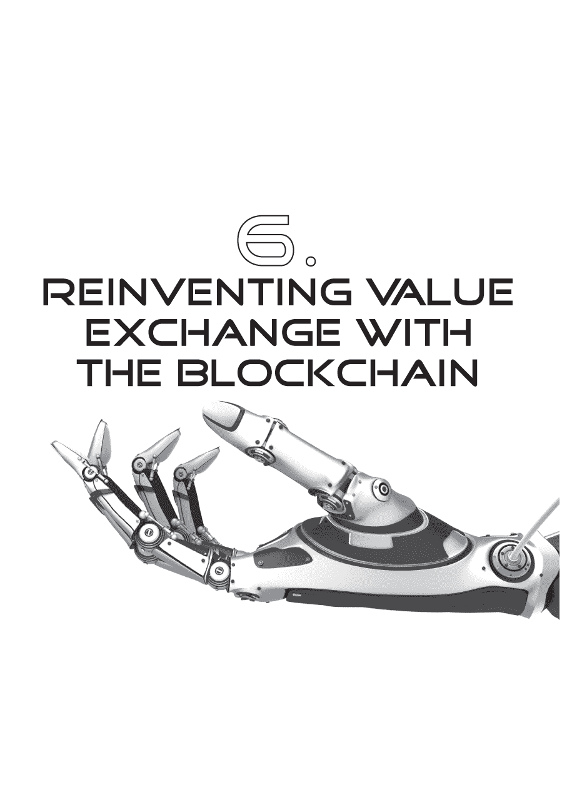

我一直听到银行家们反复叮咛着“比特币不好，区块链好”的口号。这种口号现在变得如此强大，以至于如果你质疑它——比特币真的那么糟糕吗？——所有人都会驳回这种讨论。我现在认为，大多数人驳回这种讨论是因为他们真的不知道比特币是什么。

里德·霍夫曼——LinkedIn 的联合创始人，PayPal 和 Facebook 的早期投资者——谈到了这一点，并说他是在两年前与温塞斯·卡萨雷斯会面后才对比特币产生了兴趣，温塞斯·卡萨雷斯的采访出现在本书的后半部分。里德在这个领域说了一些有趣的事情。

“比特币有三个方面是交织在一起的……首先，它是一种资产，就像数字黄金 2.0 一样。其次，它是一种货币，就像货币是一种数字应用程序，让您可以开始进行交易和贸易。第三，它还是一个平台，在这个平台上，您可以构建金融和其他产品。所有这些属性的结合使我相信，至少会有一种全球性加密货币，并且有充分的理由认为它是比特币，或者比特币是其中之一，如果不是唯一的。”

其他风险投资人和主角们都在谈论比特币货币是一件好事。这让他感到高兴，因为他是为长远投资的，而长远来看，比特币很可能会获胜。那么像里德·霍夫曼、马克·安德森、理查德·布兰森、温塞斯·卡萨雷斯等这样聪明而消息灵通的人士为何如此支持比特币，而银行却不支持呢？我的答案是，大多数声称比特币不好的人，还没有深入了解过它的内部结构。

而比特币之所以对区块链至关重要，是因为没有本地加密货币，区块链是无法运行的。当超过 90% 的所有加密货币交易都基于比特币时，为什么要创造比特币的替代品呢？

### 加密货币和区块链对银行的重要性

区块链将会改变事情。什么是区块链？基本上，它是一个记录交易的总帐系统。你可以在这里找到每个人做的每一笔交易的记录和可访问的电子记录。这可以用于任何合同交换的电子记录。例如，你可以记录一个租赁交易和租赁协议以及应付款项的日期和频率，这些款项会在合同终止之前自动扣除。

如今，大多数这些交易是通过政府机构、法律网络和金融系统以纸质形式记录的。原因是没有办法将这些交易记录在电子上，因为数字服务是不安全和不可信的。区块链通过创建一个安全可信的互联网总帐来改变这一切。这是因为区块链提供了一种价值交换记录方法，即在未经合同各方许可的情况下永远不会进行两次交易。这基于交易的公共记录，结合合同各方持有的安全私钥。因此，当我通过区块链传输价值时，接收合同的人持有一个直到他们将该密钥交给下一个合同方才无法被破解的私钥。

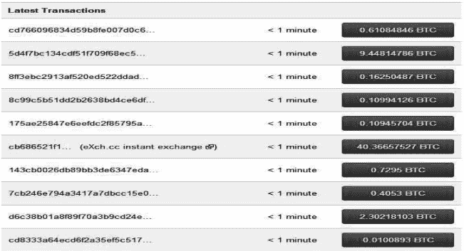

举个例子，如果我像 2014 年美国的一对夫妇那样在区块链上记录了我的结婚誓言，我和我的妻子现在就会有一个对该结婚合同的密钥。我们共享这个密钥，政府和法律体系认可这段婚姻的有效性，因为它在区块链上作为公共记录。只有当我们的离婚被记录在区块链上并且我们放弃认可该婚姻有效性的私钥时，这段婚姻才能被合法终止。

这项技术使数字价值能够在全球开放系统中进行交换和记录，一旦交易发生，就无法撤销。这是关键。

换句话说，区块链协议是一种可以用于任何数字价值交换的记录证明。这就是为什么银行对此感兴趣的原因，因为它可能成为银行系统中的全球价值交换记录。这也是为什么像 Ripple 这样的公司变得有趣的原因，因为它们可以取代为上世纪价值交换建立的一些旧基础设施，这被称为 SWIFT。SWIFT 是在 1970 年代建立的，旨在提供一个电子系统来取代银行中的电报机。Ripple 现在正在创建一个替代这一切及银行与企业客户之间的其他基础设施的对方银行系统，采用实时、共享的分类账系统，可信任。它不是基于比特币，而是基于区块链共享分类账的比特币技术。它也有自己的货币，称为 XRP，尽管它可以随时随地进行交易。

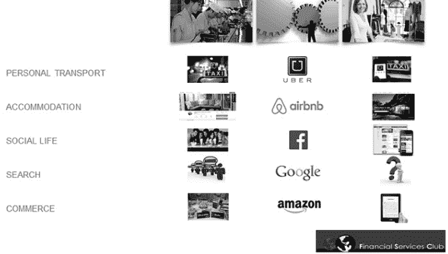

因此，比特币货币并不是重要因素。重要因素是具有密码学安全性的区块链协议，因为这赋予了协议在无需信任第三方（如银行）的情况下记录和转移价值的能力。这项技术可能彻底改变一切，包括银行业。

### 价值网络的优步是区块链

金融科技初创公司正在攻击狭窄的金融领域，并试图用新能力替代核心银行功能，如信贷和支付。TransferWise 和 Lending Club 的商业模式应该让银行感到担忧。但银行业的优步在哪里？这是金融创新者世界中经常问到的问题，因为优步是终极的新技术独角兽。

回答这个问题的关键在于思考 Uber、Airbnb、Facebook 等公司的商业模式。所有这些公司都从事我所说的信息中介业务：通过软件和服务器，将拥有某种东西的人的市场与需要某种东西的人连接起来。软件和服务器成为信息的中介，在价值网络的世界中，它被简化为信息中介。

如果你看一下我之前概述的银行业务模型图表，那么 Uber、Airbnb、Facebook、Amazon 等公司都专注于成为卓越运营的处理中心。它们本身没有产品或服务：Uber 没有出租车，Airbnb 没有床，Facebook 不发布任何内容。它们只是具有出色的能力以实时方式连接人们。

换句话说，所有这些伟大的新公司都在将内容（汽车、床、照片和更新、产品、信息）与上下文（我手中的应用程序或我正在浏览的页面）进行信息中介。因此，如果我为信息中介的新世界重新绘制我的图表，并且包括我们钦佩的信息中介，它将是这样的：

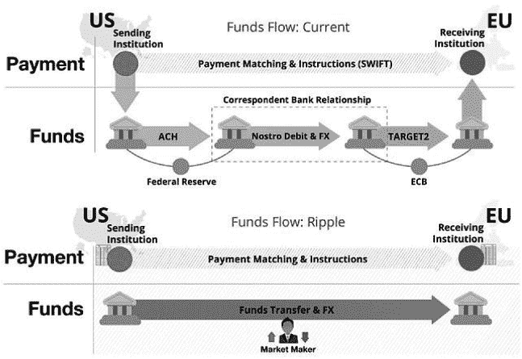

对于金融公司来说，这里有一个问题：价值网络的信息中介在哪里？价值交换的处理机是什么，银行和现有金融机构在这个处理机周围扮演什么角色？

这是一个很好的问题，因为从历史上看，金融系统的处理引擎一直是 SWIFT、VISA、万事达卡、FedWire、CHIPS、BACS 等。现在，这些东西不会快速消失，甚至不会消失，但新的市场结构正在出现。最初，我本来会说是 PayPal，因为他们消除了数字支付的摩擦，但不是 PayPal。PayPal 很好，但是...他们没有改变任何事情。然后我意识到，我们对价值互联网如此兴奋的原因是区块链是我们的新处理引擎。

银行最近对区块链技术变得更加口头表达和明确。2015 年 1 月，美国联合服务汽车协会（USAA）、纽约证券交易所（NYSE）和 BBVA 投资了这些技术（向 Coinbase 投资 7500 万美元）。这两个声明的摘录引起了我的注意：

“本质上，比特币是一种分散式协议，使得世界各地的各方能够交换价值，从而有可能改变金融服务格局。”

—Jay Reinemann，

BBVA 风投执行董事

比特币区块链“是华尔街简化一些相当陈旧操作的机会。”

—Duncan Niederauer，

前纽约证券交易所 Euronext 首席执行官

许多其他银行也开始认识到区块链的潜力：

“货币在其核心上只是用于跟踪债务的分类账，而比特币实际上是我们所见过的最好的通用分类账迭代。”

—John Reed，

前花旗银行董事长兼首席执行官

“区块链是一项真正具有颠覆性的发展，银行对这项技术有很多恐惧，因为在区块链的纯理论中，传统银行的许多流程将变得过时。”

—Thomas F Dapp，

德意志银行研究分析员

实际上，越来越多的动态努力正在使用区块链进行金融价值交换，在 2015 年取得了显著进展：

**Fidor Bank** 是第一个尝试虚拟货币和区块链的银行。他们于 2013 年 10 月与 Kraken 合作，在欧洲创建了一个数字货币交易所，并与德国的 bitcoin Deutschland GmbH 合作。随后，他们与 Ripple Labs 合作，使用其支付协议为客户提供更低成本的多种货币转账服务（2014 年 5 月）。2015 年 2 月，他们与[bitcoin.de](http://bitcoin.de)合作，一个 P2P 比特币交易平台。

拉脊银行（**LHV Bank**）正在与区块链技术开展一个新项目（2014 年 6 月），并开发了基于“有色硬币”区块链技术的 Cuber Wallet 应用程序（2015 年 6 月）。他们还与 Coinbase（2014 年 9 月）和 CoinFloor（2015 年 7 月）合作。

CBW 银行（**CBW Bank**）和 Cross River 银行（**Cross River Bank**）宣布与 Ripple Labs 合作，共同建立风险管理系统，并提供低成本的跨境支付交易（2014 年 9 月）。

美国互助协会（**USAA**）、纳斯达克和西班牙对外银行（**BBVA**）投资于 Coinbase（2015 年 1 月）。

高盛公司（**Goldman Sachs**）作为领头投资者参与了价值 5000 万美元的比特币初创公司 Circle Internet Financial Ltd.的融资（2015 年 4 月）。

瑞士银行（**UBS**）在伦敦设立了一个专注于区块链技术的研究实验室（2015 年 4 月）。

美国纽约银行梅隆银行（**BNY Mellon**）已经创造了自己的货币“BK Coins”，作为一个企业认可计划，可以兑换礼品和其他奖励（2015 年 4 月）。

星展银行（**DBS Bank**）与 StartupBootcamp FinTech 和 CoinRepublic 合作，在新加坡举办了一个区块链黑客马拉松（2015 年 5 月）。

纳斯达克（**Nasdaq**）启动了一项企业级区块链技术倡议（2015 年 5 月）。

澳大利亚联邦银行（**CBA**）与 Ripple Labs 合作，为其子公司之间的支付结算实施了一个区块链分类帐系统（2015 年 5 月）。

澳新银行（**ANZ Bank**）与 Ripple 合作，探讨区块链的潜在用例（2015 年 6 月）。

西太平洋银行（**Westpac**）与 Ripple 合作，与其员工一起测试了一个低价值跨境支付的概念验证（2015 年 6 月）。

巴克莱银行（**Barclays Bank**）宣布他们正在与一系列初创公司合作，包括 Safello，探索如何在金融服务行业利用区块链技术（2015 年 6 月）。

桑坦德银行（**Santander**）宣布了 20-25 个用例，通过转向区块链技术，可以节省 120 亿英镑（190 亿美元）的银行基础设施成本（2015 年 6 月）。

巴黎银行（**BNP Paribas**）试验使用区块链使交易更快（2015 年 7 月）。

**法国兴业银行**开展了一个培训计划，向员工提供比特币、区块链和加密货币方面的专业知识（2015 年 7 月）。

**花旗银行**在花旗银行内部建立了三个使用基于区块链的分布式技术的独立系统。他们开发了一种类似比特币的货币叫做“花旗币”，该币正在内部使用以更好地理解数字货币交易系统（2015 年 7 月）。

**德意志银行**发布了一份白皮书，指出“银行完全可以设立一个新的数字预订和清算系统，使它们能够提供具有区块链优势的客户交易，如速度、效率、国际性和成本节约”（2015 年 7 月）。

**英国银行**宣布各国央行正在考虑实施涉及分布式账本技术的“混合系统”，这种技术目前用于记录比特币交易（2015 年 7 月）。

自 2015 年 8 月起，美国瑞波用户现在可以从**富国银行**、**美国银行**、**Capital One**、**Capital One 360**、**美国军人及退伍军人协会**、**TD 银行**、**美国银行**、**PNC 银行**或**摩根大通银行**向他们的瑞波账户存款。

区块链允许金融系统提供价值交换的处理引擎：*我想要交换价值——将我与正确的价值代币和价值存储连接起来进行交换*。

区块链不是引擎。它是技术。它是价值网络的优步，或者说，是那些拥有价值和需要价值的人之间的信息中介工具。

#### 银行与区块链相关的公告时间表

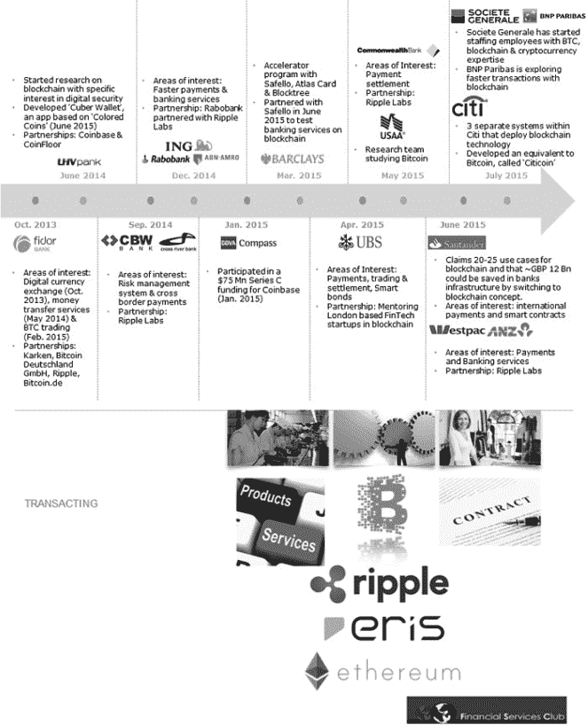

### 数字身份需要数字基础设施

实际上，区块链的一个关键属性，结合刚才描述的移动身份验证，是它可以几乎免费地解决全球贸易的身份问题，点对点。这是一个重大问题，因为在互联网上没人知道你是一条狗，但银行需要知道，因为如果他们搞错了，他们可能会被严重罚款。

这就是为什么银行界要花费数日来讨论 KYC（了解您的客户）。有一个很有力的论点，即在数字时代，我们需要数字身份，最有可能的结果是，十年后，你和我在某种共享分类帐系统上的数字身份。

当下看看 KYC 的现状，这是一种遥远的方法。今天，大多数国家的反洗钱（AML）规则要求出示护照和水电费账单以核实地址和个人身份。北欧是个例外，因为北欧市场已经看到政府和银行合作推广数字身份（据我所知，除了亚洲部分地区外，这是唯一做到的地方）。

通过难以信任的交易对手通过多层嵌套帐户路由支付是复杂的。但是肯定所有关于护照和水电费账单、声明和签署人、KYC 和 AML 的对话，都在推动对新数字基础设施的需求来清理这一困境？多年来，我们的冲卡和磁带基础设施已经造成了这一困境，限制了信息的共享和路由。在大数据时代，我们没有这些数据的事实令人震惊。

与此同时，我们有数百家不同的解决方案公司试图解决数字身份基础设施挑战，却没有一个统一的、协调的全球性倡议来有效解决这个问题。

**侧链**

区块链允许你创建一个对所有人都可访问且安全的公共分类帐系统。这通过公开记录由私钥保护的交易来实现。因此，在私钥传递之前，区块链上的任何交换都是安全的。在那一刻，分类帐记录了密钥的交换和数字资产的移动，这种资产可以是从货币交易到证券结算再到抵押契约再到婚姻合同的任何东西。

实际上，为了让不同的市场创建不同的区块链来记录这些不同风格的交易，现在有了这些东西叫做*侧链*。侧链只是区块链的衍生品，用于记录特定市场交易，比如房产转让，并且与主区块链并行。

这是所有银行都感到兴奋的技术，因为它允许数字资产的交换以接近免费的方式进行数字记录。本书后半部分的访谈说明了围绕这项技术的激烈辩论。这场辩论的核心是区块链技术是否需要以比特币货币为基础。对于一些人来说，比如乔恩·马托尼斯，这是确定的。你为什么要创建另一种货币呢？对于另一些人来说，比如杰弗里·罗宾逊，一旦区块链得到认可并使用美元、欧元或日元运作，那么你为什么还需要比特币呢？你可以自己做出判断。

### **区块链是否会取代 SWIFT？

我在最近的一次大会上发表主题演讲时，说了一个稍微具有挑衅性的评论。事后证明，这引起了媒体的关注，报道称我“表示，虚拟货币比特币背后的编码也可能具有巨大的变革意义，甚至有可能取代 SWIFT 网络进行银行间支付”。

这引发了很多争论，因为 SWIFT 是全球银行业的支柱。建立于 1970 年代，用于将电传机替换为电子转账，SWIFT 是由全球银行系统共同资助的网络，可确保资金安全转移。它的名字表明了它的合作性质，SWIFT：全球银行间金融电信协会。

SWIFT 提供了一个网络，使金融机构能够在安全、标准化和可靠的环境中发送和接收有关金融交易的信息。绝大多数银行使用 SWIFT 网络进行汇款，截至 2010 年 9 月，SWIFT 与 209 个国家的 9000 多家金融机构相连，每天发送和接收超过 1500 万条消息，而 1995 年的日均消息量仅为 240 万条。在更广泛的背景下，银行每天以货币交易约 5 万亿美元，其中大部分通过与 SWIFT 网络的消息交换来处理。

因此，说一种新技术，区块链，能在一夜之间消灭一家 50 岁的银行所有的网络是主动的。但是，也有很多观点表明了对比特币的完全不理解，但情况正在改变。银行正在觉醒对比特币和更重要的是区块链及其改变银行业的能力。这是一种在公开开发的技术，具有比历史上任何开源项目都更多的计算能力，可能会从根本上重新发明银行系统……但很少有银行家了解它，这是最近与几家银行的辩论所证明的。

首先，有人认为比特币纯粹用于支付。不是的。比特币协议和其他加密货币用于记录数字价值交换，可以采取任何形式，从支付到婚姻誓言。

第二，它不能威胁 SWIFT 这样的东西，因为 SWIFT 不仅仅是支付。例如，SWIFT 一半的活动都是在证券结算领域。但是区块链技术可以像记录婚姻合同或支付一样轻松地记录证券结算。这可以通过新推出的投资市场服务 Colored Coins 证明，该公司在区块链上记录投资活动。

第三，新兴加密货币无法威胁 SWIFT，因为 SWIFT 具有可扩展性、安全性、弹性和提供网络信任的历史。再次错了：比特币现在正在使用比 SETI（Search for Extra-terrestrial Intelligence）更具规模化和能力的网络计算力量，后者是世界上先前最大的网络系统。

第四，比特币区块链引起了兴趣，但并非货币。有些人认为这是错误的。他们声称，你不能在银行业中使用区块链而不使用本地货币——而且为什么要在它已经投入了五年时间和数千个人时的开发工作的情况下替换比特币作为本地货币？这是一个有趣的讨论，我个人不同意这一观点，因为你可以有一个美元链或欧元链，而不是比特币区块链，但只有时间能证明这一点。

第五，Mt.Gox 的倒闭摧毁了人们对比特币及其生态系统的所有信任。不，仅仅因为一个不稳定的交易系统倒闭并不意味着比特币协议的健壮性被削弱。

第六，使用它很困难。是的，但这正在迅速改变，多亏了比特币生态系统。像 Circle 和 Ripple 这样的公司正在改变游戏规则，比特币就像蒂姆·伯纳斯-李在给我们万维网之前的互联网一样。它正在快速改变，并变得更容易使用。

最后，因为它只是一种加密货币，所以它并不重要。错了。它是一个协议，一种商品，一种技术，一种智能合约系统，一个总帐，一个安全的交易所……是一种多样化的事物。

现在，我一直在写有关比特币的文章，不是因为我在推广它，而是因为它有潜力重新定义我们所知的银行业务、货币和监管。区块链技术是价值网络的核心技术。

### 价值网络对银行分行意味着什么？

大多数银行业观察家认为银行不需要分行。大多数银行家说银行需要分行。谁是对的？我会赌银行家是对的，因为他们从事这个行业。但是，很明显，我们不需要那么多分行。

欧洲央行（ECB）2013 年的一份报告发现，在过去十年中，分行关闭数量显著增加。自 2009 年至 2013 年间，欧洲各地的银行关闭了约 2 万家分行，其中包括 2012 年关闭了 5500 家，2011 年关闭了 7200 家。这意味着自 2008 年全球金融危机爆发以来，欧洲所有银行分行约 8％的关闭，并且这种裁员预计将在未来多年持续下去，这要归功于金融科技和数字化。

西班牙的削减最为严重，使得该国多年来扩张的地区储蓄银行业务受到破坏，这些银行曾让该国拥有欧洲最大的银行网点网络。到 2012 年底，其分行数量比四年前减少了 17％，但是，西班牙仍然拥有欧洲人均最多的分行数量——超过 38200 家分行，即每 1210 人拥有一家银行分行。法国的分行数量最多——38450 家，即每 1709 人拥有一家银行分行。法国在截至 2012 年底的四年内将其银行分行网络缩减了 3％，而英国的银行分行减少了 5％，德国的银行分行减少了 8％以上。在那些已经高度数字化的国家，分行关闭的数量更为显著，比如丹麦，那里的分行数量减少了三分之一，以及荷兰，那里关闭了四分之一的分行。

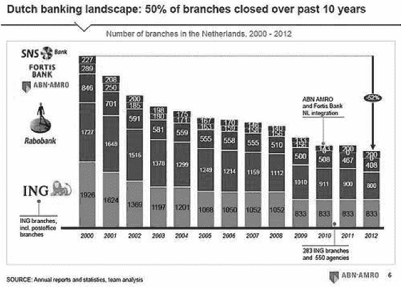

唯一一直反对关闭分行的国家是美国，从 2000 年的约 8 万家扩大到 2012 年的超过 9.5 万家。事实上，自 1980 年至 2010 年，美国的银行分行数量翻了一番，自美国联邦存款保险公司开始追踪以来，该行业只有三次减少分行数量。然而，即便是在那里，我们现在也看到分行的关闭。2013 年，美国的银行分行数量下降到了 97,337 家，反映出 2012 年有 867 家分行关闭，而 2011 年仅有 315 家关闭。美国银行的分行数量在 2013 年第三季度下降了 6%，降至 5,243 家。花旗集团在 2013 年末时大幅削减了分行数量，从 2012 年的 4,069 家削减到了 3,777 家。

在 2015 年春季发布的英国银行家协会（BBA）的一份报告《我们现在的银行方式》中指出：

• 2014 年，随着客户将更多交易渠道化到电话和互联网上，英国银行分行的使用量下降了 6%。

• 20 年前，英国的分行数量从 13,349 家减少到了 2013 年的不到 9,702 家。

• 2009 年，英国客户几乎打了 5000 万次电话给银行，以在他们的账户之间转账。到 2013 年底，这个数字已经下降到仅仅超过 1600 万。

• 2008 年至 2013 年间，电话交易下降了 43%。

• 2015 年 3 月，全国银行应用程序每天被使用了 1050 万次，超过了互联网银行服务每天的 960 万次登录，而且这两项服务仍在快速增长。

• 过去一年有超过 800 万人下载了银行应用程序。

• 在一个典型的星期里，英国人通过应用程序转账高达 £2.9 十亿。

• 去年，银行分行完成了 4.27 亿笔交易，相当于每天 117 万笔（假设它们每周七天开放）。

• 转向在线服务使得英国有 640 万从未使用过互联网的人与其银行渐行渐远。

1990 年至 2015 年间，英国银行的分支数量减少了一半，高级银行家们公开表示，覆盖整个英国的银行拥有 700-800 家分店的网络将是最佳规模。而大五银行中没有一家拥有如此少的分店。2014 年底，劳埃德银行拥有 2260 家，苏格兰皇家银行则有 1750 家。2008 年至 2012 年间，英国银行关闭了 557 家分店，导致 2012 年底仍有 11713 家分店。

有些人会利用这些信息声称银行分支正在消亡；银行不再重要；移动数字化才是王道；即使银行不改变，客户也会转向替代媒介。我对这种观点持有不同意见，原因有很多，但核心问题归结为以下。

首先，即使是数字化公司，如果没有其他原因，也会觉得有必要有实体存在，因为他们需要让客户相信他们是真实存在的，可以信任，并且有人类支持。

第二，纯数字化的银行服务将焦点缩小到只有那些想要纯数字化服务的客户。这些客户通常都很成熟，自信，并且善于处理金钱。这与年轻的千禧一代或 i 世代不同，他们在技术方面自信并且能干，但不太熟悉现金。后者只有在涉及到大事情，比如买第一套房子或者投资养老金时才希望有人类的接触。

第三，可能是最重要的因素是，数字化银行有两种形式：一种是基于应用程序的数字形式，提供最佳用户体验，客户的方式比较复杂；另一种是基于短信的移动形式，提供最简单的用户体验，客户比较基础。这两个因素对未来的银行服务至关重要。事实上，金融包容性的移动支付具有变革性，因为它使以前被排除在金融网络之外的 50 亿人被纳入其中。然而，我根本不同意的是银行可以只以数字形式存在。我不同意的原因是，几乎没有纯粹数字化的巨头——谷歌、脸书、亚马逊、优步——但是所有这些都有实体形式。

换句话说，挑衅性的观点认为货币只是数据，可以完全数字化而不需要银行参与，这是一个有趣的理论，在梦中可能实现，但在现实中不可行，因为当涉及到真实货币时，社会希望与真实场所的真实人员打交道。

尽管自 1980 年代以来，大多数银行一直在减少其高街业务的规模，但银行分支机构的消亡被夸大了。在过去三年中，英国超过四分之一的银行分支机构已经翻新，明确表明了对实体店的承诺。

2015 年《我们银行的方式》BBA 报告

英国银行家协会首席执行官安东尼·布朗（Anthony Browne）宣布，传统银行分支机构已经死亡。布朗在 2014 年 7 月的《星期日电讯报》上写道，银行的黄金时代已经结束。在数字时代之前，与银行打交道要困难得多，因为你被限制在时间和约会上，被迫亲自访问分支机构和你的经理。

*我们现在的银行方式更加简单快捷。在没有取款机的时代，分行甚至不会每天开放，更不用说周末了。柜台会在下午 3 点 30 分准时关闭。您只能通过访问分行并让出纳员将余额写在一张纸条上来了解您的余额。现在，我们可以每天 24 小时、每年 365 天获得资金访问。*

*如今，数百万人可以随时随地使用手机应用程序检查余额、进行付款并申请信用。我们可以随时通过电话、电子邮件或社交媒体与银行联系。*

*数字银行已经改变了服务速度。在 70 年代，甚至安排讨论抵押贷款的约会都可能需要数月时间。汇丰银行最近在 24 分钟内完成了一项在线房屋贷款申请。我们大多数的主要银行每年看到分支机构交易量下降 10%。*

布朗的评论得到了各种银行统计数据的支持。例如，英国的巴克莱银行在 2014 年 9 月宣布了一整套有趣的数据：

• 巴克莱智能手机银行应用程序每秒被访问 32 次。

• **每月通过智能手机应用程序处理的交易金额达到 470 亿英镑；** 每秒超过 1800 英镑或每分钟超过 1.09 万英镑。

• 巴克莱移动银行现在占所有数字登录的 75％。

• 平均巴克莱客户每月不到两次访问分行，但每月使用移动银行 26 次。

• 巴克莱移动银行应用程序自两年前推出以来已被下载超过 900 万次，每周访问次数达到 1900 万次。

这引发了关于数字与非数字未来的另一场辩论。随着我们将一切都数字化，我们会失去一些东西吗？取消面对面交流是否消除了银行业的一个关键要素？

我认为可能会如此，结果会是我们看到了一个两级银行体系。一级银行体系将是完全数字化的。所有交易都将远程进行，并且大多数金融需求将通过屏幕流程满足。这在波兰的 mBank 很好地体现了，他们希望与发薪日贷款公司竞争（Wonga 最近进入了波兰市场），因此他们使用自己的应用程序创建了一个可在不到一分钟内完成的贷款功能。mBank 的贷款允许客户在提出请求后的 30 秒内将资金存入他们的账户。这是如何实现的？

这是通过实时分析每位 mBank 客户并为他们设置最大贷款额度实现的。这意味着当客户想要贷款时，他们已经获得了预批准。因此，您加载应用并请求贷款。应用程序会显示您被提供的最大贷款额度。然后，您选择要借款的实际金额和期限，应用程序会显示包括所有利息和费用在内的总月付款额。一旦您同意，就这样。资金将在 30 秒内存入您的账户。

这打败了发薪日贷款公司在他们自己的游戏中——Wonga 的秘密武器在于实时分析——并展示了银行如何利用他们的数字资产。但是我们失去了人性化因素。人性化因素是看到真实风险和真实需求之间关系的能力。旧的分行经理关系是在确定客户是否*靠得住*方面非常重要的。旧的分行关系在复杂对话中仍然是重要的，企业客户需要深入讨论贸易融资需求。旧的分行结构在为数字体验增添人性化方面至关重要。

mBank 等公司会声称情况并非如此——你可以通过 Skype 连接轻松为客户提供服务——但我并不认同。这就是为什么会有一个两级系统。那些完全适应屏幕对屏幕的客户将专注于提供惊人直观、无摩擦数字服务的无分支银行。例如 mBank。那些寻求更少自助服务、更多对话以及基于情况和需求而不是个人资料和信用评分进行决策的客户，将继续依赖于通过分支或更可能通过代表访问他们的办公室或家中而进行的物理接触的银行。这就是我看到的未来：不是基于分支的模式，而是一个有人性的模式。

那就是战场所在：连接人类与网络，人性化数字关系。这不是一个明确的分支还是无分支，全部数字还是部分数字未来，而是一个多层次的竞争结构，有些人比其他人做得更对。

### 这是否会导致数字鸿沟？

我讨厌使用人口统计数据，因为在数字领域，我更喜欢心理人口学。作为一个婴儿潮一代，我更像是一个数字原住民，因为我在技术行业发展了我的职业，但根据我的人口统计资料，我是一个移民。事实上，这并不那么重要，因为在使用分支和支票方面，存在一些明显的人口统计差异。年长者更喜欢分支和支票，而年轻人更喜欢手机和应用。

现在这种方法看起来是年龄歧视的，但研究支持这样的结论。例如，社会市场基金会去年对英国消费者的访问偏好进行了研究，并发现：

62%的人仍然更喜欢在银行网点进行面对面服务来获取银行服务。虽然我们可能会在网上比价和订购商品，当然这也是我们查看房地产列表的地方，但有十个人中有八个人更愿意去网点寻求理财建议；几乎七成的人想要开设或升级活期账户；只有当我们询问简单的支付交易时，其他渠道——主要是在线银行——才成为常见的偏好…… 富裕阶层（AB 社会阶层）和年轻人（25-34 岁）对网点的偏好程度较低，超过一半的这些群体更偏好其他渠道。他们态度上的这种趋势是显著的，因为富裕阶层由于其较高的存款，为银行的净利息收入做出了最大贡献；而年轻人在这些年里获得了最多的金融产品和服务，为银行的收费收入做出了最大的贡献。

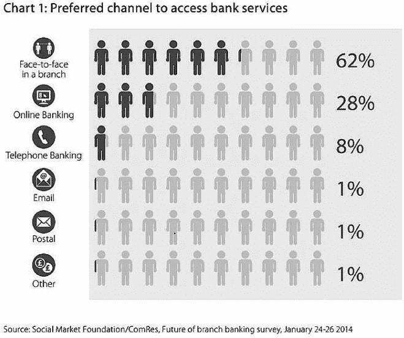

换句话说，具有财务能力和信心的人和数字原住民不喜欢网点，这意味着财务状况较差和数字移民是网点的用户。下图显示了使用在线银行的偏好，随着年龄增长或财务状况较差，偏好度下降。

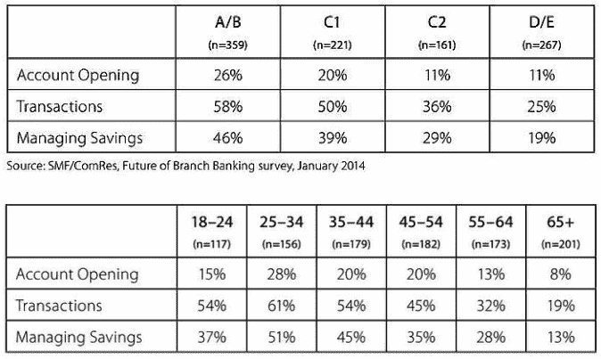

现在我要说的重点实际上并不是关于年龄和人口统计学的。这是一个完全不同但重要的观点：作为一个行业，我们对于太多的人提供了太多的选择，这是过于包容了。

每当我们为银行引入一项新的接入服务——移动和应用程序——我们不会关闭旧的服务——网点——因为一些人有时会使用一些服务。只要有些人使用某项服务，我们就会保持其可用性。

这与几年前支付委员会提出消除支票的想法相似。当时引起了巨大的反响，因为老年人使用支票，所以这一举动被撤销了。有多少老人使用支票？目前没有很多关于这方面的最新信息。例如，2013 年为英国政府准备的一份文件中，只有两段话谈到了支票使用的人口统计信息：

女性比男性更有可能随身携带支票簿（47%的女性表示购物时总是随身携带支票簿，而男性只有 19%）。支票在 50 岁及以上的人群中最受欢迎……支付委员会（之前称为 APACS）2005 年进行的一项针对零售商的支付调查发现，46%的支票使用者年龄在 55 岁及以上，尽管这个年龄段的人口只占成年人口的 34%。

然而，这一点强调了分支机构访问的问题：我们仅仅是因为少数公民想要使用它而继续延续上个世纪的这些过时服务。

与此同时，我们推出了新的服务，被数字原住民和移民迅速吸收，并发现自己陷入了困境。英国银行家协会（BBA）的报告《我们现在的银行方式》展示了事物的变化有多快。2014 年 6 月的主要统计数据包括：

• 银行提供的应用程序已经被下载了**超过 1400 万次**。其中一些服务在短短几年内已经达到了超过 10 亿次的使用量。

• 手机银行很受欢迎，但许多客户仍更喜欢通过互联网银行进行较大额的交易。每天有近**10 亿英镑**通过互联网进行转账。

• 网上和手机银行现在每周的交易金额为**64 亿英镑**—比去年的 58 亿英镑还要多。

• 移动电话和平板电脑的银行应用现在已经被下载了**超过 1470 万次**—2014 年每天以约 15000 次的速度增长了 230 万次。

• 网上银行服务通常每天接待 **700 万次登录**。

这里的人口统计数据与支行和支票收集的数据相反。例如，巴克莱 Pingit 于 2012 年推出，在三个月后提供了一些有趣的发现：

• 29 percent 的用户年龄在 18-25 岁之间

• 37 percent 的用户年龄在 26-35 岁之间

• 26 percent 的用户年龄在 35-50 岁之间

• 7 percent 的用户年龄超过 50 岁

美国的数据也显示了类似的情况，皮尤研究于 2013 年 8 月发布了一份关于在线银行用户的报告。他们的调查结果显示，49 岁以下的人比 50 岁以上的人更频繁使用在线银行服务。

|  | **使用基于桌面的在线银行服务的百分比** |
| --- | --- |
| 18-29 岁 | 67 percent |
| 30-49 岁 | 65 percent |
| 50-64 岁 | 55 percent |
| 65 岁以上 | 47 percent |
| 所有互联网用户 | 61 percent |

同样，受过较高教育和收入较高的客户更有可能上网，而受教育程度低、收入较低的客户不太可能上网。

| **教育程度** |  |
| --- | --- |
| 没有高中文凭 | 30 percent |
| 高中毕业 | 47 percent |
| 一些大学 | 66 percent |
| 大学及以上学历 | 75 percent |
| **家庭收入** |  |
| 年收入不足 $30,000 | 48 percent |
| 年收入 $30,000 至 $49,999 | 57 percent |
| 年收入 $50,000 至 $74,999 | 71 percent |
| 年收入 $75,000+ | 75 percent |

所以，我们真正拥有的是银行提供的服务，并试图做到面面俱到。银行试图一直取悦所有人，但这是行不通的。数字原住民和移民为跨越支行和纸质用户的成本交叉补贴付出了代价。我们会看到银行业出现数字鸿沟吗？数字人群会迁移到成本高效的纯数字平台，将老年人和贫困人口留在物理网络中吗？

更有可能发生的是，老年人将不得不让他们的孩子和孙子为他们办理银行业务，而贫困人口将使用移动金融服务以获得网络包容性。然而，在这个过渡期间，地板上将有一些血，最可能的变化是纯数字化公司获得最富裕和最精明的客户，使现有银行面临更大的困境。

关闭太多分行，太快，就会被指责; 不要关闭分行得够快，就无法竞争。

### 银行分行在数字化时代的作用

在摩根大通 2015 年的投资者日上，他们宣布了三件引起金融科技头条的事情。首先，自 2014 年 10 月在美国推出以来，Apple Pay 已经被超过一百万持卡人激活：

• 自十月以来，卡片激活持续增长，自 Apple Pay 推出以来已激活了 100 万张卡片

• 注册到 Apple Pay 的卡片中，69％是信用卡

• 58％的活动集中在前五大商家身上（摩根大通没有列出这些商家）

• 用户年轻且更富裕，这并不令人意外

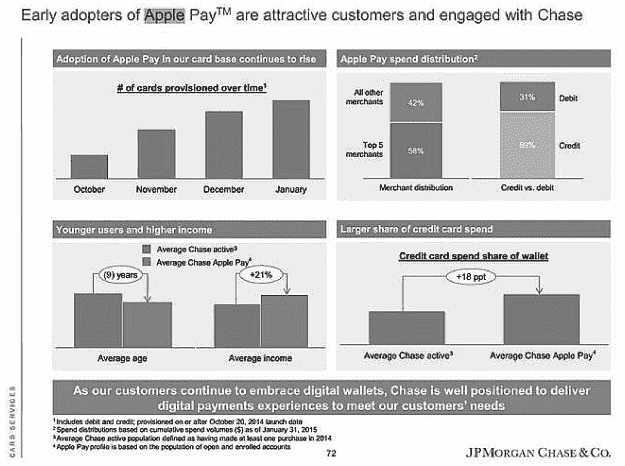

第二个公告是关闭分行，因为客户转向数字化：

摩根大通计划到 2016 年底削减大约 300 家分行…… 摩根大通预计的分行削减约占其总体业务面积的 5％。这是从 2012 年和 2013 年该银行分别增加了 106 家和 28 家净分行的情况的转变。2014 年，摩根大通将 28 家银行从其业务面积中削减掉。在 2013 年至 2014 年间，该银行裁减了大约 6,500 名员工，或者说裁减了 11％的分行员工。

第三个注意到的事情来自 Javelin 对投资者电话的分析：

近日，许多媒体在报道 J.P.摩根投资者日后的新闻时，都将焦点放在这家银行巨头计划关闭数百家银行分行上。乍看之下，这是事实。但这就好比只关注裁员而不计及公司其他部门的招聘，而这些部门可能推动未来的增长和就业。事实上，摩根大通的这则新闻是关于精简运营，而非简单地砍掉……当然，摩根大通确实预计将在接下来的两年内减少其 5602 家分行数量，但减少幅度仅约为 300 家……引用年度数据，摩根大通报告称，其移动应用用户（增长 20%）、移动快速存款交易（增长 25%）、移动快速支付交易（增长 80%）、移动账单支付（增长 30%）和 ATM 存款（增长 10%）大幅增加。此外，对摩根大通分行和 ATM 的一项重要里程碑是：2014 年首次客户通过数字渠道的存款超过了柜台窗口（ATM 48%、移动存款 10%、柜员窗口 42%）……摩根大通得出结论，数字化使用促使客户更为投入、更满意，且更不易转换银行。他们进行更多的交易，并在成本效益高、自助数字渠道中进行这些交易。而当他们确实需要前往分行时，分行依然不少——重点是更多关注客户和摩根大通的双赢的面对面互动。

这让我想起 TSB 宣布他们已经吸引了大量的账户切换者。TSB 是一家位于英国的拥有 700 家分行的银行，根据欧洲竞争规则从劳埃德银行分离而出，被迫进行新旧银行的 IPO。他们明确表示，他们获得了良好的客户获取——2014 年新增了 50 万个账户——但这是因为他们拥有适当的客户接入方式，特别是包括分行在内。

在他们的首年业绩报告中，他们还发布了一份报告，《为什么分支机构在数字时代很重要》。在介绍中，数字银行 Virgin Money 前首席执行官保罗·佩斯特清楚地解释了分支机构的重要性：

有人认为，由于技术和创新正在彻底改变客户与他们的银行和资金互动的方式，这是唯一竞争的方式，新兴的仅数字化提供者——无论是来自银行业还是其他地方——将会使分支机构变得多余。近年来，主要的传统银行不断关闭分支机构，这一稳定的趋势使这一理论变得更加可信。

TSB 的思维方式与众不同。

TSB 认为银行业的未来在于分支机构和技术，使客户能够在他们想要的地方、想要的方式和想要的时间进行银行业务。是的，客户正在以前所未有的速度采用移动和数字银行业务。但是，对于消费者来说，拥有一个位于方便位置的分支机构的重要性仍然像以往一样重要。

报告还指出了支持这一观点的研究：

尽管网上银行业务正在增长，但分支机构对于客户仍然很重要。来自 ComRes 的新数据显示，69% 的人认为在他们居住地附近有银行分支机构是重要的。

实际上，大多数银行声称，开设账户受当地分支机构的影响最大。也许会有变化，但是，如今情况仍然如此。

最后，还有一些其他因素在起作用。例如，英国第一家纯数字化银行 Atom Bank 明确表示，最满意的客户是那些不去分支机构的客户……但他们也是最具财务信心和能力的客户。如果你对金钱有信心，你会想要自己控制它。你不想让别人来和你谈论它，在这种情况下，最满意的客户就是你从来没有见过的客户。

然而，大多数首次开户的人并不对金钱有信心。他们年轻，从未有过抵押贷款或储蓄账户，可能是第一次拿到工资支票，并且在许多情况下，都在为债务而奋斗。对于这些年轻的市场目标客户以及那些对金钱感到紧张的人来说，分行发挥着至关重要的作用。

这得到了许多银行的研究结果的支持，这些银行并不是数字银行的目标。换句话说，目标是那些转换账户的人，年龄超过 30 岁且对金钱有信心的人。对于其余的人来说，他们希望在真正的银行店里进行严肃的银行业务。

#### 为什么数字银行要开设分行？来认识一下 CheBanca!

我在 2015 年夏天访问了意大利的 CheBanca!的 Roberto Ferrari（请参阅书的后半部分对 Roberto 的采访）。对于不了解 CheBanca!的人来说，它是由 Mediobanca 于 2008 年推出的数字银行。Mediobanca 在意大利提供商业银行服务，之前从未有过零售银行。因此，在后金融危机的数字时代，实施适合意大利的金融科技银行是有意义的，而 CheBanca!声称自己就是那个银行。数字优先的银行并不意味着只有数字银行，Roberto 非常自豪地向我展示了他的分行。

一个有分行的数字银行？是的。到目前为止，CheBanca!已经开设了近 50 家分行，而且还会有更多。这在获得信任和存款方面至关重要，其主要目标是实现数字银行难以实现的三个目标：

1\. 信任

2\. 品牌

3\. 服务

当你不可见、未经证明和不为人知时，这三样东西就更难实现。然而，Roberto 和他的团队给我提供了一些有趣的统计数据，可能支持这一说法。

首先，分行区域的资产持有量是未设分行区域的 2.5 倍。这加强了第一条：信任。当你能看到资金的流入和流出时，这比看不见的银行建立了更多的信任。

第二，CheBanca！每月获得 4,000 名新客户，其中 45％来自分支机构，37％来自远程联系（其中 37％的大部分，即 30％，来自互联网）。其余的 18％的余额来自第三方的实体渠道。这意味着今天令人震惊的 63％来自直接的实体联系，显示了对分支机构服务的信任增加，以及分支机构在建立品牌方面的实力。

第三，客户行为表明，对于服务，他们更喜欢数字化，有 37％的客户仅通过数字化渠道处理所有交易。然后还有第二组客户，总数的 26％，他们完全通过网络和呼叫中心进行远程服务来处理 CheBanca！。第三组大约占所有客户的 28％，他们使用所有访问点（网络、呼叫中心、分支机构）。最后，只有 9％的客户只在分支机构交易，其他地方不交易。

然而，考虑前两组——他们会信任一个零分支的纯数字公司吗？对于后两组——对于超过三分之一的客户（37％），分支机构在数字优先银行中仍然很重要。

有趣的是，当您观察客户如何与银行进行交互与执行交易时，这些数字继续证明了这一点。所有联系的巨大 89％都通过数字渠道访问，是分支机构联系量的三倍。仅有 9％的客户每月访问分支机构，而有 7％的客户联系呼叫中心，42％的客户通过数字渠道进行互动。

所以关于数字优先的银行分支，有一些不同之处。例如，一旦你进去，看起来有点空荡荡的。

你能看到的只有一个拿着 iPad 的礼宾，一个看起来像出纳的机器（但实际上不是），以及后面可能是一个*星际迷航*传送站的东西（而且确实是）。

从分行的另一个方向（L 形状）看，你会看到几个出纳员站点。这些站点是与人讨论账户开立、服务和建议的地方，这里的典型员工是没有专业银行背景的客户代理人。

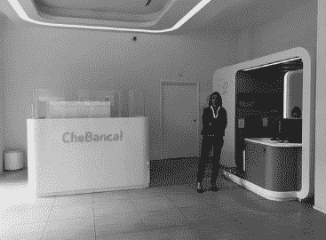

最后，在 L 形结构的后面有几个带磨砂玻璃窗户的房间。这些是专业咨询站。在这里，客户必须预约与理财经理、抵押贷款顾问或类似人员见面。然而，如果你只需要建议，就不需要等待，因为你可以去传送室。传送室是后面的这个奇怪的时髦站。

一旦你坐在这个站点，它有各种酷炫的功能，比如使用数字签名的生物识别和与视频操作员共享屏幕。

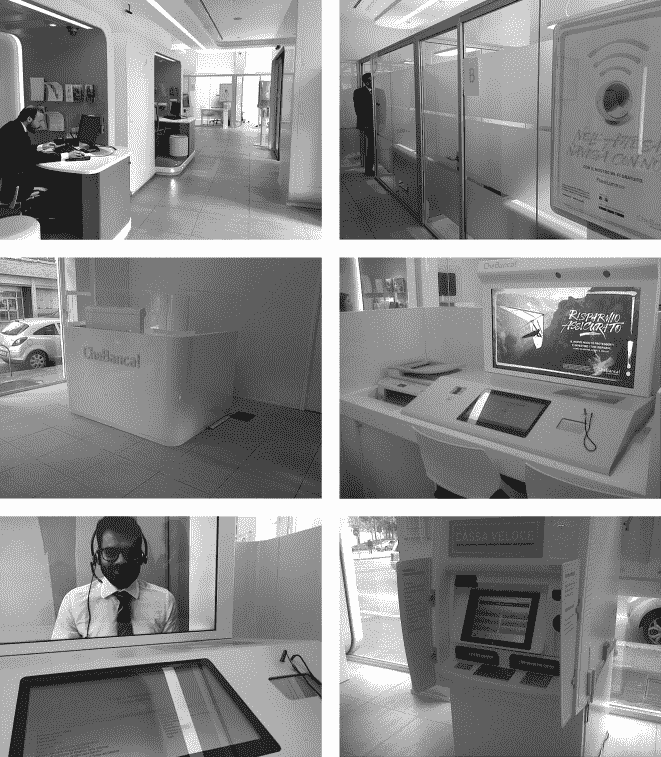

这个特定的分行每月为这些视频站服务大约 259 名客户，并且已经证明在扩大和加深客户关系方面取得了成功，使用那些老式银行的交叉销售和增值销售指标。据银行称，服务视频站的交叉销售和增值成功率为 15%。

最后，如果你只想存支票或现金，你可以使用有趣的自助机器。自 2008 年开业以来，CheBanca！总共拥有超过 50 万客户，并且正在推出其数字分行格式。如今，基于新格式有四个分行。到 2015 年 9 月底，将在一些中型和大型城镇的选定样本中增加到八个。同样，该银行打算从 2015 年 9 月开始通过 Skype 推出视频站体验。

总的来说，我喜欢数字分行概念的很多方面。我知道有人会扔石头，说数字客户不需要分行，但今天的统计数据和客户不支持这种观点。

我唯一不喜欢的是让零售商负责客户服务并谈论交叉销售和跨销售。我相信 CheBanca! 和罗伯托会尽最大努力细心处理此事，因为他们想成为意大利最酷的银行，根据这次经历，他们很可能是。正如他指出的那样，CheBanca! 过去三年被评为意大利客户满意度最高的银行，并且拥有 47 的净推荐分数（NPS）。他声称“销售是真正客户满意度的结果”。
