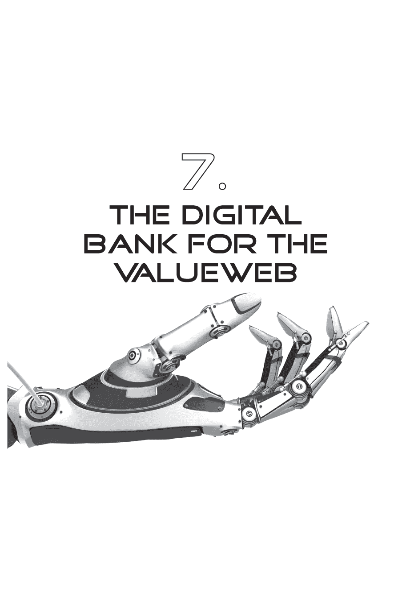
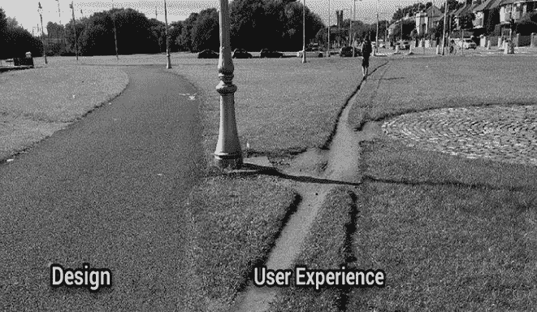
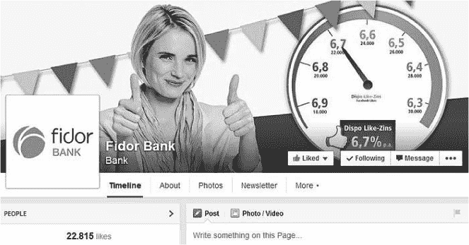

在我们已经讨论了作为一家带有分支机构的数字银行的 CheBanca! 之后，我们现在将审视数字银行的特点。数字银行是针对通过金融科技发展的价值网络而创建的。由于这些压力，传统银行被迫转变为数字银行。如果银行不数字化，它们就无法与新的金融科技初创公司竞争。同样地，如果银行不是数字化的话，它们无法通过移动网络处理全球点对点连接。如果它们不是数字化的话，它们就无法支持价值的自由交换。但是，到底什么是数字银行呢？

我经常被问到这个问题。数字银行旨在通过全球化的互联网网络数字化分发数据；而传统银行则旨在通过分支机构的本地化网络分发纸质文件。换句话说，数字化颠覆了传统银行的传统。

数字银行并不仅仅是实施互联网技术。

-   首先，它是一家具有通过数字增强到达客户的愿景的银行。它专门为了通过客户选择的接入点提供客户所选择的服务而建立。因此，银行必须在数字核心基础设施上设计和创建。数字核心是一个一致的企业范围内的、经过清洗的数据存储库，可以通过一系列访问层内部和外部访问。换句话说，数字银行的起点是在其核心处启用 IP。没有遗留问题。没有障碍，除了那些防止欺诈和网络攻击的障碍。

• 第三，数字银行通过获取创建了对外的接触机会。这种接触可以是物理的也可以是数字的，但它是基于提供客户选择的数字核心的对外接触。换句话说，客户可以访问分行、致电联系中心、在 Twitter 或 Facebook 上发表评论，或通过 Google 搜索了解银行的抵押贷款优惠。由于银行有一个数字核心，它将意识到所有这些接触点和接触，并将做出相应和一致的回应。例如，如果客户前一晚在线研究了抵押贷款交易，早上通过应用程序查看了最新的利率，中午走进分行，银行将准备好他们的抵押贷款专家——可能通过视频链接到一个小分行——为客户提供做出有关抵押贷款交易的决策所需的建议。

• 其次，数字银行拥有一个以数字为中心的组织。主要的客户接触形式是通过社交媒体网络，通过视频与顾问沟通，并专注于在客户日常生活中具有关联性的点上。它专注于通过数字宣传增强客户的生活，但也认识到客户直接面对面交流的重要性。通过网络进行的人际接触是神奇的接触点。所有其他功能都致力于通过数字增强消除摩擦。

• 首先，数字银行将具备对客户的天生了解。他们将利用数据作为竞争差异化的手段，并将客户的单一视角视为最终视角。他们将知道数据关联和预测性、主动性、基于接近性的服务是他们获胜的关键。

• 最后，数字银行将拥有将数字视为他们的文化而不是项目的董事会。该银行没有数字团队或数字预算。他们将数字融入核心，并将其视为银行中每个人的职责，以确定如何更好地使用数字系列接触客户，降低成本，并以更适合数字时代的亲密性和数据差异化。换句话说，金融的亚马逊式处理器，而不是巴恩斯和诺贝尔书店。

### 数字银行不需要渠道。

因此，银行需要重新开始吗？这真的可行吗？我相信金融机构需要重建的原因有很多。

首先，我们最初在 1960 年代建立的系统是基于在主机上自动处理后勤交易。这些交易是借方和贷方会计分类帐，以及从基于分支的操作中获得的信息。在 1970 年代，我们在分行实施了 3270 绿屏以为这些主机提供交易分类账的数据。这是一种削减成本、行政和效率的举措。它奏效了。在 1980 年代，我们在网络中引入了自动取款机（ATM）。自动取款机旨在减少出纳员，并已成为大多数银行的主要物理电子外联点。

在 20 世纪 90 年代，下一个主要的电子运动是通过电话呼叫中心提供远程客户支持。到那个时候，银行已经拥有了通过并购、业务扩张和不同的 IT 策略创建的多个传统系统。大多数银行在多个供应商平台上拥有多个总部系统，因为它们在 IBM 上建立了存款账户管理，然后从 Unisys 到 Fujitsu 再到 Amdahl 引入了保险、抵押贷款、卡片和其他产品线的专业人员。这就是为什么到 1999 年，大多数呼叫中心客户服务代表已经陷入困境，因为他们不得不在多个平台上访问多个系统，以获取全面的客户视图。

结果是，总部中心的重点在 2000 年前得到了稳固的巩固，这要归功于先前 25 年的系统发展，其中很大一部分重点是为内部分行和呼叫中心支持进行交易处理。

事情发生了变化。事情发生了根本性的变化。支持的重点从内部转移到了外部。

就在这个时候，我们开始谈论多渠道支持，因为我们必须将以前只在内部可见的内容，变成外部可见。我们必须给客户提供在线银行服务，因此我们必须重新思考内部机器。大多数银行没有这样做。他们只是拿了内部机器，通过用户名和密码在其上加了一个前端，即互联网银行访问。这就是为什么大多数银行的网上银行看起来就像一张银行对账单，因为它就是一张银行对账单的在线访问。

十年来，我们提供了网上银行账单的访问，但随后智能手机应用和实时服务出现了，皇帝的赤裸裸暴露了出来。大多数银行试图将其总部的内部系统从大屏幕转移到小屏幕上，但效果并不好。这不奏效是因为它不是实时的，而是批处理的。这不奏效是因为它侧重于内部成本削减，而不是客户体验。这不奏效是因为它支持员工，而不是用户。

麻烦的是，后端仍然是一个半个世纪的混乱层，需要整理。事实上，银行被困在遗留混乱中，这就是为什么他们谈论渠道的原因。分行叠加在主机上；ATM 是另一层；呼叫中心是下一层；网上银行是最后一层；手机是最新的。我们称每一层为一个渠道，现在我们谈论“全渠道整合”。这完全是废话。

数字渠道不存在。数字渠道不存在的原因是，渠道只是对遗留系统的一种层叠。它是在增加遗留系统。因此，当我听到银行谈论全渠道或数字渠道时，我知道他们只是在给遗留系统增加层次。这是行不通的。这是行不通的，因为遗留系统是基于物理基础设施观点的，即，是上个世纪为在本地网络中传播纸张而构建的结构。现在我们需要为在全球网络中传播数据重新构建它。问题是你不能从前端重新构建它。你必须从核心开始重新构建。

换句话说，我们必须重新审视我们为总部交易记录建立的半个世纪的结构，并为 21 世纪的增强型、非停机的实时访问重新构思。

我们必须为用户及其用户体验以及确保我们能够实时监控而这样做。实时监控将为我们提供机会（交叉销售、增加的钱包份额、忠诚度提供等）和威胁（网络攻击、异常活动、可访问性问题等）的知识。

我一直在谈论转型为*数字核心*，因为我真心相信，没有一家银行能够将他们的传统系统发展成支持全天候、实时的世界。那些系统并不是以那种方式构建的。这就是为什么当我听到*渠道*这个词时，我感到厌恶。我感到厌恶，因为它立即表明你是从一个模拟的、20 世纪的视角来思考。

#### 数字银行谈论“访问”而不是“渠道”。

如果我反对使用*渠道*、*多渠道*和*全渠道*这个词，那我们应该怎么称呼它呢？我们应该称之为*访问*。*增强访问、邻近访问、智能访问*或者你想要的任何短语，但这纯粹是关于以数字形式访问服务、信息和支持。

通过我选择的任何形式的银行数字平台进行访问——我的手机、手表、台式电脑、平板电脑、汽车、电视。通过 Skype 访问人类，通过电话访问人类或通过分行访问人类；人类也通过银行的平台获得数字服务的访问权限。换句话说，整个银行都建立在数字基础、数字核心、数字生态系统之上。

在这个世界中，没有人考虑分隔的系统、独立的结构或渠道。银行不会考虑部署分离的系统层，然后试图想出如何将它们全部连接在一起。银行只是为他们的数字基础添加新的服务和新形式因素的访问权限。

但是访问是关键——对可靠、弹性、实时数字服务的一致访问。

正因为如此，我坚持要求更换核心系统，因为这样你就可以构建一个可靠的基于云端数据和处理器的架构，从根本上提供对数字核心的访问。我们应该做的是更换旧的基础设施，以提供可靠、弹性、实时的数字服务访问。然后未来将会在此数字核心的基础上添加更多访问和利用服务。如果你愿意的话，可以将数字添加到数字，而不是将遗留系统添加到遗留系统。

我提到了*增强*、*近距*和*智能访问*，因为当你拥有一个数字核心平台时，从该平台衍生的信息可以被馈送到所有访问点和所有形式因素上，提供差异化的服务和支持。

许多银行把苹果、亚马逊、Facebook 和 Google 等大型互联网巨头视为他们的理想模型。这些互联网巨头有什么特别之处？他们有渠道吗？他们有分隔的结构吗？一点也没有。他们采用统一的数字服务方式。他们不把手机、平板电脑、互联网和电话视为独立的系统和渠道。他们只是将这些形式因素视为访问他们数字服务的渠道。

这就是银行未来五年将经历的转变。他们将从向遗留系统堆砌遗留系统，通过前端系统锁定来巩固其后端系统，转变为为银行构建一个清晰、核心的数字基础，然后可以为任何数字或物理形式的渠道提供服务。

这不会是一个容易的转变，但在数字化时代，如果银行要适应新的要求，这是一种必要的转变。

### 数字银行的思维方式与众不同。

几年前，我提出了一个想法。这个想法是，银行现在可以利用众包通过社交网络分析风险。他们可以创建一个“信任评分”，将所有财务和社交数据的多维分析整合成有意义的东西。为什么这很重要？因为财务信息过于简单，缺乏对某人行为特征以及他们是否真正值得信任的完整描述。

• 存在道德风险吗？

• 个人或公司对风险和金融的态度如何？

• 如果一家公司在这个选区没有记录，是否可以提供其他证据？

• 如果一家公司正在尝试做全新的事情，有什么东西能增加与这些个人/公司的信心吗？

从这个意义上说，就像你通过社交媒体审核员工的个人资料一样，在未来我们将检查客户和客户端的资料以评估风险。这个想法的核心是创建一个“信任通行证”，它具有多种关键应用：

• 对于一方历史记录太差以至于无法建立信任的 P2P 交易；在当前环境中，没有可靠性证据。

• 在跨境交易中，以前的做法是提供信用证，但许多公司不了解这样的信用证，特别是小型企业和在全球化世界中运营的微型企业，在那里他们需要在新环境中没有业绩记录的情况下运作

• 在政府和银行交易中，政府和银行要求提供业绩记录，但没有财务业绩记录可用，例如试图获得签证

这种护照和信任评分不仅对已有银行账户的个人和公司至关重要，对那些没有银行账户或没有信用记录的人也很重要，因为它提供了在其他环境中使用这种理解的能力，在这些环境中信用记录缺失，比如移动和游戏领域，你可以获取在这些环境中交易的行为细节；同时通过在这些非金融环境中建立“信任”来提供交易支持服务。

因此，银行可以因为这些风险信息的深度而获得更多以前未曾有的业务。更重要的是，用户现在可以立即与陌生人建立信任来做生意。例如，印度的小企业希望与总部位于美国的跨国公司进行贸易；房东希望确保潜在租户值得信赖；现在希望开立银行账户的小额信贷农民；新来到另一个国家并需要金融服务的移民工人...实际上，任何无法证明自己地位的人。就像 eBay 的买家和卖家评级一样，你在信任评分上工作得越多，做生意就越容易。

问题在于很少有银行能够利用这个想法。大多数银行在整合内部数据时都遇到困难，更不用说整合外部数据了。大多数银行都没有对其数据进行标记，更别提分析了。

然而，我看到一些金融科技初创企业正在利用社交媒体来增强金融数据。我认识的一家银行专注于客户体验，并认为只有从客户的整个数字足迹中全面了解客户，以及自动化相关环境，才能提供出色的体验。

这家银行谈论使用 LinkedIn 和 Facebook 来核实，如果你说你从 2009 年起是 ACME Inc.的董事，那么你的个人资料是否与这个说法相符。如果你的个人资料只有一年历史，两个链接，没有朋友，那么你将不被批准。如果你在 LinkedIn 上有很多 ACME 的高管，而且显示你从 2010 年起就在那里，那么你就被接受了。

这是来自数字优先银行的数字银行的新世界。没有约束，没有束缚，没有历史包袱。这家新银行在巴西被称为 Banco Original（后面在本书中阅读我的采访，采访对象是该银行的创新负责人 Guga Stucco）。

#### 这关乎行为，而不是技术。  

巴西的 Banco Original、Fidor Bank 和一些其他新兴的初创银行所理解的是如何利用数字世界中的人类行为。在关于价值网络的讨论中，有太多人过于关注短期技术变革，而不是在数字环境中创建人类流程。例如，我见过很多银行都在谈论移动、平板、比特币、非接触式支付等最新技术，但这不是未来的重点。未来关乎人性。未来是关于设计出伟大而引人入胜的人类体验，技术只是一种实现手段，而不是关注点。

那听起来有点古怪：如果你不专注于技术，怎么能设计出一个很棒的人类体验？一个演讲者很好地阐述了这一点，他说他们推出的非接触式移动支付是浪费钱。没人用它。原因是：它不比使用非接触式卡更方便，所以人们选择使用卡。顾客看不到用手机触摸支付点相比使用卡的额外好处。

在银行业推出了许多新技术，但它们并不成功，因为它们没有经过深思熟虑。比特币今天不幸地陷入了挑战模式。几年后，它将像智能手机一样直观易用，无处不在且具有说服力。但在当前形式下，它不会在广大群众中流行起来。

这让我回到了未来消费行为的形态因素。今天是智能手机和应用程序；明天将是一切事物中的芯片以及通过物联网连接的经济。在未来，你会谈论支付，还是价值交换？这个最后的问题真的很基本，因为我们今天关注的是移动支付，但明天我们应该考虑的是连接的价值，因为这才是比特币真正代表的。

这将是一个虚拟商店，代表数字价值的单位化交换。我所说的价值交换是指设计明日系统，重点放在连接经济上，在这里价值可以用许多形式交换——货币、比特币、魔兽世界金币、iTunes、送出的亚马逊书籍、一个想法——这将改变银行的整体思维。

我们根本不会考虑支付和设备，而是考虑由数字世界赋予能力的人类行为，与任何东西连接以交换任何对接收者有价值的东西。

### 进行测试：你的银行是否像传统银行一样思考，还是数字银行？

随着我们步入共享经济，一件变得很清楚的事情是，银行的角色正在改变。银行历来关注利润和交易，但现在他们也需要关注社区和对话。仅仅关注商业而忽视社区已经不再足够。

对银行来说，这将是一个艰难的转变，因为他们的存在理由一直是利润和贸易。现在，他们必须通过对话向社区展示自己的相关性。我的意思是，银行需要通过社交网络在关系中展示相关性，因为那里才有客户，而不仅仅是通过渠道推销产品。

所以现在我们来到了一个关键问题：你如何成为一个社交银行？答案是，你必须成为一家金融科技银行，或者传统银行必须转变为数字银行。说明思维差异的最佳方式是尝试以下测试。

• 传统银行家考虑通过渠道向客户推销产品。数字银行则考虑通过接入与社区建立价值。

• 传统银行使用昂贵的媒体向客户大声喊话：来开个户口。数字银行参与社交世界，并通过展示他们的服务很酷来建立相关性。

• 传统银行以产品为中心，担心客户流失率。数字银行以社区为中心，并知道，如果他们对该社区具有相关性，那么受众将与银行互动。

• 传统银行将数字视为一种渠道，与移动、互联网、电话和分行并列。数字银行认为没有渠道——只有内部和外部与其数字架构连接的接入点，这些接入点位于其核心。

我可以继续下去，但你明白了我的意思。也许我最好的例证就是 Fidor 银行。Fidor 银行于 2008 年在德国作为一家纯数字银行推出。他们是一家拥有银行牌照的正规银行，他们的起点是成为社交网络的一部分。他们首先专注于他们的社交网络社区。他们的社区位于 Facebook 的社交媒体世界中，通过首先根据他们获得的 Facebook *likes* 数量提供优惠利率，使他们成为该社区的相关方。

举个例子，他们目前贷款的利率为 6.8%，他们在 Facebook 上有 20,000 多个 *likes*。当他们达到 22,000 个 *likes* 时，贷款利率将下降 10 个基点，降至每年 6.7%。

当点赞数达到 24,000 *likes* 时，利率将再次减少 0.1%，直到年底，然后重置为 6.9%。

那么为什么 Fidor 这样做呢？因为它建立了一个社区。他们获得了 2,000 个 Facebook *likes*，这就转化为了 670,000 个朋友和家人影响 Facebook 社区也 *like* Fidor。这是因为根据皮尤研究，平均 Facebook 用户有 338 个朋友。所以每个 *like* 都会让 338 个人意识到 Fidor，而这些有影响力的人是朋友和家人。

结果是，Fidor 每天接触到数千人，他们看到的是 Fidor 是一家很酷的银行，与他们的社区在进行有关金钱和金融的社交对话。这就是为什么 Fidor 每年只花 20 美元就能获得一个经过完整 KYC（了解您的客户）审核的客户，而传统银行的平均花费为 1,500 美元。

换句话说，传统银行通过媒体大肆宣传产品，通过渠道向它们大声喊叫，花费了大量金钱；数字银行则通过他们感兴趣的社区，花费了最少的时间与人们谈论金钱。这就是为什么 Fidor 每年只花 12.5 万美元在营销上的原因。

#### 创建相关对话以建立信任

与相对年轻的银行探讨其数字化战略时，我们会发现如何与他们合作是个耐人寻味的讨论和对话。在这里，我指的是通常在 1980 年代没有银行运营的市场中的银行；或者，如果有的话，它们是国有银行而不是面向消费者的银行。这些地方包括中国、印度、土耳其和波兰。这些银行很好地说明了我的核心论点，即*数字化不是一个功能，而是一种文化*。

例如，以印度的 ICICI 银行为例。ICICI 创立时就注重数字化，他们以通过数字化支持最大限度地降低成本、提高服务质量而闻名，这一点让我深感印象深刻。这也是为什么 ICICI 银行可以以传统银行十分之一的成本运作交易流程，而像土耳其、波兰、乌克兰等地的银行一样，开始展示出传统银行所不具备的创新。

这里有一个例子/想法，我认为这正是这些年轻银行正在发展的方向，这让老银行感到相当沮丧。

让我们来探讨一下今天世界上的完全数字化银行概念。我们的银行还不到 35 岁，很酷，相对不受传统系统的约束，而且规模小得足以能够快速行动和灵活应对。这家银行由一位技术前瞻者领导，他通过千禧一代的眼光看到银行业的未来，并意识到银行文化必须是数字化的。

这家银行虽然有分支机构，但它们的存在是为了发挥数字化支持和支持作用。有呼叫中心、自动取款机、在线和移动银行，但它们的目的都是为了支持客户的数字化生活方式，并在其财务需求中提供支持。银行已经将支付整合为 API，因此大多数酷应用都内嵌了它们的支付服务。不用再在 Uber 和星巴克上设置卡片了；你只需用 Touch ID Bankpay，一切都搞定了。

千禧一代银行最酷的一件事情是，它迅速融入了 Facebook 和 Skype。银行从呼叫中心和分支机构挑选了许多最优秀的客户联系代理人，并重新培训他们，以便通过 Facebook 和 Skype 快速响应客户需求。银行将他们的全方位服务银行业务放入了一个 Facebook 应用程序中，并提供给任何客户使用。全方位 Facebook 银行（FSFB）为你提供了所有支付、账单、余额查询、资金转账等功能，但都通过 Facebook 网关连接到银行。

同样，银行将他们的 Facebook 页面作为他们的服务渠道。忘记给银行打电话询问问题，只需在 Facebook 上留下评论或问题，银行将在几秒钟内回复。一个专门的 FSFB 团队已经被创建，来自他们的联系和分支机构代理人，通过 Facebook 建立对话和关系。

你可以在 Facebook 上通过个人账户或银行的 Facebook 页面与这些代理人联系，而且你可以谈论任何与金钱相关的事情。银行甚至每月在 Facebook 上举行一次市政厅会议，解释复杂的金融问题。APR 是如何运作的？银行如何赚钱？为什么银行需要政府的许可？是什么导致了银行业危机？这些都是银行在市政厅会议前后的对话中开展的主题，目的是确保代理人进行对话。这是因为银行认为新世界是通过网络上的对话建立关系，而不是通过传统媒体通过渠道推销产品。

这是思维上的根本差异。例如，这些银行通过他们在社交和数字空间参与的对话数量、质量和深度来衡量员工的有效性，而不是通过他们的产品销售。目的是鼓励对话，知道销售会来。因此，年度奖金是基于共同的成功奖励，而个人激励是参与质量社交对话以建立关系和信任。

所以银行部署了 FSFB，并通过视频联系任何您的银行朋友。只需给我发 Skype，我们会更多地交谈。

令人惊讶的是，银行发现这些友好的社交金融网络结构鼓励人们实际上访问他们的分行，与他们的 Facebook 银行朋友面对面见面。它变成了银行周围的一个社区。一种社交和信任的关系。

这就是银行业的未来：通过一个可信网络创建相关的对话。如果您想看到它在行动中，请访问印度（ICICI 银行）、土耳其（Akbank、Deniz 银行）、波兰（PKO 银行、mBank、Alior 银行）、乌克兰（Privat 银行）和其他年轻的银行市场。它们是千禧一代的银行，他们思考像千禧一代一样。

### 具有互联网前核心系统的银行已经失去了活力

大多数银行谈论下一代技术而不是为了与技术的出色人类体验而设计的原因是，它们不是为互联网时代设计的。它们的核心系统是在互联网出现之前的上个世纪实施的，然而，为了成为数字银行，传统银行必须重新思考围绕核心系统的理念。

目前，银行几乎自行开发所有东西。我几乎想不到有哪家一流银行没有开发自己的核心系统。大多数银行为此感到自豪。

但银行需要为数字时代更新其核心系统。他们这样做的方式是将系统的内容——数据——与其处理器——引擎——分离开来。问题在于如何更换基础设施而不导致建筑倒塌。这并不容易，但技术交织的全球化世界要求银行变得更加敏捷和灵活。因此，任何老旧而僵化的系统如果涉及实时处理，都应该被彻底拆除并更换。

因此，银行正在更换这类系统，但即使这样做，事情也在变化。就像银行在巨型平台上合并和理顺核心处理一样，巨型平台变得多余，因为今天你可以全部在云端完成。我敦促金融机构将任务关键处理转移到私有云，将共享服务转移到公共云，因为这是提高弹性并确保业务连续性的最佳方式。

再加上源源不断的网络攻击和分布式拒绝服务（DDoS），一个没有使其当前系统防弹化的银行，更不用说遗留系统了，将会受到严重打击。IBM 估计，银行每年会受到 1.11 亿次网络攻击。这意味着每天超过 30 万次！其中约有 87 次——或者说每周 1.67 次——是真正恶意的，会造成任务关键性的损害。问题就在这里。任何遗留系统在核心流程中如何承受这样的需求？

合并和理顺一切都很好，但系统必须随之演变，并专注于持续改进，而不是低温冻结。每五年进行一次审查（或更频繁），每十年进行一次更新（或更频繁）。这是作为一家技术企业的银行生存下来的唯一途径。

有趣的研究表明，实际上很少有银行更换了其核心系统。相反，许多银行委托咨询公司和供应商撰写关于核心系统更换以及如何进行的白皮书。但现实是没有一家银行在这样做。

在 2014 年夏季，IBM 发布了一份关于“欧洲核心银行业变革态度”的研究报告。 该报告基于对 27 家欧洲主要银行的 IT 领导者进行的采访，包括英国的九家。 他们发现的是，没有一家银行致力于更换核心系统。

在美国，情况类似，只有 BBVA 被引用为一家已经现代化其核心的银行。 根据大多数分析师的说法，这是过去 15 年中第一家进行如此重大变革的银行。 而 PayPal 努力跟上 Stripe 的步伐，但其系统通常只有 15 年的历史，银行却乐于用数千名开发人员维护大多数情况下早于 PayPal 和互联网的系统。

这就是为什么银行雇佣所有那些开发者的真正原因。 不是出于竞争目的，也不是出于创新目的，甚至不是出于成本目的。 所有这些开发者之所以在那里，是因为陈旧的核心系统需要无论代价如何都进行维护。 在 IBM 的报告中，三分之二的 IT 领导者表示，维护核心银行系统占用了异常高比例的 IT 预算。

我建议他们摆脱它们。 如果银行的核心系统是互联网之前的系统，那么银行就不适合数字时代。 如果银行的核心系统是互联网之前的系统，那么它们就没有数字核心。 拥有互联网之前核心系统的银行的核心已经不再跳动。

这是新金融科技人群的机会。 金融科技时代将用新的核心——数字核心取代银行时代。 这就是为什么这么多资金正在流入金融科技行业。

### 没有数字核心的银行将会失败

在这种情况下，我经常在这个背景下使用“数字核心”这个短语。 因此，当有人要求对数字核心进行定义时，我感到很好奇，而其中一条回复是：“不再有核心了”。

我想知道他们指的是什么，他们解释道，他们指的是系统的中心点——一个大型机——不再是市场运作的方式。系统应该分布在云中的服务器农场上，这样就没有单一的故障点。我完全同意，因此觉得*数字核心*应该更详细地解释，因为很多人误解了这意味着什么。

数字核心本质上是将所有银行数据移至一个单一的、结构化的云系统中。数据经过清洗、整合，从而提供了客户的单一、一致的视图。

这是一个艰巨的任务，大多数银行告诉我这是不可实现的。筒仓结构和业务线帝国保护数据共享，并将客户信息锁定在他们以产品为中心的帝国中；创建一个单一的、清洁的基于云的数据存储太不安全了，这为任何网络攻击者带来了机会来击垮银行；一个单一的数据存储对风险管理目的并不利。

我理解所有这些担忧，但不同意它们。以产品为中心的帝国是问题所在。如果你的组织是产品导向的，你就不能拥有以客户为中心的运营。

网络攻击者也发现从分散的系统中窃取远比从一个可以实时跟踪数字记录的企业窃取要容易得多。同样，银行在他们分散的、以产品为中心的结构下的风险管理能力很差，这一点在我最近和我的银行进行的两次会议中得到了证实。第一次会议是与我的业务关系经理的，他向我解释了银行的中小企业业务的所有复杂性。然后，我第一次允许我的新个人关系经理来拜访我。他已经打印并仔细阅读了我所有的信息，并希望完成一份最新的 KYC 和销售目的的事实调查。

谈话进行到一半时，他问道：“你是做什么的？”我说我以为他应该知道，因为我经常和我的客户经理交谈。“哦，”他说，“我们的记录上没有显示。你和谁谈过？”我解释说是保罗，我的中小企业经理，因为我在这家银行有我的业务账户。“哦，”他回答道，“我不知道。”

这在我与所有银行交谈的情况下都相当典型——它们的公司、商业和零售银行系统是分开的，从来没有交集——但这不是数字银行的工作方式。

一个拥有数字核心的数字银行将立即创建所有接触银行的个人的数字足迹的相互关系档案。这是你可以推动情境关系和提供的方式。这也是你可以为客户提供一致、增强和知情的方法的唯一方式。

同样，数字银行在云中具有单一的数字核心数据，然后可以通过任何形式访问。数字核心独立于处理器，因此你可以在任何时候取出一个服务器或系统，并用新的处理器替换它，因为你不依赖于引擎。你的依赖是数据的干净和一致。

对我来说，这是发展数字银行的一个关键因素，然而每当我和银行讨论这个问题时，我都被告知这太困难了。可能确实太困难了，但我怀疑如果银行不迈出这一步，将数据结构搞对的金融科技专家们将会占据上风……

#### 银行真的需要改变吗？

一些银行家不相信金融科技、价值网络和数字化是一项重大的变革项目。事实上，一些银行家甚至不确定他们是否需要改变。他们的逻辑是这样的：

第一，银行可以什么都不做，它们的资产负债表和业绩看起来会相同，甚至可能更好，因为银行不从零售客户那里赚钱。银行的利润来自企业和投资银行业务。这比零售银行的利润更能推动它们的资产负债表和股东回报。

第二，银行在消费者端可能什么都不做，也不会失去太多客户。大多数银行的运营水平相似。它们进展缓慢，创新不大，都差不多。即使有一家新银行提供真正引人入胜的优惠，大多数消费者也不会转换。

第三，银行收入和利润的很多报告都是基于假设和可能性。银行在其业绩中根据未来合同和收益以及风险分析进行大量猜测和推测，这些风险分析可能会年复一年地发生变化。因此，他们可以通过利用这些不同因素来改进或降低收益的吸引力，使每年的账目看起来更具吸引力。结果，银行可能会不采取行动，如果他们开始失去市场份额，可以隐藏其落后的位置，直到他们追赶上来。

第四，大多数银行受成本收入比和股东回报驱动。因此，投资于零售银行基础设施以改善客户服务并不见得有效。事实上，大部分投资都将成为开销投入而非资产负债表改进。这将增加成本，不一定会改善收入，并降低股东回报。因此，银行只有在必要时才会做出改变。

第五，银行受到其许可证的保护，以及与该许可证相关的法规和合规要求。我把它比作军营。你在国防部营地外有人员的自由活动，但在里面，情况就封锁了。这基本上就是金融和银行的情况。在行业外，你可以自由活动，所以人们可以围绕货币创造漂亮的应用程序。但货币本身的流动被法规环绕以确保安全、韧性和可靠性。这是一个必须受到警方管制的金融营地。因此，银行可以在那个营地里坐上一年而不动，什么也不会丢失。

上述所有问题的问题在于，尽管这在历史上是真实的，但银行真的能够什么都不做而自给自足吗？我不知道有哪位银行高管会坐下来告诉他们的领导团队什么都不做。做一些事情更容易。但通常做一些事情意味着做一些增量式的事情。ValueWeb 的挑战在于它需要一些变革性的东西。它要求银行转型，因为有很多新公司正在侵蚀它们的核心市场。P2P 借贷者正在从信贷市场中夺取市场份额——根据高盛在 2015 年 3 月的股票研究报告，到 2025 年将占该市场的 14%；新的支付公司正在取代银行在支付过程中的地位；许多新的独角兽金融科技初创公司正在出现在所有金融市场空间中，这一点在本书附录中列出。

事实上，如果你想看到银行会如何根本性地发生变化，你只需要听听 BBVA 董事长兼首席执行官弗朗西斯科·冈萨雷斯的话。在 2015 年 2 月的银行投资者会议上，冈萨雷斯先生预测，由于金融科技对该行业的影响，全球一半的银行将消失。冈萨雷斯先生一直在带领银行进行根本性变革，使其成为一家软件公司。这一旅程始于 2007 年，他在这一领域的领导地位无与伦比。这可能是因为冈萨雷斯先生从事编程工作开始他的职业生涯，很少有银行首席执行官具有 IT 背景，因为大多数人都有财务管理背景。

### 面对最大的银行业挑战是领导力。

在应对金融科技挑战方面存在许多障碍，特别是法规、遗留系统和文化。这三个障碍是相互交织的。法规阻止银行创新；遗留系统阻止银行创新；风险厌恶文化阻止银行创新。这三件事一起起作用，将银行裹在停滞的绳索中。管理层不愿意改变系统，因为这太冒险了。管理层不愿意将系统置于云端，因为这太冒险了。管理层如此专注于监管，以至于创新成为了次要任务。

这是世界的一种观点。另一种观点是，这些是不采取行动的相互关联的理由。这些是一些银行和银行家为了忽视创新和变革，而专注于现状和股东价值而提出的借口。这是关键问题：你如何创造股东价值？

最近，一位银行高管对我说：“你为什么认为我们能够专注于客户、创新和数字化，当我们的关键焦点是股东价值时？除非创新能够带来股东价值，否则我们无法创新。这就是为什么你需要在我们投资数字化之前向我们展示投资回报率。我们需要看到数字。”

我回答说，股东价值和利益相关者价值是相互包容的，而不是相互排斥的。通过投资于人才、流程、创新和变革，你可以为股东创造更大的价值，而不是停滞不前和受限制。

这些限制是虚假的。传统、股东价值、监管和文化方面的限制都是虚假的。我不知道有哪家银行在领导者有勇气、能力和能力使变革成功的情况下没有被改造过。以巴克莱银行首席运营和技术官兼前澳大利亚联邦银行（CBA）首席信息官迈克尔·哈特（Michael Harte）为例。我喜欢他讲述向 CBA 董事会提出战略，将其基础设施转移到云端并且银行高管团队做出负面回应的故事。迈克尔并未受挫，他去找了监管者并解释了计划。到了下一次董事会会议，他向高管团队展示了计划，但这次他有监管者在场支持他。这才是推动变革发生的方式，他们确实进行了变革。这样一来，该银行每年通过转移到云端节省了 35%的运营成本，并且从技术角度看成为了澳大利亚最灵活的银行。

再看看波兰的 mBank。一家运营良好的银行——它是波兰第四大银行——但发现自己在品牌认知和能力方面落后，所以进行了转变。现在它是波兰第三大银行，并赢得了所有创新奖项。但他们并不是那么创新，他们只是有勇气。他们有一位 CEO 能够看到问题并且有勇气改变它。

所以这三个障碍——规定、遗留和文化——都是虚假的障碍，是由于领导力不足造成的。一位银行 CEO 可能会坐在那里，正如其中一位告诉我的那样，什么都不做。只需润滑机器，你就能从股东回报的角度提供所有需要的东西。事实上，通过什么都不投资，大多数银行可以实现更大的股东回报，而不是投资于某些事情。

但如果你什么都不投资，这个过程将持续一两年，然后很快，所有那些推迟的投资将不得不在一年内花费，以赶上它所造成的停滞。

所以你必须投资于某些东西。一个风险规避的领导者只会投资于必须完成的事情。这创造了一个风险规避的文化，只关注于做法规要求的事情。这并不需要遗留更新，只需大量的小修小补。这些银行获得渐进的改善并保持行业内的平等，但它们并没有取得什么特别的成就。

这就是真正的问题所在。一个有差异化的银行是拥有远见、坚强领导和能够让事情发生的勇气的银行。这是我在 CBA、mBank 和一些其他银行中看到的情况——ICICI 银行、Akbank 以及在较小程度上的富国银行和巴克莱银行——但这很罕见。这很罕见，因为大多数银行和银行领导只想做到足够而已。他们对做到最好并不感兴趣。

银行领导需要勇气，并给整个行业创新的文化，以克服遗留的虚假限制，并利用规定来创造创新。

### 成为数字银行：演变还是革命？

然而，如果银行无法改变或没有领导力来改变核心系统，那么还有另一种方法。例如，一个经常出现的问题是：*银行是否应该转变为新的数字模式，还是需要勇敢地转型？* 进化还是革命？这是只有银行的 CEO 和管理团队才能回答的问题，需要考虑以下几点：

-   银行的当前状态

-   它服务客户的有效能力

-   与其他银行保持平等和竞争力的敏捷性

-   采纳并适应新客户需求和新技术的能力

实际上，这完全是胡说八道。这是逃避做出决定的方式。这只是不改变的借口，因为一家真正想要作为客户服务的有效提供者进行竞争的公司应该从一个不同的起点开始。他们应该从哪里开始呢？从开始。从客户开始。 

从今天开始关注客户。从你想要与客户建立关系的方式开始。从这个问题开始：*我们如何才能在今天接触到这个客户？* 从你认为你将如何何时*触及*到客户的地图开始。绘制每一个客户互动接触点。创建一个最重要的接触点的热图，你可以在其中表现出色、区分和竞争。然后打造你的银行。

如今你建立的银行要么是从今天的现状进化而来，要么可能需要一场革命。答案将取决于明天客户互动的银行愿景有多么根本上的不同：

-   过渡到新愿景会有多昂贵和困难？

-   从破坏和改变的角度来看，这是否值得？

-   组织结构是否能够适应这一变化？

-   你是否能通过这一变化影响到客户？

-   这些影响是否会对客户关系产生潜在的系统或系统性风险？

-   新银行是否能引起客户的共鸣？

• 是否需要不同的品牌和呈现方式才能保持相关性，还是当前银行也同样适用？

因此，并没有简单的答案来判断成为数字银行是需要演变还是革命，因为对于每家银行来说都会有所不同，但我会先从愿景开始。一切都归结于客户——客户至关重要。

#### 如何唤醒银行

我最近与一家银行的创新负责人进行了一次很好的对话。在谈话的中途，我们讨论了如何消除管理团队中的自满情绪。事实是，这家银行表现不错。它正在扩大客户规模，提高跨销比率，账户持有量，存款和信贷市场。图表上的一切都在上升，包括利润。为什么像这样的银行会决定削减分支机构，投资于数字化，并围绕客户（而不是产品）重新组织？

这是我经常遇到的挑战，因为我的观点是你确实需要减少分支机构，全力投入数字化，并围绕客户重新组织。因此，以下是创建改变银行的紧迫需求的方式。

每个人都在谈论技术中的金融和金融中的技术。然而，这两个阵营之间存在着区别。前者谈论技术中的金融是金融科技社区。这个社区相信他们可以通过互联网使货币得以再造，从而为 21 世纪的银行和金融重建基础。这个社区认为，20 世纪的银行和金融旧模型过于难以进行互联网化，并需要重建。第二个阵营，谈论金融中的技术，是金融社区。这个社区认为银行和金融需要适应 21 世纪技术的需求，但又牢牢扎根于其现有的传统观点。这一传统观点是，他们可以通过与创新者合作，投资前端开发，并对金融科技的新模型保持兴趣，但不一定要适应它们。

我之所以区分这两个群体，是因为它们是两个不同的部落。

所以想象一下，我们处于中世纪的一个大城市中。有一个距离一百公里的村庄。这个村庄微不足道，城市并不知道这个村庄的存在。这很不幸，因为这个城市严重惹恼了这个村庄。这是因为几年前这个村庄派了一个团队去向这个城市求助，城市的卫兵告诉了村庄滚开。

结果，村庄去别处寻求帮助，幸运的是，他们在无政府主义者领主那里找到了帮助。无政府主义者领主住在一个遥远的小镇上。他们也听说过这个城市是法律的统治者，并向村庄提供了人员、金钱和武器。

村庄得到了越来越多的能力支持，因此聚集了其他村庄和城镇反对这个城市。最终，他们成为了一个严重的威胁，因为他们推翻了这个城市并夺取了他们的土地。

金融科技（村庄）会在金融领域（城市）中以这种方式发挥作用吗？

如果金融界，或者更确切地说是你的金融机构，认为数字化和金融科技不构成威胁，那就会是这样。

像许多其他我见过的金融机构一样，这家金融机构认为 Village 不构成威胁。他们有增长、利润和快乐的奖金，就像几年前的诺基亚和柯达高管一样。在他们看来，没有什么紧迫的问题，那么为什么他们要做出任何激进的举动，特别是考虑到在这一切发生之前，他们大部分人都已经退休了呢？

因此，最终，燃烧的平台是如何出现的呢？银行和保险公司是科技公司。他们没有看到金融中的技术，但需要重新思考成为技术中的金融（金融科技）。关键区别在于后者受到网络效应的影响，而网络效应是价值网络的核心原则，正如前面讨论的那样。

“网络效应是指系统中每个用户的价值随着用户数量的增加而增加的术语。这种网络效应在互联网上很常见；例如，eBay 和 Facebook。这类系统的价值大致与用户之间的连接数量成正比，这意味着如果用户基数翻倍，系统的价值就会增加四倍。这也充当了对新竞争者的障碍，因为新用户更有可能加入你的系统，而不是一个不提供同样价值的较小的系统。如果你的公司相信自己能够利用这种网络效应，通常情况下将首批用户视为亏损领头羊，并尽快扩大规模是有意义的。”

— 汤姆·默克

回到银行业。如果银行相信他们可以继续通过传统媒体销售产品，并没有意识到金融科技的网络经济，那么他们肯定会灭亡。这是一个漫长、缓慢、残酷的死亡，但他们会死去。这就是诺基亚和柯达的结局，也会是你的金融机构的结局，如果高管团队不认真对待数字化，不简化分支机构运营，不以客户为中心组织。

原因在于网络效应竞争可能会摧毁市场。这不会一夜之间发生，但随着时间的推移，它会发生。对于柯达和诺基亚来说，这需要十几年的时间。对于银行来说，可能需要二十年，但如果银行不改变，因为网络经济是显而易见的，这将会发生。

你可以在英国的个人对个人借贷市场看到这一点，在去年，P2P 借贷和众筹的总价值达到了 12 亿英镑，使该行业的总放贷额达到了 21.8 亿英镑，比 2013 年底的数字翻了一番多。这个数字看起来可能会在 2015 年再次翻倍，并且根据 Zopa 的预测，未来可见性很高。Zopa 自己过去五年看到了累计贷款翻倍的增长。

这听起来像是网络经济正在冲击贷款行业的一个燃烧的平台。Venmo 也是如此。Venmo 的处理能力每年增长一倍（2014 年第三季度处理的金额为 7 亿美元，而 2015 年第二季度为 16 亿美元）。事实上，通过金融科技攻击支付和信贷市场，很有可能在十年内，银行利润和利润率的很大一部分将流向新的初创公司。所以银行必须在十年内适应成为更像金融科技公司。也许更早。

最后，我想谈谈自满，我从几个银行家那里听到过这种观点。他们认为自己已经拥有数百万客户，这些客户不太可能转向不受信任、未经验证和未经许可的替代提供商。好吧。这是今天的奢侈品，这将给你十年的时间去改变和适应，而不会一夜之间失去。这就是今天的缓冲。

人们随着时间改变立场，尤其是如果有更便宜、更透明、更方便、更易于使用的更好选择。想想事情变化的速度。十年前，出租车司机感到安全，诺基亚和黑莓统治着世界，华盛顿互惠银行和苏格兰皇家银行是世界上最受尊敬的银行，而中国是无关紧要的。今天略有不同。

因此，如果你正在制定你的金融机构战略，那么无论你感觉多么安全，外面都有一个迫在眉睫的平台。

### 价值网络就像 Marmite 一样

最近，我在意大利的一次会议上发表了演讲。那是一群来自意大利银行的首席营销官，他们听我讲的话很认真。反馈表上主要是 8、9 和 10 分，但也有两三个给了我 1–3 分。现在我不介意，因为我觉得我有点像 Marmite。

首先，我说银行正在被数字化颠覆。它们不再是为了在网络化世界中数字化数据分发而建立的，而是为了在本地化世界中物理分发纸张而建立的。

*Marmite 点 #1：银行现在需要所有东西都建立在数字平台上。*

我接着指出正在创造这个新世界的技术：

• 万物互联

• 一切连接

• 应用程序利用数字技术轻松消费

• 技术的消费化

• 社交媒体推动了一个人人相关的新世界

• 社会金融创造了新的商业模式

• 一切实时化，其中数据代表价值

• 银行作为大数据价值存储

• 通过云端将所有银行产品通过 API 交付给最终用户的应用程序

*争议点＃2：技术正在推动银行业改变。*

接着我建议银行进行自我“自食其力”。撕毁自己，然后重建。从产品到流程再到人员，审视一切，看看你们在这个数字时代是否适应。有其他人做得更好吗？你们应该为产品、流程和人员制造云服务、API 和应用程序，还是应该组装和集成它们？你们是否意识到自己已经垂直解构，客户可以自行建立他们自己的银行？你们能竞争吗？

*争议点＃3：技术正在撕裂银行；银行应主动这样做以查看它们是否适合目的。*

最后，我总结说你们不能自满，因为你们的目标客户和员工讨厌你们。我向他们展示了千禧一代破坏指数，清楚地显示了 35 岁以下的人对银行的厌恶。他们宁愿去看牙医也不愿去银行（71％），他们迫切希望谷歌或亚马逊接管（73％）。

*争议点＃4：银行没有以客户的最佳利益行事。*
