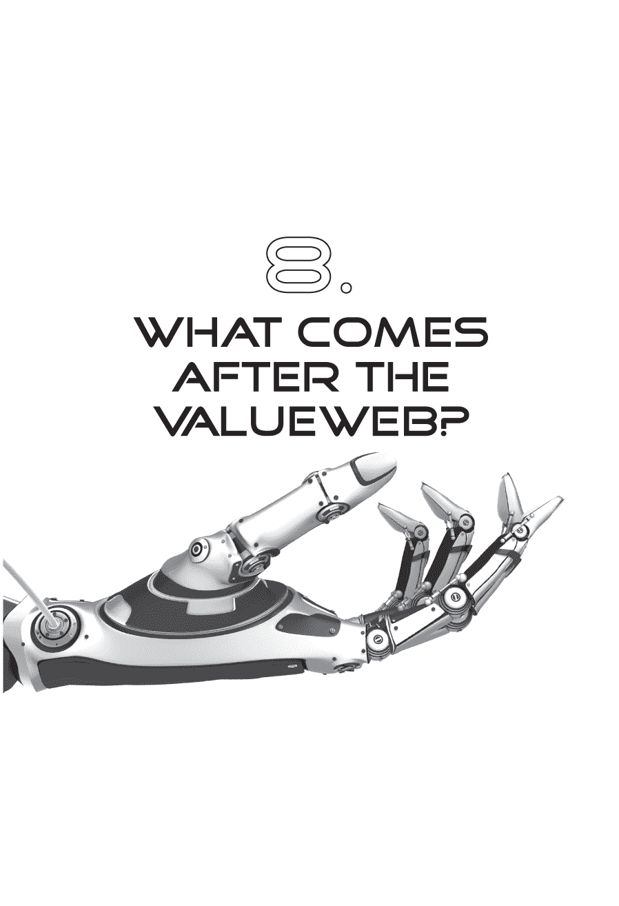
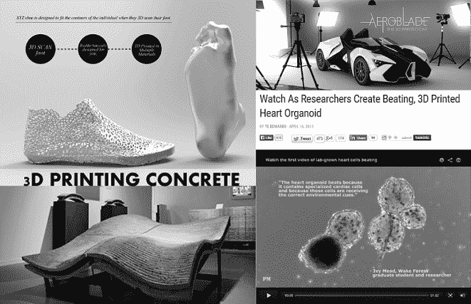
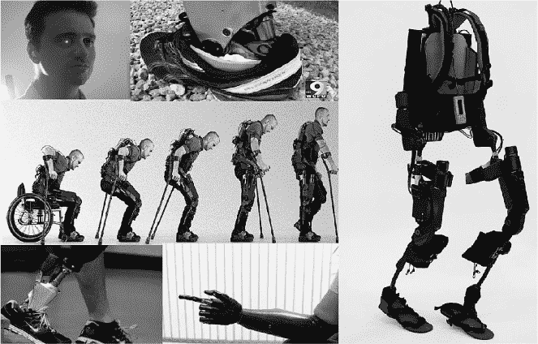
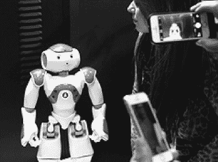

问什么是 ValueWeb 之后，就像问互联网之后会发生什么一样。这是一个非常棘手的问题，因为互联网每 15-20 年就会变形，而 ValueWeb 只是这一代变革的开端。正如在开篇所提到的，ValueWeb 是第三代互联网，Web 3.0，价值互联网的基石。我称之为 ValueWeb，因为这一代改变了一切，涉及货币和贸易，以及我们在生活和关系中所重视的事物。这是对第一和第二代网络的明显转变。

**数字时间轴**

•   第一封电子邮件是由 Ray Tomlinson 在 1971 年末发送给自己的。

•   第一封垃圾邮件由 ARPANET 于 1978 年 5 月 3 日发送给 393 人。

•   第一个注册的域名是[Symbolics.com](http://www.symbolics.com)，于 1985 年 3 月 15 日注册。

•   第一个网站致力于有关万维网的信息，并于 1991 年 8 月 6 日上线。

•   上传到网络的第一张图片是由 Tim Burners-Lee（万维网的发明者）于 1992 年 7 月代表一支名为 Les Horrible Cernettes 的喜剧乐队发布的。

•   第一条即时消息是由 AOL 副主席 Ted Leonsis 于 1993 年 1 月 6 日发送的。

•   第一条横幅广告于 1994 年 10 月在[HotWired.com](http://www.hotwired.com)上发布。

•   eBay 上卖出的第一件物品（当时是 AuctionWeb）是 1995 年售出的一台激光打印机，售价为 14.83 美元。

•   在亚马逊购买的第一本书是 1995 年的 Douglas Hofstadter 的《Fluid Concepts and Creative Analogies: Computer Models of the Fundamental Mechanisms of Thought》。

•   Skype 上的第一句话是在 2003 年 4 月说的。

•   Mark Zuckerberg 是 Facebook 上的第一个人，ID 编号为 4（前三个 Facebook 帐户用于测试），于 2004 年 2 月注册。

•   第一条 YouTube 视频于 2005 年 4 月 23 日上传。

•   第一条推文是由联合创始人杰克·多西于 2006 年 3 月 21 日撰写的。

•   第一个工作的加密货币是在 2009 年，中本聪的比特币白皮书发布时推出的。

第一代是商业互联网，第二代是社会互联网。Web 1.0 主要是建设全球网络，而 Web 2.0 则专注于社交网络。Web 3.0 是价值互联网，至少需要未来十年来建设、创建和部署。这就是为什么我经常说传统银行有十年的时间来改变——但他们最好现在就开始，因为如果他们等到能够看到变化发生，那就太迟了。最终，在价值网络创建之后，我们将进入我所说的生活互联网时代，在那个时候，我们甚至不会把互联网看作是一种分离的东西。我们不会考虑数字化、移动化或在线化；我们只会沉浸在网络中，这将成为某种第六感。

显然，这些互联网时代的时间点可以受到质疑，但我将它们定位在第一封基于互联网的电子邮件在 1971 年在 ARPANET 上发送时；第一条即时消息在 1992 年发送时；以及第一个工作的加密货币，中本聪的比特币在 2009 年发布时。在这些时代发展中所看到的是多年来构建能力，然后似乎在一夜之间出现。在第一个网站出现之前，花费了二十年甚至更长时间来建设互联网的基础设施，但一旦出现了，仅仅又花了四年时间亚马逊和 eBay 就开始销售书籍和组织拍卖活动。第一条即时消息是在 1992 年由 AOL 的副主席泰德·莱昂西斯发送的，但在马克·扎克伯格开始着手 Facebook 的工作之前，又花了 12 年的时间，几乎再过了五年他们才达到了 1 亿用户。

如我所说，我们可以就年份和细节进行辩论，但我试图表达的观点是，每一代互联网的关键阶段 —— 互联网、Web 2.0、价值网络、生活 —— 在它进入主流之前需要约 10 到 20 年的技术孕育期，而价值网络处于早期阶段。在它发挥作用之前我们有 5 到 10 年的时间，而在此期间，价值网络的其他组成部分也必须齐心协力。例如，我们正在谈论的是机器对机器的商业交易（M2M）。M2M 商业是在物联网中进行的贸易，许多人认为物联网是 Web 3.0，尽管我声称这个领域是价值网络。

如果没有支持这些事物的廉价、实时基础设施，你就无法拥有一个支持商品和服务交易的 M2M 物联网。如果这些“物”有无法追溯的身份，那就无法拥有物联网。如果这些“物”无法以廉价且简单、实时的方式与其主人关联，那就无法拥有物联网。这就是为什么支撑物联网的共享账本，由价值网络驱动，将是关键所在。这也是为什么价值网络至关重要的原因，因为没有它，你无法开发下一阶段的服务。

实际上，当我们审视价值网络 3.0 的发展时，世界将会变成这样。价值网络与物联网并行发展，使得机器能够与机器进行交易。这将允许冰箱通过在所有者身份上注册冰箱来与杂货店交换价值，该身份将位于某人的可信身份共享分类帐上，可能基于区块链。这个身份档案将把该设备的计费账户与其所有者的钱包相连。所有者将实时获得冰箱购买的云端更新。他们还将实时查看他们的汽车、电视和其他设备正在订购的商品。所有这些都将运行在一个共享基础设施上，这将是一个基于云的、可信赖的共享分类帐。

随着机器之间的交易，随需打印的互联网将发展起来。这一发展依赖于安全的设计和专利，因为它意味着供应链从海外进口商品崩溃到在家或本地工作室打印商品。现在，3D 打印机可以轻松地打印任何东西，从珠宝到服装再到枪支，甚至是打印房屋和人体器官。

由于人们可以在家中打印以前在商店购买的产品，因此将会发生对版权犯罪和非法打印产品的战争。这场战争将是我们在数字产品领域看到的非法下载电影和音乐的斗争，但现在发生在从时尚到家具的产品的物理世界中。毕竟，如果你只需获得一个设计并采购材料，你就可以在家里开始生产任何东西。这就是随需应变的未来。

此后不久，我们将有事物照顾我们。机器人将出现，特别是管理医疗保健。毕竟，如果我们能够打印身体部位，我们就能迅速轻松地替换不再工作的部位。科学家们已经通过通过游戏化众包思想解决了许多最棘手的挑战。一个很好的例子是 Foldit 的故事。

Foldit 是一款革命性的众包计算机游戏，使任何人都能为重要的科学研究做出贡献。该游戏分析了蛋白质的生成方式及其作用，旨在找到解决 HIV/AIDS、各种癌症、阿尔茨海默病等疾病的方案。2011 年，玩家们仅用了几周的时间解决了一道困扰科学家十多年的艾滋病谜题。Foldit 玩家们在短短三周内解决了一种导致类艾滋病病毒的酶结构如何运作的问题。还有其他游戏正在尝试解决全球挑战和健康问题，从寻找新行星（*Planet Hunters*）到通过 DNA 分析解决遗传疾病（*Phylo*）再到弄清楚大脑如何工作（*Eyewire*）。

生命科学的发展，通过众包解决方案进一步推动，将为所有人带来越来越长的寿命。科学家们已经预测，2015 年出生的平均儿童将活到 150 岁；这只有通过跨越我们的健康挑战以及协助我们的医疗保健才可能实现。

这是我们首先期望在家中看到机器人出现的地方：每天按时配药，同时提供餐食和管理家务。我们已经有一些在家中的机器人例子——例如吸尘器——但通常是帮助行动不便和年迈市民的机器人是有意义的，还有机械零件。医生将能够用运作良好的机械替换部分来替换手臂和腿。

仿生手臂、腿和眼睛现在是一个现实的愿景，取代肺部、肾脏和其他内脏器官也是如此。在管理癌症、中风、心脏病发作和其他危及生命的疾病方面取得了突破性进展。

然而，在价值网络 3.0 的最后阶段，第三代物联网、按需服务和机器人将无法在没有基础的实时和自由价值交换机制的情况下运行。如果它们无法支付，我的家庭护理机器人如何订购我的药品、药物和食物呢？如果它们无法代表我订购商品和服务，我的冰箱、汽车和家庭娱乐系统如何为我管理生活？

所有这些 M2M 商业的发展只有在有一个几乎免费的实时价值网络支撑的情况下才能被创造和传递。这就是为什么这是如此基础性的原因。

### 生活互联网

没有人知道 Web 3.0 之后会发生什么，因为这太遥远了。你说的是 15 年甚至更长时间，但是有一些线索。也许最好的线索来自雷·库尔兹威尔，这位著名的美国作家、计算机科学家、发明家和未来学家。库尔兹威尔做出了一些惊人的预测，其中许多正在变为现实。

在 1990 年，他预测到计算机将在 1998 年击败世界象棋冠军。在 1997 年，IBM 的深蓝击败了加里·卡斯帕罗夫。在 1999 年，他预测人们将能够与他们的计算机交谈，并且通过使用他们的声音来给予命令，到 2009 年就可以了。2011 年，苹果推出了带有 Siri 的 iPhone，随后谷歌推出了 Google Now。这些系统自 2009 年以来一直在发展。2005 年，库尔兹威尔预测，实时语言翻译将对所有人都可用，外语中所说的单词将被翻译成我们的母语文本。库尔兹威尔期望这在 2010 年代就会实现。微软 Skype 翻译和谷歌翻译已经实现了这一点。

人们认真对待库兹韦尔的预测。比尔·盖茨称他为“我认识的预测人工智能未来最好的人”；他获得了 19 个荣誉博士学位；被聘为谷歌工程师总监；并被广泛认为是一个天才。

例如，如果你看看他最近的预测——即时翻译——日本的一些银行正在实施分行接待机器人，它们可以在客户走进分行时说客户的任何语言。日本最大的银行三菱日联金融集团在 2015 年 4 月公布了在分行工作的机器人员工。这个机器人叫做 Nao，是一个 58 厘米（1 英尺 11 英寸）高的人形机器人，额头上配有摄像头，并被编程为能说 19 种语言。他通过分析客户的面部表情和语调来分析客户的情绪，这使得机器人能够问候客户并询问他们需要哪些服务。

瑞·库兹韦尔到目前为止准确率相当高。以下是他的一些未来预测：

到了 2020 年代，大多数疾病将会消失，因为纳米机器人会变得比当前医疗技术更聪明。自动驾驶汽车将开始在道路上占据主导地位，人们将不被允许在高速公路上驾驶。到了 2030 年代，虚拟现实将会百分之百真实。就像《星际迷航》中的全息甲板一样，我们将进入被创造的替代世界，在那里我们可以触摸、感觉和闻到现实。到了 2040 年代，非生物智能将比生物智能（即你和我）强大一亿倍，我们将通过无线链接从我们的新皮层到云端的合成新皮层，将我们的智能增加一亿倍。

听起来很疯狂，但是很多未来的事情都是如此，并且让我想起了科幻作家阿瑟·C·克拉克创造的三大定律：

1. 当一位卓越但年迈的科学家声明某事是可能的时，他几乎肯定是正确的。当他宣称某事是不可能的时，他很可能是错误的。

2. 发现可能性的唯一方法是冒一点险，走进不可能的领域。

3. 任何足够先进的技术都是无法区分的魔法。

第三定律最为真实。一个世纪以来，我们已经从飞越英吉利海峡（路易斯·布莱里奥，1909 年）发展到到达太空的最外层（*新视野*星际探测器于 2006 年 1 月发射，并计划到达冥王星，成功于 2015 年）。接下来的几年，随着我们迈向 Web 4.0，将同样令人惊叹。我称 Web 4.0 为生活互联网。这是当我们与技术融为一体，和谐共生的时刻。这将在 2030 年左右实现，这是基于雷·库兹韦尔的一个预测：到 2029 年，计算机将在执行大多数任务方面优于人类。

在不到二十年的时间里，你不仅会使用你的计算机，还会通过人工智能（AI）与它们建立关系。人工智能将使计算机到 2029 年达到人类水平的阅读能力，甚至具有人类特征。根据雷·库兹韦尔在 2014 年 6 月于纽约举行的指数金融大会上的发言：

“我的时间线是计算机将达到人类水平，比如你可以与它们建立人际关系，距今 15 年。当我说人类水平时，我指的是情感智能。能讲笑话，幽默，浪漫，爱心，性感，这是人类智能的前沿，这不是一个副产品。”

换句话说，15 年内，我们将无法区分机器人和人类，或者电脑和朋友。这已经在社交网络中发生了，但我们正在朝着实现《机器人总动员》和《她》这样的电影愿景的方向发展。在电影《她》中，乔昆·菲尼克斯爱上了他的操作系统，但“这不是一个操作系统。这是一种意识。”在《机器总动员》中，机器人变得像人类一样，与正常社会中的人类无法区分。

这就是 15 年后的现实：我们不再谈论电脑、互联网、数字、移动或类似的东西，因为这现在只是生活的一部分。你不会考虑谷歌某事，你只会想问题，答案就会在你的脑海中显现。你不会有意识地分开生活和技术，因为技术现在已经成为你的一部分。这就是为什么我称之为生活互联网。

到底与银行业、贸易、金融和货币有什么关系呢？到 2030 年，货币将不再可见，被编织到第三代互联网的价值网中。我们不再考虑价值转移来支付东西。东西只是通过机器在我们个人账本上记录的借贷来支付。

#### 总结

我开始写这本书的标题是*ValueWeb*，但我对副标题不太确定。我最初的标题是*互联网如何改变我们在贸易、金融、生活和关系中所重视的事物*。然后我意识到更多关于*移动互联网如何改变我们在贸易、金融、生活和关系中所重视的事物*。然后我意识到这并没有抓住真正发生的事情的本质，这就是为什么它变成了*金融科技、比特币、区块链和移动互联网如何改变我们所重视的一切*。最后，我意识到这更多地是关于金融科技如何取代传统金融，这就是为什么现在它是*金融科技公司如何利用比特币、区块链和移动技术来创建价值互联网*。

这里的细节非常重要，因为学习的重点是围绕着改变我们世界的关键发展。这不仅仅是互联网、移动、比特币、区块链或金融科技的发展正在构建 ValueWeb 并改变我们的世界——而是它们所有的结合。这才是关键。正是所有这些发展的结合正在改变我们的思维、关系、结构和交换方式，并使我们对价值和价值存储有不同的看法。例如，在本书前面提到的，我们将把记忆存放在哪里？如果今天出生的典型儿童将活到 150 岁，未来的技术将有能力检索这些记忆？

我认为银行将从金融机构演变为数字价值存储的地方。它们将变成我们可以信任的数据存储场所。可能不是现有的银行在这个领域发挥作用，可能是新兴公司，比如目前在金融科技领域发展壮大的公司。无论哪种方式，一些公司将成为未来的价值存储场所，我对我们如何与系统合作存储和交换价值感到兴奋。

总的来说，如果你怀着乐观的心态前往，未来是光明的；如果你因为变化而感到恐惧，那么未来是黑暗的。对我来说，我迫不及待地想要在那里与你相遇。感谢您阅读*ValueWeb*，期待您的反馈。
