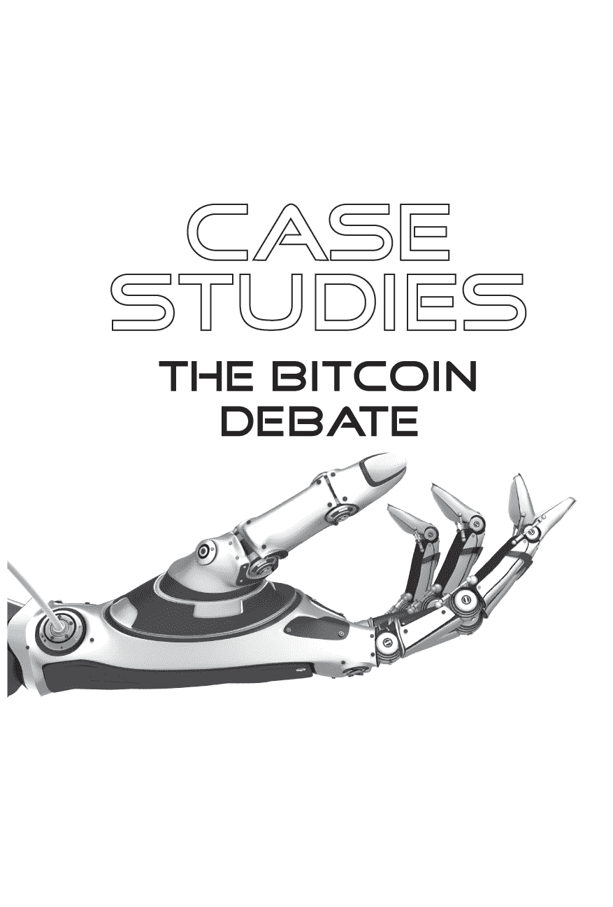
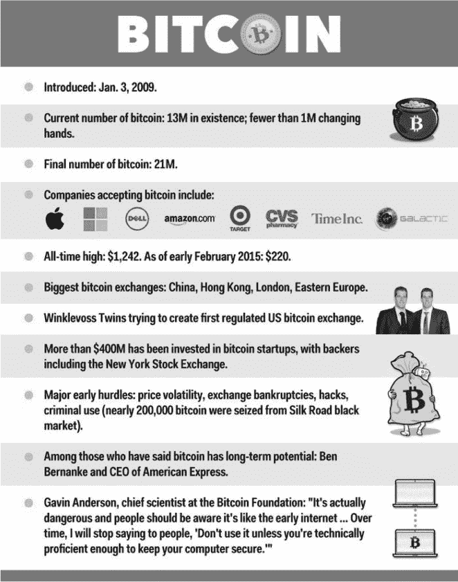
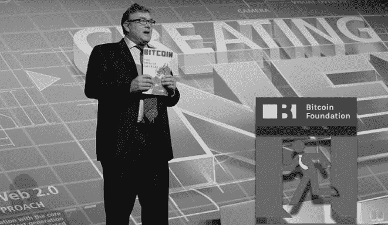
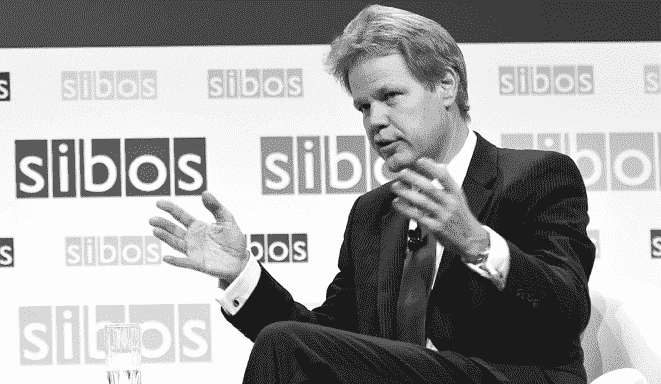
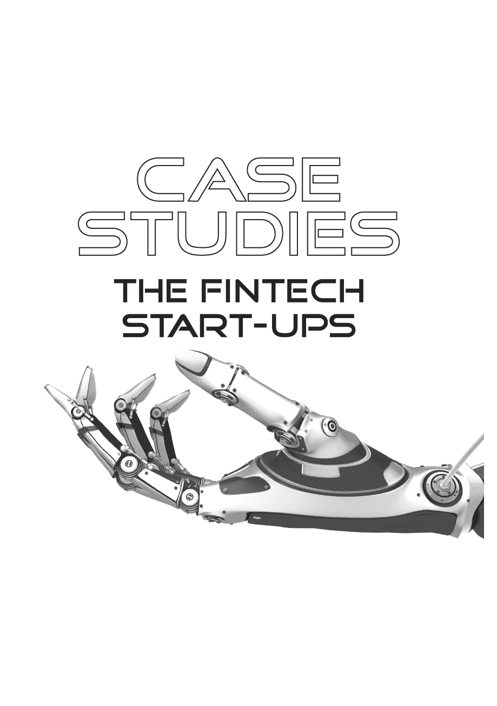
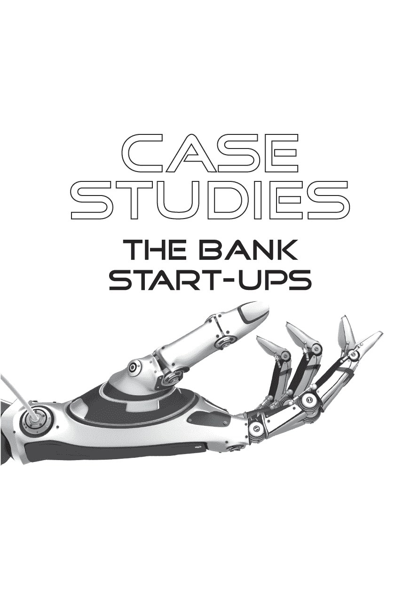
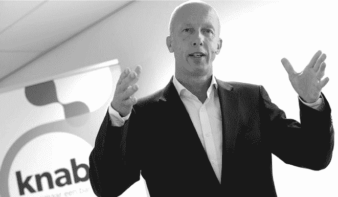
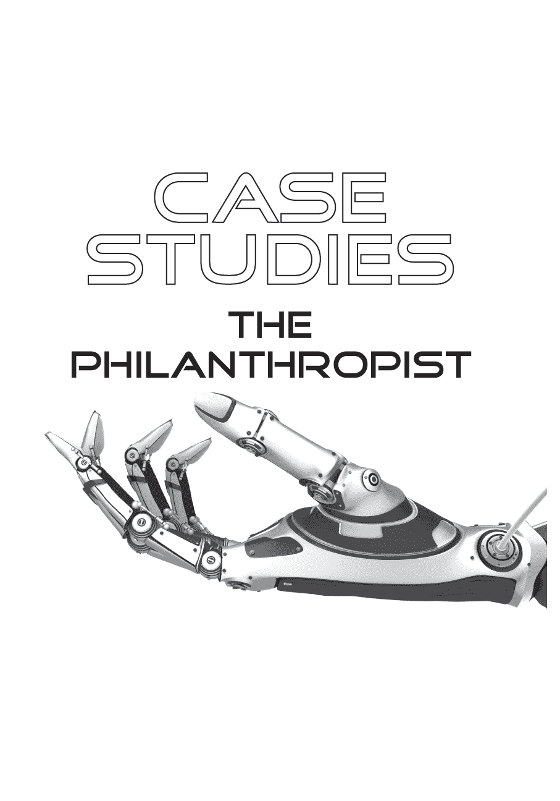

#### WENCES CASARES，连续创业者

*连续创业者 Wences Casares 创办了阿根廷的第一个互联网服务提供商，后来在 2000 年将他的在线券商公司以 7.5 亿美元的价格出售给了西班牙桑坦德银行，那时他才 25 岁。现在 40 岁的 Casares 是硅谷比特币领域的明星，但他的阿根廷血统在很大程度上塑造了他。*

**您能谈谈您对比特币及其在当今市场中的地位的看法吗？**

我认为比特币很可能是我们人类历史上见过的最好的货币形式。这是一个非常大胆的说法，我明白。我们都被教导说，早期文明首先进行了物物交换，后来发明了货币，因为物物交换太困难了。嗯，那不是真的。

在没有货币之前，我们进行商业活动的方式是，我们部落的每个人都知道你杀了一只大水牛，我会过来说：“嘿，我能要点你的水牛肉吗？”你会说：“当然，这是一点点水牛肉。”交易就这样结束了。我必须记住我欠你的。你必须记住你给过水牛肉的每个人。

你必须为每个交易对手记账。这是不可靠的。但它在过去的 25,000 年里一直运作良好。然后，有人聪明地想出了一个主意，一种新技术。这个人来找你，说：“我能要点水牛肉吗？”你说：“当然，这是你的水牛肉。比特币辩论的肉。”这个人说：“你知道吗？这里有一些甜菜。”你回答说：“我不想要也不需要甜菜。”他说：“不，不是这样的。我们要把甜菜作为我们部落的客观账簿。”

与其记住，不如让甜菜来追踪，对吧？这是个绝妙的主意。这个技术非常好，以至于一炮而红。在一些部落，用的是甜菜；在其他部落，是盐。在其他地方，是不同的东西。

这种情况从 25000 年前持续到 5000 年前。它就像火一样蔓延开来——非常成功的技术。然后，5000 年前，当部落开始相互贸易时，他们需要使用相同的账本。

金子成为了普遍的账本。人类学家说，他们可以预测任何部落将会出现什么作为货币，因为它总是具备六个特征。最重要的是，它必须是稀缺的。如果不稀缺，你就无法信任它。人们会制造假货币。它还必须是可分割的、可运输的、耐用的、可识别的和可替代的。

这些是货币的六个特征。所以金子成为了普遍的账本，是我们看到的五千年来最好的货币形式。没有什么能像金子一样保值。不是英镑，不是美元，也不是土地，没有任何东西。甚至差得太远。仅仅因为它的稀缺性。有些人错误地认为金子具有某种固有价值。事实是，唯一的价值在于它的稀缺性和作为良好账本的能力。比特币，就像金子一样，没有固有价值。但在六个特征中除了一个之外，它比金子好得多，好得多。

就稀缺性而言，金子是稀缺的，但我们仍然在开采地区。假设你今天买了金子的 0.01％。明年，它将是一个更小的百分比，因为我们又开采了一些。对吧？我们从未见过如此完美的东西。

如果你有一些现金也是同样的情况。用比特币购买东西，它将是 2100 万个硬币中确切的百分比，这是完美的。我们从未见过如此完美的东西。在可分性方面，每个比特币由 1 亿个聪组成。它非常容易分割。就可传输性而言，我们也从未见过类似的事情。而黄金则是愚蠢的交易；你在处理硬币和零钱。而且我们必须信任一个第三方。在过去，我们会去找梅地奇家族或罗斯柴尔德家族，他们会写信用证，你会相信那里有金子。

从那时起，每当我们不在一起时进行付款时，我们就必须信任第三方——无论是银行、Visa、万事达卡、PayPal，总是有一个第三方，我必须信任他们。

比特币。它的显著之处在于它允许我实时、免费、无需任何第三方向你发送资金，无论你身处世界的哪个角落。所以在比特币辩论中，就可转移性而言，它是革命性的。但在可互换性方面，除了可交换性以外，它在所有方面都优于黄金。如果有人向你提供两枚相同的金币，你真的不应该在乎他们给你哪一个。它们完全相同。真正可互换的。在比特币的情况下，每个比特币内部都包含着它的完整历史，对吧？

因此，如果有人向你提供比特币的选择，你应该选择从未与 Silk Road 有关联的，或者有一些可疑历史的那个。它可能最终价值较低。但在其他方面，比特币都更为优越。

所以，你知道，我们生活在一个有着五十亿人口拥有手机但没有银行账户或信用卡的世界里。这些表现良好的银行设法给仅有的十亿人提供了银行服务。有五十亿人因为没有银行账户或信用卡而受到了侵害。他们无法参与全球经济。这是我们第一次看到一个真实、切实可行的希望，这种情况可能会改变。

这就是为什么我认为比特币很重要：它是相关的，而且我认为它会花费时间，就像互联网花费时间一样。但它可能比互联网的影响更大。如果你去非洲或拉丁美洲，亚洲的某些地区，问一般人：“看，你更愿意什么：免费获取信息[他们现在通过手机获取]，还是一个安全的地方来储存你劳动的成果并进行收付款？”

如果他们两者都没有，直到最近这是事实，他们会选择第二个，因为它对他们更相关。所以对于五十亿人口，我认为比特币将比互联网更相关。

**太神奇了。要多久才能实现？**

很长时间。也许我是你能找到的对比特币最乐观的人。我认为它会比人们想象的更强大，但也需要更多时间。

**几十年？**

是的。如果需要十年，那将会非常快。更可能的是，我认为需要二十年。

**在那之前需要发明哪些重大应用程序？**

我认为一旦你在比特币的合法性上达成共识，应用程序将自然而然地出现。我不认为比特币会或应该取代货币。我认为英镑应该是英镑，欧元是欧元，美元是美元，等等。

但我确实认为我们需要一种全球性的货币，像一种元货币。如果今天阿根廷要从伊朗购买石油，例如，使用美元就没有意义了，对吧？我认为每个人都持有一些比特币是有很多意义的。

**是的。**

所以，我认为比应用程序更重要的是，人们要像他们对待互联网一样理所当然地对待比特币。

让我给你讲一个故事。当我还是个十几岁的少年时，我妈担心我花太多时间在互联网上。那时候，你知道，还没有浏览器，只有一个 UNIX 屏幕。所以我记得试图向她展示这个东西，互联网，会如何改变世界。我给她看了 CPU 板，解释了整个技术堆栈，协议，为什么它是免费的。你知道的，完全失败了。她还是限制了我的电脑时间。有趣的是，如果今天我问她，“你觉得互联网怎么样？”她会说，“哦，天哪。太棒了！它改变了我的生活！”

她只是理所当然地接受了。它管用。信用卡也是一样。它们的工作原理相当复杂。大多数人信任它们，但不知道它们是怎么工作的。要让比特币达到这个地步比让互联网达到这个地步需要更多的时间，因为互联网并没有挑战任何现有的假设。而比特币则挑战了我们对货币的许多假设。一旦你改变了这一点，其他一切都会跟随。

**基本上，类比是你需要在互联网之上发展出万维网。**

就是这样。你看，如果比特币继续以过去五年的同样速度增长，我们可以预计在 2015 年结束时会有 5000 万用户。这是一年内增长了五倍。明年我们可能会有更多的比特币用户和持有者，超过贝宝账户。然后你就可以开始做一些不同的事情了，对吧？

**比特币在过去一年经历的大幅波动是否限制了其潜力？**

这基本上是因为波动性。波动性不断提醒着我们：不要使用你负担不起的钱。这就是为什么我希望从现在到我看到比特币发展的地方整个过程尽可能地波动，以保持其诚实和安全。

**比特币是否是更好的通用语言？**

瞧，我们生活在 21 世纪，事实上，我更容易打电话给雅加达，看到屏幕上的某人，并免费与他们交谈——考虑到要实现这一点需要发生的一切，但我却不能给他们发送 1 美分？那太不可思议了。

**比特币的第一个常见应用将是什么？**

你知道，我认为认为你足够聪明去做到这一点是危险的。但是如果我必须进行头脑风暴，我会说我看到两种非常不同的用途：一种是为发达国家，另一种是为发展中国家。对我来说，在发达国家，互联网货币有明确的需求。互联网非常强大，但它没有自己的货币形式。所以，每当你要在互联网上进行交易时，你必须使用美元、欧元、英镑，这很麻烦。它至少打断了你 35 秒。它花了很多钱。这真是一团糟。对吧？

如果你真的能够像移动图标一样移动资金会怎样？把它放在这里。把它放在那里。发送它。特别是微型交易。想象一下它是如何为你写的一些专栏起作用的。像我这样的读者可以看到摘要。但是如果我想读更多，我就得付几分钱。你的一些报道有足够的读者让这有意义，对吧？

或者，当 YouTube 告诉我我必须等待 5 秒钟才能跳过那个广告时，让我支付几分钱。对那些内容的制作者来说，这会更加相关，对吧？

**让我们深入了解一下。我有一部装有 Apple Pay 的 iPhone。它比我只需按下 Apple Pay，只需按下这个按钮好在哪里？然后通过我的信用卡结算。**

因为这是一个封闭的生态系统。在封闭的生态系统中，只有当它们有足够的交易费用时才会进行处理。他们仍然需要几天时间才能收到款项，而你仍然要支付给 Visa `3.5 percent`。这造成了这样一种感觉，好像是立即支付了，但实际上需要三天才能结算。这耗费了大量资金。

**它并不像它本应该那样高效。**

这并不高效，也是虚构的。但实际上并不是事情正在实时发生。这就好像在说，“为什么我需要互联网？”我可以去 CompuServe，或者 Delphi，或者 AOL，这里都有，但它是一个封闭系统。互联网的美妙之处在于任何人都可以做任何事情。

我想象一个完全不同的情况是发展中国家，我认为那更有趣。你知道有史以来销售的最大固定电话线数量是多少吗？现在是略多于十亿。

你知道今天有多少部手机吗？略多于六十亿。你知道是什么让我们从十亿固定电话线跃升到六十亿部手机的吗？真正的突破与外形或技术无关。真正的突破是金融上的。每次发放固定电话线都像写一张空白支票。我安装了你的电话。使用它，我会在月底向你收费。所以我必须相信你的信用。那些有好信用的十亿人获得了固定电话线。其他人则没有。

随着手机的普及，我们达到了 10 亿部手机，其中 5 亿部是预付费的。这是一个财务事实，人们带着现金提前支付，然后再使用。这就是额外的 50 亿产生的原因。他们无法参加像这样的会议。他们不是这个经济体的一部分。但是，伙计，他们有和你一样的手机。他们有钱。他们有现金。但是他们无法参与全球经济，因为现金无法在这里流通。

**是的。**

当今货币系统存在许多问题。它费用高昂。不安全。带来巨大的交易成本。我认为比特币可以成为这些人参与的方式。他们喜欢他们的手机，可以用它们做一些我们认为理所当然的事情。

**这是数字化的现金。**

对于他们来说，这是数字现金。你和我不需要。但他们需要。

（本文最初由*商业内幕*于 2015 年 2 月发表。已获得完整复制权限。）

#### 布洛克·皮尔斯，比特币基金会主席

*布洛克·皮尔斯（Brock Pierce）是一位美国企业家和前童星。作为童星，他出演了迪士尼电影*《小鸭子队》（1992 年）、*《小鸭子队 2》（1994 年）和*《第一小孩》（1996 年）。布洛克一直参与数字货币的建立，他于 2001 年创立了 Internet Gaming Entertainment（IGE），并于 2003 年创立了 Zam。2014 年 5 月，他当选为比特币基金会的董事，并于 2015 年 4 月担任主席。*

**关于比特币基金会**

比特币基金会是一家美国非营利性公司。它成立于 2012 年 9 月，其宣布的使命是“标准化、保护和推广比特币加密货币的使用，造福全球用户”。该组织的模式仿照了 Linux 基金会，主要通过依赖比特币技术的营利性公司提供的赠款资助。

**你是如何加入比特币基金会的？**

我是由行业成员选举产生的。比特币基金会董事会是由社区选举产生的。我们有一个完全选举产生的董事会，今天基金会由两个不同的成员组成。我们有付年费或终身费用成为基金会个人成员的个人成员，然后我们还有行业成员，他们是支付年费的公司。董事会一半由行业成员选举产生，一半由个人成员选举产生——我是去年春天由行业成员选举产生的，所以基本上比特币公司的 CEO 们投票选我进入了董事会。然后，最近，我被董事会选举为主席，实际上只是一个有一些额外责任的董事会成员的美化头衔，但我不是日常管理基金会的人。

目前的执行董事，相当于基金会的首席执行官，是一个名叫布鲁斯·芬顿的很棒的家伙，所以他有日常负责运营基金会的责任。我只比其他董事会成员稍微有些更多的责任。

**比特币基金会的当前状态如何？它的发展方向是什么？**

基金会刚成立时，它代表行业执行了许多职能，因此最好不要把它看作基金会，因为它更像是一个贸易协会。它最初尝试做的事情是倡导和教育；传达比特币是什么；为什么它重要；它被用来做什么；它如何有用；这些类型的事情——教育人们并让他们意识到比特币能为他们做些什么。然后还有比特币核心（Bitcoin Core）这个开源软件项目，加文·安德森（Gavin Andersen）长时间担任首席开发者。他现在退出了首席开发者的角色，但基金会一直在资助一些关键人员的薪水，以支持开源协议的发展。然后最后一个部分是政策，这是关注政府如何寻求对此进行监管，并试图以积极的方式影响这些法规的部分。

随着行业的成熟，更多的人群团结起来，试图填补其中的一些角色。我们退出的一个角色是政策，我对此非常满意，因为比特币社区涵盖了非常广泛的人群和用途。当你在支持政策时，不可能让每个人都满意，所以你会有一些非常不同的组织。但如果其中一些组织合并以支持这些活动，比如由杰瑞·布里托（Jerry Brito）主持的 Coin Center 和由佩里安·博林（Perianne Boring）主持的数字商会（Digital Chamber of Commerce），那么你就有了进步。

他们正在美国首都进行大部分的政策工作，这是我们不再参与的领域，因为其他组织已经站出来自愿承担了这项工作。

就核心发展而言，我们继续支持。在这个过程中，我们发现了一件事情——在与所有可能向我们提供大量资金支持的大型机构交谈之后——我们需要得到一些真正巨额的支票，这将使整个行业有足够的资本来支持协议的基础开发。我们希望看到这一点存在于学术机构中。在我们对所有可能提供大笔支票的人进行了长时间的访问后，他们喜欢这种治理结构，幸运的是，加文和团队能够加入麻省理工学院的媒体实验室——这是一个完美的解决方案，应该会为支持这些努力带来额外的资本，但我们仍然支持核心开发。加文仍然是比特币基金会的首席科学家。这是一个行业需要尽可能多的帮助的领域，我希望其他学术机构加入进来。我希望这个领域的其他公司支持像比特币支付公司与杰夫·加齐克（Jeff Garzik）这样的员工。你希望尽可能多的人投入到这个工作中，最好是能力强、专注的人，而不是业余时间做的。希望支持核心开发的资源继续增加，并且越来越多的行业参与者以这种方式做出贡献。目前，主要的功能是继续进行宣传和教育工作。

很多我在银行业交流的人现在都说，“比特币不好，区块链好”。加密货币市场和比特币本身的现状如何？它健康吗？

我认为它的健康状况持续良好。如果你看看过去 12 到 18 个月流入该行业的资金，你会发现大约有十亿美元的资本已被投入。这表明公司正在开发的基础设施正在发挥作用，因为你有开源协议，然后你有《比特币辩论》中所有正在建立基础设施的公司，使其易于使用。想象一下它就像 TCP/IP 模拟中的桥梁、道路和隧道。开始时，一切都是关于建立浏览器和电子邮件客户端，以及让普通人能够使用互联网所需的东西。这就是那些资本为比特币所做的事情，但是资本需要时间才能投入使用，并转化为使更广泛的消费者能够安全、轻松地使用的产品和服务。

与此同时，比特币价格下跌，这相当消极。造成这种情况的最大原因是 Mt. Gox；不幸的是，它确实制造了许多消极的、错误的头条新闻，这是媒体喜欢的。我认为从长远来看，它不会产生负面影响，但从短期来看，我认为这将使这个行业倒退几年。

**让我们转向对金融包容性的积极看法。那里发生了什么？**

这项技术的主要好处，也是我试图传达的主要观点，是地球上有五十亿人没有接触基本质量的金融服务。这项技术将使全球金融系统民主化，以便地球上的每个人都能平等获得快速、安全和廉价的金融服务。

当我和发达国家的人交谈时，他们会说：“我不明白。我为什么需要这个比特币？”我向他们解释说：“嗯，你可能从未离开过美国，在那里你有银行账户，有信用卡，有着法律保护你的保障，你对系统有信心。”

这不是一个你需要的产品，要看到这样的技术被大规模采用，它必须改善使用它的人的生活。这就是为什么我们看到拉丁美洲市场，特别是委内瑞拉和阿根廷，或者像非洲这样基础设施很少的地方，都在出现主要增长的原因。这些新兴经济体正在跨越电信基础设施，直接跳到无线通信。因此，我认为发展中国家在几年内实际上可能会在金融基础设施方面超越发达国家。他们也不必花费数千亿美元来实施它，无论是使用比特币还是区块链技术。

菲律宾正在考虑将移动支付应用于区块链上，这将使该国所有人都能广泛获得金融包容性。那里有大约 1 亿人口，但只有 500 万张信用卡和借记卡。因此，只有大约 3-4%的人口像我们一样享有金融服务。这就是为什么比特币有可能对一个国家产生重大影响的原因。

如果你看一下菲律宾的国内生产总值，大约有 28%来自汇款。如果更多的汇款资金进入到人们手中，这可能对菲律宾国家产生非常积极的影响。这就是为什么我认为人们肯定开始认识到快速、便宜、安全的结算的概念。

**您如何看待区块链技术的发展，它最终会成为世界中央支付基础设施的比特币区块链还是其他东西？**

我相信答案是“是”。我不知道它是否会是比特币的区块链或其他东西。我经营着一个名为区块链资本的小型风险基金。我们刚刚完成了 36 笔投资，从我的角度来看，我们看起来很像一个指数基金，因为我们正在投资于 1994 年互联网的等价物。我不知道谁会是赢家，但如果我押注所有最好的公司，我的投资组合中将会有 eBay、亚马逊、谷歌和 PayPal。我还不知道如何选择赢家。我也不知道这个行业会如何发展，但我确实坚信，是的，我们将最终拥有这种类型的基础设施成为世界金融体系的基础。

**谈到区块链资本，我很想知道你个人是如何涉足比特币和所有这些技术变革的？毕竟，你的领域并不是这个，因为你来自电视和电影，那么这是如何激发你的兴趣的？**

是的，所以我从娱乐行业开始。我从 3 岁到 16 岁都是一名演员，然后我开始涉猎其他领域，因为我真的是一个创业者，碰巧也是一个演员。小时候，我建造了每一个可能的柠檬水摊—每一种可能的生意。在我成长的世界里，我在片场度过大部分时间，与成年人为伍，因为片场很少有其他孩子，所以我的大多数朋友都是导演、编剧或其他演员。与我一起工作数月的人让我想成为一名企业家。从那个角度来看，我想成为执行制片人。我想把项目汇聚起来，创造电影。

当上世纪 90 年代的互联网热潮开始时，我看到人们开始创办这些企业，我心想，“我具有企业家精神，我精通技术，我是一名演员，我可以做到这一点”，于是我在 17 岁时创办了我的第一家公司。这是一家从事数字媒体领域的公司，这是一种很好的技能组合。我在整个上世纪 90 年代都在做这个。

1999 年，我发现了另一个发展并且引人入胜的见解，这就是您所称之为“持久世界”或“在线游戏”的开始，比如《魔兽世界》或《第二人生》。我意识到这些游戏需要数字资产，并且这些世界内存在的数字货币具有价值。有人想要购买和出售它们。这是世界上任何一家游戏公司将这些数字商品或货币作为业务销售之前的事情。

我意识到存在市场需求，因此在 2001 年创办了一家名为 IGE 的公司，它成为了这些持久世界中存在的数字资产的主要市场创造者。当时，我对产品的需求多于产品。我找不到足够的卖家，所以我去鼓励中国人专业玩游戏和挖掘数字货币。在 2001 年至 2006 年期间，我建立了一个由 40 万人组成的专业玩家和挖掘数字货币的供应链。然后我会继续销售产品——所以我从事数字货币业务的时间几乎与任何人一样长。

这就是为什么比特币引起我的关注的原因，因为在整个 21 世纪的头 10 年，任何想要尝试数字货币的人通常都会来找我。在这个领域，我做了很多，很多亿美元的生意。今天，我仍然每年做超过 10 亿美元的生意，所以有人向我传达了比特币即将推出的消息，并问：“嘿，你觉得怎么样？”

我从 2009 年开始尝试玩比特币，因为它出现了，而不是因为我相信它，而是因为人们会问我，而且我有责任知道我在说什么。所以我花了一点时间来摸索比特币，我在 90 年代学到的一件事是市场时机的教训。这是因为我建立的第一个业务是在宽带之前的互联网电视播放，我以这种方式艰难地学到了一个教训。因此，我说：“好的，比特币看起来非常有趣，或者未来会出现类似的东西”，我等待市场发展到足够的程度，以至于我相信已经有了足够的临界质量和动量。

当那一刻到来时，我说：“好的，未来就是现在。我最好放下手头的事情，全身心投入到这个领域的工作中”，这始于 2011 年。

然后，我开始担心监管问题，到了 2012 年，我做出了一个决定，进入这个行业。我在 2013 年成立了几家这个领域的公司，充当孵化器的角色。然而，孵化器的规模有限，为了获得广泛的覆盖，更好的方法是成立一个基金，这就是我最终运行这个基金的方式。

**展望未来，您认为这个生态系统会怎样发展？**

嗯，你会看到很多不同的数字货币。在比特币方面，在接下来的 12 到 24 个月里，我认为该行业的大部分增长将发生在产品的用户甚至都没有意识到他们在使用比特币的地方。像 ABRA 这样的公司，它是一家账单支付公司。他们致力于构建一种新的支付和汇款方法，用户甚至都没有意识到是比特币在推动这些交易，这是我看到的未来。作为价值主张，比特币是一种非常快速、低成本、跨境的汇款方式，无论是对企业还是个人。我认为在接下来的 12 到 24 个月里，大部分增长将发生在为消费者和企业提供价值转移的公司，他们甚至都没有意识到他们在使用比特币。这只是一种业务能够更快速、更便宜地跨境转移资金的机制，这是我看到大部分增长发生的地方。

其他共识机制和协议如瑞波（Ripple），它的大部分业务增长来自银行，作为银行间结算工具。瑞波允许银行实时运作，而不是按照 T+3 运作。三天的金融结算正在向几乎即时的方向发展，这是一个重要的推动力。无论如何，我认为每个人都同意，在当今这个时代，金融交易应该比三天快得多。瑞波开始在银行间看到很多活跃，将其作为加速结算的工具进行整合。

有许多不同的趋势，但就在你开始看到某个特定模式起作用的时候，情况就会发生变化。有些事情行之有效，有些事情则效果不佳。例如，想想比特币的交易所。两年前最大的交易所是 Mt. Gox；去年最大的交易所是 Bitstamp；而今年最大的交易所是 Bitfinex。即使你看到一个明显创造价值的类别，也很难选择赢家，因为这个行业还是非常新的。

有一些公司已经崭露头角，成为了我所说的类别赢家。其中之一就是 Coinbase，作为一个消费者钱包，在美国购买比特币是一种简单的方式。这就是为什么我很高兴成为该公司的投资者。因为很明显，如果这个行业成功了，那么他们显然将成为生态系统中最大的参与者之一。

我也喜欢其他有趣的趋势。例如，我不知道你是否熟悉 ChangeTip，但他们专注于微交易，因为大多数发展中国家无法使用当前的支付系统，这将成为一个关键。大多数发展中国家无法使用信用卡。如果你在非洲有一张信用卡，然后上网购物，商家和支付基础设施以及欺诈检测服务都必须信任你。问题是，他们或多或少地系统地拒绝任何非洲人能够用信用卡购买任何东西。这是一个无需信任的支付系统。在这种情况下，我认为它非常具有吸引力，可以让被排除在外的人参与进来。比特币，或者类似的东西，将允许地球上其他 70% 的人参与互联网经济，这对于任何在网上做生意的人来说都是一件好事。

在线购买小型产品和服务的潜在市场规模有着相当大的扩展空间。目前，使用信用卡，你实际上不能处理少于 70 或 80 美分的交易。这还假设你的成本为零。这就是为什么我喜欢 ChangeTip，它允许人们以一分、一角、一角的价格购买内容，并提供低交易费用。这些公司将使整个地球都能参与到互联网经济中来，而 ChangeTip 在这个领域已经走在了成为类别赢家的道路上。但是，再次强调，现在仍然是早期阶段。

最近大家都在说“比特币不好，区块链好”。他们真正想表达的是，中本聪想出了一项伟大的技术，但他们不喜欢这种货币。这种做法真的可行吗？

这可能是的。中本聪取得的成就是，他整合了许多技术创新，创建了一个正在创造价值互联网或信任互联网的协议。如果你思考一下我们今天使用的互联网，它是信息互联网。这是因为通信协议 TCP/IP 的存在而成为可能。问题在于，你不能在没有受信任的对手方或中介的情况下通过 TCP/IP 进行价值交易。中本聪解决的问题是双重支付的问题。如果我向你发送一封带有附件图片的电子邮件，当你收到它时，如何知道我没有为自己保留副本或同时向其他四个人发送？TCP/IP 是为此设计的协议。中本聪取得的成就是他创建了一个允许以任何形式传输价值的协议。这是一个革命性的事件。现在，比特币的区块链是否最终成为所有这些活动的成功平台？我不知道，但我认为它很有趣且可靠吗？我认为比特币作为一种非主权、基于数学的货币非常有趣。从许多角度来看，它都很有趣。例如，来自发展中国家的人们，在今天的俄罗斯和乌克兰等地，或者如果你看看津巴布韦和他们经历的疯狂通货膨胀。它为这些地方的人们提供了选择，它是比其他可用选择更好的价值存储方式。

这就是为什么我觉得比特币非常迷人，我认为它具有令人难以置信的潜力。我继续对比特币的未来持乐观态度，但是比特币辩论中的区块链显然是更大的创新。我不知道它最终会呈现出什么样的形式。*比特币很重要，但是区块链显然将改变世界*。

**这引出了我的最后一个问题。如果你在押注未来，你认为最有前途的领域是哪里？**

-   最终，你要做的是找到市值类似于优步或 Facebook 的投资。金融系统显然是一个足够庞大的海洋，应该有能力创造出具有这种价值的企业，这就是我们所关注的。利用这种新技术，哪些巨大的市场可以被重新构建或颠覆？

-   诸如保险、货币汇款、银行间结算系统、支付处理等等。你只需要看看今天的世界，因为我们不是在创造新的产业，而是用新技术来颠覆产业，使事情变得更好、更快、更便宜。

-   

#### -   JON MATONIS，加密经济学家

-   *Jon Matonis 是一位电子货币加密研究员和经济学家，专注于推广非政治性的数字货币流通。他曾在住友银行、Visa、VeriSign 和 Hushmail 担任重要职务。他曾担任比特币基金会的执行董事，直到 2014 年底，并且是数字货币新闻网站 CoinDesk 的特约编辑。*

-   **Jon，请向我介绍一下你自己和你的背景。**

-   我从 2012 年起参与了比特币基金会的工作，并成为创始董事会成员之一。去年年底，我决定退出基金会董事会，让其他人有机会加入并参与董事会工作。

-   对于任何人来说，这都不是一份终身的工作。在此之前，我曾在 Visa 和 VeriSign 的支付领域工作，致力于在线银行业务的公钥加密；在此之前，我曾是商业银行的外汇和衍生品交易员。我将所有这些技能融入到这个全新、令人惊叹的金融加密领域中。

-   **比特币基金会的未来是什么？**

关于比特币基金会的未来，它仍然是一个优秀的机构。应该鼓励人们加入，因为它确实支付了一些核心开发者的补偿。它并不支付所有的补偿，因为没有一个实体控制比特币的发展。它是一个开源项目，所以不是一个中央集权的斗争，但确实提供了一些补偿。基金会今天的主要焦点与其创立之初略有不同，是为比特币核心开发一个标准机构，与 IETF（互联网工程任务组）的协议标准类似。自动地将其投入 IETF 标准流程是不成熟的，因为那样会丢失。它需要成熟，需要更多的参与，更多的倡导者来使其在 IEFT 结构中蓬勃发展。这就是基金会为协议做准备的目的，最终它将进入一个更大、更严格的标准机构流程。

**你提到你曾经是一名交易员并涉足支付行业，那你为什么会对比特币感兴趣？**

我一直在研究和专注于数字货币和替代货币的研究工作。即使在比特币之前，回溯到 Digitcash 和 E-Gold 时代。在 2009 年底，我通过一封来自中本聪的随机电子邮件认识了比特币。当时我并没有多想，然后 3-4 个月后我开始关注它。它似乎解决了第一代数字货币遇到的许多问题，主要是围绕着防止双重花费的中心化问题。这才是真正的突破，这也是让我作为交易员和数字货币货币理论家兴奋的原因。比特币提出了一种解决双花问题的方法，而无需返回到集中式的铸币厂进行重新发行或确认单位没有被双花。比特币的加密原理在比特币推出之前就已经存在。任何单独组件都没有什么独特的新东西，但是它在将其作为对等分布环境进行组装时是独一无二的。这才是真正的突破。

**你说它是去中心化的，这常常引发这样一个问题：这是没有政府的货币吗？**

嗯，去中心化和对等计算能力是未来的潮流。所以这肯定会持续下去。事实上，我看到这种趋势会增长，而不是朝着另一个方向发展。

关于“没有政府的货币”，事实上，我们一直都有没有政府的货币，可以追溯到货币的演变，甚至是金子和金条交换时代。在国王和君主开始在金币上盖章之前，金是没有政府的货币形式。因此，我不认为没有政府的货币的概念是不可能实现的。相反，我们正在重新获得失去的东西。

**但是当谈到没有监管的价值交换时，监管机构和政府官员担心毒贩和恐怖分子。您认为这是一种威胁吗？**

我不认为这是一种威胁。这并不是特定于比特币和其他加密货币的。任何用于小额或中额交易的价值交换媒介都可能受到滥用。权衡的是，你必须绝对严厉地限制数字货币的好处，以防止绝对负面的事情发生。我的意思是，所谓的毒品和犯罪团体所造成的问题远远超过了比特币的情况。你不能因犯罪分子的行为而责怪货币单位。

**我同意，尽管无监管的价值交换系统的另一个问题是，你会遇到许多黑客攻击和像 Mt. Gox 和 Bitstamp 这样的失败。这些事情给比特币抹上了不好的名声。你是否看到一种结构可以给消费者更多的保证，让他们放心使用？**

让我们谈谈 Mt. Gox 和 Bitstamp 事件。监管不能成为*买方自负*（“buyer beware”）的灵丹妙药。监管不能解决一切问题。它很少能按照政府的意图发挥作用。看看美国，雷曼兄弟和 MF Global 都是受监管的实体，应该是安全的。但他们并不安全。因此，就保护消费者而言，这正是政府监管者提出的在比特币领域大规模监管的理由。然而，我们现在看到比特币的主要领域正在采用最佳实践。如果你看看最近的 Bitstamp 事件，实际上导致了对比特币和比特币交易所采用新的多重签名技术。因此，Bitstamp 的解决方案产生了更强大和更健壮的交易系统，这是在任何政府监管行动之外发生的。

除此之外，你还会看到像 BitGo 这样的公司，它是多签公司，以及像 Xapo、Coinbase 等公司采用了自己的私人保险，为客户提供安全保障和心理安慰，以便他们选择留在那里的任何资金。因此，市场正在通过最佳实践和提供这些解决方案来加强，这是一种进步。发生在一年多前的 Mt. Gox 事件的主要教训是，它展示了“太大而无法失败”的资本主义的确切相反。让我很好奇的是，一些对 Mt. Gox 持批评态度的人更喜欢一个纳税人总是会出手帮助每个人的世界。那不是我们应该朝着的世界，所以 Mt. Gox 被允许自行失败应该被视为系统正在运行的积极信号。

**有趣的是，自比特币失败以来，传统价值存储开始关注比特币。许多拥有许可证和政府监管的机构开始尝试将加密货币和区块链技术纳入他们的业务中。这感觉像是加密货币机构化的一种趋势。你认为这会发生吗，或者这是否与创造这种能力的社区的愿望相悖？**

嗯，社区的愿望在这里并不重要，比特币的制度化将是逐个司法管辖区进行的。但回到你的另一个观点，过去 12 个月来，交易环境已经显著成熟，自 Mt.Gox 以来。这是一个有益的迹象。他们不仅意识到了这一点，而且服务提供商也更加健全。他们中的一些人正在采取自己的措施，以预期未来的监管，但是为了提供更成熟的服务。这些服务的用户也已经意识到，不应该把像 Mt.Gox 这样的公司当作银行保险库，他们本来就不应该在第一时间使用这样的公司。因此，比特币为您提供了一种控制您自己资产的方式，而不需要将一切留在平衡上。这取决于您自己的准则，并且回到我说的，*买方自负*，无论是受监管还是不受监管。

关于比特币的制度化，你会开始看到这种情况发生。我认为这并不是一件坏事，并且，正如提到的，这将是逐个司法管辖区进行的。交易流动性、市场交易量和深度的增加将导致制度化。我们不可避免地会进入一个阶段，我们会看到比特币衍生品型工具，这在某些市场上已经开始出现演变。它将会像其他任何经历阶段和发展的商品一样。我们只是看到比特币以更快的轨迹运动着，似乎它的移动速度更快。我们会到达那里。

**我能看到这一切正在发生。这就是为什么你会看到像 Fidor 银行和 Circle 这样的创新者创建加密货币消费者保障和保证，类似于传统的受监管银行许可证，但是在新模型世界而不是旧模型世界。这是一个正确的观点吗？**

这是一个正确的观点。我们也开始在国际层面上看到这一点。你会看到小的、地方性的区域性参与者，但你会开始看到一些大型参与者具有全球影响力，这只会有益，因为对于加密货币类型的运营来说，全球影响力确实为进入汇款市场奠定了基础。当你有一个覆盖多个国家的全球参与者时，你基本上已经取代了像西联汇款这样的功能。

**这就是事情变得非常有趣的地方。例如，瑞波正在与富国银行和其他银行合作，将其技术能力纳入，但使用的是比特币之外的加密货币。我们会看到不同的加密货币出现吗？比特币是唯一的吗？**

目前已有超过 300 种加密货币在流通。比特币占据了绝大多数份额，几乎达到了 99%。比特币是占主导地位的玩家。瑞波正在与金融机构取得很大进展，因为他们将这个领域作为他们的主要关注点。然而，我认为像瑞波这样的系统并不真正分散化。它们虽然采用了分布式部署，但货币单位本身完全由货币的创始人预先挖掘出来。这意味着它并不是分散化的，因为有人决定在哪里部署最初的货币单位。瑞波货币 XRP 是他们用来将一切粘合在一起的胶水；是否真正分散化的测试是：谁将成为瑞波成功的财务赢家？瑞波有许多风险投资者参与其中，还有 XRP 的投资者。这些人将是赢家。正因如此，瑞波并没有摆脱单一故障点。他们与许多金融机构的合作，以及他们试图做的各种资产网络和连接，对银行非常吸引人，因为这使得它受到监管和监管。然而，在那个世界里遍历一切的某个时候，仍然存在着单一故障点。监管机构喜欢有单一的焦点，因为这样他们就可以监管它。比特币没有给他们任何类型的单一焦点。这就是为什么它是民主化的价值。

**如果瑞波不是解决方案，那么银行将如何将加密货币纳入他们的业务运作？**

实际上，这是一个非常有趣的领域。我在工作中开始更多地关注它，因为在某种程度上，这是 Ripple 和其他想要创建自己独立区块链的替代加密货币的反面。我们开始看到的演变是银行开始利用现有的比特币区块链，而不是试图重新创建一个第二或第三层的链条。这个有趣之处在于它已经存在，可以被利用。事实上，银行只需要想出一种连接到比特币网络的方式，这样他们就能获得与当前在 SWIFT 上进行的大量交易相同类型的流动性和能力。

去年 SWIFT innotribe 挑战赛涌现出了一家很有意思的公司，很好地诠释了这一发展。这家名为 epiphyte 的公司总部位于伦敦，并在纽约设有办事处。他们为商业银行创建了一个界面，使双方都能利用比特币网络，而不是使用 Fedwire、CHAPS 或 SWIFT 这些流动性提供者。银行们最终不会碰触到加密货币。这解决了大型全球银行对应的银行问题，这些银行需要将大量资本绑定在对方的交易对手上。同样，世界其他地区的银行也不愿意将大量资金留在对方的银行，因为对方的交易对手风险较高。如果他们能利用比特币区块链之类的东西，那么这将对全球对应银行的未来产生重大影响。

这是我认为比特币作为加密货币在批发层面更具相关性的原因之一，它同时替代了哈瓦拉和对应银行结构。

**那么，如果我总结一下我们到目前为止所讨论的内容，你认为我们将会有一个基于管辖区的系统，在国家级别对使用进行规范，但因为它被银行纳入到批发银行结构中，这将大幅降低成本。这就是事情的发展方向吗？**

是的。看管辖区是很重要的，因为辖区确实有能力规范自己货币与加密货币之间的进出功能。当你谈论一个国家有比特币法规时，他们实际上在规范的是自己的货币与加密货币之间的兑换。这就是你在比特币交易所和银行看到的，也将是一级监管的主要内容。

除此之外，你将会有一个完整的平行世界，这个世界将会存在于人与人之间。在某些方面，这个世界比人与商业使用加密货币更有趣，就像使用 Skype 或加密电子邮件一样，你会发现新的做事方式。在这种情况下，你有一个独立的金融消息传递系统，这使我们能够创建一个大型的全球价值交换网络。这种次级的交换，无论是人与人之间还是其他情况下，使用比特币等加密货币，都不受监管者的控制。这甚至不是监管机构所管辖的领域；但当加密货币被兑换成他们自己的国家货币时，这就是他们必须关注的内容。

**那么，在人与人之间的交易中会有什么保护机制？自由代理会管理这个系统吗？**

最终，这将依赖于比特币区块链，其安全性由整个挖矿参与者的力量保障。这代表了世界上最大的比特币辩论分布式和安全的计算项目。总体而言，它超过了前 500 或 600 台超级计算机的综合性能。

这里，我想谈谈比特币的价格问题，因为这经常被提及。我认为观察价格并不是那么重要。更重要的是看项目数量和开发者们致力于构建用户友好解决方案的情况。更重要的是关注比特币钱包的安装基数。

比特币价格应该反映出足以保护通过区块链到来的交易的总价值的价格水平。如果你将这种情况向前推进，并且说比特币区块链上发生了更多的经济活动，那么安全性就会达到与通过该去中心化价值传输网络传递的价值相一致的水平。由于这个原因，这将逐渐提高比特币的自然价格。这是确保网络上的交易安全的唯一方式。那么人们就会愿意为这种额外的安全性支付增加的交易费用。

这是一个反馈循环，如果矿工没有通过更高的比特币价格得到奖励，那么这些交易就不会发生。如果一开始没有这些交易，你也不会有更高的比特币价格。因此，这在某种程度上是一个双向结构的反馈循环。这就是为什么我不把很多精力或思考放在其他加密货币上，因为它们往往会分散我们构建所需的最强大主导网络的注意力，以便迁移经济活动和商业。

**最后一个问题。如果你是一个赌徒，你正在赌什么将来会发生，你会把你的钱放在哪里……或者你不再使用钱了吗？**

我仍然在某些情况下需要使用货币和信用卡，但如果我从比特币投资的角度来看待它，我会选择投资于实际货币并将其用作该行业的代理，而不是选择个别公司。我认为在投资世界中，我们有机会选择一种货币作为投资整个行业的方式是独一无二且罕见的。这是该行业的代理。如果有一种通过医疗货币投资医疗保健的方法，那么现在你可以通过比特币作为数字价值交换行业的加密货币来进行投资。

就你的投资组合而言，我将其视为黄金一样。如果人们习惯于在黄金和贵金属等资产上拥有总净值的 10-15％，那么他们同样应该习惯于在比特币上拥有 10-15％。这是按照投资组合百分比的资产和商品投资。我认为当我们开始将黄金称为比特币的模拟版本时，你所描述的价值网络的整个转变将会完成。

#### 杰弗里·罗宾森（Jeffrey Robinson），《BitCon：关于比特币的裸露真相》作者。

*杰弗里·罗宾森（Jeffrey Robinson）是纽约本地人，也是畅销书《30 本书》的作者。他是有组织犯罪，欺诈和洗钱的公认专家，并被英国银行家协会称为“世界上最重要的金融犯罪记者”。在我最近对比特币，区块链和加密货币的报道之后，他联系我提供了对这个世界的另一种看法。由于他最近的一本书是对比特币的另一面进行了为期一年的调查，即《BitCon：关于比特币的裸露真相》，所以这次交流非常引人入胜。*

**你在比特币方面的背景是什么，以及你是如何发现一些比特币活动相当可疑的？**

几年前，有人告诉我比特币很适合洗钱。在看过像《洗钱者》、《合并》、《下沉》和《拆除》等严肃探讨脏钱的书籍后，我产生了兴趣。所以，我进行了调查，最终得出了结论，就像我在《比特币：关于比特币的真相》中所说的那样，事实上，比特币并不适合用于洗钱。这个系统可以转移资金，但并不会固有地掩盖非法资金的来源，或帮助它们重新出现为合法获得的资金。然而，比特币对资本外逃、恐怖融资、逃税、勒索和犯罪融资非常有利。但是，就洗钱而言，它基本上是不起作用的。

尽管如此，我还想了解更多，所以我去参加了一个比特币会议——一个他们经常举办的大型会议。我对普遍存在的幼稚愚蠢感到震惊。那些人都是未成年的孩子。感觉像是一个糟糕的高中聚会。每个人都热切地想让我相信美元已经死了；比特币即将接管世界；所有中央银行家都应该被投入监狱。

我对自己说：“如果比特币运动就是这样，它根本没有任何机会。”但是，在那次会议的午餐时，我和房间里为数不多的成年人之一谈到了技术问题。我开始意识到，也许在资产转移方面确实存在一些东西。

在我看来，也是他看来，随着资产转移的进一步发展，将更加强调以美元、英镑和欧元估值这些资产。这意味着假想货币将变得越来越无用，最终消失。

顺便说一下，我称它为“假币”，因为它不符合现代货币的三个主要标准。此外，它像一个假冒商品一样在我认为是一个泵和倾销市场上交易；很少有人控制市场，易受骗者亏损。只有少数控制市场的人赚钱。

我越深入研究，就越明显地感觉到，如果你能分离出疯子、幻想者、泵和倾销计划、假币等等，并深入核心区块链，你可能真的会得到一些有趣的东西。出于这个目的，我花了一年时间在比特币星球四处奔波，与许多人交谈，并提出了我看不到其他人提出的问题。

**我觉得有趣的是，在你的书 *BitCon* 中，你明确阐述了这种货币没有未来的观点。但当你与比特币社区的原教旨主义者交谈时，他们认为你不能没有比特币就有区块链。这两者是密不可分的。你同意这种观点吗？**

不，一点也不。这是“天主教会是唯一的教会，其他一切都是异端”的老论调。这根本不是事实。Preston Byrne 在 Eris 上致力于开发一种与比特币完全无关的区块链。Ripple 与比特币毫无关系。人们不想了解比特币，因为它被过多的炒作、舆论操纵、错误信息和完全的幻想所包围，而且太笨重了。另一方面，如果你有一个银行或一组银行，可以在它们之间运行一个中心化或封闭的区块链，用于资产来回转移，那么这可能会奏效。这个银行或一组银行可以，比如，将资金从美国发送到伦敦，然后来回，如果只有这些银行在进行这些结算，你就不需要比特币。你也不需要矿工，因为你不需要任何挖矿。这是银行控制的封闭分类账，而银行实质上正在创造自己的区块链。

当然，这在比特币的信徒看来是异端。但看看去中心化的概念。这是一种政治意识形态。“我不想让政府参与其中。”这使它成为非商业化的。如果银行不愿意在矿工验证每一笔交易的十分钟内转移他们的资金，这意味着他们暂时失去了对资金的控制。几个月前，交易要花一个半小时，甚至快两个小时。没有银行会放弃对 1 亿美元的控制两个小时，特别是考虑到其中很大一部分将由中国的矿工验证。这是不可能发生的。去中心化的政治意识形态与银行的需求不符。他们想要的是商业解决方案。他们正在寻找的是中心化或封闭的区块链。

现在，忠实的人会说：“你不能拥有一个集中式的区块链，那只是一个数据库。” 嗯，去中心化的区块链只是一个数据库。在这个数据库中存在效率和低效率，所以你把去中心化区块链的巨大效率中心化，关闭它，你就可以告别比特币了，因为没有人需要它。

**在某些方面，我能看到争论的双方，而现在我们看到华尔街的许多银行开始行动了。例如，瑞银最近宣布他们正在引入实验室来开发区块链技术以降低成本。**

是的，但他们不说他们正在涉足比特币，那个假币。

**不是吗？**

你看，这是一种炒作和操纵的一部分，这也是我们为什么需要将假币与区块链分开的原因。每当有人谈论技术进步时，比特币忠实者立即将其等同于假币的成功。但实际上并非如此。事实上，没有比特币假币的成功案例。我找不到一个。你谈论硅谷、伦敦和加拿大的风投公司，特别是那些投资了数亿美元的大公司。这种投资不是在比特币假币上；而是在区块链技术的概念上。

我认为马克·安德森在我联系他写《比特币：隐秘的货币革命》时已经透露了底牌。他说：“我唯一的兴趣是找到解决实际问题的实用方法。” 当你想到这一点时，他正在开发将依托区块链的业务。他需要做的是把它卖给别人。所以，如果这是一个金融问题，他将不得不把它卖给银行或金融公司。如果那家银行或金融公司说：“我们对这种虚拟货币不感兴趣，我们想要美元和英镑”，他会立刻放弃比特币。他对虚拟货币没有任何忠诚度，一点都没有。没有人有。除了投机者和试图将其兜售给更多傻瓜的家伙。事实上，安德森告诉我他几乎没有持有它。他并不拥有很多。

**是的。如果你特别看马克·安德森，你会看到他的风投基金安德森·霍洛维茨在技术发展上投资了大量资金，比如瑞波，而不是这种货币。**

没错。这是他们唯一的兴趣。你投资了大约 5 亿美元在这项技术上。他们都还没有看到真正的回报。如果再持续两三年，这是可持续的吗？不是的。这些人只对他们的钱看到两倍、三倍、五倍或十倍的回报感兴趣，如果他们没有赚到，他们会撤出并把他们的钱投入到别的地方。这就是风险投资家们保持生存的方式。

我真的很责备媒体造成了很多这种情况。 我不责备比特币媒体，因为没有比特币媒体。 他们只是在重复公关稿件。 CoinDesk 不是新闻。 对不起，但它不是。 但是，主流媒体——CNN、BBC、华尔街日报、纽约时报、福布斯《比特币辩论》等等——没有问出正确的问题。 他们被比特币的想法蒙蔽并着迷。 他们不断重申这种“比特币是未来货币”的废话，从来没有超越它去说，“等一下，这些东西经不起严格的审查”。

例如，据新闻报道，Dish Network、戴尔、Expedia 等公司据说“接受”比特币。 事实上他们并不接受。 他们只是允许你用比特币支付。 而这些付款通过 Coinbase 或 BitPay 进行。 这是因为 Dish、Dell、Expedia 和其他公司不想有任何与比特币有关的事情。 允许客户用比特币支付并不意味着支持比特币，这只是一种营销策略。

微软并未支持比特币。 比尔·盖茨最近说了一些关于加密货币可能成为未来金融的话。 所以，媒体立刻大喊，“比尔·盖茨支持比特币！” 不，他不支持。 显然比尔·盖茨甚至没有任何比特币。 这就是我真正讨厌的炒作、夸大和错误信息。 这是新闻业的失败。 作为一名老派记者，我发现这非常令人担忧。

**在你的书中，你深入研究了许多标题，这些标题声称关于比特币的事情实际上并不是真的。**

这些说法绝对不属实。我给你举个很好的例子。拿我朋友帕特里克·伯恩来说，他是 Overstock 的 CEO 兼董事长。大约一年前，他说他对加密货币或比特币不感兴趣。然后，有人说服他，说比特币遍布各地，但无法在任何地方使用。于是他说，让我们去找到这些比特币并将它们兑换成花园家具出售。这是一个营销策略。他宣布：“Overstock 将接受比特币。”媒体很喜欢。但实际上 Overstock 并没有“接受”比特币，因为每笔销售都必须通过 Coinbase 进行。更重要的是，帕特里克足够聪明，与 Coinbase 协商过，他不必支付货币转换的佣金。因此，“接受”比特币对他来说没有成本。第一天他就实现了价值$133,000 的比特币驱动销售额。看起来他在支持比特币社区，所以比特币社区也支持他。然而，仅仅三个月后，他由比特币驱动的销售额下降到每天$7,000。为什么？因为那些拥有比特币但无处可花的人已经花掉了它们。他们没有再购买。他们认为没必要再购买比特币，只是为了用它们购买 Overstock 以美元计价的枕套和花园家具。这很重要。想想看。有什么逻辑理由让任何人拿美元购买比特币，然后用它们购买以美元计价的东西？这没有增加价值，事实上，只是增加了额外的费用。因此，他的销售额降至每天$7,000。然后他宣布将在全球范围内接受比特币，他的销售额上升到每天$8,000。但是后来销售额再次下降。他甚至公开表示，没有人对比特币感兴趣。一点儿都没有。

不久之后，尽管全球对此不感兴趣，他向证券交易委员会提交了一份报告，但没有得到任何媒体关注。他决定保留自己所有比特币销售的 10％。这意味着 Coinbase 现在会将 90％ 转换并将剩余的 10％ 发送给他。所以他每天都持有价值 $700 的比特币业务，他说他会把这笔钱作为奖金发给他的员工。（顺便说一句，员工显然坚持要在犹他州的大厦大堂放一个比特币 ATM，这样他们就可以立即兑现。）现在，每天有 $7,000 的比特币驱动销售，他在节省三分之一的 Visa 和 Mastercard 费用。这是 $210。好吧，每天 $210 乘以 365 加起来。除此之外，他告诉证券交易委员会，为了整合他持有的 10％，他必须将每天 $700 整合到他的账簿中以便税务目的。这并不容易，因为比特币被税务部门视为财产，这意味着每个比特币都需要进行资本增值和资本损失的计算。到目前为止，他告诉证券交易委员会，为了保留一些比特币在账簿上的特权，他花了 $400,000。接着，Patrick 在那份证券交易委员会的申报中说，他可能还需要花另外 $400,000 才能使他的记账完全兼容。所以，他花了 $800,000 来节省每天 $210。他将花费近十年的时间才能收回成本。请告诉我，这是一个好主意吗？这是可持续的吗？这有任何意义吗？

**比特币社区声称他们已经在比特币系统内创造了无需政府的货币。对于这一说法，你有何反应？**

但你无法在比特币系统内生活。这是不可能的。当然，你可以用美元购买比特币，并愚弄一些人以为你是在用比特币生活。但你不是。要管理它，你需要一个循环的比特币辩论收入流，而比特币则没有。每当你用比特币购买东西时，只要商品和服务的卖方把它交给 Coinbase 或 BitPay 换成美元或英镑，每次购买都变成了比特币的销售。这样，就没有人持有这些东西。

同样地，当你查看真实的统计数据时，你会发现比特币的信徒声称的很多数字都是完全虚假的。信徒们说每天有 110,000 笔交易，但其中只有大约一千笔交易是用于购买和销售商品和服务的。其余的是矿工在不同的钱包和地址之间转移比特币，以及赌博。除此之外，还有所谓的“找零因素”，这意味着每笔交易被计算了两次。接下来，信徒们说，有八百万个钱包。但他们没有告诉你的是，几乎所有这些钱包要么是空的，要么接近空的。事实上，剑桥的 Coinometrics 称，持有一比特币或更多的钱包少于 250,000 个。那不是 250,000 个人，那是钱包，而且大多数人有多个钱包。基于此，当我说，加入科威特航空公司常客俱乐部的人比持有比特币的人多时，我是正确的。

忠实的人还说，全球有 8 万至 10 万家企业“接受”比特币。 但他们不“接受”它。 大多数从未见过任何比特币，而少数见过的也大多没有持有。 我给其中一些企业打电话询问：“自从您在网站上放了比特币按钮以来，发生了什么事？” 他们说：“这太麻烦了。 我们更愿意有人给我们现金，因为我们一旦得到比特币，就必须立即将其出售。 我们不想要它们。”

在我发现的极少数实际持有比特币的企业中，我最喜欢的是德克萨斯州的一家卖牛仔竞技门票的家伙。 他对我说：“我在网站上加了比特币按钮，希望能得到一两个，我会把它们存起来，等到我拥有一百万美元的硬币时，我就可以退休了。但是我也买了彩票，那也没中过。” 我问：“你用比特币实际购买了多少东西？” 他说：“一个也没有。”

事实就是事实。 没有人在使用这些东西。 我再补充这一不可否认的事实：作为一个全球经济现象，比特币是一个不重要的事件。 这种虚拟货币没有发挥作用。 在人们声称比特币有未来的地方，请他们指出一个比特币的成功案例。 没有人说：“看这个，这是一个巨大的成功”，因为没有。 相反，他们指向未来。 他们说：“只要等一等，看看比特币将如何通过成为大量未受银行服务者的银行来消除贫困。”

哎？你和我都生活在有些人没有银行账户的国家，但他们之所以没有银行账户有各种各样的原因。在某些情况下，这是文化的原因。有些族群不想要银行，只使用现金。也有一些人无法负担得起银行服务，不得不使用发薪日贷款机构、兑现支票等服务。但我找不到任何一例比特币实际上拯救了这些人的案例，这是在发达国家。一个也没有。在美国，有 7 或 8 千万人没有银行账户，现在银行美洲和沃尔玛正在采取行动，去接触这些人并为他们提供信贷，将他们纳入银行系统。你如何指望那三个骑着自行车、穿着写着 *我们信任的只是虚无* 的 T 恤的痴心妄想的青少年与银行美洲和沃尔玛竞争？这是不可能发生的。

在美国、英国以及发达国家，WiFi 和智能手机都便宜且易得。但那些没有银行账户的人仍然没有银行账户。现在看看发展中国家，WiFi 费用昂贵，智能手机不多，人们对来自西方的各种事物都持有传统、文化、宗教和政治上的不信任。你如何说服这些人使用他们根本无法使用的隐形货币？他们根本不会接受这一点。

另一方面，在肯尼亚的一家银行和他们熟悉的沃达丰对他们说：“看看 M-PESA。你可以将其放在手机上并进行转账。”他们有销售和营销力量。他们了解传统、文化、宗教和政治思维方式。那三个骑自行车穿着 T 恤的家伙永远无法与其竞争。

**我仍然没有弄清楚你对这个想法的看法，即这里有一个好的技术，对于瑞波这样具有中心化能力的银行来说会很有用。**

或者是 Eris。有用的是区块链，而区块链不必与比特币有任何关系。

**相比于比特币的人，他们一直回到我这里说，“但它已经存在了，它在外面。我们有它，我们不在乎你。”**

除了没人在使用。Eris 的 Preston Byrne 最近说了一句很棒的话，我转发了，因为我觉得这是关于比特币的最好的引用：“如果没有人在使用，那么范式转变就不是范式转变。” 这概括了一切。信徒们总是谈论比特币具有颠覆性。他们忽视的是，被颠覆者总是会发出声音，而这是危险的。

**所以你认为这是一个虚拟货币，但实际上它有着真正的技术，你对未来的展望是：这是一件非常有用的事情？**

不。比特币是一种虚拟货币，像一种虚拟商品一样交易，由自私的油蛇推动和推销，他们有自己的利益，希望找到更多的傻瓜从他们那里购买。看看温克尔沃斯兄弟和他们的比特币 ETF。这些家伙正在抓住稻草，寻找更多的傻瓜从他们那里购买比特币。他们不是唯一的。比特币技术的问题在于，它被需要招募易受欺骗者来保持游戏的活跃。

**比特币作为社区货币的使用方式怎么样，例如用于众筹？**

像旧南方的埃尔默·甘特利一样，其中一些传教士正在宣扬：“看看众包和众筹，这会拯救你们所有人。” 安德烈亚斯·安东诺普洛斯（Andreas Antonopoulos）去年秋天在加拿大参议院作证，告诉银行委员会比特币有多么美妙。 我在一月份作证，花了大部分时间驳斥他说的一切，向参议员们解释：“这家伙正在愚弄你们。” 他误导人的一个论点是比特币的众包是如何改变小企业的。 想象一下，你可以让世界各地的人共同给你两个比特币，这样你就可以用借来的两个比特币做任何生意。 而媒体只是接受这种说法，他们接受了他的解释。 所以我和那些借用众包比特币的人交谈，和那些出借这种东西的人交谈，并问：“这是怎么回事？” 一位南美的人对我说：“效果很好。 我借了 1.1 比特币，只支付了两个百分点的利息。” 我说：“天哪，这还不错。 贷款期限是多长？” 他说：“十五天。” 我说：“等等。 你支付了两个百分点的利息，贷款期限是十五天？ 托尼·索普拉诺（Tony Soprano）15 天收取两个百分点的费用。 那是年利率 48%。 如果你用信用卡支付，你可以得到 19%的年利率。 你支付了极端的高利息。” 我仔细查看了领先的比特币众包网站，他们列出了 204%的利息、305%的利息，甚至找到了一笔 2,037%的利息的贷款。

简单来说，这就是高利贷。而且这是违法的。对于网站来说，协助和煽动这些贷款甚至可能是犯罪的。而且这绝对对商业不利。更重要的是，如果你坐在英国，通过众筹借给南美一个家伙，他不还钱，你怎么收回你的贷款呢？但是，安东诺普洛斯坐在加拿大参议员面前，并且面带微笑地告诉他们：“这是一件美妙的事情。”需要我来说：“看看数字，它们不会撒谎。他说的是一派胡言。” 这就是让我感到困惑的地方。所有的宣传和错误信息以及炒作，主流媒体没有尽到揭露真相的职责。他们应该更加仔细地审查，因为比特币经不起仔细审查。因为，坦白地说，当涉及到比特币时，你所看到的永远不是你所得到的。

**在《BitCon》中，你谈到了 Mt. Gox 和运营者马克·卡尔佩勒斯，他是如此的极客，以至于他甚至不能维持自己的世界，更不用说管理别人数十亿美元的资金了。**

Karpeles 就像一场等待发生的火车失事。而且他在日本，这意味着如果你想要拿回你的钱，你得去那里。现在，这里有美国的 Coinbase，由一群美国人管理。如果出了什么问题，找他们会更容易。但在发生之前你怎么知道呢，因为他们不公开他们的账目？他们刚刚获得了 7500 万美元的填充。为什么呢？因为，我认为，他们有麻烦了，需要更多的钱。斯洛文尼亚有一个由两个极客管理的处理器。你是在告诉我你会把你的钱交给斯洛文尼亚的任何人吗？这太疯狂了。这里没有消费者保护。绝对没有任何保证。在这一切中，比特币辩论是没有的。而且人们说这太棒了。但事实并非如此。这是一个充满问题的雷区，它将解体，因为它根本无法继续下去。

这一切都不受围绕比特币的犯罪活动的帮助。不仅仅是 Mt. Gox，还有罗斯·乌尔布里希特—又名“可怕的海盗罗伯茨”—及其丝绸之路的定罪。或者是查理·谢姆，最初的比特币明星之一，如今因与比特币的非法活动而被联邦监狱关押。或者是比特币的倡导者，比特币基金会，因被指控管理不善和纯粹愚蠢而濒临破产。

一旦 Eris、Etherium、Ripple 或其他许多致力于无比特币区块链的实验室中的人们做对了——我指的是他们创造了一个可以处理美元、英镑和其他货币的区块链——那就是比特币的终结。它已经死了。这时，美国或斯洛文尼亚的所有比特币处理器都将陷入经济死亡螺旋，因为没有足够的交易来维持它们。我甚至不确定现在是否有足够的交易来维持它们更久。只要其中一家风险投资公司宣布：“我刚刚想出了一种不需要比特币的方法”，那么一切都结束了。我们以前见过这种情况。时尚总是消失。宠物石头。Goo-Goo Dolls。那个发明了扑克牌的家伙前几天去世了。他的遗产就是扑克牌。中本聪的遗产将是区块链的概念。

**但是，整个它将成为一种中心化技术的想法呢？事实上，我不知道你是否看到了，但美联储和 IBM 前几天宣布他们正在合作创建一种以美元为基础的加密货币，将被授权、监管和集中化。这就是它的发展方向吗？**

正是这样。这就是未来。集中化的。封闭的。一旦他们在美元、英镑和欧元的支付系统上运作起来，比特币就会像 8 轨磁带、半自动变速箱和[宠物网](http://www.pet.com)一样被历史所淘汰。每个人都会使用这种虚拟货币，因为它是打败中央银行的另一种方式，这种想法是荒谬的。信徒们说：“为什么要相信中央银行家，当你可以相信数学？”答案是因为仅仅数学和算法，不能运行一个经济体系。你需要中央银行家来运行经济。但是，他们说，中央银行家会让一切都通胀，以至于你的货币价值微不足道。他们争辩说，如果你在 1913 年将 100 美元放在床垫下，今天它只值 3 美元。那又怎样呢？我不认识任何一个人床垫下有 1913 年的美元。而且把钱放在床垫下的人都是傻瓜，因为投资的钱可以跟上，而且通常会击败通货膨胀。

通货膨胀是系统中的一个内在机制，专门用来避免通货紧缩。如果你拥有一个封闭的商品经济体系，就像比特币或黄金一样，你最终会遭遇的通货紧缩比通货膨胀严重十倍。比特币的信徒们希望获得黄金标准的所有好处，而又不受黄金标准附带的任何问题的困扰。看看周围。地球上已经没有一个国家是遵循黄金标准的了。而且理由充分。比特币的信徒根本不了解世界经济。他们不懂货币。他们只懂自己的利益。就像一个孩子对我说的那样：“当比特币涨到 1 百万美元一枚的时候，我就会成为百万富翁。我就会发财。”是的，祝你好运。

**你似乎相当反对比特币。**

我对这些事情充满热情，因为很容易看透，而且没有人提出正确的问题。我看到人们在 CNBC 和 Fox Business 上登场，谈论比特币的乐趣，而没有任何记者在履行自己的职责，比如说：“你说的话全是废话”。他们都相信这些东西，当一切都出错时，他们会第一个说：“我们早就知道。我们早就告诉过你了。” CNBC 上有个人，我公开挑战过他，他有一张比特币信用卡。他说：“你把比特币放在信用卡上，你就可以用比特币支付任何东西。你去 Selfridges、John Lewis、一个加油站，你都可以用比特币支付。这不是很棒吗？”不，这是个骗局。这要求你先用英镑、欧元或美元购买比特币，这不仅完全不合逻辑，而且是一件非常愚蠢的事情。为什么要这样做？有什么好处？只需用英镑、欧元或美元支付。为什么要把比特币放在中间？为什么要增加成本，而得不到任何附加值？比特币自动取款机也是同样的情况，顺便说一句，它们大多数都快要破产了。比特币自动取款机被证明是无利可图的，因为（a）没有人在使用它们，（b）租金太高，（c）收费太高。它们设定自己的汇率，然后在其上面加一笔费用。没有理由使用比特币辩论它们。比特币这种假货币的整个概念是不合逻辑的。是的，你可以有时候愚弄一些人，但你不能一直愚弄所有人。比特币这种假货币将会在那上面失败。

**所以就像“皇帝的新装”？最终你会发现里面什么也没有？**

没错。它已经成为了一个狂热的信仰。而我是异端，因为我站出来说，“这太疯狂了。” 所以他们追击我。整个 Reddit 论坛都在谈论我一窍不通这件事。激烈、复仇和幼稚的脾气暴发告诉你，参与其中的人的种类，你很快就明白他们不可能持续下去，因为他们确实是妄想的。理性的人是将真正的资金投入区块链寻找真实问题的实际业务解决方案的风投。而那些实际的业务解决方案都不会涉及比特币这种货币。一个也不会。因为比特币是一个不存在的问题的解决方案。

**如果十年后我还在和你说话，你觉得我们会回头看，说，“看这些比特币诈骗犯都消失了，但他们确实给了我们一个伟大的技术，是吗？”**

但他们并没有给我们一个伟大的技术。他们在炒作比特币，这种虚拟货币与技术无关。再次强调，他们是自私的。其中一个小丑说过，“比特币已经如此病毒性传播，是病毒的立方。” 这个人需要继续服药，因为他与现实脱节。最近，他声称比特币的未来是有保障的，因为法定货币的平均寿命是 27 年。接着他又提到英镑自 17 世纪以来一直存在。只有那些想要相信地球是平的人才会接受这种荒谬。但没有了这些地球是平的人，虚拟货币就会变得一文不值。关键是，区块链将会改变事物，但不会是比特币的区块链。而且不需要十年。五年后，你和我会谈论比特币的方式就像我们谈论爱德塞尔一样。

#### DAVE BIRCH，数字货币和身份专家

*戴夫·伯奇是咨询超峰（Consult Hyperion）的董事，这是一家专门从事电子交易的技术和战略咨询公司。他为全球客户提供咨询支持，包括所有领先的支付品牌、主要电信提供商、政府机构和国际组织，包括比尔和梅琳达·盖茨基金会。牛津互联网研究所将他描述为“英国对互联网和社交网络有最敏锐观察的人之一”，《每日电讯报》称他为“世界领先的数字货币专家之一”，《独立报》称他为“一级极客”，金融创新研究中心将他称为“英国最用户友好的超级技术专家之一”。戴夫以其深思熟虑的领导博客、播客和咨询超峰的“未来交易”系列活动而闻名。*

**作为一个对数字货币、数字货币和数字身份相关一切了如指掌的人，您目前看到的主要情况是什么？**

嗯，我会说令牌化和 HCE（主机卡仿真）目前对我们来说非常重要。所以，我们正在为移动的复苏付出很多努力。如果有人说这是移动支付最终突破的一年，那么他们可能是对的。所以这很热门。

我们有很多身份验证工作，我们已经讨论了很长时间，但有趣的是看到银行开始认真对待身份验证并开始制定他们的身份验证策略。

从左场冒出来的，你有整个区块链的事情，我知道我会因为这个而受到批评，但这与比特币是完全不同的。

对我们来说，目前在过境方面我们也有很多工作。过境对我们来说是一个非常强大的领域，因为几年前我们有幸被伦敦交通局选为顾问，帮助他们迁移到开放环路。所以，你现在可以在地铁上使用你的银行卡，不再需要橙色卡了。实际上，这导致我们有很多工作。世界各地有很多过境当局真的想要改革他们的售票和支付系统。这些是我们目前处理的主要重点领域。

**让我们更深入地探讨一些这些想法。例如，令牌化和 HCE。你能解释一下这些吗？**

嗯，令牌化是像 Apple Pay 这样的人的主张的核心。所以，想法是，不是将信用卡号存储在手机中，而是存储信用卡号的别名。你存储一个令牌。如果有人偷走了那个令牌，对他们毫无用处。他们不知道那个令牌属于哪张卡。这里有一些事情因为银行，当然还有其他一些人，必须做出相当大的投资才能使其运行。

所以，目前有趣的一件事之一是在思考：“如果我们要大笔投资来支持苹果支付、谷歌、三星等等，与令牌化平台，我们还能用它们来做什么？我们如何构建它们才能在长期内成本最低？”而这实际上是有趣的工作，因为这是非常新的，没有人知道所有这些将如何发展。还有一个问题，就是将令牌用于非支付应用的整个问题。

**像非付款方面的什么令牌？**

嗯，举个例子，假设你有一个赌博网站，我想向你证明我住在英国且年满 18 岁。我的银行可以给我一个仅用于支付不能用于支付的令牌，但我可以用来证明。我只需把这个令牌传给你，我的个人信息就会被银行安全、保护和隐私地保留。我只给你一个标记，上面写着：“这是你需要了解的关于我的事情。” 我不想深入太多技术性枯燥的细节，但因为所有这些都有 API（应用程序接口）作为基础，这是一个重要的领域。银行面临压力要将他们的 API 框架统一起来。这种压力是因为有时间表。例如，在英国，是财政部框架，你还有欧洲框架。你有欧洲支付委员会（EPC）正在进行的工作和所有那些。有很大的压力要建立这些 API 框架和身份管理，身份服务，潜在地是这些 API 平台的重要组成部分。

**在某种程度上，这一切都与身份有关，因为，正如你刚提到的，我可以使用令牌证明我的年龄。同样，你也可以使用区块链来注册设备作为你身份的一部分吗？**

看着区块链、物联网和身份这种涡流交汇在一起将会非常有趣。在这个领域中正在发生着一些事情，这可能是绝对巨大的，如果银行做对了，他们可能在为所有这些事情确保身份层方面起到锚定作用。这绝对是一个需要关注的领域。当然，现在还是非常早期。人们一直在不断地发明新种类的区块链，并想出新的应用方式。目前情况非常活跃。

**那么，如果你看到所有这些是如何结合在一起的，你觉得会有什么结果呢？**

嗯，我认为有一个合理的假设。例如，你还记得几年前，SWIFT 提出了数字资产网格的想法，但它从未真正引起太大的关注。它的核心思想并不那么糟糕。事实上，它相当不错。这个想法是，银行将锁定你的身份，保护你的数据安全，并在这个外部世界中保护你。我认为这个想法有一定的道理，我真的觉得有。

现在，如果你考虑到身份管理的大规模扩张，从你的汽车到牙刷，以及其中的一切，那么什么将是支撑安全可信身份的基础呢？因为银行必须遵守 KYC（了解您的客户）、AML（反洗钱）和 CTF（反恐资金）等法规，他们已经知道你是谁。他们已经检查过你的文件。我认为，凭借一个体面的策略和同样重要的是体面的 API，银行可以在其中扮演一个非常有趣的角色，这无疑是让银行成为其中的交易基础设施的一种方式。

**所以，在你的开场白中提到了标记化、HCE、区块链和身份。它们都是密不可分的，问题是，银行将在新数字资产网格中扮演什么角色？**

是的，我认为这是一个很好的思考方式。当你挑战人们说：“数字银行是什么？”时，我想知道是否有一种说法，即“数字银行是围绕管理你的身份而不是管理你的资金而形成的银行”，如果你明白我的意思的话。在旧经济体系中，你只有一个身份，因为你只需要一个安全的地方来存放你的钱。在那个世界里，我们都明白银行在做什么。

但在数字世界中，您可以在任何地方存钱。银行没有特权地位。您可能将一部分资金投入互惠基金，一部分投入 Zopa，一部分投入 Funding Circle，也许还有一小部分在银行。但在那个数字世界中，您的身份成为关键资产，这就是为什么更有意义的是银行专注于保护这一点。我认为您可以看到围绕这些事物出现了一个新兴叙事。

**是的。当您看到传统银行结构的重构时，您认为 SWIFT、VISA、MasterCard 等机构将扮演什么角色？**

这是一个棘手的问题。你参加会议，人们站起来说，“区块链将根除 SWIFT，银行代币化将根除 VISA。”这取决于运营 SWIFT 和 VISA 的人是一群看不到这些新技术发展的白痴。我可以告诉你，这不是真的，因为像 VISA、AmEx、MasterCard 和 Discover 这样的地方的人都是非常聪明的人，他们和我一样可以读懂论文，所以他们能够看到这些东西的到来。

现在，可以说“是的，但自我颠覆真的很困难。当你是现任者时，很难做到这一点。”但是是的，人们正在开发各种新策略，可以通过合作伙伴关系、子公司和仅仅收购来加速。所以我想说，简单地说这些新技术将绕过现任者有点过于简单化，因为这意味着现任者什么也不做，而我不认为会发生这种情况。

我前几天和一些比特币的人争论。他说：“嘿，你知道吗，是银行，老兄。银行试图打压比特币，因为他们不想便宜地从一个地方转账到另一个地方。”我回答说：“你在开玩笑吧？” 我现在工作的银行发现大约三分之一的成本是支付成本。如果你能找到一种更便宜地转移资金的方式，银行将是最早和最大的用户之一。他们也会利用这些新技术进行颠覆。

所以，是的，存在威胁，当然了，但是你所认为的传统领导者，他们也会使用这些新技术，对吧？

**是的，我同意他们并不是对这些问题视而不见。虽然有一件相当有趣的事情，当你看看 Ripple 时，比如，那确实消除了传统上由 SWIFT 管理的大量内容，因为它正在关注交易对方银行的信任机制。所以进入竞争的是，SWIFT、VISA 和 MasterCard 将不再是它们曾经的一切的控制机制。它们可能会更多地聚合银行系统的各种不同部分。**

是的，虽然它们可能会做得更多，因为它们可能会重新塑造自己。你说：“好吧，从概念上讲，Ripple 可能会消除与 SWIFT 目前相关的很多成本。” 这是真的，但另一方面，SWIFT 也可以利用 Ripple 将这些成本从自身中剔除，并提供更便宜的服务。你可以想象银行更愿意与 SWIFT 打交道而不是 Ripple 的结构性原因。因此，如果 SWIFT 可以利用 Ripple 降低成本，那么每个人都会很高兴。VISA 和 MasterCard 是一个更有趣的情况，因为他们有机会利用新技术进行彻底改变，他们也面临着很大的成本压力，对吗？

所以，如果最终证明你可以使用比特币以百分之一的成本将资金从一个地方发送到另一个地方，而使用 VISA 或 MasterCard 则需要花费百分之二，那么毫无疑问 VISA 或 MasterCard 将提出基于比特币的方案。毕竟，我仍然更愿意使用 Visa 或 MasterCard，因为它们有所有的规则和规定、权利和退款等，以及所有其他随之而来的事情，将支付机制转变为零售商和商家的实际基础设施。

**比特币确实会引起人们的分歧，就像乔恩·马托尼斯和杰弗里·罗宾逊的访谈所体现的那样。乔恩·马托尼斯说：“比特币是未来，它将创造一种无需政府的货币，而且它已经存在于开源领域。” 杰弗里则说：“这太荒谬了，因为你需要将其纳入监管，并受到中央银行的控制。” 你站在哪一边呢？**

是的。我想我对“比特币作为货币”的看法稍微消极。那些真正支持比特币的人喜欢它不受政府控制，它是匿名的，并将这些看作是积极的事物。我不确定。我认为它们实际上是负面的。例如，我不知道你是否想要匿名的货币。你真的想生活在这样的世界吗？这意味着富人和特权阶层可以毫无后顾之忧地行事，而任何人都不会知道他们在做什么，对吧？这对我来说听起来不对劲。所以对比特币的人来说，中央银行和政府参与是一个负面因素，但我认为可能并不是。当然，我希望它们能更有效地运作，为我们所有人做出更多贡献，但绕过它们显然并不是最佳方式。

**最后一个想法，我认为我们没有清晰表达的是关于数字身份的未来，因为这长期以来一直是你关注的焦点。你认为未来会如何发展？**

嗯，现在对我来说有点激动，因为我们长期以来讨论的一些概念现在已经成为商业策略的要素，而且这真的很有趣。但你所暗示的大局是，是不是会是银行实际执行这一切，还是会被绕过去？人们总是想到 Facebook 和 Amazon 提供标识进行登录，还有其他人也可以做到这一点。

但是，如果数字身份的概念实际上成为未来业务、未来经济和未来交易至关重要的平台，那么谁控制它，谁构建它，谁设置它的参数就变得非常重要。有充分的理由认为银行在掌控这一切方面处于有利地位，但同样也有很多理由认为亚马逊或苹果可以做到，或政府可以做到，或者电信公司可以做到。尽管如此，我认为如果银行能整顿自己并且做得恰当，他们将领先一步。

**但银行总是把它归结为信任因素，基于他们得到政府颁发的执照，而电信公司和科技公司没有。**

是的，这不是一个可忽略的因素。这不是可以随便忽视的东西。

**所以，从长远来看，你的意思是候选者可以接管数字身份，但如果银行能打好自己的牌—特别是他们的银行牌照—就会赢得胜利。**

克里斯，我认为这是一个合理的表述，是的。我认为有一个巨大的警告，如果他们做得对的话，但是，让我们不要消极，我认为有一些真正的积极因素在那里。

**我认为你和我多年来看到足够多的人说银行会被去中介化，知道这实际上还没有发生。或许以后会有，但银行在回应这些问题上表现得非常出色。**

是的。而且他们不太可能明天就消失，所以他们有时间来解决这个问题。

**戴夫，我们有遗漏什么吗？**

不，我认为这是一个总结对话的非常好的方式。银行处于领先地位。但是，用一个非常笨拙的比喻来说，他们是否有正确的引擎、正确的轮胎和正确的驾驶员？

#### 戈特弗里德·莱布布兰特，SWIFT 首席执行官

*戈特弗里德·莱布布兰特于 2012 年 7 月成为 SWIFT 的首席执行官。他于 2005 年加入 SWIFT，专注于 SWIFT2010 战略的制定。在该战略完成后，他被任命为标准部门负责人，然后在 2007 年晋升为市场部门负责人。戈特弗里德是 SWIFT2015 战略的主要设计者之一，该战略目前正接近成功完成。在加入 SWIFT 之前，戈特弗里德在麦肯锡公司工作了 18 年。*

**关于 SWIFT**

SWIFT 是全球银行间金融电信协会，是一个由会员拥有的合作社，通过它，金融世界以速度、确定性和信心开展业务操作。超过 10,800 家银行机构、证券机构和企业客户在 200 多个国家每天使用 SWIFT 交换数百万条标准化的金融消息。

**你认为互联网上的价值交换如何改变了银行和 SWIFT 这样的基础设施的格局？**

让我们退一步，这样我可以给你我的整体看法。我总是喜欢区分加密货币和区块链技术。我很早就开始涉足加密货币。我发现其背后的数学非常吸引人，并深入研究了区块链技术。比特币的辩论是一个非常有趣的想法。我使用过比特币，必须说，作为用户，这是一种奇妙的用户体验。只需按一下按钮，你就可以向别人发送真实价值。我敦促我和他人谈论它的时候实际上下载一个钱包并试一试，因为那有助于你理解它是什么。

现在话虽如此，我不确定我相信非政府支持的货币的概念。 货币与税收和政府密切相关。 我能看到比特币作为低端交易的现象，交换低价值物品。 但我很难想象像比特币这样的东西取代大额交易，或者在大规模上用作价值储存。 比特币的整体价值只有几十亿美元，如果我没记错的话，每日交易量大约在 5,000 万至 1 亿美元左右。

全球金融系统正在处理的交易量大约是那个数字的 100,000 倍。 这是今天发生的事情的数量级，我不确定比特币能在有意义的范围内取代它。 这并不是说它不会存在于其小众市场。

另一个重要的事实是，有人声称它是零摩擦的，但实际上并非如此。 如果你看看当前支付给比特币矿工的挖矿成本，它大约占总交易量的百分之一。 这并不可忽视。 随着交易量的增长，这可能会减少，但永远不会变为零。 因此，我还没有被说服比特币完全是无摩擦的。

话虽如此，我认为使用分布式分类帐进行点对点交易而无需中心机构的整个概念是令人着迷的，这绝对是我们正在关注的事情。 现在，这是否意味着我认为银行将完全被绕过？ 在这一点上，我不太确信。 回到 2000 年，我记得每个人都说，“嗯，银行将成为恐龙，并将被纯粹的互联网银行，电话银行和新创企业接管。”

如果你回顾一下 15 年前发生的事情，所有的技术都被银行吸收了。他们没有停滞不前。他们开发了移动银行。他们开发了电话银行。他们开发了电子银行解决方案。实际上，我能想到的唯一真正的纯粹业务就是 PayPal，尽管它确实取得了很大成功。银行幸存了下来，并且银行经历了一个相当引人注目的转型，从基于分行的系统转变为基于互联网的系统。

那并不意味着移动和区块链会以相同的方式再次发生。我认为挑战在于银行跟上这个趋势。他们有一些优势。

其中之一是基础设施。基础设施受益于网络效应，这往往是持久的且难以替代的。建立新的基础设施或替换现有基础设施并不容易，除非现有的基础设施存在缺陷。因此，与其试图建立自己的基础设施，不如与现有基础设施合作。我最喜欢的例子是 Apple Pay。Apple Pay 采取了明智的做法，利用了已有的信用卡技术和网络。是的，苹果将获得部分创造的价值，因此存在一定的价值转移。但是银行及其基础设施仍在这一新格局中发挥着重要作用。因此，SWIFT 等基础设施有一些优势。

银行另一个有利条件是，他们知道如何处理高价值交易——包括信用和市场风险、资本化以及围绕其进行的框架和法规。人们普遍讨论的是，区块链/共享账本，尤其是智能合约，可以提供真正的交付与付款（DVP）服务，从而减少系统中的一些风险，但这仍有待证明。与此同时，在高价值交易系统中，如大型证券交易或大型外汇交易中，你确实需要担心违约风险、抵押物及其资本。监管机构当然会担心这个问题。

所以我并不确定银行会完全被淘汰，只要他们聪明地运作。我们可以看另一个有趣的例子：点对点放贷。点对点放贷是一个非常有趣的现象。违约风险完全落在放贷人身上，而不是中间人。这与银行存款不同，银行会保护免受违约的损失。这里的担心是，违约往往会周期性出现。有一段时间，一切都进行得很顺利，你能获得高额回报。我们将不得不看看在经济衰退时会发生什么，违约率上升时放贷人可能会恐慌。

显然，银行在这里有机会。也许他们可以自己使用点对点技术，并将其与为点对点放贷人提供保险相结合，抵御部分或全部违约风险。因此，我认为银行将改变他们的运营方式，而不是灭绝。银行有很大的潜力吸收这项技术，并为他们的消费者提供更好的价值。

**我想回到你关于比特币的开头讨论。古典自由主义者的愿景是一个没有政府和监管的货币世界。你对此持否定态度，但自由主义者表示，你不能在互联网上对价值交换进行监管，因为互联网是全球性的。你认为这会改变吗？**

我认为那完全是胡说八道。人们说你不能对互联网上的东西征税，因为互联网是全球性的。我认为政府在对互联网商务征税方面已经取得了相当大的进展。你可以在收件国或发件国对其征税，或者两者皆有。人们已经找到了处理这个问题的方法，所以说，“你不能对互联网上的东西进行管制”，我就是不信。我坚信在价值交换的地方，将会受到监管和征税。这是我们已经建立了数千年的整个框架，我认为这种技术不会把它颠覆。我认为每个人都意识到监管和征税是必要的。

以及无政府的货币概念？回顾历史，成功的没有由政府支持或控制的货币的例子非常少见。有一个非常有说服力的论点，即货币一直与政府和税收密切相关。所以不，我无法相信自由主义的观点。

或许还有一个关于自由主义观点和金融市场最好不要过多或不要有任何监管的论点。我们经历了上世纪 90 年代末和本世纪初的大规模放松管制，然后目睹了全球金融危机。

**关于区块链技术是否在老旧金融网络和新网络之间造成摩擦的问题呢？我们有 SWIFT、Visa 和 MasterCard，它们是由银行为互联网前的时代建立的，现在我们有 Ripple、Apple Pay、Klarna 和其他一些为新时代建立的东西，它们正在制造这种新的摩擦，因为它们是为新时代建立的。你是否看到像 SWIFT 这样的老结构受到这些新能力的挑战，或者你将与它们一起发展？**

是的，我当然认为我们都面临着挑战。绝对是。我认为这些事情有潜力从根本上改变我们处理金钱的方式，银行必须担心如何吸收和利用它。这也适用于 SWIFT。我认为正确的看待它的方式是，再次思考一下 Apple Pay 的构想，这是新旧结合的产物。我希望 SWIFT 也是如此。我们为成员银行所做的是允许它们之间交换价值，如果有更先进的技术，有两个选择：要么我们利用它为我们的银行提供更好的价值，要么我们就不再需要了。如果我们不再需要了，那么我们应该停止我们正在做的事情，把钱还给我们的所有者。但我坚信我们可以利用这些新技术提供更好的价值。我们正在关注区块链技术，密切关注它。如果有一种方式可以利用那种新技术改进我们向银行提供的服务，那么我们就会使用它。我们绝对在做这件事。

**这是否意味着，在五到十年内，SWIFT 的大部分架构将迁移到区块链上？**

我还没有到那个地步。我还没有完全弄清楚它将如何发展。我认为这也有另一个有趣的角度，因为这不仅仅是技术层面。我们所做的是银行之间的消息交换。如果你看一下消费者的跨境交易成本，SWIFT 只是其中很小的一部分。一个 SWIFT 消息大约成本是$0.04。跨境交易的成本可能在$5 到$50 之间不等，这取决于你使用哪家银行。所以是的，我们正在关注这些技术——但我认为银行也有机会审视整个对应银行价值链，看看是否有更有效率的方法。是否有一种方法可以通过这种技术改变对应银行的业务层，并因此减少对消费者的成本和摩擦？这是我们正在与银行一起探讨的内容。

**如果我们看一下银行现在把重点放在哪里，他们如何看待技术改变事物？例如，客户了解客户（KYC）流程变得非常有趣。**

是的，它们是的。在你开始建立那些彼此没有商业关系的银行之间的直接关系或直接交流之前，它们需要建立信任；他们将如何做到呢？在当前的跨境银行业中，银行之间有着长期的关系。如果你开始绕过这一点，就像瑞波公司一样，那么你就需要担心银行之间的 KYC。我知道我正在和哪个银行打交道，我正在进行什么交易等等。我不是说这是不可解决的，但这是一个需要解决的问题。

KYC 是其中的一个挑战，但还有其他挑战。例如，如何在移动平台上提供价值并对消费者可见。这里有一些有趣的挑战。我相信，像欧洲的 PSD2 这样的法规，为第三方提供了直接访问银行账户的权限。它让其他人将银行变成了对消费者不可见的实用工具。虽然这并不新鲜。十五年前，当 Tesco Bank 推出并将其中一家大银行用作其后勤支持时，我们就已经进行了同样的讨论。同样的动态将再次出现。

在这种新环境下，银行如何继续提供价值？我认为银行有很多方法可以做到这一点。其中一种是利用数据。现在有很多关于谷歌如何了解人们大量数据的讨论，但是，如果你仔细想想，银行也拥有大量关于人们的数据。问题是：他们能否利用这些数据为自己和消费者谋利？他们能否以一种消费者接受的方式来做到这一点，从数据隐私的角度来看？

**每个人都在谈论谷歌、亚马逊和 Facebook 对银行构成的巨大威胁，但我不同意。我认为更重要的是，如果银行不能足够快地采纳数据分析的挑战和变革的需求，他们自己才是对自己的威胁。**

为了公平对待银行，我认为他们实际上正在应对这些变革的需求。现在大多数银行都在进行数据分析。他们具备这方面的专业知识或正在发展中。他们大多数“懂了”。

一个重大挑战是数据隐私监管。你可以用那些数据做什么？我们看到一些银行的高调实验失败了。例如，在荷兰，银行提议使用匿名化的借记卡交易数据进行营销，允许消费品公司挖掘那些数据用于营销目的。这引起了媒体的强烈反对，他们最终取消了这个想法。探索数据何时可以以消费者接受并看到价值的方式使用，以及数据使用何时构成侵犯隐私的行为，消费者将不会支持，这是非常有趣的。

**我们已经谈了很多关于消费者方面的事情，但在企业世界中也有很多事情正在发生，特别是技术改变了银行与企业之间的关系。你是否有什么值得注意的情况？**

是的，我认为有几件事情。首先是，你会看到多银行和允许企业财务主管以单一方式访问多个银行的平台的接受度增加。作为 SWIFT，我们一直在该领域积极参与，通过单一登录和单一消息标准，为银行提供与企业连接的单一界面。我认为你会看到有关贸易的重新讨论，旧的基于文件的贸易世界是稳定的。开放账户一直在增长，人们正在寻找将这两种方法的优点结合起来的方法，例如 BPO（银行支付义务）。

企业之间直接信息交流的增长将会持续增加，使用系统使得直接信息交流和供应链自动化程度增加。这是一个迅速变化的领域。企业正在改变它们彼此之间的信息交流方式，这为被剔除中间人的银行带来了挑战，也为银行提供了在平滑这些贸易和交流中提供资金的机会。

**如果你回顾过去十年 SWIFT 所发生的变化，也许你可以总结一下这些变化是什么，以及未来十年会有哪些重大变化？**

让我看看发生了什么变化。过去十年发生了三件大事。首先是全球金融危机。很难否认那次危机的影响。第二个重大变化是监管。政府正在将该系统用作政治工具，用于征税、声称对税收数据拥有主权、打击逃税和避税行为，并限制恐怖主义资金和洗钱行为。所有这些都浮现在脑海中。第三个重大趋势是技术，我也将所有的网络活动都归入其中。

如果我展望未来，那么技术对银行和 SWIFT 的影响在未来十年中将比过去十年更大。整个讨论对银行来说是一个巨大的挑战。颠覆性技术、网络活动、如何保护数据以及如何在这个新世界中保护资产。

第二个重大挑战是地缘政治的转变，我认为向亚洲转移的趋势将继续下去。这一点不容小觑。有关储备货币的整个讨论将继续进行，并且将会有新的金融中心和新的金融流动。

#### 克里斯·拉森（Chris Larsen），Ripple Labs 首席执行官兼联合创始人

*克里斯·拉森是 Ripple Labs 的首席执行官兼联合创始人，是 Ripple 的创造者，一个开源的分布式支付协议。拉森先生还共同创立并担任 Prosper 的首席执行官，Prosper 是一个点对点借贷市场，以及 E-LOAN，一个公开交易的在线贷款机构。在 E-LOAN 任职期间，他通过让 E-LOAN 成为首家向消费者展示他们的 FICO 分数的公司，开创了开放获取信用评分的运动。*

**很多人没听说过 Ripple。你能给我们一些背景吗？**

当然。我们都经历过支付的低效率——我可以在支付从美国到欧洲的电汇的时间内更快地亲自前往欧洲。当今基础设施中固有的延迟和成本限制了企业的扩张、国际贸易、经济增长，最终限制了金融包容性。

想象一下互联网的革命。通过为免费和即时的信息交换提供共同的、中立的、全球性的基础设施，互联网开放了对全球知识和信息共享的访问，并极大地增加了参与度。它孕育了整个新的、以前难以想象的产业。像 eBay、Twitter 和 Uber 这样的服务已经改变了世界，但如果没有互联网，这是不可能的。

支付领域也适用相同的概念。在互联网存在之前，支付系统是逐个国家建立的封闭环路。支付需要一个共同的、中立的、全球性的基础设施，以实现自由和即时的价值交换。这标志着价值互联网的黎明。瑞波（Ripple）是一种去中心化的支付技术，可以在世界任何地方以任何货币进行免费和即时支付。它是一个将当今支付系统连接在一起并现代化的基础设施，使资金能够像信息一样在网络上流动。

**然后一些人可能会对此感到困惑，想知道我们已经有了比特币，为什么还需要瑞波？**

瑞波是由比特币令人难以置信的革命诞生的。比特币解决了双重支付问题，首次在历史上创造了一个没有中央运营商的数字资产和去中心化账本。这一突破意味着人们可以在几分钟内免费向世界上任何其他人发送这种新货币（比特币）。但是，如果全世界的人都将比特币作为唯一的货币并采用，那么比特币才能成为高效的支付系统，此时比特币将取代今天的系统——从 ACH 到 SWIFT 再到 Visa、银行、PayPal 等。

按照设计，瑞波被优化为服务于当今支付系统的改进的基于 IP 的基础设施。在分布式支付技术中，瑞波独特地与任何货币（美元、欧元、日元等）合作，并在五秒内结算交易，包括跨货币交易。

因此，尽管比特币依赖消费者和商家采用这种货币并专门使用区块链进行支付，瑞波却旨在让金融机构将其整合到其核心系统中，以显著提高支付速度并降低成本。使用瑞波的金融机构和网络永远不必接触数字货币；他们继续使用他们今天交易的法定货币。

所以如果我总结一下：有比特币-区块链技术。这项技术很棒，但也允许一些“草原”的存在，因为它是公开的，可以源码获取。社区将其用作“无需政府”的货币，这不是政府想要的，所以你已经使这项技术更适合于企业和银行以结构化的方式使用。

比特币的设计目标与瑞波不同。对于比特币，目标是创建一个独立于任何政府或中央运营商的去中心化货币和账本。对于瑞波，目标是创建一个能够与并改善当今支付系统基础的去中心化账本。

政府监管机构、中央银行、金融机构和企业并不感兴趣尝试数字货币或颠覆银行和支付行业。他们感兴趣的是改进和现代化这个行业。他们愿意享受降低系统成本和风险、端到端交易透明度以及交易量呈指数级增长的可能性，而瑞波实现了所有这些好处。

Ripple 是一种结算技术，可与银行的现有核心系统（包括合规、消息传递和其他系统）相结合。例如，Earthport 正在将 Ripple 与其强大的合规框架融合，为银行客户提供一个值得信赖、安全、实时的支付选项。

最后，由于 Ripple 上的支付立即结算且点对点，银行、监管机构和执法部门可以根据需要完全查看交易，这降低了所有相关方的成本。

**是的，我看到您正在与一些公司合作，如 Fidor Bank 和 Earthport 等新公司。同样，您也正在与一些大公司合作（您熟悉并喜欢抱怨的银行）。这方面的进展如何？**

我们得到了市场的积极回应，从社区或地区银行到顶级全球银行和支付网络。对于他们来说，价值主张是明确的：实现实时支付，降低流动性和合规成本。去年的 Sibos 对 Ripple 来说是一个转折点，我们听到的普遍问题是：“我们如何开始？”

我们已经宣布与 Fidor Bank（德国）、CBW Bank（堪萨斯州）、Cross River Bank（新泽西州）和 Earthport 进行整合。我们正在私下进行数十个更多整合的工作。

现在是我们公司的关键时刻。我们有着令人兴奋的机遇，并专注于实施它们。我们刚刚任命 Brad Garlinghouse 为我们的首席运营官（之前在雅虎、AOL、Hightail 任职），他将全力以赴，专注于向市场交付成果。

**我猜银行使用 Ripple 的核心动机是它省去了许多 CHAPS、SWIFT 和 Fedwire 等银行间的交接环节，并且免费提供这些服务。是这样吗？**

瑞波并不取代本地的铁路和标准（如 SWIFT）。相反，它将它们连接起来。今天，世界上的每家银行都依赖于对应银行来进行跨境支付。对应银行链中的每个环节都会产生费用，包括费用、风险和时间延迟。全球只有五六家全球性货币中心银行提供跨境支付的流动性，因此外汇汇率并不具有竞争力。

在瑞波网络上，银行可以直接彼此交易，即时且免费。举例来说，瑞波让德国的 Fidor 银行能够与像 Cross River Bank 这样的银行直接合作，以极低的成本为其客户提供欧洲至美国的实时支付服务。在这种情况下，瑞波连接了 SEPA 和 ACH，并与 SWIFT 的消息传递层合作——因此美国的另一家银行或欧洲的一家银行实际上可以使用 Cross River Bank 或 Fidor Bank 作为其“对应银行”，以获得更具竞争力的汇率和交付速度，这对于排名前五之外的银行来说是一个新的业务机会。

**当银行谈论加密货币时，比如瑞波，我总是觉得很有趣，因为他们的第一个问题总是：“这得到了监管机构的批准吗？美联储支持这种做法吗？”**

是的，而且理由充分！使用瑞波的银行不会接触加密货币。它们继续使用法定货币。而且，瑞波与它们现有的合规系统同步运作。

美国、欧洲、英国和国外的监管机构一直积极学习这些技术。他们对于提高合规实践、降低成本、加快支付速度以及实现全球系统互操作性的潜力感兴趣。实时支付不仅仅是一个消费者特性。支付速度对流动性成本和经济扩张具有巨大的影响。历史已经向我们证明（例如，英国的 FPS），如果你提高了速度并降低了成本，交易量就会激增。

**您认为瑞波货币在 5-10 年内会成为一个重要的游戏参与者，还是这不是重点？**

我们的重点实际上是为瑞波作为支付技术创造效用。我认为在 5-10 年内，人们将使用瑞波进行国内和国际支付，而无需知道，就像我每天使用 ACH 一样，但我不需要考虑它。

随着越来越多的银行采用瑞波并通过瑞波推动越来越多的跨境交易量，市场制造商将需要有效的方式来交易流动性较低的货币。当一项货币交易需要多次“跳转”时（例如，尼泊尔卢比到印度卢比到欧元到肯尼亚先令），XRP 是一个有用的市场制造工具。因为它没有交易对手，所以 XRP 总是一个“跳转”交易（尼泊尔卢比到 XRP 到肯尼亚先令）。因此，作为交易工具的 XRP 产生了需求。

**当前资本市场面临的最大问题之一是抵押品管理以及资本和流动性的有效利用。我猜你的意思是瑞波直接解决了资本有效利用的挑战？**

是的，完全正确。流动性管理是当前银行的一大成本，这是与对应银行系统内在相关的。跨境支付的资本支出限制了营运资本。想象一下，如果银行不必进行这些支出，他们可以立即并直接与他们选择合作的机构进行交易。这就是如今瑞波的现实。

#### 尼克拉斯·阿达尔伯特，Klarna 的联合创始人，副总裁和董事会成员

*尼克拉斯·阿达尔伯特是 Klarna 的第三位创始成员。他拥有斯德哥尔摩经济学院的经济学硕士学位，并在 IT 行业担任企业家的经验。*

**关于 Klarna**

Klarna 成立于 2005 年的斯德哥尔摩，旨在简化购物流程。如今，Klarna 是欧洲增长最快的公司之一，2014 年与 SOFORT 合并成立 Klarna 集团后，声称是欧洲领先的在线支付提供商。Klarna 集团拥有超过 1200 名员工，在 18 个市场活跃，为 3500 万消费者提供服务，与 5 万家商户合作。

**首先，也许你可以告诉我你和你的同事是如何想出 Klarna 这个想法的。**

当然。我们创建这家公司时，整个构想都围绕着安全展开。在我们开始的瑞典，人们不愿意在线使用他们的信用卡，因为他们不喜欢他们的卡号在互联网上流传。他们还对他们是否能真正收到他们订购的产品持怀疑态度。例如，他们会担心他们可能会收到一件蓝色衬衫而不是一件红色衬衫，或者一双 43 码的鞋而不是他们订购的 41 码的鞋。

换句话说，在瑞典和北欧，互联网和电子商务受到了安全问题的阻碍。人们基本上不信任在线的信用卡网络，这就是 Klarna 的构想来源。我们想要想出一种方法，让消费者在网上购物感到安全。

我们很早就意识到，唯一的答案是创建一家充当中间人的公司，为商家和消费者支付和交付在线商品和服务的全部风险。这就是 Klarna 的基本构想。无论发生什么情况，我们都会支付商家，而消费者可以在收到并满意商品后的 14 天内支付给我们。

成功的关键在于构建一个计算所涉及风险的算法。这是我们模型的核心，决定我们是否应该接受订单，因为我们必须知道消费者不支付的风险。我们还知道，只有在这个基础上实现规模化，我们才能承担这种风险，因为如果我们允许一个订单失败，你就需要成千上万的交易来支撑。

我们还有另一个很大的优势，那就是我们没有以前的银行或支付专业知识。我在这方面的专业知识或经验来自于在汉堡王翻汉堡。这是我们开始这个业务时我所拥有的全部知识。这是一件好事，因为它让我们重新思考了一切。例如，我们立即意识到我们不能将其建立在正常的卡片方案标准之上，因为这些标准是从上世纪 70 年代或更早时设计的。它们在互联网上不起作用，这就是为什么我们重建了一切，并对一切进行了质疑，因为我们希望推出一家专为互联网而建立的公司，能够提供最好的客户体验。

最初，Klarna 的主要业务是作为一种支付方式存在。这意味着作为消费者，你可以前往电子商务网站，选择你想要的任何商品，然后在结账时选择“立即购买，14 天后付款”的选项。当你选择这种支付方式时，你只需要输入你的姓名、地址和出生日期，而不是像使用 Visa 或 MasterCard 那样。这就是我们所需要的所有信息。基于这些有限的信息，我们能够对数据进行风险评估，并在一秒钟内给出“是”或“否”的答复。如果答复是“是”，那么商家就会立即收到款项，不管发生了什么。这意味着他们可以放心地立即将货物发运给客户，而客户则可以在最多 14 天后支付款项。

这样做的原因是瑞典是一个非常开放的社会，因此你可以通过你的姓名、地址和出生日期获得数据，比如某人的确切收入。这些信息甚至告诉了我们基于工资和资本收入的收入情况。在瑞典，所有这些数据都是公开的，因此这种风险评估实际上相当容易。因此，我们能够在每笔交易中开始而不产生重大损失，这就是 Klarna 的开始方式。

**我猜创始人的经验告诉你们，你们只是对这个问题感到沮丧，并想要解决它。你们都有技术背景吗？**

不是的。我们开始了一个没有技术专长、没有财务专长和没有资金的金融科技企业。这是一个相当艰难的开始，但我们能够筹集资金，以股权换取技术专长。

**真正推动业务的是什么？**

我们只是对我们这些创始人不敢在线购物感到沮丧。我们还发现在线购物很复杂。你必须注册一个账户；记住一个用户名和密码；回答问题，比如“你母亲的婚前姓是什么？”；所有这些都是非常烦人的步骤，你需要这样做才能继续购物。如果你要将其与实体世界进行比较，那么在结账时突然让收银员问你所有这些问题就会非常奇怪。你会离开而不购买任何东西。

因此，我们开始发展 Klarna 的想法，当我们推出这个产品时，获得了很好的反响。 典型的反馈通常是这样的：“伙计们，你们知道吗？ 这种支付方式不仅最安全，因为我在拿到东西之前不需要付款，而且还最快，因为我不需要拿出信用卡并开始填写详细信息。 这甚至更简单，因为我不必在这个非常小的智能手机上输入所有这些数字。 我只需输入我的邮政编码，您们立即就批准交易了。 为什么你们不将这个应用于整个结账流程，以使整个结账过程更轻松呢？”

我们发现了 Klarna 收银台，这是我们在英国推出并即将在美国推出的产品。 它运作良好。 例如，在瑞典，我们已经成功将超过 50% 的所有交易转换为这种新的支付解决方案。 它的工作原理是，当您进入结账时，您只需要输入您的电子邮件地址和邮政编码，就可以了。 这是您在按下“立即购买”按钮或“下订单”按钮之前需要做的唯一事情。 您立即来到确认页面，并且订单已经获得批准。 在确认页面上，您还可以选择是否要更改支付方式，但是如果不更改，您只需关闭您的智能手机，就可以获得商品。 然后，您可以决定何时付款，最迟在 14 天后。 这就是 Klarna 的本质——我们真正做的是将购买与支付分开，而支付通常是更复杂的部分。

**像谷歌和 PayPal 这样的大公司都在关注同样的问题，但他们没有解决它。 你们为什么能成功而他们不能？**

由于它们基于 Visa 和 MasterCard，这两个追溯至 50 年前的传统银行卡方案标准。当你在 TechCrunch 或其他地方阅读关于所有这些了不起的初创公司时，并且仔细研究它们时，你会看到同样的情况。它们都基于旧的银行卡方案。所以你可能会问：这些新公司实际上有多具创新性？当然，如果你看看 Stripe，比如说，我认为他们在为商户提供更简单的信用卡解决方案方面做得非常好。他们简化了想要在线销售的商户的注册流程。这是好事。如果你看看 Square，情况也一样。但它们仍然都是基于旧系统或旧标准，并且你仍然需要拿出信用卡。

**我本来想问你有关 Stripe 的，因为他们将直接与你竞争。这是一个担忧吗？**

不尽然。所有的竞争都是好事，我认为他们创造了一个非常好的注册流程，但我们提供的是完全不同的东西。我们提供了购买和支付的分离。我们让消费者结账变得超级简单。

**就克拉纳的增长而言，您目前正在欧洲各地拓展业务。您在那里遇到了什么挑战？**

所以我们将购买和支付分开了。购买应该非常简单，支付也应该非常简单，但每个国家都不同，有不同的观点和需求。事实上，许多市场的支付方式非常本土化。例如，在德国，消费者实际上最终可以通过 Visa 或 MasterCard 结算，或者他们可能通过直接向银行转账，或者通过国内的 Elektronisches Lastschriftverfahren（ELV）系统结算，该系统在德国非常流行，并且类似于直接借记。

现在我们知道我们不能强迫消费者只使用我们的选项，因此所有这些选项仍然存在。我们不强迫消费者在被接受之前和商家完成订单之前经历繁琐的流程。那么挑战就是要把所有这些变得更本地化。我们需要在我们经营的每个地理位置支持所有这些本地支付方法，以提供出色的体验，因为在每个市场上都非常不同。

例如，在英国，现在有 Zapp 和 Paym。如果 Zapp 取得成功，那么它应该被包含在克拉纳结账中作为最终解决方案的一种方式。同样，当人们准备进行实际购买时，无论是苹果支付、谷歌支付、支付宝还是人们最终喜欢的任何方式，都应该包括在克拉纳结账中。这给我们带来了很大的压力，要不断开发并整合所有这些选项，这就是为什么我们在我们的工程部门雇用了超过 350 人的原因。

我们不断地开发并使其更加本地化。除此之外，与任何支付公司一样，我们还有一些稍有不同的 KYC 要求，这取决于你在哪些市场运营。这些法律要求需要百分之百符合不同市场的所有不同法规，再一次，这为我们带来了大量工作，以确保使其非常简单且百分之百合规。

当我谈论克拉纳模型时，有些人会对我说：“如果你没有数据，他们怎么解决信用风险呢？”你提到在瑞典你可以访问所有这些数据，但是，在一些国家，他们没有数据。

这肯定会更加棘手，而且，我再次认为，如果我们在英国开始这个业务，在那里你没有那么多的数据，也许我们就永远不会成功。我们在每次扩展时发现的问题是，仅仅将这个商业理念带到挪威，例如，人们说：“哦，你永远不可能在挪威做到这一点，因为我们没有每个人都使用的社会保障号，所以你不能像在其他地方那样轻松地识别客户。此外，您也无法获得收入数据，那么您如何评估风险呢？”

我们做的是认识到我们必须使用更少的数据，但我们仍然拥有相当丰富的数据。我们能够将损失降低到低于任何其他银行，因为我们发现行为数据是非常非常强大的。行为数据意味着我们接收数据并从中分析风险。如果您在凌晨三点购物，我们会认为这比下午三点购物更高风险。我们的风险模型认识到，与白天相比，交易在半夜风险更高。

我们还采集了单行项目数据，因此，如果您购买了一本关于香槟的书，我们会认为这比购买一本关于啤酒的书风险较低。我们将这些数据纳入我们的模型中。我们还会考虑到，例如，您是使用大写字母还是小写字母书写。如果您用大写字母书写，我们会认为这比使用普通字母书写的风险更高。所以所有这些标准几乎是相同的，无论我们是在英国、西班牙还是瑞典批准交易。

除此之外，我们还有大量的外部数据。我们与 25 多家外部数据提供商连接，具体取决于它们覆盖的地理位置。所有这些——数据和我们的算法——帮助我们评估风险。

**我被告知，我只需提供我的邮政编码或邮政编码就可以使用 Klarna，是真的那么简单吗？**

Klarna 收银台非常动态、灵活和互动，无论你是谁，处于什么市场，或者进行何种交易，都非常容易。例如，在瑞典，如果交易金额较低，电子邮件和邮政编码可能就足够了。这是因为我们识别了 IP 地址和邮政编码，并且可以检查它们是否地理上对齐。如果您购买的是低风险物品，这就足够了。一切都归结为非常简单的体验，特别是如果您是老顾客。对于首次使用者可能会有所不同，特别是如果您购买的是更昂贵的物品。假设您是完全新的客户，想在凌晨三点同时购买两个 iPad。假设您想通过 [hotmail.com](http://www.hotmail.com) 邮件地址进行购买。当然，对于这些风险，我们会问您更多的问题。我们甚至可能要求您提前输入信用卡详细信息。

但这里重要的是，只有百分之一的交易是有风险或会造成损失的。我们不想因为百分之一的情况而惩罚其他百分之九十九的人口。银行只关注风险，因此迫使我们输入所有这些繁琐的细节，因为他们不信任百分之百的购买者，而不是百分之一。我们则相反。我们给百分之八十五的客户提供非常愉快的体验，因为我们认为风险实际上相当低。只要交易是合理的；IP 地址是合理的；您用小写的正常字母书写；这是一个白天的购买；这是一个低成本的物品；等等。只要所有这些变量都正确，那么对于百分之八十五的交易，我们提供了一个很棒的购物体验。对于我们不确定的剩余百分之十五，我们在结账过程中开始询问更多问题，但仍然非常简单和动态。

最终，这一切都是为了让大多数人有更好的体验。

**许多新的金融科技公司正在解决银行没有解决的问题，当我谈到 Klarna 时，你就是商家的蜜蜂食品，如果我可以这样说的话。这是因为商家正在关注转化率，他们想要更多的业务，但是银行由于风险防范而限制了这一点并使之变得困难。你已经解决了商家和消费者的问题。**

绝对是。如果你看一下普通的信用卡支付，哪些参与者参与了使交易变得可能？首先是技术标准，即 Visa 或 MasterCard，他们有自己的工作方式，需要什么数据来进行交易。然后是发卡银行。他们承担着消费者风险。然后是收单机构，他们承担着商户风险并批准商户—在这种情况下是在线商店。发卡银行和收单机构通常非常传统，并且大部分时间都来自于使用 1970 年代主机计算机的银行的非常老旧的系统。然后你有网关，这是这个交易中的另一个参与者。

那是涉及到支付的四个不同的参与者。为了使所有这些不同的参与者能够共同合作，使他们创新和改变是困难的。要让支付系统中的所有这些不同的参与者共同合作，需要大量的协调、时间和协议。这就是为什么我们看到大多数支付方案都基于老旧组件，这些组件不容易改变。

这就是为什么我们重新发现了这个过程，并在一个支付系统中做了所有这四件事。我们是我们自己的发行方。我们为消费者进行我们自己的承保。这是我们的系统。我们进行我们自己的收单。我们是这笔交易中的收单方。我们拥有我们自己的品牌、自己的技术标准，并且拥有我们自己的网关。如果你能在一个参与者、一个公司、一个创新和一个技术平台中做到这四件事，那么你就能像没有人一样进行创新。如果你控制整个交易，而不仅仅是交易的四分之一，创新就会变得容易得多。

**你认为作为一个企业，你们未来会走向何方？**

我们认为全球有着非常强烈的需求，即让支付变得更加简单。需要一个一键系统，覆盖你实际收到你所订购的货物的风险，并且如果你不想要，就不需要提前付款。我们认为全球都非常需要这样的服务，而且我们认为电子商务的蓬勃发展现在已经真正开始。如果我们能够将整个结账过程简化为一键操作，我认为 Klarna 在全球都有很大的需求。

#### **卡洛斯·桑切斯**，ipagoo 创始人

*卡洛斯·桑切斯在银行业拥有丰富的经验，在各种组织中担任过董事会和执行职务。他曾在 Dexia 集团工作，在那里被任命为 Dexia Private Bank 法国区的运营总监，法国基金服务部门的法国区主管，然后是新成立的 Dexia Investor Services Bank 法国的首席执行官。2006 年，他加入位于米兰的 RBC Dexia 担任首席执行官。从意大利返回后，卡洛斯加入了位于伦敦的高盛集团担任执行董事，担任欧洲企业市场投资的财务顾问。卡洛斯拥有西班牙维哥大学电信学院的电信技术硕士和工程学位，以及 IMD 在瑞士洛桑的工商管理硕士学位。*

**关于 ipagoo**

ipagoo 由银行业专业人士和 IT 专家创立，他们亲身经历了银行碎片化带来的流动性障碍，并认识到了对更好银行的需求。该公司专注于欧洲，并相信欧洲以其庞大的内部市场是企业发展壮大的理想场所。

**也许您可以给我们一些关于您在 ipagoo 开发的具体背景资料？**

好的，让我给你介绍一下 ipagoo 的历史和它的实际情况。ipagoo 由奥威尔集团拥有，奥威尔集团是一家总部位于伦敦的小型金融服务集团。我们是五年前由一位财富经理建立的。我负责所有金融服务，并且是其中一位联合创始人。

回顾我第一份工作，我在商业财富管理领域工作。我的一个客户是欧洲的一家家族企业。对我来说，这是我第一次真正面对真正的企业家，我意识到他们在为他们的国际贸易活动在欧洲建立和维护多个银行关系方面遇到了困难。在我们与他们进行投资管理、继承规划、公司金融等各种会议时，他们大部分时间都在抱怨他们与银行的关系。因此，我们确定，欧洲的银行碎片化本身就是欧盟的贸易壁垒之一。挫折巨大。我能理解我的个人经验，我不得不在我生活过的六个欧洲国家的每一个国家分别开设银行账户。为什么我们不得不这样做，我们为什么要保持这么多的银行关系呢？我们必须成为我们自己的财务管理者，更不用说不便之处了。所以我们开始找出为什么我们不得不这样做，以及为什么存在这个问题。

虽然我们需要当前账户和支付作为基本服务，但银行希望我们的存款来满足他们的资产负债表——他们希望这种稳定。银行将现金管理视为一个吸引人的产品；对于他们来说，这是吸引资金到资产负债表的一种必要之恶，以便他们可以继续进行债权人活动。银行的这两个功能，现金和信用，在每家银行都作为一个法律实体存在，对信用功能施加的限制也适用于现金管理功能——因此，我们在欧洲有一个碎片化的银行业。如果我们将银行分成两部分——这实际上是监管意图做的事情——我们将创造一个新一代的银行，多亏了一个新的银行实体的出现，专门用于现金管理。这个实体不受限于单一国家，现在可以在多个国家地理上扩展。我们创建 ipagoo 就是为了证明这是可能的。一种全欧洲范围内的新型银行，这样我们的客户就可以与他们想要的任意多个银行账户建立单一的关系。

**那么，ipagoo 实际上是一家银行，还是一家支付处理商？**

从技术上讲，ipagoo 是一家经过授权的电子货币机构。然而，“银行”这个术语在法律或监管上没有定义，那么什么是银行呢？监管部门在为你可以获得的不同许可证挑选名称方面做得很糟糕。所以我们传统上所说的银行实际上是信贷机构。但它在任何地方都没有被定义。以前，信贷机构、储蓄和信贷的起源，是这些实体正在做的一切，但现在它们也发展成了支付提供商。我们既不提供信贷也不进行投资，这使我们处于一种新型银行的范畴，一种致力于现金管理的新一代银行。

**我猜你们只能存在是因为欧洲的法规开放了支付市场？**

绝对是的—支付指令是一项经济法规，旨在开放市场并促进竞争。它动摇了古老而不自我进化的传统银行业。在这种情况下，监管是一种促成因素—它推动了欧洲新的竞争。

**所以在 ipagoo 的计划方面，公司已经开放业务了吗？增长计划如何？**

我们还未对外开放。系统已经上线—我们有一些客户，主要是朋友、家人和我们自己，用于测试。我们正在做一件前所未有的事情，一个单一实体与四个不同国家同时连接。这是极其复杂的。我非常了解传统银行，过去我曾创办过两家银行来连接一个国家，这几乎花了两年时间—我们同时连接了四个国家。这是一个巨大的成就，我们已经接近成功。支付系统运行正常，但我们仍在完善服务，并与一些欧洲银行延迟问题有关，他们花费时间更新支付路由表。这导致新实体的激活缓慢。有些银行在过去的六个月内甚至没有更新表格，这显示了他们对市场的看法。他们非常缓慢。你可以想象，互联网 DNS 服务器每六个月或每年更新一次，很多银行都在这样做。我们正在连接服务的最后模块。我们认为我们将能够在年底向公众开放，这将创下纪录，因为距离我们开始开发平台还不到两年的时间。

**就 ipagoo 的结构而言，它主要是技术导向的，通过在线服务提供纯粹的访问，还是更多一些？**

最初，它将是在线和移动的，但不是排他性的。在 ipagoo，我们正在开发一个代理网络，以支持通过现金访问账户。所以当你需要兑现支票时，例如，我们可以通过特定的网络安排来做到这一点，并且有时会在该国建立的一组零售银行的网络内。最终，我们将开发一个轻量级 ipagoo 品牌分店的概念。此外，ipagoo 现金管理重点的一个结果是，我们将提供许多您意想不到的服务，这将是一种新奇。我们需要给客户提供支持，向客户展示如何充分利用这些服务。比如有条件的付款、预算工具、现金池、多用户关系、警报和通知等。

**我和很多商业银行家交谈时都相信企业不会改变或转移他们的账户，但你们的目标是谁？有谁不满意并会这样做？客户的资料是什么？**

首先，我们必须解决人们不转换银行的原因。目前，零售银行或现金银行业完全成为商品化，你不会找到适合你的特色产品。不同的标志，但是同样的服务。改变的动机实际上并不存在。有了 ipagoo，优势非常重要以至于障碍消失了，突破在于便利性和适应性。想想当年史蒂夫·乔布斯介绍 iPhone 的时候——我们都在想我们会不会用它？但现在看看我们能用它做什么；然而，我们必须先试用一下，因为我们没有参照点知道会发生什么。同样的事情将会发生在 ipagoo 上——它的服务和能力需要被体验才能理解现在的可能性。我们最初的目标是专注于具有国际视野的企业和个人。在他们出生国家以外的国家居住的欧盟公民有 2500 万至 3000 万人。每年还有 250 万欧洲人更换国家。有 240 万家企业在多个国家设有业务。银行业的碎片化迫使所有这些个人和企业每年都要开设新账户。这不仅仅是关于转换，而是关于开始一个新的关系。我们满足他们的需求，无论他们在哪个国家。

**就目前可用的情况而言，还有像 Klarna、Zopa 和 Funding Circle 这样的公司。你们认为自己和这些金融科技初创公司处于同一阵营，还是属于另一类别？**

我们处于一个不同的类别。Funding Circle 是一个很好的例子，因为他们正在解决一个特定的需求，所以他们非常擅长以一种特定的方式向特定公司提供信贷。他们代表着一个利基、专业化的参与者。他们代表了你在书中提到的银行服务的分解。传统的零售银行假装自己是单一品牌内所有事物的大型超市。但他们不可能在所有事情上都做得好，这是不可能的。银行仍然假装自己在所有方面都很擅长。这个模式已经死了，而 Funding Circle 和其他利基参与者则证明了这一点。然而，对于最终客户来说，现在他面临着数百，甚至数千家新的提供者，因此消费者需要一个聚合器。自然的聚合层是现金管理。无论你是从 Funding Circle 收到还是投资资金，你都需要一个活期账户。我们是欧洲的现金管理银行，任何这些新的、专业化的提供者都可以通过我们来接触客户，以获得资金或提供信贷。我们将采用开放式架构——ipagoo 将开始与提供 AAA 现金基金和其他服务的第三方提供者或投资银行建立联系。即使你住在英国，你也可以与以前从未听说过的德国银行做生意。我们成为了分销渠道，就像 eBay 有一些只存在于 eBay 上的商家一样。我们认为未来一些银行将会演变成仅通过我们来分销，这样他们就可以触及到 5 亿欧洲人口，而不仅仅局限于今天所在的国家。

如果你往后看 10 年，你认为银行业会因为像你这样的人进入市场而发生根本性的变化吗？显然你会说是，但你认为会发生什么变化呢？

例如 ipagoo 等实体将会引发一些银行的消失，因为它们在所处地理位置享有准垄断或寡头垄断。一旦我们从外部引入竞争，像我们将要做的那样，多个微小银行的存在就毫无意义了。它们将不得不合并和进化。消费者已经放弃对银行期望良好的希望。借助技术和创新，我们可以向市场证明，从银行业也可以期待好的东西，就像你期待其他行业一样。

**如果你看看监管的方式，你会发现信任的第三方访问和 PSD2 的出现。这将进一步开放市场——你认为会有大量新的竞争对手涌现吗？银行是否应该担心会在哪些方面受到攻击？**

第三方支付有可能会带来很大的扰动。但是，要发生这种情况，有一些前提条件是必要的，比如可行的消费者保护和清晰的责任分配，以及技术前提条件，比如标准化的接口。我看到了很多改变的潜力，即使是大型传统银行也开始接受这样一个事实：他们必须改变，否则就会被取代。无论我们是否愿意，变革都将发生。银行业落后于其他行业的变化方式。PSD2 更专业、更灵活地为最终用户提供服务，旨在允许支付服务的完全解耦。

**还有其他我们没有涵盖到的内容吗？**

是的，我认为还有一些关于 ipagoo 的事情需要提及。ipagoo 是我们描述的非常具有颠覆性的东西——它真正打破了银行模式。每家银行都是通过资产负债表和现金管理渠道作为产品工厂——这仍然在单个国家内。所以例如，像汇丰或巴克莱这样的任何大型银行集团都有一系列银行，每个国家都有一个。那么，欧洲银行的增长战略是什么？其中一些银行没有战略，特别是因为他们没有足够的资金去收购其他银行或有机地开设新子公司——但即使这两种模式我们知道也不是很有效。所以 ipagoo 在这个意义上是具有颠覆性的，它允许欧洲的传统银行，在一个国家的单一资产负债表的基础上，成为欧洲化并为 5 亿人提供服务。在银行业内，ipagoo 代表了创新。银行变得更加高效。你可以大大降低分销成本。这与今天的碎片化资产负债表和难以管理的模式根本不同。我要说的是，没有一家银行会抵制这种需要。银行业的数字化，就像迄今为止一直被宣传的那样，与创新无关——银行只是试图通过降低成本和客户接触成本来降低分销成本。数字化是一回事——改变你的模式以实现巨大的效率和灵活性，从而以如此先进的方式释放创新，是另一回事。

#### GILES ANDREWS，Zopa 的联合创始人兼首席执行官

*吉尔斯·安德鲁斯在他职业生涯的头十年里从事汽车行业，追求他对汽车的兴趣。其中包括在 1992 年共同创立了 Caverdale，一家初创企业，将其打造成年营业额 2.5 亿英镑的汽车零售商，并在 1997 年出售。在 INSEAD 获得 MBA 学位后，他建立了自己的咨询业务，客户包括乐购和乐购个人金融。2004 年，吉尔斯共同创立了 Zopa，一个社交借贷网站，连接需要借款的人和愿意借款的人。作为首席财务官，他从欧洲和美国投资者那里筹集了总额为 3300 万美元的资金。自 2007 年 7 月起担任英国管理总监，自 2009 年 1 月起担任首席执行官，吉尔斯带领公司经历了一个戏剧性增长的时期，使其成为对银行构成实质威胁的公司。*

**关于 Zopa**

Zopa 是英国领先的点对点借贷服务，并自称为第一家点对点借贷机构。自 2005 年由首席执行官吉尔斯·安德鲁斯（Giles Andrews）与前网络银行 Egg 的管理团队成员创立以来，Zopa 已经帮助借出了超过 10 亿英镑的点对点贷款。超过 51,000 人在贷款给信用良好的借款人之间借贷 10 英镑至 1 百万英镑不等的金额。该公司连续六年被评为“最值得信赖的个人贷款提供商”（Most Trusted Personal Loan Provider）。

**Zopa 是如何开始的？**

首先，这不是我的主意。我加入了一个由三个人组成的团队，他们有一个想法，大约有四张 PowerPoint 幻灯片。他们不太确定该想法该走向何方以及如何获得资金支持。我加入他们帮助解决这方面的问题，并且非常享受，所以一直留了下来。

**那是什么时候？**

这个想法诞生于 2004 年。我会说是在 2004 年第一季度。我在春季加入团队，我们在 2004 年夏季筹集资金，并在 2004 年秋季结束了第一轮融资。业务在 2005 年 3 月推出。

**而这是地球上第一家点对点借贷机构。**

绝对是。是的。

**现在这个想法已经被大多数国家效仿。**

世界各地的人。无一例外。

**自您开始的 11 年以来，发生了什么变化？**

基本的理念并没有改变，那就是通过更有效的连接有钱人和需要钱人的方式为消费者提供更好的价值，并以不涉及银行的更公平方式进行。这意味着不吸收存款，而是通过市场解决方案连接人们的资金。

最初的愿景是所有这一切都由个人出借者在个人级别完成。现在这个想法经历了相当微妙的变化，因为现在有一些企业提供资金。机构提供资金，而且最近还有银行和英国政府提供资金。在我们的情况下，我们只向消费者出借，但现在也有其他的出借模式。例如，零售消费者通过 Funding Circle 资助企业。即便如此，连接有钱人和需要钱人的基本理念并未改变。

在一个市场上实现这一点的想法，不涉及银行或银行资产负债表，意味着不需要存款的监管以及相关的监管资本要求，对我来说至关重要的是，没有发生任何到期转换。因此，这不仅创造了一个更有效的市场体系，还创造了一个更稳定的市场体系，在这个体系中，双方都了解并同意贷款合同的期限。它避免了人们借短期款，而又长期贷款，这在 2008 年全球金融危机中导致了金融世界的崩溃。

正如我所说的，基本理念并没有改变。它非常一致。每个市场在监管机构处理这个概念上都不同。尽管如此，总体上，在世界上大多数地方，这个概念基本上就是我们创造的那样。

**2008 年危机爆发以及银行信贷市场干涸后，您的业务确实出现了真正的增长。这种需求是否持续存在？**

是的，确实如此。那是我们增长的一个转折点。很难说危机对我们增长的影响有多大，因为那时我们已经三岁了，有了越来越多的业绩记录。我们优先考虑的是提供出色的信用表现。这意味着当危机来临时，我们正处于刚刚成年，正在获得一些成熟度并展现出色的业绩——但是，毫无疑问，危机帮助我们走到了今天的位置上。

若是危机发生在我们年轻的时候，没有那么多的业绩记录，我们可能就不会得到这么大的好处。有利的不仅仅是危机，而是危机的时机也很有帮助。就像许多真正新兴的企业一样，消费者的接受程度可能会比乐观的企业家所期望的要慢一些；但是，同样地，增长的加速有时也比你所期望的更加痛苦，跟上发展可能会很困难。

**我记得我们第一次见面时，点对点借贷的概念实际上是相当陌生的。**

有趣的是，完全偶然的是，我们早期采用者的客户群中有很多 IT 专业人士。我对此的解释是，如果你向 IT 专业人士展示一个涉及巧妙使用 IT 的已知问题的解决方案，那么他们对业务的尽职调查就涉及到检查 IT 是否有效。当涉及到像“这些人知道如何放贷并收回贷款吗？”这样的非常棘手的问题时，这些 IT 专业人士似乎更愿意相信这一点。事实上，他们事后看来是一个出色的早期采用者用户群，其中大多数人至今仍在与我们合作。

**顾客群的人口统计数据发生了什么变化？**

令人惊讶的是，在最初的一两年里，平均借款人的经济状况比平均放款人要高。这可能是由于我们过度严格的信用风险要求所致。那时，你基本上必须很富有，而且根本不需要贷款，才能从我们这里得到贷款。

有趣的是，放款人的经济状况较低。他们通常年轻一些，贷款金额相当小。他们通常并不是非常富有的人，随着业务的发展，这种情况逐渐发生了变化。

如今，我们的平均放款人比我们的平均借款人大十岁。我们的放款人通常在五十多岁，在逐渐变老。这意味着他们现在通常更富有，更保守。

这些人被吸引到我们这里是因为我们开始受到《每日电讯报》（*The Daily Telegraph*）的报道，而不再是《连线》（*Wired*）。因此，随着时间的推移，客户群体和观点发生了很大变化，这对我们有所帮助。

**你能给我一些关于放贷和借贷量的数字吗？**

我们每月放贷 4500 万英镑，预计本月将达到 5000 万英镑。

**这表明你们的放贷业务似乎每年翻番？**

是的。自 2008 年以来，我们的业务每年几乎翻了一番，今年肯定也会再次翻番。

**但是，如果你把它放在主流银行信用市场的背景下看，那还不算什么，是吧？**

嗯，我们现在市场份额大约是百分之二。我记得我们刚开始提出商业计划时说过：“市场很大，我们只需要百分之一，”而风险投资家则俯视眼镜说：“是的，获得第一个百分点总是最难的。”去年我们达到了英国无担保消费者贷款市场的百分之一，今年我们的目标是达到百分之二。

**它的增长是年复一年的。**

是的。这意味着它很快就会变得相当重要，当然，现在，我们完全有理由在不久的将来进入两位数的市场份额。它会在某个时候达到平衡，但不会在近期内。

**你认为这是从银行那里夺取市场份额，还是在创造一种替代市场？**

我认为这是替代性的。我不认为我们正在扩大消费者金融市场。我认为我们是在基于我们有更好的产品的前提下从银行那里夺取份额。通常是提供最佳价值，但客户并不总是选择我们因为我们总是更便宜。我们连续六年获得了有影响力的消费者金融出版物如*Moneywise*、*Moneyfacts*等的客户服务奖。

这是因为我们开始不仅要提供一个很棒的报价，还要提供一个很棒的服务。我们凭借服务赢得了市场；我们凭借价值赢得了市场；我们还凭借其他一些产品优势赢得了市场，比如你可以随时偿还贷款而不用支付任何费用。

因此，我们创造了新的产品特点也会吸引。所有这些的想法都是为了使我们与银行区别开来。我们有一个稍微有些好笑的名字，而且是新的。

然后就有了 PPI（付款保护保险）丑闻，这显然帮助了我们。

但即使我们有各种优势和好处，即使尽管所有那些糟糕的银行历史和头条新闻，大多数人仍然更倾向于选择他们听说过的人。换句话说，我们仍然必须努力争取业务，因为普通的放贷人和借贷人仍然会首选他们知道的品牌。

这是我们需要解决的一个相当大的难题，即提高人们对我们业务的认识。我们需要更多的认知度来实现从市场营销和最佳购买指南以及服务奖项中的转化率。

**另一个值得注意的因素是，你们的贷款违约率低于银行。这是因为软件、分析、风险管理还是其他原因造成的？**

我认为现在这归功于卓越的分析和风险管理，但最初我认为是因为我们比银行更加保守。因此，我们在早期由于贷款违约而造成的损失为零，这显然太低了。这意味着我们拒绝了很多本该接受的业务。自危机以来，我们一直在表现优于银行，但我们确实看到了一些信贷损失，这是件好事。只要我们有效地管理风险，这就是件好事。在最初的几年里，我们过于严格，我们从非常保守的做法中吸取了教训。从保守的基础开始学习总是更好的。增加风险比减少风险更容易。从保守的行为中你会学到很多，因为你可以对你拒绝的客户进行事后分析。你可以查看过去的数据，并找到那些在你做出决定时看起来不太好的人群。然而，他们实际上表现得很好。通过这样做，你可以改进你的模型和算法以反映这一点。换句话说，我们正是在以完全相反的方式构建信贷模型，与放贷人的策略完全相反，他们是从他们本不应该放贷给的人中学习的。

我们从中学到，我们一直以来都在极端保守地放贷。我们没有向后来申请贷款并还款的人放贷。然后我们问自己：“我们如何尝试向那些人放贷，以及之前我们放贷给的人？”这只是一个缓慢的过程。你必须等待几年才能找出那些被拒绝的人，然后又成功还款并表现良好的人，因为你不能迅速判断他们。例如，你不能仅仅根据他们最初的六个或十二个月的行为来判断。你必须等待几年。将这与发薪日放贷信用模型相对比。发薪日放贷公司一开始可以随意放贷。他们放贷的金额是他们自己的小额资金，并且基于非常快速的还款周期进行更快速的学习，但我们无法做到这一点，因为那不是我们的钱，而且还款周期要慢得多。我们是借给别人的钱。但是，如果你花更长时间，你就可以智能地努力构建更好的信用模型。

**但是你不是可以只使用 FICO、Experian、Equifax 和信用评级机构来评估风险吗？**

我们实际上并不太关注他们的评分。对于那些没有自己数据的人来说，评分很有用，而且方向性准确，但我们发现拥有我们自己的数据更有价值。我们仍然从信用局购买原始数据，并在构建我们自己的评分时使用这些数据。

不太有经验的放贷者倾向于仅仅购买一个评分。我并不是在贬低这个产品，但我们已经把它提升到了一个阶段。我们从几个信用局购买原始数据，这花费更多资金，然后将其与我们自己的数据叠加在一起。这意味着我们拥有更准确的放贷模型。

**如果你的放贷量年年翻倍，你是否也不得不加倍增加员工人数？**

员工数量并没有以同样的方式增长，没有。我们更倾向于分阶段增加员工人数，而不是与业务增长直接同步增长。在创业期间，我们的员工数量一直保持在 25 至 40 人之间，而在此期间，我们的业务可能增长了四倍。因此，业务增长和员工数量的增长不一致。员工增长速度较慢。

今年，我们的员工人数增加到了大约一百人，因此在过去的十年里，我们的员工人数增加了一倍以上。现在我们正在投资一个团队，可能能够提供目前业务的三到四倍，而这已经是去年的两倍了。所以我们在提前投资，你可以这么理解。其中很多投资都是在技术方面。

**拥有 5 亿英镑贷款组合的一百人与银行相比似乎相当高效。**

是的，我认为这将继续下去。事实上，我们的运营成本优势随着时间的推移而不是减弱。不过，就一般数字而言，我们 2015 年将放贷 55 亿英镑。事实上，贷款总额可能最终接近 6 亿英镑。到 2016 年，我们预计放贷额将达到 10 亿英镑，到 2016 年底，贷款组合可能会达到 13 亿英镑左右，或者类似的数字。

**在技术方面，你是全部自主处理，还是使用了外部软件公司和供应商？**

我们使用了一系列远程托管的服务，特别是硬件部分，因此我们的软件开发是自主和外部托管相结合的。我们不时地对某些应用处理领域的硬件进行投资，并在我们自己的系统远程托管了应用程序的某些部分。也许我们不会永远这样做，但现在我们是这样做的。

**你为什么需要一些服务在你自己的服务上？**

这是一个非常好的问题。有些人认为，如果安全性是在自己的硬件上实现的，那么安全性就更容易，他们对监管有所担忧。目前有一些非常好的基于云的解决方案可以使用，而且其他参与者也在使用，但通常不是首次受监管的新企业使用的。

**我觉得点对点借贷非常成功，但是，如果你看点对点保险或者众筹抵押贷款，它们似乎不那么成功。你对此有什么看法吗？**

嗯，我们所做的借贷类型非常适合市场平台，因为它相对短期至中期。这意味着贷款人可以轻松理解没有成熟转换的回报。将这些贷款与想要获得现金回报的人匹配起来相当容易。抵押贷款的匹配更难一些，因为涉及到额外的期限以及利率等可能发生的情况。至少在这个国家，消费者签署抵押贷款的期限是 25 年。在美国，贷款人可能会签署同样的期限，但这并不是这里市场的特点，因为这需要资金提供者不同层次的复杂性。但这绝对不意味着不会发生。

寿险公司和机构投资者今天正在购买按揭支持证券，这些证券是在贷款证券化中发行的。该市场的投资周期必须经过许多中间人，因此想象它们直接到原始发行人那里并剔除许多中间人并不是太牵强。我认为这将会发生，我们可能已经在促使这种情况发生上扮演了一部分角色，但这是一个更复杂的业务。另外，无担保贷款都是在贷款合同上进行的。我们的合同不涉及抵押和过户，也不需要进行法律搜索和尽职调查。这些都不是无法解决的问题，但确实更加困难。这也是抵押贷款更加困难的另一个原因。

货币是困难的，因为真正将两个需要在同一时间获得货币的人进行匹配是困难的。交易必须在实时进行，而贷款使用的货币更加流动性强。将我的美元兑换成欧元并不那么容易，我需要向他们寄出欧元。在这种意义上，我的美元与其他人的美元不同，因为其他人可能想要用英镑兑换他们的美元。它并不是以相同方式可替代的项目。货币交易必须像在同一时间发生的无瑕的受孕一样匹配，而我们的贷款匹配不必是无瑕的受孕，因为交易可以分开进行。

保险行业正成为颠覆的对象，因为我认为保险行业甚至比银行业还要陈旧。他们的技术问题和银行一样严重，甚至更严重，因此，一个新的创业公司有机会做好保险的一部分并且深入了解该保险的风险，这绝对是一个值得改变的市场。

或许消费者也没有同样的需求感觉，也许消费者不会像被保险公司敲诈一样感到被坑，因为交易缺乏透明度。银行将在四年内向你放贷的利率是相当透明的，但保险的费率却不是。

**缺乏点对点保险公司可能是由于信任问题，因为你购买的是承诺在发生意外时覆盖我的风险，也许消费者不会信任一个未经测试的名字和商业模式。**

或许吧。放贷和储蓄涉及到信任，但是更清晰，因为你得到了一个利率并且可以看到期限。你在保险世界里是正确的，那是不同的。我买的是一个承诺，而不是一个产品，也许这更难以信任。

**最后一个问题。高盛发布了一份报告，称银行利润中有百分之七会在未来五年转移到点对点放贷者和众筹者手中。他们的回应是他们已经推出了一家点对点放贷机构。如果你每年的市场份额都翻倍，难道所有银行都会这样吗？**

高盛推出了一家直接放贷机构，而且一点也不像是点对点的。我是说这是一家银行。他们只是在说他们可以有效地成为一家放贷机构，但是他们可以从这些点对点或市场放贷机构中学到一些东西。我们拿着资金直接投放，但是他们所做的与任何其他银行没有什么不同。他们为什么会比我们更擅长放贷呢？我不确定他们能不能。而且监管要求也与任何其他银行没有什么不同，因为他们是在放贷人的钱。

**但是核心问题是，银行最终会想要挤掉你或者收购你。**

他们可能会，也可能只需放弃一部分业务。不过他们更可能只是去雇佣麦肯锡。我怀疑银行的首席财务官会命令一些非常聪明的顾问来解开其个人借贷业务的收入。你认为过去 30 年里有哪家银行真正从消费信贷中赚到钱了吗？我不这么认为。即使在那 300 亿英镑的 PPI 赔付成本之前。即使忽略 PPI 账单，他们往往会在周期不好的时候因信贷损失而亏钱，然后在周期好的时候他们会激烈地互相竞争。我不确定消费信贷是他们擅长的银行业务。

现在，他们能放弃多少银行业务？这是一个不同的问题。在与银行董事会成员的任何对话中，他们都会全力保留主要的活期账户，因为他们认为这是一个入口产品。他们相信他们可以通过该账户销售大量其他产品赚钱。让他们继续这样想吧。

#### 朗·苏伯（Ron Suber），Prosper Marketplace 总裁

*朗·苏伯是 Prosper 的总裁，是美国最早和最大的 P2P（个人对个人）借贷者之一。作为 Prosper Marketplace 的总裁，朗负责制定并执行业务发展战略，吸引借款人到该网站，同时确保 Prosper 平台上机构和零售投资者之间的平衡。他在对冲基金、经纪商和注册投资顾问行业拥有超过 20 年的销售、营销和业务拓展经验。加入 Prosper 之前，朗曾担任富国证券（Wells Fargo Securities）的董事总经理。*

**关于 Prosper**

Prosper 是一个在线消费信贷市场，连接需要借款的人和愿意投资的人。从 2009 年到 2015 年，通过 Prosper 平台发起的个人贷款总额超过 25 亿美元。

**谁是 Prosper 的典型用户？**

Prosper 是一个提供个人贷款访问的在线信用市场。我们关注三类借款人。第一类是希望通过提供竞争性定价的固定利率和固定期限的贷款来整合高利息债务的人。第二类借款人是需要大笔资金的人。这可能包括医疗程序、家庭改善项目、购买汽车或资助特殊场合或旅行等事情。我们还有一些想要利用个人信用为其企业借款的创业者。对于所有这些借款人，Prosper 提供了没有提前还款罚款的固定利率、固定期限的贷款。另一方面，还有投资者——个人和机构——他们希望帮助资助贷款请求。我们将这三类借款人与这两类投资者联系起来。

**我认为你更专注于将机构借款人和投资者连接起来，而不是成为一个纯粹的点对点借贷平台？**

我们是美国仅有的两个提供个人投资者访问市场借贷的平台之一。这一类投资者一直是 Prosper 平台的核心部分，我们正在寻找新的方式来扩大访问和分发。英国在这方面是领先的，我们从那个市场的发展中学到了很多。许多机构从 Prosper 购买贷款，然后通过交易所交易、封闭型基金和证券化的池车等方式将其提供给零售客户。我们非常专注于通过类似的机会扩大美国零售投资者的访问。

**我们是否正在看到信用模式的根本性变化，还是只是看到了信用模式的替代模式的演变？**

我认为我们正在见证一种跨越几代人的变革，这种变革影响着 X 代和 Y 代在各个方面的做法，从预订旅行和听音乐的方式，到支付和转移资金的方式，再到他们做银行业务、财富管理、借贷和投资的方式。这带来了一个远比人们想象的更大的机遇浪潮。很多时候人们只认为这些市场只是在进行债务整合，但实际上这只是可供市场利用的总市场的一部分——它比任何人预计的都要大得多。这在数字上确实很明显。只需看一看 Prosper 就知道了。在 2015 年第一季度，Prosper 通过其平台促成了 5.95 亿美元的贷款，而在第二季度我们做到了 9.12 亿美元。

**那就是贷款和保证金流失给传统银行业的情况。**

人们了解 Prosper 与银行紧密合作非常重要。我们的投资者的资金存放在我们的银行合作伙伴那里，有些银行是公司的股权投资者，还有些银行购买贷款，还有些银行通过 Prosper 证券化贷款；而平台上的所有贷款都是由银行发放的。说 Prosper 不与银行合作是不准确的。我们在许多方面都非常互补。

**有一种观点认为美国的模式迫使新的放贷方与银行界合作，或者说你们是积极主动地寻求与银行界合作的？**

它介于两者之间。华尔街、硅谷和银行之间正在发生碰撞。我们正在讲述关于投资者和借款人受益的故事，以及评级机构如何评价这些贷款。因此，各种银行现在都对以各种方式与我们合作感兴趣，包括从 Prosper 购买贷款并以单 A 的信用评级对其证券化的大银行，就像我们在 2015 年 7 月看到的花旗集团证券化的情况一样，其中包括通过 Prosper 发起的 3.77 亿美元的贷款。

**您如何看待贷款市场随着时间的推移将会形成怎样的结构？您是否看到会出现特定的模式？**

我们正在连接那些想要投资并获得回报的人。那就是债务众筹。这与股权众筹非常不同，后者是投资于项目或公司，而不是借贷。在债务众筹中，我想象着有一天会有一个门户网站，全世界的人都可以进入网站投资。我还设想着一个门户网站，借款人和来自世界各地的投资者可以在这里相遇。这是这些市场创新的开始，我们面前有巨大的增长机会。我比以往任何时候都更加兴奋地加入了这个行业。

**所以你认为未来会有一些全球性的点对点融资平台？**

我真的认为会。随着数据变得更加容易获取，领先平台的资金和能力可以处理这些数据，并为不同地区的不同人群提供贷款条款和贷款机会，这是可能的。我还认为世界各地的投资者都在寻找同样的东西。例如，我刚刚从世界各地，包括中国和意大利的旅行回来，讲述了 Prosper 的故事。世界上没有一个地方的投资者不在寻找短期收益，每日报告利息并每月支付的收益，而这正是我们在这里做的。对于借款人来说，速度和便利性也有很多好处。通过 Prosper 申请贷款的人可以在家里 24 小时都有一个很好的体验。他们不必穿上西装去银行，并希望贷款官员会给他们贷款，就像我父亲曾经做过的那样。在线信贷市场对投资者和借款人来说都更加高效，可以更好地相互配合做生意。

**就数据获取而言，像克拉纳这样的公司正在解决这个问题，他们根据你的邮政编码评估风险。然而，在许多新兴市场上，你无法获取到这种形式的数据丰富化。**

克拉纳正在做的很棒。世界上有很多数据，他们正在领导市场。最重要的是平台在获得数据后如何处理。在亚洲，有“蝙蝠四杰”，包括百度、阿里巴巴、腾讯和一些替代借贷网站。亚洲市场有很多数据可以用来帮助他们进行信用评估。因此，重要的不仅是获取所有这些传统和替代数据，还有我们可以如何利用机器学习和其他大数据分析系统以及市场上的新发展。这才刚刚开始。

**你认为 Prosper 在未来几年会有什么变化？**

经济变革、就业变化、利率变动等等都将会发生。金融领域也将迎来新平台的爆发，每个平台都必须随着时间的推移进行调整和整合。这将大大反映出不同市场的优势所在：随着经济变化，利率、条款和信用如何调整？

**在你为这些变化做准备时，其他 P2P 借贷平台会做些什么？**

我认为我们最终会像所有行业一样，形成两三个领导者。如果你看看饮料行业，你会发现可口可乐和百事可乐；在信用卡行业，你有万事达卡或 Visa；或者在美国，你有 AT&T 和 Verizon 在移动通信业。在每个行业，都有两三个领导者，然后有一个中间群体和一个较小的群体，我认为这就是我们在市场借贷中面临的情况。领导者现在正在确立，并且他们将脱颖而出。你将看到 Prosper Marketplace 和 Lending Club 在美国的巨大增长，然后你会看到各大洲的领导者相互融合。

**然后每个参与者开始合并和收购？**

当然。它将从大陆内部开始合并和收购，然后跨越大陆。Funding Circle 就是一个例子，他们从英国开始，然后通过收购来到美国。随着时间的推移，你会看到更多这样的情况。亚洲的一些公司可能被迫寻求在世界其他地区进行收购，但这需要时间，因为他们拥有一个规模更大的市场。例如，14 亿中国人口中的 5 亿人真正处于无银行或银行服务不足的状态，因为他们没有信用合作社和地区性银行的等价物。因此，中国的人口喜欢点对点所提供的东西，给了他们一个借贷和投资的地方。

**所以在五到十年内，我们将拥有一个全球性的点对点信用市场，将消费信贷和小企业市场从银行业夺走。那么银行业是否将主要成为这些点对点市场的资金来源呢？**

你会看到银行和在线市场合作，为消费者提供 Prosper 提供的个人贷款类型。银行向客户介绍产品，然后市场做自己最擅长的事情：协助银行进行核准、信用评分和客户服务。然后银行为该贷款提供资金。银行经常外包一些关键事务，无论是信用卡还是 ATM 网络，这可能是银行学会将其作为外包功能处理的另一件事情。

**银行是否理解这一点？**

有些人确实这样做了，但我们还有很多工作要做。我花了大量时间在做我们称之为*E，A 和 U*的事情，即*教育，意识和理解*。我在这个国家访问了许多银行，他们开始更加关注我们正在做的事情。他们看到我们正在促成的贷款量，我们提供的出色客户服务以及我们能够提供的准确评估，作为一家金融科技公司。

**我想 Lending Club 的 IPO 对此有所帮助（Lending Club 于 2015 年 12 月进行了 80 亿美元的 IPO）？**

Lending Club 的 IPO 对品牌和知名度非常有利。我非常喜欢他们正在做的事情，我认为他们是伟大的运营者，也是这个行业的伟大领导者。我们在市场上绝对是前两名，而且这个差距正在迅速缩小。

**我看到 PayPal 最近宣布将根据 PayPal 网络处理的交易量和价值的数字足迹向商家提供贷款。你是否看到很多新模式出现，像这样使用数据分析提供与你们自己模式相比的替代方法？**

情况甚至更加严重。我认为你会看到许多大型科技公司对金融科技产生兴趣。他们都能利用自己的网络和庞大的用户群，为各种事务提供连接，从支付到贷款都有。只是时间问题。

#### 马克·马伦，Atom 银行首席执行官

*马克·马伦（Mark Mullen）是 Atom 银行的首席执行官兼联合创始人，曾担任第一直达（First Direct）的首席执行官。Atom 银行是一家即将在英国推出的重要新型数字银行。*

**Atom 银行是如何诞生的，你们是如何设想银行的推出的？**

可以说，Atom 银行是安东尼·汤姆森（Anthony Thomson）的心血结晶，从某种意义上讲，安东尼在离开大都会银行后想要推出一家新银行。他从 2013 年 3 月开始与我进行了认真的对话，我们开始讨论我们可以创建哪种类型的银行。这不仅仅是关于行业是否有空间容纳新的竞争对手，而是我们将要开发出怎样的银行。

我们很快就一致认为，“数字优先”银行是一个值得建立的模式，考虑到我们在行业中看到的所有变化，因此我们开始更加紧密地围绕这一愿景进行合作。安东尼随后找到了额外的专业知识和团队成员，所以我们知道我们有充分的机会改变市场，并增加竞争，因为迄今为止变化的步伐一直很缓慢。事实上，当你面对这些令人难以置信的压力和变革驱动因素，无论是技术上还是行为上，看到如此缓慢的变化是很奇怪的。在明确需求和机会面前缺乏变化，现在成为我们团队在向 Atom 银行推出过程中前进的焦点。

**我认识到你们想要推出一家完全不同的数字银行，但这究竟意味着什么？**

我认为审视整个商业模式很重要。

现有的大型银行可以花费数百万美元来构建他们的数字平台——他们会这样做。但是在变得彻底不同的过程中，他们根本做不到。要想激进，你需要一张白纸，从零开始构建一些东西。然后，你做出的每一个决定都可以与你的愿景相一致，并且可以与你试图创造的竞争优势相一致。而如果你是一家大型的、已建立的银行，你做出的每一个决定都会受到必须与已有的东西（通过遗留、现有客户或现有产品和服务）相连接的需要的影响。

所以，从一个非常简单的层面来看，我们可以因为不必创造我们不相信的单一产品而与众不同。一个现有的银行必须确保所有现有产品都可以通过所有渠道进行分销，无论它们是新的还是旧的。这是“根本性新”的一个基本区别，与渐进式甚至是革命性的区别。

通过在如何利用这一独特机遇上采取激进的方法，我们能够挑战和审视每一个决定，我们供应链和我们的商业模式的每一个方面。它使我们有可能专注于不同的客户群。我们不必面面俱到。它使我们能够缩小关注范围。特别是，这意味着我们不试图达到一个声誉，因为我们没有。

**现在市面上有一些激进的数字银行，比如 Simple 和 Moven。您如何看待您的愿景与这些公司的竞争，例如？**

嗯，我对它们非常感兴趣并且很钦佩，但这些只是银行的前端，而不是银行本身。我们讨论过是否有必要同时建立后端和前端，总体来看，我们决定建立完整的服务，从产品到客户服务再到交付。我们将拥有整个供应链。这是一个更大的挑战，因为我们需要成为授权的金融机构——这不仅仅是技术上的行动。

我们认为我们需要这样做，因为这样我们就不会受制于资产负债表所有者的议程或服务提供者。我们不附属于拥有自己声誉和遗留问题的东西。但显然，缺点是你有很多工作要做，而且构建整个企业变得更加复杂。话虽如此，不同模型有充足的空间。

什么真的有趣的是一个**Simple**或**Moven**，以及我真正相信的一件事，它们不仅仅是技术参与者。相反，它们是新的品牌。对于一个历史悠久的品牌来说，让其客户重新考虑其是谁以及其代表什么是非常困难的。而如果你推出一个新品牌，你就有机会从头开始建立一套证书。

在许多方面，我真的感到相当惊讶，英国许多更大的参与者并没有看到这种潜在的增长机会。我想，考虑到银行业危机的背景，这可能是可以理解的。即便如此，对我来说，这些新公司之所以有趣，不仅仅是因为它们是技术参与者，而且还因为它们的品牌策略。同样，这些公司与**Atom**有所不同。它们不是在构建整个银行。它们正在构建它的一部分，或者一层。我们不这样做。我们是在构建整个东西。

**另一方面，我最近发现英国还有其他数字初创企业，比如 Starling 银行（请参阅与 Starling CEO 安妮·博登的以下访谈）。你认为自己是与这样的银行并驾齐驱的一家公司，还是你的愿景不同？**

说实话，我不知道。我不知道 Starling 银行的愿景是什么。我想它最近被称为“可能银行”。我认为 Starling 是一个相对较新的公告，就像在这个领域总是如此一样，你会听到关于某人正在做或可能正在做的传言，这些传言可能是真的，也可能不是。因此，坦白地说，我不知道 Starling 银行的范围或他们的愿景是什么。

无论如何，我们都在进行自己的比赛，我们对我们的立场，我们是谁以及我们正在构建什么有着相当清晰的想法，这是我们全部的任务。我们不担心其他人正在做什么。我们还没有为此留出头脑空间。我也认为在这个行业中有足够的新玩家机会。我真诚地相信这一点。我认为一个银行必须很大的基本假设已经不再像以前那样正确了，而且潜在地对于客户来说可能并不那么有吸引力，甚至对于监管机构和纳税人来说可能也不那么有吸引力，因为它带来了许多不利因素。

**我从我们之前的对话中知道，你们的愿景是不同的。例如，你们不打算提供典型的银行呼叫中心。你们确实有一个，但它只是用于技术问题，而不是财务问题。这样说对吗？**

是的。如果我们没有提供一个能够帮助您解答不仅仅是基本问题，而是相当复杂问题的数字应用程序，那么我们为什么要费心建立一个数字银行呢？我绝对相信数字化，不仅仅是作为一种替代渠道。我一直认为它是一种基本上更优越的提供银行服务的方式。数据不会说谎。在银行业中，英国最满意的客户是使用数字渠道来消费银行服务的客户。这不是最近的现象，你可以追溯到 15 年甚至更久前。

讽刺的是，你看到和与客户交流的越少，他们对你的满意度就越高。我知道这是一个悖论，但他们感觉得到更多信息，对自己的资金更有控制，因为他们是做决定的人。我认为，一些最古老的数字平台是在投资市场，这并非偶然。相对于个人销售环境的其他方面，这些平台已被证明具有长期性，而后者的流行度下降，并且确实对分销商造成了更高的风险。

所以，在这种情况下，如果你正在建立这种模式，你仍然希望为人们提供支持服务，并且希望使其可用和方便。然而，该支持服务的主要作用是帮助解答技术问题。它是回答“我该如何做？”这类问题的，而不是为客户执行交易。我认为我们的客户完全有能力自行完成后者，但是，如果应用程序出现问题，我们将随时提供帮助。

**您是否会提供典型的银行服务，如存款账户、信用卡等？**

我们希望成为个人和商业银行的正式、全方位的竞争对手。市场上有很多新进入者，也有一些并不算新的进入者，它们基本上是利基玩家。它们是完全可尊敬和可钦佩的企业。然而，对于我们来说，我们想要争取活期账户市场，并提供新鲜的东西。因此，是的，我们肯定会包括你可能描述的基本银行服务和银行账户。

**再次，根据你在 First Direct 的经验，你已经掌握了如何远程处理客户而无需分行的知识。我猜你们仍然会通过 LINK 网络等方式拥有常规的 ATM 访问？**

我们正在审视这个问题，并与人们进行大量对话，讨论我们的客户如何获得这些服务，以及他们对传统银行渠道的期望。例如，只要现金仍然是我们社会的重要组成部分，我们将提供借记卡和对 ATM 网络的访问。不过，我们对支票有很大的争议。我们并不是支持者，并且我们宁愿不花费成本来解决已经过时多年的问题。然而，在某些实际情况下，你必须朝着客户的需求前进，而不是妥协于他们如何接触你。这些都是 Atom 目前真正在讨论的问题。

**你们的一个有趣举措是将总部设在达勒姆。有没有特定的原因选择那里？**

有很多原因，其中之一是安东尼原来来自纽卡斯尔。我在利兹工作了很多年，我知道在伦敦以外的地方建立并运行一个世界一流的银行业务是可能的。

在伦敦之外有很多值得说的地方，尤其是因为那是一个昂贵的业务基地。如果不需要在伦敦，将业务放在地租和雇佣成本如此之高，市场竞争如此激烈的地方就没有意义，而且最终顾客会为此买单。

达勒姆很吸引人，因为房地产价格较低；但是在打造高端公司时，廉价的土地对你一无所获。重要的是，那里有着出色的大学；一个庞大的人口集聚区；并且该市的火车联系南北畅通。同样重要的是，实际上并没有太多的另类金融机构，因此我们在当地市场提供了一个另类的就业方案。这是一件非常吸引人的事情。

请记住，我们还是一家数字银行，因此没有必要把银行设在昂贵的地方，因为最终顾客会为此买单。这就是为什么把自己设在昂贵的地方毫无意义，而是在一个人才可用性和增长机会最多的地方。

**展望未来，我们应该关注一些里程碑吗？**

我们何时可以开设第一个 Atom 银行账户？克里斯，给出日期很困难，因为我不想做出承诺。我们希望在开业后的一年内完成整个启动过程，因此有很多工作要做。我们不打算从第一天就开设所有产品和服务，更加注重做好而不是做全。我们的目标是以高质量建立声誉，并且通过这种方式做小而成长。另一种选择是试图早早变得庞大并遇到问题，因此我们知道我们宁愿走哪条路。总体而言，实施大约需要一年的时间，但我们当然希望在 2015 年下半年开始这段旅程。这些是计划。

**我知道获得银行执照是最大的挑战之一，但同样，你们拥有一支经验丰富的团队，也许可以加快这个周期，因为你们以前都做过这个？**

是的，在某种程度上是的。这个过程中的一个好处是，我们在做我们自己的工作。我们没有外包或将工作外包给任何咨询公司。我们的银行是我们团队设计的。我们自己撰写了向监管机构提交的文件和申请。我们邀请了专家来帮助我们解决其中的特定部分，但最终，这是我们从零开始设计的。很多事情都取决于你与谁在一起，我们有一些非常有才华的人。有趣的是，今天早上在简报中与团队交流时，我有点说：“你们不会回头看别人做了什么”。无论在 Atom 发生了什么，都是因为我们做了。因此，如果是好事，我们可以自豪地给自己一个掌声。如果是坏事，就没有其他人可责备了。我相信我们拥有正确的人才，我相信我代表每个在那里工作的人说的是：你还有多少机会可以从白纸上的蓝图计划开始建立一家银行，直到成为现实？

**拥有资金使这些事情发生也很重要。Atom Bank 的支持者都是什么样的人？**

你可能知道，我们拥有尼尔·伍德福德的基金、乔恩·博尔顿和吉姆·奥尼尔，这位曾创造“金砖四国”一词并曾在高盛任职的著名经济学家。Anthemis 和 Polar 也参与其中，还有我们约 20 位原始天使投资者，所以这是一种有趣的组合，有来自城市机构、相当知名和有影响力的支持者，来自东北的。这为我们与城市和我们所在地的联系建立了明确的联系。这在本地建立银行以及在城市中建立银行的更广泛故事方面非常有帮助。当人们选择支持你时，这也是令人欣慰的。这是一种信心的投票。特别是当这些投资者都是相当精明、著名和受尊敬的投资者时，这为团队增添了动力。

**如果你在概述你希望在 Atom Bank 五年后看到的愿景，你有一个想法吗？**

我希望它能成为一个拥有出色声誉的主要品牌。我不需要它变得巨大，只需要特别、备受尊敬、成功、可靠和可持续。如果我想要什么，那就是被认可为在其行业中做了相当了不起的事情的特殊品牌。如果我所有的愿望都实现了，它将被认可并在银行业外也受到认可。那么它就不仅仅是一家银行，而是一个品牌。这才是我真正想要的。

**银行的典型客户将是谁？**

这曾经是一个相对直接的问题，如果你看过任何创新采纳曲线的话，你就能够很容易地回答。你几乎可以说，如果你打算投资新技术，你可以去专业服务行业，比如教师、会计等等。或者去新生和毕业生那里。如果你看看各个年龄段的采纳情况，你会发现每个年龄段之间存在着巨大的差异。因此，我们得出的结论是，关于数字采纳有一种心态，当然还有财务素养和数字素养之间的关系。因此，如果你遵循行业内的正统思维，你可能会关注那些在 20 多岁或 30 多岁时换银行的人，但我们希望吸引更广泛的一代人。所以，我可能在这一点上是错的，但我认为我们的主要吸引对象将是大约 25 或 26 岁的中位年龄人群。这些人并不受到我成长所在行业的限制，他们绝对在越来越多地利用技术来管理他们的生活和金钱。

#### 安妮·博登，星宝银行首席执行官

*星宝银行是一家正在伦敦成立的新型挑战性银行的名字。该银行的早期经历展示了创建一家新银行的过程是多么具有挑战性。尽管如此，对于颠覆银行业的雄心壮志仍然存在，正如本次与创始人兼首席执行官安妮·博登的访谈中所概述的那样。*

**很多人都没有听说过星宝银行。你能给我们介绍一下你们正在做什么，以及银行的计划吗？**

我们正在创建英国的第一家“智能银行”。一家专注于为人们提供轻松赚钱的银行，这样他们就可以回答重要的问题，比如“我真的能负担得起这个吗？”，与朋友发送和花费金钱，并避免不愉快的惊喜和荒谬的费用。这是一家以客户为中心而不是产品的下一代银行。

就我的背景而言，我在 20 世纪 80 年代初开始了我的职业生涯，当时在劳埃德银行工作，令人遗憾的是，自那时以来并没有太多改变。大型银行增加了一些渠道，我们从分行到电话到互联网再到手机，但产品、模式并没有改变。

数字银行目前就像屏幕上的分行银行一样。你提供的只是一种自助服务终端，有点像在电视上播放收音机，或者将销售宣传册放在互联网上……这种方法有点奏效，但我们可以做得更好。

我们希望实现这种飞跃。创建一个真正智能的银行，将现代技术直接应用于解决客户问题，提供简单、易于使用的界面。

**星雀银行将会有何不同？**

亚马逊改变了零售业，Netflix 改变了广播电视，Spotify 等公司改变了音乐产业，Facebook 改变了社交媒体，但银行业仍然停留在上个世纪，因为大型银行被数百个旧系统所束缚，这就是他们的遗留 IT 的问题。

我们都知道，今天绝大多数银行都是基于 20 世纪 60 年代和 70 年代建立的技术，从 20 世纪 80 年代开始加以完善。这些系统只是不断地增加了更多的渠道和提案，但核心结构并没有改变，这就是它们所面临的问题。

我们不是在建设传统银行，也不是拿来一个现成的银行软件包，然后加上一个更漂亮的界面、生物识别和视频聊天。我们正在为数字精通的客户构建服务，让他们的生活更轻松。

是的，我们是从客户的需求和愿望出发，而不是从一个特定的产品或软件包出发。这是一个很大的区别。这不会限制你以往的思维方式。这改变了游戏规则。

结果天差地别。这就像查找想去的地方、计划何时出发并打电话给出租车公司，与在街上站着按一个按钮就能在 Uber 上预订一样。这是银行业被颠覆了。以客户为中心，以技术为支撑——数字时代的银行。这才是我们真正的目标。

**我对你们银行模式的愿景很感兴趣。其他银行正在使用从分行到呼叫中心的多种分销系统。这是否会成为你们模式的一部分？或者你们是纯数字化的移动、平板和其他设备的选择？**

我们即将成为的客户驱动我们的所有决策，通过我们每周几次的访谈，我们确认了智能手机一代不想去分行处理他们的日常银行业务。他们想看电视，支付账单，查看他们的情况，并在发生任何异常情况时得到通知。否则，他们希望银行不要干涉，这样他们就可以继续过自己的生活。

所以我们不会设立分行，但我们将在移动设备上提供最佳方案。一个智能银行，能够出色地完成工作，而且不干扰用户。

**你提到了亚马逊和 Facebook 的模式，以及你将使用 Facebook 的想法。这是如何运作的？**

成功的互联网平台可以给银行很多教训。从几分钟内就能注册，到非常优雅的流程，以及持续改进、测试和开发更好服务的推动。银行显然受到监管限制，并且需要提供坚固可靠、安全的服务，但这些教训仍然存在。

在这方面，我们更像是亚马逊或 Facebook，而不是传统银行。但就使用和与 Facebook 或任何大型互联网平台连接而言，这是一个有趣的问题。我们正在测试各种想法，看看客户可能希望如何与我们和他们的朋友联系。大多数人对任何银行与其社交网络连接都持怀疑态度……这是理所当然的，当你看看大型银行目前的声誉时。但我们是一家非常不同的银行，而且有一些有趣的领域可能会起作用。

**你们从第一天起就会成为一家全功能银行吗？**

起初，我们只会提供一种活期账户，附带一点儿储蓄和借贷。我们专注于帮助客户解决日常银行需求。但世界正在改变。正如我之前提到的，大型银行通过各种渠道吸引客户，然后试图向他们销售大量不同的产品的旧模式正在消失。将会有很多新进入者分得一杯羹，会有很多分散。我们很快就会看到一个完全不同的模式。

**你们的计划进行到了什么程度？**

我们已经组建了一个世界一流的团队来实现这一提议。这是一个令人惊叹的银行初创企业，汇聚了银行业专家和初创企业人才。我们有来自大型银行、GoCardless、Hailo、美国、西班牙以及更远地方的人员。当你正在做一件具有真正愿景的大事时，合适的人就会找到你。我们在伦敦的法灵顿（Farringdon）设有办公室。我们在银行牌照申请过程中进展顺利，而且我们正在迅速壮大。每个人的支持都令人惊叹。

**还有一些其他银行正在挑战这种模式，比如美国的 Moven 和 Simple，以及英国的 Atom Bank，后者也即将推出。你认为自己与这些银行相似吗，还是有根本性的区别？**

Simple 和 Moven 开辟了一条道路。他们是银行改进的第一代，有很好的外观，连接到其他人的银行许可证上，或者传统的银行包。他们真正展示了什么是可能的，我们对他们所做的事情非常尊重。

我们是一群非常有经验的银行经营者，与一群痴迷于为客户带来改变的人一起，再加上一群世界一流的工程师，我们正在创建一个目的明确的服务、一个从零开始构建的平台。

我们是下一代。没有表面的光泽，没有连接。只是有史以来最先进、实时的上下文银行系统，旨在帮助客户。

至于 Atom，他们在公开场合很少发表言论，所以我真的不太了解。我相信他们正在提供一系列打包软件产品。竞争是好的，市场足够大，可以容纳更多像 Atom 和我们这样的非传统多产品银行模式。

**你在这里谈论的技术是什么？你会提供可穿戴设备之类的东西吗？**

这里重要的是提供客户想要的东西。我们正在创建的是一个以消费者的节奏运行的银行。在传统银行中，一个想法被提出后，大约一年后才会实施。世界变化越来越快，所以明年这个时候情况可能会有很大不同。我们不知道物联网会发生什么，但如果这样的市场发展起来，我们将能够迅速做出反应。

重要的是，我们专注于做好我们擅长的事情，即为产品提供最佳服务，并确保我们能够与其他服务衔接。我们的目标是快速：在客户期望的时间范围内迅速响应，这是我们以前在银行业从未能够实现的方式。

**你对自己在 2020 年会在何处有何愿景？**

我们的目标是改变全球银行业。新一代智能银行正快速涌现，而我们在英国处于领先地位。到 2020 年，金融服务领域将发生彻底的变革，会有许多细分市场、众多参与者和前所未见的模式。

那些能够在这些变革中最快速适应并完全专注于为客户提供卓越服务的银行和公司将会获得成功。有人问我我们的秘密武器是什么。是否有一些我不能告诉他们的事情？我告诉他们，这并不是关于秘密功能。关键在于出色的执行和快速的适应能力。关键在于照顾人们并帮助他们自己照顾好自己，通过简化金融事务使赚钱变得容易。

#### **雷内·弗里特斯**，Knab 银行的创始人兼首席执行官

*雷内·弗里特斯是 Knab 的创始人兼首席执行官。Knab 是一家以客户为中心的银行，将客户的财务状况和利益作为出发点。他承诺完全透明地收费，并将 Knab 描述为“社会责任感强”的银行，鼓励客户将部分储蓄捐赠给选定的慈善机构。在 Knab 成立之前，他在 Alex 投资银行担任 CEO 长达 12 年。在 Aegon 的最新业绩摘要中，有一些有趣的评论。Knab，Aegon 在荷兰的在线银行，因其简单、便捷和易于访问的投资理念而被认为是最佳新投资概念。Knab 的创新现在已经吸引了超过 50,000 名客户，在 2014 年实现了强劲增长。总存款增至 10 亿欧元。这主要是 Knab，Aegon 在线银行持续强劲表现的结果。Knab 在第四季度的总存款达到 6 亿欧元，而 2013 年同期仅为 4200 万欧元。*

**你能给我介绍一下 Knab 的背景及其背后的人物吗？**

Knab 成立于 2012 年 9 月。这项倡议始于 2009 年中期，由 Rachelle van der Linden、Marcel Kalse 和我共同发起。Rachelle 具有营销背景。 Marcel 和我曾经深度参与 Alex Vermogensbank，这是我们 1999 年建立的一家股票经纪公司。 Alex Vermogensbank 在 2007 年以 3.8 亿欧元的价格被出售给了 Binck Bank。我是 Alex 的联合创始人，Marcel 是业务拓展负责人。

为了建立 Knab，我们需要银行许可证和大量资金，不仅用于必要的投资，还需要满足资本要求。因此，我们联系了几家金融机构，看看他们是否愿意支持我们的想法。Aegon Bank（Aegon 保险的一部分）对我们的愿景很感兴趣，并于 2010 年底成为我们的百分之百股东，也是我们开始建立银行的时刻。

**银行试图实现什么目标，你在启动之前如何看待市场机会？**

我们创建银行的原因有三个方面。

首先，我们希望为客户提供更好的了解他们的财务状况，因为他们越来越多地对自己的财务未来负责。例如，政府正在减少建立养老金、扣除抵押贷款利息等税收优惠，并且公司正在从确定的福利制度转向确定的个人贡献制度，因此养老金风险转移给了员工自己。

其次，我们希望建立一家真正以客户利益为中心的银行，而不仅仅是口头上谈论客户至上，而公司却试图在不告知客户的情况下尽可能多地赚钱。

第三，我们希望给客户真正的关注。荷兰市场上的首选和私人银行概念完全失败了。只有一小部分客户真正得到了他们需要的关注和主动的银行建议。

**自从您启动以来，对市场的看法有变吗？**

并非如此。由于经济危机，我们看到越来越多的法律出台，这加强了自己深入了解财务状况的需求。银行试图更加以客户为中心，但由于各种原因（对利润和损益的影响、传统、重组、合规性），它们变化缓慢。

**为什么银行叫 Knab？**

名称“Knab”表明了我们的意图。Knab 是“bank” 倒过来拼写的。我们试图以与传统银行完全相反的方式工作。我们把客户置于首位——在荷兰语中是 *“K”lant*，并把“B”onus 放在最后，也就是说我们不支付奖金。

**您是否提供所有传统银行服务，例如存款账户、借记卡和信用卡、支票簿、贷款、抵押贷款等？**

是的，我们有。目前我们提供一个活期账户、一个储蓄账户、定期存款、信用卡、两种投资产品（仅执行和资产管理）以及许多服务和工具。事实上，我们为客户提供了一个与银行合作的个人财务管理平台。因此，我们的工具和服务甚至比我们的产品更重要。

**您谈到银行即服务——您能详细解释一下吗？**

传统银行靠产品推动生存。他们谈论客户至上，但他们的重点是尽可能多地销售产品。我们不相信这种模式，真的试图站在客户一边，为他们提供各种服务，以改善他们的财务洞察力和状况。让我举三个例子。

*个人（最高）利益服务。*

通过此服务，我们监控客户在其他银行账户的储蓄利率，并在发生变化时警告客户。即使 Knab 的竞争对手提供比 Knab 更高的利率，我们也会向客户发送警报以使其注意。

*智能现金管理服务。*

通过这项服务，当活期账户上的金额超过定制的阈值时，我们会自动将资金从活期账户转入储蓄账户。当活期账户出现透支时，我们会做相反的操作。在传统银行，客户透支要支付 14%的利息，与此同时，他们的储蓄账户只能获得 1%的利息。我们认为这是对客户的一种抢劫，我们拒绝这样做。

*智能提醒*。

基于我们拥有的所有数据，我们向客户发送警报，以提醒他们注意潜在的财务收益和风险。我们建立了大约一百个这样的警报，只有在根据客户的个人资料判断为相关时，才会发送给客户。这也带来了一种“订阅式”付款模式。客户订阅我们的服务（基础、增强、高级或商业），然后获得一家站在他/她一边的银行。

**你也谈到 Knab 是数字银行，你如何定义数字银行？**

Knab 是百分之百数字化的。我们没有任何分行，未来也不会有（也许阿姆斯特丹会有一个旗舰店）。客户可以通过互联网和手机应用程序完成所有活动。他们可以通过电话、（视频）聊天和社交媒体（FB 和 Twitter）联系我们的客户服务台。签署法律合同可以使用您的银行卡办理，更改地址、卡限额等也同样适用。

**关于客户注册，你是如何处理 KYC 等问题的？**

注册流程是百分之百自动化的。客户可以在我们这里开立一个活期账户，只需五分钟。他们唯一需要做的就是将钱从另一家银行的现有账户中转入 Knab，确保姓名完全相同，以识别自己。我们在后台进行各种检查和平衡（EVA-检查，全球合规性检查等），完全自动化。

**银行是否使用任何形式的社交媒体宣传，如果是，如何使用？**

我们推出了 Knab Live。Knab Live 是我们的社区平台，客户可以在此平台上反馈我们的服务并提出他们的想法。这是一个百分之百开放和透明的平台。我们还在办公室每月举办一次 Knab Open 活动。欢迎每位客户参加，我们利用这些活动与客户共同创造我们的产品和服务。当然，我们也通过社交媒体与我们的（潜在）客户互动。

**你是一家位于荷兰的银行，许多荷兰人似乎比其他地方的人更数字化。你同意这个观点吗，你们吸引的典型客户是什么样的？**

在荷兰，我们有非常好的基础设施，95%的人都在线。我们的大部分客户年龄在 35 至 55 岁之间，但与荷兰人口相比，我们在 20 至 35 岁的年龄组中更为突出。我们的客户受过良好教育，他们中的大多数人的收入是荷兰平均收入的两倍以上。

**我注意到与其他银行相比，你们吸引新客户的比例相当高。这是通过大力推广、广告，还是你们提供了特别的利息优惠或其他开户激励措施？**

这是多种因素的组合。

首先，银行业是关于信任的，我们看到，在两年后，人们相信我们会长期存在。

第二，经过一段只有一个提案（高级）的困难起步后，我们在 2013 年 11 月引入了类似 Spotify 的提案。客户可以在不支付订阅费的情况下开始在我们这里储蓄，并在我们银行内部成长（基础、加强、高级）。

第三，我们将我们的 ATL 广告活动从更多的“品牌广告”类型转变为更多的“提案”类型，其中我们传达具体的优势（双倍利息，固定订阅费等）。

第四，我们启动了多渠道分销策略：合作伙伴/渠道，比较网站（推荐），独立顾问，Aegon 客户。

我们开始进行“基于事实的营销”。因此，我们衡量客户每一步的行动，在我们的网站上进行 A/B 测试，等等。

最后，我们提供储蓄市场前三名的利率之一。

所有这些都帮助我们发展业务，在 2014 年拥有超过 40,000 名客户。

**从营销的角度来看，银行是否有任何品牌价值观，它们是什么？**

Knab 的品牌价值是：

a. 我们与客户共同打造银行。

b. 我们分享我们的工具和知识，帮助客户更好地了解他们的财务状况，以便他们充分利用自己的资金。

c. 我们提供出色的服务，每周 7 天，每天 16 小时。

d. 我们百分之百透明。

e. 我们始终不断创新，以充分利用新的技术可能性。

**具体来说，您提供的服务是否与其他银行不同，如果是，是如何不同的？**

是的，也许这是最大的区别之一。虽然我们是一家数字银行，但我们认为客户服务是成功和创造大使的最重要的事情之一。与我们的客户接触的员工都是根据正确的“DNA”选择的。他们是否真的能够倾听客户，当他们与他们交谈时是否能“站在客户的立场上”。他们是否能“超额完成”并“惊喜”客户。这就是我们喜欢的方式，因此，为什么客户不喜欢被这样对待呢？

我们的净推荐分数（NPS）为+26，客户服务是这个价值的重要组成部分（荷兰金融机构的平均值为-20）。传统参与者无法达到这一水平。他们提供的是基于产品和程序的服务，而不是基于客户的服务。

**展望未来，您如何看待银行的长期愿景？**

我们真的需要专注于个人理财和客户体验。这些将是未来的差异化领域，因为产品将变得越来越普通。我们将扩大产品和服务的供应，并添加 P2P 融资、抵押贷款，也许还有比特币等服务。由于荷兰中央银行制定的规则和法规，目前不可能实现最后一项。

**最后，您希望银行因哪个方面而最为人所知？**

我们喜欢被称为最注重客户的银行。

#### **Craig Donaldson, Metro Bank 首席执行官**

*作为 Metro Bank 的首席执行官，Craig Donaldson 负责为银行快速扩张的团队提供执行领导力。他致力于引导银行从零售银行业的新生入口者发展为英国数百万客户信赖的金融服务合作伙伴。从帮助定义 Metro Bank 的品牌价值观，到招聘首批员工并确保银行员工日常提供客户满意度，Craig 从一开始就对 Metro Bank 起到了关键作用。Craig 之前的职务包括 RBS 零售产品董事总经理，以及在巴克莱和 HBOS 担任高级职位。他拥有布拉德福德大学的管理与技术学位。*

**自创立以来，您一直与 Metro Bank 共同经历这段过山车之旅。也许您可以就银行的起源以及您是如何走到今天的地步给我们一个看法？**

这家银行的起源是基于便利性。银行已经忘记了如何以客户想要的方式向客户提供服务。所以我们的创始人，弗农·希尔和安东尼·汤普森，讨论了英国银行业的情况，安东尼说服弗农来到英国。弗农的模式是建立在便利性的基础上，并在每个渠道上提供优质服务。我们的客户可以在他们想要的地方、任何时间、以任何方式与我们办理业务。是的，我们有银行创业店铺，并且我们的影响力正在迅速扩大，这将继续下去，就像我们所有渠道的发展一样。

商店每周七天营业，一年 362 天，从上午 8 点到晚上 8 点，我们拥有出色的互联网银行服务和电话服务。我们的本地联系中心每周全天 24 小时营业，有两条线路：一条是如果您想与人交谈，一条是如果您想与计算机交谈。这一切都是关于服务和便利性，并给客户一个选择。我们的工作是允许客户掌控。这就是为什么我们的商店是有形的。

我们是第一家能够在商店内几分钟内为新老客户生产接触式芯片和 PIN 卡的银行，这意味着我们能够给客户一种不同的体验。如果你考虑一下我们的个人手机应用，我们给客户提供了临时阻止和解除阻止他们的卡的机会——没有其他银行能让你做到这一点。对于客户来说，这是一项了不起的服务，因为他们经常只是把卡放错了地方。对我来说，技术不是关于数字渠道。它是关于如何通过每个渠道与客户互动。

我们的服务便利性源于在美国建立的经过验证的模型，通过弗农之前的银行，商业银行。我们现在通过英国的每个渠道利用那个模型。这就是我们如何互动并能够为我们的客户提供无与伦比的服务水平。

**当 Metro Bank 以店铺为基础的模式开业时，它有一些关于欢迎狗狗和在门厅放置硬币兑换机的不寻常特点。很多人可能认为这些只是噱头。它有任何实质内容吗？**

当然。例如，拿出给孩子们糖果或者给狗狗准备水碗和零食的这个想法。这是因为我们想要为我们的顾客着想。我们希望你把孩子带进店里，并且让你这样做变得很容易，因为我们知道父母的生活非常忙碌，他们随时都能进行银行业务会让生活变得更轻松一些。我们希望你把你的狗带进店里，并且让你这样做变得很容易。这就是为什么在过去的三年里，我们是唯一一家从 Mumsnet 获得家庭友好金奖的银行，而且这是针对我们的客户和同事。那么，在我们所有的店里放糖果和厕所是不是一种噱头呢？在我们的店里提供婴儿换尿布的设施是不是一种噱头呢？嗯，同样，Mumsnet 为这些事情给了我们他们的创新奖。所以对我来说，这不是一种噱头。我们也连续三年获得了肯尼尔俱乐部的，对狗友好的开放商业奖，因为他们认识到我们是谁，我们为我们所有的顾客做了什么。我们不断赢得这些广受关注的奖项，结果就是我们通过那些重要的小细节赢得了很多业务和客户。所以不，我们不认为这些是噱头——我们告诉客户我们敞开大门迎接生意，愿意为他们服务，而且这样做是有效的。

**我知道你们一直在积极发展。上次我们交谈时，我记得你们大约有 20 家店铺，并且每个月都在开立大约 14,000 个账户。今天的数字是多少？**

我们现在有 32 家门店，到今年年底将达到 41 家。我们的目标是在 2015 年期间几乎每个月都开设一家门店。随着我们开设更多的门店，我们现在每月开设约 18,000 个账户。这样的增长使我们能够与客户和企业建立良好的关系。我们提供服务和便利性，结果客户倾向于留在我们这里。我宁愿因为我们在店铺中提供的服务而赢得客户，而不是因为我们提供的开户奖励给 100 英镑，然后他们离开去别家因为提供了 150 英镑的奖励。我们与客户的合同非常明确，我认为这是一个更好的长期模式。

**在你出现之前，直接第一在客户服务和满意度方面名列前茅。那是你的基准吗？你以此来衡量自己吗？**

不，我们的基准是约翰·刘易斯（John Lewis）。对我来说，当你看到他们所有的服务时，约翰·刘易斯遥遥领先。我们做了一项工作，对我们与苹果、约翰·刘易斯、迪士尼、Richer Sounds、Pret 和 Lush 进行了比较。我们自己对那些通过所有渠道提供最佳服务和便利性的公司进行基准测试，而不是其他银行。

**在这种情况下，如果我看看新的挑战性银行，它们往往只谈论数字化。门店在这个方案中有多重要？**

成为社区的一部分是我们想要的——我们知道客户希望有需要时能够进入商店。然而，我们也希望提供最好的数字、移动和互联网银行服务，但在高街上与社区进行本地联系对我们非常重要。对我来说，我想在每个渠道上都提供最好的服务，而不仅仅是因为作为银行对我来说更便宜。服务和便利性就是给客户选择的机会，客户想要的是能够选择与银行进行互动的渠道，而不是相反。

如果你看约翰·刘易斯，他们有点击和收集服务。我可以在我的 iPad 上购买他们的商品进行交付；或者我可以在他们的其中一家商店购买；或者我可以在第二天下午 2 点在商店内取货，甚至在我购物时在我当地的 Waitrose 取货；或者我可以立即拿走。这是一个很棒的服务，因为它提供了选择，银行需要提供这种风格的服务——何时，何地，以及如何是我们需要记住的。

我不认为你需要 2,000 家商店才能提供成功的服务，但我不明白为什么顾客会妥协，当银行可以在他们社区内提供同样出色的数字服务时，还可以提供商店选项。

**关于店面，像布雷特·金这样的人说商店的成本开销太高，为客户增加了不必要的费用。同样，顾客不想要商店，特别是那些不觉得需要面对面见任何人并获得建议的千禧一代顾客。我猜你会不同意？**

我认为重要的是给客户选择如何与银行互动的权利——他们是客户！但有时候，无论如何，人们确实想要面对面的服务。你有没有丢过卡？你想等到七天后才把它寄给你，还是想要进店等三分钟，当时就在店里为你打印出来？我想人们会为此进店。你想在家数硬币，还是想去 Sainsbury's 和 Tesco's 并支付 8%的费用？或者你想免费使用我们的硬币计数器？

如果你看看我们去年上半年的账户开立情况，77% 的客户在 15 分钟内开立了他们的账户，从第一次按键到最后一次按键。这是一个完整的账户开立，包括了了解客户和个性化卡片及支票簿的交付。从第一次按键到最后一次按键只需 15 分钟。没有其他银行能做到这一点。

我不知道你把贵重物品放在哪里，但对于许多小企业来说，他们想把它锁在一个大保险柜里。我们在店内保险库中提供保险箱。这是一个切实可行的方案，大多数主街银行不再向他们的客户提供，除非他们是私人银行客户。

我们与社区合作，不仅与个人银行客户建立关系，还与当地企业建立关系。我们有超过 11,000 名学童进入我们的商店参加全国课程，这样他们就可以通过我们的 Metro Money Zone 计划接受个人理财教育。我们参与了超过 2,000 个靠近我们商店的社区活动，帮助当地社区。对我来说，成为社区的一部分非常重要，只有通过我们的商店，我们才能真正做到这一点。

**如果商店是重点，数字能力的作用是什么？我记得你提到过使用 Twitter，例如。这是什么意思？**

我们不通过 Twitter 进行营销，但我们可以通过 Twitter 回答客户以及潜在客户的查询。我们的社交媒体团队比我们的营销团队更庞大，因为我们希望能够在客户方便的时候与客户合作。我认为，在英国，银行一般不受信任，所以银行花费数百万英镑进行广告宣传的意义何在？这是一种老式的思维方式。我认为，客户希望在需要时得到答案，对许多人来说，社交媒体是他们期望得到答案的地方，所以你必须在那里。然后，这是一种选择，如果他们想要立即获得新卡，他们可以走进商店并得到它。有些人可能想要在手机上查看一些内容并使用应用程序，其他人想要打电话。

如果你只是一家数字银行，你只能提供数字服务。通过提供多渠道服务，客户可以在所有需求上掌控，并且我的工作是支持他们这样做。我认为商店在其中起着巨大的作用。两千家商店太多了，但如果你真的要成为社区的一部分，250-300 家商店是完美的数量。如果你只是数字化的，我不知道你如何做到这一点。

**从数字化方面来看，我是核心系统重新发明的积极支持者。你的核心系统只有五年的历史，但我感觉你们略有不同。**

我们非常符合银行的愿景，也可能是通过在银行业建立软件即服务（SaaS）而引领潮流的银行。我们在 Temenos 核心银行软件上使用我们称之为“按需付费”的模式，因此您的成本基础保持与您组织规模相适应。这对我们来说非常重要。

通常被忽视的事情是，我们做的很多事情都是一个直通流程——我们在销售点、门店履行所有事务。

当你走进商店，我们可以在 15-30 分钟内完成您的账户开户全流程。这包括打印您的卡片；给您一本支票簿；设置您的网上银行；以及下载移动应用程序。如果你在另一家银行，他们需要邮寄给你多张文件。他们会把它寄给你，然后需要数天甚至数周来处理。我们在销售点上一气呵成地完成所有步骤。因此，我们的成本基数在于客户身上，而不是在庞大的后勤部门。

**同样，数字银行面临的一个重大挑战是 KYC（了解您的客户）。**

绝对的。我们的客户开户流程中有 80%是一气呵成的。我们在开户方面确实做得非常非常好。这意味着试图耍小聪明的客户会在销售点被抓住。我们的机器在销售点检查每个护照和文件。我们可以立即阻止第三方欺诈行为。

另外，我们建立系统的方式使其更加简单易用。我们真的可以招聘态度好的人，然后培训技能。我们最大的支持者是我们的同事，他们向家人、朋友和他们的企业推销我们的品牌，因为他们相信我们所做的事情。

别忘了我们也是一家中小企业银行。我们为中小型企业提供零售和商业银行业务，我有很多小型企业使用我们的硬币计数服务，例如。我们有一家干洗店需要现金管理服务，并希望能够取出硬币和纸币。市场上有很多中小型企业都有现金需求，为了满足这些现金需求，你需要一个商店环境。我认为中小企业市场是最被忽视的市场。

**我想对未来有所展望。弗农的雄心是到 2020 年拥有 200 个分支机构，并在十年内实现上市。这个目标达成得如何了？**

去年一月，我们筹集了额外的 3.7 亿英镑的股本来资助我们的增长，所以目前我们不需要再筹集资金。我们现在已经连续六个季度减少亏损，随着我们逐渐实现盈利，这种趋势将持续下去。至于 IPO，我们确实正在考虑在 2016 年进行，但这是今年晚些时候或明年初的决定。至于进展情况，我们可能比我们希望的提前了 18 个月。

至于额外的门店，我的观点是到 2020 年我们将拥有大约 130-150 家门店，因为我们正在更多地投资于数字渠道。随着我们的增长，我们可以决定在哪里发展，而不是携带所有的传统，并且我们可以随着技术的发展适当地增长。

**就未来五年的银行业格局而言，这些新创企业和挑战者还会在您的视野中吗，还是您的关注点将集中在现有银行上？**

我真诚地希望会有新的挑战者。银行业生态系统中的多样性越多，英国就会越好。我的一个担忧是，我们不需要出现更多相同的单一产品，比如带有抵押贷款的储蓄产品。我们需要有人进入市场，提供不同的东西来吸引不同的人群。到 2020 年，我希望看到表现良好的挑战银行推出差异化的产品，而不只是一堆模仿品。

#### **罗伯托·费拉里**，CheBanca! 总经理。

*罗伯托·费拉里是 CheBanca！的总经理，也是 Mediobanca Innovation Services 的董事会成员，后者是位于米兰的 Mediobanca 集团的 IT 和运营服务公司。自经济与工商管理学位以来，他一直在非常大的企业中工作，例如在罗马的宝洁公司，他负责领导特许经营网络的销售发展和产品营销。2006 年，他加入了 Mediobanca 集团，担任 Compass 的市场营销与合作伙伴副总裁，Compass 是该金融集团的消费金融与支付公司，他负责市场营销、产品和业务发展。*

**在这样一个激动人心的历史时刻，创新意味着什么？**

现在每个人都在谈论创新。最困难的是管理技术，以便为客户提供新的简单解决方案。创新是一种手段，而不是目的。正如列奥纳多·达·芬奇所说：“简单是最高境界的复杂。”永远不要忘记这一点。当创新的解决方案被大量客户采纳，并改变了系统本身的动态时，一个人才能声称真正改变了市场。因此，这需要很多直觉、速度、远见和优先考虑的意识。必须是客户体验，这是一个人想要发展的方向。

**创新对银行和金融行业意味着什么？**

这是一个巨大的挑战，因为该行业受到超级监管，而在意大利则更是如此。但同时，这也是一次冒险，因为该行业确实是建立在几十年前的方案、服务模式和基础设施上的，这些基础设施对于数字化来说是不足的。因此，与已经转型的其他市场相比，这可能更困难（音乐、出版和旅游等行业跃然纸上），但这并不意味着它不那么引人入胜。有必要更加坚定和果断地挑战现状，不要因为第一个反对意见而停滞不前，“这是做不到的”。只要努力，总会有办法改变事物。一定会的。

**CheBanca! 是一家初创企业：它从什么目标开始？**

我们可以将 CheBanca! 定义为一家金融科技银行，一家新型银行。它始于 2008 年，恰逢意大利银行柜台数量达到历史最高纪录时（！）。它有着另一种愿景，即改变意大利银行零售模式，并定位于市场发展方向。它是一家本地多渠道银行，越来越专注于数字富裕客户。它战略性地作为我们的股东 Mediobanca 的资金支持机构，保证母公司直接获得收款。但是，它以颠覆性的方式挑战市场，从内部挑战各种现状和巩固的商业模式。我们已经在实体零售、客户服务和产品方面做到了，我们正在以支付和投资咨询的方式做到了。这可能是一条漫长的道路，但愿景非常明确。我们拥有超过 500,000 客户，总收款额达到 130 亿，即使经历了国家经济和金融危机的最黑暗阶段。多年来，我们一直是客户满意度最高的在线银行。我敢说这是相当成功的。但我们不会停在这里。

**一般来说，初创企业生态系统是资源还是传统银行的威胁？**

初创企业是每个行业的生命线。挑战市场，带来创新，迫使现有企业行动起来，滋养竞争，因此，归根结底，促进生态系统的改善。如果有人把它们视为威胁，那么他们就犯了一个错误。那些自我封闭的人注定要灭亡，这只是时间问题。我们与金融科技初创企业合作，开发服务。这对我们非常有益。我们帮助它们成长壮大。

**你最近看到的最具爆炸性的想法是什么？**

**印象最深刻的是 IMPS，这是印度的一个实时移动支付项目。** 仅在 2014 年 12 月，它就注册了超过 950 万笔实时交易，主要通过移动端完成——不一定是智能手机——超过了前一年的成果。它拥有超过 7000 万数字账户持有者。这是一个繁荣，而且这只是开始。总的来说，它成功将像 M-PESA 这样的计划成功地应用到了超过 12 亿人口的群体中。这是真正打破常规、改变规则的事情。真正的创新是通过它真正改善生活的人数来衡量的。我们倾向于看向西方，主要是美国，但我有印象认为，在银行和金融界，创新将越来越多地来自南方和东方。非洲、中国、澳大利亚、韩国等地还有许多其他例子。

**以及像 Facebook 和 Apple 这样的外部行动者，在它们的领域中腾出空间：它们将扮演什么角色？**

他们将扮演挑战者的角色，这是非常强大的，因为基于规模经济和任何世界上的银行都无法达到的客户基础。但我认为他们不会成为真正意义上的银行。更有可能的是，他们将集中精力在最大众化和最容易管理的国际部分，比如支付。要走出美国并不容易。这将是一条漫长的道路，就像对 PayPal 一样。我不会低估亚马逊和谷歌。第一个已经全球管理支付，第二个具有如此大的规模，可以为所欲为。它们肯定也会带来巨大的颠覆。这波浪很长，它始于 1998 年诞生的 PayPal。

**比特币又迎来了一个关键时刻：我们是在其轨迹的尽头，还是处于转型阶段？您对未来有何看法？**

比特币是创造实时、全球、数字货币的第二次尝试，超越了中央银行的控制机制。随之而来，各地创造了其他虚拟货币。但我认为，比特币仍然不是真正的货币，并且饱受导致其一年前成功的机制困扰：波动过大和零监管。一年前，它注册了正值，因此每个人都兴高采烈。现在，它似乎是个失败——因为比特币被视为投机品，而不是交换价值。货币史告诉我们，汇率和价值不能太过波动。这就是比特币的局限性，尽管我认为这并非不可解决。但无论其未来如何，是否会成功——这肯定需要多年多年的时间——比特币都是当前全球银行和交易系统必须面对数字化的标志。目前，它太老了，太过时了。必须建立一个不同的跨国系统，像数字经济一样运作：全球实时，并且不可避免地具有某种透明的治理形式。因为，没有信任，就没有货币。这是它真正的信息。

#### Fidor 银行 CEO MATTHIAS KRÖNER

*Matthias Kröner 是德国 Fidor 银行的 CEO 和创始人。自 2006 年以来，他一直担任 CEO。他负责投资者关系、公司传播、战略发展和社区。Fidor 是一家互联网银行，其主要账户结合了传统银行账户与互联网支付和创新银行服务的元素。Fidor 是第一家整合 Ripple 支付协议的银行，使其客户能够即时以任何货币和任何金额发送资金。*

**Fidor 银行的状况如何？**

我们在五年多前推出了这家银行，回顾过去，这确实是非常具有挑战性的，但也非常令人兴奋。在过去几年里，金融服务行业在技术方面所取得的成就令人惊叹，这让我非常着迷和激励。

关于 2014 年，我认为我们取得了非常大的进展。我们的客户和用户基数急剧增加，取得了非常积极的成果。我们所有的关键绩效指标都在向上移动，证明了以客户为中心的银行是人们需要和想要的。与“正常的数字概念”相比，我们可能增长更快，但我们没有也不能，因为我们是一家受到监管资本要求限制的银行，这些要求是支持这样的增长所必需的。简而言之，我们被迫实现盈利增长，只有当你拥有资本时才能做到这一点。当然，这并不总是容易的，但在一个双位数价值的 PowerPoint 概念世界中，这是一个受人欢迎的替代方案。

下一步涉及进一步的海外增长。我们前段时间宣布我们将成为一个无国界的银行合作伙伴，因为我们生活在一个日益全球化的社会，并且根据网络的本质，生活在一个无国界的环境中。

另一方面，公司的位置并不重要，重要的是在哪里扩张。我们必须密切关注正在发生的“元发展”，不能简单地忽视它们。这些是政治上的发展，比如乌克兰危机；经济上的发展，比如持续的欧洲危机；以及社会上的发展，比如人们接受和愿意接受基于数字的创新。

现在我们言行一致，迈出了第一步。我们在英国开设了公测版，并准备在美国推出。

我的日常生活已经非常国际化了。就拿昨天来说吧。早上我们与德国、英国和美国的总经理进行了会议，讨论了我们以客户为中心的产品未来发展方向。然后，在午餐时间，我们与潜在合作伙伴进行了讨论，谈论了 Fidor 操作系统在东欧的分销情况。下午，我们招待了一位来自中东的尊贵客人，与我们讨论了几个选项，晚上我在协调我下一次去新加坡和纽约的行程。

**最近我看到一篇文章说 Fidor 在英国很难找到支付合作伙伴。这是真的吗？**

克里斯，我很高兴你问我，因为尤其是那篇文章的在线版本的标题绝对给人们留下了错误的印象。但是是的，必须承认，即使对于一个完全获得欧盟许可和监管的银行来说，加入到英国本地的支付网络也不是一件容易的事；但是我们与一些很棒的合作伙伴在谈论，我非常有信心我们将会在计划的时间内找到解决方案。

另一方面，那个特定的标题引起了非常积极的反应，因为我们收到了一系列组织和人们的回应，询问《银行创业》那篇文章是否属实，并表示他们对我们的支持。那真是太出色了，也是我喜欢互联网的另一个原因。

**马蒂亚斯，你们在俄罗斯的推出情况如何？我想，回过头来看，那是一个糟糕的时机？**

是的，显然这是一个与乌克兰问题有关的元发展之一，如果我们知道的话，我们可能会以另一种顺序和优先级进行计划。尽管如此，我首先仍然认为这是一个成功，因为从技术上讲，我们在九个月内成功将 Fidor 操作系统连接到了我们合作伙伴的当地核心银行，这真是太棒了。

其次，在这场危机和所有制裁的背景下，我们在第一季度开了一次会，讨论如何继续前进，尽管俄罗斯似乎一切都在崩溃，但我们仍然乐观地寻找如何市场化并利用技术发展的方法。

在这种情况下，我们必须看到，我们不谈论实体银行的风险。我们谈论的是数字化方法的市场推广，这使我们非常灵活。Fidor 品牌是否会发生这种变化还有待确定；但无论如何，都将是 Fidor 技术。

**我觉得有趣的是，你们通过直接进入英国和通过银行合作进入美国。我猜想 Fidor 的模式正在从真正的银行转变为可能是软件公司，或者我错了吗？**

嗯，在我们看来，如果你想在未来五年内成功地作为银行运作，成为一个软件公司是非常必要的，或者换句话说，一个不是 FinTech 公司的银行将面临艰难时期。因此，在我们的解释中，没有区别。

谈到技术，我们有 Fidor TecS，我们的软件公司。我可以说，这是一个巨大的差异化因素，因为我们自己使用我们的产品。这意味着 Fidor 银行的以客户为中心的提供可以被视为是使用 Fidor 操作系统可以实现的展示。

回到我们的英国和欧洲方针，我们拥有德国银行许可证，这可以在整个欧盟范围内通行。德国银行许可证是一种“全服务银行许可证”。这意味着我们可以在欧洲任何地方接受存款、发放贷款、执行支付等等。因此，欧洲是我们的主场，无论是在银行许可证方面还是在技术问题上。我们想做的事情，我们可以独立完成，无需合作伙伴。我们将逐步吸引欧洲客户，并从我们位于柏林的客户体验公司为他们提供服务。

在美国和其他所有地区，情况都不同，因为我们在那里没有银行牌照。因此，我们必须考虑是否申请在我们针对的特定地区获得银行牌照，或者与已经拥有银行牌照的人合作。出于时间到市场的原因，第二种选择绝对是更好的选择，不仅在美国，在世界其他地方也是如此。因此，我们特别高兴地找到了一位创业型的美国银行合作伙伴，与他合作我们可以在相互理解和文化的基础上实现我们的愿景。

**为什么在欧洲之后进军美国市场？**

因为我们被要求去美国了。有许多不同的团体与我们接触，使我们考虑在美国进行市场推广。你无法想象社交媒体在其中有多支持性？这是一个动力。另一个原因很简单，一旦你在英国露面，美国人就可以阅读你的网站。实际上，在那个时候，如果有人喜欢我们做的事情，就有巨大的危险被立即抄袭。这是网络的残酷发展之一，因此这需要预见，并且你必须主动对付这种潜在的发展。

**你声称银行的价值在于客户看到的一切，从魔兽世界的金币到比特币。这种想法是如何发展的？**

嗯，准确来说：我们声称自己在文化和技术方面都是开放的，适用于任何数字资产类别。这些可能是上文提到的，也可能是任何其他形式的数字资产。这意味着我们的目标是处理和整合客户认为具有数字“购买价值”的资产，换句话说，这是对货币的非常一般性的描述。但在我们看来，这可能不仅仅是传统货币，比如欧元。这就是我们与常规和普通银行的不同之处。在我们看来，甚至空中里程也可以是一种资产类别。数据本身就是一种资产类别。在我们的数字环境中存在的积分、硬币或其他任何东西都可以是一种资产类别，而且任何被接受用来获取服务或商品的东西也是。归根结底，这是一个非常哲学性的问题，我们正在积极与我们的社区讨论。在那次讨论中，我们还有一个评论，即“时间”可能是一种货币，银行账户如何处理它。所有这些都非常令人兴奋和极其有趣，并将我们带入与区块链相关的问题，比如 Ripple。

除了那些面向未来的概念性讨论外，我们今天已经创建了一个多资产的活期账户。例如，Fidor 智能账户提供了交易、发送和储存贵金属和外币的能力。

**你简要提到了 Ripple 和区块链。它们是否是 Fidor 提供的基础，还是你们正在进行的实验？**

将区块链技术整合到我们的核心操作系统中还为时过早，但我正在 Fidor 内部推动讨论，考虑区块链技术如何影响我们以及我们对这一发展的立场是什么。这包括对涉及风险的深入研究，以及对这种仍处于萌芽阶段的发展的机会。

我总是在我的演讲中使用你关于 Facebook 点赞的故事，因为这是一个关于如何以低成本建立对话和相关性的绝佳故事。我一直在使用的数字是你在市场营销上花费约 €100,000，并为每个完成 KYC 的全新客户花费约 €16.7，这些数字令人惊叹。这是否仍然成立？

不想透露太多公司机密，我不会反对关于每位新零售客户的成本的数字。对于德国中小企业客户来说，这个数字略高一些。关于 €100,000，我们必须稍作区分，谈到与品牌相关的沟通，我可以说成本甚至是零。

哇——那么人们是如何通过 Facebook 找到 Fidor 的呢？还是他们通过新闻和口碑推荐找到你的？

这是一个混合体。我认为这是口口相传和社交媒体、博客、公关和联盟的混合，融入了一个真实开放的概念，并由那些为他们所做和所提供给客户的东西负责的人来生活。

客户是否将他们的主要账户转移到了 Fidor？

绝对是，而且越来越多。我们最近在一月份进行了一项调查，询问了这个问题。百分之四十的人表示他们将我们作为他们的主要银行协会，我认为这是一个非常令人印象深刻的数字。

与拥有数百万客户的传统银行相比，我合作的一家银行表示 Fidor 的客户增长速度很慢。对此你有何评论？

是的，我知道那一点。嗯，正如一开始所说的，这是一个有些矛盾的情况：作为一个企业概念，我们被迫成长，我们相信增长是我们价值创造的一部分。作为一个受监管的实体，我们已经很好地满足了资本充足比率。在这两个点的结合下，我们正实现盈利增长，并创造令人印象深刻的客户终身价值。为了改善这种情况，我们目前正在分析市场，并评估我们增加监管资本的选择，确切地说就是：为了推动和增加我们的增长。

**一个真正令人感到好奇的事情是，我们谈论很多关于千禧一代和年轻一代是数码银行 Fidor 的自然关注焦点，但有人说他们其实并不是我们应该关注的人，因为他们并不具备经济自信，或者以前没有过抵押贷款或工作。更为成熟和经济自信的人可能在三十多岁，并且是自然的数码客户。什么人口统计指标帮助您确定您的客户？**

这绝对证明了这个论点。大约 60%的我们的客户是 30-50 岁，但是要是我把范围从 40 岁到 60 岁的人算进去，客户群体仍然超过 50%。这完全证实了 The Bank Start-ups 的这个论点。然而，我们通过社交媒体渠道和通过这些渠道进入的客户进行区分。一个例子是我们知道脸书用户比如说比我们的 YouTube 观众年轻 10 岁。

**因此，展望未来和 Fidor 的长期愿景，您是否看到这家银行成长为一家通用，全球性的银行？**

正如我在开头所说的，我们认为基于网络的概念是跨境概念。我们生活在一个数字社会，不仅在地区范围内开展业务，而且在全球各地都有朋友，跨越所有大洲度假等等。我们必须明白，一个概念的起源地不一定是其规模之地。这并不意味着我们会离开德国。我不是这个意思。我是说，从风险管理的角度来看，我们必须在不同的市场上运作，创建一个允许我们尽可能有效地增长的投资组合。

**与此同时，我听说你们也要推出加密货币银行？**

嗯，你听到的有点太多了。事实是，我们在 2014 年 12 月在柏林举办了一个研讨会，与选定的市场参与者讨论了这个愿景。那是一个非常有趣和紧张的事件。我们收到了 250 份研讨会申请。我们邀请了 30 名市场参与者，其中 40 人来自世界各地。

我们希望有人会站出来说他或她正在领导这样一个项目，但这并没有发生。另一方面，我们必须专注于我们的地理扩张，因此专门的加密货币银行的愿景必须稍等片刻，仅仅是因为我们需要专注。

#### 巴西原银行首席执行官吉列尔梅（古加）·斯托科

*巴西的一家纯数字银行，原银行是世界最大的肉类加工公司 J&F 推出的。古加·斯托科被引入业务以塑造银行的愿景并撼动市场。*

**关于原银行**

原生数字银行 Banco Original 是巴西第一家百分之百数字化的银行，因此创新是其核心。作为拥有最先进系统基础设施且无遗留问题的银行，该银行提供以客户为中心的体验，为所有传统银行的服务提供透明简单的体验。其 Open Banking® 平台允许金融科技公司访问 API 和数据集，轻松探索巴西市场。

**你能稍微介绍一下你的背景以及你是如何来到这家银行工作的吗？**

当然。我曾在一家名为 Buscapé 的互联网公司工作，它是巴西最大的互联网公司之一。Buscapé 是巴西的在线价格比较网站，在几次收购之后，他们从微软聘请了我来专业管理他们的收购业务。在 2011 年至 2014 年间，我最终收购了 15 家以上的公司。所以我参与了收购和产品构建。这是一个很好的学习经历，银行创业公司开发产品，然后参与生产过程本身，然后再进行市场营销。在这段时间里，我参与了所有这些新的商业理论，涉及到精益创业。我们涉足了新的设计思维、新的设计商业、新的用户体验等等。

我参与了理论但也以非常快的方式进行了实践，并且与我的团队很快开发出了我们自己的方法论。那时我能够想象是否要建立、购买或合作。我们需要成长，我们正在与像谷歌这样的大公司竞争。这意味着你需要问：我们能够构建吗？如果可以，让我们做。如果我们不能构建，我们能否收购一家公司来做这件事？如果我们不能收购，那么你就得合作。这是建立业务的简单“A-B-C”原则。

在 Buscapé的情况下，一切都是为了试图阻止谷歌。我们不希望谷歌进入我们的市场，因为我们真的在努力赢得价格比较的“战斗竞技场”，以及所有商业活动都需要那样做。我们所做的事情非常成功，因为我们成为了巴西最大的互联网公司。

经过四到五年的努力，我决定离开公司，与 Buscapé的一位创始人和[booking.com](http://www.booking.com)的创始人之一 Kees Koolen 一起开设一家风险投资基金。

所以 Kees 成为了我们基金的主要枢纽，我们开始在巴西收购一些公司。我仍然与基金合作，在互联网上收购和出售一些公司，然后在所有这些事情中间，银行给我打电话了。

这是世界上最大的肉类加工公司之一的 J&F 的一部分。他们给我打电话说：“嘿，我们想在巴西开设一家新的数字银行。”我告诉他：“我不能去那里，因为我有资金，但请稍微解释一下，因为我很好奇了解巴西的数字银行是什么样的。”他们向我解释了他们想做的事情，然后我看了看说：“那不太像是数字银行。在我看来，那更像是一个带有数字渠道的传统银行。”然后我向他们展示了腾讯在微信上所做的事情，以及微信如何通过他们的消息平台成为一项银行服务。我开始展示来自数字世界各地的其他事例，比如星巴克在移动支付方面所做的事情。然后，我告诉他们关于所有新兴的金融科技公司的情况。

很快就清楚了他们希望我加入银行，我说：“不，我不能。我有这个基金，我不能离开它。”然后我和亨利克·梅尔斯，这家银行的 CEO 兼巴西前央行行长，进行了一次会议，他说：“你想做什么就做吧，但明天你要在这里”，对于像他这样的人说不太容易。他是巴西的金融大师之一，非常受尊敬，所以我说：“好的，让我们去看看会发生什么。”

**那情况怎么样？**

当我刚加入时，我开始给银行的所有人讲解我的愿景，数字化的运作方式以及我们需要达到的目标。然后，执行团队对我说：“如果你想留在这家银行，你需要什么？”我说：“我需要创建我的部门。”因此，我们创建了数字愿景创新与战略部门来解决银行面临的挑战，并利用我在互联网工作和收购方面积累的 15 年的所有知识。

我创建了这个专注于创新各个方面的部门，因为当我们谈论创新时，我们不仅仅是在谈论技术。许多最伟大的创新不是技术创新。它们是业务创新。非常重要的是要理解，在所有改变一切的技术中，你中间有一个业务要素。单单技术只是一个让你到达目的地的工具，但策略必须不同。

所以我创建了这个部门，而在这个部门内，我还创建了建设、购买和合作团队。这是一个多学科团队，我称之为“两披萨团队”。我称它为两披萨团队，因为如果你有一个要构建产品的团队，他们的规模不应超过你可以用两披萨喂饱的人数。如果你需要超过两个披萨，那意味着团队太大了，你会失去动力。

这个“两披萨团队”是多学科的，并且在银行内部表现得像一个创业公司一样。如果你去一个创业公司，你会看到一个技术人员，一个设计人员，一个营销人员等等。这就像金融科技公司银行创业公司以及像 Instagram、Facebook、WhatsApp 这样的公司成为了“披萨团队”。这个术语是由亚马逊的杰夫·贝佐斯创造的，在数字世界中运作得非常好。

我们有一个多学科团队，专注于后端和前端设计，以及以增长黑客为目标的用户体验。很少有人知道增长黑客是什么，但增长黑客是未来的营销人员。他是一个不花钱做营销的人；他建立社区。他们拥有很多不同的技能。

我创建了这个团队，是银行内部首个这样的团队，然后我们开始着手我们的公司创投，并意识到我们需要收购一些金融科技公司来开展业务拓展。

我们做的第一件事是建立一个矩阵，从头到尾了解银行是什么。我们审视了银行的所有组成部分，特别是用户。我们开发了这个矩阵，以了解我们目前拥有的银行以及我们尚未拥有的银行的方面。当你推出一个银行时，你需要知道它将如何竞争。这是一个关键问题，因为当你推出一个重大创新，一个新的数字银行时，你需要知道竞争对手会如何应对。他们首先会试图模仿我们。这意味着我们唯一能竞争的方式是创新。我们不能只创造一项创新，而是必须每个月都在创新。如果他们开始复制，没问题。他们可以复制几次，但如果他们不断复制，他们就会变成跟随者，而不是领导者。这是我们的目标：使所有的银行成为追随者，而我们获得竞争优势。

如果他们不能抄袭我们，那么他们将会做其他事情，而最有可能的反应将是向媒体寻求破坏我们。我们也需要为此做好准备，而最好的方法就是通过创新和领导力。

这就是为什么我们需要快速的原因。我们需要快速进行原型设计和部署。我们需要快速失败，而且失败成本要低，确保我们不把失败看作失败。失败就是学习。如果速度快、成本低，那就是好事，因为我们正在学习，并且前进到下一个阶段。

因此，我们开始构建一些与银行无关的产品。它们与银行有关，但不是银行的产品。我们打算发布这些产品，并且还打算收购那些正在开发相关产品的公司。这样，我们就能获得客户和用户，并将这些客户带到银行。关键是决定何时做这件事。

**但你还在银行吗？**

人们不需要银行，但人们需要银行服务，这就是我们关注的重点。我关注其他人在做什么，但不是银行。我关注中国的微信正在做什么。他们刚刚推出了微众银行，因为他们在微信内的银行活动非常成功。WhatsApp 和 Facebook 将跟随微信的做法。谷歌正在做类似的事情，还有苹果和 PayPal。三星最近收购了 Loop Payments，他们也在朝着同样的方向发展。

这里需要理解的关键是，边缘支付是互联网公司进入银行业的开始。这就是为什么我非常关注他们在做什么，并试图以不同的方式复制他们战略的重要部分。

换句话说，作为一个全新的创新部门，我们如何在银行业取得成功，而又不知道任何有关银行业的知识？这很重要，因为真正的焦点在于用户，用户需要如何在线处理事务，以及用户的工作方式。我们关注用户，这样我们就能理解，例如，在电脑上进行银行业务和在手机上进行银行业务之间的需求差异。这是一个相当简单的答案，但大多数银行不理解，因为他们不这样思考。你只需要看一下图表，并理解人们如何使用互联网：他们现在使用的是移动互联网，而不是电脑，因为他们不会有电脑。他们在工作时会使用电脑，但在家里他们使用平板电脑或手机。

当你在通勤时，你不会使用电脑，而是使用手机。手机现在可以进行转账，并且，因为你有摄像头，你可以支付账单。在手机上进行银行业务比在电脑上进行银行业务容易得多。这就是为什么我百分之百地专注于手机，并寻找在移动端用户体验方面非常成功的公司和产品。然后我们在银行业复制这一点。

**还有其他因素影响你的商业模式吗，比如游戏化？**

是的，绝对是这样。例如，看看像 Foldit 这样的公司。这家公司开发科学游戏。他们开发了一款连接不同蛋白质及其对我们身体的影响的游戏。一个大问题是，这些蛋白质每次都在变化，科学家们花了十年的时间来理解这些蛋白质是如何工作的。Foldit 创造了一个游戏，你可以在游戏中组合这些蛋白质；当他们推出游戏时，所有的玩家开始玩，他们在短短三周内解决了科学家们花了十年时间才解决的问题。

游戏比科学更智能吗？不，但是有了这样的策略，你可以把具有正确技能的合适人员放在合适的位置，并配备合适的工具。如果你这样做，你可以更快更强大。

对于我在这里处理的一些问题，我仍然使用一些年轻人，比如玩家，因为为了吸引人们，我需要做游戏化。对于我们来说，谁是制定一些游戏化策略的最佳人选呢？当然是我们的玩家。

类似地，当我们看社交网络时，我们将如何在社交网络中被搜索到呢？谁将代表我们使用社交网络？所以我们使用从出生起就使用社交网络的年轻人来成为我们的社交网络设计师。就像 Foldit 一样，我只需要把合适的人放在合适的位置，然后我们就可以有这种颠覆性。与 Foldit 类似，我们可以在几周内解决过去需要数年才能解决的问题。

最后，我们真的需要非常开放的心态来弄清楚问题是如何运作的，而这正是我在做的事情。我很幸运银行允许我这样做。有时他们不理解我在做什么，但他们说：“好吧，试试吧，看看会发生什么。如果你让我们更具竞争力并带来更多业务，那对我们有好处。”

**我相信您正在使用数据分析并引入社交数据，将其与财务数据结合使用，以帮助获得更好的交易条件。**

是的，这非常重要，因为数据就在那里。为什么不使用它呢？为什么不去使用它呢？我可能无法访问社交数据，或者觉得这会给我过多关于用户的信息。我们确切地知道用户想要什么，所以让我举个例子。我们正在创建一项新技术，允许我们的用户将所有个人财务目标放入银行。这非常强大。想象一下，如果我有 10,000 个人已经让我访问他们的个人财务目标。这是如此强大，但大多数金融人士并不了解它有多么强大。让我展示一个例子：

想象一下，如果我们有 10,000 个人，其中 3,000 人想要买车。现在我可以获取这些财务信息，并且我知道他们想买车，所以我可以采取行动。我可以去和汽车经销商谈判他们的交易。如果我要买 3,000 辆车，我可以获得巨额折扣。然后我可以对这些人进行信用评分，下次当你打开我们的应用时，我们可以为你提供每月只需支付$500 就可以获得这辆全新车的可能性 - 它可以预先批准。如果你能使用大量社交数据，你可以采取这种行动。你可以用它来理解事物的运作方式。

**这是否是你所说的“礼宾服务”的一部分？**

如果我访问你的 Facebook 个人资料并了解你喜欢的所有内容，那么我已经知道你喜欢的地方，我可以为你量身定制事物。我举了我们正在销售的汽车以及融资的例子。在这个例子中，我能够理解你的需求，并为你找到资源，为你节省金钱，然后提供一个非常简单的用户工具，这样你可以随时在手机上点击购买。当我将所有这些结合起来时，我有一个强大的工具。

**所以，社交数据对你们银行来说很重要吗？**

绝对。另一个例子：我想知道你是否真的是你。如果我去你的 LinkedIn 档案，你的档案只有一年的历史，那么我可以核实你提供的事实。如果你说：“我在某家公司工作了五年”，而你在那家公司没有任何联系人，那么也许你并不是你所说的人。另一方面，如果你的 LinkedIn 档案已经有十年了，而你说你在某家公司工作了五年，你有来自那家公司的 300 个联系人，并且你说你是该公司的总监，那么很可能你就是那个人。你很难实施欺诈，因为要制造那种欺诈，你需要提前十年考虑。这就是为什么我们认为社交数据很重要，并且我们将把它作为客户注册的一种方式之一。当我们拥有所有这些时，那是非常有力的，为什么不使用呢？

**为什么其他银行不这样做？**

我可以告诉你为什么银行不使用这些数据，那是因为银行是由银行家管理的。在那里待了 10-20 年的人来管理他们，他们根本不了解这项技术，因为他们不会日常使用这项技术。我可以告诉你，你需要有不同的人才组合。同样，你需要创建多学科的团队，并且你需要对人们非常开放，让他们开始构建产品和解决问题。你需要打开你的组织，使用一切新鲜事物，这对银行来说将会非常困难。这带我们来到另一个问题，那就是文化。

银行在这个新时代竞争的第一步是改变他们的文化，这是非常困难的。改变文化意味着改变人们的行为方式，银行为员工提供服务的方式以及他们（员工）为客户提供服务的方式。这是一件非常困难的事情。做得好的人会成功，即使他们没有合适的技术。如果他们有正确的行为方式，他们会成功。

**你认为传统银行会在这个数字化移动的未来中生存下去吗？**

当人们说“银行会消亡吗？”的时候，答案是“是的”。传统银行将会消亡。如果它的用户都会首先使用手机而银行没有改变，它将会消亡。一些银行正在适应并进行大赌注以在未来取得成功。例如，BBVA 收购了 Simple。一些银行正在建立一家新银行。一家完全新的数字化移动银行，有一个不同的名称。然后他们将所有客户迁移到这个新银行，最终，一旦他们把所有人都迁移到那里，旧银行将会被关闭，包括它的所有遗留系统和一切。

如果你留下了遗留系统，你将无法竞争，因为没有遗留系统的人会比你快。这意味着大型银行有 3-5 年的时间完全改变。忘记今天的做事方式，创造新事物，并在思想上进入游戏。

这意味着那些将会失败、将会消失的银行是那些无法面对变革的银行。你需要拥抱变革——因为那些曾经进行银行业务、曾经去银行分支机构的人相信客户会留在分支机构，或者继续使用旧的银行方式。这是他们过去的做法，但是在十年内，他们将会通过手机进行银行业务，而手机银行意味着极简。它应该是极其简单和直接的。你应该使用技术和社会数据来解决 99%的问题。你使用这些工具真正理解用户的数字需求，这是一家不同的公司。你需要不同的人来开发软件。你需要不同的人来解决问题。你需要不同的策略。这是一种不同的营销方式，因为你需要在几秒钟内提供深度数据分析，而不是每天一次。你需要实时，因为事情一直在变化，根据用户的访问情况实时变化。这意味着银行不再是在分支机构，而是在云端的软件，因为这是你可以在任何时间以秒为单位进行任何想要的变更的唯一方式。

你需要一直在测试。你推出你的产品，你了解它是否奏效，然后你扩展那个产品。然后它变得很多工作，然后我们再次改变它，然后我们再次扩展它成为一个不同的产品。这意味着新的竞争战是非常敏捷和非常快速的。因此，新的银行是不同的公司。他们需要不同的技能。现有的银行能够创造这种能力吗？

另一件事是，当你试图在同一文化中创建这些数字技能时，这将是非常困难的，因为你需要同时成为两家银行。老银行和新银行。

在中国，微众银行不是一家以移动端为主的银行。它是一家仅限于移动端的银行。如果他们有 1000 万美元要投资，他们将投入数百万美元来解决手机上的问题。他们甚至没有网站，因为他们想要吸引未来从事银行业务的人，而不是今天从事银行业务的人。所以他们想要创建未来的银行，未来的银行将是一家仅限于移动端的银行。网络将是一个次要的东西，是一个你需要拥有的东西，但更多地与业务、交易和其他类型的事务有关。

#### 科斯坦丁（科斯塔）·佩里奇，比尔和梅琳达·盖茨基金会

*科斯塔·佩里奇是比尔和梅琳达·盖茨基金会的贫困金融服务副主任，他领导数字支付团队。从治理到商业模式再到技术，从想法到架构再到开发，他监督战略和拨款，以提供安全、可靠且价格合理的数字支付解决方案。此前，他是 Innotribe 的联合创始人和领导者，该计划是 SWIFT 在金融行业推动协作创新的举措。在 SWIFT，他还是 SWIFTNet 的首席架构师，该系统是目前连接 8000 家银行和 1000 家企业的全球安全网络的骨干。科斯塔总结了他作为技术专家的经验，他的兴趣点在于技术、金融和创新的融合点。他还是《城堡与沙箱》一书的作者，该书讲述了如何利用开放创新在保守的公司中进行创新。*

**关于比尔和梅琳达·盖茨基金会**

基于每个生命都具有同等价值的信念，比尔和梅林达·盖茨基金会致力于帮助所有人过上健康、有生产力的生活。在发展中国家，它专注于改善人们的健康状况，并给予他们摆脱饥饿和极端贫困的机会。在美国，它致力于确保所有人——尤其是那些资源最为匮乏的人——能够获得他们在学校和生活中成功所需的机会。

**比尔和梅林达·盖茨基金会如何利用移动货币以及其在 2030 年前让人们摆脱贫困的目标？**

我们的愿景是每个生命都具有同等价值。基金会以多种方式积极实现这一愿景，包括在健康、家庭计划、农业和其他市场上。我们从大量的学术和实验研究中发现的一个事实是，使用现金是一个关键的制约因素。

当我说“贫困人群”时，我真正指的是目前由世界银行定义的极端贫困，即平均每天收入不到 2 美元的人。请记住，这只是一个平均值，许多人的生活甚至远远低于这个贫困水平。事实上，这些人从财务角度来看过着相当复杂的生活，收入来源众多，经常有来自多个工作的不规律收入。同样，如果考虑农业，当然有作物和收成的不规律性，有些年份作物歉收导致饥荒。

因此，在这些情况下处理现金实际上在几个方面都证明是一个恶化因素。当然，有现金存在的风险方面是一个层面。其次，存在着与现金分配相关的大量腐败的风险。第三，吸收财务冲击，这关乎金融工具的可用性，例如支付，以及储蓄能力。我们需要帮助人们管理金钱，以便有能力融资项目，支付学费，为孩子支付水电费，以及不可预见的冲击，这些冲击不可避免地会发生。好的冲击，例如结婚，或具有挑战性的冲击，例如家庭中的死亡等。

我们所有人都将从一个造福所有人的经济中获益。这就是为什么我们启动了这个雄心勃勃的计划，这个计划关乎金融包容性，而从我们的角度来看，实际上是关乎数字金融包容性的。这是因为这些人在技术方面唯一拥有丰富的东西就是手机。与银行相反，其自动取款机和分行与我们在地理位置上关注的人们相去甚远，而移动电话技术的天线和支持基础设施则非常接近这些人。这就是为什么实际上使用这项技术是一个非常自然的步骤，这也是移动货币概念成为关键工具的原因。

移动货币对我们基金会另一个战略也很有帮助，这一点也需要提到。例如，我们发现我们的许多小儿麻痹症、健康、农业和孕产妇健康战略依赖于各国的工人，而这些工人需要得到报酬，移动货币对此是一个非常有帮助的推动因素。

**我们所谈论的那些每天生活费不到 2 美元的人有多少？**

最新的数字是，最近由世界银行的全球数据库 Findex 更新的数字是，有 20 亿人生活在每日不到 2 美元的生活中，并且目前没有银行账户。这个数字实际上是从 2011 年的 25 亿人下降到了 20 亿人，这是一个很好的指标，表明金融包容的整体关注正在产生积极的结果。

你提到偏远地区没有银行服务，但可以通过移动网络提供服务。移动网络将如何将这些人纳入金融包容？

这就是我们开始讨论一些技术方面的问题，说明这可以如何运作。最受关注的系统是肯尼亚的 M-PESA，这是一个移动网络运营商的倡议，基本上为人们提供了一种将电子钱包与其手机号关联的方式。这是对话费概念的演变，因为话费代表着价值。当你有话费时，你可以从手机上调用移动钱包。因此，移动钱包实际上是该概念的发展，你可以在手机上或者更常见的是通过提供者作为价值来提供与 SIM 卡相关联的存储值。

一旦你拥有了这个，那么开始谈论从一个手机号码发送钱到另一个手机号码就相对容易了，这也是 M-PESA 所做的。这种转移可以快速、即时和实时进行。对于用户来说，这相对便宜，因为所涉及的技术非常简化和高效。

另一个重要的点是将人们引入该系统；因为你需要订阅人们到移动钱包，然后使他们能够数字化现金。换句话说，把现金放在他们的账户钱包上，并且也从系统中取出现金，这是移动网络运营商（MNOs）需要销售话费的代理商的自然演变。所以代理概念发展，他们不仅成为话费的转售商，还成为可以招募人员的处理者，以便他们能够兑现和提现。他们当然会收取费用，但现在资金已经登上了数字化网络。

[M-PESA](https://wiki.example.org/mpesa)是一个显著的例子，但还有其他的。实际上，在孟加拉国，增长最快的移动货币实施之一是 bKash，他们现在拥有超过 1500 万用户，并且在交易量和转移价值方面增长迅速。

bKash 运作的理念与 M-PESA 相同，可以非常轻松地发送和接收资金。这个想法就是，就像你发送短信一样，你可以发送和接收资金。所以这是很好的进展，但我们不认为这是最终的成功。例如，就像移动电话在最初阶段一样，跨网络提供商进行通话非常困难一样，当你有一个 M-PESA 钱包时现在也是一样的。

这方面有解决方法，解决这个问题的理想方式是实际上拥有几个提供商。在我们的愿景中，单一玩家永远不会覆盖整个地理和客户群体，所以互操作性也非常重要。这不仅更好，因为你可以接触到更多的人口，而且还提供了更具竞争力的产品，这是很好的，因为所有这些的最终用户价格非常重要。另一个非常重要的方面不仅是订阅移动货币服务，还有能力使用资金购买东西。

基金会的焦点是吸引更多的服务提供商和将更多的商户引入网络。这是因为，如果我们只是简单地实现了可以兑现、发送资金并在另一端兑现的能力，那么我们只是西联汇款的另一个竞争者。我们的最终成功衡量标准不是这个。成功的衡量标准是资金继续是数字化的并持续流动，而不是被兑现。这意味着你需要一个可互操作的环境。这意味着你必须将慈善家连接商户到网络，以便所有用户可以做更多事情，并将资金留在系统内。

当谈到这样的愿景时，这当然变成了几乎像是一个国家级的公共物品，创建了一个与传统银行系统并行的支付国家基础设施，与之相连。这引起了监管问题，因为随着系统交易的增长，它必须遵守某些特征并遵守法规，如反洗钱、反恐怖主义、了解客户（KYC）等等。

挑战在于如何实施，如何部署这样的系统，以保持非常流畅，以便能够超级可扩展且成本效益高。当你看现有的传统金融系统时，实际上没有一个符合这些特征的。因此，这个数字金融系统需要具有一些相同的特征，但使用更快速、更便宜的技术基础。

-   **你提到了 M-PESA，但要重复这一点很困难，因为它有两个明显的特点。一个是已经存在的代理网络，另一个是政府的认可和支持。如何在没有政府支持或代理网络的国家克服这些因素？**

是的。确实，这两个方面非常重要，而且在某种程度上或形式上在 M-PESA 中存在。如果我们看看尼日利亚这样的国家，例如，实际上这些事情都不存在。没有特定的法规允许移动货币，而且有很多小的参与者，单独的覆盖面很小。因此，如果再次将其视为支付的国家基础设施，那么实际上共享公共事业或共享基础设施的论点就有了很多道理。

例如，为了使系统被监管机构接受，它需要具有强有力的反洗钱结构，但是如果要求每个移动货币服务提供者自行实施，那么会立即发生两件事。首先，系统的总成本会大幅增加；其次，系统的可靠性将取决于最薄弱的组件或提供者。

因此，我们建议，在尼日利亚等起点较远的国家，有一个非常强有力的论点，即提供一种共享基础设施，从一开始就代表服务提供者社区执行某些操作。这些操作包括欺诈管理和 KYC，这是典型的例子。这些事情可能很棘手，难以实施和管理。这意味着代表整个社区执行一次，让监管机构只查看一个系统，这会更容易。

关于代理商，同样的论点也可以应用。在尼日利亚，有大量小型提供商，他们各自试图培育自己的代理网络；但实际上，在地下市场，他们正在相互挖角代理商，结果整个代理网络并未扩展。因此，在尼日利亚，如果把所有这些代理网络加在一起，大约有 15,000 个。大多数位于大城市，而事实上，尼日利亚需要大约 100,000 名代理商，主要分布在大城市之外。这就是将代理网络视为提供商之间的共享资源或公用事业概念开始变得非常合理的地方。

回答你的问题，这实际上是把这个视为国家利益，这将解决成本和覆盖范围问题，而不是简单地试图进行监管，然后让每个人去尝试，因为那样我们将达不到目标。

**你还提到了 KYC。在移动支付环境中进行 KYC 面临哪些挑战？**

这是一个巨大的商业和技术创新领域，我可以看到，因为我们想要连接的贫困人群通常没有固定地址，并且他们很少具备传统系统所需的所有身份验证方案要求。因此，分层的 KYC 方案和依赖数字化的身份验证方案，比如印度的 e-Aadhaar，是一个全新且非常丰富的创新领域。

是的，我已经读了很多关于印度生物识别身份证计划的内容，到很大程度上，这是最大的挑战：确保人们确实是他们所说的那个人。

是的。在我们谈论数十亿人时，以巨大规模进行的一种方法是利用生物识别技术以及新的创新方案，例如 Aadhaar 编号方案。这也非常重要，并且是我们工作的一个组成部分。这与支付毫不相关，但实际上是让人们加入的基本基础设施。

**基金会实际上是如何实现这一目标的？**

我们采取了几项措施来实现这一目标。首先，我们始终与我们工作的国家的央行建立重要合作伙伴关系，因为移动货币就是货币，因此必须受到监管。如果央行不允许，那么它就行不通。这在印度就是这种情况，在那里，移动货币绕过了央行，被限制在非常具体的使用案例和非常具体的领域中。我们已经与我们在八个国家（印度、印度尼西亚、巴基斯坦、孟加拉国、尼日利亚、肯尼亚、乌干达和坦桑尼亚）工作的央行建立了非常牢固的合作伙伴关系。

第二件事是，我们与私营部门的参与者建立合作伙伴关系，例如银行、移动网络运营商和金融科技基础设施或服务提供商。基金会不负责实施移动货币系统的数字平台。那不是我们的工作。我们的工作是促进地面上私营部门参与者（无论是本地、区域还是全球）创建这个系统。我们所做的是用慈善资金降低这一实施的风险。

如果你看看移动货币系统、数字货币系统，这是一个规模的问题。这不是慈善问题。这是关于建立一个可持续的为人民服务的业务，但是，正如我们所知，交易金额非常小，以至于为了盈利，你需要有一个庞大的系统规模。你需要有大量的支付是数字化的，这样利润才能通过这个庞大的规模获得。要达到这种规模是困难的，因为业务可能对提供商来说不是实质性的。他们可能会说：“这很好，但如果我需要投资三年才能收支平衡，我就不会做。我没有为此提出的理由。”这就是我们可以通过提供慈善资本来发挥作用的地方。

当我说慈善资本时，这意味着我们投入自己的慈善资金，对我们的投资不抱任何回报的期望。我们的目标只是为了为私营部门降低风险，以便他们参与这项活动，并最终他们将看到这个价值并自给自足。

我们还与基础设施和大型资金提供者合作，如非洲开发银行，因此并非全部都是慈善资本，因为那是基础设施发展资本。这是贷款，但是它们拥有巨大的融资能力，所以我们也可以把这些参与者带到谈判桌上。

总之，我们都将从包容所有人的经济中受益。我们称之为一级项目：创建国家数字支付基础设施，实现这一愿景。您可以在[`leveloneproject.org`](http://leveloneproject.org)了解更多信息。

**实现这一目标所需的一项事物是一种更便宜的价值交换形式。比特币是否就是这种形式？**

不。我们的目标是支付基础设施支持国家货币。大多数用户需要购买物品、支付学费、汇款，这意味着我们需要使用国家货币。当然，比特币作为一种货币在某些特定情况下可能很有用，比如国际汇款。但移动支付的主要用例将使用国家货币。

那么我们接下来需要做的是使与国家货币的处理和交易成本非常合理。我们深入探讨过的一种方法是使用分布式账本和区块链技术，当然，这是比特币的基础。

当我们说价格合理时，实际上是指与技术相关的转账处理必须在成本上非常高效，以及简化业务中介和合作伙伴关系以实现这一目标。

让我们以一个示例来说明我们希望看到系统运作的方式。用户之间的支付交易是即时的并立即结算的，即使他们在不同的提供商处也是如此。这是第一个目标。其结果是，如果这些用户由不同的提供商服务，那么这些提供商当然必须相互结算。目前，这种结算在传统银行系统中每天进行一次。这就是区块链分布式账本概念可以使提供商之间的结算比当天内更快发生的地方，仅仅因为技术的工作方式使这成为可能。在这个过程中，中间商减少了，时间也减少了，这也将通过一天中的多次结算产生非常积极的影响。其结果是，你实际上大幅减少了其中一个提供商无法结算的风险，并减少了它们所需的资本要求。

-   因此，系统的深度运作可以极大地受益于新技术，这也是我们将数字支付平台视为与传统银行系统分开但又相互连接的原因。

-   **在 2015 年发送的基金会通讯中，有一个抱负，即到 2030 年将全球所有人摆脱极端贫困。最初，我以为这个抱负是到 2035 年消除贫困。这个抱负是否已经修改，还是正在适应？**

-   不。我认为这取决于你关注的是什么。你提到的文件是比尔和梅琳达·盖茨基金会的年度信函，我们的联合主席在其中表达了他们的观点。与此同时，联合国、世界银行和所谓的千年发展目标（MDGs）在全球范围内有许多倡议。这些都是各国在许多领域减少贫困的承诺，对于这些倡议可能有不同的时间表。
