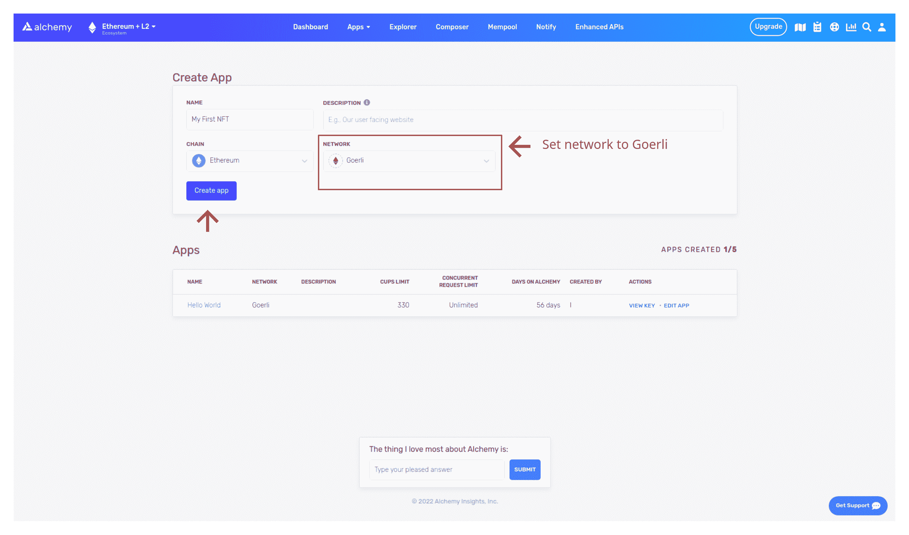
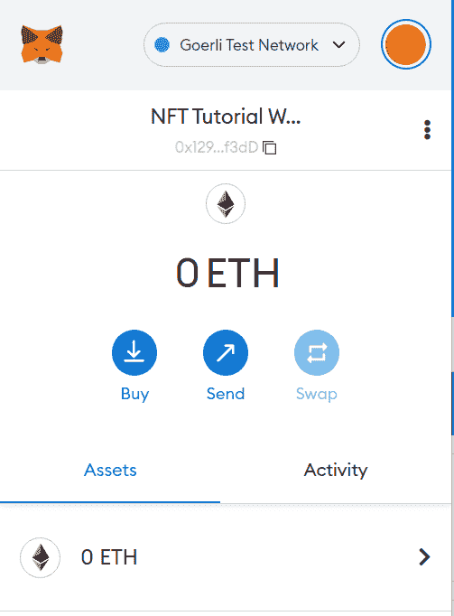
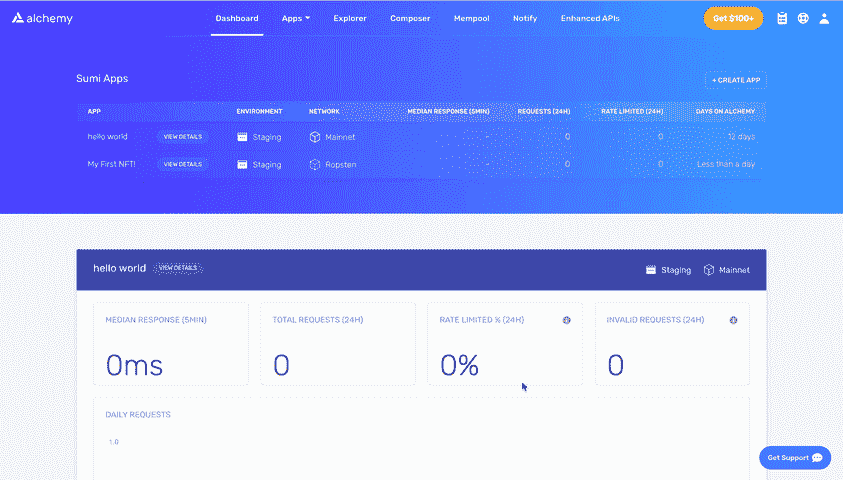
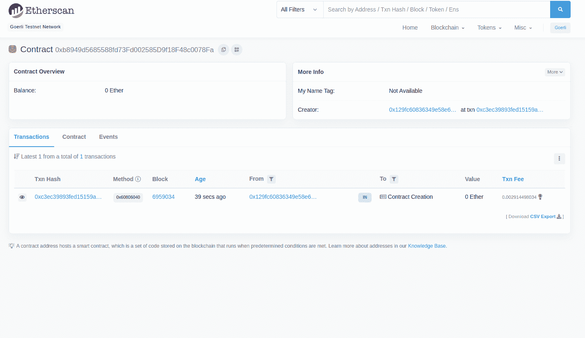
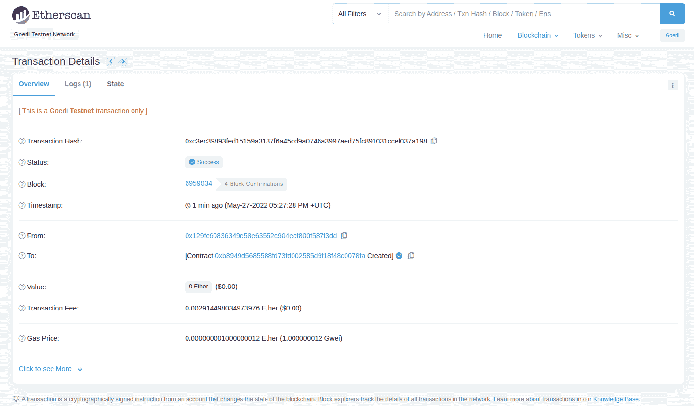
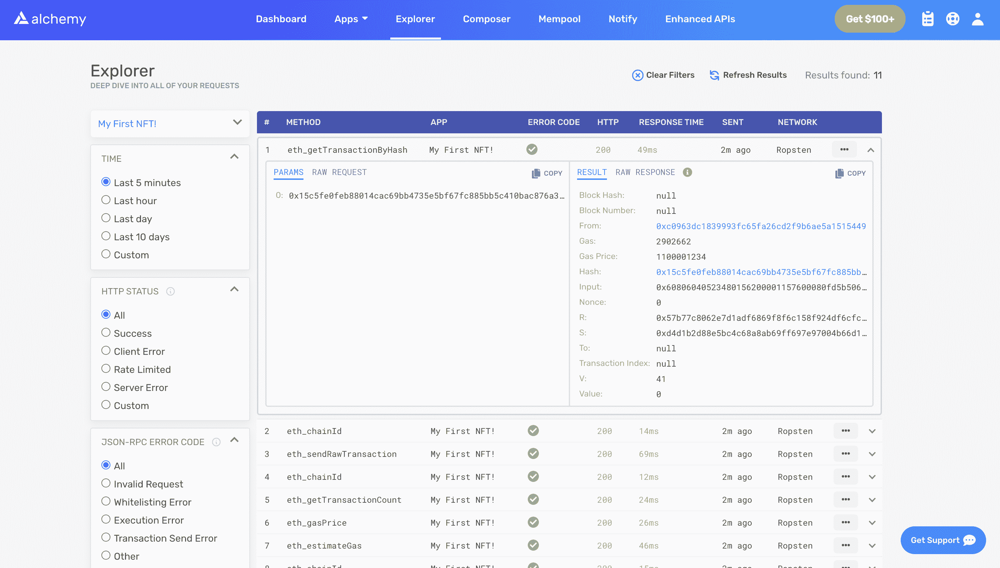

# 如何创建 NFT

> 原文：<https://www.web3.university/tracks/build-your-first-nft/how-to-create-an-nft>

本教程将引导您使用以太坊和行星间文件系统(IPFS)编写和部署一个不可替换的(ERC721)令牌智能合约。

*完成本指南的预计时间:~15 分钟*

即使你一直生活在岩石下，你也会注意到每一个主要的新闻媒体都在报道非功能性翻译的兴起。

随着 NFTs 将区块链带入公众视野，现在是一个在区块链以太坊上发布自己的 NFT (ERC-721 令牌)来了解炒作的绝佳机会！

在本教程中，我们将使用 [Metamask](https://metamask.io/) 、 [Solidity](https://docs.soliditylang.org/en/v0.8.0/) 、 [Hardhat](https://hardhat.org/) 、 [Pinata](https://pinata.cloud/) 和 [Alchemy](https://alchemy.com/?r=affiliate:68212b46-a5c5-4f4c-bc8b-73f50536fcaf) 在 Goerli 测试网络上创建和部署一个 ERC-721 智能合约(如果您还不明白这些是什么意思，请不要着急，我们会解释的)。

## 步骤 1:连接以太坊网络

有很多方法可以向以太坊区块链发出请求，但为了使事情变得简单，我们将使用一个在 [Alchemy](https://alchemy.com/?r=affiliate:68212b46-a5c5-4f4c-bc8b-73f50536fcaf) 上的免费帐户，这是一个区块链开发者平台和 API，允许我们与以太坊链通信，而不必运行我们自己的节点。

在本教程中，我们还将利用 Alchemy 的开发人员工具进行监控和分析，以了解我们的智能合约部署中到底发生了什么。

#### 如果你还没有炼金术账户，你可以在这里免费注册。

## 步骤 2:创建你的应用程序(和 API 密匙)

创建 Alchemy 帐户后，您可以通过创建应用程序来生成 API 密钥。这将允许我们向 Goerli 测试网络发出请求。如果你想了解更多关于测试网络的信息，请查看本指南。

1.  将鼠标悬停在导航栏中的“应用程序”上，点击“创建应用程序”,导航至 Alchemy Dashboard 中的“创建应用程序”页面


1.  给你的应用命名(我们选择了“我的第一个 NFT！”)，提供简短描述，为环境选择“Staging”(用于您的应用程序记账)，为您的网络选择“Goerli”。



1.  点击“创建应用程序”就可以了！你的应用应该出现在下表中。

## 第三步:创建一个以太坊账户(地址)

我们需要一个以太坊账户来发送和接收交易。在本教程中，我们将使用 Metamask，这是浏览器中的一个虚拟钱包，用于管理您的以太坊帐户地址。如果你想了解更多关于以太坊交易的工作原理，请查看以太坊基金会的页面。

你可以在这里免费下载并创建一个元掩码账户[。当你正在创建一个账户时，或者如果你已经有了一个账户，请确保切换到右上角的“Goerli 测试网络”(这样我们就不用处理真钱了)。](https://metamask.io/download.html)



## 从水龙头中加入 Ethers

为了将我们的智能合同部署到测试网络，我们需要一些假的 Eth。要获取 Eth，您可以进入 Goerli 水龙头并输入您的 Goerli 帐户地址，然后点击“发送 Eth 给我”你应该很快就会在你的 Metamask 账户中看到 Eth！

## 第五步:检查你的余额

为了再次检查我们的余额，让我们使用 [Alchemy 的 composer 工具](https://composer.alchemyapi.io/?composer_state=%7B%22network%22%3A0%2C%22methodName%22%3A%22eth_getBalance%22%2C%22paramValues%22%3A%5B%22%22%2C%22latest%22%5D%7D)发出一个 [eth_getBalance](https://docs.alchemyapi.io/alchemy/documentation/alchemy-api-reference/json-rpc#eth_getbalance) 请求。这将返回我们钱包中 Eth 的数量。在您输入元掩码帐户地址并单击“发送请求”后，您应该会看到如下响应:

{"jsonrpc": "2.0 "，" id": 0，" result ":" 0x de 0 b 6b 3b 7640000 " }

**注:**此结果在魏未 eth。卫是 Ethers 的最小单位。从卫到 eth 的换算是:1 eth = 10 卫。因此，如果我们将 0xde0b6b3a7640000 转换为十进制，我们会得到 1*10 ⁸，等于 1 eth。

唷！我们的假钱都在那里！🤑

## 步骤 6:初始化我们的项目

首先，我们需要为我们的项目创建一个文件夹。导航到您的[命令行](https://www.computerhope.com/jargon/c/commandi.htm)并键入:

```js
-- CODE language-js line-numbers --
mkdir my-nft
cd my-nft

```

现在我们在项目文件夹中，我们将使用 npm init 来初始化项目。如果你还没有安装 npm，请按照这些说明(我们还需要 [Node.js](https://nodejs.org/en/download/) ，所以也下载吧！).

```js
-- CODE language-js line-numbers --
npm init

```

如何回答安装问题并不重要，以下是我们的参考方法:

```js
-- CODE language-js line-numbers --
package name: (my-nft) 
version: (1.0.0) 
description: My first NFT!
entry point: (index.js) 
test command: 
git repository: 
keywords: 
author: 
license: (ISC) 
About to write to /Users/thesuperb1/Desktop/my-nft/package.json:

{
  "name": "my-nft",
  "version": "1.0.0",
  "description": "My first NFT!",
  "main": "index.js",
  "scripts": {
    "test": "echo \"Error: no test specified\" && exit 1"
  },
  "author": "",
  "license": "ISC"
}

```

批准 package.json，我们就可以开始了！

第七步:下载[安全帽](https://hardhat.org/getting-started/#overview)

Hardhat 是一个编译、部署、测试和调试以太坊软件的开发环境。在部署到活动链之前，它可以帮助开发人员在本地构建智能合约和 dApps。

导航到终端并确保您在 my-nft 项目文件夹中，然后运行:

```js
-- CODE language-js line-numbers --
npm install --save-dev hardhat

```

查看本页了解更多关于[安装说明](https://hardhat.org/getting-started/#overview)的详细信息。

## 步骤 8:创建安全帽项目

在我们的项目文件夹中运行:

```js
-- CODE language-js line-numbers --
npx hardhat

```

然后，您应该会看到一条欢迎消息和一个选择您想要做什么的选项。选择“创建一个空的 hardhat.config.js”:

```
-- CODE language-js line-numbers --
888    888                      888 888               888
888    888                      888 888               888
888    888                      888 888               888
8888888888  8888b.  888d888 .d88888 88888b.   8888b.  888888
888    888     "88b 888P"  d88" 888 888 "88b     "88b 888
888    888 .d888888 888    888  888 888  888 .d888888 888
888    888 888  888 888    Y88b 888 888  888 888  888 Y88b.
888    888 "Y888888 888     "Y88888 888  888 "Y888888  "Y888
👷 Welcome to Hardhat v2.0.11 👷‍
? What do you want to do? …
Create a sample project
❯ Create an empty hardhat.config.js
Quit

```js

这将为我们生成一个 **hardhat.config.js** 文件，我们将在这里为我们的项目指定所有的设置(在步骤 13)。

## 步骤 9:添加项目文件夹

为了保持我们的项目有条理，我们将创建两个新文件夹。在命令行中导航到项目的根目录，然后键入:

```
-- CODE language-js line-numbers --
mkdir contracts
mkdir scripts

```js

**contracts/** 是我们保存 NFT 智能合同代码的地方

**scripts/** 是我们保存脚本以部署智能合同并与之交互的地方

## 第十步:写合同

现在我们的环境已经设置好了，接下来是更令人兴奋的事情:编写我们的智能契约代码！

在你最喜欢的编辑器中打开 my-nft 项目(我们喜欢 [VSCode](https://code.visualstudio.com) )。智能合约是用一种叫做 Solidity 的语言编写的，我们将用它来编写 MyNFT.sol 智能合约。‌

1.导航到“contracts”文件夹，创建一个名为 MyNFT.sol 的新文件

2.下面是我们的 NFT 智能合约代码，它基于 OpenZeppelin 库的 ERC721 实现。将下面的内容复制并粘贴到 MyNFT.sol 文件中。

> 注:如果你想通过智能合约给 NFT 定价，请查看本教程。

```
-- CODE language-js line-numbers --
//Contract based on https://docs.openzeppelin.com/contracts/3.x/erc721
// SPDX-License-Identifier: MIT
pragma solidity ^0.7.3;

import "@openzeppelin/contracts/token/ERC721/ERC721.sol";
import "@openzeppelin/contracts/utils/Counters.sol";
import "@openzeppelin/contracts/access/Ownable.sol";

contract MyNFT is ERC721, Ownable {
    using Counters for Counters.Counter;
    Counters.Counter private _tokenIds;

    constructor() public ERC721("MyNFT", "NFT") {}

    function mintNFT(address recipient, string memory tokenURI)
        public onlyOwner
        returns (uint256)
    {
        _tokenIds.increment();

        uint256 newItemId = _tokenIds.current();
        _mint(recipient, newItemId);
        _setTokenURI(newItemId, tokenURI);

        return newItemId;
    }
}

```js

1.因为我们从 OpenZepplin contracts 库继承类，所以在命令行中运行以下命令将库安装到我们的文件夹中:

**npm install @openzeppelin/ [【邮件保护】](/cdn-cgi/l/email-protection)**

那么，这段代码具体做什么呢？让我们一行一行地分解它。

在第 5-7 行，我们的代码继承了三个[openzeplin](https://openzeppelin.com)智能契约类:

-@ open zeppelin/contracts/token/ERC721/ERC 721 . sol 包含 ERC 721 标准的实现，我们的 NFT 智能合约将继承它。(要成为有效的 NFT，您的智能合约必须实现 ERC721 标准的所有方法。)要了解关于继承的 ERC721 函数的更多信息，请查看这里的接口定义。

-@ open zeppelin/contracts/utils/counters . sol 提供只能递增或递减 1 的计数器。我们的智能合约使用一个计数器来跟踪制造的 NFT 的总数，并为我们的新 NFT 设置唯一的 ID。使用智能合约创建的每个 NFT 都必须分配一个唯一的 ID，这里我们的唯一 ID 只是由现有的 NFT 总数决定的。例如，我们用智能合约创建的第一个 NFT 的 ID 为“1”，第二个 NFT 的 ID 为“2”，等等。

-@ open zeppelin/contracts/access/own able . sol 在我们的智能合约上设置了[访问控制](https://docs.openzeppelin.com/contracts/3.x/access-control)，所以只有智能合约的拥有者(你)才能铸造 NFT。注意，包括访问控制完全是一种偏好。如果你想让任何人都能够使用你的智能合约来铸造 NFT，去掉第 10 行的 Ownable 和第 17 行的 onlyOwner。

在第 10-28 行，我们有自定义的 NFT 智能契约，它出奇的短——它只包含一个计数器、一个构造函数和一个函数！这要感谢我们继承的 OpenZepplin 契约，它实现了创建 NFT 所需的大多数方法，例如 ownerOf(返回 NFT 的所有者)和 transferFrom(转移 NFT 的所有权)。

在第 14 行，你会注意到我们将两个字符串“MyNFT”和“NFT”传递给了 ERC721 构造函数。第一个变量是智能合约的名称，第二个变量是它的符号。您可以随意命名这些变量！

最后，从第 16 行开始，我们有一个函数 mintNFT()，它允许我们创建一个 NFT！您会注意到这个函数接受两个变量:

- address recipient 指定接收您新制作的 NFT 的地址

-字符串内存 tokenURI 是一个字符串，它应该解析为描述 NFT 元数据的 JSON 文档。NFT 的元数据真正赋予了它生命，允许它拥有额外的属性，如名称、描述、图像和其他属性。在本教程的第 2 部分，我们将描述如何配置这些元数据。

**mintNFT** 从继承的 ERC721 库中调用一些方法，最终返回一个数字，表示新生成的 NFT 的 ID。

## 步骤 11:将元蒙版和炼金术连接到你的项目中

现在，我们已经创建了 Metamask 钱包、Alchemy 帐户，并编写了我们的智能合同，是时候将这三者连接起来了。

从您的虚拟钱包发送的每笔交易都需要使用您唯一的私钥进行签名。为了给我们的程序提供这种许可，我们可以安全地将我们的私钥(和 Alchemy API 密钥)存储在一个环境文件中。

要了解更多关于发送事务的信息，请查看关于使用 web3 发送事务的教程。

首先，在您的项目目录中安装 dotenv 包:

```
-- CODE language-js line-numbers --
npm install dotenv --save

```js

然后，创建一个**。env** 文件，并将您的元掩码私钥和 HTTP Alchemy API URL 添加到其中。

注意:你的。env 文件必须命名。env！不要将名称更改为 xx.env

-按照这些说明从元掩码中导出您的私钥

-见下文获取 HTTP Alchemy API URL 并将其复制到您的剪贴板



你的**。env** 应该是这样的:

```
-- CODE language-js line-numbers --
API_URL = "https://eth-goerli.alchemyapi.io/v2/your-api-key"
PRIVATE_KEY = "your-metamask-private-key"

```js

## 步骤 12:安装 Ethers.js

Ethers.js 是一个库，通过用更加用户友好的方法包装标准 JSON-RPC 方法，使得与以太坊交互和向以太坊发出请求变得更加容易。

Hardhat 使得集成[插件](https://hardhat.org/plugins/)以获得额外的工具和扩展的功能变得非常容易。我们将利用 [Ethers 插件](https://hardhat.org/plugins/nomiclabs-hardhat-ethers.html)进行契约部署( [Ethers.js](https://github.com/ethers-io/ethers.js/) 有一些超级干净的契约部署方法)。

在您的项目目录中键入:

```
-- CODE language-js line-numbers --
npm install --save-dev @nomiclabs/hardhat-ethers "[email protected]^5.0.0"

```js

在下一步中，我们还需要在我们的 **hardhat.config.js** 中使用 ethers。

## 步骤 13:更新 hardhat.config.js

到目前为止，我们已经添加了几个依赖项和插件，现在我们需要更新 **hardhat.config.js** 以便我们的项目知道所有这些。

将您的 **hardhat.config.js** 更新为如下所示:

```
-- CODE language-js line-numbers --
/**
* @type import('hardhat/config').HardhatUserConfig
*/
require('dotenv').config();
require("@nomiclabs/hardhat-ethers");
const { API_URL, PRIVATE_KEY } = process.env;
module.exports = {
   solidity: "0.7.3",
   defaultNetwork: "goerli",
   networks: {
      hardhat: {},
      goerli: {
         url: API_URL,
         accounts: [`0x${PRIVATE_KEY}`]
      }
   },
}

```js

## 第 14 步:编辑我们的合同

为了确保到目前为止一切正常，让我们来编辑我们的合同。编译任务是内置的 hardhat 任务之一。

从命令行运行:

```
-- CODE language-js line-numbers --
npx hardhat compile

```js

您可能会得到一个关于源文件中没有提供 SPDX 许可证标识符的警告，但是没有必要担心这个——希望其他一切看起来都很好！如果没有，你可以随时在[炼金术不和谐](https://discord.gg/u72VCg3)中留言。

## 步骤 15:编写我们的部署脚本

既然我们的合同已经写好，配置文件也准备好了，那么是时候写我们的合同部署脚本了。

导航到**脚本/** 文件夹，创建一个名为 **deploy.js** 的新文件，向其中添加以下内容:

```
-- CODE language-js line-numbers --
async function main() {
   // Grab the contract factory 
   const MyNFT = await ethers.getContractFactory("MyNFT");

   // Start deployment, returning a promise that resolves to a contract object
   const myNFT = await MyNFT.deploy(); // Instance of the contract 
   console.log("Contract deployed to address:", myNFT.address);
}

main()
  .then(() => process.exit(0))
  .catch(error => {
    console.error(error);
    process.exit(1);
  });

```js

Hardhat 在他们的[合同教程](https://hardhat.org/tutorial/testing-contracts.html#writing-tests)中很好地解释了每一行代码的作用，我们在这里采用了他们的解释。

```
-- CODE language-js line-numbers --
const MyNFT = await ethers.getContractFactory("MyNFT");

```js

ethers.js 中的 **ContractFactory** 是用于部署新智能合约的抽象，所以这里的 MyNFT 是我们的 NFT 合约实例的工厂。当使用**安全帽-Ethers**插件**合同工厂**和**合同**实例时，默认连接到第一个签名者。

```
-- CODE language-js line-numbers --
 const myNFT = await MyNFT.deploy();

```js

在 **ContractFactory** 上调用 **deploy()** 将启动部署，并返回解析为**合同的**承诺**。**这个对象为我们的每个智能合约函数提供了一个方法。

## 步骤 16:部署我们的合同

我们终于准备好部署智能合同了！导航回项目目录的根目录，并在命令行中运行:

```
-- CODE language-js line-numbers --
npx hardhat run scripts/deploy.js --network goerli

```js

然后，您应该会看到类似这样的内容:

```
-- CODE language-js line-numbers --
Contract deployed to address: 0xb8949d5685588fd73Fd002585D9f18F48c0078Fa

```

如果我们去 Goerli etherscan 搜索我们的合同地址，我们应该能够看到它已经成功部署。该事务将类似于以下内容:



**From** 地址应该与您的元掩码帐户地址相匹配，而 To 地址将显示“合同创建”如果我们点击进入交易，我们将在**至**字段中看到我们的合同地址:



亚丝斯！你刚刚把你的 NFT 智能合同部署到以太坊连锁店🎉

为了了解幕后发生了什么，让我们导航到我们的[炼金术仪表板](https://dashboard.alchemyapi.io/signup?referral=affiliate:68212b46-a5c5-4f4c-bc8b-73f50536fcaf)中的 Explorer 选项卡。如果您有多个 Alchemy 应用程序，请确保按应用程序过滤并选择“MyNFT”。



在这里你会看到一些 JSON-RPC 调用，当我们调用**时，它们是由 Hardhat/Ethers 为我们做的。deploy()** 函数。

这里要调用的两个重要的函数是[**eth _ sendRawTransaction**](https://docs.alchemyapi.io/alchemy/documentation/alchemy-api-reference/json-rpc#eth_sendrawtransaction)，这是将我们的智能契约实际写入 Goerli 链的请求，以及[**eth _ getTransactionByHash**](https://docs.alchemyapi.io/alchemy/documentation/alchemy-api-reference/json-rpc#eth_gettransactionbyhash)，这是在给定 Hash(发送事务时的典型模式)的情况下读取关于我们的事务的信息的请求。

要了解更多关于发送事务的信息，请查看这篇关于使用 Web3 发送事务的教程。